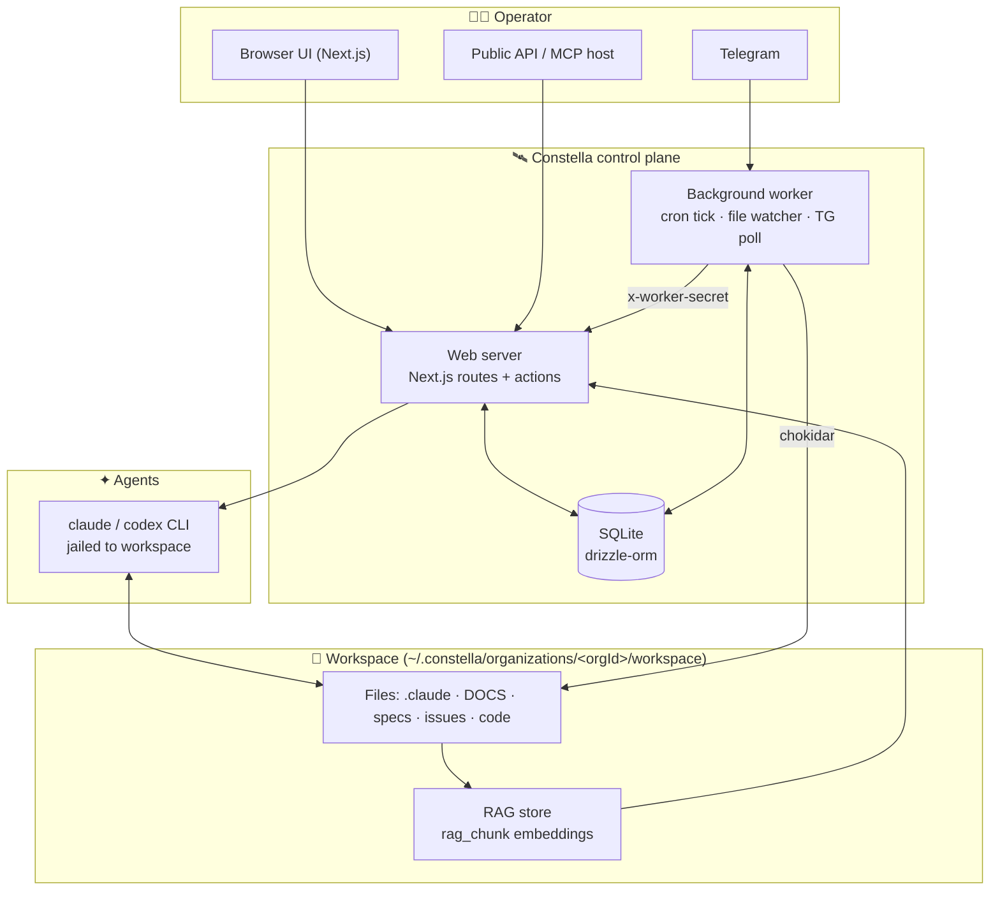
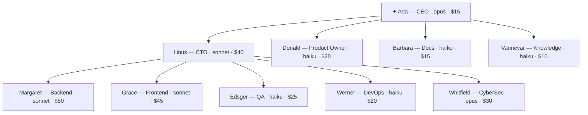
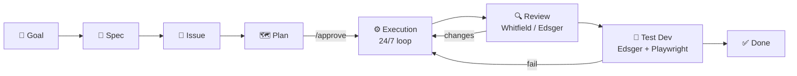
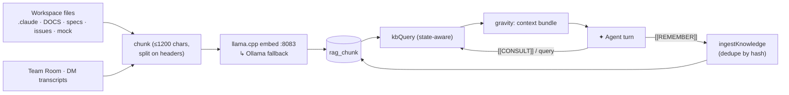
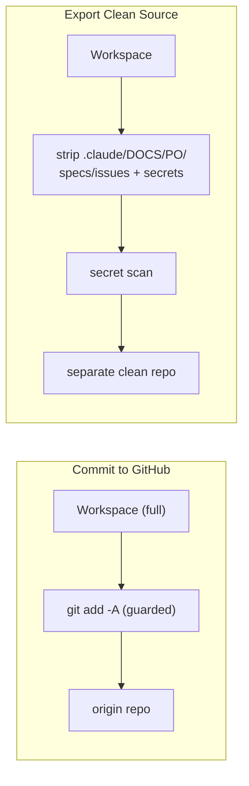

<!-- ✦ ⋆ ｡˚ Constella ˚｡ ⋆ ✦ -->
<p align="center">
  
</p>

<p align="center">
  <a href="https://www.npmjs.com/package/constellai"></a>
  <a href="https://github.com/gabriel7silva/constella/releases/latest"></a>
  <a href="#-quickstart"></a>
  
  
  
</p>

<p align="center">
  <a href="#-quickstart">Quickstart</a> ·
  <a href="#-install--run">Install & run</a> ·
  <a href="#-a-tour-of-the-cockpit">Screens</a> ·
  <a href="#-architecture">Architecture</a> ·
  <a href="#-the-agent-constellation">Agents</a> ·
  <a href="#-the-work-lifecycle">Lifecycle</a> ·
  <a href="#-documentation-map">Docs</a> ·
  <a href="README.pt-BR.md">🇧🇷 Português</a>
</p>

# ✦ ⋆ ｡˚ Constella ˚｡ ⋆ ✦

**A cosmic control plane for autonomous AI agent-companies.**
Real `claude` / `codex` agents that plan, build, review and ship — on your machine, your models, your rules.

> 🌌 **Constella turns a single brief into a working software team.** A CEO agent (Ada) reads your
> goal, drafts specs, breaks them into issues, plans the work, and a roster of role agents executes it
> 24/7 — writing real code in a real workspace, using local or cloud models, with budgets, skills,
> RAG memory, GitHub/Telegram integration and a deploy pipeline. **Nothing is faked.**

> ⚙️ **Compatibility status** — Constella is young and not yet tested in every environment:
> - **Windows** — primary platform (developed + tested here)
> - **Linux** — experimental; works normally, still in active testing
> - **macOS** — not tested yet (no Mac on hand 😅)
> - **Portable (USB) mode** — in validation

<p align="center"></p>

## 🪐 What is Constella?

Constella is a **local-first orchestration platform** that runs an autonomous *agent-company*. You give it
a goal; it gives you a team. A CEO agent plans, role agents build, a security agent reviews, a QA agent
tests, and the whole thing runs on your hardware against the models you choose.

It is **not a simulation**. Under the hood, every agent is a real `claude` or `codex` CLI process spawned
in a real, sandboxed workspace on disk. The code they write is real code. The retrieval is real
embeddings in a real vector store. The GitHub commits, the Telegram messages, the deploy pipeline — all
real. The cosmic theme is the skin; the engine is a production Next.js + SQLite application with a
24/7 background worker.

| | |
|---|---|
| 🛰️ **Central ship** | A Next.js control plane (web UI + API) you reach in the browser |
| ✦ **Constellations** | A roster of 10 role agents (CEO → CTO → engineers, QA, DevOps, docs, security, knowledge) |
| 🌌 **Memory nebula** | A curated Knowledge Base + RAG over embeddings, indexing every doc and conversation |
| 🕳️ **Gravity** | Context assembly that pulls the right specs, skills, decisions and memory into each prompt |
| 🚀 **Launch** | A deploy pipeline that produces a clean, secret-scanned export of your product |

<p align="center"></p>

## 🚀 Quickstart

> **Requirements:** Node.js **≥ 20**, plus the `claude` and/or `codex` CLI installed and logged in for
> agent execution. Local models (GGUF via llama.cpp / Ollama) are optional.

**On your computer (laptop / desktop)** — install the CLI once, then start it:

```bash
# 1) Install the CLI once (Node >= 20):
npm install -g constellai

# 2) Start the local server (Ctrl-C to stop):
constella --start        # local server, binds 127.0.0.1
# first run: create your account (name + email + password) → log in
constella --portable     # run from a USB drive (>= 32 GB)
constella --onboarding   # re-run the setup wizard

# Update / uninstall:
npm install -g constellai@latest
npm uninstall -g constellai

# Prefer not to install? Run it once, ephemerally:
npx constellai --start
```

> A launch flag is required — a bare `constella` prints usage.
> **Authentication is always on:** first run with no account shows a signup screen (name + email + password)
> that creates the single operator; every run after that asks you to log in.

**On a server (VPS — Ubuntu)** — **one command**, no clone and no script:

```bash
# Quick try — auto-installs + joins Tailscale and serves on your tailnet (foreground, no service):
npx constellai --vps   # reach it at  http://<tailscale-ip>:3000   (tailscale ip -4)

# Managed 24/7 (recommended) — native, no Docker. Installs Node + the CLI + Tailscale and registers a
# systemd service (starts on boot, restarts on crash):
curl -fsSL https://raw.githubusercontent.com/gabriel7silva/constella/main/scripts/install.sh | bash -s -- --vps
```

> **Troubleshooting** — if `npx constellai` fails with `E404` because a global `~/.npmrc` points npx at a private registry, force the public one: `npx --registry https://registry.npmjs.org constellai --start`.

Manage it with systemd (`systemctl status|restart constella`, `journalctl -u constella -f`). Update it **while it keeps running** — a ~2–3s restart, your `~/.constella` (DB, secrets, login) preserved — with `curl -fsSL https://raw.githubusercontent.com/gabriel7silva/constella/main/scripts/vps-update.sh | bash` (append ` -s -- <version>` to pin or roll back; or `bash scripts/vps-update.sh [version]` from a checkout). See [VPS Mode](docs/en/VPS_MODE.md) and [Operations](docs/en/OPERATIONS.md).

The launcher persists your data under `~/.constella` (database, secrets, per-organization workspaces),
generates session/vault/worker secrets on first run, applies database migrations, then supervises **two
processes**: the **web** server and a **background worker** (cron tick, file watcher, Telegram polling).

→ Full guide: **[Installation](docs/en/INSTALLATION.md)** · **[Onboarding](docs/en/ONBOARDING.md)** · **[Configuration](docs/en/CONFIGURATION.md)**

<p align="center"></p>

## 🌠 Install & run

The launch flag is an **install target**, not an auth mode — it only picks where the control plane lives and
what network interface the server binds to. **Authentication is identical everywhere: email + password.**

| Install target | Launch flag    | Bind                    | Use case                                                     |
| -------------- | -------------- | ----------------------- | ------------------------------------------------------------ |
| Local          | `--start`      | `127.0.0.1`             | Quick local use on your own machine                          |
| VPS            | `--vps`        | `0.0.0.0` via Tailscale | A remote server reached privately over your tailnet          |
| USB            | `--portable`   | `0.0.0.0`               | A pen-drive carrying app + models + projects across machines |

A launch flag is required (a bare `constella` prints usage).
First run with no account shows a **signup** screen (name + email + password) that creates the single
operator; afterwards every run requires **login**. A real `BETTER_AUTH_SECRET` is always mandatory — the
launcher generates one on first boot — so sessions can never be forged.

→ Deep dives: **[Start](docs/en/START_MODE.md)** · **[VPS](docs/en/VPS_MODE.md)** · **[Portable](docs/en/PORTABLE_MODE.md)**

<p align="center"></p>

## ✨ Features

- ✦ **Real agents, real workspace** — every agent is a real agent-CLI subprocess (`claude`, `codex`,
  `openclaw`, `hermes`, `aider`, `opencode`, …) jailed to its organization's workspace directory; nothing
  is mocked.
- 🛰️ **A full agent-company** — 10 role agents with a reporting hierarchy, per-agent models and **daily
  cost caps**.
- 🌌 **Goal → Spec → Issue → Plan → Execution → Review → Test → Done** — a complete, status-tracked work
  lifecycle with a 24/7 autonomous loop.
- 🧠 **Knowledge Base + RAG memory** — curated, typed, deduplicated knowledge plus semantic retrieval over
  a local embedding server, with a dedicated Knowledge agent that curates and proposes new skills.
- 🪐 **Any agent CLI, local or cloud models** — Claude Code and Codex by default, plus **OpenClaw,
  Hermes, Aider, OpenCode, GitHub Copilot, Cursor, Cline and Kilo Code** (each agent picks its own
  adapter); plus a local **GGUF** catalog with GPU fit-checking and llama.cpp/Ollama serving.
- 📚 **Skills, Stacks & Plugins** — a **500+** native Markdown skills library with a category filter; a
  universal subset is always on, the rest matched to your tech stack and agent roles.
- 🤖 **Integrations** — GitHub (commit / clean export), Telegram (remote control), a PAT-secured **Public
  API**, and an **MCP server** so any AI host can drive Constella.
- 🚀 **Prepare Deploy & Test Dev** — boot and headlessly test the project, then export a clean,
  secret-scanned product source.
- 🔐 **Security by design** — filesystem jail, AES-256-GCM vault, secret scrubbing, command guard, file
  locks, 2FA/passkeys.

<p align="center"></p>

## 🖥️ A tour of the cockpit

Every screen below is the real app — nothing mocked.

### 🏠 Home
<p align="center"></p>

Your operational home: the org header (mission, agents working, spend, goal progress) plus one unified
**Ask anything** thread spanning Team Room / Direct / Telegram — query the Knowledge Base, `@mention` an
agent, or run a `/command`, all in one place.

### 📊 Dashboard
<p align="center"></p>

The cockpit at a glance: agents active, spend vs cap, security grade and goal progress, a **System Health**
grid (dev server, deploy, agent loop, KB/RAG, database, models, GitHub, Telegram, queues, file locks,
updates), the current execution, tasks-by-status and your active agents.

### 🗂️ CEO Planner
<p align="center"></p>
<p align="center"></p>

Ada turns the brief into specs → issues → an **approval gate before any code**: a 7-step pipeline (context →
analyse → specs → issues → approval → 24/7 code → reports), an optional **Design step** that holds the plan
until the prototype is approved, and per-spec Approve/Reject cards. **No agent writes code until you press
Approve plan.**

### 🎨 Design
<p align="center"></p>

Prototype the UI with **Grace** (the frontend agent) before the plan: a live canvas rendering her real
generated screens, a Select / Edit / Markup / Comments / Inspect / Preview toolbar, zoom + viewport, side
rails (Layers · Screens · Styles · Docs · History · Comments), and **Approve** to lock the official visual
reference (zero-drift).

### 🌌 Knowledge
<p align="center"></p>
<p align="center"></p>

The Knowledge Base — the project's single source of truth, curated by **Vannevar**: KB entries, RAG chunks,
embedded %, index health and lifecycle; the Goal↔Spec↔Issue↔file↔knowledge graph; coverage gaps; and
editable **canonical blocks** (business rules, current architecture, glossary, mission, security patterns,
technical decisions…).

### ✦ Skills
<p align="center"></p>

The Markdown procedure library indexed into the agents' RAG: search + a **category filter** (Core · Design ·
Engineering · Front-end · Languages · Meta · Process · Stacks), per-skill cards showing indexed status, the
native flag and linked agents, plus Add skill / Generate with AI / Suggest from learnings.

### 🧠 Models
<p align="center"></p>

Provider catalog, connected providers and local runtime: catalog / available / planned / connected counts, a
hardware auto-probe (CPU / GPU / VRAM) that fit-checks a quantization, the llama.cpp chat + embeddings
servers, and a downloadable **GGUF** catalog filtered to what fits your VRAM.

### ✈️ Telegram
<p align="center"></p>

Connect a bot to drive the CEO from your phone: an **isolated** chat thread (it never mixes with the Team
Room or DMs), a bot-token + chat-id allowlist, and the token stored encrypted.

<p align="center"></p>

## 🛰️ Architecture

Constella boots a supervised **web + worker** pair over a SQLite database and a per-organization workspace
on disk. The directory tree is the source of truth; the database indexes it.



→ **[Architecture](docs/en/ARCHITECTURE.md)** · **[AI Architecture](docs/en/AI_ARCHITECTURE.md)** · **[Security](docs/en/SECURITY.md)**

<p align="center"></p>

## ✦ The agent constellation

Ten agents are seeded into every workspace, each with a persona file, a model, a tier and a **daily USD
cost cap**. They report through a hierarchy and coordinate in the **Team Room** by `@mention`.

<p align="center">
  
</p>



| Agent | Handle | Role | Reports to | Model | Daily cap |
|-------|--------|------|-----------|-------|-----------|
| Ada | `ada` | CEO | — | opus | $15 |
| Linus | `linus` | CTO | ada | sonnet | $40 |
| Donald | `donald` | Product Owner | ada | haiku | $20 |
| Margaret | `margaret` | Backend | linus | sonnet | $50 |
| Grace | `grace` | Frontend | linus | sonnet | $45 |
| Edsger | `edsger` | QA | linus | haiku | $25 |
| Werner | `werner` | DevOps | linus | haiku | $20 |
| Barbara | `barbara` | Docs | ada | haiku | $15 |
| Whitfield | `whitfield` | CyberSec | linus | opus | $30 |
| Vannevar | `vannevar` | Knowledge | ada | haiku | $10 |

> [!NOTE]
> **These models and daily caps are the Claude Code defaults, not a Claude-only limit.** Every agent is
> independently reconfigurable in **Agent Studio → Model**: pick any **provider / adapter** — Claude Code,
> Codex, OpenClaw, Hermes, Aider, OpenCode, GitHub Copilot, Cursor, Cline, Kilo Code, or a local **GGUF** —
> and the **model menu changes to that provider's models** (`opus`/`sonnet`/`haiku` for Claude Code,
> `gpt-5-codex`/`o4-mini` for Codex, provider-routed ids for the rest, the loaded GGUF for local).
> **Tiers are provider-agnostic:** a flagship reasoning model on *any* provider — a top Codex/GPT run at
> high reasoning, a top Gemini, etc. — sits at the same **Opus-class / `critical`** power-and-cost tier,
> while smaller/faster models (`o4-mini`, a "flash", `haiku`) map to the **`light`** end. Each agent keeps
> its own editable **daily cap (USD)** and a **tier floor** (`light` / `heavy` / `critical`); the model
> menu switches automatically with the provider, and you set the cap to match the model you choose. Real
> per-run cost is read from the CLI's reported usage — CLIs that emit none record **`$0`** honestly. See
> **[Models](docs/en/MODELS.md)** for the full adapter/cost table.

→ **[Agents](docs/en/AGENTS.md)** · **[KB Agent (Vannevar)](docs/en/KB_AGENT.md)** · **[PO Agent (Donald)](docs/en/PO_AGENT.md)** · **[Team Room](docs/en/TEAM_ROOM.md)** · **[DM](docs/en/DM.md)** · **[Chat commands](docs/en/CHAT_COMMANDS.md)**

<p align="center"></p>

## 🌌 The work lifecycle

New work is born from a DM to `@ada` (or `/new-goal`). Optionally **prototype the UI first in the Design
module** with Grace and approve it as the visual reference — the CEO Planner then holds the plan on that
design gate. The CEO drafts specs and issues; you approve; tasks materialize; the 24/7 loop executes,
reviews and tests until the goal is **done**.



| Entity | Statuses |
|--------|----------|
| Goal | `active` · `cancelled` · `archived` · `done` |
| Spec | `active` · `cancelled` · `archived` (+ `approved`) |
| Issue | `active` · `cancelled` · `archived`; column `todo` → `doing` → `blocked` → `review` → `done` |
| Task | column `triage` → `todo` → `doing` → `blocked` → `review` → `done` |
| Plan | `approved` + `auto247` (the 24/7 switch) |

→ **[Workflow](docs/en/WORKFLOW.md)** · **[Goals, Specs, Issues, Plans](docs/en/GOALS_SPECS_ISSUES.md)** · **[Inbox](docs/en/INBOX.md)**

<p align="center"></p>

## 🧠 The memory nebula — KB · RAG · Memory

Constella keeps two layers of memory: a **curated Knowledge Base** (typed, deduplicated, lifecycle-tracked
entries owned by Vannevar) and a **RAG layer** of embeddings over your workspace files and conversations.
Embeddings are served by a dedicated local llama.cpp embed server on `:8083` (with an Ollama fallback);
if no embedder is up, retrieval degrades gracefully to keyword search.



→ **[Knowledge Base & RAG](docs/en/KB_RAG.md)** · **[Memory RAG](docs/en/MEMORY_RAG.md)** · **[Synced Blocks](docs/en/SYNCED_BLOCKS.md)**

<p align="center"></p>

## 🪐 Models, Skills, Stacks & Plugins

- **Models** — cloud providers and **ten agent-CLI adapters**: `cli_claude_code`, `cli_codex`,
  `cli_openclaw`, `cli_hermes`, `cli_aider`, `cli_opencode`, `cli_copilot`, `cli_cursor`, `cli_cline`,
  `cli_kilo` (Claude Code is the default; the rest are experimental and route through their own logins),
  plus a local **GGUF** catalog from `lmstudio-community`. Hardware is fit-checked (CPU/RAM/GPU/VRAM) to
  recommend a quantization; a chat server runs on `:8082` and the embedder on `:8083`.
- **Skills** — a **500+** native Markdown library (`skills/<domain>/<name>/SKILL.md`) loaded by leaf-folder
  name, with a category filter (Core · Design · Engineering · Front-end · Languages · Meta · Process ·
  Stacks). ~23 universal skills are always on; the rest are matched to your project **stack** and each
  agent's **role**.
- **Project Stacks** — your chosen technologies drive which skills, research and RAG context flow into
  execution: **Stack → Skills → Research → RAG → Execution**.
- **Plugins** — native integrations (GitHub, Telegram, Vault, Web Search) toggled per workspace. *(Custom
  plugin installation is currently a stub — see the Plugins doc.)*

→ **[Models](docs/en/MODELS.md)** · **[Skills](docs/en/SKILLS.md)** · **[Project Stacks](docs/en/PROJECT_STACKS.md)** · **[Plugins](docs/en/PLUGINS.md)**

<p align="center"></p>

## 🤖 Integrations & remote control

| Integration | What it does |
|-------------|--------------|
| **GitHub** | Bind a repo with a PAT, track git status, **commit** product changes — or **export a clean, secret-scanned source** to a separate repo |
| **Telegram** | Drive Constella from your phone: approve plans, start/pause the 24/7 loop, ask the KB, create new work |
| **Public API** | A PAT-secured REST API (`Authorization: Bearer cn_…`) to read state and trigger actions |
| **MCP server** | `scripts/mcp-server.mjs` exposes the API as MCP tools so Claude Desktop / Cursor / any host can drive Constella |



→ **[GitHub](docs/en/GITHUB.md)** · **[Telegram](docs/en/TELEGRAM.md)** · **[Public API](docs/en/PUBLIC_API.md)** · **[MCP](docs/en/MCP.md)**

<p align="center"></p>

## 🚀 Launch — Test Dev, Prepare Deploy & Update

- **Test Dev** boots your project's dev server, drives it with a headless Chromium (Playwright), captures
  console/page/request errors, screenshots routes, and probes for leaked secrets — returning a
  `PASS` / `FAIL` / `INCONCLUSIVE` verdict.
- **Prepare Deploy** detects your framework, builds a clean tree (Constella control files + secrets
  stripped), runs a checklist, and produces an export gated by a secret scan.
- **Update** checks npm for a newer `constellai`, backs up your data, and runs the right update command for
  your context (`dev` / `npx` / `global` / `vps` / `portable`).

→ **[Test Dev](docs/en/TEST_DEV.md)** · **[Prepare Deploy](docs/en/PREPARE_DEPLOY.md)** · **[Deploy](docs/en/DEPLOY.md)** · **[Update](docs/en/UPDATE.md)** · **[Publishing](docs/en/PUBLISHING.md)**

<p align="center"></p>

## 🗺️ Documentation map

> Every document follows the same structure (purpose → how it works → flow → concepts → tables → diagrams →
> steps → examples → states → integrations → security → troubleshooting → links).
> Browse the index: **[docs/en/](docs/en/README.md)** · Portuguese: **[docs/pt/](docs/pt/README.md)**.

**🌱 Getting started**
[Installation](docs/en/INSTALLATION.md) · [Onboarding](docs/en/ONBOARDING.md) · [Configuration](docs/en/CONFIGURATION.md)

**🌠 Install & run**
[Start](docs/en/START_MODE.md) · [VPS](docs/en/VPS_MODE.md) · [Portable](docs/en/PORTABLE_MODE.md)

**🛰️ Architecture**
[Architecture](docs/en/ARCHITECTURE.md) · [AI Architecture](docs/en/AI_ARCHITECTURE.md) · [Security](docs/en/SECURITY.md)

**✦ Agents & work**
[Agents](docs/en/AGENTS.md) · [KB Agent](docs/en/KB_AGENT.md) · [PO Agent](docs/en/PO_AGENT.md) · [Workflow](docs/en/WORKFLOW.md) · [Goals · Specs · Issues](docs/en/GOALS_SPECS_ISSUES.md) · [Team Room](docs/en/TEAM_ROOM.md) · [DM](docs/en/DM.md) · [Chat Commands](docs/en/CHAT_COMMANDS.md) · [Inbox](docs/en/INBOX.md)

**🌌 Knowledge**
[Knowledge Base & RAG](docs/en/KB_RAG.md) · [Memory RAG](docs/en/MEMORY_RAG.md) · [Synced Blocks](docs/en/SYNCED_BLOCKS.md)

**🪐 Capabilities**
[Skills](docs/en/SKILLS.md) · [Project Stacks](docs/en/PROJECT_STACKS.md) · [Plugins](docs/en/PLUGINS.md) · [Models](docs/en/MODELS.md)

**🤖 Integrations**
[Telegram](docs/en/TELEGRAM.md) · [GitHub](docs/en/GITHUB.md) · [Public API](docs/en/PUBLIC_API.md) · [MCP](docs/en/MCP.md)

**🚀 Delivery & ops**
[Test Dev](docs/en/TEST_DEV.md) · [Prepare Deploy](docs/en/PREPARE_DEPLOY.md) · [Deploy](docs/en/DEPLOY.md) · [Publishing](docs/en/PUBLISHING.md) · [Update](docs/en/UPDATE.md) · [Troubleshooting](docs/en/TROUBLESHOOTING.md) · [FAQ](docs/en/FAQ.md)

Project history lives in the **[Changelog](CHANGELOG.md)** ([🇧🇷 PT](CHANGELOG.pt-BR.md)).

<p align="center"></p>

## 🔐 Security at a glance

Agents run jailed to their workspace directory (no path traversal, the root is never deletable). Provider
keys are encrypted at rest with AES-256-GCM in a local vault; secrets are scrubbed before they reach the
KB, Telegram or logs. A command guard blocks destructive shell, file locks prevent parallel-write
collisions, and authentication supports email/password, TOTP 2FA and WebAuthn passkeys.

→ **[Security](docs/en/SECURITY.md)** · **[Troubleshooting](docs/en/TROUBLESHOOTING.md)**

<p align="center"></p>

<p align="center">
  <sub>✦ ⋆ ｡˚ <b>Constella</b> · MIT License · built to run real agent-companies on your own machine ˚｡ ⋆ ✦</sub><br/>
  <sub><a href="README.pt-BR.md">🇧🇷 Versão em português</a> · <a href="docs/en/README.md">Documentation</a> · <a href="CHANGELOG.md">Changelog</a></sub>
</p>
