<!-- ✦ ⋆ ｡˚ Constella ˚｡ ⋆ ✦ -->
<p align="center">
  
</p>

<p align="center">
  <a href="https://www.npmjs.com/package/constellai"></a>
  <a href="https://github.com/gabriel7silva/constella/releases/latest"></a>
  <a href="#-início-rápido"></a>
  
  
  
</p>

<p align="center">
  <a href="#-início-rápido">Início rápido</a> ·
  <a href="#-instalação--execução">Instalação & execução</a> ·
  <a href="#-um-tour-pelo-cockpit">Telas</a> ·
  <a href="#-arquitetura">Arquitetura</a> ·
  <a href="#-a-constelação-de-agentes">Agentes</a> ·
  <a href="#-o-ciclo-de-trabalho">Ciclo</a> ·
  <a href="#-mapa-da-documentação">Docs</a> ·
  <a href="README.md">🇬🇧 English</a>
</p>

# ✦ ⋆ ｡˚ Constella ˚｡ ⋆ ✦

**Um plano de controle cósmico para agent-companies de IA autônomas.**
Agentes `claude` / `codex` reais que planejam, constroem, revisam e entregam — na sua máquina, com os seus modelos, sob as suas regras.

> 🌌 **A Constella transforma um único briefing em um time de software funcionando.** Uma agente CEO (Ada)
> lê o seu objetivo, redige especificações, quebra em issues, planeja o trabalho, e um elenco de agentes de
> papel o executa 24/7 — escrevendo código real em um workspace real, usando modelos locais ou na nuvem,
> com orçamentos, skills, memória RAG, integração com GitHub/Telegram e um pipeline de deploy. **Nada é
> falso.**

> ⚙️ **Status de compatibilidade** — a Constella é nova e ainda não foi testada em todos os ambientes:
> - **Windows** — plataforma principal (desenvolvida + testada aqui)
> - **Linux** — experimental; funciona normalmente, em fase de testes
> - **macOS** — não testado (não tenho um Mac 😅)
> - **Modo pen-drive (portátil)** — em validação

<p align="center"></p>

## 🪐 O que é a Constella?

A Constella é uma **plataforma de orquestração local-first** que opera uma *agent-company* autônoma. Você
dá um objetivo; ela devolve um time. Uma agente CEO planeja, agentes de papel constroem, um agente de
segurança revisa, um agente de QA testa, e tudo roda no seu hardware contra os modelos que você escolher.

**Não é uma simulação.** Por baixo, cada agente é um processo real do CLI `claude` ou `codex`, criado em um
workspace real e isolado em disco. O código que escrevem é código real. A recuperação é embeddings reais em
um vetor real. Os commits no GitHub, as mensagens no Telegram, o pipeline de deploy — tudo real. O tema
cósmico é a casca; o motor é uma aplicação Next.js + SQLite de produção com um worker em segundo plano 24/7.

| | |
|---|---|
| 🛰️ **Nave central** | Um plano de controle Next.js (UI web + API) acessado no navegador |
| ✦ **Constelações** | Um elenco de 10 agentes de papel (CEO → CTO → engenheiros, QA, DevOps, docs, segurança, conhecimento) |
| 🌌 **Nebulosa de memória** | Uma Base de Conhecimento curada + RAG sobre embeddings, indexando cada documento e conversa |
| 🕳️ **Gravidade** | Montagem de contexto que atrai as specs, skills, decisões e memória certas para cada prompt |
| 🚀 **Lançamento** | Um pipeline de deploy que produz um export limpo e escaneado contra segredos do seu produto |

<p align="center"></p>

## 🚀 Início rápido

> **Requisitos:** Node.js **≥ 20**, além do CLI `claude` e/ou `codex` instalado e logado para a execução
> dos agentes. Modelos locais (GGUF via llama.cpp / Ollama) são opcionais.

**No seu computador (notebook / desktop)** — instale o CLI uma vez, depois inicie:

```bash
# 1) Instale o CLI uma vez (Node >= 20):
npm install -g constellai

# 2) Inicie o servidor local (Ctrl-C para parar):
constella --start        # servidor local, escuta em 127.0.0.1
# primeira execução: crie sua conta (nome + e-mail + senha) → faça login
constella --portable     # rode a partir de um pendrive USB (>= 32 GB)
constella --onboarding   # rode o assistente de configuração

# Atualizar / desinstalar:
npm install -g constellai@latest
npm uninstall -g constellai

# Prefere não instalar? Rode uma vez, de forma efêmera:
npx constellai --start
```

> Uma flag de execução é obrigatória — um `constella` sem flag imprime o uso.
> **A autenticação está sempre ativa:** na primeira execução sem conta aparece uma tela de cadastro
> (nome + e-mail + senha) que cria o único operador; em toda execução seguinte é pedido login.

**Em um servidor (VPS — Ubuntu)** — **um comando**, sem clone e sem script:

```bash
# Teste rápido — instala + entra na Tailscale automaticamente e serve na sua tailnet (foreground, sem serviço):
npx constellai --vps   # acesse em  http://<ip-tailscale>:3000   (tailscale ip -4)

# Gerenciado 24/7 (recomendado) — nativo, sem Docker. Instala Node + a CLI + Tailscale e registra um
# serviço systemd (inicia no boot, reinicia se cair):
curl -fsSL https://raw.githubusercontent.com/gabriel7silva/constella/main/scripts/install.sh | bash -s -- --vps
```

> **Solução de problemas** — se `npx constellai` falhar com `E404` porque um `~/.npmrc` global aponta o npx para um registry privado, force o público: `npx --registry https://registry.npmjs.org constellai --start`.

Gerencie com systemd (`systemctl status|restart constella`, `journalctl -u constella -f`). Atualize **com ele rodando** — um restart de ~2–3s, seu `~/.constella` (DB, segredos, login) preservado — com `curl -fsSL https://raw.githubusercontent.com/gabriel7silva/constella/main/scripts/vps-update.sh | bash` (adicione ` -s -- <versão>` para fixar ou fazer rollback; ou `bash scripts/vps-update.sh [versão]` a partir de um checkout). Veja [Modo VPS](docs/pt/VPS_MODE.md) e [Operações](docs/pt/OPERATIONS.md).

O launcher mantém seus dados em `~/.constella` (banco de dados, segredos, workspaces por organização),
gera segredos de sessão/vault/worker no primeiro boot, aplica as migrações do banco e então supervisiona
**dois processos**: o servidor **web** e um **worker** em segundo plano (cron tick, file watcher, polling
do Telegram).

→ Guia completo: **[Instalação](docs/pt/INSTALLATION.md)** · **[Onboarding](docs/pt/ONBOARDING.md)** · **[Configuração](docs/pt/CONFIGURATION.md)**

<p align="center"></p>

## 🌠 Instalação & execução

A flag de execução é um **destino de instalação**, não um modo de autenticação — ela só escolhe onde o plano
de controle vive e em qual interface de rede o servidor escuta. **A autenticação é idêntica em todos: e-mail
+ senha.**

| Destino de instalação | Flag           | Bind                       | Caso de uso                                                       |
| --------------------- | -------------- | -------------------------- | ---------------------------------------------------------------- |
| Local                 | `--start`      | `127.0.0.1`                | Uso local rápido na sua própria máquina                          |
| VPS                   | `--vps`        | `0.0.0.0` via Tailscale    | Um servidor remoto acessado de forma privada pela sua tailnet    |
| USB                   | `--portable`   | `0.0.0.0`                  | Um pen-drive carregando app + modelos + projetos entre máquinas  |

Uma flag de execução é obrigatória (um `constella` sem flag imprime o uso). Na primeira execução sem conta
aparece uma tela de **cadastro** (nome + e-mail + senha) que cria o
único operador; depois disso toda execução exige **login**. Um `BETTER_AUTH_SECRET` real é sempre obrigatório
— o launcher gera um no primeiro boot — então as sessões nunca podem ser forjadas.

→ Aprofundamentos: **[Start](docs/pt/START_MODE.md)** · **[VPS](docs/pt/VPS_MODE.md)** · **[Portable](docs/pt/PORTABLE_MODE.md)**

<p align="center"></p>

## ✨ Recursos

- ✦ **Agentes reais, workspace real** — cada agente é um subprocesso real de CLI de agente (`claude`,
  `codex`, `openclaw`, `hermes`, `aider`, `opencode`, …) isolado no diretório de workspace da sua
  organização; nada é simulado.
- 🛰️ **Uma agent-company completa** — 10 agentes de papel com hierarquia de reporte, modelos por agente e
  **tetos diários de custo**.
- 🌌 **Goal → Spec → Issue → Plan → Execution → Review → Test → Done** — um ciclo de trabalho completo e
  rastreado por status, com um loop autônomo 24/7.
- 🧠 **Base de Conhecimento + memória RAG** — conhecimento curado, tipado e deduplicado, mais recuperação
  semântica sobre um servidor de embeddings local, com um agente de Conhecimento dedicado que cura e propõe
  novas skills.
- 🪐 **Qualquer CLI de agente, modelos locais ou na nuvem** — Claude Code e Codex por padrão, mais
  **OpenClaw, Hermes, Aider, OpenCode, GitHub Copilot, Cursor, Cline e Kilo Code** (cada agente escolhe seu
  próprio adaptador); mais um catálogo local de **GGUF** com verificação de aderência de GPU e serviço via
  llama.cpp/Ollama.
- 📚 **Skills, Stacks & Plugins** — uma biblioteca de **500+** skills nativas em Markdown com filtro por
  categoria; um subconjunto universal está sempre ativo, o resto casado ao seu stack e aos papéis dos agentes.
- 🤖 **Integrações** — GitHub (commit / export limpo), Telegram (controle remoto), uma **API Pública**
  protegida por PAT e um **servidor MCP** para que qualquer host de IA dirija a Constella.
- 🚀 **Prepare Deploy & Test Dev** — sobe e testa o projeto de forma headless, e então exporta um código
  de produto limpo e escaneado.
- 🔐 **Segurança por design** — jail de filesystem, vault AES-256-GCM, limpeza de segredos, guarda de
  comandos, locks de arquivo, 2FA/passkeys.

<p align="center"></p>

## 🖥️ Um tour pelo cockpit

Cada tela abaixo é o app real — nada é simulado.

### 🏠 Início
<p align="center">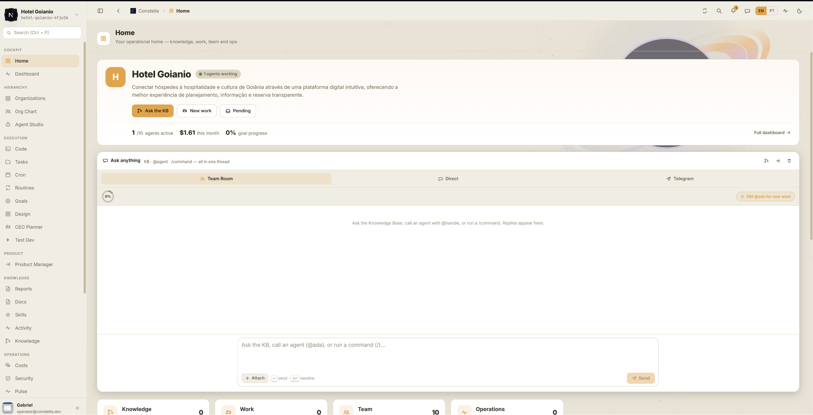</p>

Sua casa operacional: o cabeçalho da organização (missão, agentes trabalhando, gasto, progresso da meta)
mais um único thread **Pergunte qualquer coisa** que abrange Team Room / Direto / Telegram — consulte a Base
de Conhecimento, `@mencione` um agente ou rode um `/comando`, tudo no mesmo lugar.

### 📊 Painel
<p align="center">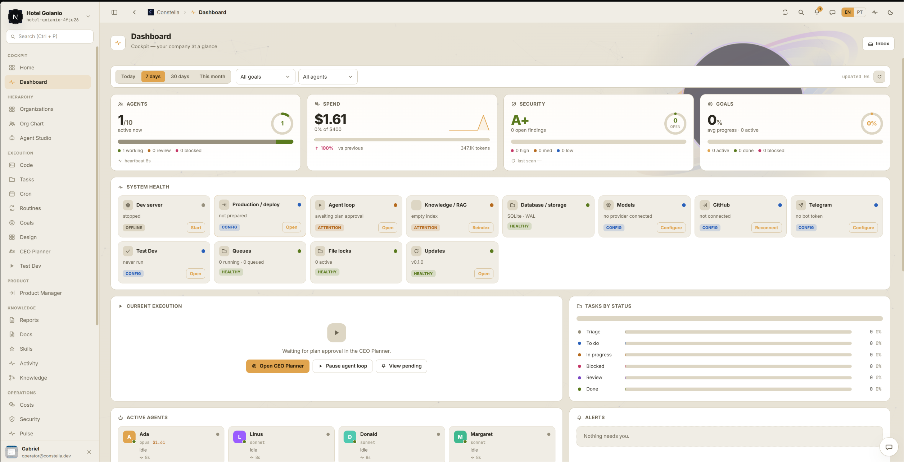</p>

O cockpit num relance: agentes ativos, gasto vs teto, nota de segurança e progresso da meta, uma grade de
**Saúde do Sistema** (dev server, deploy, loop de agentes, KB/RAG, banco, modelos, GitHub, Telegram, filas,
locks de arquivo, updates), a execução atual, tarefas por status e seus agentes ativos.

### 🗂️ CEO Planner
<p align="center">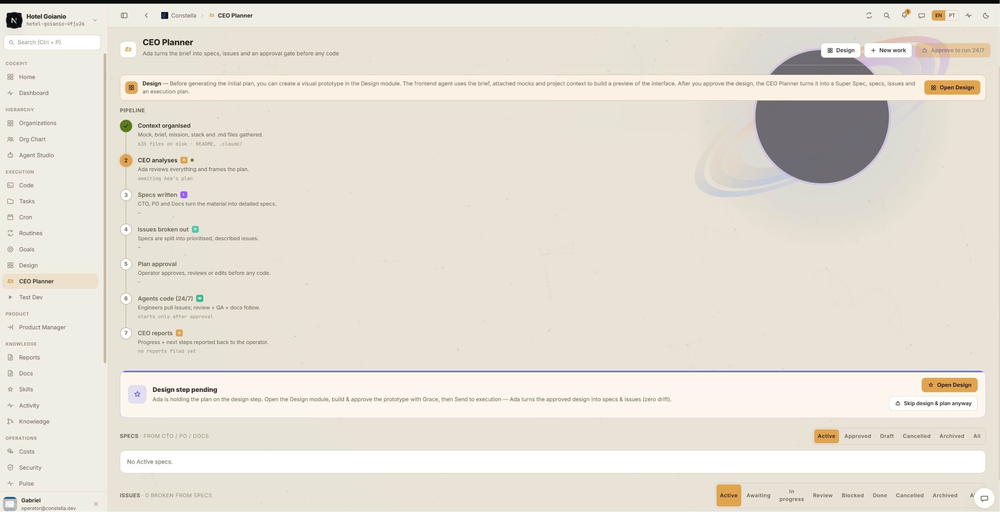</p>
<p align="center">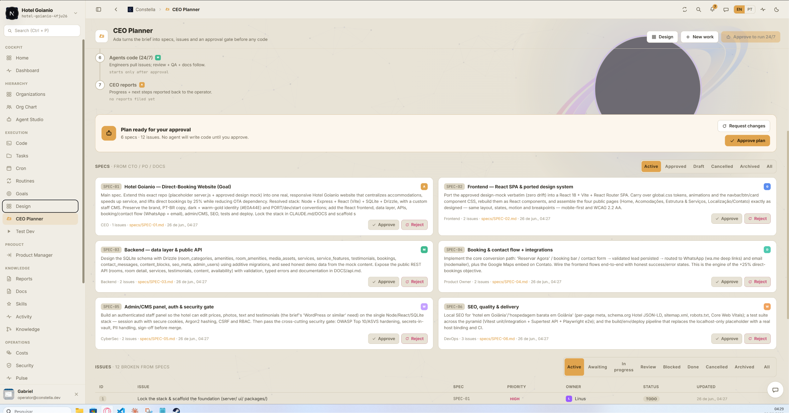</p>

A Ada transforma o brief em specs → issues → um **portão de aprovação antes de qualquer código**: um pipeline
de 7 passos (contexto → análise → specs → issues → aprovação → código 24/7 → relatórios), um **passo de
Design** opcional que segura o plano até o protótipo ser aprovado, e cards de Aprovar/Rejeitar por spec.
**Nenhum agente escreve código até você clicar em Aprovar plano.**

### 🎨 Design
<p align="center">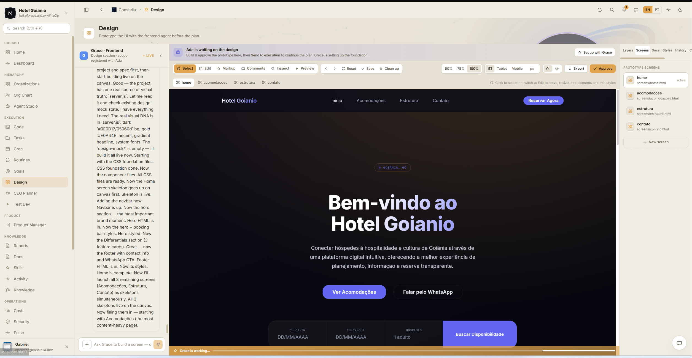</p>

Prototipe a UI com a **Grace** (agente de frontend) antes do plano: um canvas ao vivo renderizando as telas
reais que ela gera, uma barra Select / Edit / Markup / Comments / Inspect / Preview, zoom + viewport, painéis
laterais (Layers · Screens · Styles · Docs · History · Comments) e **Aprovar** para travar a referência
visual oficial (zero drift).

### 🌌 Conhecimento
<p align="center">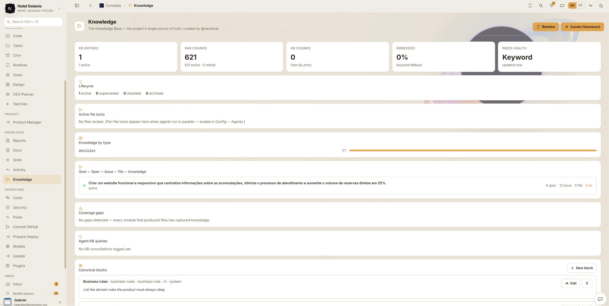</p>
<p align="center">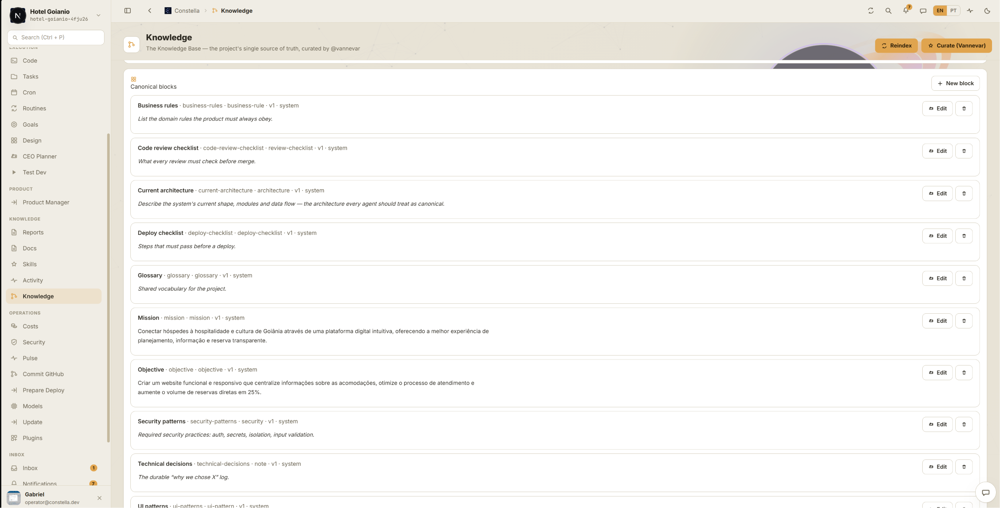</p>

A Base de Conhecimento — a fonte única da verdade do projeto, curada pelo **Vannevar**: entradas da KB,
chunks de RAG, % embeddado, saúde do índice e ciclo de vida; o grafo Meta↔Spec↔Issue↔arquivo↔conhecimento;
lacunas de cobertura; e **blocos canônicos** editáveis (regras de negócio, arquitetura atual, glossário,
missão, padrões de segurança, decisões técnicas…).

### ✦ Skills
<p align="center">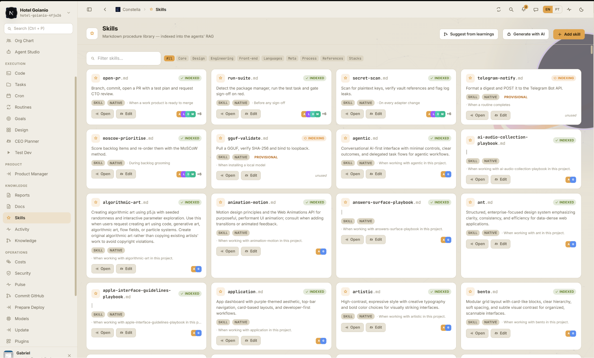</p>

A biblioteca de procedimentos em Markdown indexada no RAG dos agentes: busca + **filtro por categoria** (Core ·
Design · Engenharia · Front-end · Linguagens · Meta · Processo · Stacks), cards por skill mostrando status de
indexação, a flag nativa e os agentes vinculados, mais Adicionar skill / Gerar com IA / Sugerir de
aprendizados.

### 🧠 Modelos
<p align="center">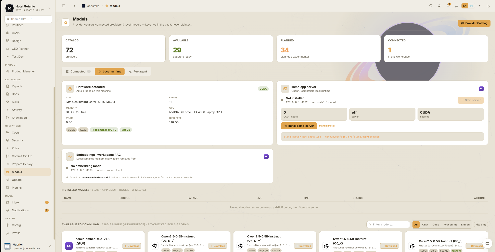</p>

Catálogo de provedores, provedores conectados e runtime local: contagens de catálogo / disponíveis /
planejados / conectados, uma sondagem automática de hardware (CPU / GPU / VRAM) que verifica a aderência de
uma quantização, os servidores de chat + embeddings llama.cpp, e um catálogo **GGUF** para download filtrado
ao que cabe na sua VRAM.

### ✈️ Telegram
<p align="center"></p>

Conecte um bot para conduzir a CEO pelo celular: um thread de chat **isolado** (nunca se mistura com o Team
Room ou DMs), uma allowlist de bot-token + chat-id, e o token guardado criptografado.

<p align="center"></p>

## 🛰️ Arquitetura

A Constella sobe um par supervisionado **web + worker** sobre um banco SQLite e um workspace por organização
em disco. A árvore de diretórios é a fonte da verdade; o banco a indexa.

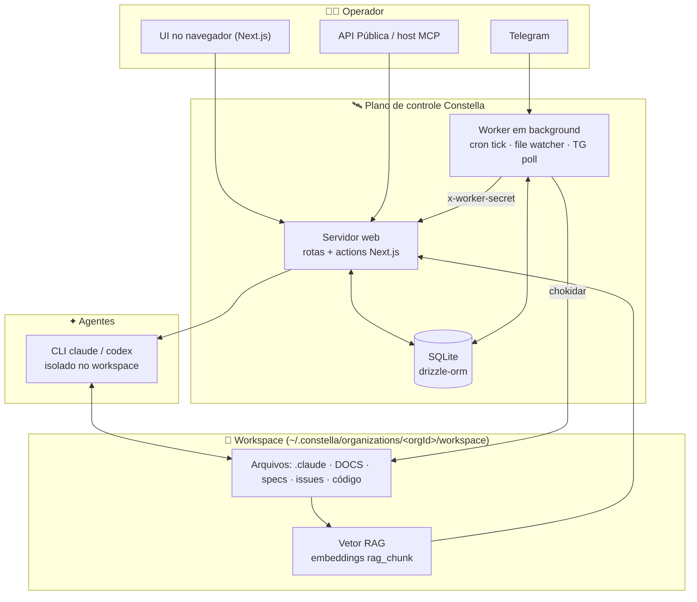

→ **[Arquitetura](docs/pt/ARCHITECTURE.md)** · **[Arquitetura de IA](docs/pt/AI_ARCHITECTURE.md)** · **[Segurança](docs/pt/SECURITY.md)**

<p align="center"></p>

## ✦ A constelação de agentes

Dez agentes são semeados em todo workspace, cada um com um arquivo de persona, um modelo, um tier e um
**teto diário de custo em USD**. Eles se reportam por uma hierarquia e coordenam na **Team Room** por
`@menção`.

<p align="center">
  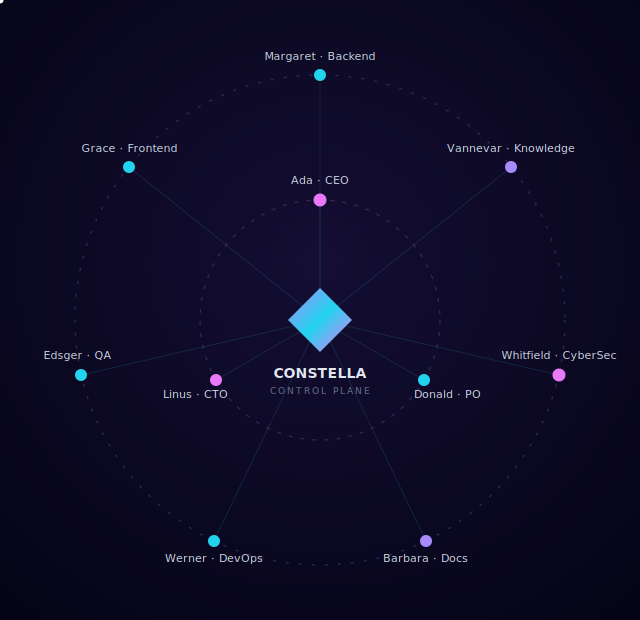
</p>

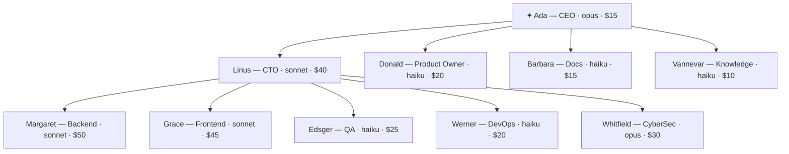

| Agente | Handle | Papel | Reporta a | Modelo | Teto diário |
|--------|--------|-------|-----------|--------|-------------|
| Ada | `ada` | CEO | — | opus | $15 |
| Linus | `linus` | CTO | ada | sonnet | $40 |
| Donald | `donald` | Product Owner | ada | haiku | $20 |
| Margaret | `margaret` | Backend | linus | sonnet | $50 |
| Grace | `grace` | Frontend | linus | sonnet | $45 |
| Edsger | `edsger` | QA | linus | haiku | $25 |
| Werner | `werner` | DevOps | linus | haiku | $20 |
| Barbara | `barbara` | Docs | ada | haiku | $15 |
| Whitfield | `whitfield` | CyberSec | linus | opus | $30 |
| Vannevar | `vannevar` | Knowledge | ada | haiku | $10 |

> [!NOTE]
> **Estes modelos e tetos diários são os padrões do Claude Code, não um limite exclusivo do Claude.** Cada
> agente é reconfigurável de forma independente em **Agent Studio → Model**: escolha qualquer
> **provedor / adaptador** — Claude Code, Codex, OpenClaw, Hermes, Aider, OpenCode, GitHub Copilot, Cursor,
> Cline, Kilo Code, ou um **GGUF** local — e o **menu de modelos muda para os modelos daquele provedor**
> (`opus`/`sonnet`/`haiku` no Claude Code, `gpt-5-codex`/`o4-mini` no Codex, ids roteados por provedor para
> os demais, o GGUF carregado para local). **Os tiers são agnósticos ao provedor:** um modelo de raciocínio
> de ponta em *qualquer* provedor — um Codex/GPT no modo de raciocínio alto, um Gemini de topo, etc. — fica
> no mesmo tier **classe-Opus / `critical`** de potência e custo, enquanto modelos menores/mais rápidos
> (`o4-mini`, um "flash", `haiku`) caem na ponta **`light`**. Cada agente mantém seu próprio **teto diário
> (USD)** editável e um **tier floor** (`light` / `heavy` / `critical`); o menu de modelos troca
> automaticamente com o provedor, e você ajusta o teto para casar com o modelo escolhido. O custo real por
> execução é lido do uso reportado pela CLI — CLIs que não emitem uso registram **`$0`** honestamente. Veja
> **[Modelos](docs/pt/MODELS.md)** para a tabela completa de adaptadores/custo.

→ **[Agentes](docs/pt/AGENTS.md)** · **[Agente de KB (Vannevar)](docs/pt/KB_AGENT.md)** · **[Agente PO (Donald)](docs/pt/PO_AGENT.md)** · **[Team Room](docs/pt/TEAM_ROOM.md)** · **[DM](docs/pt/DM.md)** · **[Comandos de chat](docs/pt/CHAT_COMMANDS.md)**

<p align="center"></p>

## 🌌 O ciclo de trabalho

Um novo trabalho nasce de uma DM para `@ada` (ou `/new-goal`). Opcionalmente, **prototipe a UI primeiro no
módulo Design** com a Grace e aprove-a como referência visual — o CEO Planner então segura o plano nesse
gate de design. A CEO redige specs e issues; você aprova; tarefas se materializam; o loop 24/7 executa,
revisa e testa até o objetivo ficar **done**.

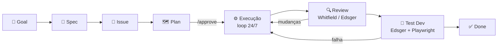

| Entidade | Status |
|----------|--------|
| Goal | `active` · `cancelled` · `archived` · `done` |
| Spec | `active` · `cancelled` · `archived` (+ `approved`) |
| Issue | `active` · `cancelled` · `archived`; coluna `todo` → `doing` → `blocked` → `review` → `done` |
| Task | coluna `triage` → `todo` → `doing` → `blocked` → `review` → `done` |
| Plan | `approved` + `auto247` (a chave do 24/7) |

→ **[Workflow](docs/pt/WORKFLOW.md)** · **[Goals, Specs, Issues, Plans](docs/pt/GOALS_SPECS_ISSUES.md)** · **[Inbox](docs/pt/INBOX.md)**

<p align="center"></p>

## 🧠 A nebulosa de memória — KB · RAG · Memória

A Constella mantém duas camadas de memória: uma **Base de Conhecimento curada** (entradas tipadas,
deduplicadas e rastreadas por ciclo de vida, pertencentes a Vannevar) e uma camada **RAG** de embeddings
sobre os arquivos do workspace e as conversas. Os embeddings são servidos por um servidor de embed
llama.cpp local em `:8083` (com fallback para Ollama); se nenhum embedder estiver de pé, a recuperação
degrada graciosamente para busca por palavra-chave.

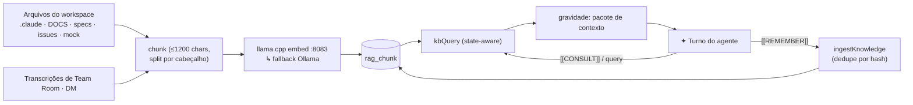

→ **[Base de Conhecimento & RAG](docs/pt/KB_RAG.md)** · **[Memory RAG](docs/pt/MEMORY_RAG.md)** · **[Synced Blocks](docs/pt/SYNCED_BLOCKS.md)**

<p align="center"></p>

## 🪐 Modelos, Skills, Stacks & Plugins

- **Modelos** — provedores na nuvem e **dez adaptadores de CLI de agente**: `cli_claude_code`, `cli_codex`,
  `cli_openclaw`, `cli_hermes`, `cli_aider`, `cli_opencode`, `cli_copilot`, `cli_cursor`, `cli_cline`,
  `cli_kilo` (Claude Code é o padrão; os demais são experimentais e roteiam pelos próprios logins), mais um
  catálogo local de **GGUF** vindo do `lmstudio-community`. O hardware é verificado (CPU/RAM/GPU/VRAM) para
  recomendar uma quantização; um chat server roda em `:8082` e o embedder em `:8083`.
- **Skills** — uma biblioteca de **500+** skills nativas em Markdown (`skills/<domínio>/<nome>/SKILL.md`)
  carregada pelo nome da pasta folha, com filtro por categoria (Core · Design · Engenharia · Front-end ·
  Linguagens · Meta · Processo · Stacks). ~23 skills universais estão sempre ativas; o restante é casado ao
  **stack** do projeto e ao **papel** de cada agente.
- **Project Stacks** — as tecnologias escolhidas guiam quais skills, pesquisa e contexto de RAG fluem para
  a execução: **Stack → Skills → Pesquisa → RAG → Execução**.
- **Plugins** — integrações nativas (GitHub, Telegram, Vault, Web Search) alternadas por workspace. *(A
  instalação de plugins customizados é atualmente um stub — veja a doc de Plugins.)*

→ **[Modelos](docs/pt/MODELS.md)** · **[Skills](docs/pt/SKILLS.md)** · **[Project Stacks](docs/pt/PROJECT_STACKS.md)** · **[Plugins](docs/pt/PLUGINS.md)**

<p align="center"></p>

## 🤖 Integrações & controle remoto

| Integração | O que faz |
|------------|-----------|
| **GitHub** | Vincula um repo com PAT, acompanha o git status, faz **commit** das mudanças do produto — ou **exporta um código limpo e escaneado** para um repo separado |
| **Telegram** | Dirija a Constella do celular: aprove planos, inicie/pause o loop 24/7, pergunte à KB, crie novos trabalhos |
| **API Pública** | Uma API REST protegida por PAT (`Authorization: Bearer cn_…`) para ler estado e disparar ações |
| **Servidor MCP** | `scripts/mcp-server.mjs` expõe a API como ferramentas MCP para Claude Desktop / Cursor / qualquer host dirigir a Constella |

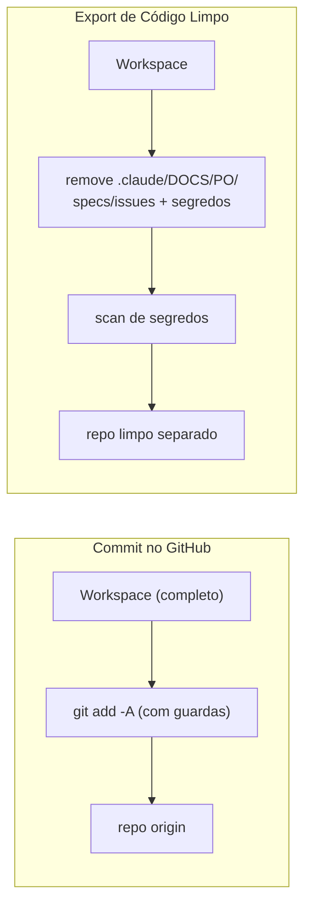

→ **[GitHub](docs/pt/GITHUB.md)** · **[Telegram](docs/pt/TELEGRAM.md)** · **[API Pública](docs/pt/PUBLIC_API.md)** · **[MCP](docs/pt/MCP.md)**

<p align="center"></p>

## 🚀 Lançamento — Test Dev, Prepare Deploy & Update

- **Test Dev** sobe o dev server do seu projeto, o dirige com um Chromium headless (Playwright), captura
  erros de console/página/requisição, tira screenshots das rotas e sonda por segredos vazados — retornando
  um veredito `PASS` / `FAIL` / `INCONCLUSIVE`.
- **Prepare Deploy** detecta seu framework, monta uma árvore limpa (arquivos de controle da Constella +
  segredos removidos), roda um checklist e produz um export gated por um scan de segredos.
- **Update** verifica no npm uma versão mais nova de `constellai`, faz backup dos seus dados e roda o comando
  de update certo para o seu contexto (`dev` / `npx` / `global` / `vps` / `portable`).

→ **[Test Dev](docs/pt/TEST_DEV.md)** · **[Prepare Deploy](docs/pt/PREPARE_DEPLOY.md)** · **[Deploy](docs/pt/DEPLOY.md)** · **[Update](docs/pt/UPDATE.md)** · **[Publishing](docs/pt/PUBLISHING.md)**

<p align="center"></p>

## 🗺️ Mapa da documentação

> Todo documento segue a mesma estrutura (propósito → como funciona → fluxo → conceitos → tabelas →
> diagramas → passo a passo → exemplos → estados → integrações → segurança → troubleshooting → links).
> Navegue pelo índice: **[docs/pt/](docs/pt/README.md)** · Inglês: **[docs/en/](docs/en/README.md)**.

**🌱 Primeiros passos**
[Instalação](docs/pt/INSTALLATION.md) · [Onboarding](docs/pt/ONBOARDING.md) · [Configuração](docs/pt/CONFIGURATION.md)

**🌠 Instalação & execução**
[Start](docs/pt/START_MODE.md) · [VPS](docs/pt/VPS_MODE.md) · [Portable](docs/pt/PORTABLE_MODE.md)

**🛰️ Arquitetura**
[Arquitetura](docs/pt/ARCHITECTURE.md) · [Arquitetura de IA](docs/pt/AI_ARCHITECTURE.md) · [Segurança](docs/pt/SECURITY.md)

**✦ Agentes & trabalho**
[Agentes](docs/pt/AGENTS.md) · [Agente de KB](docs/pt/KB_AGENT.md) · [Agente PO](docs/pt/PO_AGENT.md) · [Workflow](docs/pt/WORKFLOW.md) · [Goals · Specs · Issues](docs/pt/GOALS_SPECS_ISSUES.md) · [Team Room](docs/pt/TEAM_ROOM.md) · [DM](docs/pt/DM.md) · [Comandos de chat](docs/pt/CHAT_COMMANDS.md) · [Inbox](docs/pt/INBOX.md)

**🌌 Conhecimento**
[Base de Conhecimento & RAG](docs/pt/KB_RAG.md) · [Memory RAG](docs/pt/MEMORY_RAG.md) · [Synced Blocks](docs/pt/SYNCED_BLOCKS.md)

**🪐 Capacidades**
[Skills](docs/pt/SKILLS.md) · [Project Stacks](docs/pt/PROJECT_STACKS.md) · [Plugins](docs/pt/PLUGINS.md) · [Modelos](docs/pt/MODELS.md)

**🤖 Integrações**
[Telegram](docs/pt/TELEGRAM.md) · [GitHub](docs/pt/GITHUB.md) · [API Pública](docs/pt/PUBLIC_API.md) · [MCP](docs/pt/MCP.md)

**🚀 Entrega & operação**
[Test Dev](docs/pt/TEST_DEV.md) · [Prepare Deploy](docs/pt/PREPARE_DEPLOY.md) · [Deploy](docs/pt/DEPLOY.md) · [Publishing](docs/pt/PUBLISHING.md) · [Update](docs/pt/UPDATE.md) · [Troubleshooting](docs/pt/TROUBLESHOOTING.md) · [FAQ](docs/pt/FAQ.md)

O histórico do projeto vive no **[Changelog](CHANGELOG.pt-BR.md)** ([🇬🇧 EN](CHANGELOG.md)).

<p align="center"></p>

## 🔐 Segurança em um relance

Os agentes rodam isolados no diretório de workspace (sem path traversal, a raiz nunca é deletável). As
chaves de provedor são criptografadas em repouso com AES-256-GCM em um vault local; segredos são limpos
antes de chegarem à KB, ao Telegram ou aos logs. Uma guarda de comandos bloqueia shell destrutivo, locks de
arquivo previnem colisões de escrita paralela, e a autenticação suporta e-mail/senha, 2FA TOTP e passkeys
WebAuthn.

→ **[Segurança](docs/pt/SECURITY.md)** · **[Troubleshooting](docs/pt/TROUBLESHOOTING.md)**

<p align="center"></p>

<p align="center">
  <sub>✦ ⋆ ｡˚ <b>Constella</b> · Licença MIT · feita para rodar agent-companies reais na sua própria máquina ˚｡ ⋆ ✦</sub><br/>
  <sub><a href="README.md">🇬🇧 English version</a> · <a href="docs/pt/README.md">Documentação</a> · <a href="CHANGELOG.pt-BR.md">Changelog</a></sub>
</p>
