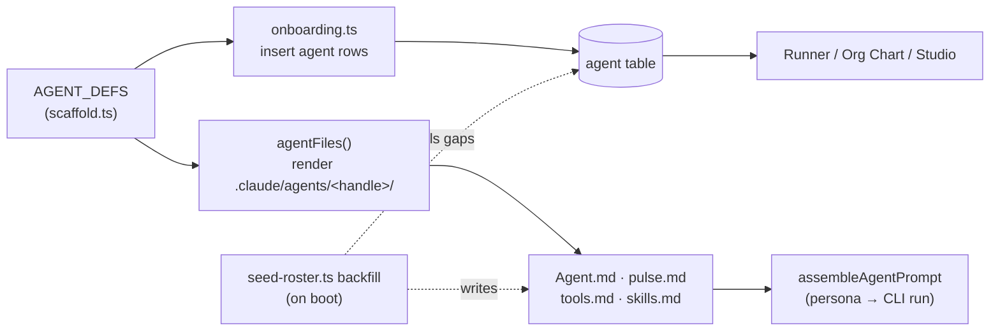
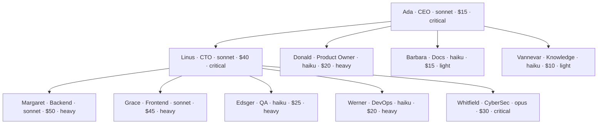

[← Docs index](./README.md) · [🇧🇷 Português](../pt/AGENTS.md) · [✦ Constella](../../README.md)

# Agents — The Roster ✦🛰️


The ten working stars of every Constella organization. Each agent is a real `claude`/`codex` CLI process with a role, a manager, a model, a temperature, a daily budget cap and a persona on disk. Together they form the constellation that plans, builds, reviews and ships your product.

## When to use

- You want to know **who does what** and **who reports to whom** in a freshly-onboarded organization.
- You need the exact **handle**, **role**, **model**, **daily cap** and **tier** for an agent.
- You are wiring the **Org Chart**, re-assigning a manager, or changing an agent's model/budget.
- You want to understand **persona files** (`.claude/agents/<handle>/…`), **status** and **health**.

## How it works 🌌

The roster is **born from code**, not typed in by a human. Three sources define and materialize it:

| Source file | Role |
|---|---|
| `src/data/scaffold.ts` (`AGENT_DEFS`) | Canonical roster definition + persona/file templates (`agentMd`, `pulseMd`, `toolsMd`, `skillsMd`). Renders the on-disk `.claude/agents/<handle>/…` files. |
| `src/server/onboarding.ts` (`AGENTS`) | Inserts the 10 `agent` rows into the DB at onboarding (with `tierFloor`, `dailyCapUsd`, `reportsTo`). |
| `src/server/seed-roster.ts` (`seedRosterForExistingWorkspaces`) | **Backfill** — adds any `AGENT_DEFS` member missing from an already-onboarded workspace (e.g. Vannevar, added after the original 9). Idempotent; runs once per boot from `reconcileOnBoot`. |

The **directory is the source of truth**: every agent's identity lives in Markdown under `.claude/agents/<handle>/`. The `agent` DB row (`src/db/schema.ts`) indexes it for the UI and the runner. Editing the persona in the UI writes through to disk (`saveAgentPersona`, `saveAgentModel` in `src/server/agents.ts`).

> Note: the legacy `src/db/seed.ts` demo seed lists only the original **9** agents (no Vannevar). The boot backfill (`seedRosterForExistingWorkspaces`) closes that gap, so every live workspace ends up with all **10**.

## Main flow — from definition to a living agent



## The 10 agents 🪐

Source of truth: `AGENT_DEFS` in `src/data/scaffold.ts` (mirrored by `AGENTS` in `src/server/onboarding.ts`).

| Name | Handle | Role | Reports to | Model | Temp | Daily cap (USD) | Tier | Color |
|---|---|---|---|---|---|---|---|---|
| Ada | `ada` | CEO | — (root) | `sonnet` | 0.4 | $15 | critical | `#e0a44e` |
| Linus | `linus` | CTO | `ada` | `sonnet` | 0.3 | $40 | critical | `#9a5cff` |
| Donald | `donald` | Product Owner | `ada` | `haiku` | 0.4 | $20 | heavy | `#4fc9b0` |
| Margaret | `margaret` | Backend | `linus` | `sonnet` | 0.3 | $50 | heavy | `#3fb98f` |
| Grace | `grace` | Frontend | `linus` | `sonnet` | 0.5 | $45 | heavy | `#5b8def` |
| Edsger | `edsger` | QA | `linus` | `haiku` | 0.2 | $25 | heavy | `#e8688f` |
| Werner | `werner` | DevOps | `linus` | `haiku` | 0.3 | $20 | heavy | `#f0a35e` |
| Barbara | `barbara` | Docs | `ada` | `haiku` | 0.4 | $15 | light | `#b3d97a` |
| Whitfield | `whitfield` | CyberSec | `linus` | `opus` | 0.2 | $30 | critical | `#c4a0ff` |
| Vannevar | `vannevar` | Knowledge | `ada` | `haiku` | 0.2 | $10 | light | `#7ac5e0` |

All ten ship on `provider: cli_claude_code` by default. `model` is a real Claude Code CLI alias — only `opus`, `sonnet`, `haiku` exist for that adapter (`CLI_MODELS.cli_claude_code` in `src/server/adapters/cli.ts`).

### Identities & rituals

Each agent carries an `identity` (who it is) and a `ritual` (what it does every working cycle), straight from `AGENT_DEFS`:

| Agent | Identity | Ritual |
|---|---|---|
| Ada | Decisive, outcome-driven leader. Speaks in goals, not tasks. Protects scope and budget. | Read the company goals, decompose into epics, delegate to leads, review what shipped. |
| Linus | Systems thinker. Balances delivery speed against technical debt. | Turn epics into tickets, route work to specialists, clear blockers, review PRs. |
| Donald | Customer voice. Ruthless about priority and clarity. | Groom the backlog with MoSCoW, plan the sprint, track delivery, close with a retro. |
| Margaret | Pragmatic server engineer. Values correctness, small diffs and green tests. | Pull one ticket, read context, implement on a branch, never push without a passing suite. |
| Grace | Craft-focused UI engineer. Cares about accessibility and clean component APIs. | Read the design tokens, build the smallest component that works, typecheck before PR. |
| Edsger | Skeptical quality gate. Assumes nothing works until proven by a test. | Reproduce, cover with a test, run the suite, then gate the sign-off. |
| Werner | Reliability-minded operator. Automates the boring, guards the leases. | Build, deploy a preview, report the URL, never leave an env leased too long. |
| Barbara | Patient explainer. Turns changes into understandable docs. | Watch merges, draft docs while context is fresh, verify every link. |
| Whitfield | Adversarial reviewer. Thinks like an attacker, writes like an auditor. | Audit every change for secret handling and injection, file findings with a concrete fix. |
| Vannevar | Keeper of the company's semantic memory. Indexes every document AND conversation into embeddings. | Keep the embedding server healthy; re-index workspace docs and chat into the RAG index so retrieval stays current. |

## Reporting tree — the org chart 🌠

Two roots-of-orbit: **Ada (CEO)** sits at the center; **Linus (CTO)** carries the engineering constellation. `reportsTo` stores the **manager's handle** (handle-space end to end — see `setReportsToByHandle`).



- **Ada's direct reports:** `linus`, `donald`, `barbara`, `vannevar`.
- **Linus's direct reports:** `margaret`, `grace`, `edsger`, `werner`, `whitfield`.
- Blocked tasks escalate to the agent's `reportsTo` (per `.claude/routing.md`).

## Key concepts ✦

### Persona files (the directory is the brain)

For every agent, `agentFiles(def, ctx)` writes **four** Markdown files under `.claude/agents/<handle>/`:

| File | Generator | Contents |
|---|---|---|
| `Agent.md` | `agentMd` | YAML front-matter (`handle`, `name`, `role`, `reportsTo`, `provider`, `model`, `temperature`, `dailyCapUsd`, `tierFloor`) + Identity, Ritual, Responsibilities, Behavior (from temperature), Decision/Execution rules, Workspace boundaries, and the **System prompt**. |
| `pulse.md` | `pulseMd` | Liveness config — `intervalSec: 30`, `maxMissed: 2`, `wakeOn` (`queued_task`, `mention`), and the status/health legend. |
| `tools.md` | `toolsMd` | Role-scoped tool table (e.g. CyberSec → `secret-scan`, `review.signoff`, `fs.read`; Knowledge → `rag.reindex`, `rag.index-chat`, `embed.health`). |
| `skills.md` | `skillsMd` | The procedures linked to the agent (from `SKILL_DEFS`) + its ritual. |

`Agent.md` is **write-through**: UI edits in Agent Studio patch the front-matter and sections in place (`setFrontMatter`, `setInlineField`, `setSection`) and the DB row is updated to match. The directory wins on conflict.

### Model & tier

- **Not Claude-only.** The seed `opus`/`sonnet`/`haiku` values are simply the defaults of the seed adapter `cli_claude_code`. Change `adapter` per agent in **Agent Studio → Model** and the **model menu changes with it** — the `ModelPicker` is keyed by `adapter` (`cliModelOptions(adapter)`, `src/components/ui/model-picker.tsx`): `cli_codex` → `gpt-5-codex` / `o4-mini`; `cli_openclaw` / `cli_hermes` / `cli_aider` / `cli_opencode` / `cli_copilot` / `cli_cursor` / `cli_cline` / `cli_kilo` → their provider-routed ids; `local_*` → the loaded GGUF; HTTP/router providers → the cached model catalog. The full adapter table is in [MODELS.md](./MODELS.md).
- `model` is the configured alias. For `cli_claude_code` that is one of `opus` / `sonnet` / `haiku`.
- `tierFloor` (`light` | `heavy` | `critical`) is the agent's quality floor — defaulted in `AGENT_DEFS`, persisted on the `agent` row (`tier_floor`, default `heavy`). **Tiers are provider-agnostic:** a flagship reasoning model on any provider (e.g. a top Codex/GPT at high reasoning, or a top Gemini) maps to the `critical` / Opus-class tier in power and cost, while smaller/faster models (`o4-mini`, a "flash", `haiku`) map to the `light` end.
- For quality-critical steps (code review, security, final validation) the runner can reach for the **strongest** model of the agent's provider via `strongestModelFor()` — for `claude` that resolves to `opus`, and the equivalent flagship for any other provider.
- The model menu switches **automatically** when you pick a provider; the **daily cap does not** — it is an independent USD budget you set (next section) to match the model's cost tier.
- `temperature` does **not** set a CLI sampling flag (the Claude Code CLI exposes none). Instead `temperatureBehavior(t)` turns the slider into a concrete **prompt instruction** injected on every run (`src/data/temperature.ts`).

### Daily cap (budget ceiling) 🕳️

`dailyCapUsd` is a hard spend ceiling per agent per day. The runner calls `agentAtCap(agentId, dailyCapUsd)` (`src/server/runner.ts`); when reached it **pauses** the agent and pushes a `budget` inbox item ("@`<handle>` hit the daily budget cap"). Raise the cap in Agent Studio or wait for the daily reset. A cap of `0` means "no cap".

### Status & health

Two orthogonal axes on the `agent` row:

| Axis | Column | Values | Meaning |
|---|---|---|---|
| **Status** | `status` | `idle` · `working` · `review` · `blocked` | What the agent is doing right now. |
| **Health** | `health` | `alive` · `stale` · `down` | Whether its executor is reachable. |

The cron tick sweep (`runner.ts`) sets health from runtime availability: if the agent's CLI binary is reachable (`runtimeOk`), health is `alive`; otherwise `stale`. Idle agents get a lightweight heartbeat touch (`lastPulse` updated, no pulse-row spam); working/review agents record a real `pulse` row via `recordPulse`. `pulse.md` documents the liveness contract: alive within `intervalSec * maxMissed`, otherwise stale; repeated failure → `down` (logged to `Reports/error-report.md`).

## Tables 🛰️

### `agent` (`src/db/schema.ts`)

| Column | Type | Default | Notes |
|---|---|---|---|
| `id` | text PK | — | Stable id. |
| `workspaceId` | text | — | FK → `workspace` (cascade). |
| `handle` | text | — | Unique short name (`ada`, `linus`, …). |
| `name` | text | — | Display name. |
| `role` | text | — | CEO / CTO / Backend / … |
| `color` | text | `#e0a44e` | Avatar tint (used for initials fallback). |
| `image` | text | null | Optional avatar path / data URL. |
| `adapter` | text | `cli_claude_code` | Execution runtime (CLI/HTTP/local). |
| `model` | text | `sonnet` | Model alias. |
| `temperature` | real | `0.4` | Drives the Behavior prompt band. |
| `dailyCapUsd` | real | `25` | Daily spend ceiling. |
| `tierFloor` | text enum | `heavy` | `light` / `heavy` / `critical`. |
| `reportsTo` | text | null | Manager's **handle**. |
| `status` | text enum | `idle` | `idle` / `working` / `review` / `blocked`. |
| `health` | text enum | `alive` | `alive` / `stale` / `down`. |
| `lastPulse` | timestamp | null | Last heartbeat. |
| `persona` | json | null | `{ identity, ritual, tone, systemPrompt }`. |
| `rag` | json | null | Per-agent RAG source toggles. |
| `orgX` / `orgY` | real | null | Org-chart card coordinates. |

### `pulse` (heartbeat log)

| Column | Type | Notes |
|---|---|---|
| `id` | text PK | — |
| `agentId` | text | FK → `agent`. |
| `at` | timestamp | `unixepoch()` default. |
| `ok` | boolean | Health-ping result. |
| `latencyMs` | integer | Ping latency. |
| `note` | text | e.g. `tick:working`. |

### `agentSkill` (enablement join)

| Column | Notes |
|---|---|
| `agentId` + `skillId` | Composite PK. |
| `auto` | `true` = system-managed link (reconciled on boot/stack change); `false` = operator hand-toggled (never touched by reconcile). |

## Step-by-step — operate the roster

1. **See the roster.** Open the Agents module (each card shows status, health, model). The Org Chart visualizes `reportsTo`.
2. **Re-assign a manager.** Drag a card in the Org Chart canvas → `setReportsToByHandle(agentHandle, managerHandle)`. Self-loops and cycles are rejected; pass `null` to detach (becomes a root/CEO).
3. **Change model / budget / tier.** In Agent Studio → `saveAgentModel({ adapter, model, temperature, dailyCapUsd, tierFloor })`. The DB row and `Agent.md` front-matter are updated together.
4. **Edit persona.** `saveAgentPersona({ identity, ritual, tone, systemPrompt })` patches `Agent.md` (Identity, Ritual, System prompt) on disk.
5. **Set an avatar.** `saveAgentImage(agentId, imagePath | null)` (data-URL avatars; legacy `uploads/<id>/` avatars are cleaned up on replace).
6. **Add a missing agent.** On boot, `seedRosterForExistingWorkspaces()` backfills any `AGENT_DEFS` member absent from the workspace — DB row, four persona files, and the non-provisional native skills.

## Examples

Inspect an agent's persona on disk:

```bash
cat ~/.constella/organizations/<orgId>/workspace/.claude/agents/linus/Agent.md
```

Front-matter you will see (rendered by `agentMd`):

```yaml
---
handle: linus
name: Linus
role: CTO
reportsTo: ada
provider: cli_claude_code
model: sonnet
temperature: 0.3
dailyCapUsd: 40
tierFloor: critical
---
```

List agents and their reporting line from chat:

```
/agents
/agent linus
```

(`/agents` lists the roster; `/agent <handle>` shows one agent's detail — see [CHAT_COMMANDS.md](./CHAT_COMMANDS.md).)

## Possible states

| Concern | Values | Set by |
|---|---|---|
| Status | `idle` · `working` · `review` · `blocked` | Runner / planner as work flows. |
| Health | `alive` · `stale` · `down` | Cron tick sweep (binary reachability) + pulse sweep. |
| Budget | under cap → runs · at/over cap → paused (`budget` inbox item) | `agentAtCap()`. |
| Tier floor | `light` · `heavy` · `critical` | `AGENT_DEFS` default; editable in Studio. |

## Related integrations 🚀

- **Skills** — each agent's enabled procedures (`agentSkill`, `skills.md`). See [SKILLS.md](./SKILLS.md).
- **Models** — adapters and model catalog behind `adapter`/`model`. See [MODELS.md](./MODELS.md).
- **Workflow** — how agents pick up Goals → Specs → Issues → Tasks. See [WORKFLOW.md](./WORKFLOW.md).
- **Team Room / DM** — where agents collaborate and hand off. See [TEAM_ROOM.md](./TEAM_ROOM.md), [DM.md](./DM.md).
- **PO Agent / KB Agent** — Donald's grooming and Vannevar's memory. See [PO_AGENT.md](./PO_AGENT.md), [KB_AGENT.md](./KB_AGENT.md).

## Security 🕳️

- **Workspace jail.** Every agent runs with `cwd` set to its organization's workspace and is lexically + symlink-checked against escape; nothing outside the workspace is reachable. Boundaries are stated in `Agent.md`, `permissions.md` and enforced by the runner.
- **No inline secrets.** Personas and tools forbid plaintext keys; secrets come from the vault. Output is scrubbed before logs/KB/Telegram.
- **Budget ceilings.** A runaway agent stops at its `dailyCapUsd`; the runner will not exceed the cap.
- **Cycle/self guards.** Manager re-assignment (`setReportsTo`, `setReportsToByHandle`) rejects self-references and cycles, so the org chart can never form a loop.

## Troubleshooting

| Symptom | Likely cause | Fix |
|---|---|---|
| An agent shows **stale/down** | Its CLI binary isn't installed/reachable (`runtimeOk` false). | Install/repair the `claude`/`codex` CLI; health recovers on the next tick. |
| Agent is **paused mid-work** | Hit its `dailyCapUsd`. | Raise the cap in Agent Studio or wait for the daily reset (see the `budget` inbox item). |
| Vannevar missing in an old org | Org onboarded before the Knowledge agent existed. | The boot backfill (`seedRosterForExistingWorkspaces`) adds it automatically on next start. |
| Manager change does nothing | Self/cycle (rejected) or manager not in this workspace. | Pick a different manager; the change is silently ignored for invalid targets. |
| Edited `Agent.md` but UI still old | Write-through/watcher lag. | The sync engine re-indexes on save; reload after a moment. |

## Related links

- [AI_ARCHITECTURE.md](./AI_ARCHITECTURE.md) — how agent runs are assembled and executed.
- [WORKFLOW.md](./WORKFLOW.md) — the Goal → Spec → Issue → Done lifecycle.
- [SKILLS.md](./SKILLS.md) — the skill library each agent draws on.
- [MODELS.md](./MODELS.md) — adapters, model aliases and tiers.
- [PO_AGENT.md](./PO_AGENT.md) · [KB_AGENT.md](./KB_AGENT.md) — Donald and Vannevar in depth.
- [TEAM_ROOM.md](./TEAM_ROOM.md) · [DM.md](./DM.md) — agent collaboration.
- [CHAT_COMMANDS.md](./CHAT_COMMANDS.md) — `/agents`, `/agent`, `/status`.
