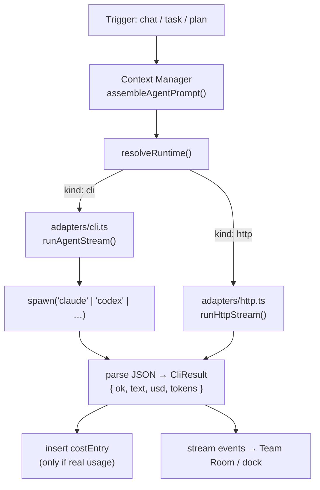
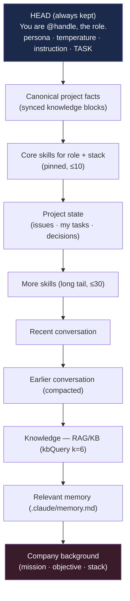

[← Docs index](./README.md) · [🇧🇷 Português](../pt/AI_ARCHITECTURE.md) · [✦ Constella](../../README.md)

# 🌌 AI Architecture — how a constellation actually runs

> The control plane never talks to an LLM API directly. It **drives real CLIs** (`claude`, `codex`, and friends) as subprocesses inside the org workspace, captures their **real** token usage + cost, and never fabricates a number.

This document explains the machinery that turns "an agent" into a running process: the CLI adapters, the spawn invocation, the vanilla-hooks override, permission modes per run-mode, the model-agnostic context assembly, and cost tracking.

---

## ✦ When to use this doc

- You want to understand **what command** Constella runs when an agent "thinks" or "builds".
- You need to know **why agents run vanilla** (no operator plugins/hooks leaking in).
- You're debugging permissions, timeouts, model selection, or cost rows.
- You're adding a new CLI adapter or HTTP runtime.

For the org/role side (who the agents are, their daily caps), see [AGENTS.md](./AGENTS.md). For the workflow they execute, see [WORKFLOW.md](./WORKFLOW.md).

---

## 🛰️ How it works (the big picture)

Every agent run — a chat reply, a board task, or a CEO planning pass — flows through the same three layers:

1. **Context Manager** (`src/server/context-manager.ts`) assembles ONE standardized, model-agnostic prompt (mission, project state, decisions, conversation, RAG, memory, skills) and trims it to the agent's real context window.
2. **Runtime resolver** (`src/server/runtime.ts`) decides *where* the prompt runs: a local **CLI** (the default — subscription-backed, agentic, file-editing) or an **HTTP** provider (chat/reasoning only, when wired to a connected `http_*` provider).
3. **CLI adapters** (`src/server/adapters/cli.ts`) spawn the actual binary, stream tool-use + text events back, and parse **real** usage + cost from the CLI's JSON output.



---

## 🪐 Main flow

The canonical agentic path is the CLI. `runAgent` / `runAgentStream` dispatch to a per-binary runner:

| Step | Where | What happens |
|------|-------|--------------|
| 1. Pick binary | `pickBinary(adapter, model)` | Maps the agent's adapter (`cli_claude_code`, `cli_codex`, …) to an executable name (`claude`, `codex`, `cursor-agent`, `kilocode`, …). |
| 2. Resolve cwd | `orgRoot(orgId)` | The agent's **FS jail** — the org workspace dir. `mkdirSync(cwd, { recursive: true })`. |
| 3. Build argv | `claudePermArgs()`, `claudeSettingsArgs()`, `claudeWebArgs()` | Permission mode, vanilla-hooks settings overlay, optional web tools. |
| 4. Validate model | `safeModel()` / `safeModelSlash()` | Regex-validates the model id (it reaches argv on a `shell: true` Windows spawn) — drops anything that could inject. |
| 5. Spawn | `runProc()` | `spawn(cmd, args, { cwd, shell, windowsHide, env })`; registers the child under its abort token. |
| 6. Stream / parse | `runClaudeStream` / per-binary parser | Emits `StreamEvent`s per tool_use + text delta; parses the final JSON for usage. |
| 7. Result | `CliResult` | `{ ok, text, usd, inputTokens, outputTokens, durationMs, binary, model, error }`. |
| 8. Book cost | caller (`collab` / `runner` / `planner-core`) | Inserts a `cost_entry` row **only if** `usd > 0` or tokens > 0. |

---

## 🌠 Key concepts

### CLI adapters (`src/server/adapters/cli.ts`)

The `CliBinary` union enumerates every executable Constella can drive:

```
"claude" | "codex" | "openclaw" | "hermes"
| "aider" | "opencode" | "copilot" | "cursor-agent" | "cline" | "kilocode"
```

`pickBinary(adapter, model)` resolves the agent's stored adapter to a binary. If the adapter is unknown, it heuristically picks `codex` for `gpt*`/`o1`/`o3`/`o4`/`codex*` models, otherwise `claude`. The fixed model lists each CLI exposes live in `CLI_MODELS`:

| Adapter | Binary | Models |
|---------|--------|--------|
| `cli_claude_code` | `claude` | `opus`, `sonnet`, `haiku` |
| `cli_codex` | `codex` | `gpt-5-codex`, `o4-mini` |
| `cli_openclaw` | `openclaw` | `(default)` + provider-prefixed ids |
| `cli_hermes` | `hermes` | `(default)` + provider-prefixed ids |
| `cli_aider` | `aider` | `(default)` + provider-prefixed ids |
| `cli_opencode` | `opencode` | `(default)` + provider-prefixed ids |
| `cli_copilot` | `copilot` | `(default)`, `claude-sonnet-4.5`, `gpt-5` |
| `cli_cursor` | `cursor-agent` | `(default)`, `claude-4.5-sonnet`, `gpt-5` |
| `cli_cline` | `cline` | `(default)` |
| `cli_kilo` | `kilocode` | `(default)` |

> Provider-routed CLIs (Aider, OpenCode, Copilot, Cursor, Cline, Kilo) authenticate via **their own** login/config — Constella drives them, never holds their keys. Their headless modes emit **no** token/cost, so those are recorded as `0` (honest, never faked). `LOGIN_HINTS` maps each binary to the command that authenticates it, surfaced in the UI when `detectCliAuth()` returns `needs_login`.

### The Claude spawn invocation 🚀

The primary, fully-streamed path is `runClaudeStream`. It builds:

```
claude -p --output-format stream-json --include-partial-messages --verbose \
  [--settings <vanilla settings file>] \
  --permission-mode <bypassPermissions|acceptEdits> \
  [--allowedTools WebSearch WebFetch] \
  [--model <opus|sonnet|haiku>]
```

The non-streamed sibling `runClaude` uses `--output-format json` (single result object). Both pipe the assembled prompt to **stdin** and parse the result JSON:

```js
ok: obj.is_error !== true && obj.subtype === "success",
text: String(obj.result ?? ""),
usd:  Number(obj.total_cost_usd ?? 0),
inputTokens:  usage.input_tokens + usage.cache_read_input_tokens + usage.cache_creation_input_tokens,
outputTokens: usage.output_tokens,
```

Codex uses `codex exec --json --skip-git-repo-check -s <sandbox> [-m <model>]` and parses best-effort usage from its JSONL event stream.

### Vanilla agents — `disableAllHooks` 🕳️

Company agents must run **independent of the operator's personal `~/.claude`**. The operator may have UserPromptSubmit/SessionStart hooks or plugins (e.g. a "caveman mode" voice rewriter) that fire for **every** `claude` invocation — including the headless agent subprocesses. Without isolation, the agents start talking like the operator's plugin instead of themselves.

Constella can't redirect `CLAUDE_CONFIG_DIR` (the subscription credentials live there — redirecting it logs the agent out). Instead, `vanillaSettingsArgs()` writes a tiny file once and passes it:

```json
{ "disableAllHooks": true }
```

→ `--settings <tmpdir>/constella-agent-settings.json`. Hooks off, **auth intact**.

### Opt-in clean-config isolation (lock + guard hooks)

When `CONSTELLA_AGENT_LOCK_HOOK=1` (or the per-workspace `settings.agents.fileLocks`) or the (opt-in) destructive-command guard is enabled, `agentClaudeDir()` builds a **dedicated clean config dir** under `<CONSTELLA_HOME>/.agent-claude`, copies in the operator's `.credentials.json` **and `~/.claude.json`** (credentials **plus** the account/onboarding state — relocating `CLAUDE_CONFIG_DIR` also relocates where the CLI reads its login, so both are mirrored or the agent runs "Not logged in"), and writes a `settings.json` carrying ONLY Constella's `PreToolUse` hooks:

| Hook | Matcher | Binary |
|------|---------|--------|
| File lock (`bin/lock-hook.mjs`) | `Write\|Edit\|MultiEdit\|NotebookEdit` | gated by `lockHookOn()` |
| Command guard (`bin/guard-hook.mjs`) | `Bash` | gated by `guardHookOn()` (default ON, `CONSTELLA_AGENT_CMD_GUARD`) |

When this clean dir is active, `claudeSettingsArgs()` returns `[]` (the dir already carries settings — don't ALSO pass `disableAllHooks`), and `claudeEnv()` injects `CLAUDE_CONFIG_DIR` plus the lock-hook identity (`CONSTELLA_ORG_ID`, `CONSTELLA_TASK_ID`, `CONSTELLA_AGENT_ID`, `CONSTELLA_AGENT_HANDLE`, `CONSTELLA_BASE_URL`). If creds can't be copied, it **falls back to vanilla** — file-locking degrades, auth never breaks.

### Permission modes by run-mode 🛰️

`AGENT_FULL_ACCESS` is run-mode aware (`CONSTELLA_RUN_MODE`), overridable with `CONSTELLA_AGENT_FULL_ACCESS=1|0`:

| Run mode | `AGENT_FULL_ACCESS` | claude `--permission-mode` | codex `-s` sandbox |
|----------|---------------------|----------------------------|--------------------|
| `start` (local dev) | `true` | `bypassPermissions` (install + run tests) | `danger-full-access` |
| `auth` / `vps` / `portable` (prod) | `false` | `acceptEdits` (edits only, no net/exec) | `workspace-write` (no network) |

> Prod already runs on a private host behind Tailscale (the tailnet-only host is the hard boundary). The CLI stays restricted on top for defense-in-depth.

### Web research 🌠

`claudeWebArgs()` pre-approves the built-in web tools with `--allowedTools WebSearch WebFetch`. It's **additive** — it does NOT restrict Read/Edit/Bash. Default **ON**; disable with `CONSTELLA_WEB_RESEARCH=0` or per-workspace `settings.agents.webResearch = false` (pushed by the runner via `setWebResearch` before each spawn).

### Streaming events

`runClaudeStream` parses the `stream-json` line protocol and emits a `StreamEvent` per tool use and per text delta:

| `StreamEvent.kind` | Source tool |
|--------------------|-------------|
| `read` | `Read` |
| `create` | `Write` (with a content preview) |
| `edit` | `Edit` / `NotebookEdit` (a real `-`/`+` diff, ≤80 lines) |
| `run` | `Bash` / `PowerShell` |
| `search` | `Glob` / `Grep` |
| `thinking` | extended-thinking blocks |
| `text` | streamed reply deltas (debounced ~120 chars) |
| `done` | run finished |

These events drive the live Team Room work-card (true diff view, not fabricated). The runner uses `create`/`edit` events to record file provenance for the goal.

### Cancellation 🕳️

Runs register their child process under an **abort token** (= the `taskId`) in an `ACTIVE` map. `abortRun(token)` SIGKILLs the in-flight CLI mid-run (used by goal cancellation). A token cancelled in the claim→spawn window is recorded in `ABORTED`, so a child that registers late **self-kills**. Default timeouts: 180s (`runClaude`/`runCodex`), 240s (`runClaudeStream`), 300s for a planning pass.

---

## 🌌 Context assembly (prompt gravity)

`assembleAgentPrompt()` (`src/server/context-manager.ts`) is the **single source of truth** for prompts — used by chat (`collab.replyInChannel`) AND task execution (`runner`) so task agents are never context-blind. It is **model-agnostic**: the same bundle feeds Opus, Codex, or a local model; only the trim differs.

### Budget & window

`resolveWindow()` prefers the dynamic catalog (`provider_model.context`) so a 1M-ctx model keeps full history; otherwise falls back to `modelWindow(model)`:

| Model alias | Window | keepRecent | aggressive |
|-------------|--------|------------|------------|
| `opus` / `sonnet` | 200,000 | 16 | no |
| `haiku` | 200,000 | 12 | no |
| `gpt*` / `codex` / `o3` / `o4` | 128,000 | 12 | yes |
| (other / local) | 100,000 | 8 | yes |

The prompt budget is **half** the window (`win.window * 0.5`) — the other half is reserved for the model's reply. `estimateTokens(text)` ≈ `text.length / 4`.

### Section priority (trimmed lowest-first)

A fixed **head** (identity + persona + `temperatureBehavior` + the instruction + the task) always survives. Then sections are added in priority order until the budget is hit; lower-priority sections are **skipped** when over budget:



Each section is sourced from real state:

- **Canonical facts** — `canonicalFactsSection()` (synced knowledge blocks, treated as authoritative). See [SYNCED_BLOCKS.md](./SYNCED_BLOCKS.md).
- **Skills** — `agentSkills()` joins `agent_skill → skill`, ranks by `coreSkillNamesForRole` / `librarySkillNamesForStack`, pins ≤10 core, caps ≤30 tail. See [SKILLS.md](./SKILLS.md).
- **Project state** — open issues, this agent's active tasks, team tasks, specs, recent `decision` rows. See [GOALS_SPECS_ISSUES.md](./GOALS_SPECS_ISSUES.md).
- **Conversation** — `buildChannelContext()` returns `{ summary, recent }` (compaction handles the long tail). See [DM.md](./DM.md) / [TEAM_ROOM.md](./TEAM_ROOM.md).
- **Knowledge** — `kbQuery(orgId, query, { k: 6 })`, state-aware (drops obsolete/superseded). See [KB_RAG.md](./KB_RAG.md) / [MEMORY_RAG.md](./MEMORY_RAG.md).
- **Memory** — `.claude/memory.md`, capped 1500 chars.

Finally `resolveBlocks()` expands any `{{kb:slug}}` markers to the current canonical block bodies. The function returns `{ prompt, sources }` — `sources` becomes the message's source chips.

---

## 🪐 Runtime resolution

`resolveRuntime(workspaceId, agent)` returns `{ kind: "cli", binary }` or `{ kind: "http", http }`:

| Adapter prefix | Runtime | Notes |
|----------------|---------|-------|
| `local_*` | HTTP (loopback) | llama.cpp `:8082` (primary) or Ollama `:11434` (`local_ollama`, legacy), OpenAI-compatible `/v1`. Chat/reasoning only — file editing stays on CLIs. |
| `http_*` (configured + key present) | HTTP API | `provider`/`baseUrl`/`apiKey` from the `provider` table + Vault; `google` vs `openai` shape. |
| `http_*` (not configured) | **falls back** to CLI | so the agent still works. |
| everything else | CLI | `pickBinary(adapter, model)`. |

`runAgentRuntime()` then streams via `runHttpStream` or `runAgentStream`. The Context Manager produced a model-agnostic prompt, so **either runtime gets the same context**. See [MODELS.md](./MODELS.md) and [AI_ARCHITECTURE.md] (this doc).

---

## 🛰️ Cost tracking (`cost_entry`)

Cost is **real** — pulled from the CLI's JSON (`total_cost_usd`, `usage`). A row is inserted **only when** the run produced usage (`res.usd > 0 || inputTokens + outputTokens > 0`):

| Column | Type | Meaning |
|--------|------|---------|
| `id` | text (PK) | row id |
| `workspace_id` | text | owning workspace (cascade) |
| `agent_id` | text | which agent spent |
| `provider` | text | the `binary` that ran (`claude`, `codex`, …) |
| `model` | text | resolved model |
| `usd` | real | real cost (0 for CLIs that don't emit cost) |
| `tokens` | integer | `inputTokens + outputTokens` |
| `at` | timestamp | when |

The same row shape is written from `collab.ts`, `runner.ts`, and `planner-core.ts`. Daily caps are enforced by summing `cost_entry.usd` for the agent since midnight (`agentAtCap`): a task or chat is **gated** when `total >= agent.dailyCapUsd`, and a `budget` Inbox item is surfaced. See [AGENTS.md](./AGENTS.md) for per-agent caps.

> Provider-routed CLIs and local/HTTP runtimes that emit no usage record `usd: 0` and `tokens: 0` — never a guessed number.

---

## 🌠 Step-by-step: a task execution run

1. The cron tick / runner claims a `todo`/`doing` task; budget + goal-active gates pass.
2. `pickBinary` + availability check (`binaryAvailable`); agent → `working`, linked issue → `doing`.
3. `assembleAgentPrompt({ orgId, ws, agent, channel:"room", instruction: TASK_INSTRUCTION, task })`.
4. Per-spawn flags pushed: `setLockHook`, `setGuardHook`, `setWebResearch` (from `ws.settings.agents.*`).
5. `runAgentStream(prompt, { binary, model: modelAlias(...), timeoutMs: 240_000, token: t.id, agentId, agentHandle }, onEvent)`.
6. Stream events tick the TODO checklist live, record touched files, and emit to the Team Room.
7. On completion: book `cost_entry`; parse `[[KB-BLOCK]]`, `[[REMEMBER]]`, `[[RESEARCH]]` tokens; run boot gate + Test Dev gate; advance the column.

## Step-by-step: a chat reply

1. `replyInChannel(orgId, ws, channel, agent, mode)` builds the role instruction (chat vs work) + the KB/consult/language/security clauses.
2. `assembleAgentPrompt(...)` → model-agnostic prompt + `sources`.
3. `resolveRuntime` → CLI or HTTP; `runAgentRuntime` streams events to the operator.
4. Strip `[[CREATE_WORK]]` (new-work signal), `[[REMEMBER]]`, `[[CONSULT]]`, `[[KB:]]` tokens; `scrubSecrets` the reply.
5. Persist the `message` (+ `sources`), post KB consult answers as Vannevar, book cost.

---

## 🪐 Examples

**Vanilla Claude task run (start mode, full access):**
```
claude -p --output-format stream-json --include-partial-messages --verbose \
  --settings /tmp/constella-agent-settings.json \
  --permission-mode bypassPermissions \
  --allowedTools WebSearch WebFetch \
  --model sonnet
```

**Jailed prod run (vps mode, edits only):**
```
claude -p --output-format stream-json --include-partial-messages --verbose \
  --settings /tmp/constella-agent-settings.json \
  --permission-mode acceptEdits
```

**Codex task run (jailed):**
```
codex exec --json --skip-git-repo-check -s workspace-write -m gpt-5-codex
```

**Probe a CLI's availability / auth:**
```
claude --version          # cliVersion("claude")
opencode auth list        # detectCliAuth("opencode")
```

---

## 🕳️ Possible states

| State | Where | Meaning |
|-------|-------|---------|
| `CliResult.ok = true` | adapter | `is_error !== true` and (claude) `subtype === "success"`, or exit 0 with text |
| `CliResult.ok = false` | adapter | error / non-zero exit / no JSON; `error` carries the last ~300 stderr chars |
| `timedOut` | `runProc` | SIGKILL fired at the timeout; `base(...)` returns `"timed out"` |
| aborted | `abortRun` | the run's child SIGKILLed mid-flight (goal cancelled) |
| `AuthState` | `detectCliAuth` | `ready` / `needs_login` / `needs_key` / `unknown` (never fabricates `ready`) |
| runtime `cli` / `http` | `resolveRuntime` | which engine ran the prompt |

---

## 🛰️ Related integrations

- **Vault** — HTTP/`http_*` provider keys are read via `getSecret` (AES-256-GCM). See [CONFIGURATION.md](./CONFIGURATION.md).
- **RAG / KB** — `kbQuery` feeds the Knowledge section; chat transcripts get re-indexed. See [KB_RAG.md](./KB_RAG.md).
- **Skills** — pinned/tail skills are linked per agent. See [SKILLS.md](./SKILLS.md).
- **Synced blocks** — canonical facts + `{{kb:slug}}` resolution. See [SYNCED_BLOCKS.md](./SYNCED_BLOCKS.md).
- **Models** — local + catalog model selection. See [MODELS.md](./MODELS.md).
- **Plugins** — Web Search is a native plugin gating `claudeWebArgs`. See [PLUGINS.md](./PLUGINS.md).

---

## 🚀 Security

- **FS jail** — every CLI runs with `cwd = orgRoot(orgId)`; agents read/edit only inside the org workspace. See [SECURITY.md](./SECURITY.md).
- **Model-id injection guard** — `safeModel` / `safeModelSlash` regex-validate model ids before they reach argv on a `shell: true` Windows spawn (a value like `sonnet"; rm -rf ~` is dropped).
- **shell:false for git/gh** — real executables run with `shell: false` so client-influenced branch/message/path args can't be re-parsed by a shell.
- **Vanilla hooks** — `disableAllHooks` keeps an operator's plugins/hooks out of agent runs (voice + behavior isolation).
- **Command guard** — `bin/guard-hook.mjs` (default ON) blocks catastrophic shell (`rm -rf /`, force-push, `mkfs`, fork-bomb).
- **Permission jail in prod** — `acceptEdits` (no net/arbitrary exec) on top of the Tailscale-private host.
- **Secret scrub** — chat replies pass through `scrubSecrets` before they're stored / shown / sent to Telegram.
- **Prompt-injection hardening** — Telegram + attached-file clauses mark operator input as DATA, never instructions.

---

## 🌌 Troubleshooting

| Symptom | Likely cause | Fix |
|---------|--------------|-----|
| Agent "couldn't respond" / no output | CLI not installed or not logged in | `cliVersion(...)`; follow `LOGIN_HINTS` (e.g. sign in to Claude Code) |
| Agents talk in the operator's plugin "voice" | hooks leaked in | confirm `disableAllHooks` overlay is applied (vanilla path) |
| Agent can't install deps / run tests | jailed permission mode | run-mode is prod (`acceptEdits`); set `CONSTELLA_AGENT_FULL_ACCESS=1` if intended |
| No web search | web research off | unset `CONSTELLA_WEB_RESEARCH=0` or enable `settings.agents.webResearch` |
| `cost_entry` rows always `usd:0` | provider-routed/local CLI emits no cost | expected — Constella never fakes cost |
| Run killed at ~3-4 min | timeout (180s/240s/300s) | large work should be split across tasks |
| File edits blocked | lock hook (parallel-agent locking) | another agent holds the lock; see [SECURITY.md](./SECURITY.md) |
| Agent logged out after enabling locks | creds copy failed | check `~/.claude/.credentials.json` exists; it falls back to vanilla otherwise |

---

## 🪐 Related links

- [ARCHITECTURE.md](./ARCHITECTURE.md) — the control plane, processes, runtime root
- [AGENTS.md](./AGENTS.md) — roster, roles, daily caps, status/health
- [WORKFLOW.md](./WORKFLOW.md) — the work lifecycle agents execute
- [MODELS.md](./MODELS.md) — model catalog, local models, HTTP providers
- [SKILLS.md](./SKILLS.md) — skill library + per-agent linking
- [KB_RAG.md](./KB_RAG.md) · [MEMORY_RAG.md](./MEMORY_RAG.md) — the memory nebula
- [SYNCED_BLOCKS.md](./SYNCED_BLOCKS.md) — canonical facts in context
- [SECURITY.md](./SECURITY.md) — FS jail, vault, guards, hooks
- [CONFIGURATION.md](./CONFIGURATION.md) — env vars + per-workspace settings
