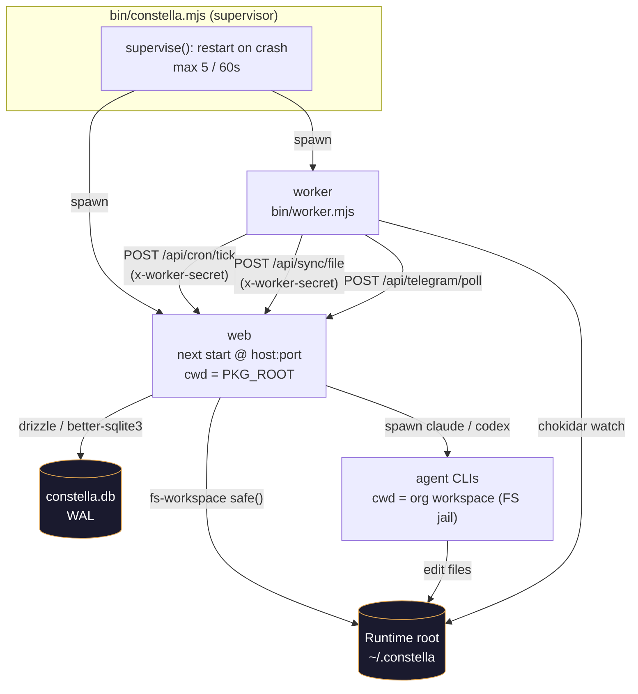
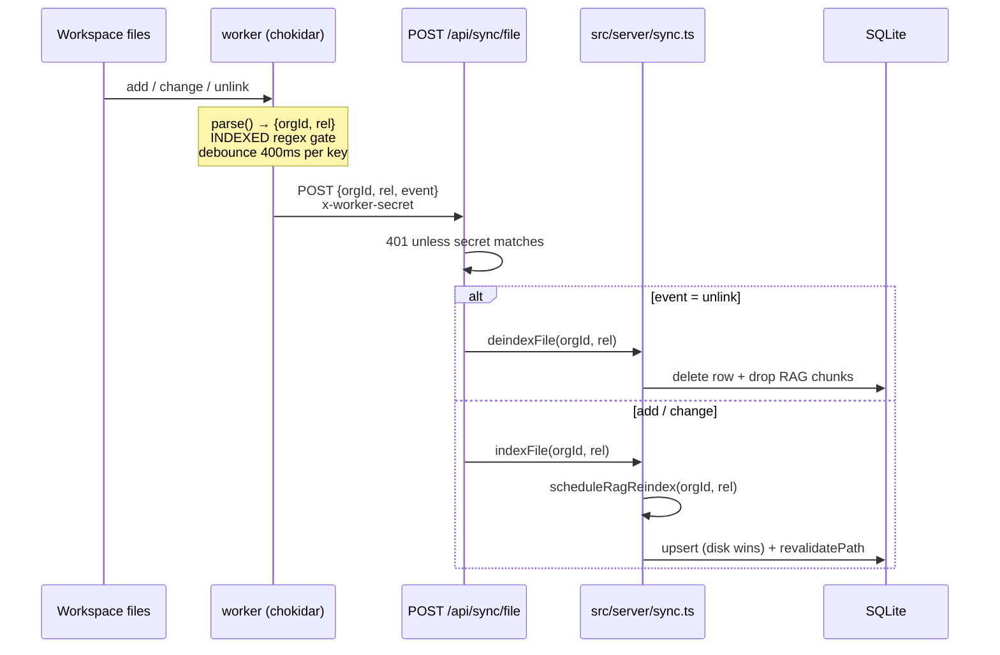

[← Docs index](./README.md) · [🇧🇷 Português](../pt/ARCHITECTURE.md) · [✦ Constella](../../README.md)

# 🌌 Architecture — the central ship

Constella is a local-first control plane: a single Node process supervises a **web server** and a **24/7 worker**, both orbiting one runtime root on disk where every organization keeps an isolated workspace. The directory is the source of truth; SQLite is the index that lets the UI and search agree.

> ✦ This document maps the *structural* layer: process topology, runtime root + org isolation, the filesystem jail, the SQLite/Drizzle store, the sync engine + file-watcher, and the cron tick that drives autonomous work. For the *cognitive* layer (how agents think, RAG, KB) see [AI_ARCHITECTURE](./AI_ARCHITECTURE.md).

---

## 🛰️ When to use this doc

- You need to understand **how Constella boots** and which process does what.
- You are debugging **why a file edit did not appear** in the UI (sync engine).
- You are reasoning about **multi-tenant isolation** (one runtime root, many orgs).
- You are hardening or auditing the **worker ↔ web** trust boundary.
- You want the **table-level map** of the database (`src/db/schema.ts`).

---

## 🚀 How it works (high level)

A single launcher — `bin/constella.mjs` — resolves the run mode, prepares the runtime root and secrets, applies the database migrations, then **supervises two long-lived children**:

| Child | Entry | Role |
| --- | --- | --- |
| **web** | `next start -H <host> -p <port>` (from `PKG_ROOT`) | The Next.js 16 app: UI, server actions, all `/api` routes, agent orchestration. |
| **worker** | `bin/worker.mjs` | Headless 24/7 driver: cron tick, the chokidar file-watcher, the Telegram long-poll. Talks to the web over loopback HTTP. |

The worker never touches the database directly. It only makes authenticated HTTP calls back into the web server (`x-worker-secret`), so all writes funnel through one process and one set of server actions. This keeps the trust boundary small and the DB single-writer.



---

## 🌠 Main flow — boot to steady state

The launcher's boot sequence (`bin/constella.mjs`), in order:

1. **Resolve install target** — an explicit launch flag (`--start|--vps|--portable`) wins, then legacy `--bind`. A bare `constella` prints usage and exits. Authentication (email + password) is required on every target. See [START_MODE](./START_MODE.md), [VPS_MODE](./VPS_MODE.md), [PORTABLE_MODE](./PORTABLE_MODE.md).
2. **Resolve the runtime root** — `CONSTELLA_HOME` / `--path` wins; otherwise `~/.constella`. Portable mode with no path enumerates removable USB drives and prompts. `mkdir -p <HOME>/organizations`.
3. **Pin paths** — `DATABASE_URL=file:<HOME>/constella.db`, `CONSTELLA_PKG_ROOT=<install dir>`. `PKG_ROOT` is where the prebuilt `.next`, `drizzle/` migrations and configs live (not the launch dir).
4. **Persist secrets** — read/generate `BETTER_AUTH_SECRET`, `CONSTELLA_VAULT_KEY`, `CONSTELLA_WORKER_SECRET` and write them to `<HOME>/.env` with mode `0o600`. Generated once; reused across restarts so sessions + the encrypted vault survive.
5. **Portable disk check** — refuse `< 32 GB` free (fatal); `≥ 32 GB` is fine.
6. **Apply migrations** — `drizzle-kit migrate --config drizzle.config.mjs` from `PKG_ROOT`. Idempotent. A *fresh* DB that fails to migrate aborts the boot (no tables → every request 500s).
7. **Build-on-first-run (fallback only)** — the published package ships a prebuilt `.next`, so this is skipped. From a source tree without a build it runs `next build`; it refuses to silently fall back to `next dev` in a public run unless `CONSTELLA_DEV=1`.
8. **Supervise web + worker** — spawn the web server, then ~1.5 s later the worker (so Next has a head start). Each child is wrapped in `supervise()`; on an unexpected exit it auto-restarts (bounded: `MAX_RESTARTS = 5` within `WINDOW_MS = 60_000`), else the supervisor gives up and exits.

Once steady, the **worker** waits for the server to answer (`waitForServer`, up to ~90 s), then:

- Fires the **cron tick** immediately and every `INTERVAL` (`CONSTELLA_WORKER_INTERVAL_MS`, default `60_000` ms).
- Starts the **chokidar watcher** over `<HOME>/organizations`.
- Runs the **Telegram long-poll** loop (`getUpdates` waits ~25 s server-side; gap ~1 s between polls).

---

## 🪐 Key concepts

### Runtime root + per-org isolation

```
~/.constella/                         ← runtime root (CONSTELLA_HOME or --path)
├─ .env                               ← persisted secrets (mode 0600)
├─ constella.db                       ← SQLite (WAL) — the index
├─ cache/                             ← models.dev cache, etc.
├─ backups/                           ← .env + db backups on update
└─ organizations/
   └─ <orgId>/
      └─ workspace/                   ← the org's isolated, sandboxed tree
         ├─ .claude/                  ← agents/, skills/, BRIEF.md (config INSIDE the workspace)
         ├─ DOCS/  PO/  Reports/
         ├─ specs/ issues/ mock/
         ├─ uploads/                  ← operator attachments, Telegram media
         └─ <the product the agents build>
```

The workspace directory is keyed by the **stable `organization.id`** (never the renameable slug). A one-time boot migration renames a legacy `constella/` dir to `workspace/` so existing orgs keep their data (falling back to a copy on a cross-device move, never deleting the legacy dir).

### The filesystem jail — `safe()`

Every workspace read/write goes through `safe(root, rel)` in `src/lib/fs-workspace.ts`. It is the single chokepoint that keeps a prompt-injected agent (or a buggy path) inside its own org:

1. **Lexical check** — `normalize(join(root, rel))` must equal `root` or start with `root + sep`. Because `join` re-roots absolute, drive-letter and UNC paths under `root`, this blocks `../`, absolute escapes and Windows drive tricks.
2. **Symlink check** — it resolves the real path of the nearest existing ancestor (`realAncestor`) and re-verifies it is still under the real `root`. This defeats a symlink *planted inside* the workspace that would otherwise tunnel out to another org or the wider filesystem.

`orgRoot()` additionally validates the org id (`/^[A-Za-z0-9_-]{6,64}$/`) before it ever touches a path, so a malformed id can't traverse. Heavy build/dependency dirs (`node_modules`, `.git`, `.next`, `dist`, `.testdev`, …) are skipped by `listFiles()` via `HEAVY_DIRS`.

### Directory is truth, DB is the index

The filesystem is canonical; the database **mirrors** it. Indexers in `src/server/sync.ts` are idempotent upserts and **disk always wins on conflict**. The same file written by an agent and later re-indexed by the watcher updates *one* row (keyed by H1 title or relative path), never duplicates.

### SQLite + Drizzle

`src/db/index.ts` opens `better-sqlite3` against the resolved `DATABASE_URL`, sets `journal_mode = WAL` and `foreign_keys = ON`, and wraps it with `drizzle-orm`. It also exports the raw `sqlite` handle for **migration-free boot DDL** (`CREATE TABLE IF NOT EXISTS` + guarded `ALTER ADD COLUMN`) — used to add tables/columns to existing DBs *without* `drizzle-kit push`, which would drift this project's migration history. See [SECURITY](./SECURITY.md) and [TROUBLESHOOTING](./TROUBLESHOOTING.md) for the `db:push` caveat.

### Worker ↔ web trust boundary

The worker holds the privileged `CONSTELLA_WORKER_SECRET` and attaches it as `x-worker-secret` to every call. Two protections matter:

- **Fail closed on the server**: `/api/cron/tick` and `/api/sync/file` return `401` unless the header equals the configured secret. An unset secret does **not** leave them open — they reject everyone.
- **SSRF / exfil guard on the worker**: the worker refuses to send the secret to a non-loopback host. The launcher always sets `CONSTELLA_BASE_URL=http://127.0.0.1:<port>` (loopback even when the web binds `0.0.0.0` for vps/portable). A genuine remote worker must opt in with `CONSTELLA_ALLOW_REMOTE_WORKER_BASE_URL=1`, and over plain `http://` it warns that the secret travels in cleartext.

---

## 🗃️ Tables

### Process / runtime environment

| Env var | Set by | Meaning |
| --- | --- | --- |
| `CONSTELLA_HOME` | launcher (`--path` / default `~/.constella`) | Runtime root. Relative values are anchored to the launch dir (`INIT_CWD`). |
| `DATABASE_URL` | launcher | `file:<HOME>/constella.db` (absolute, so app + `drizzle-kit migrate` open the same DB). |
| `CONSTELLA_PKG_ROOT` | launcher | Installed package root (prebuilt `.next`, `drizzle/`, bundled `skills/`). |
| `CONSTELLA_RUN_MODE` | launcher | `start \| vps \| portable`. Auth (email + password) is required on all of them. |
| `CONSTELLA_PUBLIC` | launcher (`=1`) | A CLI launch is the public runtime → the UI target-picker is hidden. |
| `CONSTELLA_VERSION` | launcher | Installed version, for the in-app Update check. |
| `BETTER_AUTH_SECRET` | `<HOME>/.env` | Session signing key (real, never the public default). |
| `CONSTELLA_VAULT_KEY` | `<HOME>/.env` | AES-256-GCM key for the `vault` table. |
| `CONSTELLA_WORKER_SECRET` | `<HOME>/.env` | Shared secret for worker → web auth (`x-worker-secret`). |
| `CONSTELLA_BASE_URL` | launcher → worker | `http://127.0.0.1:<port>` — loopback target for worker calls. |
| `CONSTELLA_WORKER_INTERVAL_MS` | optional | Cron tick interval (default `60_000`). |
| `CONSTELLA_ALLOW_REMOTE_WORKER_BASE_URL` | optional (`=1`) | Allow the worker to call a non-loopback host. |
| `CONSTELLA_WEB_HEAP_MB` | optional | `--max-old-space-size` for the web child. |
| `CONSTELLA_DEV` | optional (`=1`) | Permit a `next dev` fallback from a source tree without a build. |

### Core tenancy + structural tables (`src/db/schema.ts`)

| Table | Key columns | Purpose |
| --- | --- | --- |
| `organization` | `id`, `ownerId`, `runMode` (`start\|vps\|portable`), `archived` | Tenant. `runMode` is the persisted install target. |
| `member` | `orgId`, `userId`, `role` (`owner\|admin\|member`) | Org membership + roles. |
| `workspace` | `id`, `orgId`, `slug` (unique), `stack` (JSON), `runMode`, `bootstrap`, `settings` (JSON) | One workspace per org; `settings` holds Telegram/GitHub/source/agents config. |
| `agent` | `handle`, `role`, `adapter`, `model`, `status`, `health`, `reportsTo`, `dailyCapUsd` | The 10-agent constellation. |
| `skill` / `agentSkill` | `name`, `native`, `indexed`; join `auto` | Markdown procedures + per-agent enablement. |
| `goal` / `spec` / `issue` / `task` / `plan` | lifecycle `status`/`col`, `approved`, `auto247` | The work pipeline ([GOALS_SPECS_ISSUES](./GOALS_SPECS_ISSUES.md)). |
| `message` / `chatSession` / `event` / `decision` | `channel`, `runId`, `seq` | Team Room, DM sessions, live run events, decision log. |
| `ragChunk` / `kbEntry` / `syncedBlock` / `docIndex` | embeddings + KB layer | Memory nebula ([KB_RAG](./KB_RAG.md), [MEMORY_RAG](./MEMORY_RAG.md)). |
| `file` | `path`, `gitStatus` (`""\|M\|A\|U\|D`) | Editor mirror + git porcelain status. |
| `vault` | `ref`, `ciphertext`, `iv` | AES-GCM secrets keyed by provider. |
| `fileLock` | `workspaceId+path` (PK), `taskId`, `heartbeatAt` | Per-file lock so parallel agents never edit the same file ([SECURITY](./SECURITY.md)). |

> The schema defines ~60 tables. The list above covers the ones load-bearing for *architecture*; the work, KB and model tables are documented in their own pages.

### Sync engine — indexed prefixes

`bin/worker.mjs` only forwards files matching the `INDEXED` regex; `src/server/sync.ts` then routes each path to a per-type indexer:

| Path pattern | Indexer | DB target |
| --- | --- | --- |
| `.claude/skills/<name>.md` | `indexSkillFile` | `skill` |
| `.claude/agents/<handle>/(Agent\|skills).md` | `indexAgentFile` | `agent` (+ `agentSkill`) |
| `Reports/**.md` | `indexReportFile` | `report` |
| `DOCS/**.md` | `indexDocFile` (kind `docs`) | `docIndex` |
| `PO/**.md` | `indexDocFile` (kind `po`) | `docIndex` |

Any change to a RAG file also schedules a debounced incremental re-embed via `scheduleRagReindex`; a delete drops its chunks via `deindexRagFile`.

---

## 🌌 Mermaid — the sync engine (disk → DB)



---

## 🛰️ Mermaid — the prompt flow (tick → agent → disk → index)

This is the full loop that turns an autonomous tick into real work on disk, then back into the UI.

```mermaid
flowchart LR
  T["worker tick<br/>every 60s"] -->|"POST /api/cron/tick"| API["/api/cron/tick<br/>(401 unless x-worker-secret)"]
  API --> RUN["tickAll({ execute:true, auto:true })"]
  RUN -->|"per active workspace"| TW["tickWorkspace()"]
  TW --> SPAWN["spawn claude / codex<br/>--output-format json<br/>cwd = org workspace"]
  SPAWN -->|"FS jail safe()"| EDIT["agent edits files"]
  EDIT --> DISK[("workspace/ on disk")]
  DISK -->|"chokidar"| WATCH["worker watcher"]
  WATCH -->|"POST /api/sync/file"| SYNC["indexFile()"]
  SYNC --> DB[("SQLite index")]
  DB -->|"revalidatePath"| UI["Next.js UI updates"]
  EDIT -.->|"event rows (runId, seq)"| DB

  classDef store fill:#1a1a2e,stroke:#e0a44e,color:#fff
  class DISK,DB store
```



The agent run itself (model, permission mode, web research, timeouts) is detailed in [AGENTS](./AGENTS.md) and [AI_ARCHITECTURE](./AI_ARCHITECTURE.md). Architecturally, the key point is the **closed loop**: tick → spawn (jailed CLI) → disk → watcher → sync → DB → UI.

---

## 🚀 Step-by-step — trace a single edit end-to-end

1. The cron tick (or a DM) advances a workspace; the runner spawns a CLI agent with `cwd` = the org workspace (the FS jail).
2. The agent writes a file (e.g. `Reports/sprint-3.md`). All writes from server code go through `writeWorkspaceFile` → `safe()`; the CLI itself is confined by `cwd` + the guard/lock hooks.
3. chokidar (`awaitWriteFinish`, 300 ms stability) fires `add`/`change`.
4. `parse(abs)` derives `{orgId, rel}` from `<orgId>/workspace/<rel>` and tests the `INDEXED` regex. Non-indexed files are ignored.
5. A 400 ms per-key debounce coalesces rapid saves, then `POST /api/sync/file` with `x-worker-secret`.
6. The route authenticates and calls `indexFile(orgId, rel)` → `indexReportFile` → upsert into `report`, plus `scheduleRagReindex`.
7. `revalidatePath("/reports")` (and `/code`) refresh the UI on next navigation.

---

## 🌠 Examples

**Boot from npm (start mode):**
```bash
npx constellai                 # default = start mode, 127.0.0.1:3000
# Constella runtime root : C:\Users\you\.constella
# Mode                   : start  ·  127.0.0.1:3000
# • Starting: next start -H 127.0.0.1 -p 3000  +  worker
# watching C:\Users\you\.constella\organizations
```

**Point the runtime root at a project folder (dev):**
```bash
CONSTELLA_HOME=./.constella npx constellai --start --port 4000
```

**Run web + worker together in development (no global install):**
```bash
pnpm dev:all       # scripts/dev-all.mjs → next dev + worker (Telegram poll works in dev)
pnpm start         # scripts/start-all.mjs → next start + worker (prod build)
```

**Inspect the index directly:**
```bash
sqlite3 ~/.constella/constella.db ".tables"
sqlite3 ~/.constella/constella.db "SELECT handle,status,health FROM agent;"
```

---

## 🕳️ Possible states

| Surface | States |
| --- | --- |
| Supervised child | running · auto-restarting (`n/5 within 60s`) · gave up (supervisor exits) |
| `organization.runMode` | `start` · `vps` · `portable` |
| `workspace.runMode` | `off` · `start` · `vps` · `portable` (`off` is excluded from `tickAll`) |
| `workspace.bootstrap` | `pending` · `template-only` · `enriching` · `done` |
| `agent.status` | `idle` · `working` · `review` · `blocked` |
| `agent.health` | `alive` · `stale` · `down` |
| `file.gitStatus` | `""` · `M` · `A` · `U` · `D` |
| Worker base URL guard | loopback (allowed) · non-loopback + `ALLOW_REMOTE` · refused (exit 1) |

---

## 🛰️ Related integrations

- **Worker endpoints**: `/api/cron/tick`, `/api/sync/file`, `/api/telegram/poll` — all behind `x-worker-secret`.
- **Telegram** long-poll runs inside the worker → [TELEGRAM](./TELEGRAM.md).
- **GitHub** git status flows into `file.gitStatus` → [GITHUB](./GITHUB.md).
- **RAG/KB** re-embedding is triggered by the sync engine → [KB_RAG](./KB_RAG.md), [MEMORY_RAG](./MEMORY_RAG.md).
- **Public API / MCP** are separate inbound surfaces (not worker-secret) → [PUBLIC_API](./PUBLIC_API.md), [MCP](./MCP.md).

---

## 🕳️ Security

- **FS jail** `safe()` — lexical + symlink checks; the workspace root is never deletable through it. Org id is validated before any path is built.
- **Worker secret fails closed** — `/api/cron/tick` and `/api/sync/file` reject every request when no secret is configured (an unset secret is *not* an open door).
- **SSRF guard** — the worker only sends its secret to loopback unless explicitly overridden; cleartext remote use is warned.
- **Vault** — secrets live only in the `vault` table (AES-256-GCM via `CONSTELLA_VAULT_KEY`), never on provider rows; `.env` is written `0o600`.
- **Single writer** — the worker has no DB handle; all writes go through the web process, so there is one authority for consistency.
- Full detail in [SECURITY](./SECURITY.md).

---

## 🌌 Troubleshooting

| Symptom | Likely cause | Where to look |
| --- | --- | --- |
| File edited but UI stale | watcher not running, or path not in `INDEXED` | worker logs (`watching …`); `bin/worker.mjs` `INDEXED` regex |
| `401 unauthorized` on tick/sync | `CONSTELLA_WORKER_SECRET` mismatch between web + worker | `<HOME>/.env`; both children inherit it from the launcher |
| Worker exits at start | `CONSTELLA_BASE_URL` is non-loopback without override | set loopback or `CONSTELLA_ALLOW_REMOTE_WORKER_BASE_URL=1` |
| Two separate databases appear | standalone server chdir without `INIT_CWD` | use `pnpm start` / the CLI (they set `INIT_CWD`); see `src/lib/runtime-root.ts` warning |
| Fresh DB has no tables | `drizzle-kit migrate` failed on first boot | reinstall the package; check `drizzle/` ships; boot aborts on a fresh-DB migrate failure by design |
| Crash-loop "giving up" | a child crashed 5× in 60s | check the OOM hint; raise `CONSTELLA_WEB_HEAP_MB` if it's a JS-heap OOM |

More in [TROUBLESHOOTING](./TROUBLESHOOTING.md) and [FAQ](./FAQ.md).

---

## ✦ Related links

- [AI_ARCHITECTURE](./AI_ARCHITECTURE.md) — the cognitive layer (agents, RAG, context).
- [AGENTS](./AGENTS.md) — the 10-agent constellation and how runs are spawned.
- [CONFIGURATION](./CONFIGURATION.md) — env vars and settings in depth.
- [INSTALLATION](./INSTALLATION.md) · [START_MODE](./START_MODE.md) · [VPS_MODE](./VPS_MODE.md) · [PORTABLE_MODE](./PORTABLE_MODE.md)
- [KB_RAG](./KB_RAG.md) · [MEMORY_RAG](./MEMORY_RAG.md) · [SYNCED_BLOCKS](./SYNCED_BLOCKS.md)
- [SECURITY](./SECURITY.md) · [TROUBLESHOOTING](./TROUBLESHOOTING.md) · [FAQ](./FAQ.md)
- [TELEGRAM](./TELEGRAM.md) · [GITHUB](./GITHUB.md) · [PUBLIC_API](./PUBLIC_API.md) · [MCP](./MCP.md)
