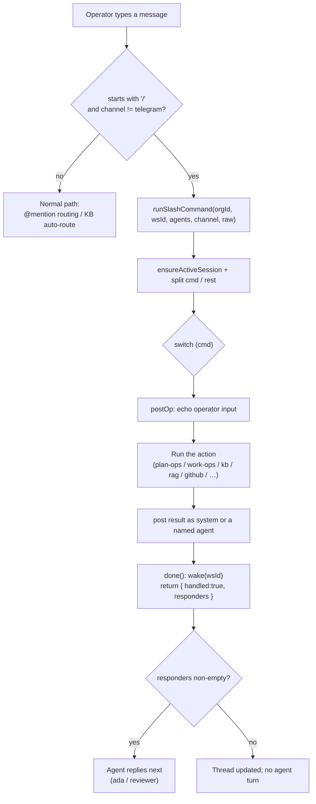

[← Docs index](./README.md) · [🇧🇷 Português](../pt/CHAT_COMMANDS.md) · [✦ Constella](../../README.md)

# 🛰️ Chat Commands


> Slash commands are the control panel of the central ship. Type a `/command` in the Team Room or any DM and the server runs a real action server-side, then posts the result back into the same thread — no agent round-trip required.

---

## 2. Short description

Chat slash commands are parsed from a leading `/` in the message-send path. They are intercepted **before** the normal conversational path (the `[[CREATE_WORK]]` token and `@mention` routing) and executed by `runSlashCommand` in `src/server/commands.ts`. Each command posts its result straight into the active channel; a handful also hand off to an agent who replies next.

---

## 3. When to use

Use slash commands when you want a **deterministic, immediate action** rather than a conversation:

- Drive the work lifecycle without prose: `/approve`, `/run-247`, `/pause`, `/reject`, `/cancel`, `/archive`.
- Query the constellation's state at a glance: `/status`, `/agents`, `/agent`, `/locks`, `/models`, `/skills`, `/telegram`.
- Tap the memory nebula: `/kb`, `/search`, `/graph`, `/reindex`, `/curate`.
- Trigger gates and pipelines: `/test-dev`, `/review`, `/github`, `/prepare-deploy`, `/export-source`.
- Seed new work or board items: `/new-goal`, `/new-issue`, `/new-spec`, `/generate-plan`, `/assign`, `/close-sprint`.

For free-form requests ("build me a billing page"), just talk to **@ada** in the Team Room or use `/new-goal` — see [DM.md](./DM.md) and [WORKFLOW.md](./WORKFLOW.md).

---

## 4. How it works 🌌

The send path lives in `src/server/chat.ts`. After resolving the org, workspace and agent roster, it inspects the trimmed message text:

```ts
// src/server/chat.ts — slash commands (room + DM, not Telegram)
const trimmed = (text ?? "").trim();
if (trimmed.startsWith("/") && channel !== "telegram") {
  const { runSlashCommand } = await import("@/server/commands");
  const r = await runSlashCommand(org.id, workspace.id, agents, channel, trimmed);
  if (r.handled) { revalidatePath("/", "layout"); return { responders: r.responders }; }
}
```

Key facts grounded in the code:

- **Channels**: slash commands are honoured in the **Team Room** (`room`) and **DMs** (`dm:<handle>`). They are **not** parsed in the `telegram` channel — Telegram has its own remote-control command handler (`handleCommand` in `src/server/telegram.ts`). See [TELEGRAM.md](./TELEGRAM.md).
- **Parsing**: `runSlashCommand` splits on the first space. The token before the space is lower-cased into `cmd`; everything after is trimmed into `rest` (the argument).
- **Echo + reply**: most commands first echo your raw input with `postOp(...)` (as the operator), then post a result with `post(...)`. The result author is usually `system`, but several commands post **as a specific agent** (e.g. Vannevar, Edsger, Werner, Donald, Ada).
- **Responders**: `runSlashCommand` returns `{ handled, responders }`. A non-empty `responders` array means the named agent(s) should reply next — used by `/new-goal`, `/review`.
- **Wake**: every handled command calls `wake(wsId)` (via the internal `done()` helper) to nudge the worker/bus.
- **Sessions**: `ensureActiveSession(wsId, channel)` attaches the result to the channel's active `chatSession`.

### Room auto-routing

In the Team Room, plain text that is **not** a `/command` and **not** an `@mention` is auto-prefixed to `/kb` before sending (see `welcome-chat.tsx` and `home-command-bar.tsx`). So typing `how does auth work?` in the room is equivalent to `/kb how does auth work?`. In a DM, text is sent as-is to that agent.

### Home command bar

The Welcome Home command bar (`src/components/modules/home-command-bar.tsx`) reuses the same dispatch and shows an autocomplete menu for a curated subset: `/kb`, `/status`, `/new-goal`, `/agents`, `/reindex`, `/curate`, `/help`. The full command set below works in any room/DM input regardless of the menu.

---

## 5. Main flow



---

## 6. Key concepts 🪐

| Concept | Meaning |
| --- | --- |
| `cmd` | The lower-cased token before the first space (e.g. `/approve`). |
| `rest` | Trimmed text after the first space — the command argument. |
| `responders` | Agent handles that should reply after the command (handoff). |
| `postOp` | Inserts your raw input as a `fromKind: operator` message. |
| `post` | Inserts the result as `fromKind: agent` with a `fromHandle` (often `system`). |
| `kind` | Optional message render hint: `kb-card`, `agent-card`, `cleared`. |
| `sources` | Citation references attached to KB answers. |
| `done()` | Internal helper: calls `wake(wsId)` and returns `{ handled:true, responders }`. |

---

## 7. The command catalogue (one big table) ✦

Every command parsed by `runSlashCommand`, grouped by category. "Responds as" is the `fromHandle` of the result message; "Hands off" is the agent in the returned `responders` array (replies next).

### Help & info

| Command (aliases) | Args | What it does | Responds as | Hands off |
| --- | --- | --- | --- | --- |
| `/help` | — | Posts the full command list. | `system` | — |
| `/status` | — | Counts active goals, open issues (col ≠ `done`) and tasks in flight (col = `doing`). | `system` | — |
| `/agents` | — | Lists the roster: `@handle — name (role, status)`. | `system` | — |
| `/agent <handle>` | `<handle>` (with or without `@`) | Inspects one agent: name, role, status, health, runtime (adapter / model) + link to Agent Studio. | the agent's own handle (card) | — |

### Knowledge & memory nebula 🌠

| Command (aliases) | Args | What it does | Responds as | Hands off |
| --- | --- | --- | --- | --- |
| `/kb` (`/ask-kb`) | `<question>` | Asks the Knowledge Base via `kbAnswer`; answers with references (`sources`). Overview answers render as a `kb-card`. Schedules a chat reindex. | `vannevar` | — |
| `/search <q>` | `<query>` | Same engine as `/kb` (`kbAnswer`) — a search-flavoured alias with its own empty-arg prompt. | `vannevar` | — |
| `/graph <key>` | spec key, issue key, or goal-title substring | Resolves the seed (spec → issue → goal) and shows connected knowledge via `relatedKnowledge`, grouped by type. | `vannevar` | — |
| `/reindex` | — | Rebuilds the RAG/KB index now (`indexRag`); reports chunk count and whether semantic or keyword-fallback. | `vannevar` | — |
| `/curate` | — | Runs Vannevar's KB curation pass (`runKbCuration`): dedup / retire / re-summarise / find gaps. Budget-gated. Details to `Reports/kb-health.md`. | `vannevar` | — |

### Work lifecycle 🚀

| Command (aliases) | Args | What it does | Responds as | Hands off |
| --- | --- | --- | --- | --- |
| `/new-goal` (`/new-work`) | `<brief>` | Hands the brief to the CEO via the normal new-work pipeline (re-sends as `@ada <brief>`). Schedules a chat reindex. | (operator echo) | `ada` |
| `/generate-plan` | `<brief>` (optional) | Calls `generatePlanFor` — drafts specs → issues → TODOs into the CEO Planner for approval. | `ada` | — |
| `/approve` | — | Approves the pending plan (`approvePlanFor`) and queues tasks; reports the count. | `system` | — |
| `/reject` | `<reason>` (optional) | Sends the plan back to the CEO (`requestPlanChangesFor`); records the reason if given. | `system` | — |
| `/run-247` (`/resume`) | — | Turns 24/7 autonomous execution **ON** (`setAuto247For(..., true)`). | `system` | — |
| `/pause` | — | Turns 24/7 autonomous execution **OFF** (`setAuto247For(..., false)`). | `system` | — |
| `/cancel` | — | Cancels the most recent **active** goal (`cancelGoalFor`); execution stops. | `system` | — |
| `/archive` | — | Archives the most recent **active** goal (`archiveGoalFor`); reports the archive path. | `system` | — |
| `/close-sprint` | — | Closes the sprint (`closeSprintFor`): counts shipped vs carried, writes a retro file. | `donald` | — |

### Board items

| Command (aliases) | Args | What it does | Responds as | Hands off |
| --- | --- | --- | --- | --- |
| `/new-issue <title>` | `<title>` | Creates a single issue (`col: todo`, `prio: med`) with an auto-incremented numeric key. | `system` | — |
| `/new-spec <title>` | `<title>` | Creates a single spec with key `SPEC-NN` (zero-padded). | `system` | — |
| `/assign <issue> <@agent>` | `<issue-key> <@agent>` | Sets `issue.assigneeId` to the named agent. | `system` | — |

### Gates, pipelines & integrations 🛰️

| Command (aliases) | Args | What it does | Responds as | Hands off |
| --- | --- | --- | --- | --- |
| `/test-dev` | — | Runs the Test Dev validation gate (`runTestDevAction`); reports `PASS`/`FAIL`/`INCONCLUSIVE` + summary. | `edsger` | — |
| `/review` | `<note>` (optional) | Picks a reviewer (CyberSec/QA role, else `whitfield`) and asks them to review recent board changes. | (operator echo) | the reviewer (e.g. `whitfield`) |
| `/github` | — | Refreshes the repository status (`refreshGitStatus`); reports the count of changed files. | `werner` | — |
| `/prepare-deploy` | — | Runs the Prepare-Deploy pipeline (`runDeployPipeline`); reports status + summary. | `werner` | — |
| `/export-source <repo>` | `<github-repo>` | Exports the clean product source to a separate repo (`exportCleanSource`); blocks on secret findings. | `werner` | — |
| `/telegram` | — | Reports Telegram integration status (`getTelegramConfig`). | `system` | — |
| `/models` | — | Reports local-model status: llama.cpp (`llamaServerStatus`) + Ollama (`ollamaInfo`). | `system` | — |
| `/skills` | — | Reports the skills library size + a sample of names (`allLibrarySkillNames`). | `system` | — |
| `/locks` | — | Lists file locks currently held (`activeLocks`): `path — @agent`. | `system` | — |

### Maintenance

| Command (aliases) | Args | What it does | Responds as | Hands off |
| --- | --- | --- | --- | --- |
| `/clear` | `confirm` \| `yes` \| `sim` | Permanently deletes EVERY message, the compacted summary and run events **for this channel**. Requires a confirm token; otherwise posts a warning. Board/goals/specs/KB are NOT affected. | `system` (`cleared` kind) | — |
| _unknown_ | — | Any other `/token` echoes and replies `Unknown command — Try /help`. | `system` | — |

---

## 8. Aliases at a glance

| Canonical | Aliases |
| --- | --- |
| `/kb` | `/ask-kb` |
| `/new-goal` | `/new-work` |
| `/run-247` | `/resume` |

> Note: `/cancel` and `/archive` share one `case` block but are **distinct** commands (different effects), not aliases of each other.

---

## 9. Step-by-step

### Approve a plan and start the team

1. In the Team Room, type `/approve`.
2. The server runs `approvePlanFor` and posts `✅ Plan approved — N task(s) queued.` as `system`.
3. Type `/run-247` to flip 24/7 autonomous execution ON.
4. Watch progress with `/status` and `/locks`.

### Ask the memory nebula

1. Type `/kb how does the calculation engine work?` (or just the plain question in the room).
2. Vannevar answers with `sources`; an overview answer renders as a `kb-card`.
3. If knowledge feels stale, run `/reindex`, then `/curate`.

### Inspect a working constellation

1. `/agents` to see the roster.
2. `/agent margaret` for runtime details + an Agent Studio link.
3. `/locks` to see which files agents are holding.

---

## 10. Examples

```text
/help
/status
/agents
/agent ada
/kb how does auth work?
/ask-kb where are sessions stored?
/search rate limiting
/graph SPEC-01
/reindex
/curate
/new-goal a billing page with payment-provider checkout
/new-work add 2FA to the login screen
/generate-plan migrate the database to Postgres
/approve
/reject the spec is missing the refund flow
/run-247
/resume
/pause
/cancel
/archive
/new-issue add a logout button
/new-spec billing architecture
/assign 3 @margaret
/test-dev
/review focus on the new payment endpoint
/github
/prepare-deploy
/export-source myorg/constella-public
/telegram
/models
/skills
/locks
/close-sprint
/clear
/clear confirm
```

---

## 11. Possible states 🕳️

| Situation | What you see |
| --- | --- |
| Empty arg on a command that needs one | A usage hint (e.g. `Ask a question, e.g. /kb …`). |
| `/agent <handle>` not on roster | `No agent @handle on the roster. Use /agents …`. |
| `/cancel` / `/archive` with no active goal | `No active goal to cancel/archive.`. |
| `/assign` malformed | `Usage: /assign <issue-key> <@agent> …`. |
| `/assign` unknown issue / agent | `No issue #key …` / `No agent @handle …`. |
| `/graph` no match | `No goal / spec / issue matches …`. |
| `/graph` match but no connections yet | `No connected knowledge for … yet`. |
| `/reindex` with embed server down | `… (keyword fallback — embed server down).`. |
| `/curate` nothing to do / no budget | `Nothing to curate right now …`. |
| `/export-source` blocked by secrets | `🛑 Export blocked — N secret finding(s).`. |
| `/clear` without confirm | A `⚠️` warning; nothing deleted. |
| Unknown command | `Unknown command — Try /help`. |

---

## 12. Related integrations

- **Plan / work ops** — `/approve`, `/reject`, `/run-247`, `/pause` call shared cores in `src/server/plan-ops.ts` and `src/server/work-ops.ts`, the same ones used by the [Public API](./PUBLIC_API.md) and [Telegram](./TELEGRAM.md).
- **Knowledge Base / RAG** — `/kb`, `/search`, `/graph`, `/reindex`, `/curate` route into [KB_AGENT.md](./KB_AGENT.md), [KB_RAG.md](./KB_RAG.md) and [MEMORY_RAG.md](./MEMORY_RAG.md).
- **Pipelines** — `/test-dev` → [TEST_DEV.md](./TEST_DEV.md); `/prepare-deploy` + `/export-source` → [PREPARE_DEPLOY.md](./PREPARE_DEPLOY.md) and [DEPLOY.md](./DEPLOY.md); `/github` → [GITHUB.md](./GITHUB.md).
- **Models & skills** — `/models` → [MODELS.md](./MODELS.md); `/skills` → [SKILLS.md](./SKILLS.md).

---

## 13. Security 🔒

- Slash commands run **server-side** under the operator's session — the message-send path resolves the org/workspace before dispatch.
- `/clear` is the only destructive command on conversation data and is **double-gated** (requires `confirm`/`yes`/`sim`). It never touches board work, goals, specs or the KB.
- `/export-source` is **secret-scan gated** — it refuses to push if findings exist (see [SECURITY.md](./SECURITY.md)).
- Telegram does **not** share this parser; its remote commands run through a separate allowlisted handler — see [TELEGRAM.md](./TELEGRAM.md).
- Result text is truncated to 4000 chars on insert (`text.slice(0, 4000)`).

---

## 14. Troubleshooting

| Symptom | Likely cause / fix |
| --- | --- |
| `/command` was treated as plain text | You typed it in the **Telegram** channel (uses a different handler) or with a leading space. Slash must be the first character. |
| Plain text in the room "became" a `/kb` query | Expected: room auto-routes non-command, non-mention text to `/kb`. Prefix with `@handle` to talk to an agent instead. |
| `/reindex` says "keyword fallback" | The embed server is down — start it (see [MEMORY_RAG.md](./MEMORY_RAG.md)). KB still works via keyword search. |
| `/approve` / `/cancel` says "No workspace/active goal" | There is no pending plan or active goal yet — create work with `/new-goal` first. |
| `/curate` does nothing | Needs a few KB entries **and** available budget. |
| Unknown command | Check spelling and aliases above, or run `/help`. |

---

## 15. Related links

- [DM.md](./DM.md) — direct messages with a single agent
- [TEAM_ROOM.md](./TEAM_ROOM.md) — the shared room and @mention routing
- [WORKFLOW.md](./WORKFLOW.md) — Goal → Spec → Issue → Plan → Execution lifecycle
- [GOALS_SPECS_ISSUES.md](./GOALS_SPECS_ISSUES.md) — board items created by `/new-issue` / `/new-spec`
- [AGENTS.md](./AGENTS.md) — the roster behind `/agents` and `/agent`
- [KB_AGENT.md](./KB_AGENT.md) · [KB_RAG.md](./KB_RAG.md) · [MEMORY_RAG.md](./MEMORY_RAG.md) — the memory nebula behind `/kb`, `/search`, `/graph`, `/reindex`, `/curate`
- [TEST_DEV.md](./TEST_DEV.md) · [PREPARE_DEPLOY.md](./PREPARE_DEPLOY.md) · [GITHUB.md](./GITHUB.md) — the gates behind `/test-dev`, `/prepare-deploy`, `/github`
- [TELEGRAM.md](./TELEGRAM.md) — the separate remote-control command set
- [PUBLIC_API.md](./PUBLIC_API.md) — the same plan/work ops over HTTP
