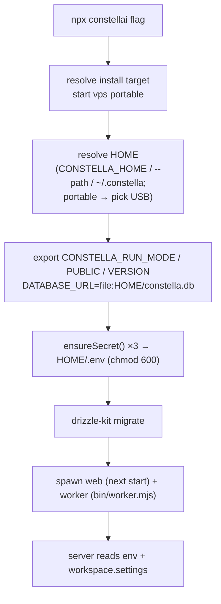
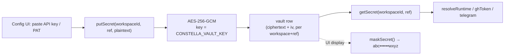

[← Docs index](./README.md) · [🇧🇷 Português](../pt/CONFIGURATION.md) · [✦ Constella](../../README.md)

# Configuration ✦ 🪐


> Every knob that steers the central ship: environment variables, the `<HOME>/.env` secrets file, the encrypted vault for provider keys, local-model ports, and the JSON `settings` carried on the workspace row.

Constella is configured at three altitudes, each with its own gravity well:

1. **Launch flags** — picked once by `bin/constella.mjs` (install target, host, port, runtime root).
2. **Environment variables** — read at boot by the server and worker; secrets are persisted to `<HOME>/.env`.
3. **Workspace settings** — runtime toggles stored as JSON on the `workspace.settings` column, editable from the Config UI without a restart.

Nothing here is faked: every variable below is read by real code in the paths cited.

---

## 1. When to use 🛰️

| You want to… | Reach for |
| --- | --- |
| Change install target (local/vps/usb) | A launch flag (`--start`, `--vps`, `--portable`) → `CONSTELLA_RUN_MODE` (a bare `constella` prints usage) |
| Move the runtime root off `~/.constella` | `CONSTELLA_HOME` or `--path <dir>` |
| Bind to a different host/port | `--host` / `--port` (or `PORT`) |
| Store a provider API key / GitHub PAT | The encrypted **vault** (UI), never an env var |
| Point at a local model server | `LLAMACPP_URL`, `OLLAMA_URL`, `CONSTELLA_EMBED_URL` |
| Loosen/tighten agent permissions | `CONSTELLA_AGENT_FULL_ACCESS`, or `settings.agents.*` |
| Cap concurrent agent runs | `CONSTELLA_MAX_CONCURRENT_AGENTS` or `settings.agents.maxConcurrent` |

---

## 2. How it works 🌌

The launcher resolves the runtime root, then guarantees three signing secrets exist before the server boots:



**Key fact (`bin/constella.mjs`):** every mode persists a real `BETTER_AUTH_SECRET`, `CONSTELLA_VAULT_KEY` and `CONSTELLA_WORKER_SECRET`. `next start` runs under `NODE_ENV=production`, where better-auth throws on its default secret, the vault refuses to encrypt without its key, and the worker fails closed without its secret — so even local `start` mode needs all three. They are persisted (not ephemeral) so login sessions and the encrypted vault survive a restart.

---

## 3. Main flow: secret persistence 🌠

From `bin/constella.mjs` (`ensureSecret`):

1. **env wins** — if the variable is already set in `process.env`, use it and do not write.
2. **reuse persisted** — else if a non-placeholder value is in `<HOME>/.env`, hydrate `process.env` from it.
3. **generate once** — else generate a fresh value, store it in `<HOME>/.env`, and export it.

```
BETTER_AUTH_SECRET      = randomBytes(32).toString("base64url")
CONSTELLA_VAULT_KEY     = randomBytes(32).toString("base64")    # must decode to 32 bytes
CONSTELLA_WORKER_SECRET = randomBytes(24).toString("base64url")
```

The file is written with mode `0o600` (and a best-effort `chmodSync` on Windows). The launcher prints `• Secrets ready (stored in <HOME>/.env, never printed).` — the values themselves are never logged.

---

## 4. Key concepts 🪐

- **Runtime root (`<HOME>`)** — defaults to `~/.constella`; overridable with `CONSTELLA_HOME` or `--path`. Holds `constella.db`, `.env`, `cache/`, `backups/`, and `organizations/<orgId>/workspace/`. In portable mode with no explicit path, the launcher detects removable USB drives and uses `<drive>/.constella`.
- **Package root (`CONSTELLA_PKG_ROOT`)** — the installed package's own directory (the compiled `.next`, `drizzle/` migrations, bundled `skills/`). Exported so the server finds assets when installed globally rather than from the launch CWD.
- **Vault** — provider API keys and GitHub PATs are AES-256-GCM encrypted at rest in the `vault` table, keyed by `CONSTELLA_VAULT_KEY`. Plaintext **never** touches `provider` rows and **never** reaches the client (`src/lib/vault.ts`).
- **Workspace settings** — a JSON blob on `workspace.settings`; runtime overrides for agent permissions, the editor, integrations, and import metadata.

---

## 5. The big environment-variable table 🌌

### 5.1 Launcher-set / boot core

| Variable | Default | Set by / Read by | Meaning |
| --- | --- | --- | --- |
| `CONSTELLA_HOME` | `~/.constella` | launcher / `src/lib/fs-workspace.ts`, `runtime-root.ts`, worker | Runtime root holding DB, `.env`, orgs. Relative values anchor to `INIT_CWD`. |
| `CONSTELLA_RUN_MODE` | `start` | launcher / `src/lib/run-mode.ts`, `cli.ts`, `proxy.ts` | `start \| vps \| portable`. Drives bind host + agent jail. Auth (email + password) is required on all of them. |
| `CONSTELLA_PUBLIC` | `1` (CLI launch) | launcher / `src/lib/build-mode.ts` | A CLI launch is the public runtime → the in-UI target picker is hidden. |
| `CONSTELLA_VERSION` | local `package.json` version | launcher / `src/lib/version.ts` | Reliable installed version for the in-app Update check. |
| `CONSTELLA_PKG_ROOT` | package dir | launcher / `skills-library.ts`, `cli.ts` | Where bundled assets (`skills/`, `.next`, `drizzle/`) live. |
| `DATABASE_URL` | `file:<HOME>/constella.db` | launcher / `src/db/index.ts`, `drizzle.config.mjs` | SQLite file (absolute under the runtime root). |
| `PORT` | `3000` | env / launcher | Web port if `--port` is not given. |
| `CONSTELLA_FORCE_ONBOARDING` | unset | `--onboarding` / `src/lib/workspace.ts`, `onboarding.ts` | Force the first-run wizard. |
| `CONSTELLA_DEV` | unset | dev tree / `build-mode.ts`, launcher | `1` allows a dev-server fallback when no production build exists (otherwise the launcher fails closed). |
| `CONSTELLA_WEB_HEAP_MB` | `0` (Node default) | env / launcher | Opt-in `--max-old-space-size` for the web child (JS-heap OOM relief). |

### 5.2 Secrets (persisted to `<HOME>/.env`, chmod 600)

| Variable | Generated as | Read by | Meaning |
| --- | --- | --- | --- |
| `BETTER_AUTH_SECRET` | `randomBytes(32).base64url` | `src/lib/auth.ts`, `boot.ts` | Session signing key. better-auth throws on its default in production. |
| `CONSTELLA_VAULT_KEY` | `randomBytes(32).base64` | `src/lib/vault.ts` | AES-256-GCM key for the secret vault. Must decode to exactly 32 bytes. |
| `CONSTELLA_WORKER_SECRET` | `randomBytes(24).base64url` | worker + `/api/cron/tick`, `/api/sync/file`, `/api/telegram/poll`, `/api/locks/acquire` | Shared secret on the privileged worker endpoints; they reject all requests when it is unset. |

> The vault, auth, and worker secrets are also listed in `src/lib/scrub.ts` so they are scrubbed from KB ingest, Telegram messages and logs.

### 5.3 Worker

| Variable | Default | Read by | Meaning |
| --- | --- | --- | --- |
| `CONSTELLA_BASE_URL` | `http://localhost:3000` (launcher sets `http://127.0.0.1:<port>`) | `bin/worker.mjs`, `bin/lock-hook.mjs`, `cli.ts` | The local server URL the worker calls back to. |
| `CONSTELLA_WORKER_INTERVAL_MS` | `60000` | `bin/worker.mjs` | Cron tick interval (POST `/api/cron/tick`). |
| `CONSTELLA_ALLOW_REMOTE_WORKER_BASE_URL` | unset | `bin/worker.mjs` | SSRF guard override: the worker refuses to send its secret to a non-loopback host unless this is `1`. |

### 5.4 Agent execution (`src/server/adapters/cli.ts`, `runner.ts`)

| Variable | Default | Meaning |
| --- | --- | --- |
| `CONSTELLA_AGENT_FULL_ACCESS` | derived (`start`→full, else jailed) | `1`/`0` overrides the permission mode. Full → `bypassPermissions` (claude) / `danger-full-access` (codex); jailed → `acceptEdits` / `workspace-write`. |
| `CONSTELLA_WEB_RESEARCH` | on | `0` disables the additive `--allowedTools WebSearch WebFetch` for agent runs. Also `settings.agents.webResearch`. |
| `CONSTELLA_AGENT_CMD_GUARD` | off | Destructive-shell guard (`bin/guard-hook.mjs`) — **opt-in**: it runs through the clean-config isolation that can drop the agent's CLI login, so it is off by default. `1` enables. Also `settings.agents.cmdGuard`. |
| `CONSTELLA_AGENT_LOCK_HOOK` | off | `1` enables per-file locking via `bin/lock-hook.mjs` + a clean agent config dir. Also `settings.agents.fileLocks`. |
| `CONSTELLA_MAX_CONCURRENT_AGENTS` | `1` | Concurrent agent runs **per workspace** (`runner.ts`). Also `settings.agents.maxConcurrent`. |
| `CONSTELLA_AUTO_REVIEW` | on | `0` disables the independent review gate. Also `settings.agents.autoReview`. |

The lock-hook child receives identity env: `CONSTELLA_ORG_ID`, `CONSTELLA_TASK_ID`, `CONSTELLA_AGENT_ID`, `CONSTELLA_AGENT_HANDLE`, plus `CLAUDE_CONFIG_DIR` pointing at the clean agent config dir. Agent CLI runs time out at **180000 ms** by default.

### 5.5 Models, RAG & KB

| Variable | Default | Read by | Meaning |
| --- | --- | --- | --- |
| `LLAMACPP_URL` | `http://127.0.0.1:8082` | `local-models.ts`, `runtime.ts`, `kb.ts` | Local **chat** llama.cpp server (OpenAI-compatible `/v1`). |
| `CONSTELLA_EMBED_URL` | `http://127.0.0.1:8083` | `local-models.ts`, `rag.ts` | Dedicated llama.cpp **embedding** server for RAG (auto-started on boot). |
| `OLLAMA_URL` | `http://127.0.0.1:11434` | `local-models.ts`, `runtime.ts`, `rag.ts` | Fallback embedding/chat provider (Ollama). |
| `CONSTELLA_EMBED_MODEL` | `nomic-embed-text` | `rag.ts`, `model-catalog.ts` | Embedding model name; `nomic*` triggers the asymmetric `search_document:`/`search_query:` prefixes. |
| `CONSTELLA_KB_CURATION` | on | `kb.ts` | `0` opts out of the budget-gated Vannevar KB-curation pass. |

### 5.6 better-auth URLs (dev `.env.example`)

| Variable | Example | Meaning |
| --- | --- | --- |
| `BETTER_AUTH_URL` | `http://localhost:3000` | Server-side auth base URL. |
| `NEXT_PUBLIC_BETTER_AUTH_URL` | `http://localhost:3000` | Client-side auth base URL. |

### 5.7 Out-of-process clients (PAT-based)

| Variable | Default | Read by | Meaning |
| --- | --- | --- | --- |
| `CONSTELLA_PAT` | unset | `scripts/mcp-server.mjs` | `cn_…` Personal Access Token for the MCP bridge / Public API. |
| `CONSTELLA_ORG` | unset | `scripts/mcp-server.mjs` | Optional org id (maps to the `X-Constella-Org` header). |

> `CONSTELLA_BASE_URL` is also read by the MCP server (default `http://localhost:3000`).

---

## 6. Ports 🛰️

| Port | Process | Configurable via |
| --- | --- | --- |
| `3000` | Web server (`next start`) + worker callback target | `--port` / `PORT`; `CONSTELLA_BASE_URL` for the worker |
| `8082` | Local llama.cpp **chat** server (`LLAMACPP`) | `LLAMACPP_URL` |
| `8083` | Local llama.cpp **embedding** server (RAG) | `CONSTELLA_EMBED_URL` |
| `11434` | Ollama (fallback embeddings/chat) | `OLLAMA_URL` |

The Test Dev harness boots project dev servers on a free port in the range **4173–4999** (avoiding 3000) — see [TEST_DEV](./TEST_DEV.md).

---

## 7. The `<HOME>/.env` file 🌠

Written and re-read by the launcher. A minimal generated file:

```dotenv
BETTER_AUTH_SECRET=…base64url…
CONSTELLA_VAULT_KEY=…base64 (32 bytes)…
CONSTELLA_WORKER_SECRET=…base64url…
```

The dev-tree template `.env.example` shows the full surface used when running from source:

```dotenv
DATABASE_URL=file:./.constella/constella.db
BETTER_AUTH_SECRET=replace-with-a-long-random-string
BETTER_AUTH_URL=http://localhost:3000
NEXT_PUBLIC_BETTER_AUTH_URL=http://localhost:3000
CONSTELLA_RUN_MODE=start
CONSTELLA_HOME=./.constella
CONSTELLA_VAULT_KEY=replace-with-32-byte-base64-key
CONSTELLA_WORKER_SECRET=replace-with-a-random-string
```

**Precedence:** `process.env` (shell / Docker / systemd) always wins over `<HOME>/.env`. The file only supplies values that are not already in the environment, and only generates the three signing secrets if neither source has them.

---

## 8. The vault: provider keys & PATs 🕳️

Provider API keys and GitHub PATs are **never** environment variables and **never** columns on `provider`. They live encrypted in the `vault` table.



Vault details (`src/lib/vault.ts`):

- `putSecret` is **single-valued per `(workspaceId, ref)`**: it deletes the old row before inserting, so a re-registered token never serves a stale value.
- `ref` examples: `openai_api_key`, `github_pat`, `telegram_bot_token`.
- `getSecret` returns plaintext only server-side; the UI sees only `maskSecret(s)` (`abc••••••wxyz`).
- `delSecret` backs the revoke-token path.
- The `vault` table stores `ciphertext`, `iv`, `ref`, optional `providerId`, scoped by `workspaceId` (cascade-deleted with the workspace).

---

## 9. Workspace settings (JSON on `workspace.settings`) 🪐

The `settings` column (`src/db/schema.ts`) is a typed JSON blob. Editable from the Config UI without a restart; the runner pushes the agent flags into the CLI adapter before each spawn.

| Path | Type | Effect |
| --- | --- | --- |
| `editor.tabSize` / `formatOnSave` / `wordWrap` / `minimap` | number / bool | In-app code editor preferences. |
| `integrations` | `Record<string, boolean>` | Per-integration enable map. |
| `lastSecurityRun` | number | Timestamp of the last security scan. |
| `telegram.offset` | number | Telegram `getUpdates` cursor. |
| `github.repo` / `login` / `defaultBranch` | string | Connected GitHub repository metadata. |
| `source.type` | `new \| github \| local \| mock` | How the workspace was imported. |
| `source.repo` / `branch` / `localPath` / `importedAt` / `fileCount` / `analyzed` | mixed | Import provenance. |
| `agents.maxConcurrent` | number | Per-workspace agent concurrency (overrides `CONSTELLA_MAX_CONCURRENT_AGENTS`). |
| `agents.fileLocks` | bool | Per-file locking (overrides `CONSTELLA_AGENT_LOCK_HOOK`). |
| `agents.webResearch` | bool | Web research (overrides `CONSTELLA_WEB_RESEARCH`). |
| `agents.autoReview` | bool | Independent review gate (overrides `CONSTELLA_AUTO_REVIEW`). |
| `agents.cmdGuard` | bool | Destructive-shell guard (overrides `CONSTELLA_AGENT_CMD_GUARD`). |

**Override precedence for agent toggles:** the per-workspace `settings.agents.*` value (when set) is pushed at runtime and wins; if unset, the corresponding `CONSTELLA_*` env default applies. Other model/runtime defaults live on the `workspace.stack` (JSON `Record<string,string>`) and on the `agent`, `provider`, and `organization.runMode` rows.

---

## 10. Step-by-step

1. **First boot** — run `npx constellai` (or a mode flag). The launcher creates `<HOME>/organizations`, generates `<HOME>/.env`, migrates the DB, and starts web + worker.
2. **Pick an install target** — pass `--start` / `--vps` / `--portable` (a bare `constella` prints usage). The flag sets `CONSTELLA_RUN_MODE`, which drives the bind host and the agent jail; authentication (email + password) is required on all of them. See [START_MODE](./START_MODE.md), [VPS_MODE](./VPS_MODE.md), [PORTABLE_MODE](./PORTABLE_MODE.md).
3. **Move the runtime root** — `CONSTELLA_HOME=/data/constella npx constellai` or `--path /mnt/usb`.
4. **Add a provider key** — in the Config UI, paste it; it is vaulted, not written to `.env`.
5. **Tune agents** — flip `settings.agents.*` in the UI, or set the `CONSTELLA_*` env defaults.
6. **Point at local models** — start your llama.cpp/Ollama servers and set `LLAMACPP_URL` / `CONSTELLA_EMBED_URL` / `OLLAMA_URL` if they are not on the defaults.

---

## 11. Examples

**Custom port + heap headroom:**

```bash
npx constellai --start --port 4000
CONSTELLA_WEB_HEAP_MB=4096 npx constellai --vps
```

**Relocate the runtime root and DB:**

```bash
CONSTELLA_HOME=/srv/constella npx constellai --vps
# DATABASE_URL resolves to file:/srv/constella/constella.db
```

**Allow more concurrent agents and disable the review gate (env):**

```bash
CONSTELLA_MAX_CONCURRENT_AGENTS=2 CONSTELLA_AUTO_REVIEW=0 npx constellai
```

**Drive Constella over the Public API / MCP from another host:**

```bash
export CONSTELLA_PAT=cn_xxx
export CONSTELLA_BASE_URL=http://localhost:3000
export CONSTELLA_ORG=<orgId>
node scripts/mcp-server.mjs
```

---

## 12. Possible states

| Condition | Resulting behavior |
| --- | --- |
| `CONSTELLA_VAULT_KEY` missing | `vault.key()` throws `CONSTELLA_VAULT_KEY is not set`; secrets can't be read/written. |
| `CONSTELLA_VAULT_KEY` not 32 bytes | Throws `CONSTELLA_VAULT_KEY must decode to 32 bytes`. |
| `CONSTELLA_WORKER_SECRET` unset | Worker endpoints reject every request (fail closed). |
| `BETTER_AUTH_SECRET` default in production | better-auth throws at boot — hence the launcher always generates one. |
| No production build, `CONSTELLA_DEV` ≠ `1` | Launcher refuses to start a dev server in a public/network mode and exits. |
| Portable, `< 32 GB` free | Fatal: launcher aborts below 32 GB; ≥ 32 GB boots. |
| Worker `CONSTELLA_BASE_URL` non-loopback, no override | Worker exits rather than leak its secret. |

---

## 13. Related integrations

- Provider keys/models — [MODELS](./MODELS.md), [AI_ARCHITECTURE](./AI_ARCHITECTURE.md)
- GitHub PAT/OAuth — [GITHUB](./GITHUB.md)
- Telegram bot token — [TELEGRAM](./TELEGRAM.md)
- PAT/MCP clients — [PUBLIC_API](./PUBLIC_API.md), [MCP](./MCP.md)
- RAG embeddings — [KB_RAG](./KB_RAG.md), [MEMORY_RAG](./MEMORY_RAG.md)

---

## 14. Security 🕳️

- Secrets file `<HOME>/.env` is written `chmod 600`; values are never printed.
- The vault uses **AES-256-GCM** with `CONSTELLA_VAULT_KEY`; ciphertext + IV only, never plaintext to the client.
- `src/lib/scrub.ts` scrubs `CONSTELLA_VAULT_KEY`, `BETTER_AUTH_SECRET` and `CONSTELLA_WORKER_SECRET` before KB ingest, Telegram and logs.
- The worker enforces a **loopback-only SSRF guard** on `CONSTELLA_BASE_URL`.
- `process.env` always overrides the `.env` file — operators control configuration via the shell/Docker/systemd, not via an attacker-writable file.
- Agent permissions degrade safely: full access only with `--start` (your own machine); `--vps`/`--portable` stay jailed (the host + Tailscale tailnet as the hard boundary). Authentication (email + password) is required on every target. See [SECURITY](./SECURITY.md).

---

## 15. Troubleshooting

| Symptom | Likely cause | Fix |
| --- | --- | --- |
| `CONSTELLA_VAULT_KEY is not set` | `.env` deleted or key cleared | Restore `<HOME>/.env` or let the launcher regenerate it (note: a new key cannot decrypt old vault rows). |
| Worker logs `401` repeatedly | Telegram not configured / secret mismatch | Configure the bot, confirm `CONSTELLA_WORKER_SECRET` is shared. |
| Worker refuses to start (non-loopback) | `CONSTELLA_BASE_URL` is remote | Use loopback, or set `CONSTELLA_ALLOW_REMOTE_WORKER_BASE_URL=1` (prefer `https://`). |
| RAG falls back to keyword search | Embed server down on `:8083` | Start it / set `CONSTELLA_EMBED_URL`, or rely on Ollama at `:11434`. |
| App reads a different DB than the worker watches | Relative `CONSTELLA_HOME` mismatch | Use an absolute `CONSTELLA_HOME`; relative paths anchor to `INIT_CWD`. |
| Agents talk in the operator's plugin voice | Operator `~/.claude` hooks leaking | Already mitigated via `disableAllHooks` settings overlay; verify the lock/guard config dir. |

---

## Related links

- [INSTALLATION](./INSTALLATION.md) · [ONBOARDING](./ONBOARDING.md) · [START_MODE](./START_MODE.md) · [VPS_MODE](./VPS_MODE.md) · [PORTABLE_MODE](./PORTABLE_MODE.md)
- [ARCHITECTURE](./ARCHITECTURE.md) · [AI_ARCHITECTURE](./AI_ARCHITECTURE.md) · [AGENTS](./AGENTS.md)
- [MODELS](./MODELS.md) · [KB_RAG](./KB_RAG.md) · [MEMORY_RAG](./MEMORY_RAG.md)
- [GITHUB](./GITHUB.md) · [TELEGRAM](./TELEGRAM.md) · [PUBLIC_API](./PUBLIC_API.md) · [MCP](./MCP.md)
- [TEST_DEV](./TEST_DEV.md) · [SECURITY](./SECURITY.md) · [TROUBLESHOOTING](./TROUBLESHOOTING.md) · [FAQ](./FAQ.md)
