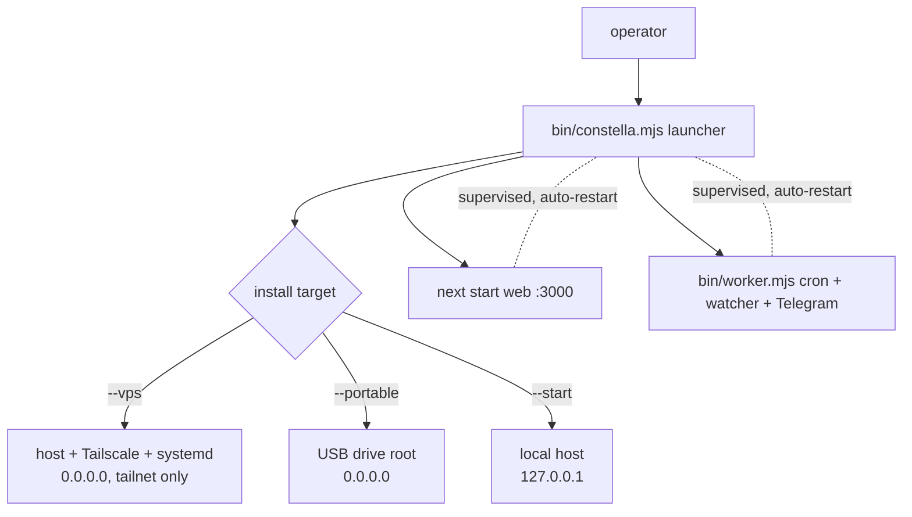
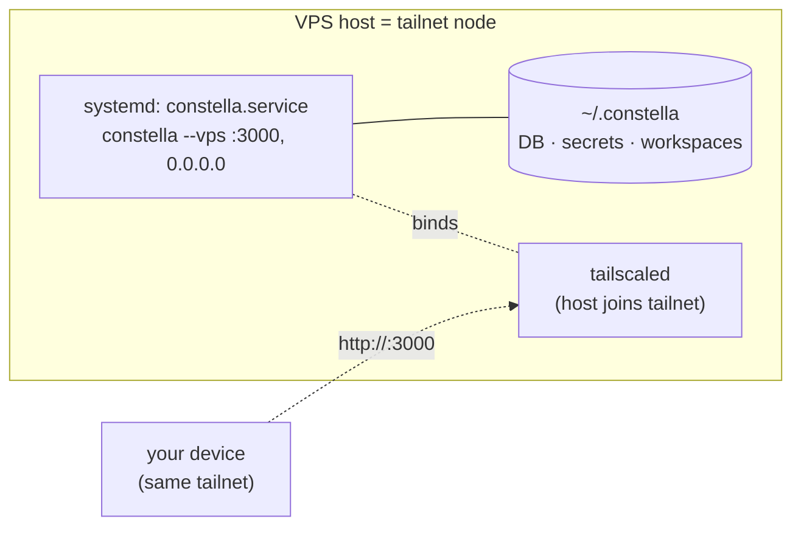

[← Docs index](./README.md) · [🇧🇷 Português](../pt/DEPLOY.md) · [✦ Constella](../../README.md)

# Deploy (Production) 🚀


How to **launch the central ship itself** — getting the Constella control plane running in a durable, production-grade orbit. This page covers deploying *Constella the platform*: a native VPS install (npm + Tailscale + systemd), the `vps-install.sh` bootstrap, supervised dual-process boot, and portable/global installs. **No Docker anywhere** — the host itself is the tailnet node.

> **Not to be confused with [PREPARE_DEPLOY](./PREPARE_DEPLOY.md) / [DEPLOY of your project].** Those deploy the **user project** the agents build (a clean-tree export to a separate repo). *This* page deploys **Constella itself** — the ship, not the cargo.

---

## When to use 🌌

| You want to… | Use |
| --- | --- |
| Run Constella 24/7 on a remote server, private to your tailnet | **VPS (native)** — npm package + Tailscale + systemd on the host |
| Bootstrap a fresh Linux VPS in one command | **managed install** (`install.sh --vps` / `scripts/vps-install.sh`) |
| A quick, unmanaged VPS try | **`npx constellai --vps`** |
| Carry the whole control plane on a USB drive | **Portable** (`constella --portable`) |
| Install once on your own always-on machine | **Global npm** (`npm i -g constellai`) |
| A quick ephemeral run | **`npx constellai`** |

If you only want a local instance on your own laptop, see [START_MODE](./START_MODE.md). For the tailnet specifics, see [VPS_MODE](./VPS_MODE.md); for the drive, [PORTABLE_MODE](./PORTABLE_MODE.md). Authentication (email + password) is identical on every target.

---

## How it works 🪐

Every Constella launch — local, VPS, portable — goes through the same launcher, **`bin/constella.mjs`**. The launcher:

1. Resolves the **install target** (`start | vps | portable`) from the launch flag (a bare `constella` prints usage).
2. Resolves the **runtime root** `HOME` (`CONSTELLA_HOME` / `--path`, default `~/.constella`).
3. Generates + persists secrets into `<HOME>/.env` (`chmod 600`): `BETTER_AUTH_SECRET`, `CONSTELLA_VAULT_KEY`, `CONSTELLA_WORKER_SECRET`.
4. Pins `DATABASE_URL=file:<HOME>/constella.db` and applies the shipped Drizzle migrations (`drizzle-kit migrate`).
5. Boots **two supervised processes**: the **web** server (`next start`) and the **worker** (`bin/worker.mjs`).

A deploy is "the same launcher, in a more durable place" — on the host under systemd, on a USB drive, or under a global install. The target picks the bind host; the deploy target picks the durability. **Authentication is the same on all of them — email + password.**



---

## Main flow — VPS native (npm + Tailscale + systemd) 🛰️

The production-recommended deploy. The published npm package and Tailscale install **directly on the host**; a systemd service keeps Constella running. The **host itself is the tailnet node** — no Docker, no Dockerfile, no compose, no sidecar, no image rebuilds, no `/data` volume. Constella binds `0.0.0.0`; Tailscale keeps it private, reachable **only** over your tailnet — never the open internet.

### Managed install (recommended)

One command installs Node ≥ 20 + the `constellai` CLI, joins Tailscale, and registers a boot-persistent systemd service:

```bash
curl -fsSL https://raw.githubusercontent.com/gabriel7silva/constella/main/scripts/install.sh | bash -s -- --vps
```

It:

1. Installs **Node ≥ 20** and the `constellai` CLI (`npm i -g constellai`).
2. Installs Tailscale and runs `tailscale up` — joins your tailnet (prints a browser auth URL if needed).
3. Registers a systemd service **`constella.service`** that runs `constella --vps --host 0.0.0.0 --port 3000`, with `Restart=always`, enabled to **start on every boot**.

Equivalent direct script (from a clone): `bash scripts/vps-install.sh`.

> **Agent CLIs are not bundled.** Install a CLI on the host with `npm i -g` (`claude` / `codex` / …) and let it auth via env keys or its own login — persisted in the host user's home (no volume needed). Or use **cloud API providers** configured in the [MODELS](./MODELS.md) module. See [Security](#security--).

### Quick, unmanaged try

```bash
npx constellai --vps        # on a Linux host
```

This auto-installs + joins Tailscale and serves in the foreground — **no systemd**. Good for a quick try; use the managed path for 24/7.

### Access

Private on your tailnet at `http://<tailnet-ip>:3000`, where the IP comes from `tailscale ip -4`. First load → `/login` (login is **enforced** in VPS mode). The server binds `0.0.0.0`; Tailscale keeps it private.



### Manage (systemd)

```bash
systemctl status constella       # is it up?
systemctl restart constella      # restart
systemctl stop constella         # stop
journalctl -u constella -f       # tail logs
```

Enabled → starts on every boot.

---

## Step-by-step

### A) VPS deploy (managed)

```bash
# on a fresh Linux host
curl -fsSL https://raw.githubusercontent.com/gabriel7silva/constella/main/scripts/install.sh | bash -s -- --vps
# → installs Node + constellai, joins Tailscale, registers constella.service (Restart=always, on boot)

# or, from a clone:
bash scripts/vps-install.sh

# then reach Constella at the host's tailnet IP:
tailscale ip -4   # find the IP → http://<tailnet-ip>:3000
```

For a quick, unmanaged try (foreground, no systemd): `npx constellai --vps`.

On first boot the launcher generates and persists `BETTER_AUTH_SECRET` (and the vault + worker secrets) into `~/.constella/.env` (`chmod 600`). Because `~/.constella` lives in the host user's home, those secrets — and login sessions and the encrypted vault — **survive restarts and updates**.

### B) Portable deploy (USB)

```bash
npx constellai --portable                 # auto-detect & pick a USB drive
npx constellai --portable --path /Volumes/MYUSB   # or name the drive
```

The launcher validates the drive **before** booting: it **refuses < 32 GB free** (fatal); `≥ 32 GB` boots. Binds `0.0.0.0`. The whole runtime root lives at `<drive>/.constella`. See [PORTABLE_MODE](./PORTABLE_MODE.md).

### C) Global install (own always-on box)

```bash
npm i -g constellai
constella --start       # local, binds 127.0.0.1; first run → signup, then login
# or --vps on a server you manage. Auth (email + password) is the same on every target.
```

### D) Ephemeral

```bash
npx constellai           # default mode = start
```

---

## Supervised dual-process boot 🌠

A 24/7 control plane must survive a transient crash. `bin/constella.mjs` boots **two children** and supervises each:

| Process | Command | Hosts |
| --- | --- | --- |
| **web** | `next start -H <host> -p <port>` (from `PKG_ROOT`) | the dashboard + all API routes |
| **worker** | `node bin/worker.mjs` | cron tick (~60s → `POST /api/cron/tick`), chokidar file-watcher (debounce 400ms → `/api/sync/file`), Telegram long-poll |

Supervision rules (from `supervise()`):

- On an unexpected child exit, **auto-restart after 2s** — not a full shutdown.
- **Crash-loop guard:** at most **5 restarts within 60s** per child; beyond that it gives up and shuts down (so a real, repeated crash isn't masked forever).
- The web and worker are **independent**: a web crash restarts only the web; the worker self-retries its tick until the server answers.
- Optional heap bump: `CONSTELLA_WEB_HEAP_MB` adds `--max-old-space-size` to the web child (useful when an agent run causes a JS-heap OOM).

> **Two durability layers compose.** The launcher's own supervisor restarts a crashed child in-process; the **systemd service** (`constella.service`, `Restart=always`, registered by the managed install) restarts the whole launcher on an OS-level kill and brings it up on boot. The process is a normal long-lived foreground command and handles `SIGINT`/`SIGTERM` cleanly (it kills both children, then exits), so systemd stops/restarts it cleanly. The unmanaged `npx constellai --vps` path has no systemd — only the in-process supervisor.

The worker carries the privileged `x-worker-secret` header, so it has an **SSRF guard**: it refuses to talk to any non-loopback `CONSTELLA_BASE_URL` unless `CONSTELLA_ALLOW_REMOTE_WORKER_BASE_URL=1`. The launcher always points it at `http://127.0.0.1:<port>` (loopback even in vps/portable), so this is invisible in normal deploys.

---

## Install targets vs deploy targets

The **launch flag** (from `src/lib/run-mode.ts`) sets the bind host and where the control plane physically runs; **authentication is required on all of them** — email + password (first run → signup, afterwards → login). They compose:

| Install target | Login | Bind host | Typical deploy target | Agent CLI permission |
| --- | --- | --- | --- | --- |
| `--start` (local) | email + password | `127.0.0.1` | local box / npx / global install | `bypassPermissions` (full) |
| `--vps` | email + password | `0.0.0.0` | **host + Tailscale + systemd** | `acceptEdits` (jailed) |
| `--portable` | email + password | `0.0.0.0` | **USB drive** | `acceptEdits` (jailed) |

The target is persisted in `organization.runMode`. In a published build `CONSTELLA_PUBLIC=1`, so the **UI never picks the target** — the launch flag does. A bare `constella` prints usage.

---

## Key concepts

- **`CONSTELLA_HOME` / runtime root** — the single durable directory. On a VPS it's `~/.constella` in the host user's home (override with `CONSTELLA_HOME`); on USB it's `<drive>/.constella`; otherwise `~/.constella`. Holds `constella.db`, `.env`, `organizations/<orgId>/workspace/`, `backups/`, `cache/`.
- **`PKG_ROOT`** — the *installed package* root (compiled `.next`, `drizzle/` migrations, configs). The launcher runs `next` and `drizzle-kit` from here, not from the launch CWD.
- **Secrets persistence** — every mode persists real secrets to `<HOME>/.env` (`mode 0600`). `next start` runs under `NODE_ENV=production`, where better-auth **throws on a default secret**, so a real `BETTER_AUTH_SECRET` is mandatory even locally.
- **Schema on first run** — `drizzle-kit migrate` is idempotent. A **fresh DB that fails to migrate aborts** (no tables = the app 500s); an existing DB tolerates a no-op re-run.
- **Build-on-first-run (fallback only)** — the published package ships a prebuilt `.next`, so building is skipped. From a source tree without a build it builds once; if the build fails it **refuses to fall back to `next dev`** in a public/network mode unless `CONSTELLA_DEV=1`.

---

## Launcher environment

The launcher exports these into both children:

| Variable | Value |
| --- | --- |
| `CONSTELLA_RUN_MODE` | `start \| vps \| portable` |
| `CONSTELLA_PUBLIC` | `1` (CLI launch is the public runtime) |
| `CONSTELLA_VERSION` | the installed package version |
| `CONSTELLA_HOME` | resolved runtime root |
| `DATABASE_URL` | `file:<HOME>/constella.db` |
| `CONSTELLA_PKG_ROOT` | the installed package root |
| `PORT` / `--port` | `3000` (default) |
| `--host` | `0.0.0.0` for vps/portable, else `127.0.0.1` |

Persisted in `<HOME>/.env` (`chmod 600`): `BETTER_AUTH_SECRET`, `CONSTELLA_VAULT_KEY`, `CONSTELLA_WORKER_SECRET`. Tailscale runs on the host itself — joined once with `tailscale up` — so there is no app-side join key to manage.

Opt-in tuning:

| Variable | Effect |
| --- | --- |
| `CONSTELLA_WEB_HEAP_MB` | `--max-old-space-size` for the web child (default: Node default) |
| `CONSTELLA_DEV=1` | allow a `next dev` fallback when there is no production build |
| `CONSTELLA_ALLOW_REMOTE_WORKER_BASE_URL=1` | let the worker talk to a non-loopback base URL (off by default) |
| `CONSTELLA_WORKER_INTERVAL_MS` | cron tick interval (default `60000`) |

---

## Updating a deployment 🛰️

`detectRunContext()` (`src/lib/run-context.ts`) classifies the running process so the **update method matches the deploy**:

| Context | Detected when | Update method |
| --- | --- | --- |
| `dev` | running from source (`isDevMode()`) | `git pull && pnpm install && pnpm build` |
| `vps` | `getRunMode() === "vps"` | `curl -fsSL .../scripts/vps-update.sh \| bash` |
| `portable` | `getRunMode() === "portable"` | ensure free space, back up the drive, then `npm install -g constellai@latest` |
| `npx` | launch dir is npm's `_npx` cache | re-run `npx constellai@latest` |
| `global` | none of the above | `npm install -g constellai@latest` (auto-runs, detached) |

`startUpdate()` (`src/server/update-run.ts`) **always backs up first** — it copies `.env`, `constella.db`, `constella.db-wal`, `constella.db-shm` into `<HOME>/backups/<timestamp>/`. Only the `global` path auto-runs (a detached process writes `<HOME>/backups/last-update.json` that the UI polls); `vps` / `portable` / `dev` / `npx` return the **exact command** to run, because executing them from inside the web server is environment-specific. See [UPDATE](./UPDATE.md).

```bash
# Native install (no repo checkout needed) — pull the updater straight from GitHub:
curl -fsSL https://raw.githubusercontent.com/gabriel7silva/constella/main/scripts/vps-update.sh | bash
# pin a specific version:
curl -fsSL https://raw.githubusercontent.com/gabriel7silva/constella/main/scripts/vps-update.sh | bash -s -- 0.2.30

# From a repo checkout instead:
bash scripts/vps-update.sh                 # → latest on npm
bash scripts/vps-update.sh 0.2.30          # → a specific version

# Fully manual (no script at all):
sudo npm install -g constellai@latest && sudo systemctl restart constella
```

> **Updating while it's running is fine — no manual stop needed.** `npm install -g` swaps the package on disk without touching the live process; `systemctl restart constella` then cycles in the new version in a ~2–3s blip. Your `~/.constella` (DB, secrets, login, workspaces) is preserved, and the idempotent drizzle migrations run automatically on the next boot. Roll back any time by pinning the old version (e.g. `bash scripts/vps-update.sh 0.2.27`).

### Clean / wipe

```bash
curl -fsSL https://raw.githubusercontent.com/gabriel7silva/constella/main/scripts/vps-clean.sh | bash
# non-interactive: | bash -s -- --yes
```

Removes the systemd service + the `constellai` CLI + `~/.constella` + the npx cache, but **keeps Tailscale** (so SSH-over-tailnet survives). Reinstall with `npx constellai --vps`.

---

## Possible states

| Signal | Meaning |
| --- | --- |
| `• Secrets ready (stored in <HOME>/.env, never printed).` | first-boot secret generation/reuse OK |
| `✖ Portable needs at least 32 GB free …` | portable drive too small (fatal) |
| `• N GB free on the drive — good …` | portable drive has enough space, boots |
| `✖ Database schema migration failed on a fresh database — aborting` | fresh DB couldn't get its tables |
| `• schema migrate skipped/failed on an existing DB — continuing` | benign re-run on a built DB |
| `✖ No production build … Refusing to start a dev server in a public/network mode.` | no `.next` and no `CONSTELLA_DEV=1` |
| `• [web] exited (…) — auto-restarting in 2s (n/5 …)` | supervised restart within the window |
| `✖ [web] exited … crashed 5x within 60s — giving up.` | crash-loop cap hit; shutting down |
| `✓ Constella is starting. Reach it on your tailnet at: http://<ip>:3000` | `vps-install.sh` finished |

---

## Related integrations 🪐

- **Tailscale** — the private network plane for VPS mode, installed **on the host** (the host is the tailnet node, reachable at its tailnet IP). See [VPS_MODE](./VPS_MODE.md).
- **systemd** — `constella.service` (`Restart=always`, enabled on boot) is the OS-level restart + boot policy on a VPS.
- **better-auth** — email+password (+ 2FA/passkeys) on every install target; backed by `BETTER_AUTH_SECRET`. See [START_MODE](./START_MODE.md).
- **Vault** — provider keys encrypted with `CONSTELLA_VAULT_KEY`. See [SECURITY](./SECURITY.md).
- **Worker** — cron + watcher + Telegram, supervised alongside the web. See [TELEGRAM](./TELEGRAM.md), [ARCHITECTURE](./ARCHITECTURE.md).
- **Update** — context-aware self-update. See [UPDATE](./UPDATE.md).

---

## Security 🕳️

- **Tailnet-only exposure.** Tailscale runs on the host, so the dashboard is reachable **only at the host's tailnet IP on :3000**, never on the public internet — even though Constella binds `0.0.0.0`. Lock down any public ingress with the host's own firewall.
- **Run as a dedicated user.** Run `constella.service` under an unprivileged host user (its `~/.constella` holds the DB, secrets, and workspaces) so an app-level RCE can't act as root.
- **Login required everywhere.** `start`, `vps`, and `portable` all require login (better-auth email+password, optional 2FA TOTP / WebAuthn passkeys, 30-day session). First run with no account is a real signup screen; there is no passwordless/auto-login path.
- **Jailed agents off-local.** On `--vps`/`--portable` the agent CLI runs in `acceptEdits` (edits confined to the workspace FS jail), not the `bypassPermissions` of a local `--start` install.
- **Agent CLIs not bundled.** To run agents on a VPS, install a CLI on the host (`npm i -g claude` / `codex`) or use cloud API providers in [MODELS](./MODELS.md). Without either, planning/Team-Room work, but agent execution has no runtime.
- **Secrets never printed.** `<HOME>/.env` is `chmod 600`; the launcher logs only its location. `scrubSecrets` strips secrets before KB ingest / Telegram / logs.
- **Worker SSRF guard.** The worker refuses to send its privileged secret to any non-loopback base URL unless explicitly opted in.

---

## Troubleshooting 🛰️

| Symptom | Cause / fix |
| --- | --- |
| Can't reach `http://<ip>:3000` from another device | the device isn't on the same tailnet; run `tailscale up` there, confirm with `tailscale status`; check the host with `tailscale ip -4` |
| Host won't join the tailnet | run `sudo tailscale up` on the host and complete the browser auth; confirm with `tailscale status` |
| Service won't start / restarts in a loop | `systemctl status constella` + `journalctl -u constella -f`; check the host's RAM — an agent run causing OS-level OOM kills the web child; raise `CONSTELLA_WEB_HEAP_MB` for a JS-heap OOM, or cap concurrent agents |
| `✖ drizzle-kit not found …` | the install is incomplete; reinstall the package (`npm install -g constellai@latest`) |
| Fresh DB aborts on migrate | shipped `drizzle/` migrations missing or `~/.constella` unwritable; confirm the runtime root is owned by the service user |
| Agents don't execute on the VPS | no agent CLI on the host and no cloud provider configured — `npm i -g claude`/`codex` or set up [MODELS](./MODELS.md) |
| Lost sessions/vault after update | `~/.constella` was wiped or its user changed; keep the runtime root (and its `.env`) across updates |
| Portable refuses to boot | drive under 32 GB free — use a larger drive (`--path`) |
| Update did nothing on a VPS | by design: run `bash scripts/vps-update.sh [version]` yourself (the UI returns the command) |

---

## Related links

- [VPS_MODE](./VPS_MODE.md) — the tailnet run mode in depth
- [PORTABLE_MODE](./PORTABLE_MODE.md) — USB-drive deploy
- [START_MODE](./START_MODE.md) — the local install target
- [INSTALLATION](./INSTALLATION.md) — first install
- [CONFIGURATION](./CONFIGURATION.md) — env vars + runtime root
- [UPDATE](./UPDATE.md) — context-aware self-update
- [PREPARE_DEPLOY](./PREPARE_DEPLOY.md) — deploying the **user project** (clean-tree export), not Constella
- [ARCHITECTURE](./ARCHITECTURE.md) — web + worker, sync engine
- [SECURITY](./SECURITY.md) — FS jail, vault, scrubbing
- [MODELS](./MODELS.md) — cloud/local providers for agents on a server
- [TROUBLESHOOTING](./TROUBLESHOOTING.md) · [FAQ](./FAQ.md)
