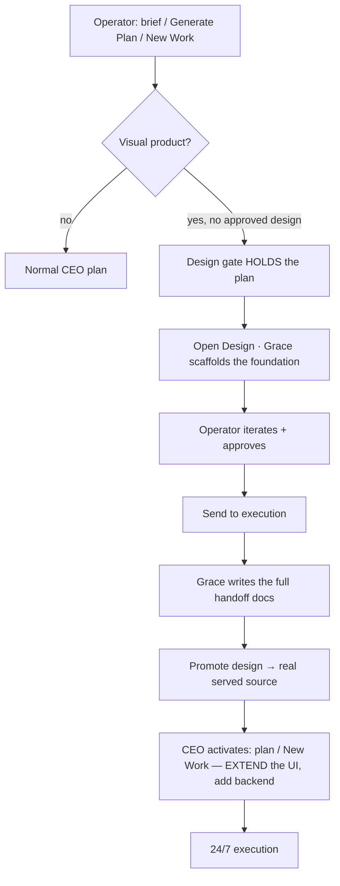

[← Docs index](./README.md) · [🇧🇷 Português](../pt/DESIGN.md) · [✦ Constella](../../README.md)


# 🎨 Design module — Grace's visual prototyping space

> The Design module is the **visual front of the build pipeline**. Grace (the Frontend agent) prototypes the product's
> UI on a live canvas; the operator iterates, approves, and clicks **Send to execution**; the approved design then
> **becomes the project's real frontend** and the CEO Planner builds the backend on top of it. Nothing the operator
> sees is a throwaway mock — **what's in the Design is the project.**

---

## Purpose 🌌

A frontend product should be **prototyped and approved before any plan is written** — fewer reworks, zero drift. The
Design module makes that the default:

- **Grace** designs real, stack-specific screens (never a generic "AI" look), grounded in the brief, mission, attached
  mocks and a 200+ playbook design-skills library.
- The operator **edits the canvas directly** (move, resize, restyle, add elements) and **approves** a final design.
- On approval the design is **promoted into the real served source** and handed to **Ada** (the CEO Planner), who plans
  the backend, data and integrations **on top of the approved UI**.

`Ada orchestrates · Grace prototypes, validates and documents the design · Ada turns it into real execution.`

---

## The canvas 🛰️

Grace writes self-contained HTML screens under `design-mock/screens/*.html`. They render **live in a sandboxed iframe**
(`sandbox="allow-scripts"`, isolated opaque origin — no access to the app, cookies or filesystem). An instrumentation
script injected into the iframe talks to the host over `postMessage` (the canvas ↔ host contract) so the operator can
inspect and edit without the page touching anything real.

| Mode | What it does |
|------|--------------|
| **Select** | Click to select an element |
| **Edit** | Click to select · **double-click to edit text** (text-only) |
| **Markup** | Drag a region to mark it for review |
| **Comments** | Drop comments on the canvas |
| **Inspect** | Read an element's type, styles and hierarchy |
| **Preview** | Interactive prototype — no editing overlays |

> **The design is a REFERENCE that must stay faithful to the approved mock**, so the canvas has **no add / move /
> resize / structural manipulation** — Edit mode is **text-only** (fix copy without changing the layout or identity).
> The design system is still tunable live via the **Styles** tab (palette, typography, tokens, theme). To change
> anything structural, ask Grace in the chat — she edits the source so it stays a single faithful design.

**Editor highlights:** whole-prototype **browser-style zoom**; per-screen **Save / Reset / History** (undo/redo);
live **theme** toggle; and **breakpoints** — Desktop / Tablet (768) / Mobile / custom width, which **re-lays out** the
screen (real reflow, so Grace's `@media` rules apply), not just scaling it.

### Live app (any stack)

A **Design / Live** toggle in the toolbar switches the canvas from Grace's HTML to the project's **real running dev
server** — so a React / Vue / Svelte / Next / static app renders **truthfully** (it's the actual app). It boots the dev
server on demand and reuses the same frameable probe as [Test Dev](TEST_DEV.md). In Live mode, editing is via
**"Ask Grace"**: you describe a change, she edits the real source, and the dev server **hot-reloads** the frame.

**Inspect (click-to-target, any stack)** 🧪 — a **Inspect** toggle routes the Live iframe through a thin **inject
proxy** that stamps a click-capture script into the real app's HTML (framework-agnostic, WebSocket/HMR passed
through). Click any element → its context (tag, text, a CSS selector, the route) pre-fills **"Ask Grace to change
THIS element"**, so she edits the exact element in the real source and HMR repaints. With Inspect off the frame
points at the raw dev URL and the app behaves as itself. This is the robust, any-stack writeback (**Approach B**);
the precise *file:line* build-time source stamp (**Approach A**, per-framework) is the next step. (Experimental —
HMR behind the proxy can be finicky per framework; the click-targeting works regardless, reload if it doesn't auto-repaint.)

---

## Design system & multi-file CSS 🌠

Every screen is **token-driven** — the **Styles** panel edits live design tokens (palette, secondary/surface/semantic
colours, body & heading fonts, weight/line-height/letter-spacing, radius/border/shadow, spacing, motion) and the canvas
restyles instantly.

Grace authors **modular CSS**, not one giant blob:

```
design-mock/styles/global.css            # tokens (:root), reset, theme ([data-theme])
design-mock/styles/components/<name>.css # reusable components
design-mock/styles/animations.css        # keyframes / motion
```

Screens `<link>` what they need. Because the sandboxed canvas only renders **inline** CSS, the host **bundles** (inlines)
the linked files at render time, and the production build (`design-mock/dist/`) bundles + minifies + obfuscates. You keep
clean, readable, modular source; the canvas and the export both work.

### Docs tab

The **Docs** rail renders Grace's written documentation as markdown: `design-system.md`, `components.md`, `handoff.md`,
`decisions.md` and `APPROVED.md`.

---

## RAG & skill selection 🌌

Grace doesn't read a flat skill list. She **extracts keywords** from the brief, mission, objective, attached mock and
your message, **expands** them through a domain + style lexicon (hotel → booking / hospitality / rooms; "native mobile" →
glassmorphism / microinteractions / premium typography), and **ranks the seeded skills** by name / tags / description —
then reads the most relevant ones first. Domain- and style-aware, not generic.

---

## The flow: Design → Grace → Ada → Execution ✦

Every visual request routes through Grace before becoming real work.



### The design gate

When a plan is requested for a **visual product** (an explicit frontend stack, a styling stack, OR a brief/mission that
reads visual — web/app/page/UI/screen…) and there's **no approved design yet**, the CEO Planner **holds** the plan,
shows a strong **"Design step pending"** recommendation with **Open Design**, and notifies you (in-app + Telegram). The
gate also fires for **New Work / new visual features** even after a design exists. A one-shot **"Generate plan anyway"**
bypasses it.

### Onboarding scenarios

| Scenario | What Grace does |
|----------|-----------------|
| **1 · Greenfield** (brief only) | Scaffolds the initial foundation (tokens/`global.css` + skeleton screens + `design-system.md`) from the brief |
| **2 · Mock attached** | **Imports + reconstructs** the attached `mock/` 1:1 into editable screens (the mock is the source of truth) |
| **3 · Existing project** | After Ada's analysis, **extracts the real frontend** of the project onto the canvas |

### Send to execution → promotion

On **Send to execution**, Grace writes the **complete handoff documentation**, then the design is **promoted** into the
project's served source — and the **CEO is activated automatically**:

- **Native / static stack** → screens are copied **1:1** into `public/` and the static server is wired to serve them.
  **The running app IS the approved design (100% fidelity).** Engineers then **extend** it (wire backend/data/states on
  top), never rebuild the UI.
- **Framework stack** (React/Vue/Next…) → the design is staged and the planner adds a **"port"** issue (port the screens
  into components 1:1, then extend).

Re-approving an updated design flows as an **"apply design update"** issue — it never clobbers the backend code engineers
wired into the promoted screens.

**Fidelity is enforced, not just asked.** The [Test Dev](TEST_DEV.md) gate captures a **baseline** of each approved
screen and **pixel-diffs** the running app against it (in-browser, 1280×800). Small drift (real data shifting the layout)
is surfaced as a note; a screen that's structurally wrong (>50% different) **fails the gate** and is held at review.

---

## Telegram control 🤖

The whole loop works from your phone. Constella pushes design events (mock imported · prototype/approval pending · docs
ready · handoff received), and the [Telegram](TELEGRAM.md) bot translates the canvas to **text** (screens, sections, form
fields, buttons, responsive) so you can review without seeing it. The buttons: **Approve / Reject / Request changes** —
where **Approve auto-runs Send-to-execution** (Grace writes the docs → promotes → activates the CEO).

---

## Resilience 🪐

The loop survives provider limits, network blips and restarts:

- **Agent runs retry transient failures** (429 / quota / overloaded / 5xx / network) with a **1 → 5 → 15-minute backoff**,
  shown live on the stream. Cancellations and process timeouts are **not** retried.
- **The handoff is idempotent + resumable** — a crash mid-handoff is **re-kicked on boot** and shows a **"Resume
  handoff"** pulse in the module.
- **Hard-fail** — the CEO is activated **only** when Grace actually wrote the docs (never a half-baked plan).

---

## Security 🔒

The canvas iframe is **`sandbox="allow-scripts"` without `allow-same-origin`** — an opaque origin that can't read the
app, its cookies or the workspace. The only bridge is `postMessage`. Uploaded images are inlined as **data URLs** (no
cross-origin fetch). Promotion writes only inside the workspace jail. See [Security](SECURITY.md).

---

## States

| State | Meaning |
|-------|---------|
| **Building** | Grace is prototyping; the operator edits + approves |
| **Design step pending** | The CEO Planner is holding a plan until the design is approved |
| **Approved** | `design-mock/APPROVED.md` written — the official visual reference |
| **Handoff** | Grace is writing the handoff docs + promoting; the CEO will activate |
| **Resume handoff** | A handoff was interrupted — tap to retry |

---

## Troubleshooting

| Symptom | Cause / fix |
|---------|-------------|
| Gate didn't hold on Generate Plan | Not detected as a visual product (pure backend brief), or a one-shot Skip was consumed — open Design manually, or include a visual word in the brief |
| Canvas blank for a framework project | The Design canvas renders **HTML** only; a React/Vue app needs a port (the planner adds a port issue). Switch to **Live** mode to see the real running app for any stack |
| Image upload does nothing | Select an element first; the picker is always mounted regardless of the chat panel state |
| Handoff seems stuck | It hard-fails without docs and is resumable — use **Resume handoff**, or it re-kicks on the next boot |

---

## Related

[Agents](AGENTS.md) · [Workflow](WORKFLOW.md) · [Onboarding](ONBOARDING.md) · [Telegram](TELEGRAM.md) ·
[Test Dev](TEST_DEV.md) · [Skills](SKILLS.md) · [Security](SECURITY.md) · [Changelog](../../CHANGELOG.md)
