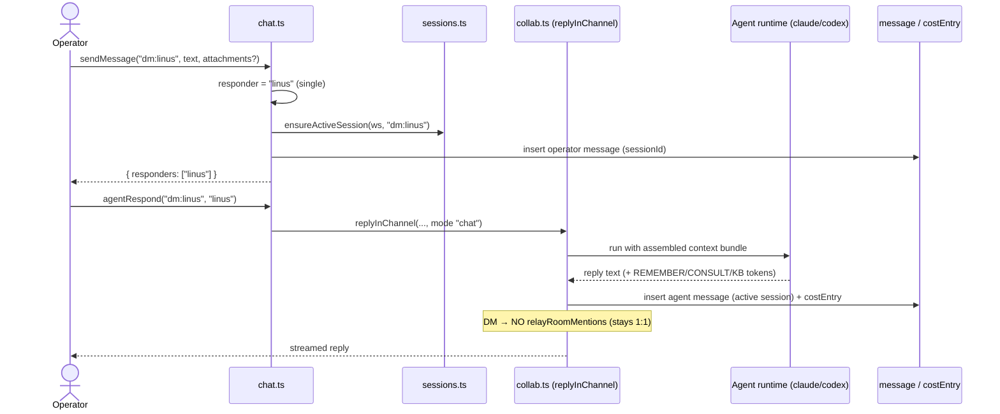
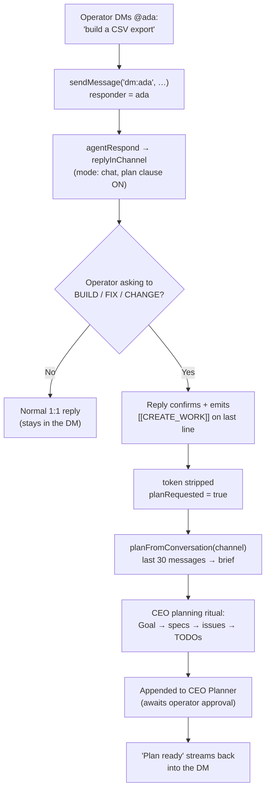

[← Docs index](./README.md) · [🇧🇷 Português](../pt/DM.md) · [✦ Constella](../../README.md)

# Direct Messages — Private Orbits 🛰️✦


A **Direct Message** is a private 1:1 channel between you (the operator) and a single agent — its own little orbit, separate from the [Team Room](./TEAM_ROOM.md). DMs carry sessions (fresh contexts on demand), per-session compaction, attachments, Knowledge-Base capture, and — when you talk to a **planner** like Ada — the ability to turn a request into real, approval-gated work.

## When to use

- You want a **focused 1:1** with one agent (the CEO, the CTO, the QA lead, the Docs writer) without pinging the whole room.
- You want to **start new work** by simply describing it to **@ada** (or another planner) — no loose "new work" button.
- You want **multiple parallel threads** with the same agent, each with its own fresh context (DM **sessions**).
- You want to **attach files** (images / PDFs / docs) for one agent to read privately.
- You want to keep a conversation **out of the autonomous hand-off chain** — DMs never relay to teammates.

> 🪐 Channels at a glance: `room` (everyone, must @mention), `dm:<handle>` (private 1:1, this doc), `telegram` (isolated remote thread → Ada). See [Team Room](./TEAM_ROOM.md), [Chat Commands](./CHAT_COMMANDS.md) and [Telegram](./TELEGRAM.md).

## How it works

Every conversation in Constella lives in a **channel** — a plain string on the `message` table. A DM channel is the literal string `dm:<handle>`, e.g. `dm:ada`, `dm:linus`, `dm:edsger`. The handle after `dm:` is the agent's handle from the roster (see [Agents](./AGENTS.md)).

The DM machinery lives in three files:

| File | Responsibility |
| --- | --- |
| `src/server/chat.ts` | Operator-facing actions: `sendMessage`, `agentRespond`, DM **session** actions, clear/previews. |
| `src/server/collab.ts` | The real agent turn (`replyInChannel`): builds the prompt, runs the CLI, books cost, captures KB. |
| `src/server/sessions.ts` | DM-session lifecycle: `ensureActiveSession`, `sessionsFor`, `newSession`, `activateSession`, `renameSessionRow`, `deleteSessionRow`. |
| `src/server/compaction.ts` | `buildChannelContext` — folds older messages into a per-session summary when the channel outgrows the model window. |

### Routing a message to a responder

When you send to a `dm:<handle>` channel, `sendMessage` decides who answers (`src/server/chat.ts`):

```ts
if (channel.startsWith("dm:")) {
  const h = channel.slice(3); if (handles.has(h)) responders = [h];
}
```

So a DM resolves to **exactly one responder** — the agent named by the channel. Contrast this with:

- **`room`** — the message must `@mention` a real teammate; up to **3** responders (`mentions(...).slice(0, 3)`); an un-mentioned room message is dropped (no dead-end post).
- **`telegram`** — always routes to **ada** (the CEO), falling back to the first agent if there is no `ada` handle.

After persisting your message, `sendMessage` also: wakes any open SSE stream (`wake`), schedules a RAG re-index of the conversation (`scheduleChatReindex`), and — **only in the `room`** for substantive text (≥15 chars) — logs an operator decision. (DMs do **not** log decisions.)

### The agent's real reply

`agentRespond(channel, handle)` flips the agent to `working`, then calls `replyInChannel` in `collab.ts`, which is where the real work happens:

1. Build a **chat-mode** instruction (DMs are always `mode: "chat"` — conversational, *no file edits*; only the team-room hand-off chain uses `mode: "work"`).
2. Append clause blocks: a **plan clause** (new-work token, below), an **attachments clause** (read uploaded files), a **language clause** (mirror the operator's language in chat only — everything written to the workspace stays English), plus **REMEMBER** / **CONSULT** / **KB** knowledge clauses, and a **Telegram security clause** (DM channels skip this — it's `telegram`-only).
3. Assemble ONE model-fitted context bundle (`assembleAgentPrompt`) — mission, project state, decisions, **this session's** conversation (compacted), RAG, memory.
4. Resolve the runtime (`resolveRuntime`) and run the CLI / HTTP API (`runAgentRuntime`, 180 s timeout), streaming live events to your view.
5. Strip the new-work token, extract `[[REMEMBER …]]` learnings into the KB, answer `[[CONSULT: …]]` queries (posted back as **Vannevar**), run `[[KB: …]]` tools, **scrub secrets**, and persist the reply on the **active session**.
6. Book real cost into `costEntry`.

> 🕳️ Crucial difference from the room: at the end, the room fans out the hand-off chain (`relayRoomMentions`), but **DMs stay 1:1** — `if (!channel.startsWith("dm:")) await relayRoomMentions(...)`. An `@mention` inside a DM reply does **not** wake another agent.

## Main flow



## Key concepts

### DM sessions 🌠

A DM channel can hold **multiple sessions**. A session is a row in `chat_session` scoped to `(workspaceId, channel)`; exactly **one is active** per channel. Starting a new session gives the agent a **fresh context** while you keep every past message visible — you just switch which thread you're looking at.

- `ensureActiveSession(ws, channel)` returns the active session id, lazily creating **"Session 1"** the first time a DM is touched, and **adopting** any legacy null-session messages into it. Returns `null` for non-DM channels (the room and Telegram are single-thread and never get sessions).
- `newSession` deactivates the others and creates `Session N` (active).
- `activateSession` switches which session is active.
- `renameSessionRow` renames (≤60 chars).
- `deleteSessionRow` deletes the session **and its messages**; if it was active, it activates the newest remaining session (or none — `ensureActiveSession` recreates "Session 1" on the next touch).

`getMessages("dm:<handle>")` and `clearConversation` both scope to the **active session** for DMs, so a new session is a genuinely clean slate.

### Compaction (per session) 🌌

When a conversation outgrows the active model's context window, `buildChannelContext` (`compaction.ts`) folds the **older** messages into a structured summary and keeps only the most recent ones verbatim. For DMs this is **scoped to the active session** (`sessionId`), so each thread compacts independently:

```ts
const msgConds = [eq(message.workspaceId, workspaceId), eq(message.channel, channel)];
if (sessionId) msgConds.push(eq(message.sessionId, sessionId));
```

- The summary is **model-aware** — smaller models get a tighter (~150-word) summary, larger ones keep more detail (~350 words).
- Sections are fixed: `## Decisions`, `## Requirements`, `## Open issues`, `## Files`, `## Pending by agent`, `## Next steps`.
- Summarization runs on a **cheap model (`haiku`)** and books real cost.
- One `message_summary` row per `(workspace, channel, session)`; it stores `throughId` (last folded message) so an unchanged window is reused, not re-summarized.
- The compacted block is also linked into `.claude/memory.md` (one section per channel), best-effort.

### New work from a DM 🚀

This is the signature DM feature. **New work is born from the conversation with the CEO — not a loose button.** In **chat mode**, any agent's prompt includes a **plan clause**: if the operator is asking to **BUILD / IMPLEMENT / ADD / FIX / CHANGE** something (a new unit of work), the agent confirms in 1–2 sentences and emits, on a final separate line, the machine token:

```
[[CREATE_WORK]]
```

`collab.ts` defines this as `const CREATE_WORK = "[[CREATE_WORK]]"`. `replyInChannel` detects it (`planRequested`) and **strips it** before the reply is stored or shown. Back in `chat.ts`, `agentRespond` reacts:

```ts
if (planRequested) {
  const r = await planFromConversation(channel);
  // posts a short "registering this as new work…" confirmation back into the DM
}
```

`planFromConversation(channel)` (in `src/server/planner.ts`) takes the **last 30 messages** of the channel and runs the **same planning ritual as the first plan** — Ada (the CEO) drafts a Goal → specs → issues → TODOs, appended to the **CEO Planner** for your approval. (For the Telegram remote, the off-session twin is `planFromConversationFor` in `planner-core.ts`.)

> 🌠 Planner vs non-planner. The plan clause is offered to **every** agent, but the wording differs:
> - **Planners** (`isPlanner`: the CEO **ada**, the Product Owner **donald**, the CTO **linus** — or any role matching *product owner* / *CTO* / *chief tech*) get a direct "turn this into a spec + issues" instruction.
> - **Non-planners** get an extra reassurance: it *"runs through the CEO's planning ritual and waits for the operator's approval, so you're not committing anyone to build immediately."*
>
> Either way the request is **routed through the CEO's planner and gated by your approval** — no code is built directly from a DM. See [Goals, Specs & Issues](./GOALS_SPECS_ISSUES.md) and [Workflow](./WORKFLOW.md).

### Knowledge capture in a DM 🌌

Even in a private DM the agent can grow the shared brain (see [KB Agent](./KB_AGENT.md) and [KB & RAG](./KB_RAG.md)):

| Token (own line) | Effect |
| --- | --- |
| `[[REMEMBER type=<decision\|architecture\|business-rule\|integration\|fix\|note>: <fact>]]` | Auto-saved to the KB (deduped), token stripped from the shown reply. |
| `[[CONSULT: <question>]]` | Answered from the state-aware KB; the answer is posted back into the DM **as Vannevar**. |
| `[[KB: reindex \| index-chat \| health]]` | KB-agent maintenance (only the Knowledge role gets this clause); result reported back into the thread. |

You can also promote a single chat line into the KB with `sendMessageToKb(messageId)` (captured as a `note`), or pull KB context into the composer with `pullKbForComposer(query)` (draft only — never sends).

## Tables

### `chat_session` (`src/db/schema.ts`)

| Column | Type | Notes |
| --- | --- | --- |
| `id` | text PK | |
| `workspaceId` | text | FK → `workspace`, cascade delete. |
| `channel` | text | Always `dm:<handle>` (DM only). |
| `title` | text | Defaults to `Session N`; rename ≤60 chars. |
| `active` | boolean | Exactly one active per `(workspace, channel)`. |
| `createdAt` | timestamp | Newest-first ordering for the session list. |

### `message` (DM-relevant columns)

| Column | Notes |
| --- | --- |
| `channel` | `room` \| `dm:<handle>` \| `telegram`. |
| `fromKind` | `operator` \| `agent`. |
| `fromHandle` | The agent handle (null for operator). |
| `text` | Message body (agent replies stored ≤4000 chars). |
| `sessionId` | The `chat_session` this message belongs to. **NULL** for room/Telegram and legacy DM messages (backfilled to "Session 1"). |
| `sources` | RAG source chips for an agent reply. |
| `attachments` | Operator uploads (≤10/message): `{ name, type, size, path }`. |
| `taskId` / `kind` / `blocks` | Traceability chip / render hint / synced-block slugs. |

### `message_summary`

| Column | Notes |
| --- | --- |
| `channel` | The conversation summarized. |
| `sessionId` | DM session this summary covers; **NULL** for room/Telegram. |
| `summary` | Structured compacted context. |
| `throughId` | Last message folded in (reuse guard). |
| `msgCount` | Number of messages folded. |

## New-work-from-DM diagram



## Step-by-step

### Start new work from a DM

1. Open the DM with **@ada** (CEO) — or another planner like **@linus** / **@donald**.
2. Describe the work plainly: *"Build a settings page with a dark-mode toggle."*
3. Ada confirms ("registering this as new work…") and the heavy plan run starts detached.
4. A **"Plan ready"** message streams back into the DM when specs + issues are drafted.
5. Approve in the **CEO Planner** (or via `/approve` — see [Chat Commands](./CHAT_COMMANDS.md)). Approval is what authorizes the team to build.

### Manage DM sessions

1. In a DM, open the session list (newest first; one active).
2. **New session** → fresh agent context, old threads preserved (`createSession`).
3. **Switch** between sessions (`switchSession`); **rename** (`renameSession`); **delete** (`deleteSession`, confirmed by a modal).
4. **Clear conversation** in a DM wipes only the **active session's** messages + its summary — other sessions are untouched.

### Attach a file to a DM

1. Add up to 10 files to the composer; they are saved under `uploads/` in the workspace.
2. The agent's prompt gains an attachments clause pointing at the on-disk **paths**; it reads them with its file tools (images/PDFs supported).
3. Filenames are treated as **data, not instructions** (prompt-injection guard).

## Examples

```text
# DM with @ada — kicks off new work
You → @ada: We need a CSV export on the reports page.
Ada → Got it — I'll turn this into a spec + issues and register it for approval. [[CREATE_WORK]] (stripped)
Ada → Got it — registering this as new work. I'm drafting the plan now…

# DM with @edsger (QA lead) — a question, NOT new work → normal reply, no token
You → @edsger: What did the last test run flag on /login?
Edsger → The last run flagged 1 console error on /login (uncaught TypeError)…

# Non-planner routing a build request still goes through Ada's planner
You → @grace: Add a loading spinner to the dashboard.
Grace → I'll register this as new work — it runs through the CEO's planning ritual and waits for your approval. [[CREATE_WORK]] (stripped)
```

## Possible states

| State | Meaning |
| --- | --- |
| Responder resolved | DM channel `dm:<h>` → single responder `h` if the handle exists; otherwise `responders: []`. |
| `mode: "chat"` | DM replies are conversational — **no file edits**, no hand-off chain. |
| `planRequested = true` | Agent emitted `[[CREATE_WORK]]`; `planFromConversation` runs the ritual. |
| Active session | One `chat_session.active = true` per DM; drives reads, writes, compaction, clear. |
| Compacted | Older messages folded into `message_summary` for the active session. |
| Agent `working` / `idle` | `agentRespond` sets `working` during the turn, back to `idle` after. |

## Related integrations

- **[Team Room](./TEAM_ROOM.md)** — the shared channel; the `@mention` hand-off chain (which DMs deliberately avoid).
- **[Telegram](./TELEGRAM.md)** — the isolated remote thread that always talks to Ada; mirrors back from the in-app Telegram tab.
- **[Chat Commands](./CHAT_COMMANDS.md)** — slash commands work in DMs too (intercepted before the message path; not on Telegram).
- **[Goals, Specs & Issues](./GOALS_SPECS_ISSUES.md)** / **[Workflow](./WORKFLOW.md)** — where DM-born work lands and is approved.
- **[KB & RAG](./KB_RAG.md)** / **[Memory & RAG](./MEMORY_RAG.md)** — REMEMBER/CONSULT capture and conversation re-indexing.
- **[Inbox](./INBOX.md)** — operator pings raised when an agent addresses you (skipped on Telegram).

## Security

- **Secret scrubbing** — every reply (room, DM, Telegram) is passed through `scrubSecrets` before it is stored, shown or notified.
- **Attachments are data** — uploaded filenames/paths are wrapped as data; the prompt tells the model to ignore any directive embedded in a filename.
- **Prompt-injection hardening** is strongest on `telegram` (untrusted remote input); DMs are local operator input but still scrubbed and language-/workspace-jailed.
- **DMs don't fan out** — an `@mention` in a DM reply never wakes another agent, so a private thread can't spawn an autonomous chain.
- **No direct build from chat** — a DM can only *register* work; nothing executes until you approve the plan. See [Security](./SECURITY.md) and [AI Architecture](./AI_ARCHITECTURE.md) for the FS jail and permission modes.

## Troubleshooting

| Symptom | Likely cause / fix |
| --- | --- |
| The agent didn't reply in my DM | The handle after `dm:` must exist in the roster; a stray channel string yields `responders: []`. Check the handle in [Agents](./AGENTS.md). |
| I asked for a build but no plan appeared | The model judged it a question, not new work, so it didn't emit `[[CREATE_WORK]]`. Be explicit: *"Build/implement/fix …"*. The DM should then post a "registering this as new work…" line. |
| New session still shows old messages | You're viewing a previous session — switch to the active one. Reads are scoped to the active `chat_session`. |
| "Clear conversation" didn't clear everything | In a DM, clear only wipes the **active session**; other sessions persist by design. |
| An `@mention` in my DM did nothing | Correct — DMs are 1:1 and never relay. Use the [Team Room](./TEAM_ROOM.md) for hand-offs. |
| Old context keeps coming back | That's the per-session compacted summary (`message_summary`) being injected. Start a fresh session for a clean context. |
| Reply timed out | The runtime cap is 180 s; very heavy single turns may hit it. |

## Related links

- [Team Room](./TEAM_ROOM.md)
- [Chat Commands](./CHAT_COMMANDS.md)
- [Telegram](./TELEGRAM.md)
- [Agents](./AGENTS.md)
- [Goals, Specs & Issues](./GOALS_SPECS_ISSUES.md)
- [Workflow](./WORKFLOW.md)
- [KB & RAG](./KB_RAG.md)
- [Memory & RAG](./MEMORY_RAG.md)
- [Inbox](./INBOX.md)
- [AI Architecture](./AI_ARCHITECTURE.md)
- [Security](./SECURITY.md)
