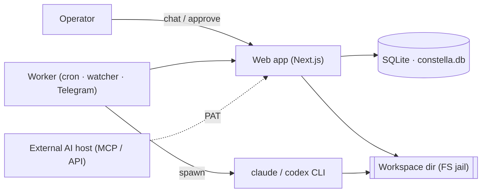
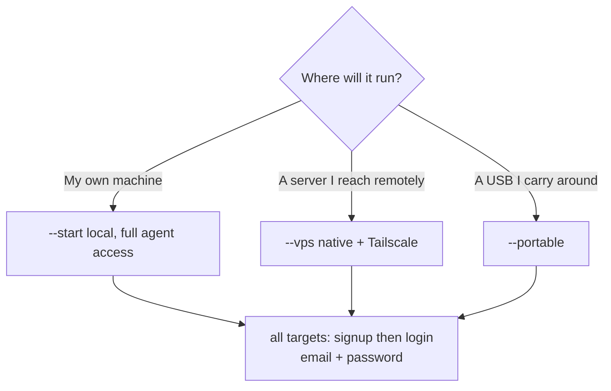

[← Docs index](./README.md) · [🇧🇷 Português](../pt/FAQ.md) · [✦ Constella](../../README.md)

# FAQ — Signals from the Control Plane ✦🌌


Honest answers to the questions people actually ask before (and after) launching their first agent-company. Everything here is grounded in the real codebase — no marketing, no vaporware.

---

## When to use this page

- You are evaluating Constella and want to know what is **real** vs. aspirational.
- You hit a decision (where to install/run it? local or cloud models? how do I cap spend?) and want the short, sourced answer.
- You want a fast index into the deeper docs — every answer links to the canonical page.

---

## How it works (the 30-second model) 🛰️

Constella is a **local-first control plane**. It runs a small ship of services on your machine — a Next.js web app plus a background worker — and from there it spawns **real CLI agents** (`claude`, `codex`, and others) as subprocesses that read, write, and ship code inside an isolated workspace directory. The directory on disk is the source of truth; the SQLite database is an index over it.



---

## 1. Is it real? 🌠

**Yes.** Agents are not scripted mocks. `src/server/adapters/cli.ts` spawns the locally-installed `claude` (Claude Code) and `codex` CLIs as real subprocesses with `spawn(...)`, feeds them the prompt on stdin, and parses **real** token usage and cost from their JSON output:

- `runClaude()` runs `claude -p --output-format json …` and reads `is_error`, `result`, `usage`, and `total_cost_usd` straight from the CLI.
- Where a CLI emits no usage (e.g. Hermes, Aider, Cursor headless modes) the cost is recorded as `0` — **honest zero**, never a fabricated number (`base()` and the per-runner comments make this explicit).
- The agent's working directory (`cwd`) is the org's real workspace, so edits land on real files; the Team Room renders **real diffs** parsed from the CLI's `Edit`/`Write` tool calls (`mapTool` in the same file).

There are no API keys held by Constella for the Claude/Codex path — it drives your **existing CLI login/subscription**.

→ [AI_ARCHITECTURE](./AI_ARCHITECTURE.md) · [AGENTS](./AGENTS.md) · [ARCHITECTURE](./ARCHITECTURE.md)

---

## 2. Local models or cloud models? 🪐

Both, depending on the job:

| Layer | Backend | Where defined |
| --- | --- | --- |
| **Reasoning / coding agents** | Cloud CLIs by default (`claude`, `codex`, plus Aider/OpenCode/Copilot/Cursor/Cline/Kilo) routed through their own logins | `src/server/adapters/cli.ts`, `CLI_MODELS` |
| **Local chat models** | `llama.cpp` chat server at `LLAMACPP_URL` (default `http://127.0.0.1:8082`), GGUF from the `lmstudio-community` catalog | `src/server/local-models.ts`, `src/data/model-catalog.ts` |
| **RAG embeddings** | Dedicated local `llama.cpp` embed server `CONSTELLA_EMBED_URL` (default `http://127.0.0.1:8083`), auto-started on boot; falls back to Ollama (`OLLAMA_URL`, `nomic-embed-text`) | `src/server/rag.ts` |

The model catalog itself is pulled from `models.dev` (`https://models.dev/api.json`, cached 24h at `~/.constella/cache/models-dev.json`) with an offline `FALLBACK_MODELS` table baked in. Before downloading a local GGUF, `detectHardware()` probes your CPU/RAM/GPU/VRAM and recommends a quantisation (`Q5_K_M`/`Q4_K_M`/`Q4_0`) and a max parameter count that will actually fit.

So: **cloud for the heavy thinking, local for embeddings/RAG (and optional local chat).** If no embed backend is up, RAG degrades to a keyword heuristic rather than failing.

→ [MODELS](./MODELS.md) · [KB_RAG](./KB_RAG.md) · [MEMORY_RAG](./MEMORY_RAG.md)

---

## 3. How do I control cost? 🕳️

Two hard ceilings, both **enforced server-side at dispatch time** in `src/server/budget.ts`:

- **Per-agent daily cap** — `agent.dailyCapUsd` (USD). Each of the 10 seeded agents ships with a sensible default (e.g. Ada `15`, Linus `40`, Margaret `50`, Vannevar `10`). Change it with `setAgentDailyCap(agentId, usd)` from the Costs UI.
- **Workspace monthly cap** — `budget.monthlyCapUsd` (USD), set with `setMonthlyCap(usd)`.

The gate is `canDispatch(...)`:

```ts
return spentTodayUsd < a.dailyCapUsd && monthlySpentUsd < b.monthlyCapUsd;
```

An agent may only spend if it is **under both** its daily cap and the workspace monthly cap. The cap appears in every agent's persona file too (`Stop at the daily budget cap ($<cap>).`), so the agent is told its own limit.

Other cost levers:

- Each agent runs on a tier you choose (`opus`/`sonnet`/`haiku` for Claude; cheaper models reduce spend).
- Web research (`WebSearch`/`WebFetch`) is on by default but can be turned off (`CONSTELLA_WEB_RESEARCH=0`).
- Runs have a hard timeout (default `180s`) so a stuck run cannot bleed budget indefinitely.

→ [CONFIGURATION](./CONFIGURATION.md) · [AGENTS](./AGENTS.md)

---

## 4. Where does my data live? 🌌

Everything stays under one runtime root on your machine — there is no Constella cloud:

| Thing | Location |
| --- | --- |
| Runtime root | `~/.constella` (override with `CONSTELLA_HOME` or `--path`) |
| Database | `<HOME>/constella.db` (`DATABASE_URL=file:<HOME>/constella.db`) |
| Per-org workspace | `~/.constella/organizations/<orgId>/workspace/` |
| Secrets | `<HOME>/.env`, written with mode `0o600` (chmod 600): `BETTER_AUTH_SECRET`, `CONSTELLA_VAULT_KEY`, `CONSTELLA_WORKER_SECRET` |
| Model cache | `~/.constella/cache/models-dev.json` |
| Update backups | `<HOME>/backups/<timestamp>/` |

The workspace directory is the **source of truth** (`src/lib/fs-workspace.ts`); SQLite indexes it. Each org is keyed by its stable `organization.id`, and all access is sandboxed by `safe()` — no path traversal, no cross-org leakage. Provider keys and tokens are encrypted at rest (AES-256-GCM) in the `vault` table.

→ [ARCHITECTURE](./ARCHITECTURE.md) · [SECURITY](./SECURITY.md) · [CONFIGURATION](./CONFIGURATION.md)

---

## 5. Can I run it across multiple machines? 🚀

Yes — two supported patterns, plus a caveat:

- **Portable** (`--portable`): the runtime root lives on a **USB drive** mounted as root, carried between machines. Requires `>=32GB` free (fatal below that); `>=32GB` is fine. Binds `0.0.0.0`. Login (email + password) is required — as it is everywhere.
- **VPS** (`--vps`): Constella runs natively on a server (npm + systemd) and you reach it over your **Tailscale tailnet** — no Docker; the host itself is the tailnet node. Binds `0.0.0.0`. Login (email + password) required, same as every target.

Caveat: the CLI subscription credentials (`~/.claude/.credentials.json`) live on the host running the agents. Constella copies the operator's Claude credentials into a clean per-agent config dir so agents stay logged in (see Q8), but the **host machine** still needs a valid CLI login. Portable mode carries Constella's data, not necessarily every CLI's auth.

There is **no built-in multi-machine sync of one workspace** — pick a single host (VPS) or carry the drive (portable).

→ [PORTABLE_MODE](./PORTABLE_MODE.md) · [VPS_MODE](./VPS_MODE.md)

---

## 6. Where should I install/run it? 🛰️

The launch flag is an **install target** (`src/lib/run-mode.ts`), not an auth mode. There are three — and **authentication is identical everywhere: email + password** (first run with no account → signup, afterwards → login). A launch flag is required; a bare `constella` prints usage.

| Install target | Launch flag | Bind | Best for |
| --- | --- | --- | --- |
| Local (default) | `--start` | `127.0.0.1` | Solo local use on your own machine; agents get **full access** (install deps, run tests) |
| VPS | `--vps` | `0.0.0.0` | A shared server over Tailscale (native npm + systemd, no Docker); agents **jailed** to edits-only |
| USB | `--portable` | `0.0.0.0` | A USB you carry between machines; agents **jailed** |



The target is stored in `organization.runMode`. With `--start` agents run with `--permission-mode bypassPermissions` (full); with `--vps`/`--portable` they run `--permission-mode acceptEdits` (jailed). Override with `CONSTELLA_AGENT_FULL_ACCESS=1|0`. Authentication does not change with the target.

→ [START_MODE](./START_MODE.md) · [VPS_MODE](./VPS_MODE.md) · [PORTABLE_MODE](./PORTABLE_MODE.md)

---

## 7. Can external AIs drive Constella? (MCP / API) 🌠

**Yes — outbound, with a Personal Access Token.**

- **Public REST API v1** (`src/app/api/v1/[[...path]]/route.ts`): authenticate with `Authorization: Bearer cn_<token>` (a PAT, SHA-256-hashed in the `personalAccessToken` table, with `scope` `read|write`). Optional `X-Constella-Org` header selects the org. Rate limit is **120 req/min/token**. Reads: `/me`, `/status`, `/review`, `/goals`, `/issues`, `/tasks`, `/specs`, `/kb?q=`. Writes (write scope): `/plan/approve`, `/plan/reject`, `/execution`, `/goals/:id/cancel`, `/goals/:id/archive`, `/work`, `/kb`.
- **MCP server** (`scripts/mcp-server.mjs`): a self-contained JSON-RPC-over-stdio server (no deps) that maps those REST routes to MCP tools (`constella_status`, `constella_review`, `constella_approve_plan`, `constella_new_work`, …). Point Claude Desktop / Cursor / any MCP host at it with `CONSTELLA_PAT`, `CONSTELLA_BASE_URL` (default `http://localhost:3000`), and optional `CONSTELLA_ORG`.

Two directions, do not confuse them:

| Direction | What it means | Mechanism |
| --- | --- | --- |
| **Outbound (AI → Constella)** | An external host drives your company | API v1 / `scripts/mcp-server.mjs` + PAT |
| **Inbound (Constella agent → external MCP)** | Constella's own agents consume an external MCP server | The `claude` CLI's own `~/.claude` config — **not** the in-app plugin table |

→ [PUBLIC_API](./PUBLIC_API.md) · [MCP](./MCP.md) · [TELEGRAM](./TELEGRAM.md)

---

## 8. How do agents stay logged in? 🛰️

Agents inherit your **operator's CLI login**, not a separate set of keys. For the Claude path:

- Constella does **not** redirect `CLAUDE_CONFIG_DIR` (the subscription credentials live there — redirecting it would log the agent out). Instead, by default it passes a settings overlay (`{ "disableAllHooks": true }`, written to a temp file) so the agent runs **vanilla** — independent of your personal `~/.claude` hooks/plugins — while keeping auth intact (`vanillaSettingsArgs()`).
- When file-locking or the command guard are enabled, Constella builds a clean per-agent config dir (`<HOME>/.agent-claude`) and **copies your `~/.claude/.credentials.json`** into it so the agent stays logged in, carrying only Constella's own hooks (`agentClaudeDir()`). If the credentials file is absent, it **falls back to vanilla** — file-locking degrades, auth never breaks.

Provider-routed CLIs (Aider, OpenCode, Copilot, Cursor, Cline, Kilo) authenticate via **their own** login/config — Constella drives them but never holds their keys. The UI shows a `LOGIN_HINTS` string (e.g. `opencode auth login`) when auth isn't detected.

→ [AGENTS](./AGENTS.md) · [MODELS](./MODELS.md) · [SECURITY](./SECURITY.md)

---

## 9. Is the product UI multilingual? 🌌

**The product UI is English-only by rule.** `src/lib/i18n.ts` keeps the English `en` dictionary as the **source** strings; the Portuguese `pt` dictionary is a mirror reserved for the future and validated for key parity (`scripts/i18n-parity.mjs`). The translation plumbing exists (`useT()`, `getServerLang()`, cookie `cn-lang`, `user.lang`), but English is the shipped UI language. All code, UI strings, and even confirm dialogs are English.

(These docs are bilingual — EN + PT-BR — but that is documentation, not the running product.)

→ [CONFIGURATION](./CONFIGURATION.md)

---

## 10. Step-by-step: from install to first shipped change

1. **Install & launch** — `npx constellai --start` (a launch flag is required). First run with no account → sign up (name + email + password); afterwards → log in. → [INSTALLATION](./INSTALLATION.md)
2. **Onboard** — create org + workspace, import a source (`new`/`github`/`local`/`mock`), scaffold `.claude/`, seed 10 agents + skills + plugins. → [ONBOARDING](./ONBOARDING.md)
3. **Set budgets** — pick a workspace monthly cap and per-agent daily caps. → [CONFIGURATION](./CONFIGURATION.md)
4. **Start work** — DM `@ada` "build X", or `/new-work`. → [DM](./DM.md) · [WORKFLOW](./WORKFLOW.md)
5. **Approve the plan** — review the CEO's plan and `/approve`. → [GOALS_SPECS_ISSUES](./GOALS_SPECS_ISSUES.md)
6. **Watch it ship** — agents execute, review, test, and (optionally) push. → [TEAM_ROOM](./TEAM_ROOM.md)

---

## Possible states (quick reference)

| Object | States |
| --- | --- |
| Agent status | `idle` · `working` · `review` · `blocked` |
| Agent health | `alive` · `stale` · `down` |
| Goal | `active` · `cancelled` · `archived` · `done` |
| Issue column | `todo` · `doing` · `blocked` · `review` · `done` |
| PAT scope | `read` · `write` |
| Install target | `start` · `vps` · `portable` |
| Embed backend | Ollama → llama.cpp embed server → keyword fallback |

---

## Related integrations

- **Telegram** — remote control from your phone via a vaulted bot token; Ada replies. → [TELEGRAM](./TELEGRAM.md)
- **GitHub** — vaulted PAT (or OAuth), commit/push and clean-source export. → [GITHUB](./GITHUB.md)
- **MCP / API** — outbound control from external AI hosts. → [MCP](./MCP.md) · [PUBLIC_API](./PUBLIC_API.md)
- **Local models** — llama.cpp chat + embed servers, GGUF catalog. → [MODELS](./MODELS.md)

---

## Security in one paragraph 🕳️

The workspace is an FS jail (`safe()` — lexical + symlink checks, no traversal, root never deleted). Secrets are encrypted (AES-256-GCM, `vault` table) and scrubbed (`scrubSecrets`) before any KB ingest, Telegram send, or log. A destructive-command guard (`bin/guard-hook.mjs`, on by default) blocks catastrophic shell; an opt-in file-lock hook prevents parallel agents clobbering each other. Auth is better-auth email+password with optional 2FA TOTP and WebAuthn passkeys.

→ [SECURITY](./SECURITY.md)

---

## Troubleshooting (FAQ-of-the-FAQ)

| Symptom | Likely cause | Fix |
| --- | --- | --- |
| Agent run fails with "no JSON output" | `claude` CLI not installed/logged in | Sign in to Claude Code; verify with `claude --version` |
| Agent costs show `0` | That CLI emits no usage (Hermes/Aider/Cursor headless) | Expected — it is an honest zero, not a bug |
| RAG answers are weak/keyword-only | No embed backend running | Ensure the llama.cpp embed server (`:8083`) or Ollama (`:11434`) is up |
| API returns `429` | Over `120 req/min` on a token | Back off; the limit resets each minute |
| API returns `403` on a write | Token has `read` scope | Mint a `write`-scope PAT |
| Agent "talks like my plugin" | Operator's `~/.claude` hooks leaked in | Default `disableAllHooks` should prevent this; verify no override |
| Portable launch aborts | `<32GB` free on the drive | Use a drive with ≥ 32 GB free |

→ [TROUBLESHOOTING](./TROUBLESHOOTING.md)

---

## Related links

- [ARCHITECTURE](./ARCHITECTURE.md) · [AI_ARCHITECTURE](./AI_ARCHITECTURE.md) · [AGENTS](./AGENTS.md)
- [START_MODE](./START_MODE.md) · [VPS_MODE](./VPS_MODE.md) · [PORTABLE_MODE](./PORTABLE_MODE.md)
- [CONFIGURATION](./CONFIGURATION.md) · [MODELS](./MODELS.md) · [KB_RAG](./KB_RAG.md) · [MEMORY_RAG](./MEMORY_RAG.md)
- [PUBLIC_API](./PUBLIC_API.md) · [MCP](./MCP.md) · [TELEGRAM](./TELEGRAM.md) · [GITHUB](./GITHUB.md)
- [SECURITY](./SECURITY.md) · [TROUBLESHOOTING](./TROUBLESHOOTING.md) · [INSTALLATION](./INSTALLATION.md)
