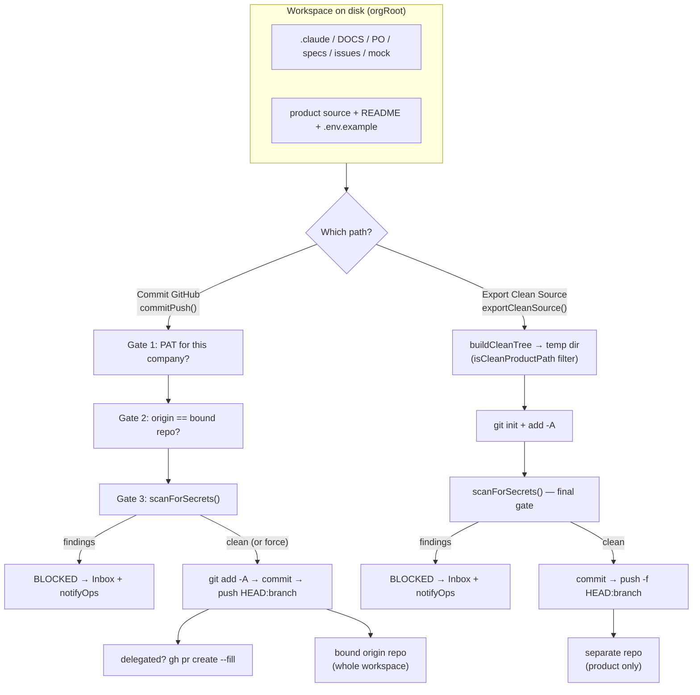
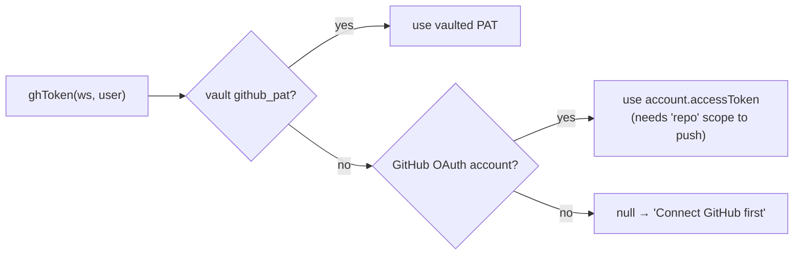

[← Docs index](./README.md) · [🇧🇷 Português](../pt/GITHUB.md) · [✦ Constella](../../README.md)

# GitHub 🛰️


The launch bay that connects a constellation's workspace to a real Git remote. Two distinct flight paths leave from here: **Commit GitHub** (the full control-plane workspace → its bound `origin`) and **Export Clean Source** (only the product, stripped of Constella's internal layer → a separate repo). Both pass through the same secret-scan airlock.

> Source of truth: [`src/server/github.ts`](../../src/server/github.ts), [`src/server/prepare-deploy.ts`](../../src/server/prepare-deploy.ts), [`src/server/git-scan.ts`](../../src/server/git-scan.ts).

---

## 1. When to use 🌠

- You connected a GitHub account during onboarding (or want to connect/replace one now).
- An agent (or you) finished work and you want **real local git history** plus a **push to a remote**.
- You want to publish **only the product** — without `.claude/`, planning docs, or any internal control files — to a public/separate repo.
- You need to verify there are no leaked secrets before anything leaves the ship.

---

## 2. How it works 🌌

Every workspace lives at the org root on disk (`orgRoot(org.id)`). The GitHub module operates on that directory as a **normal git repository**:

- `ensureRepo(cwd)` runs `git init -b main` on first use and drops a default `.gitignore` so `git add -A` never stages `node_modules/`, `.next/`, `dist/`, build output, `.env*`, `uploads/`, or `.testdev/`.
- Authentication uses a **GitHub token** resolved by `ghToken(workspaceId, userId)`:
  1. **Vaulted PAT** (`getSecret(workspaceId, "github_pat")`) — preferred.
  2. **OAuth access token** — the user's GitHub `account.accessToken` from better-auth, usable for git **only** if the OAuth app was granted the `repo` scope.
- The token is **redacted from every captured string** (`redact()` splits on the token and replaces it with `***`) so it can never leak into a notification, the Inbox, or the UI.
- All GitHub API calls go through `ghApi(token, path)` against `https://api.github.com` with a 12s timeout and `User-Agent: constella`.

### Two flight paths

| Path | Function | Source dir | Target | Strips internal layer? | Push style |
|------|----------|-----------|--------|------------------------|------------|
| **Commit GitHub** | `commitPush()` in `github.ts` | the live workspace (`orgRoot`) | the **bound** `origin` repo | No — commits the whole workspace (minus `.gitignore`) | `git push HEAD:<branch>` |
| **Export Clean Source** | `exportCleanSource()` in `prepare-deploy.ts` | a **temp** clean tree | a **separate** repo (`owner/repo`) | Yes — only `isCleanProductPath` survives | `git push -f HEAD:<branch>` |

---

## 3. Main flow 🚀

### Connect

```
connectGitHub(pat)
  → trim + length check
  → GET https://api.github.com/user  (verify the token actually works; 401 → error)
  → delete any existing github_pat row → putSecret(ws, "github_pat", token)
  → bind { login, repo: undefined, defaultBranch: undefined } to workspace.settings.github
```

The repo binding is **cleared on (re)connect** so a different account can't push to the previous account's repo.

### Bind a repo

```
setRepo("owner/repo")
  → normalize (strip https://github.com/ and .git)
  → ghToken() must reach GET /repos/owner/repo  (404 → "token can't access it")
  → ensureRepo(cwd) → git remote add|set-url origin https://github.com/owner/repo.git
  → persist settings.github = { repo, defaultBranch }
```

`createRepo({ name, private })` is a shortcut: it `POST`s `/user/repos` then calls `setRepo` on the new full name.

### Commit + push

`commitPush({ repo, branch, message, delegated?, force? })` runs three safety gates **before** touching git, then commits and (optionally) pushes / opens a PR. See [§4](#4-key-concepts-) and the diagram in [§8](#8-mermaid-diagrams-).

### Export clean source

`exportCleanSource({ repo, token?, branch?, message? })` copies only the clean product into a temp dir, scans it, and force-pushes to a **different** repo. It never touches the workspace's own `origin`.

---

## 4. Key concepts 🪐

### PAT vs OAuth token

| | Vaulted PAT (`github_pat`) | OAuth `account.accessToken` |
|---|---|---|
| Stored where | `vault` table, AES-256-GCM (`CONSTELLA_VAULT_KEY`) | better-auth `account` row |
| Set by | `connectGitHub()` / onboarding | GitHub OAuth sign-in |
| Used for git push? | Yes | Only if granted `repo` scope |
| Precedence | **First** (preferred) | Fallback when no PAT |
| Per-company | Yes — vaulted per `workspaceId` | Per user account |

`ghToken()` always returns the PAT if present, otherwise the OAuth token, otherwise `null` ("Connect GitHub first").

### `setRepo` binding — the per-company guard

The chosen repo is recorded in `workspace.settings.github.repo` (and `defaultBranch`). This binding is later checked at commit time so an agent can never push to a repo this company's token shouldn't reach. Binding **fails** if the bound token can't `GET /repos/owner/repo`.

### `refreshGitStatus` — reconciling the working tree

`file.gitStatus` is never populated by the watcher; `refreshGitStatus()` runs the **real** `git status --porcelain -z --untracked-files=all` and reconciles the `file` table so the GitHub + Code modules show actual changes.

- `-z` → NUL-separated **raw** paths (renames/copies consume an extra old-path field; non-ASCII names stay intact).
- Each entry maps to a one-letter code: `U` (untracked `?`), `D` (deleted), `A` (added), else `M` (modified).
- `.git/` and `node_modules/` paths are skipped.
- Files no longer changed get their `gitStatus` cleared back to `""`.
- A per-workspace in-memory lock (`refreshing` Set) prevents two concurrent renders from racing the reconcile and inserting duplicate rows.

### Commit GitHub vs Export Clean Source

- **Commit GitHub** = honest local git history for the *whole workspace*, pushed to the *bound* `origin`. The control-plane layer (`.claude/`, planning dirs) is committed too (it is part of your private repo).
- **Export Clean Source** = a *clean tree* — only files that pass `isCleanProductPath()` — force-pushed to a *separate* repo. This is the path for publishing the deliverable product without exposing Constella's internals.

`isCleanProductPath(rel)` rejects any path whose top dir is in `DENY_TOP` (`.claude`, `DOCS`, `PO`, `Reports`, `specs`, `issues`, `mock`, `uploads`, `archives`, `.testdev`, `node_modules`, `.git`, `.next`, `dist`, `build`, `out`, `coverage`, `.cache`, `.turbo`, `vendor`), anything under `.constella`, and any `SENSITIVE` file (`.env*`, private keys, `*.pem/.key/.p12/...`, credentials JSON, dumps/db/logs) — **except** harmless env templates matching `ALLOW_ENV` (`.env.example|.sample|.template|.dist`).

### Secret scan — the shared airlock

Both paths call `scanForSecrets(cwd)` from `git-scan.ts`. It scans the files that *would* be committed (the working-tree change set; gitignored files are already excluded by `git status`).

- **Must-never-commit files** by name: `.env*`, `id_rsa*`, `*.pem/.key/.p12/.pfx/.keystore/.jks/.ppk/.asc`, `credentials.json`, `service-account*.json`, `*.sql/.dump/.bak/.sqlite/.db`, `*.local`, `npm-debug.log` — except `ALLOW_FILE` templates.
- **High-confidence content patterns**: AWS access key, GitHub token, OpenAI/Anthropic key, Google API key, Slack token, private key block, JWT, DB URL with credentials, Telegram bot token, and a generic hardcoded-secret pattern.
- The generic pattern is suppressed for obvious **placeholders** (`your_`, `xxx`, `<...>`, `change_me`, `example`, `placeholder`, `***`, `dummy`, `todo`, `redacted`, `...`).
- Findings are **redacted** in the preview (`first4•••last2`).
- Files over 2 MB and binary files (containing `\0`) are skipped; scan caps at 3000 files / 300 findings.

---

## 5. Tables 🌌

### `vault` (relevant ref)

| Column | Value for GitHub |
|--------|------------------|
| `ref` | `github_pat` |
| `ciphertext` | AES-GCM ciphertext of the PAT |
| `iv` | per-secret IV |

### `workspace.settings.github` (JSON)

| Field | Meaning |
|-------|---------|
| `login` | GitHub username of the connected account |
| `repo` | bound `owner/repo` (the per-company binding) |
| `defaultBranch` | repo default branch (from the API) |

### `file.gitStatus`

| Code | Meaning |
|------|---------|
| `""` | no change |
| `M` | modified |
| `A` | added / staged-new |
| `U` | untracked |
| `D` | deleted |

### `deploy_run.lastExport` (set by `exportCleanSource`)

| Field | Meaning |
|-------|---------|
| `ok` | export succeeded |
| `sha` | short commit SHA of the clean tree |
| `copied` | number of clean files pushed |
| `repo` / `branch` | export target |
| `at` | timestamp |

### `PushResult` (return of `commitPush`)

| Field | Meaning |
|-------|---------|
| `ok` | a real commit landed |
| `committed` | local commit created |
| `sha` | short HEAD sha |
| `pushed` | reached the remote |
| `prUrl` | PR URL (delegated path only) |
| `nothing` | working tree had nothing to commit |
| `blocked` | a safety gate stopped the commit |
| `secrets` | secret-scan findings when blocked |

---

## 6. Step-by-step 🛰️

### Commit the workspace to its bound repo

1. **Connect** a PAT (`connectGitHub`) or sign in with GitHub OAuth (`repo` scope).
2. **Bind** a repo with `setRepo("owner/repo")` (or `createRepo`).
3. (Optional) **Refresh** status — `refreshGitStatus()` populates the change list; `draftCommitMessage()` proposes a Conventional-Commit subject from `A`/`M`/`D` counts.
4. **Scan** on demand with `scanWorkspace()` (no commit) to preview findings.
5. **Commit + push** with `commitPush({ repo, branch, message })`. Pass `delegated: true` to also open a PR via `gh pr create --fill`. Pass `force: true` to bypass the secret-scan gate *after review*.

### Export only the product

1. Run **Prepare Deploy** (or `previewCleanExport()`) to see the clean tree + a pre-export scan.
2. Call `exportCleanSource({ repo: "myorg/my-app-public" })` — or `/export-source myorg/my-app-public` in chat.
3. The clean tree is built in a temp dir, secret-scanned, committed, and **force-pushed** to the separate repo. `deploy_run.lastExport` records the result.

---

## 7. Examples 🌠

### Slash commands

```
/github                      # refresh git status, report changed file count (Werner)
/export-source myorg/app-pub # export the clean product to a separate repo
/prepare-deploy              # run the full production-prep pipeline
```

`/github` (handled in `src/server/commands.ts`) calls `refreshGitStatus()` and posts the changed-file count from Werner (DevOps).

### Commit gate messages (real strings)

```
Blocked: 2 potential secret(s)/sensitive file(s) in the change set. Resolve them or review before committing.
Origin (acme/app) doesn't match this company's configured repo (acme/app-2). Re-select the repo before committing.
committed locally — connect a GitHub PAT to push
```

### Authenticated push URL

`commitPush` rewrites the HTTPS origin to inject the PAT only at push time:

```
https://github.com/owner/repo.git
→ https://x-access-token:<PAT>@github.com/owner/repo.git   (used for `git push`, redacted everywhere else)
```

---

## 8. Mermaid diagrams 🪐

### Commit GitHub vs Export Clean Source



### Token resolution



---

## 9. Possible states 🕳️

### Commit gates (in order)

| Gate | Trigger | Result |
|------|---------|--------|
| **1. PAT configured** | no `github_pat` for this workspace | `blocked` — "GitHub isn't configured for this company" |
| **2. Repo bound + origin match** | no `settings.github.repo` / no origin, or mismatch | `blocked` — re-select the repo |
| **3. Secret scan** | any finding (and `force` not set) | `blocked`, `secrets[]`, Inbox card + ops notification |

After gates pass: `committed` → optional `pushed` → optional `prUrl`. A `nothing-to-commit` working tree returns `nothing: true`.

### Push rejection

A rejected / non-fast-forward push (`rejected | non-fast-forward | fetch first | merge conflict | failed to push`) is **not** silently dropped — it raises an Inbox `block` card ("Push rejected — \<repo\>") so the operator pulls + resolves.

### Export states

| State | Cause |
|-------|-------|
| `ok: false, error: "Use the form owner/repo."` | malformed target |
| `ok: false, error: "...token can't access it."` | `GET /repos/...` returned 404 |
| `blocked: true, secrets[]` | final scan found a secret |
| `ok: true, pushed: true, sha, copied` | clean force-push landed |
| `error: "Nothing to export yet..."` | `buildCleanTree` copied 0 files |

---

## 10. Related integrations 🌌

- **Vault** — stores `github_pat` encrypted; see [SECURITY](./SECURITY.md).
- **Inbox** — receives `block` cards for secret findings + push rejections; see [INBOX](./INBOX.md).
- **Prepare Deploy** — the pipeline that builds, validates, and gates the clean export; see [PREPARE_DEPLOY](./PREPARE_DEPLOY.md) and [DEPLOY](./DEPLOY.md).
- **Agents** — Werner (DevOps) is the default deploy/commit agent; see [AGENTS](./AGENTS.md).
- **Chat commands** — `/github`, `/export-source`, `/prepare-deploy`; see [CHAT_COMMANDS](./CHAT_COMMANDS.md).
- **Onboarding** — initial GitHub import / connect; see [ONBOARDING](./ONBOARDING.md).

---

## 11. Security 🕳️

- **Token never logged.** `redact()` strips the PAT from every captured stdout/stderr before it reaches the UI, Inbox, or notifications. The authenticated push URL (`x-access-token:<PAT>@...`) is only constructed in-memory for the `git push` call.
- **Per-company isolation.** The PAT is vaulted by `workspaceId`; binding is verified against the token; commit Gate 2 ensures `origin` equals the bound repo — you can't push another org's repo.
- **Mandatory secret scan.** Commit Gate 3 and the export final-gate both run `scanForSecrets`. The `force` flag only bypasses the *commit* scan and is intended for *post-review* use.
- **Clean export strips internals.** `isCleanProductPath` removes the entire Constella control layer and all sensitive files before anything is pushed to a separate repo.
- **Safe `.gitignore`.** `ensureRepo` guarantees deps/build/secrets are never staged by `git add -A`.

See [SECURITY](./SECURITY.md) for the full vault + scrub model.

---

## 12. Troubleshooting 🛰️

| Symptom | Likely cause | Fix |
|---------|--------------|-----|
| "Connect GitHub first." | no PAT and no OAuth token | run `connectGitHub` with a `repo`-scoped PAT |
| "Invalid token (401). ...needs the 'repo' scope." | PAT lacks `repo` scope or is wrong | regenerate with `repo` scope |
| "Repo not found, or this company's token can't access it." | `GET /repos/owner/repo` 404 | check the repo name + that the token's account has access |
| "Origin (X) doesn't match this company's configured repo (Y)." | origin and binding diverged | call `setRepo` to re-bind |
| Commit `blocked` with `secrets[]` | scan found a secret/sensitive file | remove it (or move into `.env`), or `force` after review |
| "Push rejected — \<repo\>" in Inbox | remote moved ahead / conflict | pull + resolve, then push again |
| GitHub module shows "No changes" but files changed | `file.gitStatus` not reconciled | trigger `refreshGitStatus()` (Refresh button / `/github`) |
| "committed locally — connect a GitHub PAT to push" | commit landed, no credentials to push | connect a PAT |
| "Nothing to export yet..." | no clean product files found | add product source outside the internal dirs |

---

## 13. Related links 🌠

- [PREPARE_DEPLOY](./PREPARE_DEPLOY.md) · [DEPLOY](./DEPLOY.md) · [PUBLISHING](./PUBLISHING.md)
- [SECURITY](./SECURITY.md) · [INBOX](./INBOX.md) · [CHAT_COMMANDS](./CHAT_COMMANDS.md)
- [AGENTS](./AGENTS.md) · [ONBOARDING](./ONBOARDING.md) · [CONFIGURATION](./CONFIGURATION.md)
- [✦ Back to the Docs index](./README.md)
