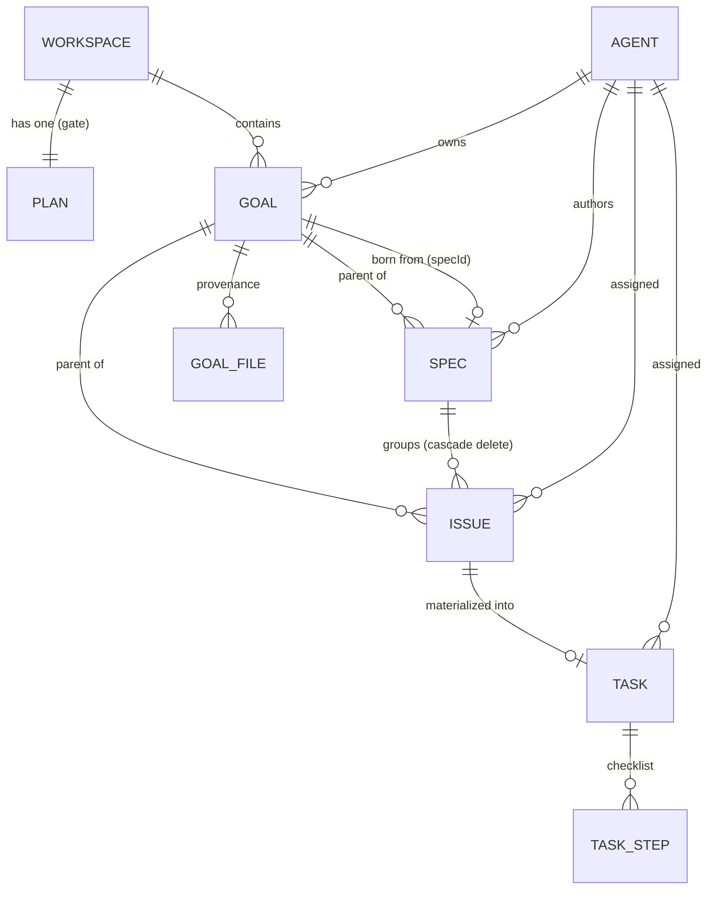
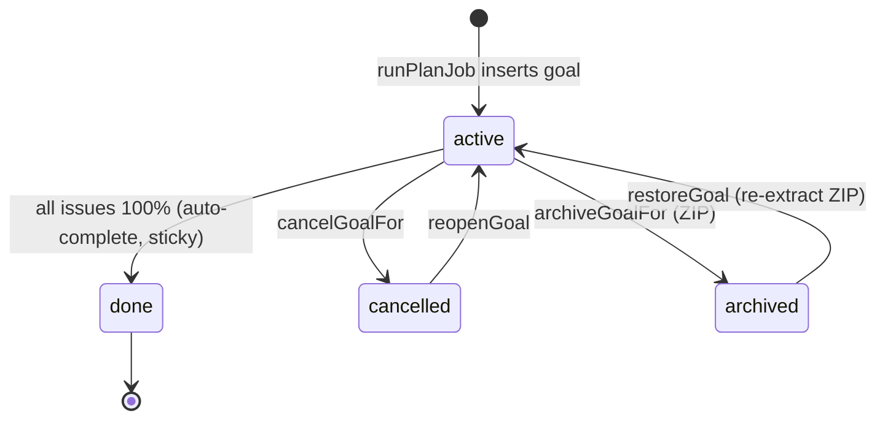
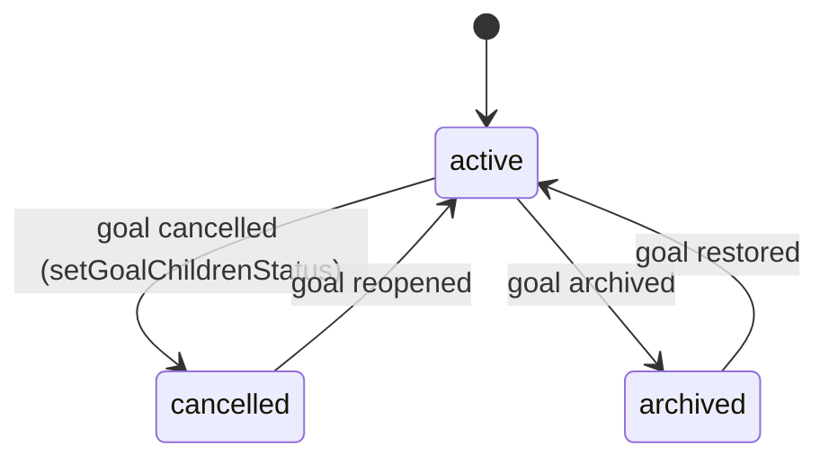
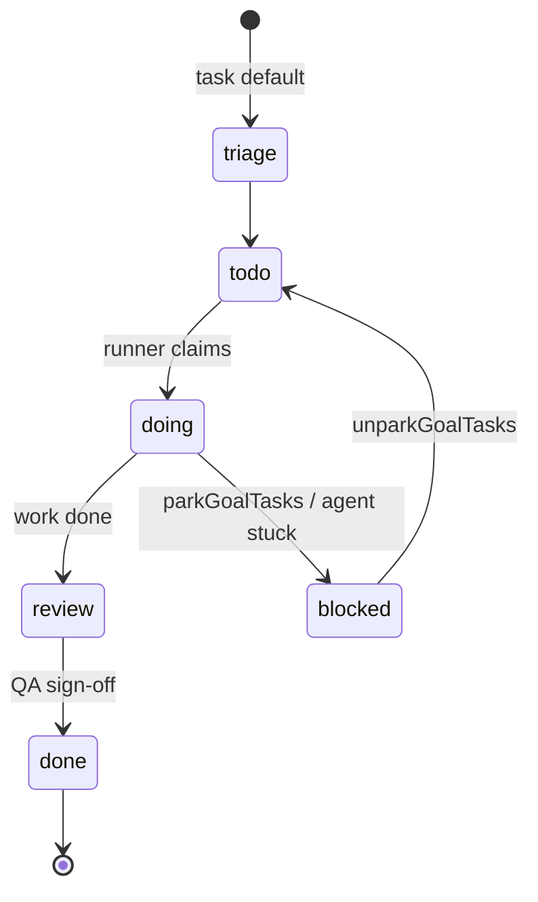
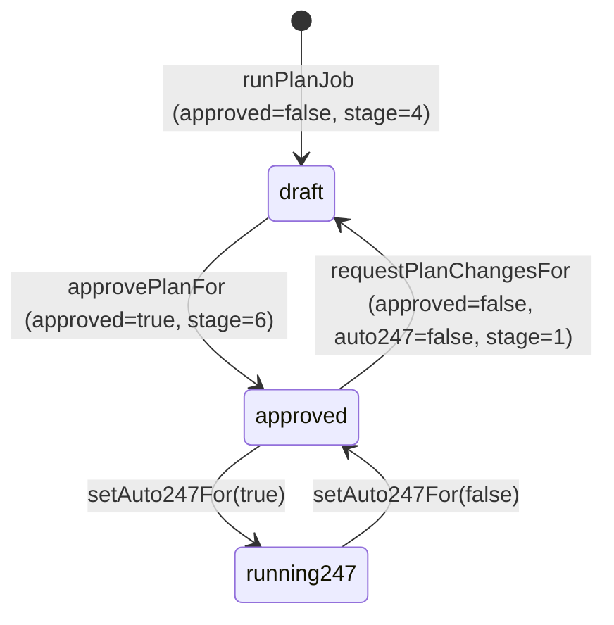

[← Docs index](./README.md) · [🇧🇷 Português](../pt/GOALS_SPECS_ISSUES.md) · [✦ Constella](../../README.md)

# Goals, Specs, Issues, Plans — The Work Constellation 🌌🪐


The data model and state machines behind every unit of work. A **Goal** is an orbit; **Specs** are its charts; **Issues** are the manoeuvres; **Tasks** are the burns the engine actually fires; the **Plan** is the launch gate the operator opens. This page documents the real tables, columns, status enums and the transitions between them.

## Short description

Constella turns a brief into a structured, state-aware delivery pipeline: `Goal → Spec → Issue → Plan → Execution → Review → Test → Done`. The CEO agent (Ada) drafts specs and issues; the operator approves the plan; approved issues are *materialized* into executable tasks the runner picks up. Cancelling or archiving a goal cascades to its children so nothing settled keeps reading as pending.

## When to use

- You want to understand **what each entity is**, what columns it has and how rows relate.
- You need the exact **status enums** and **kanban columns** for `goal`, `spec`, `issue`, `task` and `plan`.
- You're debugging why a cancelled goal still shows pending work, or why a re-approved plan only created *some* tasks.
- You want to know what the **SUPER-SPEC** is and when it is written.

## How it works 🛰️

Every entity is a row in the SQLite database (`src/db/schema.ts`), scoped to a `workspaceId` (one workspace per organization). The directory on disk is the source of truth for the human-readable artifacts (`specs/*.md`, `issues/*.md`, `specs/SUPER-SPEC.md`); the tables index them and carry the lifecycle state.

The pipeline is driven by three modules:

| Module | File | Responsibility |
| --- | --- | --- |
| Planner | `src/server/planner-core.ts` | `generatePlanFor` / `runPlanJob` / `planFromConversationFor` — the CEO drafts the Goal + specs + issues |
| Plan ops | `src/server/plan-ops.ts` | `approvePlanFor` / `requestPlanChangesFor` / `setAuto247For` — the approval gate |
| Work ops | `src/server/work-ops.ts` | `cancelGoalFor` / `archiveGoalFor` + cascade helpers — goal lifecycle |
| Materialize | `src/server/materialize.ts` | `materializeTasks` — turn approved issues into executable `task` rows |

All four are `server-only` cores keyed by an explicit `(orgId, workspaceId)`, so they can be called from a session action **or** from the channels with no session (the Telegram remote control, the public API).

## Main flow 🌠

```
brief / DM "@ada build X"
   └─ generatePlanFor → runPlanJob (Ada, detached, "planner" channel)
        ├─ (first plan, existing project) analyzeExistingProject → specs/SUPER-SPEC.md
        ├─ insert goal (from the MAIN/first spec)
        ├─ insert spec rows  + write specs/SPEC-NN.md
        ├─ insert issue rows + write issues/<key>.md   (col=todo, approved=false)
        └─ push Inbox "Approve plan"
   └─ operator approves → approvePlanFor
        ├─ plan.approved=true, stage=6
        ├─ issue.approved=true, spec.approved=true (active specs)
        ├─ materializeTasks → one task per issue (idempotent)
        └─ groom PO backlog
   └─ Run 24/7 (plan.auto247=true) → runner pulls tasks → Review → Test → Done
```

## Key concepts 🕳️

- **The Goal is born from the MAIN spec.** `runPlanJob` treats the first spec in the model's output as the main spec; the `goal.specId` points at it, and every drafted spec/issue gets the goal's id (`goalId`).
- **Lifecycle is independent of the workflow column.** `spec.status` / `issue.status` (`active | cancelled | archived`) are *separate* from `issue.col` (the kanban lane). Cancelling a goal flips the children's `status`, never their `col`, so the board history survives.
- **`approved` is a boolean, not a status.** A spec or issue can be `approved=true` while still `active`. The approval gate lives on the singleton `plan` row.
- **Tasks are the only thing the runner executes.** Issues are plans; tasks are work. `materializeTasks` bridges them and is idempotent via `task.issueId`.
- **Disk is the source of truth.** Spec/issue keys are renumbered to *continue* from existing ones so a second "New work" plan never overwrites `specs/SPEC-01.md` on disk.

## Tables 🪐

### `goal` — a unit of work (an orbit)

| Column | Type | Notes |
| --- | --- | --- |
| `id` | text PK | |
| `workspaceId` | text FK → workspace | indexed `goal_ws_idx` |
| `title` / `description` | text | |
| `ownerId` | text FK → agent | usually Ada (the CEO) |
| `progress` | int | cached rollup 0–100, recomputed by the runner |
| `parentId` | text | optional parent goal |
| `status` | enum | `active \| cancelled \| archived \| done` (default `active`) |
| `specId` | text | the **main** spec this goal was born from |
| `archivePath` | text | ZIP path when archived |
| `createdAt` / `updatedAt` / `doneAt` / `cancelledAt` / `archivedAt` / `reopenedAt` | timestamp | nullable lifecycle stamps |

Provenance is tracked in `goal_file` (PK `goalId + path`, `op = created | edit`) so an archive ZIP can include *only* the files this goal produced.

### `spec` — a chart

| Column | Type | Notes |
| --- | --- | --- |
| `id` | text PK | |
| `workspaceId` | text FK | |
| `key` | text | e.g. `SPEC-01` (renumbered to continue from existing) |
| `title` / `summary` / `body` | text | |
| `authorId` | text FK → agent | the role the CEO assigned as author |
| `approved` | bool | default `false` |
| `goalId` | text | parent goal |
| `status` | enum | `active \| cancelled \| archived` (default `active`) |
| `createdAt` / `updatedAt` | timestamp | |

### `issue` — a manoeuvre

| Column | Type | Notes |
| --- | --- | --- |
| `id` | text PK | |
| `workspaceId` | text FK | |
| `specId` | text FK → spec | `onDelete: cascade` |
| `goalId` | text | parent goal |
| `key` | text | sequential, continuing from existing issues |
| `title` | text | |
| `prio` | enum | `low \| med \| high` (default `med`) |
| `col` | enum | `todo \| doing \| blocked \| review \| done` (kanban lane, default `todo`) |
| `moscow` | enum | `Must \| Should \| Could \| Won't` (derived from `prio`) |
| `points` | int | story points (derived: high→8, med→5, low→3) |
| `assigneeId` | text FK → agent | the role the CEO assigned |
| `approved` | bool | default `false` |
| `status` | enum | `active \| cancelled \| archived` (default `active`) |
| `createdAt` / `updatedAt` | timestamp | |

### `task` — an engine burn (the executable unit)

| Column | Type | Notes |
| --- | --- | --- |
| `id` | text PK | |
| `workspaceId` | text FK | |
| `key` / `title` / `description` | text | |
| `col` | enum | `triage \| todo \| doing \| blocked \| review \| done` (default `triage`) |
| `prio` | enum | `low \| med \| high` |
| `assigneeId` | text FK → agent | |
| `goalId` | text FK → goal | |
| `issueId` | text FK → issue | the issue it was materialized from (idempotency key) |
| `createdBy` | enum | `operator \| agent` |
| `createdAt` / `updatedAt` | timestamp | |

Sub-steps live in `task_step` (`text`, `done`, `active`, `ord`) — seeded from the issue's `## Checklist` and the basis for live progress.

### `plan` — the launch gate (one row per workspace)

| Column | Type | Notes |
| --- | --- | --- |
| `workspaceId` | text **PK** | one plan per workspace |
| `approved` | bool | default `false` |
| `auto247` | bool | 24/7 autonomous execution toggle |
| `stage` | int | pipeline stage marker (default `4`) |
| `createdAt` / `updatedAt` | timestamp | |

Note the difference in cardinality: there is exactly **one** `plan` row per workspace (PK is `workspaceId`), but **many** goals/specs/issues/tasks.

## Entity relationships diagram



## Status transitions 🌠

### Goal state machine



`progress` and `status` drift **only while active**. Once a goal settles (`done`/`cancelled`/`archived`) its `%` is sticky — a later blocked or added issue can't make a "Done" goal read 62%. Auto-completion is compare-and-set: only the first writer that still sees the goal `active` stamps `done` + `doneAt` (`src/server/progress.ts`).

### Spec / Issue lifecycle (status) — cascades from the parent goal



### Issue / Task kanban column (workflow, independent of status)



> Issues use the columns `todo · doing · blocked · review · done`. Tasks add a leading `triage` lane.

### Plan gate



## Step-by-step 🚀

1. **A brief arrives** — the standing workspace brief (`.claude/BRIEF.md`), a DM to `@ada`, or `/new-work` / `/new-goal`.
2. **`generatePlanFor`** marks Ada `working` and kicks off `runPlanJob` detached on the persistent node server (streams to the `planner` channel).
3. **First-plan analysis** (only when an existing project is present and not yet analyzed): `analyzeExistingProject` reads the project file-by-file and writes `specs/SUPER-SPEC.md`, then flags `settings.source.analyzed = true`.
4. **Ada drafts** a single JSON object of `specs[]` + `issues[]`. The first spec is the **main** spec.
5. **Persist** — insert the `goal` (title from `opts.goalTitle` / main spec / objective), then specs (keys renumbered to continue), then issues (`col=todo`, `points`/`moscow` derived from `prio`). Write `specs/SPEC-NN.md` and `issues/<key>.md` to disk.
6. **Inbox + Telegram** — an `approval` inbox item (`refType=plan`) is pushed; if Telegram is configured, the plan is sent to the phone with Approve / Start execution / Review / Reject buttons.
7. **Operator approves** (`approvePlanFor`): `plan.approved=true, stage=6`, issues + active specs flip `approved=true`, `materializeTasks` creates one task per un-materialized issue, and the PO backlog (`PO/backlog.md`) is groomed.
8. **Run 24/7** (`setAuto247For(true)`) — the runner pulls `todo` tasks, advances them through `doing → review → done`, mirrors progress back onto issues and goals.
9. **Cancel / archive** when needed — `cancelGoalFor` / `archiveGoalFor` stop everything and cascade the children's status.

## Examples

**New work from a DM** (handled by `planFromConversationFor` → `generatePlanFor`):

```
@ada build a billing dashboard with a payment provider and a CSV export
```

**Approve from a slash command** ([CHAT_COMMANDS](./CHAT_COMMANDS.md)):

```
/approve          # approvePlanFor: approve plan/specs/issues + materialize tasks
/run-247          # setAuto247For(true)
/reject <reason>  # requestPlanChangesFor — back to Ada, stage rewinds to 1
/cancel           # cancelGoalFor — stop + park, reopen later
/archive          # archiveGoalFor — ZIP the goal's source + manifest
```

**Issue → task materialization** (`materializeTasks`, idempotent): re-approving after a re-plan creates tasks **only** for issues without a `task.issueId`, so existing work is never duplicated.

## Possible states

| Entity | Field | Values |
| --- | --- | --- |
| goal | `status` | `active`, `cancelled`, `archived`, `done` |
| spec | `status` | `active`, `cancelled`, `archived` |
| spec | `approved` | `true`, `false` |
| issue | `status` | `active`, `cancelled`, `archived` |
| issue | `col` | `todo`, `doing`, `blocked`, `review`, `done` |
| issue | `approved` | `true`, `false` |
| issue | `moscow` | `Must`, `Should`, `Could`, `Won't` |
| task | `col` | `triage`, `todo`, `doing`, `blocked`, `review`, `done` |
| plan | `approved` / `auto247` | `true`, `false` |

## The SUPER-SPEC 🌌

When onboarding imports an existing project (a GitHub repo, a copied local directory, or an attached `mock/`), the **first** plan run does not draft blindly. `analyzeExistingProject` (`src/server/analyze.ts`) runs a real agent pass with the workspace as `cwd`, reads docs → manifests → source file-by-file, and writes `specs/SUPER-SPEC.md` with sections such as *Overview & purpose, Architecture & layers, Tech stack & dependencies, Directory / module map, Frontend, Backend, Data model & database, Auth & security, Integrations, Business rules & key flows, What is mock/stubbed vs real, Gaps to make it production-real*.

The plan then reads the SUPER-SPEC in full and **extends** the existing system — it never scaffolds a second separate prototype. The analysis runs once per project (`settings.source.analyzed`).

## Related integrations

- **PO grooming** — on approve, every issue is copied into `backlog_item` (MoSCoW + points) and `PO/backlog.md` is rewritten. See [PO_AGENT](./PO_AGENT.md).
- **Inbox** — the plan-approval decision surfaces as an actionable item (`refType=plan`). See [INBOX](./INBOX.md).
- **Decisions log** — approve/cancel/archive each append a `decision` row. See [TEAM_ROOM](./TEAM_ROOM.md).
- **Telegram remote** — the same session-less cores power `/approve`, `/cancel`, etc. from the phone. See [TELEGRAM](./TELEGRAM.md).
- **Runner / execution** — tasks flow through review and test. See [WORKFLOW](./WORKFLOW.md), [TEST_DEV](./TEST_DEV.md).

## Security 🔒

- All lifecycle cores are `server-only` and keyed by an explicit `(orgId, workspaceId)` — **never** exposed as unauthenticated RPC endpoints. Every caller (session action, Telegram allowlist, public API PAT) must already be authorized for the workspace.
- `ownGoal(wsId, goalId)` verifies the goal belongs to the workspace before any mutation.
- Archive/restore ZIP extraction normalizes paths and refuses to write outside the workspace root (`abs !== root && !abs.startsWith(root + sep)`), part of the FS jail. See [SECURITY](./SECURITY.md).

## Troubleshooting 🕳️

| Symptom | Cause | Fix |
| --- | --- | --- |
| Cancelled goal still shows pending issues | child `status` not cascaded | `cancelGoalFor` calls `setGoalChildrenStatus`; reopen + re-cancel if a row was edited directly |
| Re-approve created no new tasks | all issues already have a `task.issueId` | expected — `materializeTasks` is idempotent; only new issues materialize |
| "Done" goal stuck below 100% | sticky cached progress | by design once settled; reopen to recompute while `active` |
| Plan won't approve | no `plan` row / specs not `active` | `approvePlanFor` only approves `spec.status = active`; ensure a plan exists |
| Ada stuck "working", no plan | a prior job died before its `finally` | `generatePlanFor` self-recovers by checking the live `planner` event stream |
| Second "New work" overwrote SPEC-01 | should not happen | keys are renumbered to continue from existing specs/issues on disk |

## Related links

- [WORKFLOW](./WORKFLOW.md) — the end-to-end execution ritual
- [PO_AGENT](./PO_AGENT.md) — backlog grooming, story points, MoSCoW
- [AGENTS](./AGENTS.md) — the roster (Ada is the CEO/planner)
- [INBOX](./INBOX.md) — operator approvals and decisions
- [CHAT_COMMANDS](./CHAT_COMMANDS.md) — `/approve`, `/cancel`, `/archive`, `/new-work`
- [DM](./DM.md) — starting new work from a direct message
- [TEAM_ROOM](./TEAM_ROOM.md) — where the CEO narrates the plan
- [ARCHITECTURE](./ARCHITECTURE.md) — the data layer and sync engine
- [TELEGRAM](./TELEGRAM.md) — remote control of the same cores
