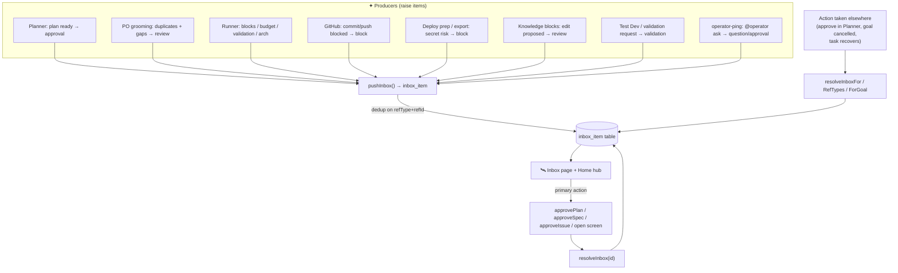
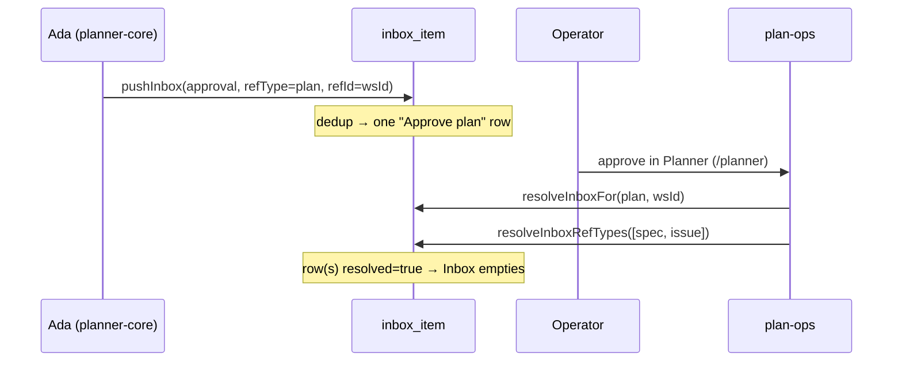

[← Docs index](./README.md) · [🇧🇷 Português](../pt/INBOX.md) · [✦ Constella](../../README.md)

# 🛰️ Inbox — the operator's decision console


The Inbox is the single place where every decision that needs *you* — the human at the control plane — comes to rest. When a working constellation drifts off course (a plan awaiting approval, a budget cap hit, a blocked file, a knowledge gap, an agent asking a direct question), it files an actionable item here. Nothing the agents do that requires human judgement is silent: it lands in the Inbox, deduplicated and auto-clearing.

---

## When to use

- You want **one list** of everything that needs your action right now (approvals, blocks, budget, validations, questions).
- An agent posted "@operator, can you confirm…?" and you want to act on it without scrolling chat.
- A plan / spec / issue is drafted and waiting for **approval** before any code runs.
- A run **blocked** (file lock, broken dev server, failed Test Dev, rejected push, blocked destructive command) and you need to intervene.
- An agent **hit its daily budget cap** and paused.
- The Product Owner flagged likely **duplicates** or **gaps** during backlog grooming.
- A new Constella **version** is available.

If you only want to *read* status, use `/status` in chat. The Inbox is for things that need a **decision or an action**.

---

## How it works 🌌

The Inbox is backed by a real table, `inbox_item` (`src/db/schema.ts`). It is not a view over chat — items are persisted rows with a `kind`, a human title/detail, an optional reference to the underlying decision (`refType` + `refId`), and a `resolved` flag.

Three small modules form the whole surface:

| Module | File | Role |
| --- | --- | --- |
| Producer API | `src/server/inbox.ts` | `pushInbox`, `resolveInboxFor`, `resolveInboxRefTypes`, `resolveInboxForGoal` |
| List page | `src/app/(app)/inbox/page.tsx` + `src/components/modules/inbox-row.tsx` | the full Inbox view + detail overlay |
| Home hub | `src/server/home.ts` (`homeDecisions`) + `src/components/modules/home-inbox.tsx` | "Needs your decision" card on the dashboard |

Items are created by **producers** scattered across the codebase (the planner, the runner, GitHub, deploy prep, blocks, Test Dev, the operator-ping). They are **consumed** by the Inbox UI, where the primary button runs the *real* action (approve the plan, approve a spec/issue, open the channel/screen) and then marks the item resolved.

The same item is reachable from two places: the dedicated **Inbox** page (all kinds, resolved + unresolved) and the dashboard **Needs your decision** card (`homeDecisions`, unresolved, only `approval | review | block | budget`, newest 6).

### Dedup and refresh

`pushInbox` is dedup-aware. If an item already exists **unresolved** for the same `(refType, refId)`, it is **refreshed in place** (latest title/detail/goal/timestamp) instead of piling up a duplicate. So a re-drafted plan with new spec/issue counts updates the one "Approve plan" row rather than spawning a second one.

### Auto-clear

When the underlying decision is taken **elsewhere** (you approve the plan in the Planner, a blocked task recovers, a goal is cancelled), the matching Inbox item is auto-resolved so the list never shows a stale pending row. Four helpers do this — see [Clearing items](#clearing-items--orbital-decay-).

---

## Main flow



---

## Key concepts 🪐

### Item kinds

The `kind` enum (`inbox_item.kind`) is the item's category. It drives the icon and the localized label.

| `kind` | Meaning | Typical producer | Icon |
| --- | --- | --- | --- |
| `approval` | A plan or an agent ask needs your sign-off before work proceeds | planner-core (plan ready), operator-ping (approval phrasing) | `check` |
| `review` | Something to look over: a spec/issue rejection, an architecture decision, a held review, a KB block edit, a duplicate/gap report, an available update | planner (reject spec/issue), runner (arch decision, held review), blocks (proposal), planner (PO grooming) | `doc` |
| `block` | A run is blocked and needs you to unblock it | runner (broken dev server, blocked goal, guard-blocked command), GitHub (commit/push rejected), deploy prep (secret risk), file locks | `close` |
| `budget` | An agent paused on its daily spend cap | runner | `coins` |
| `validation` | A feature needs you to validate it (Test Dev / manual) | test-dev-actions (`requestValidation`), runner (failed Test Dev) | `pulse` |
| `question` | A plain `@operator` question that needs an answer | operator-ping | `chat` |

### Reference (`refType` + `refId`)

`refType` says *what kind of thing* the decision is about; `refId` is the concrete id (or a synthetic key). Together they let the Inbox **execute the real action** and **auto-resolve** when handled elsewhere.

| `refType` | `refId` example | Primary action in the UI |
| --- | --- | --- |
| `plan` | the **workspace id** (the plan is a singleton per workspace) | **Approve plan** → `approvePlan()` |
| `spec` | spec row id | **Approve spec** → `approveSpec(refId)` |
| `issue` | issue row id | **Approve issue** → `approveIssue(refId)` |
| `task` | task id, or a synthetic key like `lock:<path>`, `commit-<origin>`, `budget:<id>`, `arch:<taskId>` | **Open tasks** (`/tasks`) |
| `validation` | issue key, block-proposal id, Test Dev gate id | **Open Test Dev** (`/test-dev`) |
| `question` | the chat `messageId` | **Open chat** (jumps to the DM or toggles chat) |
| `goal` | goal id | (used by `resolveInboxForGoal`) |

> Note: `InboxRefType` in `src/server/inbox.ts` enumerates `plan | spec | issue | task | validation | question | goal`. The column itself is a free-text `text("ref_type")`, so synthetic keys (e.g. `arch:<taskId>`) ride on `refType: "task"`.

### Other columns

| Column | Purpose |
| --- | --- |
| `fromAgentId` | which agent raised it (drives the avatar + "from {name}") |
| `goalId` | the goal it belongs to — lets a cancel/archive clear all related items |
| `channel` | jump target for chat-linked items (e.g. `dm:<handle>`) |
| `messageId` | the source chat message (for `question` items) |
| `resolved` | `false` = still demands action; `true` = handled/dismissed |
| `createdAt` | timestamp; refreshed on dedup |

---

## Producers — what surfaces in the Inbox 🌠

Every `pushInbox` call in the codebase, grouped by source:

| Source file | When | `kind` | `refType` |
| --- | --- | --- | --- |
| `server/planner-core.ts` | Ada finished drafting a plan; it needs approval before code runs | `approval` | `plan` |
| `server/planner.ts` | A spec was **rejected** — author should revise | `review` | `spec` |
| `server/planner.ts` | An issue was **rejected** — assignee should revise | `review` | `issue` |
| `server/planner.ts` (`groomBacklogFor`) | PO grooming flagged **duplicates / gaps** | `review` | _(none)_ |
| `server/runner.ts` | Agent **hit the daily budget cap** and paused | `budget` | `task` (`budget:<agentId>`) |
| `server/runner.ts` | Captured an **architecture / business-rule** decision | `review` | `task` (`arch:<taskId>`) |
| `server/runner.ts` | A task **broke the dev server** (boot gate) | `block` | `task` |
| `server/runner.ts` | A task **failed Test Dev** | `validation` | `validation` |
| `server/runner.ts` | A task is **held in review** with high-severity findings | `review` | `task` |
| `server/runner.ts` | A run **blocked — needs you** (run failed) | `block` | `task` |
| `server/runner.ts` | The safety guard **blocked destructive commands** | `block` | `task` (`guard:<taskId>`) |
| `server/runner.ts` | A new **Constella version** is available | `review` | `task` (`update:<latest>`) |
| `server/github.ts` | **Commit blocked** — secret risk in the change set | `block` | `task` (`commit-<origin>`) |
| `server/github.ts` | **Push rejected** — remote conflict / non-fast-forward | `block` | `task` (`push:<repo>:<branch>`) |
| `server/prepare-deploy.ts` | **Prep blocked** — secret risk | `block` | `task` (`deploy-prep`) |
| `server/prepare-deploy.ts` | **Export blocked** — secret risk | `block` | `task` (`export-<repo>`) |
| `server/blocks.ts` | A **knowledge block edit** was proposed | `review` | `validation` |
| `server/actions/test-dev-actions.ts` (`requestValidation`) | An agent/operator asks you to **validate a feature** | `validation` | `validation` |
| `server/dashboard.ts` | A **file lock** is held by a live run | `block` | `task` (`lock-<path>`) |
| `app/api/locks/acquire/route.ts` | **File contention** — an agent is blocked editing a locked file | `block` | `task` (`lock:<path>`) |
| `server/operator-ping.ts` | An agent message **addresses you** (`@operator`) | `approval` (if approval phrasing) or `question` | `question` |

Most producers also call `notifyOps` (a transient toast/notification) alongside `pushInbox` (the persistent decision). The Inbox is the durable record; notifications are the nudge.

---

## Consuming the Inbox — the UI

### The full Inbox page

`/inbox` (`src/app/(app)/inbox/page.tsx`) loads **all** items for the workspace, sorts **unresolved first then newest first**, and renders `InboxList`. The header sub-title shows the pending count (`inbox.sub`). Each row shows the kind icon, the title, a sub-line (`kind · from {name} · <when>`), and the raising agent's avatar with a health dot.

Clicking a row opens a **detail overlay** with the full detail text and the buttons:

- **Primary action** — for an actionable `refType`, the real decision runs (`primaryFor` in `inbox-row.tsx`):
  - `plan` → **Approve plan**
  - `spec` → **Approve spec**
  - `issue` → **Approve issue**
  - `task` → **Open tasks**
  - `validation` → **Open Test Dev**
  - `question` → **Open chat** (opens the DM if `channel` starts with `dm:`, else toggles the chat panel)
- **Dismiss** — resolve without running anything.
- **Reopen** — for an already-resolved item, flip `resolved` back to `false`.

After the primary action runs, the item is always resolved (`finally { resolveInbox(id, true) }`).

### The dashboard hub

`homeDecisions` (`src/server/home.ts`) feeds the "Needs your decision" card (`HomeInbox`). It is a tighter slice: **unresolved** items of kind `approval | review | block | budget` only, newest 6. Here the buttons are **Approve / Reject** for `plan | spec | issue` (reject uses `rejectSpec` / `rejectIssue`, which themselves file a follow-up "Revise…" review item and open a prefilled DM to the author). Anything else falls back to opening `/inbox`.

---

## Clearing items — orbital decay 🕳️

There are two flavours of clearing.

### Manual — by the operator

`resolveInbox(id, resolved = true)` in `src/server/actions/inbox-actions.ts` flips `resolved` (workspace-scoped) and revalidates `/inbox`. This is what the **Dismiss / Reopen** buttons and every primary action call.

> ⚠️ **Two `resolveInbox` exist.** `src/server/actions/inbox-actions.ts` **updates** `resolved` (reversible — you can Reopen). `src/server/modules.ts` has a different `resolveInbox(id)` that **deletes** the row outright. The Inbox UI (`inbox-row.tsx`, `home-inbox.tsx`) uses the *actions* version; `module-toggles.tsx` uses the *modules* (delete) one. Treat the modules variant as a hard delete.

### Automatic — when the decision is taken elsewhere

Four helpers in `src/server/inbox.ts` resolve items so the list never shows a stale row:

| Helper | Resolves | Called by |
| --- | --- | --- |
| `resolveInboxFor(wsId, refType, refId)` | every unresolved item for one `(refType, refId)` | `plan-ops.ts` (plan approve/reject), `planner.ts` (spec/issue approve), `blocks.ts` (merge/reject proposal), `file-locks.ts` (lock released), `runner.ts` (task recovered) |
| `resolveInboxRefTypes(wsId, refTypes[])` | every unresolved item of the given ref types | `plan-ops.ts` — approving the plan clears all per-`spec`/`issue` review items at once |
| `resolveInboxForGoal(wsId, goalId)` | every unresolved item tied to a goal | `work-ops.ts` — cancel / archive a goal clears everything related |
| `resolveInbox(id)` (modules) | a single row, by **delete** | `module-toggles.tsx` |

All four are **best-effort** and never throw — an inbox write/clear must never break the chat post or the runner step that triggered it.



---

## Step-by-step

### Approve a plan from the Inbox

1. Ada drafts a plan → a `kind: "approval"`, `refType: "plan"` item appears titled **"Approve plan — &lt;workspace&gt;"**.
2. Open `/inbox`, click the row.
3. Press **Approve plan**. This runs `approvePlan()` (queues tasks, marks issues approved, grooms the backlog), then resolves the item.
4. The `plan` item *and* all pending per-`spec`/`issue` review items clear automatically (`resolveInboxRefTypes`).

### Handle a blocked run

1. A run blocks → a `kind: "block"`, `refType: "task"` item appears (e.g. **"&lt;KEY&gt; broke the dev server"** or **"Commit blocked — N secret risk(s)"**).
2. Open the row, read the `detail` (it carries the boot error / secret list / stderr).
3. Fix the cause (e.g. resolve secrets, then re-run with force on GitHub), or **Open tasks** to inspect.
4. When the task recovers, `runner.ts` calls `resolveInboxFor(ws.id, "task", t.id)` and the item clears.

### Answer an agent question

1. An agent posts `@operator can you confirm the pricing tiers?` → `operator-ping` files a `kind: "question"` (or `approval` if it reads as an approval ask), `refType: "question"`, with the `channel` + `messageId`.
2. Open the row, press **Open chat** — it jumps straight to that DM/channel.
3. Reply in chat. Dismiss the item (questions don't auto-resolve from a reply).

---

## Examples

A budget cap item raised by the runner:

```ts
await pushInbox(ws.id, {
  kind: "budget", refType: "task", refId: `budget:${a.id}`,
  goalId: t.goalId ?? null, fromAgentId: a.id,
  title: `@${a.handle} hit the daily budget cap`,
  detail: `${a.name} reached the $${a.dailyCapUsd}/day spend cap and paused. ` +
          `Raise the cap in Agent Studio or wait for the daily reset.`,
});
```

A PO grooming review item (duplicates + gaps — `groomBacklogFor`):

```ts
await pushInbox(workspace.id, {
  kind: "review", fromAgentId: po.id,
  title: `PO backlog review — ${dupes.length} duplicate, ${gaps.length} gap`,
  detail: note.slice(0, 500),
});
```

The plan-ready approval item (`planner-core.ts`):

```ts
await pushInbox(workspace.id, {
  kind: "approval", refType: "plan", refId: workspace.id, goalId,
  fromAgentId: ada.id, channel: "room",
  title: `Approve plan — ${workspace.name}`,
  detail: `${specCount} spec(s) · ${issues} issue(s) drafted from the brief. Approve to start execution.`,
});
```

---

## Possible states

| State | Meaning |
| --- | --- |
| **Unresolved** (`resolved = false`) | Demands your action. Shown first in the list, full opacity, counted in `inbox.sub`. |
| **Resolved** (`resolved = true`) | Handled or dismissed. Shown greyed + struck-through, sorts to the bottom, offers **Reopen**. |
| **Refreshed** | A dedup hit — an existing unresolved item's title/detail/timestamp were updated in place. |
| **Deleted** | Removed entirely via the `modules.ts` `resolveInbox` (no Reopen possible). |
| **Empty** | No items — the list shows "All caught up 🎉" (`inbox.empty`). |

---

## Related integrations 🛰️

- **Planner / Plan-ops** — the biggest producer (plan approval) and the biggest auto-resolver (`/approve` clears plan + spec + issue items). See [WORKFLOW](./WORKFLOW.md) and [GOALS_SPECS_ISSUES](./GOALS_SPECS_ISSUES.md).
- **Runner** — files block/budget/validation/review items as tasks execute. See [AGENTS](./AGENTS.md).
- **Telegram** — the same plan-ready decision is mirrored to your phone with inline **Approve / Start execution / Review / Reject** buttons; tapping them runs the same shared core. See [TELEGRAM](./TELEGRAM.md).
- **GitHub** — commit/push blocks land here. See [GITHUB](./GITHUB.md).
- **Prepare Deploy / Export** — secret-scan blocks land here. See [PREPARE_DEPLOY](./PREPARE_DEPLOY.md) and [DEPLOY](./DEPLOY.md).
- **Test Dev** — failed gates + validation requests land here. See [TEST_DEV](./TEST_DEV.md).
- **Knowledge** — block-edit proposals land here as `review` items. See [SYNCED_BLOCKS](./SYNCED_BLOCKS.md) and [KB_RAG](./KB_RAG.md).
- **Update** — an available release files a `review` item. See [UPDATE](./UPDATE.md).

The Inbox is also exposed indirectly through the public API and the chat surface: `/status` summarizes counts, while `/approve`, `/reject`, `/pause`, `/run-247` act on the same underlying decisions. See [CHAT_COMMANDS](./CHAT_COMMANDS.md) and [PUBLIC_API](./PUBLIC_API.md).

---

## Security

- **Workspace isolation** — every read/write is scoped by `workspaceId`; `resolveInbox` filters on both `id` *and* `workspaceId`, so one org can never resolve another org's item.
- **No secrets in items** — producers that surface secret findings (GitHub, deploy prep) include a **redacted preview** only (`kind` + truncated path), never the secret value. The detail text is also length-capped (≈400–500 chars).
- **Server-only** — `inbox.ts` is `import "server-only"`; items are written by trusted server actions and the runner, never directly by an agent process inside the FS jail.
- **Best-effort, non-blocking** — a failed inbox write logs and returns; it can't stall a chat post or a run.

See [SECURITY](./SECURITY.md) for the vault, scrub and jail details.

---

## Troubleshooting

| Symptom | Likely cause | Fix |
| --- | --- | --- |
| A "decision" never appears in the Inbox | The producer's `notifyOps`/`pushInbox` ran best-effort and swallowed an error | Check the worker/server console for `[inbox] pushInbox failed` |
| Duplicate-looking rows | They differ in `(refType, refId)` — dedup only collapses an exact match | Expected; resolve each |
| A resolved item won't go away from the Home hub | `homeDecisions` only shows `approval/review/block/budget` and only unresolved — a stale cache | Refresh; the page revalidates `/inbox` on resolve |
| "Approve plan" does nothing | No active workspace/plan, or the plan was already approved elsewhere | The button still resolves the item; re-check the Planner |
| Reopen is missing | The item was removed via the `modules.ts` delete path, not the actions update path | Deletes are permanent — the producer must raise it again |
| Old blocked-task items linger after a fix | The task recovered without going through `runner.ts`'s `resolveInboxFor` path | Dismiss manually, or cancel/archive the goal to clear all related items |

---

## Related links

- [WORKFLOW](./WORKFLOW.md) — the Goal → Spec → Issue → Plan → Execution lifecycle the Inbox gates.
- [GOALS_SPECS_ISSUES](./GOALS_SPECS_ISSUES.md) — what gets approved/rejected from the Inbox.
- [AGENTS](./AGENTS.md) — the constellations that raise items.
- [PO_AGENT](./PO_AGENT.md) — Donald's grooming that flags duplicates and gaps.
- [CHAT_COMMANDS](./CHAT_COMMANDS.md) — `/status`, `/approve`, `/reject` over the same decisions.
- [DM](./DM.md) · [TEAM_ROOM](./TEAM_ROOM.md) — where `question` items jump to.
- [TELEGRAM](./TELEGRAM.md) — the Inbox on your phone.
- [GITHUB](./GITHUB.md) · [PREPARE_DEPLOY](./PREPARE_DEPLOY.md) · [TEST_DEV](./TEST_DEV.md) — block/validation producers.
- [SECURITY](./SECURITY.md) · [TROUBLESHOOTING](./TROUBLESHOOTING.md) · [FAQ](./FAQ.md)
