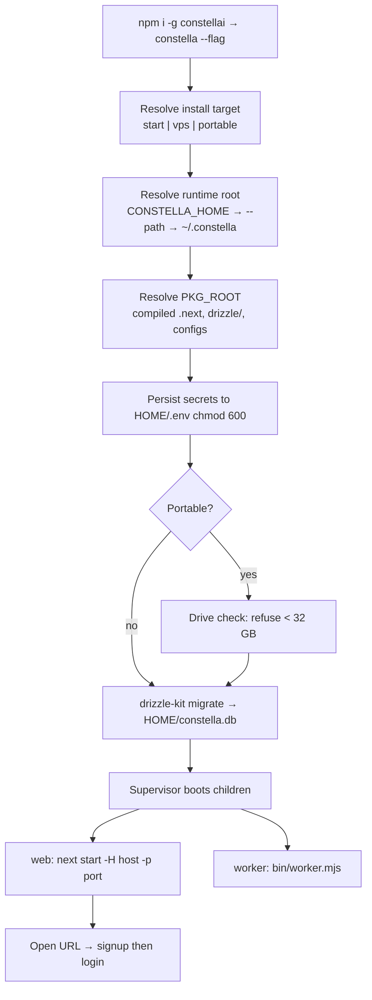

[← Docs index](./README.md) · [🇧🇷 Português](../pt/INSTALLATION.md) · [✦ Constella](../../README.md)

# 🚀 Installation — boarding the central ship


Constella is a local-first control plane that runs autonomous AI agent-companies. Installing it means lighting up the central ship: the `constella` launcher installs the compiled runtime, applies the database schema, and boots a supervised web server plus a 24/7 worker — all under a single runtime root in your home directory. ✦

This page is the **complete, OS-by-OS install guide** — from the very first command to a running system: prerequisites, install on every major OS, configuring each install target, Tailscale, network, permissions, security, validation and troubleshooting.

> **TL;DR** — `npm install -g constellai`, then `constella --start`. Data lives in `~/.constella`. Node ≥ 20 required. A launch flag is required (a bare `constella` prints usage). Authentication (email + password) is always on. Nothing is faked.

---

## Quick start (any OS)

```bash
npm install -g constellai          # 1. install the CLI globally
constella --start                 # 2. pick an install target (--start | --vps | --portable)
# 3. open the printed URL (default http://127.0.0.1:3000) → first run: sign up, then log in
```

That's the whole loop: **install once with npm, pass a launch flag at run.** The flag is an *install target* — install is the same for all of them, and **authentication (email + password) is identical in every one**. A launch flag is required: a bare `constella` prints usage. Prefer not to install globally? `npx constellai --start` runs the exact same thing once, ephemerally.

---

## Where should you install/run it?

The launch flag picks **where** the control plane lives and which interface it binds — never how you log in. Auth is always email + password.

| Your environment | Install target | Why |
| --- | --- | --- |
| Your own laptop/desktop | **`--start`** | The default local install; binds `127.0.0.1`, full agent autonomy. |
| A remote server, always-on, reached privately | **`--vps`** | Native npm + Tailscale + systemd; binds `0.0.0.0`, reachable only on your tailnet. |
| Carry the whole thing on a USB drive | **`--portable`** | Runs off the drive; binds `0.0.0.0`; needs ≥ 32 GB free. |

Deep-dives: [START_MODE](./START_MODE.md) · [VPS_MODE](./VPS_MODE.md) · [PORTABLE_MODE](./PORTABLE_MODE.md). First-run wizard: [ONBOARDING](./ONBOARDING.md).

---

## Prerequisites 🛰️

| Requirement | Detail | Notes |
| --- | --- | --- |
| **Node.js ≥ 20** | `package.json` declares `"engines": { "node": ">=20" }`. | Install steps per OS below. Check with `node -v`. |
| **A native build toolchain** | `better-sqlite3` and `sharp` install prebuilt binaries on common platforms; on an uncommon arch/version npm compiles them, which needs Python 3 + a C/C++ compiler. | Linux: `build-essential` + `python3`. macOS: Xcode CLT. Windows: usually prebuilt — no toolchain needed. |
| **`git`** | Needed for agents that touch git, and for the VPS clone. | Pre-installed on macOS/most Linux; `winget install Git.Git` on Windows. |
| **`claude` and/or `codex` CLI** *(or a cloud provider)* | Agents are spawned as **real** CLI processes. Without at least one installed + authenticated — **or** a cloud API provider configured in the [Models](./MODELS.md) module — agents can plan but not execute. | Not bundled. Constella calls whatever is on your `PATH` and inherits `~/.claude`. |
| **Disk space** | Holds the DB, workspaces, RAG index, caches and (optionally) local model weights. Portable **refuses < 32 GB free**. | A plain install is small; local models are what grow it. |

> Constella does **not** bundle the agent CLIs. See [AGENTS](./AGENTS.md) and [MODELS](./MODELS.md).

---

## Install per operating system

Every path is the same two steps — **get Node ≥ 20, then `npm install -g constellai`** — only the Node install differs. After installing, jump to [Choose & configure an install target](#choose--configure-an-install-target).

### 🐧 Ubuntu Server (headless — the usual VPS)

```bash
# Node 20 LTS from NodeSource + the build toolchain for native modules
sudo apt-get update
sudo apt-get install -y curl ca-certificates git build-essential python3
curl -fsSL https://deb.nodesource.com/setup_22.x | sudo -E bash -
sudo apt-get install -y nodejs
node -v                               # expect v20+ (v22 here)

sudo npm install -g constellai
```

A headless server almost always runs the **VPS install** (native npm + Tailscale + systemd) — continue at [Tailscale](#tailscale-) then [VPS_MODE](./VPS_MODE.md). To run directly on the host instead, see `--start` below (mind the firewall — `--vps`/`--portable` bind `0.0.0.0`).

### 🖥️ Ubuntu / Debian Desktop

Same as Ubuntu Server. After `constella --start`, open `http://127.0.0.1:3000` in the machine's browser. `sudo` is only needed for the **global** npm install; running `constella` does not need root.

### 🐧 Other Linux distributions

Install Node ≥ 20 with your package manager (or [nvm](https://github.com/nvm-sh/nvm)), then `npm install -g constellai`:

| Distro | Node + toolchain |
| --- | --- |
| **Debian/Ubuntu** | `curl -fsSL https://deb.nodesource.com/setup_22.x \| sudo -E bash - && sudo apt-get install -y nodejs build-essential python3` |
| **Fedora/RHEL** | `sudo dnf install -y nodejs npm gcc-c++ make python3` (Node 20+; or NodeSource) |
| **Arch/Manjaro** | `sudo pacman -S --needed nodejs npm base-devel python` |
| **Any distro (recommended)** | `nvm install 22 && nvm use 22` — no root, per-user Node |

> With **nvm**, drop `sudo` from the npm install: `npm install -g constellai` writes to your user-owned nvm prefix.

### 🍎 macOS

```bash
# Homebrew (https://brew.sh) — installs Node + npm
brew install node            # Node 22+
xcode-select --install       # C/C++ toolchain for native modules (if not already present)
node -v                      # expect v20+

npm install -g constellai
constella --start            # http://127.0.0.1:3000
```

No Homebrew? Use the official Node installer from nodejs.org, or `nvm`. Apple Silicon and Intel both ship prebuilt native binaries.

### 🪟 Windows

```powershell
# Install Node 22 LTS (winget) — or download the installer from nodejs.org
winget install OpenJS.NodeJS.LTS
# (open a NEW terminal so PATH updates), then:
node -v                      # expect v20+
npm install -g constellai
constella --start            # http://127.0.0.1:3000
```

- Native modules ship **prebuilt** for Windows x64 — no Visual Studio toolchain needed for a normal install.
- The CLI works in **PowerShell** and **Command Prompt**. Some shell snippets in these docs are POSIX (`bash`) — run those in **Git Bash** or WSL.
- **Portable mode** on Windows: `constella --portable` auto-detects USB drives, or `constella --portable --path E:\`.
- The launcher uses `npm.cmd` (not a shell) for updates, so a hijacked `npx`/`npm` can't shadow it.

> **WSL2** counts as Linux — follow the Ubuntu steps inside your WSL distro.

---

## Choose & configure an install target

Install is identical; the **launch flag at run** decides where it lives and what it binds — never how you authenticate. Each target auto-configures itself on launch: it persists secrets to `<HOME>/.env`, applies the DB schema, runs onboarding on first boot, and binds the right host. **Authentication is the same everywhere: email + password** (first run with no account → signup, afterwards → login).

| Install target | Launch flag | Bind | What it configures |
| --- | --- | --- | --- |
| **Local** | `constella --start` | `127.0.0.1` | The default local install; single operator, full agent autonomy. |
| **VPS** | one automated command (see callout) | `0.0.0.0` | Native host install over Tailscale + systemd — a script does everything. |
| **USB** | `constella --portable [--path <drive>]` | `0.0.0.0` | Runs off a USB drive (≥ 32 GB). See [PORTABLE_MODE](./PORTABLE_MODE.md). |

> A launch flag is required — a bare `constella` prints usage. There is no passwordless/auto-login path.

> 🛰️ **VPS is a native install — no Docker.** On a Linux host, **one managed command** installs Node ≥ 20 + the `constellai` CLI, joins Tailscale (`tailscale up`), and registers a systemd service `constella.service` that runs `constella --vps --host 0.0.0.0 --port 3000` (starts on boot, `Restart=always`):
>
> ```bash
> curl -fsSL https://raw.githubusercontent.com/gabriel7silva/constella/main/scripts/install.sh | bash -s -- --vps
> ```
>
> Equivalent direct script: `bash scripts/vps-install.sh`. For a quick, unmanaged try (foreground, no systemd) run `npx constellai --vps` on a Linux host — it auto-installs and joins Tailscale and serves. Reach it on your tailnet at `http://<tailnet-ip>:3000` where the IP is `tailscale ip -4`; login is enforced in VPS mode. Full walkthrough: [VPS_MODE](./VPS_MODE.md).

Common modifiers (`--start` / `--portable`): `--onboarding` (re-run the wizard), `--path <dir>` (custom runtime root), `--host <h>`, `--port <p>`.

**Expected first-boot state** (any target): the console prints `• Secrets ready …`, `Constella runtime root : …`, `Mode : <mode> · host:port`, then starts `next start` + the worker. Open the printed URL → first run with no account lands on the signup screen, then [ONBOARDING](./ONBOARDING.md); every later run hits `/login` first.

---

## Tailscale 🔐

Tailscale gives you a private network (a *tailnet*) so a server bound to `0.0.0.0` is reachable **only** from your own authorized devices — never the public internet. It's the security boundary for VPS mode.

### Install Tailscale

| OS | Install | Join |
| --- | --- | --- |
| **Linux** | `curl -fsSL https://tailscale.com/install.sh \| sh` | `sudo tailscale up` |
| **macOS** | App Store / `brew install tailscale` | `sudo tailscale up` (or the menu-bar app) |
| **Windows** | `winget install Tailscale.Tailscale` | sign in via the tray app |

`sudo tailscale up` prints a browser URL the first time — sign in to join your tailnet. Manage devices, MagicDNS and ACLs at <https://login.tailscale.com>. Find a node's IP with `tailscale ip -4`.

### Tailscale in VPS mode

In VPS mode the **host itself is the tailnet node** — there's no sidecar and no separate auth key. The VPS installer joins Tailscale on the host with `tailscale up`, and the Constella service binds `0.0.0.0` while Tailscale keeps it private:

1. The VPS bootstrap (`scripts/vps-install.sh`) installs Tailscale and runs `tailscale up` (sign in via the printed URL).
2. The systemd service `constella.service` serves on `0.0.0.0:3000`.
3. Reach the dashboard at the **host's** tailnet IP: `tailscale ip -4` → `http://<that-ip>:3000`.

Full walkthrough: [VPS_MODE](./VPS_MODE.md).

---

## Network & ports 🌐

| Install target | Binds | Reachable from |
| --- | --- | --- |
| `--start` (local) | `127.0.0.1:3000` | the local machine only |
| `--vps` / `--portable` | `0.0.0.0:3000` | every interface — gate it (Tailscale / firewall) |

- Change the port: `--port 3100` or set `PORT`. Change the host: `--host <addr>`.
- **`0.0.0.0` is not a security boundary.** In VPS mode Tailscale (running on the host) is what keeps port 3000 private; if you run `--vps`/`--portable` directly on a host with a public IP and no tailnet, firewall port 3000 (e.g. `ufw deny 3000`) or stay behind the tailnet.
- The worker always talks to the web server over **loopback** (`127.0.0.1`) with an `x-worker-secret` header, even when the web binds `0.0.0.0`.

---

## Permissions & data 🔑

| Path | What | Permissions |
| --- | --- | --- |
| `~/.constella/` | Runtime root (override: `CONSTELLA_HOME` / `--path`). | your user |
| `~/.constella/constella.db` | SQLite database. | your user |
| `~/.constella/.env` | Persisted secrets. | `chmod 600` (owner-only), never printed |
| `~/.constella/organizations/<orgId>/workspace/` | Each company's isolated workspace (the FS jail). | your user |
| `~/.constella/cache/` · `~/.constella/backups/` | Model-catalog cache · pre-update backups. | your user |

- **`sudo` is only for the global npm install.** Running `constella` should be done as your normal user — never `sudo constella` (it would put data under root's home and write root-owned files).
- With **nvm** (per-user Node) you don't need `sudo` even for the install.
- In VPS mode data lives in the host user's `~/.constella` (override with `CONSTELLA_HOME`) — no volume. Secrets are in `~/.constella/.env` (`chmod 600`), auto-generated on first boot. Agent CLIs install with `npm i -g` on the host and persist their auth in the host user's home.

---

## Security 🕳️

- **Secrets are generated once** under `<HOME>/.env` (`0o600`) and never printed. Every install target requires a real `BETTER_AUTH_SECRET` (auth is universal); `next start` runs under `NODE_ENV=production`, where better-auth **throws** on its default key — so even local `--start` gets a real one.
- **No bare-name execution** — the launcher resolves `next`/`drizzle-kit` to absolute paths and runs them with `node` (no `shell`, no PATH lookup).
- **Public mode is fail-closed** — a CLI launch is always production (`CONSTELLA_PUBLIC=1`); it refuses to fall back to the unhardened `next dev` unless a developer sets `CONSTELLA_DEV=1`.
- **Worker SSRF guard** — the worker refuses to send its secret to any non-loopback host.

Deeper model: [SECURITY](./SECURITY.md).

---

## Dependencies (native + optional local models) 📦

- **Native modules** `better-sqlite3` + `sharp` ship prebuilt binaries for common Linux/macOS/Windows × x64/arm64. If a prebuild is missing, npm compiles them — install the toolchain (Linux `build-essential python3`, macOS Xcode CLT).
- **Optional local models** — running GGUF models locally pulls a llama.cpp server and (on NVIDIA) CUDA runtime DLLs, auto-installed on first use. This is what makes disk usage grow. Cloud providers + the agent CLIs need none of this. See [MODELS](./MODELS.md).

---

## Validate it works ✅

After boot, confirm a healthy system:

1. **Web is up** — the console shows `Mode : <mode> · host:port` and `Starting: next start …`. Open the URL; the signup (first run) or login screen renders.
2. **Worker is ticking** — the log shows `Constella worker → tick … every 60000ms; telegram poll; watching …`.
3. **Sign up / log in** — first run with no account shows a signup screen (name + email + password) that creates the single operator, then runs [ONBOARDING](./ONBOARDING.md); later runs ask you to log in.
4. **Version check** — `constella update --check` prints current vs latest (proves the install + registry reach).
5. **Agents can execute** (optional) — with `claude`/`codex` authed or a cloud provider set, a plan moves past "planned" into edits.

Quick probes:

```bash
constella update --check                 # installed vs latest on npm
curl -I http://127.0.0.1:3000            # local modes: expect HTTP 200/302
# VPS: systemctl status constella   &&   curl -I http://$(tailscale ip -4):3000
```

Full operational commands (start/stop/restart/logs/status): **[OPERATIONS](./OPERATIONS.md)**.

---

## How it works 🌌 (under the hood)

`constella` is a dependency-light launcher that, in order:

1. **Parses the launch flag** (`--start`/`--vps`/`--portable`; a bare `constella` prints usage and exits).
2. **Resolves the runtime root** (`CONSTELLA_HOME` → `--path` → `~/.constella`; portable with no path prompts for a USB drive) and creates `<HOME>/organizations`.
3. **Resolves the package root** (`PKG_ROOT`) where the compiled `.next`, `drizzle/` migrations and configs ship.
4. **Persists secrets** to `<HOME>/.env` (`chmod 600`).
5. **Validates the drive** in portable mode (refuse < 32 GB).
6. **Applies the schema** via `drizzle-kit migrate` against `<HOME>/constella.db` (idempotent; fatal only on a fresh DB).
7. **Builds on first run only as a fallback** — the published package already ships a prebuilt `.next`, so this is skipped for end users.
8. **Boots two supervised children** — `next start` (web) and `bin/worker.mjs` (worker) — auto-restarting either on an unexpected crash.

### What actually gets installed

A **compiled, minified runtime — never the source**. The npm `files` allowlist ships `.next` (prebuilt), `bin`, `scripts`, `skills`, `docs`, `drizzle` (generated SQL migrations), the `.mjs` configs, README, LICENSE, CHANGELOG. `src/` is intentionally absent; the schema reaches you as SQL under `drizzle/`.

### Main flow



### Launcher flags & subcommands

| Flag / subcommand | Effect |
| --- | --- |
| `--start` | The default local install — binds `127.0.0.1`. (A bare `constella` prints usage.) |
| `--vps` / `--portable` | Native server over Tailscale / USB drive — both bind `0.0.0.0`. |
| `--onboarding` | Re-run the setup wizard (`CONSTELLA_FORCE_ONBOARDING=1`). |
| `--path <dir>` | Explicit runtime root (also points portable at a drive). |
| `--host <h>` / `--port <p>` | Override bind host / port. |
| `update` / `update --check` | Apply / only check a newer published version. |

Full env + flag reference: [CONFIGURATION](./CONFIGURATION.md).

---

## Update · Uninstall

```bash
# Update (global install)
npm install -g constellai@latest        # or: npm update -g constellai  ·  or: constella update
```

To update a **VPS** deployment:

```bash
# Native install (no repo checkout needed) — pull the updater straight from GitHub:
curl -fsSL https://raw.githubusercontent.com/gabriel7silva/constella/main/scripts/vps-update.sh | bash
# pin a specific version:
curl -fsSL https://raw.githubusercontent.com/gabriel7silva/constella/main/scripts/vps-update.sh | bash -s -- 0.2.30

# From a repo checkout instead:
bash scripts/vps-update.sh                 # → latest on npm
bash scripts/vps-update.sh 0.2.30          # → a specific version

# Fully manual (no script at all):
sudo npm install -g constellai@latest && sudo systemctl restart constella
```

> **Updating while it's running is fine — no manual stop needed.** `npm install -g` swaps the package on disk without touching the live process; `systemctl restart constella` then cycles in the new version in a ~2–3s blip. Your `~/.constella` (DB, secrets, login, workspaces) is preserved, and the idempotent drizzle migrations run automatically on the next boot. Roll back any time by pinning the old version (e.g. `bash scripts/vps-update.sh 0.2.27`).

```bash
# Uninstall
npm uninstall -g constellai             # removes the CLI
rm -rf ~/.constella                    # ALSO delete data (DB, secrets, workspaces) — irreversible
# VPS clean/wipe (removes service + CLI + ~/.constella, KEEPS Tailscale):
curl -fsSL https://raw.githubusercontent.com/gabriel7silva/constella/main/scripts/vps-clean.sh | bash
```

Context-aware details + rollback: [UPDATE](./UPDATE.md). Day-to-day operations: [OPERATIONS](./OPERATIONS.md).

---

## From source (developers) 🕳️

```bash
git clone https://github.com/gabriel7silva/constella
cd constella
pnpm install
pnpm dev:all                  # next dev + worker (Telegram poll works in dev)
# or production-shaped:
pnpm build && pnpm start      # next start + worker
```

Running from source surfaces the run-mode picker + Config chips (`CONSTELLA_DEV=1` when `CONSTELLA_PUBLIC` is unset). See [TEST_DEV](./TEST_DEV.md).

---

## Troubleshooting (install)

| Symptom | Cause | Fix |
| --- | --- | --- |
| `Unsupported engine` / syntax errors on boot | Node < 20 | Install Node ≥ 20; `node -v`. |
| `node-gyp` / native build fails on `npm i -g` | No prebuilt binary for your arch + no toolchain | Linux: `sudo apt-get install -y build-essential python3` (or dnf/pacman equivalents). macOS: `xcode-select --install`. |
| `EACCES` / permission denied on global install | npm global dir owned by root | Use **nvm** (per-user Node), or `sudo npm i -g constellai`, or set a user npm prefix. |
| `constella: command not found` after install | npm global bin not on `PATH` | Open a new terminal; check `npm bin -g` is on `PATH` (winget/nvm updates PATH on a new shell). |
| Browser shows 500 on every page | DB schema not applied | Read the migrate error in the console; reinstall if `drizzle-kit` is missing. |
| Agents plan but never edit files | `claude`/`codex` not installed/authed and no cloud provider | Install + log in to an agent CLI, or set a provider in [Models](./MODELS.md). |
| Port already in use | `3000` taken | `--port 3100` or set `PORT`. |
| Data in the wrong folder | Relative `CONSTELLA_HOME` | Use an absolute `CONSTELLA_HOME` or launch via the CLI. |
| Web keeps restarting then "giving up" | OS-level OOM / native crash | Cap concurrent agents; raise `CONSTELLA_WEB_HEAP_MB`. |

More: [TROUBLESHOOTING](./TROUBLESHOOTING.md) · [FAQ](./FAQ.md).

---

## Related links

- [OPERATIONS](./OPERATIONS.md) — start/stop/restart/status/logs/update/uninstall, local + VPS
- [ONBOARDING](./ONBOARDING.md) — the first-run setup wizard
- [CONFIGURATION](./CONFIGURATION.md) — every env var and flag
- [START_MODE](./START_MODE.md) · [VPS_MODE](./VPS_MODE.md) · [PORTABLE_MODE](./PORTABLE_MODE.md)
- [ARCHITECTURE](./ARCHITECTURE.md) — runtime root, dual process, sync engine
- [UPDATE](./UPDATE.md) — context-aware updates & rollback · [SECURITY](./SECURITY.md)
- [TROUBLESHOOTING](./TROUBLESHOOTING.md) · [FAQ](./FAQ.md)
