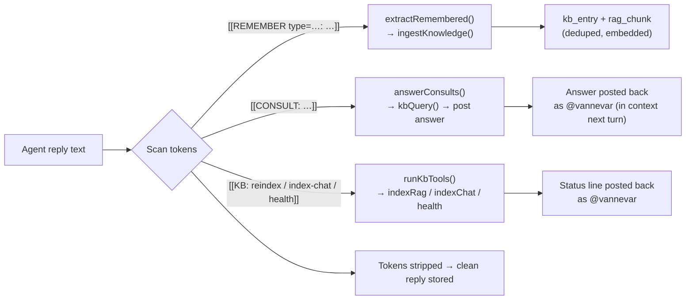
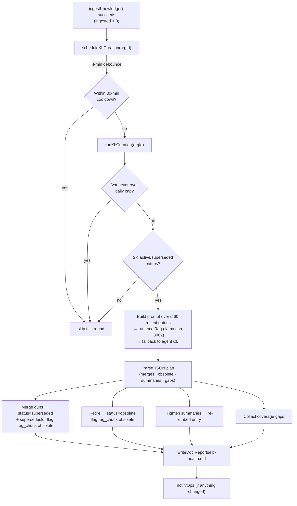
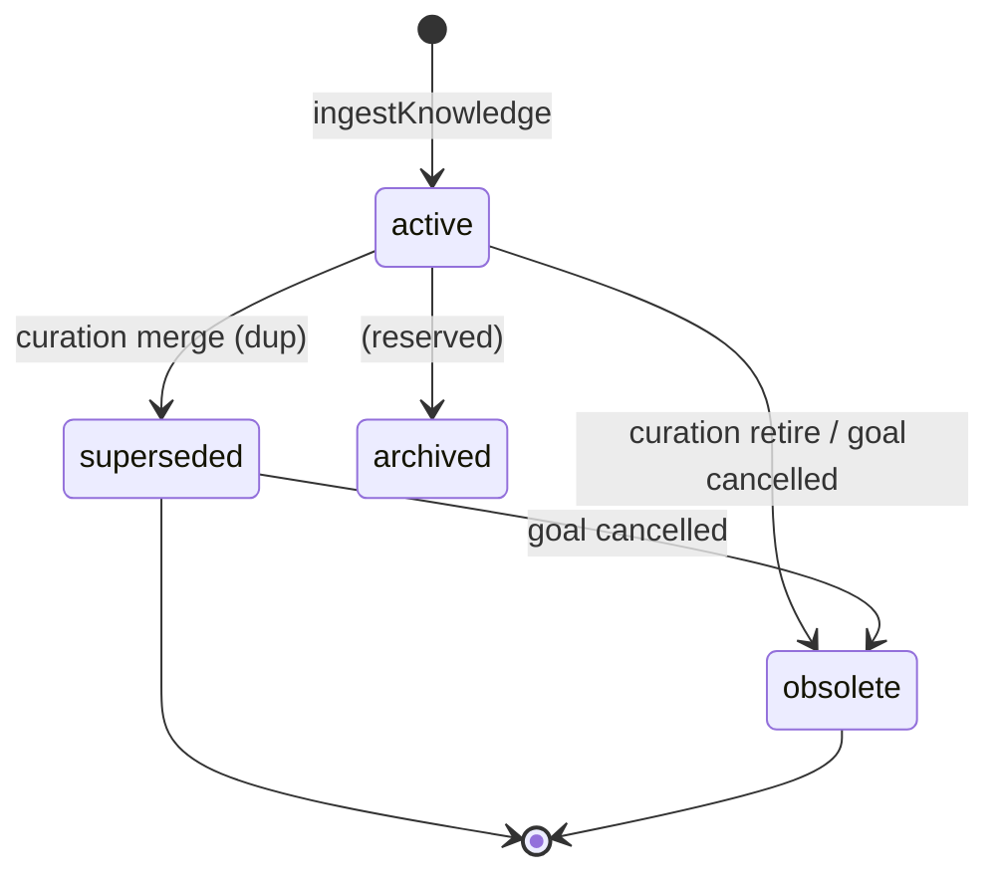

[← Docs index](./README.md) · [🇧🇷 Português](../pt/KB_AGENT.md) · [✦ Constella](../../README.md)

# KB Agent — Vannevar 🌌🛰️


Vannevar is the Knowledge agent: the keeper of Constella's single source of truth. Every reusable thing the constellation learns flows through this star — classified, deduped, kept current, and served back with references. Vannevar owns the **curated, classified, state-aware layer** that sits on top of the raw RAG memory nebula.

> Source of truth: `src/server/kb.ts` (engine) and `src/data/kb-prompt.ts` (Vannevar's persona prompt + taxonomy). The raw embedding/index layer is documented in [KB_RAG.md](./KB_RAG.md).

## When to use 🪐

- You want to understand **how knowledge is captured** as agents work (the `[[REMEMBER]]` / `[[CONSULT]]` / `[[KB:]]` tokens).
- You need to know **what `/curate` does** and where it writes its health report (`Reports/kb-health.md`).
- You want to know **how knowledge is retired** (superseded / obsolete) and why a cancelled goal stops surfacing.
- You are wiring **`proposeSkillsFromLearnings`** (P3 learning → skills) or debugging why curation is not running.
- You want the **KB taxonomy** (`kb_entry.type`) and the lifecycle state machine.

## How it works 🌠

Constella's KB is a **hybrid** of two halves:

| Half | Path | Cost | What it does |
|---|---|---|---|
| **Deterministic capture** | `ingestKnowledge()` | No LLM (hot path) | Classify by caller-provided type, dedup by content hash, update-in-place on the same source slot, upsert a `kb_entry`, (re)embed its `rag_chunk`(s). |
| **LLM curation** | `runKbCuration()` (Vannevar) | Paid/local LLM (off the hot path) | Merge near-duplicates, retire contradicted entries, tighten summaries, surface coverage gaps → `Reports/kb-health.md`. |

The deterministic path **always works**; curation is a best-effort refinement that runs behind a debounce + cooldown + daily-cap gate. Everything is fire-and-forget — KB capture must **never** break a task run.

Vannevar's persona (`src/data/kb-prompt.ts`):

- **Identity** (`KB_IDENTITY`): *"Keeper of the company's single source of truth. Every reusable thing the team learns flows through me…"*
- **Ritual** (`KB_RITUAL`): *"Ingest new knowledge, retire what's superseded or obsolete, keep summaries tight, surface gaps, and answer any teammate's question with the most recent, active, referenced truth — or say plainly when we don't know yet."*
- **System prompt** (`KB_AGENT_PROMPT`): the full operating manual, seeded into `agent.persona.systemPrompt` at boot by `seedKbAgent()` and mirrored to disk as `.claude/kb/TAXONOMY.md` (so it is itself RAG-indexed).

Vannevar's roster facts (from `src/data/scaffold.ts`): handle `vannevar`, role **Knowledge**, reports to `ada`, model `haiku`, daily cap **$10 USD**, tier **light**. See [AGENTS.md](./AGENTS.md).

## Main flow — the three agent tokens 🛰️

Agents drive the KB **inline** by emitting double-square-bracket tokens in their replies. The system parses them out, runs the action, and strips the token before the message is stored/shown. This happens in both **task runs** (`src/server/runner.ts`) and **chat replies** (`src/server/collab.ts`).



### `[[REMEMBER type=<t>: <fact>]]` — the producer

`extractRemembered()` pulls every `[[REMEMBER …]]` token out of a reply and turns each into a typed `KbItem` to ingest.

- Regex: `/\[\[REMEMBER(?:\s+type=([a-z-]+))?\s*:?\s*([\s\S]*?)\]\]/gi`.
- The `type=` is validated against `KB_LEARN_TYPES` (`decision`, `architecture`, `business-rule`, `integration`, `dependency`, `bug`, `fix`, `test`, `review`, `vuln`, `ui-pattern`, `stack`, `env-config`, `command`, `note`). An unknown type falls back to `note`.
- The fact must be **≥ 8 chars** or it is dropped. The title is the first line (≤ 80 chars); the summary is the first 1200 chars.
- In a task run the context carries `goalId` / `issueId` / `taskId` (`sourceKind: "task"`, `sourceRef: "<taskId>:learn"`); in chat it carries the message id (`sourceKind: "chat"`).
- The captured items are sent **fire-and-forget** to `ingestKnowledge()`; the tokens are stripped from the shown reply.

### `[[CONSULT: <question>]]` — the consumer

`answerConsults()` resolves a before-action question against the **state-aware** KB so the answer is in context on the agent's next turn. It is the complement to `[[REMEMBER]]`.

- Regex: `/\[\[CONSULT:\s*([\s\S]*?)\]\]/gi`. Queries shorter than 4 chars are skipped.
- Each question is run through `kbQuery(orgId, q, { agentHandle, k: 6 })`; the answer is the curated context (or `"(no relevant knowledge in the KB yet)"`).
- In chat, each answer is **posted back into the thread as `@vannevar`** (`🔎 KB consult — "…"`), so the asking agent reads it next turn.

### `[[KB: reindex|index-chat|health]]` — maintenance tools

`runKbTools()` lets any agent trigger explicit KB maintenance mid-run.

| Verb | Action | Result line |
|---|---|---|
| `reindex` | `indexRag(orgId)` | `reindex → N chunk(s) (semantic)` |
| `index-chat` (or `indexchat`) | `indexChat(orgId)` | `index-chat → N chunk(s)` |
| `health` | `llamaServerStatus()` | `embed health → up (model) \| down` |

Unknown/failed verbs are silently skipped. In chat the results are posted back as `@vannevar` (`🛠️ KB tools — …`).

## Curation loop 🕳️

`runKbCuration()` is the LLM half of hybrid ingestion. It runs **behind a debounce + cooldown + cap gate** and is best-effort.



What each step does:

1. **Gate.** Resolve Vannevar (`handle === "vannevar"`, else first role matching `/knowledge/i`). Bail if missing or over `dailyCapUsd` (`overCap()`).
2. **Sample.** Select the 60 most recently updated entries with `status in (active, superseded)`. Fewer than **4** → not worth a paid run, bail. Compact each to `{ id, type, title, summary (≤300), ref, goalId, status }`.
3. **Reason.** Build a prompt from `KB_AGENT_PROMPT` + the JSON entries, asking for a strict JSON object. Run on the **local model first** (`runLocalRag` → llama.cpp chat server at `LLAMACPP_URL`, default `http://127.0.0.1:8082`), falling back to Vannevar's CLI (`runAgent`) only if the local server is down. Cost is booked to `cost_entry` when non-zero.
4. **Apply** (guarded to ids actually present in the batch):
   - **merges** → each dropped id becomes `status="superseded"`, `supersedesId=<keep>`, its `rag_chunk`s flagged `obsolete=1`.
   - **obsolete** → `status="obsolete"`, `rag_chunk`s flagged `obsolete=1`.
   - **summaries** → tighten `kb_entry.summary` (≤ 1200) and **re-embed** the entry; only applied to `active` entries.
   - **gaps** → collected (max 30) as plain strings.
5. **Report.** Write `Reports/kb-health.md` via `writeDoc` (write-through to disk + RAG-indexed, so it shows in `/reports`), then `notifyOps` if anything changed.

`runKbCuration()` returns `{ ok, merged, retired, summarized, gaps }`.

### The KB health report

`Reports/kb-health.md` (written by `writeDoc`) looks like:

```markdown
# KB health

_Curated by @vannevar · 42 active · 7 retired entr(y/ies)_

This pass: merged 3, retired 1, re-summarised 5.

## Coverage gaps
- Module "billing/" has produced files but no captured knowledge yet
- …
```

### Triggers

| Trigger | Path | Notes |
|---|---|---|
| Automatic | `scheduleKbCuration(orgId)` after a successful `ingestKnowledge` | 4-min debounce coalesces a burst of ingests; 30-min cooldown per workspace; opt out with `CONSTELLA_KB_CURATION=0`. |
| Operator command | `/curate` (`src/server/commands.ts`) | Runs `runKbCuration` synchronously; Vannevar reports the result in the channel. |
| UI action | `curateKb()` (`src/server/actions/kb-actions.ts`) | Same engine call from the Knowledge module. |

## P3 — learning → skills 🚀

`proposeSkillsFromLearnings()` is Vannevar reading the team's **validated, recurring** knowledge and distilling it into **0–3 new reusable skills**.

- Reads `active` entries whose `type` is in `REUSABLE` (`doc`, `research`, `ui-pattern`, `stack`, `integration`, `fix`, `decision`, `architecture`, `business-rule`), keeping only entries with `confidence >= 60` (`strong`). Needs **≥ 4** strong entries or it bails.
- Dedups against existing `skill.name`s; builds a prompt asking for a JSON array of `{ name, role, trigger, summary, instructions }`.
- Each accepted proposal lands as a **provisional** skill: `native=false`, `provisional=true`, `indexed="pending"`, `proposedRole=<role>` — **not linked to any agent** until the operator approves it in `/skills` (`approveProvisional` links it by role). A `.claude/skills/<name>.md` file is written to disk.
- Notifies the operator (`notifyOps`, kind `review`) when anything was proposed.
- Triggered by the operator via the Skills page (`suggestSkillsFromLearnings` in `src/server/skills.ts`). Returns `{ ok, proposed }`.

See [SKILLS.md](./SKILLS.md) for the skills lifecycle and `approveProvisional`.

## Key concepts ✦

- **State-aware retrieval.** `kbQuery()` only returns `rag_chunk`s with `obsolete=0`, which excludes superseded/obsolete entries and the knowledge of cancelled/archived goals. It returns a `sufficient` flag (an explicit *"insufficient knowledge"* signal) and logs every consultation to `kb_query_log`.
- **Content-policy gate.** `ingestKnowledge` runs `scrubSecrets()` over each item; if scrubbing changes the text a secret was present, and the item is **refused** (never indexed). See [SECURITY.md](./SECURITY.md).
- **State cascade.** `markKbObsoleteForGoal(wsId, goalId)` retires a goal's knowledge when the goal is cancelled/archived (marks `kb_entry` obsolete + flags `rag_chunk` `obsolete=1`).
- **Multi-hop graph.** `relatedKnowledge()` walks the `goalId/specId/issueId` link columns + the `supersedes` chain (default 2 hops) from a seed work item, returning connected knowledge grouped by type. Decisions are themselves `kb_entry` rows, so this links decisions ↔ specs ↔ issues ↔ prior fixes/reviews/patterns.
- **Curated answers.** `kbAnswer()` is the clean *"Ask the KB"* path (home chat + `/kb`). Meta/status questions (`KB_META_RE`) get a deterministic overview card from real numbers; content questions get a short model-written answer via `summarizeWithKbAgent()` (local model first, never a raw context dump) plus a tidy Sources line.

## Tables 🪐

| Table | Key columns | Role |
|---|---|---|
| `kb_entry` | `type`, `title`, `summary`, `body`, `status`, `goal_id`, `spec_id`, `issue_id`, `task_id`, `module`, `paths`, `agent_handle`, `source_kind`, `source_ref`, `supersedes_id`, `hash`, `confidence` | The curated, classified, lifecycle-tracked knowledge unit. |
| `rag_chunk` | `path`, `chunk`, `vector`, `kb_entry_id`, `obsolete` | The embedded retrieval chunks. KB entries emit chunks at `path = kb/<type>/<id>`. |
| `kb_query_log` | `agent_handle`, `query`, `hits`, `mode`, `refs`, `answered_at` | Every consultation (who asked, how it was answered). |
| `synced_block` | `slug`, `kind`, `title`, `body`, `version` | Central canonical blocks (e.g. `mission`, `official-stack`, `business-rules`). See [SYNCED_BLOCKS.md](./SYNCED_BLOCKS.md). |
| `block_proposal` | `slug`, `kind`, `body`, `by_agent_handle`, `status` | Proposal queue for synced blocks. |

All KB tables are created idempotently at boot by `ensureKbTables()` (migration-free DDL, safe every boot).

### `kb_entry.type` taxonomy (~24 types)

| Type | Meaning |
|---|---|
| `decision` | Technical/architectural decisions + rationale |
| `spec` / `issue` / `goal` / `plan` | Work artifacts and their intent |
| `architecture` | System structure, boundaries, data flow |
| `business-rule` | Product/domain rules constraining implementation |
| `code-change` | What a task produced (files + summary) |
| `dependency` / `integration` | Libraries, services, external systems |
| `bug` / `fix` | Defects found + corrections applied |
| `test` / `review` | Test verdicts + code-review outcomes |
| `vuln` | Security findings and risks |
| `doc` | Documentation written/updated |
| `user-context` | What the operator wants; constraints, preferences |
| `history` | Milestones and project history |
| `command` | Useful executed commands / runbook steps |
| `file-structure` | Where things live in the workspace |
| `ui-pattern` | UI/UX conventions to keep consistent |
| `stack` | The official technology stack |
| `env-config` | Environment and configuration facts |
| `note` | Catch-all |

## Possible states 🌠

`kb_entry.status` is a four-state lifecycle:

| State | Set by | Surfaces in retrieval? |
|---|---|---|
| `active` | `ingestKnowledge` (capture) | ✅ yes |
| `superseded` | curation merge (`supersedesId` → the canonical keep) | ❌ no (`obsolete=1`) |
| `obsolete` | curation retire, or `markKbObsoleteForGoal` on a cancelled/archived goal, or contradicted by newer truth | ❌ no (`obsolete=1`) |
| `archived` | reserved (counted in `kbOverview.lifecycle`) | ❌ no |



## Step-by-step — capture to recall

1. An agent finishes a task and emits `[[REMEMBER type=fix: bumped chokidar to v4, watcher debounce moved to 400ms]]` in its reply.
2. The runner calls `extractRemembered()` → one `KbItem{ type: "fix", title: "bumped chokidar to v4…" }` with `goalId/issueId/taskId` filled in.
3. `ingestKnowledge()` hashes the content, finds no duplicate, inserts a `kb_entry`, and embeds its `rag_chunk` at `kb/fix/<id>`. The `[[REMEMBER]]` token is stripped from the stored reply.
4. Because something was ingested, `scheduleKbCuration(orgId)` arms a 4-minute debounce. After it fires (and the cooldown has elapsed and Vannevar is under cap), `runKbCuration` merges, retires, tightens and writes `Reports/kb-health.md`.
5. Later, another agent emits `[[CONSULT: how is the file watcher configured?]]`. `answerConsults()` runs `kbQuery()`, which returns the (still active) fix entry; Vannevar posts the answer back into the thread, so the asking agent reads it next turn.

## Examples

Ask the KB from chat or via a slash command:

```text
/kb how is the file watcher configured?
/curate
/reindex
```

Operator-driven skill proposal (Skills page → `suggestSkillsFromLearnings`):

```text
# returns { ok: true, proposed: 2 } → two provisional skills queued for /skills approval
```

Opt out of automatic curation (e.g. on a tiny budget):

```bash
CONSTELLA_KB_CURATION=0
```

Point the local RAG/curation model at a non-default llama.cpp chat server:

```bash
LLAMACPP_URL=http://127.0.0.1:8082
```

## Related integrations 🛰️

- **RAG layer** — embeddings, `chunksOf`, the embed server. See [KB_RAG.md](./KB_RAG.md).
- **Memory & context** — how recall feeds an agent's prompt. See [MEMORY_RAG.md](./MEMORY_RAG.md).
- **Synced blocks** — the canonical central blocks the KB card checks for. See [SYNCED_BLOCKS.md](./SYNCED_BLOCKS.md).
- **Skills** — provisional skills proposed from learnings. See [SKILLS.md](./SKILLS.md).
- **Team Room / DM** — where `[[CONSULT]]` answers are posted. See [TEAM_ROOM.md](./TEAM_ROOM.md), [DM.md](./DM.md).
- **Slash commands** — `/kb`, `/curate`, `/reindex`. See [CHAT_COMMANDS.md](./CHAT_COMMANDS.md).
- **Models** — local model for free RAG generation. See [MODELS.md](./MODELS.md).

## Security 🕳️

- **Secret refusal at ingest.** `ingestKnowledge` refuses any item whose content changes under `scrubSecrets()` (API keys, tokens, PEM, bearer, DB URLs with creds). The learning is logged-and-dropped, never indexed.
- **Scrub on the way out.** Chat replies (and the `[[CONSULT]]` answers posted as Vannevar) are scrubbed again before being stored/shown (`collab.ts`).
- **State-aware by default.** Cancelled/archived/superseded/obsolete knowledge cannot surface through `kbQuery` — agents never act on retired truth.
- **Budget gate.** Both `runKbCuration` and `proposeSkillsFromLearnings` bail when Vannevar is over its `dailyCapUsd`, so curation can never blow the budget.

See [SECURITY.md](./SECURITY.md).

## Troubleshooting

| Symptom | Likely cause | Fix |
|---|---|---|
| `/curate` says *"Nothing to curate right now"* | Fewer than 4 active/superseded entries, or Vannevar over cap | Let agents complete more work; check Vannevar's daily cap. |
| Curation never runs automatically | `CONSTELLA_KB_CURATION=0`, within the 30-min cooldown, or no ingests | Unset the opt-out; wait out the cooldown. |
| `[[REMEMBER]]` not captured | Fact under 8 chars, or text carried a secret shape (refused) | Write a longer, secret-free fact. |
| `[[CONSULT]]` answer is *"(no relevant knowledge…)"* | KB empty or query under 4 chars | Run `/reindex`; ask a longer question. |
| KB answers feel stale | Superseded/obsolete chunks still flagged active, or index never rebuilt | Run `/reindex`; run `/curate`; check `Reports/kb-health.md`. |
| No KB health report | Curation never produced changes, or `writeDoc` disk error | Check disk perms; run `/curate` after a few ingests. |
| Proposed skills = 0 | Fewer than 4 strong (`confidence ≥ 60`) reusable entries | Accumulate more validated learnings first. |

See [TROUBLESHOOTING.md](./TROUBLESHOOTING.md).

## Related links

- [KB_RAG.md](./KB_RAG.md) — the raw RAG/index layer beneath the KB.
- [MEMORY_RAG.md](./MEMORY_RAG.md) — memory & context assembly.
- [SYNCED_BLOCKS.md](./SYNCED_BLOCKS.md) — canonical central blocks.
- [SKILLS.md](./SKILLS.md) — skills + provisional approval.
- [AGENTS.md](./AGENTS.md) — the roster (Vannevar's role/model/cap).
- [CHAT_COMMANDS.md](./CHAT_COMMANDS.md) — `/kb`, `/curate`, `/reindex`.
- [TEAM_ROOM.md](./TEAM_ROOM.md) · [DM.md](./DM.md) — where consult answers land.
- [MODELS.md](./MODELS.md) — local model for free RAG generation.
- [SECURITY.md](./SECURITY.md) · [TROUBLESHOOTING.md](./TROUBLESHOOTING.md)
