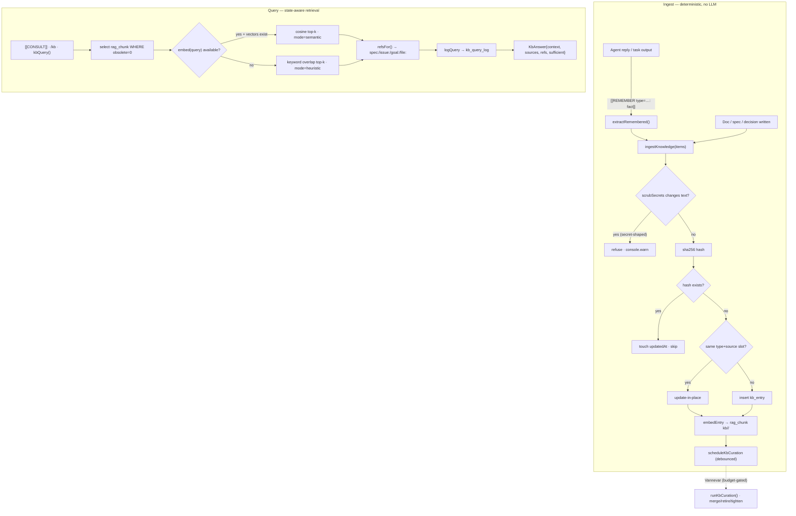
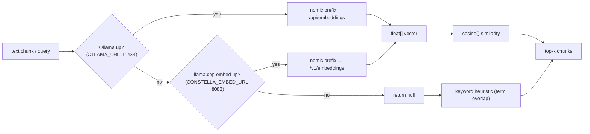

[← Docs index](./README.md) · [🇧🇷 Português](../pt/KB_RAG.md) · [✦ Constella](../../README.md)

# Knowledge Base & RAG ✦ The Memory Nebula 🌌


> The control plane's long-term memory. Every decision, fix, pattern and finding agents accumulate condenses into a curated, classified, state-aware nebula — and gravity (semantic retrieval) pulls the right knowledge back into context when it's needed.

Constella runs **two cooperating layers** over the same store:

- **RAG** (`src/server/rag.ts`) — raw retrieval over workspace Markdown + chat transcripts. Embeddings when a local model is up; keyword heuristic otherwise.
- **KB** (`src/server/kb.ts`) — the curated layer the Knowledge agent (**Vannevar**) owns: typed entries, content-hash dedup, lifecycle (active → superseded → obsolete → archived), state-aware retrieval, a multi-hop knowledge graph, and budget-gated LLM curation.

Both write into one physical table — `rag_chunk` — and KB entries simply emit their own chunks (path `kb/<type>/<id>`) so a single retrieval pass spans docs, chat **and** curated knowledge.

---

## 1. When to use 🪐

| You want to… | Layer / entry point |
|---|---|
| Let agents recall what was decided/built without re-reading every file | RAG `retrieve()` + KB `kbQuery()` |
| Capture a reusable learning deterministically (no LLM) | `ingestKnowledge()` |
| Have an agent self-record a fact mid-run | `[[REMEMBER type=<t>: <fact>]]` token |
| Have an agent ask the KB before acting | `[[CONSULT: <question>]]` token |
| Trigger reindex / chat re-index / embed health from a run | `[[KB: reindex|index-chat|health]]` token |
| Ask the KB a clean, curated question (chat / `/kb`) | `kbAnswer()` |
| Walk related knowledge from a goal/spec/issue | `relatedKnowledge()` |
| Dedupe, retire and tighten the KB | `runKbCuration()` (Vannevar) |
| Distill recurring learnings into new skills (P3) | `proposeSkillsFromLearnings()` |

See also [KB_AGENT.md](./KB_AGENT.md) (Vannevar's persona & ritual), [MEMORY_RAG.md](./MEMORY_RAG.md), [SYNCED_BLOCKS.md](./SYNCED_BLOCKS.md) (canonical blocks), and [MODELS.md](./MODELS.md) (the local embed/chat servers).

---

## 2. How it works 🛰️

### RAG store (`rag.ts`)

- **Indexed dirs** (`RAG_DIRS`): `.claude`, `DOCS`, `PO`, `Reports`, `specs`, `issues`. Plus the attached `mock/` prototype (text files: `.md .html .css .js/jsx .ts/tsx .txt .json`).
- **Excluded plumbing**: `.claude/kb/` (the KB agent's own prompt/taxonomy) and `.claude/skills/` are never indexed — a question would otherwise retrieve Constella's internals.
- **Chunking** (`chunksOf`): split on H1–H3 headers (`/\n(?=#{1,3}\s)/`); each part ≤ **1200 chars** (longer parts hard-split); **max 40 chunks** per document.
- **Embeddings** (`embed`): two backends, tried in order —
  1. **Ollama** (`OLLAMA_URL`, default `http://127.0.0.1:11434`) with model `CONSTELLA_EMBED_MODEL` (default `nomic-embed-text`).
  2. **Dedicated llama.cpp embed server** (`CONSTELLA_EMBED_URL`, default `http://127.0.0.1:8083`), OpenAI-compatible `/v1/embeddings`.
  - Returns `null` if both are down → the caller falls back to keyword search.
- **Asymmetric nomic prefixes**: nomic-embed-text was trained with task prefixes and *requires* them. Documents are embedded as `search_document: …`, queries as `search_query: …`. Both index and query sides must use the same model + matching prefix or cosine similarity is meaningless.
- **Chat transcripts** (`indexChat`): the team room, DMs and Telegram are grouped per channel, the **last 400 lines** of each are embedded under path `chat/<channel>`, so agents recall what was *said*, not just what's in the docs.

### The local embed server (`local-models.ts`)

`ensureEmbedServer()` brings up a **separate** llama.cpp instance serving the local nomic GGUF with `--embeddings` on **:8083** (distinct from the chat server on **:8082**). It runs on boot and after an embedding model is downloaded, so retrieval is semantic with no manual setup:

```bash
llama-server -m <nomic.gguf> --embeddings --host 127.0.0.1 --port 8083 -c 2048 --pooling mean [<gpu-offload args>]
```

`embedServerUp()` checks `GET <EMBED_URL>/health`; `llamaServerStatus()` checks the chat server's `/v1/models`.

### KB layer (`kb.ts`)

A `kb_entry` is **one unit of reusable knowledge** — a decision, code-change, finding, spec, fix, pattern… It is:
- **classified** by `type` + work/file refs,
- **deduped** by a SHA-256 content hash,
- **lifecycle-tracked** (`active → superseded → obsolete → archived`),
- and **emits its own `rag_chunk(s)`** under path `kb/<type>/<id>` for semantic retrieval.

All KB capture is **best-effort and fire-and-forget**: a bad item never aborts a batch, and KB work must never break a task run.

---

## 3. Main flow 🌠



---

## 4. Key concepts 🕳️

- **Deterministic capture, LLM curation** — the *hot path* (`ingestKnowledge`) never calls a model; the *cold path* (`runKbCuration`) does, off the critical path, budget-gated. The KB keeps working even if curation never runs.
- **Update-in-place vs insert** — an item with the same `(type, sourceKind, sourceRef)` slot is treated as an *update* of that knowledge (rewrites the row); a different slot inserts a new entry. Identical content (same hash) just touches `updatedAt`.
- **State-aware retrieval** — `kbQuery` only selects `rag_chunk WHERE obsolete = 0`. Superseded/obsolete entries and the chunks of cancelled/archived goals are flagged `obsolete = 1`, so stale knowledge stops surfacing automatically.
- **Insufficiency signal** — `KbAnswer.sufficient` is honest: when nothing relevant is found, the answer says so rather than inventing.
- **Knowledge graph** — `relatedKnowledge` walks the `goalId/specId/issueId` link columns + the `supersedesId` chain up to `hops` (default 2), grouping connected, *active* knowledge by type. Decisions are themselves `kb_entry` rows (`type="decision"`), so this naturally links decisions ↔ specs ↔ issues ↔ prior fixes.
- **Secrets never enter the KB** — before ingest, `scrubSecrets(blob)` runs; if the text changes (a secret shape was present), the item is **refused**. See [SECURITY.md](./SECURITY.md).
- **Local-first generation** — KB *answers* and *curation* prefer the local llama.cpp chat server (`LLAMACPP_URL`, default `:8082`); only if it's down does it fall back to the agent's (possibly paid) CLI. `<think>…</think>` blocks from reasoning GGUFs are stripped.

---

## 5. The knowledge taxonomy 🌌

`KbType` — the full set (from `kb.ts`). `note` is the catch-all.

| type | What it captures |
|---|---|
| `decision` | An architectural/product decision and its rationale |
| `spec` | A specification unit |
| `issue` | An issue/work item finding |
| `goal` | Goal-level knowledge |
| `plan` | Planning knowledge |
| `architecture` | System/structure knowledge |
| `business-rule` | A domain/business rule |
| `code-change` | A meaningful code change |
| `dependency` | A dependency / library fact |
| `integration` | An external integration detail |
| `bug` | A bug observed |
| `fix` | A fix applied |
| `test` | Test knowledge / coverage |
| `review` | A review finding |
| `vuln` | A security vulnerability |
| `doc` | Documentation knowledge |
| `user-context` | Operator/user context |
| `history` | Historical context |
| `command` | A useful command |
| `file-structure` | File/layout knowledge |
| `ui-pattern` | A reusable UI pattern |
| `stack` | Project-stack fact |
| `env-config` | Environment/config fact |
| `note` | Catch-all (default) |

**Agent self-capture** (`[[REMEMBER type=…]]`) accepts a narrower set — `KB_LEARN_TYPES` — and anything outside it falls back to `note`:
`decision, architecture, business-rule, integration, dependency, bug, fix, test, review, vuln, ui-pattern, stack, env-config, command, note`.

---

## 6. Agent tokens 🚀

Agents read/write the KB inline by emitting double-square-bracket tokens. The runner parses them out and strips them from the visible reply.

| Token | Direction | Handler | Effect |
|---|---|---|---|
| `[[REMEMBER type=<t>: <fact>]]` | producer | `extractRemembered()` | Becomes a typed `KbItem` (fact ≥ 8 chars), ingested via `ingestKnowledge` |
| `[[CONSULT: <question>]]` | consumer | `answerConsults()` | Runs `kbQuery` (k=6), posts the answer back into the thread so it's in context next turn (question ≥ 4 chars) |
| `[[KB: reindex]]` | maintenance | `runKbTools()` | `indexRag(orgId)` → reports chunk count |
| `[[KB: index-chat]]` | maintenance | `runKbTools()` | `indexChat(orgId)` → re-embeds conversations |
| `[[KB: health]]` | maintenance | `runKbTools()` | `llamaServerStatus()` → embed server up/down |

All three are **best-effort**: an unknown verb, a failed query or a too-short fact is silently skipped.

---

## 7. Tables 🪐

### `rag_chunk` — the physical store (RAG + KB share it)

| column | type | notes |
|---|---|---|
| `id` | text PK | |
| `workspace_id` | text → `workspace` | cascade delete |
| `path` | text | source path (`DOCS/…`, `chat/<channel>`, `kb/<type>/<id>`) |
| `chunk` | text | the chunk text |
| `vector` | text (JSON float[]) | `null` when not embedded (keyword fallback) |
| `kb_entry_id` | text | set when the chunk came from a `kb_entry` |
| `obsolete` | int(bool) | `1` → dropped by state-aware retrieval |
| `updated_at` | timestamp | |

### `kb_entry` — the curated knowledge unit

| column | type | notes |
|---|---|---|
| `id` | text PK | |
| `workspace_id` | text → `workspace` | cascade delete |
| `type` | text | one of `KbType` (default `note`) |
| `title` | text | ≤ 200 chars |
| `summary` | text | technical summary (Vannevar curates), ≤ 1200 chars |
| `body` | text | ≤ 8000 chars |
| `status` | text | `active \| superseded \| obsolete \| archived` |
| `goal_id` / `spec_id` / `issue_id` / `task_id` | text | nullable work refs |
| `module` | text | ≤ 120 chars |
| `paths` | JSON string[] | files this knowledge concerns (≤ 40) |
| `agent_handle` | text | who produced it |
| `source_kind` | text | `task \| goal \| review \| test \| decision \| spec \| issue \| note \| chat` |
| `source_ref` | text | origin id/key (jump-back); dedup slot key with `type`+`source_kind` |
| `supersedes_id` | text | the entry this one replaces |
| `hash` | text | SHA-256 content hash → dedup / update-in-place |
| `confidence` | int | 0..100 (default 70) |
| `created_at` / `updated_at` | timestamp | |

### `kb_query_log` — every consultation

| column | type | notes |
|---|---|---|
| `id` | text PK | |
| `workspace_id` | text → `workspace` | |
| `agent_handle` | text | who asked (`operator` for `/kb`) |
| `query` | text | ≤ 500 chars |
| `hits` | int | number of source paths returned |
| `mode` | text | `semantic \| heuristic \| none` |
| `refs` | JSON string[] | `kind:ref` jump-backs |
| `answered_at` | timestamp | indexed for the recent-recall view |

---

## 8. Embedding & retrieval diagram 🛰️



---

## 9. Step-by-step 🌠

### Capture a learning (deterministic)
1. A doc is written **or** an agent emits `[[REMEMBER type=decision: We chose SQLite WAL for the index]]`.
2. `extractRemembered` turns the token into a `KbItem`.
3. `ingestKnowledge` runs `scrubSecrets` (refuses secret-shaped content), hashes the content, and either touches a duplicate, updates the same slot, or inserts a new `kb_entry`.
4. `embedEntry` drops the old chunks for that path and re-embeds `# <title>\n<summary|body>` (≤ 6000 chars) into `rag_chunk` (path `kb/<type>/<id>`).
5. `scheduleKbCuration` arms a debounced curation pass.

### Consult before acting
1. An agent emits `[[CONSULT: how do we store secrets?]]`.
2. `answerConsults` calls `kbQuery(orgId, q, { k: 6 })`.
3. `kbQuery` selects active (`obsolete=0`) chunks, ranks by cosine (semantic) or term overlap (heuristic), builds internal refs, logs to `kb_query_log`.
4. The answer (context + sources + an explicit insufficiency flag) is posted back so it's in the agent's next-turn context.

### Curate (Vannevar)
1. After enough ingests (≥ 4 entries), the debounced (4 min) + cooldown'd (30 min) trigger fires `runKbCuration`.
2. Vannevar reviews ~60 recent active/superseded entries, returns JSON: `merges`, `obsolete`, `summaries`, `gaps`.
3. Merges → drops marked `superseded` (+ `supersedesId`); obsolete → `obsolete`; summaries rewritten + re-embedded; their chunks flagged `obsolete=1`.
4. A `Reports/kb-health.md` report is written (RAG-indexed) and the operator is notified.

---

## 10. Examples 🪐

**Ask the KB from chat or `/kb`:**

```text
/kb how do we authenticate the worker process?
```

`kbAnswer` routes meta/status questions ("how is the KB?", "coverage", "gaps") to a deterministic **overview card**; content questions retrieve then get a short Vannevar-written answer with a tidy Sources line — it never dumps raw chunks.

**Self-capture + consult in one agent run:**

```text
[[CONSULT: what DB does this project use?]]
… work …
[[REMEMBER type=stack: Project uses Drizzle ORM over better-sqlite3]]
[[KB: reindex]]
```

**Cancel a goal → its knowledge retires automatically** (`markKbObsoleteForGoal`): the goal's `kb_entry` rows flip to `obsolete` and their `rag_chunk`s to `obsolete=1`, so retrieval stops surfacing them.

---

## 11. Possible states 🕳️

**`kb_entry.status`**

| state | meaning |
|---|---|
| `active` | current, retrievable |
| `superseded` | merged into a canonical entry (`supersedesId` set); not retrieved |
| `obsolete` | contradicted / retired (also: goal cancelled/archived); not retrieved |
| `archived` | parked (counted separately in the lifecycle view) |

**`kbQuery` / `retrieve` mode**

| mode | meaning |
|---|---|
| `semantic` | cosine over real vectors (embed backend up) |
| `heuristic` | keyword term-overlap fallback (no embeddings) |
| `none` | index empty / nothing matched |

**`KbReply.mode`** (from `kbAnswer`): `overview` (the structured KB card), `answer` (model-written), `none` (insufficient knowledge).

---

## 12. Related integrations 🛰️

- **Sync engine** — the watcher calls `scheduleRagReindex` / `indexRagFile` / `deindexRagFile` (debounced 2.5 s) so RAG tracks file changes; disk is truth. See [ARCHITECTURE.md](./ARCHITECTURE.md).
- **Chat** — every posted message arms `scheduleChatReindex` (debounced 6 s) → `indexChat`. See [TEAM_ROOM.md](./TEAM_ROOM.md), [DM.md](./DM.md), [TELEGRAM.md](./TELEGRAM.md).
- **Local models** — `ensureEmbedServer` (:8083) + `ensureLlamaServer` (:8082); GPU offload when it fits. See [MODELS.md](./MODELS.md).
- **Skills (P3)** — `proposeSkillsFromLearnings` distills strong recurring knowledge into **provisional** skills for operator approval. See [SKILLS.md](./SKILLS.md).
- **Synced blocks** — canonical named knowledge (`mission`, `official-stack`, `business-rules`) the overview card nudges you to create. See [SYNCED_BLOCKS.md](./SYNCED_BLOCKS.md).
- **Commands** — `/kb` (`/ask-kb`), `/reindex`, `/curate`, `/search`, `/graph`. See [CHAT_COMMANDS.md](./CHAT_COMMANDS.md).

---

## 13. Security 🕳️

- **Secret gate on ingest** — `scrubSecrets(blob) !== blob` ⇒ the item is refused and a `console.warn` is logged. No API key, token, PEM, bearer or credentialed DB URL ever lands in the KB.
- **Org isolation** — every query/index is scoped by `workspace_id` (resolved from `orgId`); only the active org's chunks are ever read or returned.
- **Internal plumbing hidden** — `.claude/kb/` and `.claude/skills/` are excluded from indexing so a question can't surface Constella's own prompts/skills.
- **Budget-gated LLM** — curation and skill-proposal runs check the agent's `dailyCapUsd` (`overCap`) before spending, and cost is booked to `cost_entry`.
- **Opt-outs** — `CONSTELLA_KB_CURATION=0` disables the automatic curation pass entirely.

---

## 14. Troubleshooting 🚀

| Symptom | Likely cause | Fix |
|---|---|---|
| Retrieval is `heuristic`, never `semantic` | No embed backend up | Start Ollama with `nomic-embed-text`, or download a nomic GGUF so `ensureEmbedServer` brings up :8083. Check with `[[KB: health]]`. |
| `/kb` says "not enough in the Knowledge Base" | Empty/cold index | Run `/reindex` (or `[[KB: reindex]]`); knowledge also fills in as agents complete work. |
| New docs not retrieved | File outside `RAG_DIRS`, or watcher not running | Put docs under `.claude/DOCS/PO/Reports/specs/issues`; ensure the worker process is up. |
| Old/cancelled knowledge still surfacing | Chunks not flagged | Cancelling/archiving a goal calls `markKbObsoleteForGoal`; a manual `/curate` also retires contradicted entries. |
| Curation never runs | Cooldown / cap / opt-out | Needs ≥ 4 entries, respects 30-min cooldown + the agent's daily cap; check `CONSTELLA_KB_CURATION`. |
| Embeddings look wrong (poor matches) | Mismatched nomic prefixes or a non-nomic model | Keep `CONSTELLA_EMBED_MODEL` nomic, or ensure both index+query use the same model/prefix scheme. |

---

## 15. Related links 🌌

- [KB_AGENT.md](./KB_AGENT.md) — Vannevar, the Knowledge agent
- [MEMORY_RAG.md](./MEMORY_RAG.md) — how memory feeds back into context
- [SYNCED_BLOCKS.md](./SYNCED_BLOCKS.md) — canonical knowledge blocks
- [SKILLS.md](./SKILLS.md) — learning → skills (P3)
- [MODELS.md](./MODELS.md) — local embed (:8083) & chat (:8082) servers
- [CHAT_COMMANDS.md](./CHAT_COMMANDS.md) — `/kb`, `/reindex`, `/curate`, `/graph`
- [ARCHITECTURE.md](./ARCHITECTURE.md) · [AI_ARCHITECTURE.md](./AI_ARCHITECTURE.md) — where KB/RAG sits in the ship
- [SECURITY.md](./SECURITY.md) — scrub, isolation, vault
