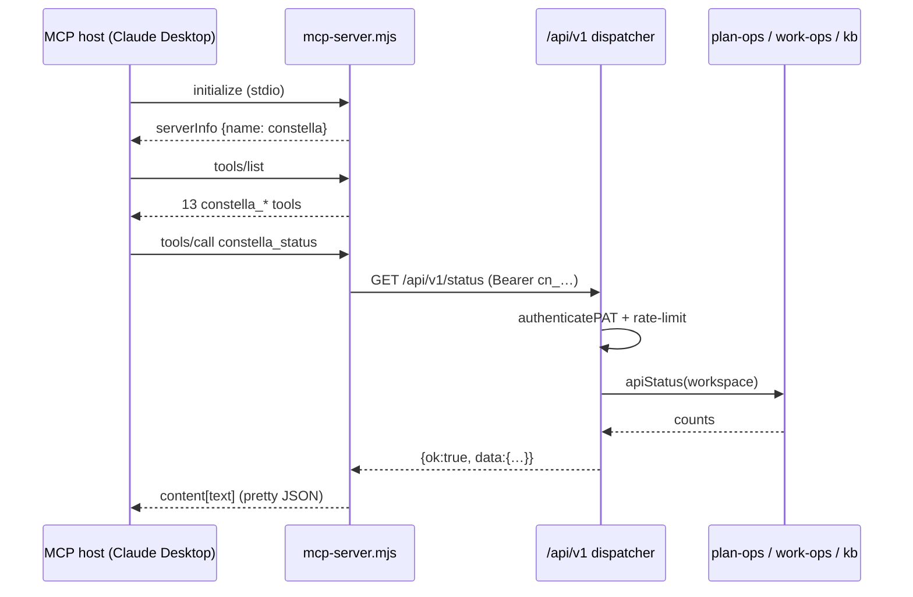
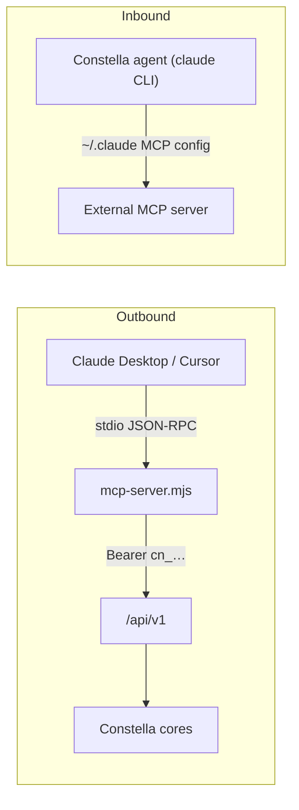

[← Docs index](./README.md) · [🇧🇷 Português](../pt/MCP.md) · [✦ Constella](../../README.md)

# 🛰️ MCP Server — Driving the Central Ship from Orbit


A self-contained **Model Context Protocol** server (`scripts/mcp-server.mjs`) that exposes Constella's public REST API as MCP tools, so an external AI host — Claude Desktop, Cursor, or any MCP client — can pilot your Constella control plane through natural language.

---

## When to use

Reach for the MCP server when you want an **outside AI** to observe and steer Constella without opening the web UI:

- Ask Claude Desktop "what's the status of my agent-company?" and have it call `constella_status`.
- Approve a pending plan, flip 24/7 execution, or start new work from inside Cursor's chat.
- Wire Constella into any agentic host that speaks MCP, using a scoped Personal Access Token as the only credential.

This is the **outbound-to-Constella** direction: an AI host *drives* Constella. It is the mirror image of Constella's own constellation of agents *consuming* external MCP servers — see [Two MCP directions](#-two-mcp-directions-dont-confuse-them) below.

---

## How it works 🌌

The MCP server is a thin, dependency-free bridge. It speaks **JSON-RPC over stdio** to the MCP host, and each tool call is translated into a single HTTPS-style request against the Public REST API v1 (`/api/v1/...`), authenticated with a Personal Access Token (PAT).

```
MCP host (Claude Desktop / Cursor)
        │  JSON-RPC over stdio
        ▼
scripts/mcp-server.mjs  ──Bearer cn_…──►  /api/v1/[[...path]]  ──►  Constella cores
```

Key properties straight from the source:

- **Zero dependencies.** `scripts/mcp-server.mjs` imports only `node:readline` and uses the global `fetch` (Node 18+). It ships in the package unchanged.
- **Hand-rolled MCP.** It implements the JSON-RPC methods `initialize`, `notifications/initialized`, `ping`, `tools/list` and `tools/call` directly — no SDK.
- **Thin mapping.** Every tool's `build(args)` returns `{ method, path, body? }`, which `callApi` sends to `${BASE}/api/v1${path}` with `Authorization: Bearer ${PAT}` (and `x-constella-org` when `CONSTELLA_ORG` is set).
- **One credential.** The REST layer (`authenticatePAT` in `src/server/api/pat-auth.ts`) is PAT-only; there is no session. Scope (`read` / `write`) is enforced server-side.
- **Request timeout.** Each REST call uses `AbortSignal.timeout(30_000)` — a 30-second ceiling per tool call.

---

## Main flow 🚀



The lifecycle, step by step:

1. **Handshake.** The host sends `initialize`; the server replies with `protocolVersion` (echoing the host's, default `2024-11-05`), `capabilities: { tools: {} }`, and `serverInfo: { name: "constella", version: "1.0.0" }`.
2. **Discovery.** On `tools/list`, the server returns all tools (`name`, `description`, `inputSchema`).
3. **Invocation.** On `tools/call`, it looks up the tool by name, calls `build(arguments)`, fires the REST request via `callApi`, and wraps the JSON response as `{ content: [{ type: "text", text }], isError: data?.ok === false }`.
4. **Auth & scope.** The REST dispatcher authenticates the PAT, applies a sliding-window rate limit (120 req/min/token), and rejects write routes when the token has `read` scope.

---

## Key concepts ✦

| Concept | Where | Meaning |
|---|---|---|
| **Outbound MCP** | `scripts/mcp-server.mjs` | An external AI host drives Constella through PAT-authenticated REST. |
| **PAT** | `personalAccessToken` table | `cn_…` token, SHA-256 hashed, scope `read` or `write`, plaintext shown once. |
| **Scope gate** | `route.ts` `needWrite()` | `write` tokens may mutate; `read` tokens get `403` on POST mutations. |
| **Org selection** | `CONSTELLA_ORG` → `x-constella-org` | Picks which org a multi-org user acts on (membership-validated). |
| **Rate limit** | `route.ts` `rateLimited()` | In-memory sliding 60s window, max 120 requests per token. |
| **Envelope** | `route.ts` `ok()` / `fail()` | Every response is `{ ok: true, data }` or `{ ok: false, error }`. |

---

## Environment variables 🪐

The MCP server is configured purely through env vars passed by the host:

| Variable | Default | Required | Purpose |
|---|---|---|---|
| `CONSTELLA_PAT` | — | **Yes** | The `cn_…` Personal Access Token. Use a **write** token to allow approve/execution/new-work; a **read** token for read-only. If unset, every tool returns `{ ok: false, error: "CONSTELLA_PAT is not set" }`. |
| `CONSTELLA_BASE_URL` | `http://localhost:3000` | No | Base URL of the running Constella server. Trailing slashes are stripped. |
| `CONSTELLA_ORG` | — | No | An `orgId` for multi-org users; sent as the `X-Constella-Org` header. |

> 🕳️ The token is **never logged** by either side. `pat-auth.ts` validates the bearer against the stored `tokenHash` and resolves the org/workspace through a membership join, so a token can't be pointed at a foreign tenant.

---

## Tool catalog — every `constella_*` mapped to its REST route 🌠

All 13 tools are defined in the `TOOLS` array of `scripts/mcp-server.mjs`. Each maps 1:1 onto a v1 route.

| MCP tool | Scope | REST | Inputs | What it does |
|---|---|---|---|---|
| `constella_status` | read | `GET /status` | — | Counts of goals, issues, tasks and the plan state. |
| `constella_review` | read | `GET /review` | — | Readable text summary of plan, issues, tasks and next steps. |
| `constella_goals` | read | `GET /goals` | — | List goals. |
| `constella_issues` | read | `GET /issues` | — | List issues. |
| `constella_tasks` | read | `GET /tasks` | — | List tasks. |
| `constella_specs` | read | `GET /specs` | — | List specs. |
| `constella_kb` | read | `POST /kb` | `q` (required) | Ask the Knowledge Base a question. |
| `constella_approve_plan` | **write** | `POST /plan/approve` | — | Approve the pending plan and queue tasks. |
| `constella_reject_plan` | **write** | `POST /plan/reject` | `reason` (optional) | Send the plan back to the CEO for revision. |
| `constella_set_execution` | **write** | `POST /execution` | `on` (required, bool) | Turn 24/7 autonomous execution on or off. |
| `constella_new_work` | **write** | `POST /work` | `brief` (required), `title` (optional) | Start a new unit of work — the CEO drafts specs/issues for approval. |
| `constella_cancel_goal` | **write** | `POST /goals/{id}/cancel` | `id` (required) | Cancel a goal by id. |
| `constella_archive_goal` | **write** | `POST /goals/{id}/archive` | `id` (required) | Archive a goal by id. |

### Server-side handlers

Each route lands in the `dispatch()` switch of `src/app/api/v1/[[...path]]/route.ts`, which reuses the same session-less cores the Telegram remote control uses:

| REST route | Handler |
|---|---|
| `GET /status` | `apiStatus(ws)` |
| `GET /review` | `reviewSummaryFor(ws)` |
| `GET /goals` `/issues` `/tasks` `/specs` | `apiGoals` / `apiIssues` / `apiTasks` / `apiSpecs` |
| `POST /kb`, `GET /kb?q=` | `kbAnswer(org.id, q)` |
| `POST /plan/approve` | `approvePlanFor(org.id, ws)` |
| `POST /plan/reject` | `requestPlanChangesFor(ws.id, reason)` |
| `POST /execution` | `setAuto247For(ws.id, on)` |
| `POST /work` | `startNewWorkFor(org.id, ws, { brief, title })` |
| `POST /goals/{id}/cancel` | `cancelGoalFor(ws.id, id)` |
| `POST /goals/{id}/archive` | `archiveGoalFor(org.id, ws.id, id)` |

> Note: the host-side tool list does **not** include a `me` tool, but the REST API does expose `GET /api/v1` (or `/me`) returning the token's user, org, workspace and scope. Hosts can reach it through the [Public API](./PUBLIC_API.md) directly.

---

## Step-by-step: configuring an MCP host

### 1. Mint a Personal Access Token

In the Constella web UI: **Profile → Personal access tokens → New token**. Choose a scope:

- **read** — for status/review/list/KB tools only.
- **write** — to also allow approve, reject, execution, new-work, cancel and archive.

The plaintext `cn_…` value is shown **once** (`createPAT` returns it; only the SHA-256 hash is persisted). Copy it immediately.

### 2. Make sure Constella is running

The MCP server talks to a live server at `CONSTELLA_BASE_URL` (default `http://localhost:3000`). Start Constella normally (`constella` / `npm start`).

### 3. Register the server in your host

**Claude Desktop** — edit `claude_desktop_config.json`:

```json
{
  "mcpServers": {
    "constella": {
      "command": "node",
      "args": ["/path/to/constella/scripts/mcp-server.mjs"],
      "env": {
        "CONSTELLA_PAT": "cn_your_write_token_here",
        "CONSTELLA_BASE_URL": "http://localhost:3000"
      }
    }
  }
}
```

**Cursor** — add the same block under `mcpServers` in Cursor's MCP settings (`.cursor/mcp.json` or the global MCP config). For a multi-org user, add `"CONSTELLA_ORG": "<orgId>"` to `env`.

### 4. Use it

Restart the host, open a chat, and ask in plain language — the host will discover the 13 `constella_*` tools via `tools/list` and call them as needed:

> "Use Constella to show me the current status, then approve the pending plan."

---

## Examples 🌌

### Smoke-test the server by hand

You can drive the stdio protocol directly to confirm it's wired up:

```bash
CONSTELLA_PAT=cn_xxx CONSTELLA_BASE_URL=http://localhost:3000 \
  node scripts/mcp-server.mjs <<'EOF'
{"jsonrpc":"2.0","id":1,"method":"initialize","params":{"protocolVersion":"2024-11-05"}}
{"jsonrpc":"2.0","id":2,"method":"tools/list"}
{"jsonrpc":"2.0","id":3,"method":"tools/call","params":{"name":"constella_status","arguments":{}}}
EOF
```

Each line is newline-delimited JSON-RPC; the server replies one JSON object per line.

### A `tools/call` request and response

Request from the host:

```json
{"jsonrpc":"2.0","id":7,"method":"tools/call",
 "params":{"name":"constella_new_work",
           "arguments":{"brief":"Add a dark-mode toggle to settings","title":"Dark mode"}}}
```

Server reply (the REST envelope is pretty-printed into a text content block):

```json
{"jsonrpc":"2.0","id":7,"result":{
  "content":[{"type":"text","text":"{\n  \"ok\": true,\n  \"data\": { ... }\n}"}],
  "isError":false}}
```

If the PAT had `read` scope, the REST layer returns `403` and the content's `ok` is `false`, so `isError` becomes `true`.

---

## Possible states 🕳️

| Situation | Where it surfaces | Result |
|---|---|---|
| `CONSTELLA_PAT` unset | `callApi` | `{ ok: false, error: "CONSTELLA_PAT is not set" }` (no network call). |
| Malformed / missing bearer | `authenticatePAT` | HTTP `401` `"missing or malformed bearer token"`. |
| Unknown token hash | `authenticatePAT` | HTTP `401` `"invalid token"`. |
| No org / archived org | `authenticatePAT` | HTTP `404` / `409`. |
| Read token hits a write route | `needWrite()` | HTTP `403` `"this token has read scope; a write-scope token is required"`. |
| Over 120 req/min | `rateLimited()` | HTTP `429` `"rate limit exceeded (120 req/min)"`. |
| Unknown tool name | `tools/call` | JSON-RPC error `-32602` `unknown tool: …`. |
| Unknown JSON-RPC method | `handle()` | JSON-RPC error `-32601` `method not found: …`. |
| Handler throws | `rl.on("line")` | JSON-RPC error `-32603` (internal). |
| Non-JSON stdin line | `rl.on("line")` | Silently ignored. |
| REST returns non-JSON | `callApi` | `{ ok: false, error: "non-JSON response (http <status>)" }`. |

---

## 🪐 Two MCP directions — don't confuse them

Constella touches MCP in **two opposite directions**:

| Direction | Who drives whom | Mechanism |
|---|---|---|
| **Outbound (this doc)** | An external AI host drives **Constella** | `scripts/mcp-server.mjs` → Public REST API v1, PAT-authenticated. |
| **Inbound (agents consume external MCPs)** | **Constella's agents** drive external MCP servers | Configured through the `claude` CLI's `~/.claude` config; **not** through Constella's `plugin` table. |



The inbound direction is operator-level configuration of the `claude` CLI and is unrelated to Constella's [Plugins](./PLUGINS.md) registry. See [Agents](./AGENTS.md) and [AI Architecture](./AI_ARCHITECTURE.md) for how agents run.

---

## Related integrations

- **[Public API](./PUBLIC_API.md)** — the REST v1 surface the MCP server wraps; same PATs and scopes.
- **[Telegram](./TELEGRAM.md)** — another remote-control surface reusing the same session-less cores (`plan-ops.ts` / `work-ops.ts`).
- **[Plugins](./PLUGINS.md)** — Constella's native plugin registry (GitHub, Telegram, Vault, Web Search); distinct from external MCP consumption.
- **[KB & RAG](./KB_RAG.md)** — what `constella_kb` queries under the hood.

---

## Security 🔒

- **PAT-only, hashed at rest.** Only the SHA-256 `tokenHash` is stored (`personalAccessToken` table). The plaintext `cn_…` appears once at creation and is never logged on either side.
- **Membership-secure org resolution.** `getActiveOrg(userId, orgHeader)` validates the requested org through a membership join — a token cannot be aimed at another tenant.
- **Scope enforcement.** Mutations require `write`; the `read` scope is locked to GET-style tools plus KB queries.
- **Rate limiting.** 120 requests/min/token (sliding 60s window), resetting on server restart.
- **Loopback by default.** With `CONSTELLA_BASE_URL` defaulting to `http://localhost:3000`, the MCP server reaches Constella on the loopback interface unless you deliberately point it elsewhere.
- **Bounded calls.** Each REST request is capped at 30 seconds (`AbortSignal.timeout(30_000)`).
- **Least privilege.** Prefer a **read** token for monitoring hosts; reserve **write** tokens for hosts you truly trust to approve plans and start work.

---

## Troubleshooting 🛠️

| Symptom | Likely cause | Fix |
|---|---|---|
| Every tool returns `"CONSTELLA_PAT is not set"` | Env var missing in the host's `env` block | Add `CONSTELLA_PAT` to the MCP server entry and restart the host. |
| `401 invalid token` | Token revoked, mistyped, or from another instance | Mint a fresh PAT; confirm `CONSTELLA_BASE_URL` points at the same instance. |
| `403 … write-scope token is required` | Using a read token for approve/execution/new-work | Create a **write**-scope token. |
| `429 rate limit exceeded` | More than 120 calls/min on one token | Slow down or use a second token. |
| Connection refused / non-JSON response | Constella not running or wrong base URL | Start Constella; verify `CONSTELLA_BASE_URL`. |
| Host shows no Constella tools | Server failed to launch | Check the host's MCP logs; verify the `node` command and absolute path to `scripts/mcp-server.mjs`. |
| `409 organization is archived` | The token's org was archived | Use a token whose org is active, or set a valid `CONSTELLA_ORG`. |

---

## Related links

- [Public API](./PUBLIC_API.md)
- [Telegram](./TELEGRAM.md)
- [Plugins](./PLUGINS.md)
- [Agents](./AGENTS.md)
- [AI Architecture](./AI_ARCHITECTURE.md)
- [KB & RAG](./KB_RAG.md)
- [Security](./SECURITY.md)
- [Architecture](./ARCHITECTURE.md)
