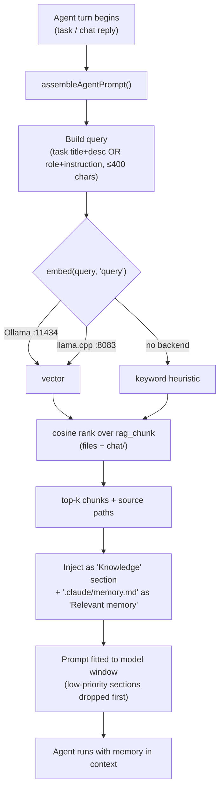
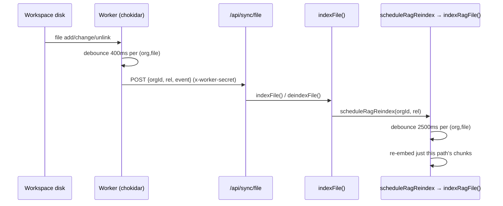

[← Docs index](./README.md) · [🇧🇷 Português](../pt/MEMORY_RAG.md) · [✦ Constella](../../README.md)

# Memory RAG — the workspace memory nebula 🌌


Pure, org-scoped retrieval over the workspace Markdown **and** the chat transcripts. This is the gravity that pulls relevant context into a constellation's working memory just before it acts — semantic when a local embedding star is lit, keyword heuristic when it is not.

---

## When to use

- You want to understand how an agent "remembers" prior conversations and documents before a turn.
- You are debugging why retrieval returned nothing, or returned stale text.
- You are wiring `[[REMEMBER …]]` / `[[CONSULT: …]]` / `[[KB: …]]` agent tokens.
- You need to know which directories are indexed, the debounce timings, and how the file-watcher keeps memory current.

For the **curated, state-aware** layer (typed entries, obsolescence, the knowledge graph) see [KB_RAG](./KB_RAG.md) and [KB_AGENT](./KB_AGENT.md). For where retrieval is injected into a prompt, see [AI_ARCHITECTURE](./AI_ARCHITECTURE.md).

---

## How it works 🪐

Memory RAG lives in `src/server/rag.ts`. It is **pure retrieval**: it embeds and stores chunks, then ranks them by cosine similarity for a query. There is no state model, no obsolescence flag, no answer-writing — that is the job of the curated KB (`src/server/kb.ts`).

Two corpora are indexed into one table, `rag_chunk`:

1. **Workspace Markdown** — files under the indexed directories (`.claude`, `DOCS`, `PO`, `Reports`, `specs`, `issues`, plus `mock/`), keyed by their real relative `path`.
2. **Chat transcripts** — team-room, DM and Telegram conversations, stored under synthetic paths `chat/<channel>`.

Each row holds the `chunk` text and, when an embedding backend is reachable, its `vector` (a JSON-encoded float array). If no backend is up, the chunk is stored **without** a vector and retrieval falls back to a keyword heuristic — nothing is lost, and a lazy reindex upgrades the chunks once embeddings come online.

### Embedding backends

`embed(text, kind)` tries two backends in order, then gives up:

| Order | Backend | URL (env) | Notes |
|-------|---------|-----------|-------|
| 1 | Ollama | `OLLAMA_URL` (default `http://127.0.0.1:11434`) `/api/embeddings`, model `CONSTELLA_EMBED_MODEL` (default `nomic-embed-text`) | Used only if running with the embed model pulled |
| 2 | Dedicated llama.cpp embed server | `CONSTELLA_EMBED_URL` (default `http://127.0.0.1:8083`) `/v1/embeddings`, model `nomic-embed` | Auto-started on boot via `ensureEmbedServer()` in `src/server/local-models.ts` |
| — | none | — | Returns `null` → caller uses keyword fallback |

Both calls have an 8 s timeout (`AbortSignal.timeout(8000)`).

> **Asymmetric prefixes.** `nomic-embed-text` was trained with task-instruction prefixes and **requires** them: documents are embedded as `search_document: …`, queries as `search_query: …`. `embed()` applies the right prefix via the `kind` argument (`"document"` | `"query"`). Mixing them silently degrades retrieval, so both the index side and the query side must use the same model with the matching prefix. The prefix is applied unconditionally on the llama.cpp path (always nomic) and only when `CONSTELLA_EMBED_MODEL` matches `/nomic/i` on the Ollama path.

### Chunking

`chunksOf(md)` splits a document on H1–H3 Markdown headers (`\n(?=#{1,3}\s)`), trims, drops empties, then:

- keeps each part as one chunk if `≤ 1200` chars,
- otherwise hard-slices it into 1200-char windows,
- and caps the document at **40 chunks** (`.slice(0, 40)`).

### Ranking

`cosine(a, b)` is a plain dot-product cosine over the shorter of the two vectors. `retrieve()` ranks all vectorized chunks by cosine to the query vector, takes the top `k` (default 5), and if no vectors exist falls back to keyword scoring (count of query terms longer than 3 chars that appear in the chunk). If even keyword scoring finds nothing, it returns the first up-to-3 chunks so the agent always gets *something*.

---

## Main flow — memory retrieval before a turn 🛰️

Before an agent acts, `assembleAgentPrompt()` (in `src/server/context-manager.ts`) pulls memory in parallel with the channel context. It calls the **state-aware** `kbQuery()` (which shares the same `rag_chunk` table and the same `embed`/`cosine` helpers as pure `retrieve()`), plus reads the static `.claude/memory.md` file. The retrieved knowledge is injected as a labelled, trimmable prompt section.



Pure `retrieve()` returns `{ context, sources, mode }` where `mode` is `"semantic" | "heuristic" | "none"`; the `kbQuery()` variant adds state-awareness and `refs`. Both clip `context` to 4000 chars.

---

## Memory RAG vs curated KB 🕳️

Memory RAG and the curated KB share storage and embeddings but answer different questions. Memory is *what was written and said*; the KB is *what is true now*.

| Aspect | Memory RAG (`rag.ts`) | Curated KB (`kb.ts`) |
|--------|-----------------------|----------------------|
| Function | `retrieve()` | `kbQuery()` / `kbAnswer()` |
| Corpus | Workspace `.md` + `chat/<channel>` transcripts | Same `rag_chunk` table, but linked to typed `kb_entry` rows |
| State awareness | None — returns whatever ranks highest | Drops `obsolete=1` chunks (superseded / obsolete entries, cancelled / archived goals) |
| References | `sources` (file paths) only | `sources` + internal `refs` (spec / issue / goal / file jump-backs) |
| "Insufficient" signal | No | `sufficient` boolean |
| Logging | No | Logs each consult to `kb_query_log` |
| Owner | The watcher + the Knowledge agent (Vannevar) | The Knowledge agent (curation, dedupe, obsolescence) |

Both fall back to the same keyword heuristic and share `embed`, `chunksOf`, `cosine`, `indexRag`, `indexChat`. See [KB_RAG](./KB_RAG.md) for the curated layer.

---

## Agent memory tokens — REMEMBER / CONSULT / KB

Agents drive memory directly from their replies via square-bracket tokens. The runner and the chat reply path parse these out, act on them, and strip the tokens from the visible text (`src/server/kb.ts`).

| Token | Direction | What it does |
|-------|-----------|--------------|
| `[[REMEMBER type=<t>: <fact>]]` | producer | `extractRemembered()` turns each into a typed KB item to ingest. Type must be in `KB_LEARN_TYPES` (decision, architecture, business-rule, integration, dependency, bug, fix, test, review, vuln, ui-pattern, stack, env-config, command, note) else it falls back to `note`. Facts shorter than 8 chars are ignored. |
| `[[CONSULT: <question>]]` | consumer | `answerConsults()` runs each question through `kbQuery()` (k=6) and posts the answer back into the thread so it is in context on the agent's next turn. Questions under 4 chars are skipped. |
| `[[KB: reindex \| index-chat \| health]]` | maintenance | `runKbTools()`: `reindex` → `indexRag()` (rebuild file + chat chunks), `index-chat` → `indexChat()` (re-embed only the conversations), `health` → embed-server status (`up`/`down` + model). |

`[[REMEMBER]]` (producer) and `[[CONSULT]]` (consumer) are the write/read complement: an agent stores a learning, and a later agent retrieves it. The runner also auto-extracts `[[REMEMBER]]` from task results with `sourceKind: "task"`, and chat replies extract with `sourceKind: "chat"` (`src/server/runner.ts`, `src/server/collab.ts`).

---

## Indexed directories & paths 🌠

`inRagDirs(p)` decides what is memory-eligible:

| Path pattern | Indexed? | Notes |
|--------------|----------|-------|
| `.claude/kb/…` | No | The KB agent's own prompt/taxonomy — never surfaced |
| `.claude/skills/…` | No | The skill library — never surfaced |
| `.claude/*.md` and `.claude/<sub>/…` | Yes | Other `.claude` Markdown (e.g. `BRIEF.md`, `memory.md`) |
| `DOCS/`, `PO/`, `Reports/`, `specs/`, `issues/` (`*.md`) | Yes | The `RAG_DIRS` set |
| `mock/…` | Yes | Only text files: `.md .html .css .js(x) .ts(x) .txt .json` |
| `chat/<channel>` | Yes (synthetic) | Written by `indexChat()`, not a real file |
| everything else | No | — |

Chat transcripts are grouped per `channel` (`room`, `dm:<handle>`, `telegram`), each line rendered `Operator:` or `@<handle>:`, and only the **tail of 400 lines** per channel is embedded to keep the index bounded.

---

## Reindex & debounce — keeping memory current

Memory stays fresh automatically; the operator rarely needs the manual **Reindex** action. Three debounced paths feed `rag_chunk`:

| Trigger | Function | Debounce | Scope |
|---------|----------|----------|-------|
| A workspace file changes (agent or external edit) | `scheduleRagReindex(orgId, rel)` → `indexRagFile()` | **2500 ms** per `(org, file)` | Re-embeds just that one path's chunks |
| A message is posted to any channel | `scheduleChatReindex(orgId)` → `indexChat()` | **6000 ms** per org | Re-embeds only the `chat/%` chunks |
| The file-watcher in the worker | POST `/api/sync/file` | **400 ms** per `(org, file)` | Calls `indexFile()`, which itself calls `scheduleRagReindex` |
| Manual / agent | `indexRag()` (full), `[[KB: reindex]]`, `[[KB: index-chat]]` | none | Full or chat-only rebuild |

Note the two-stage debounce on file edits: the worker's chokidar watcher coalesces filesystem events over **400 ms** and POSTs to `/api/sync/file`; the server-side `indexFile()` then schedules a further **2500 ms** RAG re-embed. So a burst of edits to one file results in a single re-embed, not a storm.



When a file is deleted, `deindexFile()` calls `deindexRagFile()` to drop that path's chunks — **disk is the source of truth**, so removed files leave no memory residue. See [SYNCED_BLOCKS](./SYNCED_BLOCKS.md) and [ARCHITECTURE](./ARCHITECTURE.md) for the broader sync engine.

---

## Tables

### `rag_chunk` (the memory store)

| Column | Meaning |
|--------|---------|
| `id` | UUID |
| `workspace_id` | org/workspace scope — **every query is filtered to the active workspace** |
| `path` | real relative file path **or** `chat/<channel>` |
| `chunk` | the chunk text (≤ ~1200 chars) |
| `vector` | JSON-encoded float array, or `NULL` if no embedding backend was up |
| `kb_entry_id` | (KB layer) link to the typed `kb_entry` that produced the chunk, if any |
| `obsolete` | (KB layer) `1` hides the chunk from state-aware `kbQuery()` |

`kb_entry_id` and `obsolete` are added by `ensureKbTables()` for the curated layer; pure `retrieve()` ignores them. Other tables (`kb_entry`, `kb_query_log`, …) belong to [KB_RAG](./KB_RAG.md).

---

## Step-by-step — trace a retrieval

1. An agent turn begins (a task in `runner.ts`, or a chat reply in `collab.ts`).
2. `assembleAgentPrompt()` builds a query (task title + description, or role + instruction) clipped to 400 chars.
3. In parallel: channel context is summarized, and `kbQuery(orgId, query, { k: 6 })` retrieves memory.
4. `kbQuery` selects active chunks for the workspace; on an empty index it builds one once via `indexRag()`, then re-queries.
5. `embed(query, "query")` produces a query vector (Ollama → llama.cpp → null).
6. With a vector and vectorized chunks present, rows are cosine-ranked; otherwise keyword scoring runs.
7. Top-`k` chunks become the `Knowledge` section; `.claude/memory.md` becomes `Relevant memory`.
8. The prompt is fitted to the model's context window; low-priority sections drop first if over budget.
9. The agent runs. If it emits `[[REMEMBER …]]`, that learning is ingested and becomes retrievable next time.

---

## Examples

Agent self-capturing a learning (producer):

```
[[REMEMBER type=decision: Auth uses better-auth sessions (30d); do not roll a custom JWT.]]
```

Agent consulting memory before acting (consumer):

```
[[CONSULT: how is the file-upload size limit configured?]]
```

Agent refreshing the index mid-run (maintenance):

```
[[KB: index-chat]]
[[KB: health]]
```

A bare `retrieve()` call (semantic when the embed server is up):

```ts
const { context, sources, mode } = await retrieve(orgId, "how do agents commit to git?", 5);
// mode === "semantic" | "heuristic" | "none"
```

---

## Possible states

`retrieve()` and `kbQuery()` report a retrieval `mode`:

| `mode` | Meaning |
|--------|---------|
| `semantic` | An embedding backend was reachable and vectorized chunks existed → cosine ranking |
| `heuristic` | No vectors (backend down at index time) → keyword term-overlap ranking |
| `none` | No workspace, or no chunks at all even after a build attempt |

Embed-server health (via `[[KB: health]]` → `llamaServerStatus()`): `up` (with model name) or `down`.

A self-healing detail: when the embed server comes up **after** an index was built without vectors, the first semantic query rebuilds the index **once per process** (`autoReindexed` guard) so chunks gain vectors — no manual reindex needed.

---

## Related integrations

- **[KB_RAG](./KB_RAG.md)** — the curated, state-aware layer over the same `rag_chunk` store.
- **[KB_AGENT](./KB_AGENT.md)** — Vannevar, owner of curation, dedupe and obsolescence.
- **[AI_ARCHITECTURE](./AI_ARCHITECTURE.md)** — how retrieved memory is fitted into the prompt window.
- **[MODELS](./MODELS.md)** — local embedding & chat servers (llama.cpp `:8083` / `:8082`, Ollama).
- **[SYNCED_BLOCKS](./SYNCED_BLOCKS.md)** / **[ARCHITECTURE](./ARCHITECTURE.md)** — the file-watcher and sync engine.
- **[TEAM_ROOM](./TEAM_ROOM.md)** / **[DM](./DM.md)** / **[TELEGRAM](./TELEGRAM.md)** — the conversations that feed `chat/<channel>` chunks.

---

## Security 🔐

- **Strict org isolation.** Every read and every query filters by `workspace_id`; only the active org's chunks are ever embedded or returned. There is no cross-tenant retrieval path.
- **Internals never surfaced.** `inRagDirs()` excludes `.claude/kb/` (KB agent prompt/taxonomy) and `.claude/skills/` so a query cannot leak the system's own internals.
- **Sync endpoint fails closed.** `/api/sync/file` requires `x-worker-secret` (`CONSTELLA_WORKER_SECRET`) and rejects with 401 if the secret is unset — it accepts an arbitrary `orgId`, so leaving it open would allow cross-tenant index tampering.
- **Secrets are scrubbed upstream.** Chat text is scrubbed before it is persisted/ingested (see [SECURITY](./SECURITY.md)); transcripts embedded into `chat/<channel>` inherit that scrubbing.

---

## Troubleshooting

| Symptom | Likely cause | Fix |
|---------|--------------|-----|
| `mode` is always `heuristic` | No embedding backend reachable at index/query time | Check `[[KB: health]]`; ensure the llama.cpp embed server is up on `:8083` (or Ollama on `:11434` with `nomic-embed-text` pulled) — see [MODELS](./MODELS.md) |
| Retrieval returns nothing | Empty index or no workspace | A first query auto-builds via `indexRag()`; if still empty, run a full reindex (`[[KB: reindex]]` or the Reindex action) |
| Stale text keeps coming back | Curated KB obsolescence, not memory | Pure `retrieve()` has no state model; use `kbQuery()`/curation — see [KB_RAG](./KB_RAG.md) |
| Edits not reflected | Watcher not running, or debounce window | The worker must be running (it owns chokidar); changes re-embed after the **2500 ms** RAG debounce |
| Deleted file still retrieved | Deindex didn't fire | Deletion goes through `deindexFile → deindexRagFile`; confirm the worker saw the `unlink` event |
| Chat not recalled | Chat reindex pending or empty channel | `scheduleChatReindex` debounces **6000 ms**; force with `[[KB: index-chat]]` |

---

## Related links

- [KB_RAG](./KB_RAG.md)
- [KB_AGENT](./KB_AGENT.md)
- [AI_ARCHITECTURE](./AI_ARCHITECTURE.md)
- [ARCHITECTURE](./ARCHITECTURE.md)
- [SYNCED_BLOCKS](./SYNCED_BLOCKS.md)
- [MODELS](./MODELS.md)
- [AGENTS](./AGENTS.md)
- [TEAM_ROOM](./TEAM_ROOM.md)
- [TROUBLESHOOTING](./TROUBLESHOOTING.md)
