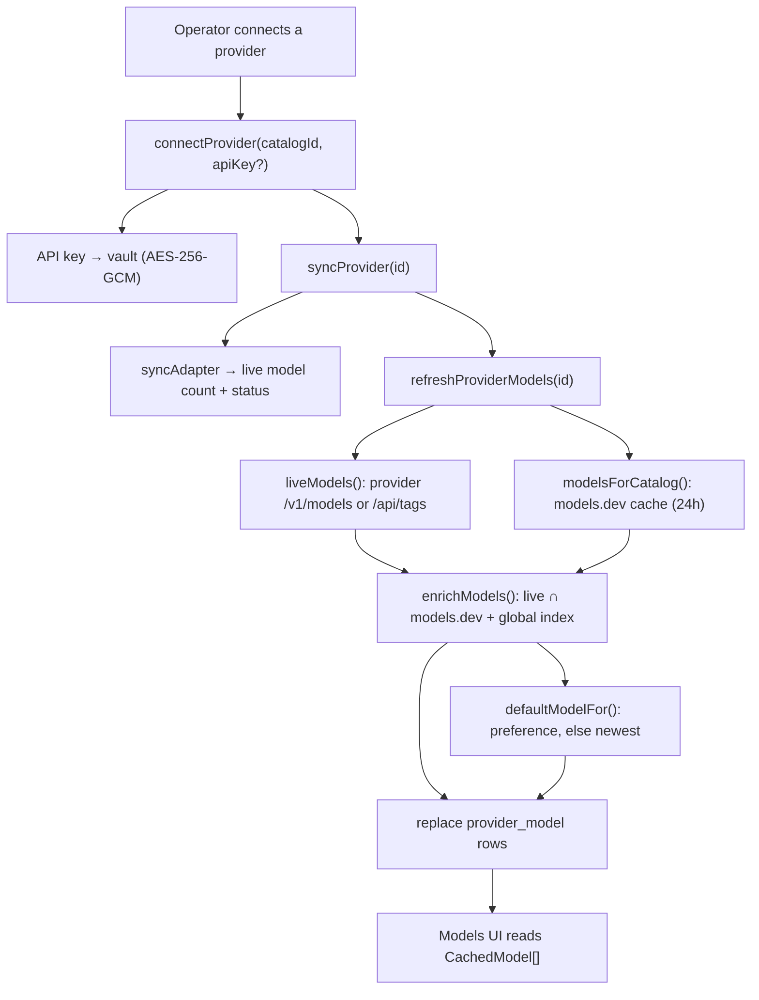
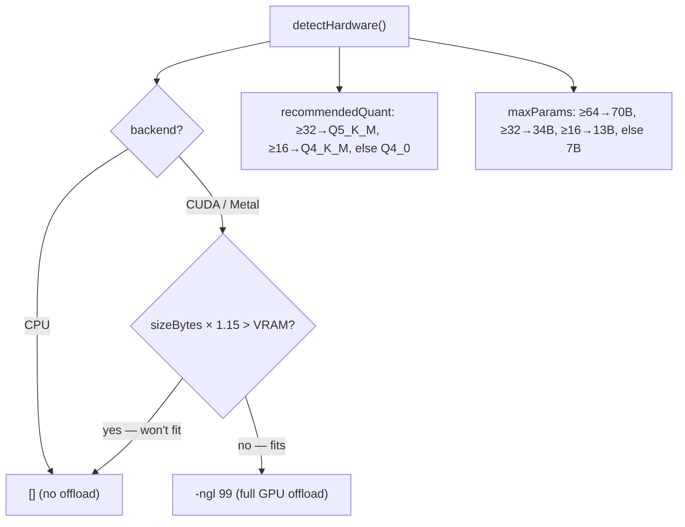

[← Docs index](./README.md) · [🇧🇷 Português](../pt/MODELS.md) · [✦ Constella](../../README.md)

# Models ✦ The Engine Constellation 🌌


> Every working star in a Constella company is powered by a model. This page documents the three families of engines — **cloud** providers, **CLI brains**, and **local** GGUF runtimes — how their catalogues are discovered live (never hardcoded), how Constella fits a local model to your hardware, and the two dedicated llama.cpp servers (chat on `:8082`, embeddings on `:8083`) that keep the workspace's gravity (RAG) and on-prem inference running.

The golden rule across the whole module: **model lists are never the source of truth in code.** They come live from [models.dev](https://models.dev/api.json) ∩ each provider's own `/v1/models` endpoint. The hardcoded lists are demoted to *offline fallback only*.

---

## 1. When to use 🪐

| You want to… | Entry point |
|---|---|
| See/connect cloud providers (Anthropic, OpenAI, Google…) | `connectProvider()`, `syncProvider()` — `src/server/providers.ts` |
| Refresh the live, enriched model list for a provider | `refreshProviderModels()` → `liveModels()` + `enrichModels()` |
| Pick a recommended default model for a provider | `defaultModelFor()` — `src/server/model-catalog.ts` |
| Probe the machine's CPU/RAM/GPU/VRAM | `detectHardware()` — `src/server/local-models.ts` |
| Download a local GGUF for llama.cpp | `downloadGguf()` from `GGUF_CATALOG` |
| Pull / serve a model via Ollama | `pullModel()`, `ollamaServe()`, `loadModel()` |
| Start the local chat server (`:8082`) | `startLlamaServer()` / `ensureLlamaServer()` |
| Start the RAG embedding server (`:8083`) | `startEmbeddings()` / `ensureEmbedServer()` |
| Know which CLI binary an agent runs on | `pickBinary()` — `src/server/adapters/cli.ts` |

The visible surface is the **Models** page (`/models`); most actions are server actions that revalidate that path.

---

## 2. How it works 🛰️

Constella treats "a model" as something you select for an **agent** (a working star). The model's *origin* is one of three kinds, recorded on the `provider.kind` column:

| `kind` | Meaning | Auth | Example catalog ids |
|---|---|---|---|
| `cloud` | A hosted HTTP API | `api_key` / `oauth` | `anthropic`, `openai`, `google_gemini`, `xai_grok`, `openrouter` |
| `cli` | A locally-installed agent CLI that Constella drives as a subprocess | `cli` / `oauth` | `claude_code`, `codex_cli`, `openclaw`, `hermes_cli`, `aider`, `opencode`, `copilot_cli`, `cursor_cli`, `cline_cli`, `kilo_code` |
| `local` | A model served on the loopback (GGUF/Ollama) | `local` | `llamacpp`, `ollama` |

The full menu of connectable providers is the typed **`PROVIDER_CATALOG`** (`src/data/providers-catalog.ts`) — 60+ entries spanning cloud APIs, routers, OpenAI-compatible endpoints, cloud platforms, local runtimes and CLIs. Each entry carries a `defaultAdapter`, `baseUrl`, capability flags and a `status` (`available` / `experimental` / `requires_setup` / `planned`).

### The three data sources for cloud model metadata

1. **models.dev** — the backbone. `src/server/model-catalog.ts` fetches `https://models.dev/api.json`, normalizes every provider's `models` map into `CatalogModel[]` (id, name, context, output limit, input/output cost per 1M tokens, capabilities, release date), caches it in memory + on disk at `<constellaHome>/cache/models-dev.json` with a **~24h TTL**.
2. **The provider's own `/v1/models`** — `liveModels()` queries the live endpoint (or `/api/tags` for Ollama) for the *actually-available* ids. Routers like OpenRouter return rich rows (pricing + context) kept verbatim; first-party providers usually return id-only rows.
3. **`FALLBACK_MODELS`** (`src/data/models-dev.ts`) — a small, current snapshot used **only** when both the network and the disk cache are cold.

`enrichModels()` intersects (2) with (1): live ids get filled in from the provider's models.dev set, then a cross-provider global index (so `anthropic/claude-…` router ids resolve too). The result is written wholesale into the `provider_model` table.

---

## 3. Main flow 🌠



On boot (`src/server/boot.ts`), Constella warms the catalogue and brings the local engines up:

- `warmModelsDev()` — preloads the models.dev cache.
- `ensureEmbedServer()` — starts the RAG embedding server on `:8083` if a local embedding model is installed.
- `ensureLlamaServer()` — starts the local chat server on `:8082` if a chat GGUF is installed.

---

## 4. Key concepts 🕳️

### `CatalogModel` — the normalized unit

Both models.dev and `/v1/models` are flattened into one shape (`src/data/models-dev.ts`):

```ts
type CatalogModel = {
  id: string;          // "claude-opus-4-8", "gpt-5.2", "grok-4"
  name: string;        // "Claude Opus 4.8"
  context: number;     // max context tokens (0 = unknown)
  outputLimit: number; // max output tokens
  inputCost: number;   // USD / 1M input tokens (0 = unknown / free)
  outputCost: number;  // USD / 1M output tokens
  caps: { reasoning: boolean; tools: boolean; vision: boolean };
  released: string;    // ISO date — drives the "newest" default pick
};
```

### Catalog → models.dev key mapping

`CATALOG_TO_MODELSDEV` maps Constella's `catalogId` to the canonical models.dev provider key (e.g. `google_gemini → google`, `xai_grok → xai`, `dashscope → alibaba`). Anything unmapped falls back to a normalized guess via `modelsDevKeyForCatalog()`. Notably, the CLI brains `claude_code → anthropic` and `gemini_cli → google` map to a first-party family so versions/context can still be enriched.

### Recommended default

`defaultModelFor()` consults `DEFAULT_PREFERENCE` (a substring preference order per key, e.g. `anthropic: ["sonnet-4", "sonnet", "opus-4", "opus"]`). The first available match wins, ties broken by newest release; with no preference hit it picks the newest dated model.

### Cost & usage are real

Cost is **never fabricated**. Cloud cost metadata comes from models.dev/`/v1/models` (`inputCost`/`outputCost` are USD per **1M** tokens). For the Claude/Codex CLIs, real per-run cost is parsed straight from the CLI's JSON output (`total_cost_usd`, `usage`) in `src/server/adapters/cli.ts`. CLIs that emit no token/cost in headless mode record `usd: 0` honestly.

---

## 5. Cloud providers ✦

The `PROVIDER_CATALOG` is the single typed source of truth. A representative slice:

| Catalog id | Display name | Category | Adapter | Base URL |
|---|---|---|---|---|
| `anthropic` | Anthropic | `cloud_api` | `http_anthropic` | `https://api.anthropic.com` |
| `openai` | OpenAI | `cloud_api` | `http_openai` | `https://api.openai.com/v1` |
| `google_gemini` | Google AI / Gemini | `cloud_api` | `http_google` | `https://generativelanguage.googleapis.com` |
| `xai_grok` | xAI / Grok | `cloud_api` | `http_xai` | `https://api.x.ai/v1` |
| `deepseek` | DeepSeek | `cloud_api` | `http_deepseek` | `https://api.deepseek.com` |
| `groq` | Groq | `cloud_api` | `http_groq` | `https://api.groq.com/openai/v1` |
| `mistral`¹ | Mistral | `cloud_api` | — | — |
| `openrouter` | OpenRouter (router) | `router` | `http_openrouter` | `https://openrouter.ai/api/v1` |
| `openai_compatible` | OpenAI-compatible endpoint | `openai_compatible` | `http_openai_compat` | (your URL) |
| `azure_openai` | Azure OpenAI | `cloud_platform` | `http_azure_openai` | (setup) |
| `aws_bedrock` | AWS Bedrock | `cloud_platform` | `sdk_bedrock` | (SigV4) |
| `vertex_ai` | Google Vertex AI | `cloud_platform` | `sdk_vertex` | (GCP) |

> ¹ `mistral` appears in the `CATALOG_TO_MODELSDEV` / `DEFAULT_PREFERENCE` maps but is not a standalone row in the current `PROVIDER_CATALOG`; reach Mistral via OpenRouter or an OpenAI-compatible endpoint.

**Authentication.** API keys go to the **vault** (AES-256-GCM, table `vault`, ref like `openai_api_key`) — *never* onto the `provider` row. Anthropic's `/v1/models` is queried with `x-api-key` + `anthropic-version`; everything else is OpenAI-compatible `Bearer` auth.

**Routers & OpenAI-compatible endpoints** (OpenRouter, LiteLLM, LM Studio server, vLLM, Ollama's OpenAI surface) expose a live `/v1/models` list and are enriched the same way; OpenRouter additionally returns per-token pricing which Constella converts to per-1M.

---

## 6. CLI brains 🚀

CLI providers are **locally-installed agent CLIs** that Constella drives as subprocesses inside the org workspace (`src/server/adapters/cli.ts`). They authenticate via their *own* login/keys — Constella never holds their credentials.

| Adapter | Binary | Models (`CLI_MODELS`) | Cost reported? |
|---|---|---|---|
| `cli_claude_code` | `claude` | `opus`, `sonnet`, `haiku` | ✅ `total_cost_usd` + usage |
| `cli_codex` | `codex` | `gpt-5-codex`, `o4-mini` | best-effort from JSONL |
| `cli_openclaw` | `openclaw` | `(default)`, `openai/gpt-5.4`, `anthropic/claude-sonnet-4` | ❌ (0) |
| `cli_hermes` | `hermes` | `(default)`, `anthropic/claude-sonnet-4.6`, `openai/gpt-5.5` | ❌ (0) |
| `cli_aider` | `aider` | `(default)` + provider-prefixed (live via `aider --list-models`) | ❌ (0) |
| `cli_opencode` | `opencode` | `(default)` + provider-prefixed (live via `opencode models`) | ❌ (0) |
| `cli_copilot` | `copilot` | `(default)`, `claude-sonnet-4.5`, `gpt-5` | ❌ (0) |
| `cli_cursor` | `cursor-agent` | `(default)`, `claude-4.5-sonnet`, `gpt-5` | ❌ (0) |
| `cli_cline` | `cline` | `(default)` | ❌ (0) |
| `cli_kilo` | `kilocode` | `(default)` | ❌ (0) |

- `pickBinary(adapter, model)` resolves which executable runs; `strongestModelFor(adapter)` returns the best tier (e.g. `opus` for Claude) for review/security/validation steps.
- Only `cli_opencode` and `cli_aider` expose a real live list command via `cliModels()`; the rest fall back to their static `CLI_MODELS` options.
- The `claude` runs are **vanilla** (a `--settings` overlay with `disableAllHooks:true`) so the operator's personal `~/.claude` hooks/plugins don't leak into agent voices. Web research adds `--allowedTools WebSearch WebFetch` (default ON; `CONSTELLA_WEB_RESEARCH=0` off).
- Run-mode permissions: `start` → `bypassPermissions` (full); `vps`/`auth`/`portable` → `acceptEdits` (jailed). Override with `CONSTELLA_AGENT_FULL_ACCESS=1|0`. Default per-run timeout: **180s**.
- `detectCliAuth()` returns `ready` / `needs_login` / `needs_key` / `unknown` per binary; `LOGIN_HINTS` shows how to authenticate each.

---

## 7. Local models — GGUF catalog + Ollama 🌌

Local inference has two backends:

### llama.cpp + GGUF (`GGUF_CATALOG`)

`src/data/model-catalog.ts` **generates** the GGUF catalog from a compact family spec (`GGUF_FAMILIES`) using lmstudio-community's reliable repo naming:

```
https://huggingface.co/lmstudio-community/<Repo>-GGUF/resolve/main/<Repo>-<QUANT>.gguf
```

- Families span **Qwen 2.5/3/3.5/3.6, Llama 3.x, Gemma 2/3/4, Mistral/Ministral/Devstral, Phi, DeepSeek-R1 distills, Yi, Granite, SmolLM2, Falcon3, EXAONE** and more, tagged `chat` / `code` / `reasoning` / `embed`.
- Quants are capped per size so every file stays single-part: ≤9B → `Q3_K_L, Q4_K_M, Q6_K, Q8_0`; ≤34B → drops `Q8_0`; ≥35B → only `Q3_K_L, Q4_K_M`.
- `sizeBytes` is estimated from `params × QUANT_MULT[quant]` (bytes-per-weight: `Q3_K_L 0.55`, `Q4_K_M 0.67`, `Q6_K 0.90`, `Q8_0 1.13`) — good enough for the GPU fit check.
- The embedding model `nomic-embed-text-v1.5 (Q8_0)` is kept first and special-cased everywhere — it powers semantic RAG.

`downloadGguf(id)` checks free disk (refuses if the drive can't hold ~1.1× the model), streams the file into `<constellaHome>/models/` with live byte progress, verifies size (and SHA-256 when known), then registers it once **per machine** in the `local_model` table (dedup by file path, shared across workspaces). `removeGguf(id)` deletes the file + rows.

### Ollama (`OLLAMA_CATALOG`)

A curated short list pulled via the Ollama daemon: `nomic-embed-text`, `mxbai-embed-large` (embed), `llama3.2:3b`, `qwen2.5:7b`, `qwen2.5-coder:7b`, `gemma2:2b`, `phi3.5`. Server lives at `OLLAMA_URL` (default `http://127.0.0.1:11434`).

| Function | Action |
|---|---|
| `ollamaInstalled()` / `ollamaServe("start"\|"stop")` | detect / start / stop the daemon |
| `ollamaInfo()` (`/api/tags`) | up? + installed models |
| `pullModel(name)` (`/api/pull`) | download a model |
| `loadModel(name)` / `ollamaPs()` (`/api/ps`) | load into / list in memory |
| `removeModel(name)` (`/api/delete`) | uninstall |

---

## 8. GPU fit-check + quant recommendation 🛰️

`detectHardware()` runs a **real** probe (cached for the process; only free-RAM refreshes on read):

| Field | Source |
|---|---|
| `cpu`, `cores` | `os.cpus()` |
| `ram` | `os.totalmem()` / `os.freemem()` |
| `gpu`, `vram`, `backend`, `accel` | `nvidia-smi` → CUDA; macOS arm64 → Metal (unified memory ≈ 70% as VRAM); else CPU + AVX2/NEON |
| `diskFree` | `Get-PSDrive` (Windows) / `df -h` (POSIX) on the Constella home drive |
| `recommendedQuant` | `≥32 GB → Q5_K_M`, `≥16 GB → Q4_K_M`, else `Q4_0` |
| `maxParams` | `≥64 GB → 70B`, `≥32 GB → 34B`, `≥16 GB → 13B`, else `7B` |

The fit-check decides GPU offload at serve time. `gpuOffloadArgs(sizeBytes)`:

- Returns `[]` (CPU) when the backend isn't CUDA/Metal — the `-ngl` flag would do nothing.
- Returns `[]` when a sized model wouldn't fit: `sizeBytes × 1.15 > VRAM` → stay on CPU so a too-big model still **loads** instead of failing.
- Otherwise returns `["-ngl", "99"]` to offload every layer to the GPU.



On Windows, CUDA llama.cpp builds need the CUDA runtime DLLs (`cudart64_*`, `cublas64_*`); `ensureCudaRuntime()` self-heals by fetching the matching `cudart-…` asset so `-ngl` actually offloads instead of silently falling back to CPU. `downloadLlamaServer()` auto-installs the right prebuilt (`CUDA` when an NVIDIA GPU is detected, else `CPU`) from `ggml-org/llama.cpp` releases into `<constellaHome>/bin/llama`.

---

## 9. The two local servers — chat `:8082` + embeddings `:8083` 🌠

Constella runs **two separate llama.cpp instances** so RAG embeddings never contend with chat inference:

| Server | Port | Env | Started by | Purpose |
|---|---|---|---|---|
| Chat / reasoning | `8082` | `LLAMACPP_URL` (`http://127.0.0.1:8082`) | `startLlamaServer()` / `ensureLlamaServer()` | OpenAI-compatible serving of the first installed **chat** GGUF for `local_llamacpp` agents |
| RAG embeddings | `8083` | `CONSTELLA_EMBED_URL` (`http://127.0.0.1:8083`) | `startEmbeddings()` / `ensureEmbedServer()` | serves the **embedding** GGUF (nomic) with `--embeddings --pooling mean` for semantic RAG |

Both bind **loopback only** (`127.0.0.1`). The launch args:

- Chat: `llama-server -m <chat.gguf> --host 127.0.0.1 --port 8082 -c 4096 [-ngl 99]`
- Embed: `llama-server -m <embed.gguf> --embeddings --host 127.0.0.1 --port 8083 -c 2048 --pooling mean [-ngl 99]`

Embedding models can't serve chat — if your only local model is an embedder, `startLlamaServer()` routes it to `:8083` and tells you to download a chat GGUF. Health is reported honestly via `llamaServerStatus()` (`/v1/models`) and `embedServerUp()` (`/health`).

### RAG embedding fallback chain

`src/server/rag.ts` embeds via the dedicated server first, then **Ollama** (`OLLAMA_URL`, model `CONSTELLA_EMBED_MODEL` default `nomic-embed-text`), then a **keyword heuristic** if neither is up — retrieval degrades, never breaks. `nomic-embed-text` requires asymmetric prefixes: documents `search_document:`, queries `search_query:`.

---

## 10. Tables 🪐

| Table | Key columns | Role |
|---|---|---|
| `provider` | `catalogId`, `adapter`, `kind` (`cloud`/`cli`/`local`), `auth`, `status` (`connected`/`needs_sync`/`error`), `modelCount`, `cliVersion`, `defaultModel`, `authState` | one connected provider per workspace |
| `vault` | `providerId`, `ref` (`<catalogId>_api_key`), `ciphertext`, `iv` | encrypted secrets (AES-256-GCM) |
| `provider_model` | `providerId`, `modelId`, `name`, `context`, `outputLimit`, `inputCost`, `outputCost`, `caps`, `released`, `isDefault` | cached enriched catalog the UI reads; replaced wholesale per refresh |
| `local_model` | `name`, `file`, `quant`, `params`, `sizeBytes`, `sha256`, `bind` (`127.0.0.1:8082`), `loaded` | installed GGUF registry (machine-wide, dedup by `file`) |

---

## 11. Step-by-step 🛰️

### Connect a cloud provider
1. Open **Models**, choose a provider from the catalog (e.g. Anthropic).
2. Paste the API key → `connectProvider("anthropic", key)` stores it in the vault.
3. `syncProvider()` hits the live endpoint, sets `status`/`modelCount`, then `refreshProviderModels()` populates `provider_model`.
4. Assign a model to an agent (the agent's `Agent.md` model field).

### Run a model locally with llama.cpp
1. **Models → llama.cpp → Install** (`downloadLlamaServer()` grabs the right prebuilt).
2. Download a chat GGUF from the catalog (`downloadGguf(id)`), and the `nomic-embed-q8` embedding GGUF for RAG.
3. **Start server** (`startLlamaServer()`) — boots on `:8082`, offloading to GPU when the model fits.
4. `connectLlamaCpp()` registers `llamacpp` as a local provider; point agents at `local_llamacpp`.

### Use Ollama
1. Install Ollama, **Start** (`ollamaServe("start")`).
2. `pullModel("qwen2.5:7b")`, then `loadModel(...)` to warm it.
3. Connect via the `ollama` provider (live `/api/tags` list).

---

## 12. Possible states ✦

| Surface | States |
|---|---|
| `provider.status` | `connected`, `needs_sync`, `error` |
| `provider.authState` | `ready`, `needs_login`, `needs_key`, `unknown` |
| `provider.syncStatus` | `implemented`, `manual`, `not_implemented` |
| Catalog `status` | `available`, `experimental`, `requires_setup`, `planned`, `unsupported` |
| llama.cpp server | up / down (`/v1/models`); CPU vs `-ngl 99` (GPU) |
| Embed server | up / down (`/health`); model installed? |
| GGUF download | live `{ received, total, done, error }` progress |

---

## 13. Related integrations 🌌

- **[AGENTS](./AGENTS.md)** — each agent selects a provider + model; the default tier comes from `defaultModelFor()`.
- **[KB_RAG](./KB_RAG.md)** / **[MEMORY_RAG](./MEMORY_RAG.md)** — consume the embedding server on `:8083`.
- **[AI_ARCHITECTURE](./AI_ARCHITECTURE.md)** — where CLI adapters and runtime resolution fit.
- **[CONFIGURATION](./CONFIGURATION.md)** — per-workspace agent flags (web research, file locks, command guard).

---

## 14. Security 🕳️

- **Secrets in the vault only.** API keys are AES-256-GCM encrypted (`CONSTELLA_VAULT_KEY`) in the `vault` table — never on `provider` rows, never in logs.
- **Local servers are loopback-bound** (`127.0.0.1`) — no LAN exposure of `:8082`/`:8083`.
- **Model ids are validated** before reaching argv (`safeModel` / `safeModelSlash`) because `Agent.md` frontmatter is agent-writable — an unconstrained value (`sonnet"; rm -rf ~`) could otherwise be re-parsed by the shell. Invalid ids are dropped so the CLI uses its default.
- **GGUF integrity** — size check + SHA-256 (when known); a truncated download is deleted, never installed.
- **Vanilla agent runs** — `disableAllHooks` keeps operator hooks/plugins out of agent subprocesses.
- **CLI credentials stay with the CLI** — Constella drives `aider`/`opencode`/`cursor`/etc. but never stores their keys.

---

## 15. Troubleshooting 🚀

| Symptom | Likely cause / fix |
|---|---|
| Model list empty after connect | models.dev unreachable **and** disk cache cold → `FALLBACK_MODELS` only; retry online, or check the provider's `/v1/models`. |
| GPU not used (CPU pegged) | CUDA runtime DLLs missing → re-run **Install** (`ensureCudaRuntime(force)` self-heals), or model doesn't fit VRAM (`sizeBytes × 1.15 > VRAM`). |
| `llama-server not installed` | run **Install** or `brew install llama.cpp`; sets the `INSTALLED` marker. |
| Chat server won't start | only an embedding model installed → download a chat/instruct GGUF; check it's not loading nomic into `:8082`. |
| RAG not semantic | embed server down → `ensureEmbedServer()`; needs an embedding GGUF (download `nomic-embed-q8`) or Ollama with `nomic-embed-text`. |
| `Ollama not running` | start it (`ollamaServe("start")` / `ollama serve`); port `11434` may be busy. |
| `not enough free space` | GGUF needs ~1.1× its size free; free disk or pick a smaller quant. |
| CLI provider `needs_login` | run the binary's auth (see `LOGIN_HINTS`, e.g. `codex login`, `opencode auth login`). |
| `SHA-256 mismatch` | corrupt download — delete and retry. |

---

## Related links

- [AGENTS](./AGENTS.md) · [AI_ARCHITECTURE](./AI_ARCHITECTURE.md) · [ARCHITECTURE](./ARCHITECTURE.md)
- [KB_RAG](./KB_RAG.md) · [MEMORY_RAG](./MEMORY_RAG.md) · [CONFIGURATION](./CONFIGURATION.md)
- [INSTALLATION](./INSTALLATION.md) · [ONBOARDING](./ONBOARDING.md) · [WORKFLOW](./WORKFLOW.md)
- [✦ Back to the docs index](./README.md)
