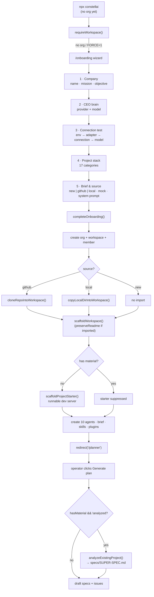

[← Docs index](./README.md) · [🇧🇷 Português](../pt/ONBOARDING.md) · [✦ Constella](../../README.md)

# Onboarding 🌌 — Igniting a New Constellation

The first-run wizard that turns an empty runtime into a live agent-company: it creates the organization + workspace, scaffolds the `.claude/` control layer, ignites the ten-agent constellation, seeds skills and plugins, optionally imports an existing project, and hands the operator to the CEO Planner.

---

## When to use

- **The very first launch.** With no organization yet, [`requireWorkspace()`](../en/ARCHITECTURE.md) redirects to `/onboarding` automatically (`src/lib/workspace.ts`).
- **Forcing the wizard again.** Launch with `npx constellai --onboarding` (or the `onboard` / `onboarding` subcommand). `bin/constella.mjs` sets `CONSTELLA_FORCE_ONBOARDING=1`, which `requireWorkspace()` honours by redirecting to `/onboarding` even when an org exists.
- **Creating an additional organization** for an operator who already has one (the wizard shows a Close button only in that case).

> 🪐 Onboarding is a *one-shot trap*. The moment `completeOnboarding()` runs it calls `delete process.env.CONSTELLA_FORCE_ONBOARDING`, so the next `requireWorkspace()` no longer re-routes here.

---

## How it works

Onboarding is a five-step client wizard (`src/app/(auth)/onboarding/page.tsx`) backed by a single server action, `completeOnboarding()` in `src/server/onboarding.ts`. The wizard collects the company identity, the CEO's brain (provider + model), a real connection test, the project stack, and a brief / source — then the server action does the heavy lifting:

1. Create `organization` + `member` (owner) + `workspace` rows. The active run mode (`getRunMode()`) is stored on `organization.runMode`.
2. Optionally register a fallback provider and vault its key.
3. **Import** existing material (GitHub repo or local directory) *before* scaffolding, so the imported `README.md` survives.
4. **Scaffold** the `.claude/` control layer plus `DOCS/`, `PO/`, `Reports/`, `specs/`, `issues/` (`scaffoldWorkspace`).
5. For a truly-new project only, write a **runnable starter** (`scaffoldProjectStarter`).
6. Persist the project source descriptor on `workspace.settings.source` (with `analyzed: false`).
7. Create the **ten agents**, apply the operator's CEO choices to Ada, and store the brief at `.claude/BRIEF.md`.
8. Write any attached mock files to `mock/`.
9. Seed the native + library **skills**, reconcile stack/role links, and create the four native **plugins**.
10. Mark the org active on the session and `redirect("/planner")`.

The **first plan** (fired later when the operator clicks *Generate plan* on `/planner`) runs the file-by-file analysis that produces `specs/SUPER-SPEC.md` — see [First-plan analysis](#first-plan-analysis-) below.

---

## Main flow 🛰️



---

## The five wizard steps 🌠

The step keys are fixed in `STEP_KEYS = ["company", "ceoModel", "connection", "stack", "brief"]`.

| # | Step | What the operator provides | Required |
|---|---|---|---|
| 0 | **Company** | `company` name, `mission`, `objective` | All three |
| 1 | **CEO brain** | Pick a detected `provider` + `model` (or register one with an API key) | A provider + model |
| 2 | **Connection test** | A real four-stage check: `checkSetupEnv` → `checkAdapter` → `testConnection` → `probeModel` | Must pass |
| 3 | **Project stack** | Choose from 17 stack categories (browse cards or search) | Optional (any/all can stay `None`) |
| 4 | **Brief & source** | Project `source` (new/github/local), optional brief, optional mock folder, Ada's `systemPrompt` | `systemPrompt` + a ready source |

A few behaviours worth noting from the code:

- **Provider detection** runs on mount (`detectProviders()`); the first detected provider + its first model are pre-selected.
- **The connection test is real** — no fake timers. Each stage is an actual probe; a failed stage shows its error and blocks *Continue*. The verified `adapter:model` is cached (`testedKey`), so going Back → Continue does not re-run the checks unless the provider or model changed.
- **Stack** has no auto-selection; the operator picks every category manually. Incompatible options are disabled (`incompat()`), and `stackNote()` surfaces a hint.
- **Finish** packs everything (`source`, `provider`, `model`, `systemPrompt`, `briefText`/`briefName`, `mockFiles`, optional `providerCatalogId`/`providerKey`) into `completeOnboarding()`.

---

## Project source: `new | github | local` 🕳️

Step 5 chooses where the product comes from. The `source` field of `OnboardingInput` is one of:

```ts
source?:
  | { type: "new" }
  | { type: "github"; pat: string; repoFull: string; branch?: string; login?: string }
  | { type: "local"; path: string };
```

| Source | Import function | Effect | README |
|---|---|---|---|
| `new` | none | Fresh project; a **runnable starter** is scaffolded | Generated `README.md` written |
| `github` | `cloneRepoIntoWorkspace()` | Shallow-clones `owner/repo` into the workspace, vaults the PAT as `github_pat`, points `origin` at the **clean** (token-free) URL | Repo's own README preserved |
| `local` | `copyLocalDirIntoWorkspace()` | Copies a snapshot of an absolute local directory into the workspace | Repo's own README preserved |

Plus an implicit fourth source: **mock** — when `source.type === "new"` *and* `mockFiles` are attached, `sourceMeta.type` becomes `"mock"`.

### Import rules (from `onboarding-import.ts`)

- Heavy/dependency directories are skipped (`HEAVY_DIRS`); `.git`, `.env*` (but **not** `.env.example`/`.sample`), `.DS_Store`, binaries, and oversize files (> 512 KB each) are skipped.
- Local import is capped at `DEFAULT_MAX_FILES = 4000` files; `DEFAULT_MAX_BYTES = 512 * 1024`.
- Every write goes through `writeWorkspaceFile()` → `safe()` (path-jailed; traversal rejected).
- GitHub clone uses `git clone --depth 1 --single-branch` (optional `--branch`) into a temp dir with a transient `x-access-token:<pat>@github.com` URL, then copies in and points `origin` at `https://github.com/<owner>/<repo>.git`. The token is **redacted** from every returned/logged string.
- `validateLocalDir(path)` (server action via `scanLocalDir`) checks the path is absolute and a real directory with importable files; it returns a `fileCount` + an 8-file `sample` (no file contents leaked).

### `preserveReadme` — why the imported README wins

After import, `completeOnboarding()` computes `importedReadme = readWorkspaceFile(orgId, "README.md") != null` and passes `preserveReadme` to `scaffoldWorkspace()`. In `workspaceFiles()` the generated `README.md` is only added when `!c.preserveReadme`, so an imported repo keeps its **own** README while the `.claude/` control layer lands on top.

---

## The runnable starter (truly-new projects only) 🚀

When there is **no material** (`hasMaterial = sourceMeta.type !== "new" || hasMock` is `false`), `scaffoldProjectStarter()` writes a real, configured app that boots a dev server out of the box — so [Test Dev](../en/TEST_DEV.md) can preview it immediately and the agents build the product *on top of* it. The starter is written **absent-only**, so agent edits are never clobbered, and it is **not** part of `workspaceFiles()` (so `bootstrapWorkspace`/`rerenderMissionDocs` can never overwrite product code).

The template is chosen by `pickStarter(stack)` in `src/data/project-starter.ts`. The selection precedence: meta-framework → explicit static/no-framework → Vite baseline by frontend → backend framework → language fallback → the always-bootable `static` Node server.

### Starter ids (`StarterId`)

| `StarterId` | Picked when (examples) | Boots |
|---|---|---|
| `next` | `meta = "Next.js"` | `next dev` |
| `vite-react` | `frontend = "React"` (or TS/JS language fallback) | `vite` |
| `vite-vue` | `frontend = "Vue"` | `vite` |
| `vite-svelte` | `frontend = "Svelte"` or `meta = "SvelteKit"` | `vite` |
| `node-express` | `backend = "Express"` | `node server.js` |
| `node-fastify` | `backend = "Fastify"` | `node server.js` |
| `node-koa` | `backend = "Koa"` | `node server.js` |
| `node-hono` | `backend = "Hono"` | `node server.js` |
| `node-nest` | `backend = "NestJS"` | `tsx watch src/main.ts` |
| `fastapi` | `backend = "FastAPI"` | `uvicorn` |
| `flask` | `backend = "Flask"` or `language = "Python"` | `python main.py` |
| `django` | `backend = "Django"` | `manage.py` |
| `go-http` | `language = "Go"` | `net/http` |
| `go-gin` | `backend = "Gin"` | `gin` |
| `rust-axum` | `language = "Rust"` | `axum` |
| `rust-actix` | `backend = "Actix"` | `actix-web` |
| `static` | `HTML/CSS`, `Vanilla JS`, `Static (no framework)`, or anything unknown | pure Node `http` |

> 🌠 The `static` template is the **universal fallback**: Node is always present, so every project boots *something* regardless of stack.

Each starter ships a themed, self-contained landing page (deterministic per-company palette via `paletteFor()`), a `.gitignore`, an `.env.example`, and a `PORT`-aware server bound to `127.0.0.1`. The page reads "Your AI team is building **\<objective\>** on top of this starter."

---

## First-plan analysis → `specs/SUPER-SPEC.md` 🌌

When the project has material (imported repo, copied local dir, attached mock, **or** a detected project on disk), the **first** plan does not jump straight to specs. In `src/server/planner-core.ts`:

```ts
const hasMaterial = srcType !== "new" || mockFiles.length > 0 || !!detectProject(org.id);
if (!isNewWork && hasMaterial && !wsSettings.source?.analyzed) {
  await analyzeExistingProject({ orgId, wsId, ada, binary, model });
  // → mark settings.source.analyzed = true
}
```

`analyzeExistingProject()` (`src/server/analyze.ts`) runs a **real agent pass** as Ada (`cwd = workspace`, reads files literally), streamed to the `planner` channel, that writes/overwrites `specs/SUPER-SPEC.md`. It runs **once per project** — guarded by `settings.source.analyzed`. The agent is instructed to read in order: docs → manifests/config → source file-by-file (skipping `node_modules`, `dist`, `build`, `.next`, `.git`, `vendor`), then write these sections:

`## Overview & purpose` · `## Architecture & layers` · `## Tech stack & dependencies` · `## Directory / module map` · `## Frontend` · `## Backend` · `## Data model & database` · `## Auth & security` · `## Integrations / external services` · `## Business rules & key flows` · `## What is mock/stubbed vs real` · `## Gaps to make it production-real`.

The crucial framing: Constella **extends** the exact existing system — it must call out which UI/UX, behaviour and visual identity to **preserve** and where to **add** real backend/data/integrations; it never builds a second separate prototype. The CEO planner then reads `specs/SUPER-SPEC.md` in full before drafting specs and issues, and the `runner` injects the same "extend the existing code" framing into each task (`src/server/runner.ts`). If the agent forgets to write the file, `analyzeExistingProject()` writes its final summary text as the super spec so the deliverable always exists.

---

## What `completeOnboarding()` creates 🪐

| Artifact | Where | Notes |
|---|---|---|
| `organization` | DB | `runMode` from `getRunMode()` |
| `member` | DB | role `owner` |
| `workspace` | DB | `mission`, `objective`, `stack`; `settings.source` + optional `settings.github` |
| `.claude/` control layer | disk | org/workspace/permissions/memory/routing/index/CLAUDE.md/settings.json |
| Project starter | disk | only when no material (`scaffoldProjectStarter`) |
| 10 agents | DB | Ada `working`, others `idle`; health `alive` |
| Ada CEO overrides | DB + `.claude/agents/ada/Agent.md` | `adapter`, `model`, system prompt |
| `.claude/BRIEF.md` | disk | when `briefText` provided |
| `mock/` files | disk | up to 200 files + a generated `mock/README.md` |
| `budget` | DB | `monthlyCapUsd: 400` |
| `plan` | DB | `stage: 4` |
| Native + library skills | DB + disk | 6 procedural skills + the whole skills library; `reconcileStackRoleSkills()` links per stack/role |
| 4 native plugins | DB | GitHub, Telegram, Vault (enabled), Web Search (off by default) |
| Active org on session | DB | then `redirect("/planner")` |

### The ten agents

| Handle | Name | Role | Reports to | Model | Daily cap (USD) | Tier |
|---|---|---|---|---|---|---|
| `ada` | Ada | CEO | — | opus¹ | 15 | critical |
| `linus` | Linus | CTO | `ada` | sonnet | 40 | critical |
| `donald` | Donald | Product Owner | `ada` | haiku | 20 | heavy |
| `margaret` | Margaret | Backend | `linus` | sonnet | 50 | heavy |
| `grace` | Grace | Frontend | `linus` | sonnet | 45 | heavy |
| `edsger` | Edsger | QA | `linus` | haiku | 25 | heavy |
| `werner` | Werner | DevOps | `linus` | haiku | 20 | heavy |
| `barbara` | Barbara | Docs | `ada` | haiku | 15 | light |
| `whitfield` | Whitfield | CyberSec | `linus` | opus | 30 | critical |
| `vannevar` | Vannevar | Knowledge | `ada` | haiku | 10 | light |

¹ Ada's persona file defaults to `sonnet`, but the operator's CEO-brain choice (`provider`/`model`) overrides it during onboarding. The daily caps are USD ceilings; the workspace also gets a `monthlyCapUsd: 400` budget.

---

## Step-by-step (operator) ✦

1. **Launch.** `npx constellai` (or `--onboarding` to force the wizard).
2. **Company.** Enter the company name, mission and objective. All three are required.
3. **CEO brain.** Pick a detected provider + model, or expand *Register* to add one with a model id and API key.
4. **Connection test.** Watch the four real checks pass. Fix any failing stage before continuing.
5. **Stack.** Browse the 17 category cards (or search) and pick what applies; leave the rest as `None`.
6. **Brief & source.** Choose `new`, `github` (paste a PAT → list repos → pick one) or `local` (type an absolute path → Validate). Optionally paste a brief and/or attach a mock folder. Edit Ada's system prompt.
7. **Hand off.** Click the finish button. The wizard calls `completeOnboarding()` and redirects to `/planner`.
8. **Generate plan.** On the Planner, click *Generate plan* to fire the CEO ritual (and, for imported/mock projects, the one-time super-spec analysis).

---

## Examples

**Force the wizard from the CLI:**

```bash
npx constellai --onboarding
# or the explicit subcommand
npx constellai onboard
```

**Import a GitHub repo at onboarding** — the wizard sends:

```ts
source = { type: "github", pat: "ghp_…", repoFull: "acme/web-app", branch: "main", login: "acme" }
```

→ `cloneRepoIntoWorkspace()` shallow-clones `acme/web-app`, vaults the PAT, sets `origin` to the clean URL, and `preserveReadme` keeps the repo's README.

**Import a local directory:**

```ts
source = { type: "local", path: "C:\\Users\\you\\project" }
```

→ `validateLocalDir()` confirms it, then `copyLocalDirIntoWorkspace()` snapshots up to 4000 files (skipping deps/secrets/binaries).

---

## Possible states 🕳️

| State | Meaning | Where |
|---|---|---|
| `CONSTELLA_FORCE_ONBOARDING=1` | Wizard forced; cleared on first `completeOnboarding()` | `bin/constella.mjs`, `workspace.ts`, `onboarding.ts` |
| `source.type = new` | Fresh project; runnable starter scaffolded | `workspace.settings.source` |
| `source.type = github\|local\|mock` | Imported material; starter suppressed | `workspace.settings.source` |
| `source.analyzed = false` | First plan will run the super-spec analysis | `workspace.settings.source` |
| `source.analyzed = true` | Analysis done; planner reads `specs/SUPER-SPEC.md` | set by `planner-core.ts` |
| import failed | Logged to console; org still created; `sourceMeta` recomputed from what landed | `onboarding.ts` |
| agent status | Ada `working`, the rest `idle`; health `alive` | `agent` table |

---

## Related integrations 🛰️

- **[Project stacks](../en/PROJECT_STACKS.md)** — the chosen `stack` drives the starter template and skill linking.
- **[Skills](../en/SKILLS.md)** — `seedLibrarySkills` + `reconcileStackRoleSkills` link each agent to the skills its stack and role need.
- **[Plugins](../en/PLUGINS.md)** — GitHub, Telegram, Vault and Web Search are created as native plugins.
- **[GitHub](../en/GITHUB.md)** — repo import, PAT vaulting and `origin` cleanup.
- **[Models](../en/MODELS.md)** — provider/model detection and the connection test.
- **[Workflow](../en/WORKFLOW.md)** / **[Goals, specs & issues](../en/GOALS_SPECS_ISSUES.md)** — what the first plan produces after onboarding.
- **[Test Dev](../en/TEST_DEV.md)** — boots the runnable starter for an immediate preview.

---

## Security 🔒

- **Path jail.** Every imported file is written through `writeWorkspaceFile()` → `safe()` (lexical + symlink checks; traversal rejected; paths starting with `..` skipped).
- **Token hygiene.** The GitHub PAT is used only transiently in the clone URL, then `origin` is reset to the clean `https://github.com/<owner>/<repo>.git`; the token is redacted from all returned/logged strings and vaulted as `github_pat` (AES-256-GCM via the [Vault](../en/SECURITY.md)).
- **Secret skipping on import.** `.env`, `.env.local`, `.env.development`, `.env.production` and `.DS_Store` are never copied (`.env.example`/`.sample` are kept); binaries and oversize files are skipped.
- **Honest empty state.** No fake goals/tasks/specs/issues are seeded — boards start real-empty; real artifacts come from the CEO ritual and agent runs.
- **Mode-bound permissions.** The org/workspace `runMode` (from `getRunMode()`) determines the agent permission mode the runner later applies (`bypassPermissions` in `start`, `acceptEdits` otherwise) — see [Security](../en/SECURITY.md).

---

## Troubleshooting

| Symptom | Likely cause | Fix |
|---|---|---|
| Wizard reopens after finishing | `CONSTELLA_FORCE_ONBOARDING` still set in the env | It is cleared in-process on first `completeOnboarding()`; remove the `--onboarding` flag / unset the env var on relaunch |
| *Continue* disabled on the test step | A real check failed (`env`/`adapter`/`connection`/`model`) | Read the inline error; fix the provider/CLI/API key, then re-select the provider to re-verify |
| GitHub *List repos* fails | Bad/expired PAT or no `repo` scope | Use a valid token; `githubReposForToken()` returns the error string |
| Local *Validate* fails | Path not absolute, not a directory, or empty | `scanLocalDir()` requires an absolute path to a directory with importable files |
| Imported repo shows the generated README | `preserveReadme` not triggered (no top-level `README.md` in the import) | Add a `README.md` to the source; otherwise the generated one is expected |
| No `specs/SUPER-SPEC.md` after Generate plan | Project had no material, or `source.analyzed` was already `true` | Analysis only runs once, and only with material; check `workspace.settings.source` |
| Starter not created | The project had material (`hasMaterial`) | By design — agents extend the imported/mock material instead |

---

## Related links

- [Installation](./INSTALLATION.md)
- [Configuration](./CONFIGURATION.md)
- [Architecture](./ARCHITECTURE.md)
- [AI Architecture](./AI_ARCHITECTURE.md)
- [Agents](./AGENTS.md)
- [Workflow](./WORKFLOW.md)
- [Goals, specs & issues](./GOALS_SPECS_ISSUES.md)
- [Project stacks](./PROJECT_STACKS.md)
- [Skills](./SKILLS.md)
- [Plugins](./PLUGINS.md)
- [Models](./MODELS.md)
- [GitHub](./GITHUB.md)
- [Test Dev](./TEST_DEV.md)
- [Security](./SECURITY.md)
- [Troubleshooting](./TROUBLESHOOTING.md)
- [FAQ](./FAQ.md)
