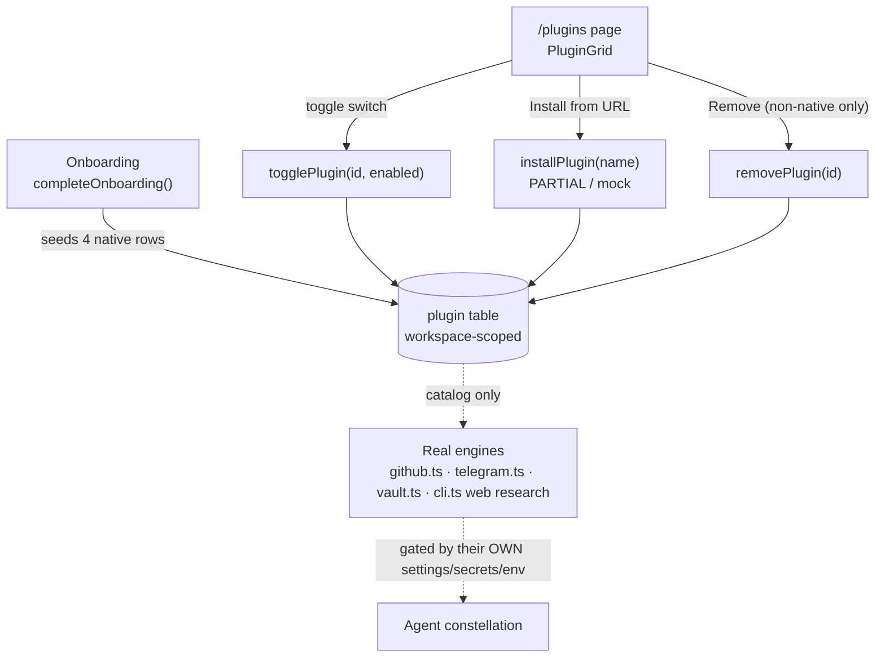
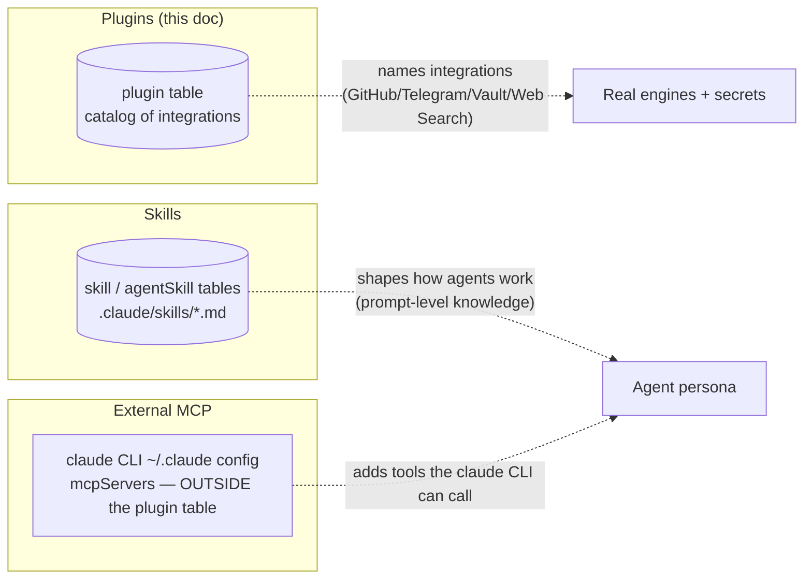

[← Docs index](./README.md) · [🇧🇷 Português](../pt/PLUGINS.md) · [✦ Constella](../../README.md)

# 🛰️ Plugins — Docking Bays for Capabilities


A **plugin** in Constella is a workspace-scoped catalog entry that names a capability the agent constellation can dock with: GitHub, Telegram, the Vault, Web Search. The plugin row is a registry and a switch — the *real* behaviour lives in dedicated modules, gated by their own settings, secrets and env vars.

> Mental model: plugins are the **docking bays** on the central ship. The bay tells you a capability *exists* and whether its bay door is open (`enabled`). The engine that the bay leads to (the GitHub engine, the Telegram relay, the Vault) is wired elsewhere.

---

## When to use 🌌

- You want to see, at a glance, which **native integrations** this workspace ships with.
- You want to flip a capability's catalog switch on or off (`togglePlugin`).
- You are registering a placeholder for a third-party extension you intend to wire up later (`installPlugin` — **PARTIAL / mock**, see below).
- You need to tell **plugins** apart from **Skills** (agent knowledge) and from **external MCP servers** (tools the `claude` CLI consumes). All three are different layers — section [Plugins vs Skills vs external MCP](#plugins-vs-skills-vs-external-mcp-).

If you are looking for *agent abilities* (prompt-level knowledge that shapes how an agent works), that is **Skills**, not plugins — see [SKILLS.md](./SKILLS.md).

---

## How it works 🪐

There is exactly one table and three server actions. Nothing more — the surface area is deliberately tiny.

### The `plugin` table

Source: `src/db/schema.ts`.

```ts
export const plugin = sqliteTable("plugin", {
  id: text("id").primaryKey(),
  workspaceId: text("workspace_id").notNull().references(() => workspace.id, { onDelete: "cascade" }),
  name: text("name").notNull(),
  description: text("description").notNull().default(""),
  enabled: integer("enabled", { mode: "boolean" }).notNull().default(false),
  native: integer("native", { mode: "boolean" }).notNull().default(false),
});
```

| Column        | Type      | Default | Meaning |
|---------------|-----------|---------|---------|
| `id`          | text PK   | —       | UUID (`randomUUID()`). |
| `workspaceId` | text FK   | —       | Owning workspace; `ON DELETE CASCADE` — plugins die with the workspace. |
| `name`        | text      | —       | Display name (`"GitHub"`, `"Telegram"`, …). |
| `description` | text      | `""`    | One-line description shown in the grid. |
| `enabled`     | boolean   | `false` | Bay-door switch. `installPlugin` seeds new rows as `true`; some native rows seed `false`. |
| `native`      | boolean   | `false` | `true` = shipped by onboarding; cannot be removed from the UI. |

Every row is scoped to a single `workspaceId`. There is no global plugin registry — each workspace has its own constellation of docking bays.

### Server actions

Source: `src/server/actions/plugin-actions.ts` (a sibling `togglePlugin` also exists in `src/server/modules.ts`).

| Action | Signature | What it does |
|--------|-----------|--------------|
| `togglePlugin` | `(id: string, enabled: boolean)` | Sets `plugin.enabled` for a row scoped to the current workspace, then `revalidatePath("/plugins")`. |
| `installPlugin` | `(name: string, description = "")` | **PARTIAL / mock.** Inserts a new non-native row (`enabled: true`, `native: false`) named after the URL/name. Does **not** download, verify, sandbox or wire anything. Returns `{ ok }`. |
| `removePlugin` | `(id: string)` | Deletes a row — but the `WHERE` clause includes `eq(plugin.native, false)`, so **native plugins can never be removed**. |

Every action calls `requireWorkspace()` first, so all writes are workspace-isolated and authenticated.

---

## Main flow 🌠



The dashed edge is the important nuance: the `plugin` table is a **catalog and display layer**. The real capability engines are wired through their own modules and are gated by their own configuration — not by `plugin.enabled`. Flipping the GitHub plugin switch does not, by itself, set a repo or store a token; that happens in the GitHub integration (`src/server/github.ts`). See [Native plugins](#native-plugins-).

---

## Key concepts 🕳️

- **Workspace-scoped.** Every plugin belongs to one workspace; there is no shared/global plugin store.
- **Native vs installed.** `native: true` rows are seeded by onboarding and are permanent (the UI hides the remove button; `removePlugin` ignores them). `native: false` rows come from `installPlugin` and can be removed.
- **Catalog, not gate.** `enabled` is a registry switch and a UI signal. The native integrations enforce their own enablement through secrets and settings — e.g. GitHub needs a vaulted `github_pat` or OAuth token, Telegram needs a vaulted `telegram_bot_token`, Web Search is gated by `CONSTELLA_WEB_RESEARCH` / per-workspace `settings.agents.webResearch`.
- **`installPlugin` is a placeholder.** It is honest about being a mock: the code comment reads *"mock — just registers it disabled"* and the description defaults to `"Installed from URL"`. No code fetches, validates or executes the URL.

---

## Native plugins 🚀

Seeded once during onboarding. Source: `src/server/modules.ts`:

```ts
const plugins: [string, string, boolean][] = [
  ["GitHub",     "Commit, push & open PRs from the workspace.", true],
  ["Telegram",   "Route reports and alerts to a channel.",      true],
  ["Vault",      "Encrypted secret storage for provider keys.", true],
  ["Web Search", "Let agents look things up while planning.",   false],
];
```

| Plugin | Seeded `enabled` | Real engine | Gated by | Docs |
|--------|------------------|-------------|----------|------|
| **GitHub** | `true` | `src/server/github.ts` (`setRepo`, `refreshGitStatus`, commit/push, `scanForSecrets`) | Vaulted `github_pat` (preferred) or OAuth `account.accessToken`; `settings.github.repo` | [GITHUB.md](./GITHUB.md) |
| **Telegram** | `true` | `src/server/telegram.ts` (`pollTelegram` on cron tick, allowlist, command menu) | Vaulted `telegram_bot_token`; chat/user allowlist | [TELEGRAM.md](./TELEGRAM.md) |
| **Vault** | `true` | `src/lib/vault.ts` (AES-256-GCM, `vault` table) | `CONSTELLA_VAULT_KEY` | [SECURITY.md](./SECURITY.md) |
| **Web Search** | `false` | `src/server/adapters/cli.ts` (`--allowedTools WebSearch WebFetch`) | `CONSTELLA_WEB_RESEARCH` (default ON) and per-workspace `settings.agents.webResearch` | [AGENTS.md](./AGENTS.md) |

> Note on Web Search: the plugin row seeds `enabled: false`, yet the underlying web-research capability is **ON by default** at the agent layer (`webResearchOn()` returns true unless `CONSTELLA_WEB_RESEARCH=0` or the workspace setting disables it). This is the clearest proof that the plugin row is a **catalog entry, not the actual gate** — the real switch is the env var / workspace setting that the runner pushes via `setWebResearch` before each spawn.

---

## Tables 🌌

### `plugin` (already covered above)

The only table for this feature. See [The `plugin` table](#the-plugin-table).

### Where the real capability state lives (for contrast)

| Capability | State table / store | Not in `plugin` |
|------------|--------------------|-----------------|
| GitHub token / repo | `vault` (`github_pat`), `workspace.settings.github` | ✓ |
| Telegram token / offset / allowlist | `vault` (`telegram_bot_token`), `workspace.settings.telegram` | ✓ |
| Vault key | `CONSTELLA_VAULT_KEY` env, `vault` table | ✓ |
| Web research flag | `CONSTELLA_WEB_RESEARCH` env, `settings.agents.webResearch` | ✓ |

---

## Plugins vs Skills vs external MCP 🪐

Three layers people routinely confuse. They are genuinely different:



| Layer | What it is | Where it is stored | Wired through |
|-------|-----------|--------------------|---------------|
| **Plugins** | A catalog of native integrations (this doc) | `plugin` table (per workspace) | `plugin-actions.ts`; real work in `github.ts` / `telegram.ts` / `vault.ts` / `cli.ts` |
| **Skills** | Agent knowledge files that shape *how* an agent works | `skill` / `agentSkill` tables, `.claude/skills/<name>.md` on disk | `src/server/skills-library.ts` — see [SKILLS.md](./SKILLS.md) |
| **External MCP** | Third-party MCP servers the **`claude` CLI consumes as tools** | The operator's `~/.claude` config (`mcpServers`) — **not** the `plugin` table | The vanilla `claude` CLI itself; see [MCP.md](./MCP.md) |

Two crucial clarifications:

1. **Constella's own MCP server is the OUTBOUND direction.** `scripts/mcp-server.mjs` lets an *external* host (Claude Desktop, Cursor) drive Constella over MCP. That is documented in [MCP.md](./MCP.md) and [PUBLIC_API.md](./PUBLIC_API.md). It has nothing to do with the `plugin` table.
2. **Constella agents consuming external MCP servers** happens through the vanilla `claude` CLI's own `~/.claude` configuration — again **not** the `plugin` table. (And note: company agents run *vanilla* with operator hooks disabled, per `src/server/adapters/cli.ts`, so leak-prone operator plugins/hooks do not bleed into agent runs.)

---

## Step-by-step 🛰️

### Toggle a native plugin

1. Open the **Plugins** page (`/plugins`).
2. Click the switch on a row. The UI calls `togglePlugin(p.id, !p.enabled)`.
3. `plugin.enabled` flips for that workspace; the page revalidates.
4. Remember: for native integrations the *operative* gate is the integration's own config (token / env / setting), not this switch.

### "Install" a placeholder plugin (PARTIAL)

1. Click **Install from URL** in the topbar.
2. The browser `window.prompt` asks for a URL or name (placeholder text: `github.com/acme/chat-bridge`).
3. `installPlugin(url.trim())` inserts a non-native row, `enabled: true`, `description: "Installed from URL"`.
4. Nothing is downloaded or wired. The row is a bookmark only — **this is a mock** (see [Possible states](#possible-states-)).

### Remove an installed plugin

1. Non-native rows show a **Remove** button (native rows do not).
2. Click it → `removePlugin(p.id)`.
3. The delete is guarded by `eq(plugin.native, false)`, so even a crafted call cannot delete a native row.

---

## Examples 🌠

### Programmatic toggle (server action)

```ts
import { togglePlugin } from "@/server/actions/plugin-actions";

// Flip the GitHub catalog switch off for the current workspace.
await togglePlugin(githubPluginId, false);
// NOTE: this does NOT remove the repo or token — see github.ts.
```

### Register a placeholder (mock install)

```ts
import { installPlugin } from "@/server/actions/plugin-actions";

const res = await installPlugin("github.com/acme/chat-bridge");
// res => { ok: true }
// A non-native row appears in /plugins, enabled, description "Installed from URL".
// No bridge code runs — it is a catalog bookmark.
```

### What a freshly onboarded workspace contains

| name | description | enabled | native |
|------|-------------|---------|--------|
| GitHub | Commit, push & open PRs from the workspace. | true | true |
| Telegram | Route reports and alerts to a channel. | true | true |
| Vault | Encrypted secret storage for provider keys. | true | true |
| Web Search | Let agents look things up while planning. | false | true |

---

## Possible states 🕳️

| State | `native` | `enabled` | Removable? | Source |
|-------|----------|-----------|------------|--------|
| Native, on | `true` | `true` | No | onboarding seed |
| Native, off | `true` | `false` | No | onboarding seed (e.g. Web Search) or `togglePlugin` |
| Installed (mock), on | `false` | `true` | Yes | `installPlugin` |
| Installed, off | `false` | `false` | Yes | `installPlugin` + `togglePlugin` |

**Feature maturity:**

- `togglePlugin` — **real.** Persists, scoped, revalidates.
- `removePlugin` — **real.** Guarded so natives survive.
- `installPlugin` — **PARTIAL (mock).** It only registers a row. There is no fetch, no verification, no sandbox, no runtime wiring of the named extension. Treat installed rows as bookmarks until this is fully implemented.

---

## Related integrations 🪐

The native plugins are thin labels over real subsystems documented elsewhere:

- **GitHub** → [GITHUB.md](./GITHUB.md) (commit/push, repo wiring, secret scanning).
- **Telegram** → [TELEGRAM.md](./TELEGRAM.md) (bot token, allowlist, command menu, polling).
- **Vault** → [SECURITY.md](./SECURITY.md) (AES-256-GCM secret storage).
- **Web Search** → [AGENTS.md](./AGENTS.md) (agent web research via `--allowedTools WebSearch WebFetch`).
- **MCP (outbound + external)** → [MCP.md](./MCP.md) and [PUBLIC_API.md](./PUBLIC_API.md).

---

## Security 🛰️

- **Workspace isolation.** Every action calls `requireWorkspace()` and scopes its `WHERE` by `workspaceId`, so one workspace cannot read or mutate another's plugins.
- **Native immutability.** `removePlugin`'s `eq(plugin.native, false)` clause prevents removal of native integrations even via a forged request.
- **No code execution from `installPlugin`.** Because the install path is a mock, there is *currently no* code-download/execution attack surface from it. When it is built out, the named URL must be fetched, scanned and sandboxed — do not assume an installed row is safe to execute today.
- **Secrets never live here.** Tokens and keys live in the encrypted `vault` (`CONSTELLA_VAULT_KEY`) and in `workspace.settings`, never in the `plugin` table. The catalog row carries no secret material.
- **Agents run vanilla.** Operator-side `~/.claude` plugins/hooks are disabled for company-agent runs (`src/server/adapters/cli.ts`), so an operator's personal Claude plugins cannot silently alter agent behaviour. This is a different "plugin" concept entirely — operator CLI plugins, not Constella plugin rows.

---

## Troubleshooting 🕳️

| Symptom | Likely cause | Fix |
|---------|--------------|-----|
| Toggling GitHub on did nothing | `enabled` is a catalog flag, not the gate | Configure the repo and token in [GITHUB.md](./GITHUB.md). |
| Web Search shows `enabled: false` but agents still search | Web research is ON by default at the agent layer | Disable via `CONSTELLA_WEB_RESEARCH=0` or `settings.agents.webResearch=false` — see [AGENTS.md](./AGENTS.md). |
| Installed plugin "does nothing" | `installPlugin` is a mock (registers a row only) | Expected — PARTIAL feature; the named extension is not wired. |
| Remove button missing on a row | The row is `native: true` | Native plugins are permanent by design; use the toggle instead. |
| Plugins page empty | No rows for this workspace (rare; onboarding seeds 4) | Re-check the workspace; native rows are seeded by `completeOnboarding`. |
| Want agents to use an external MCP tool | That is configured in the `claude` CLI `~/.claude`, not here | See [MCP.md](./MCP.md). |

---

## Related links 🌌

- [SKILLS.md](./SKILLS.md) — agent knowledge layer (not the same as plugins)
- [MCP.md](./MCP.md) — Constella's MCP server + external MCP consumption
- [GITHUB.md](./GITHUB.md) — the GitHub integration engine
- [TELEGRAM.md](./TELEGRAM.md) — the Telegram relay engine
- [SECURITY.md](./SECURITY.md) — the Vault and secret handling
- [AGENTS.md](./AGENTS.md) — agents and web research
- [PUBLIC_API.md](./PUBLIC_API.md) — REST v1 surface that MCP maps onto
- [ARCHITECTURE.md](./ARCHITECTURE.md) — where plugins sit in the control plane
- [CONFIGURATION.md](./CONFIGURATION.md) — env vars and workspace settings
