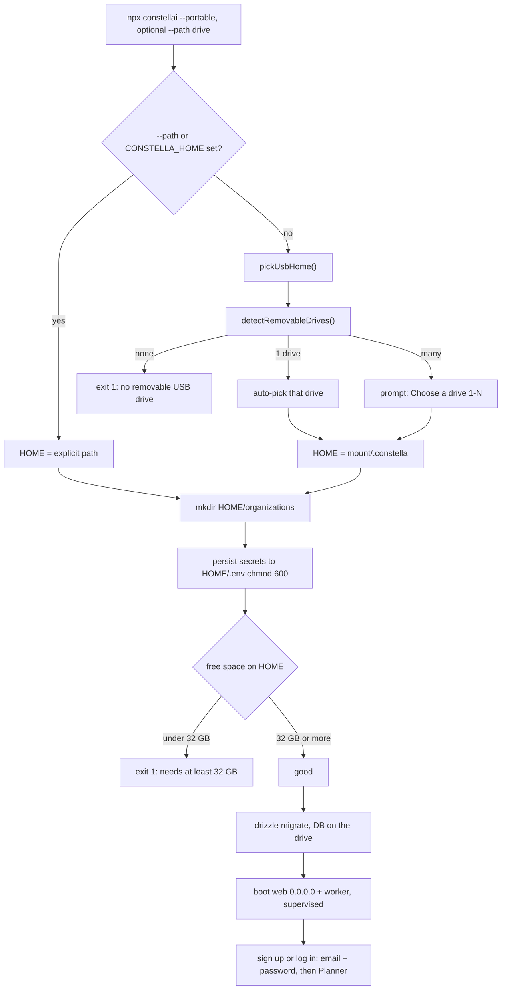
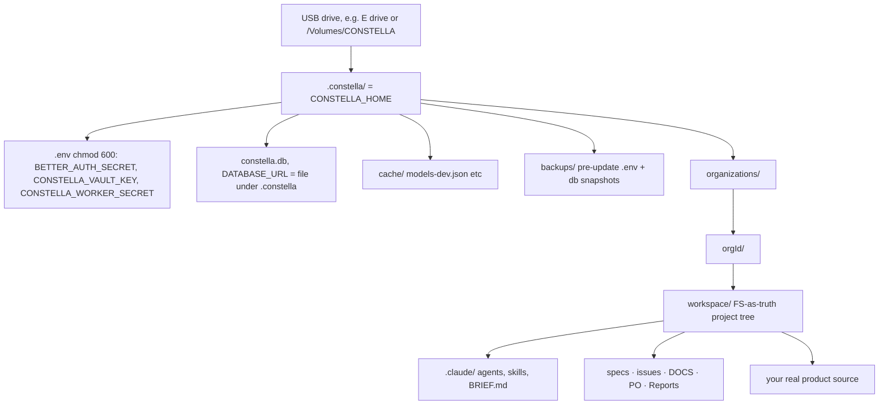

[← Docs index](./README.md) · [🇧🇷 Português](../pt/PORTABLE_MODE.md) · [✦ Constella](../../README.md)

# Portable (USB) installation 🛰️


Carry the entire control ship on a USB drive. The **portable install** (`constella --portable`) boots Constella — app, database, vault, local models, projects — straight off a removable drive, so the same constellation follows you from machine to machine without leaving a trace on the host. Authentication is the same as in every install: email + password.

> 🧪 **Status: experimental (testing phase).** The portable (USB / pendrive) install still being actively tested — expect rough edges across machines (drive letters, mount paths, USB performance). Use the [Start (local)](START_MODE.md) install for day-to-day work; try portable for demos and field setups, and report anything that breaks.

> Launch flag `portable` (`src/lib/run-mode.ts`): `requiresLogin: true`, note *"USB drive mounted as root across machines."*

---

## When to use 🌌

Use the portable install when you want the whole runtime — secrets, agents, knowledge nebula and projects — to live on a drive you physically carry, not on the host computer:

- A shared / borrowed / locked-down workstation where you do **not** want a runtime root in `~`.
- Moving between a desktop, a laptop and a workshop machine while keeping one identity and one database.
- An air-gapped or field setup where you carry local GGUF models on the same drive.
- Demos and incident response where "plug in, boot, unplug" is the whole story.

Prefer a different install method when:

| Want | Use instead |
| --- | --- |
| Local-only, loopback bind, fastest start | [local install](./START_MODE.md) |
| Always-on server reachable over a tailnet | [VPS install](./VPS_MODE.md) |

---

## How it works 🪐

Portable is a **deployment target** selected by the `--portable` launch flag — a way to install and run Constella off a drive, not an authentication mode (auth is always email + password). The launcher `bin/constella.mjs` selects it, validates a removable drive, points the **runtime root** at `<USB>/.constella`, and then boots the same dual-process runtime (web + worker) as every other install.

The defining differences of `portable`:

- **Login required** — `RUN_MODES.portable.requiresLogin === true`. Authentication is the same gate as everywhere: on first run with no user you sign up (name + email + password) to create the single operator, then you log in (better-auth).
- **Runtime root on the drive** — `CONSTELLA_HOME = <USB>/.constella`, so the database, secrets, vault, workspaces and caches all live on the drive.
- **Binds `0.0.0.0`** — like `vps`, the host defaults to all interfaces so the portable instance is reachable on the machine it's plugged into (`host = ... runMode === "vps" || runMode === "portable" ? "0.0.0.0" : "127.0.0.1"`).
- **Drive size is gated** — `< 32 GB` free is **fatal**; `≥ 32 GB` is **good** (constants `PORTABLE_MIN_GB = 32`, `PORTABLE_RECOMMENDED_GB = 32` in `src/server/portable.ts`). More headroom only helps if you carry local models — it is never a warning or a gate.

### Selecting the install

`bin/constella.mjs` resolves the launch flag, with a legacy fallback:

```js
const modeFlags = ["start", "vps", "portable"].filter((m) => has(`--${m}`));
const bind = flag("--bind");
const runMode = modeFlags[0]
  ?? (bind === "tailnet" ? "vps" : bind === "portable" ? "portable" : bind === "local" ? "start" : undefined)
  ?? "start";
```

So `--portable` (or the legacy `--bind portable`) selects the portable install. The chosen flag is exported as `CONSTELLA_RUN_MODE=portable`, read back at runtime by `getRunMode()`, and persisted to `organization.runMode` during onboarding (`runMode` column is `text(... { enum: ["start", "vps", "portable"] })` in `src/db/schema.ts`).

---

## Main flow 🌠



1. **Launch** — `npx constellai --portable`, optionally `--path <drive>` to skip detection.
2. **Pick the drive** — with no explicit path, `pickUsbHome()` calls `detectRemovableDrives()` and either auto-uses the single drive or prompts you to choose.
3. **Set the runtime root** — `HOME = join(chosen.mount, ".constella")`, exported as `CONSTELLA_HOME`.
4. **Persist secrets** — `BETTER_AUTH_SECRET`, `CONSTELLA_VAULT_KEY`, `CONSTELLA_WORKER_SECRET` written once to `<USB>/.constella/.env` (`mode: 0o600`).
5. **Validate free space** — refuse `< 32 GB`; `≥ 32 GB` is good.
6. **Apply schema** — `drizzle-kit migrate` builds the database at `<USB>/.constella/constella.db`.
7. **Boot** — supervised web (`next start -H 0.0.0.0`) + worker (`bin/worker.mjs`), with auto-restart on crash.
8. **Authenticate** — email + password (signup on first run, login after), then onboarding (first run) or straight to the Planner.

---

## Key concepts ⭐

### USB drive detection (`detectRemovableDrives`)

`bin/constella.mjs` enumerates mounted **removable** drives per OS, dependency-free, returning `[{ mount, label, freeBytes }]`:

| OS | Probe | Removable filter |
| --- | --- | --- |
| Windows (`win32`) | `Get-CimInstance Win32_Volume -Filter "DriveType=2"` via `powershell -NoProfile` | `DriveType=2` (removable) + has a `DriveLetter`; mount = `<letter>:\` |
| macOS (`darwin`) | list `/Volumes`, then `diskutil info <vol>` | matches `Removable Media: (Removable|Yes)` **or** `Protocol: USB`, and **not** `Internal: Yes` |
| Linux | `lsblk -rpno NAME,RM,MOUNTPOINT,LABEL` | `RM == "1"` (removable) **and** has a mountpoint |

Each entry's free space comes from the same dependency-free probe used for the size gate (`Get-PSDrive` on Windows, `df -k` on POSIX).

### `pickUsbHome()` selection

```text
no drives        → ✖ "Portable mode: no removable USB drive detected. Insert a pen-drive (or pass --path <drive>)." → exit 1
exactly one      → "• Using the only USB drive: <label> (<mount>, <N> GB free)"
two or more      → list "[1] <label> <mount> · <N> GB free", prompt "Choose a drive [1-N]:"
```

The result is always `<mount>/.constella` — the runtime root on the drive.

### `--path` and `CONSTELLA_HOME` — skip detection

You don't have to rely on detection. An explicit runtime root wins:

```js
const explicitHome = process.env.CONSTELLA_HOME ?? flag("--path");
let HOME = explicitHome ?? join(homedir(), ".constella");
if (runMode === "portable" && !explicitHome) HOME = await pickUsbHome();
```

So `--path E:\` (or `CONSTELLA_HOME=E:\.constella`) pins the root directly and `pickUsbHome()` is skipped entirely. This is the way to use a drive that detection can't classify as removable (some SSD enclosures, mounted images, network drives) — at the cost of skipping the removable check, though the free-space gate still runs against the chosen path.

### Free-space gate (`32 GB` fatal minimum)

The launcher checks the drive **before** installing or booting:

```js
// Portable: validate the drive BEFORE installing/booting (minimum 32 GB free; no upper recommendation).
if (runMode === "portable") {
  const free = freeBytes(HOME);
  const gb = Math.round((free / 1e9) * 10) / 10;
  if (free && free < 32e9) { console.error(`✖ Portable needs at least 32 GB free — only ${gb} GB on ${HOME}. Use a bigger drive.`); process.exit(1); }
  else if (free) console.log(`• ${gb} GB free on the drive — good (32 GB minimum; more headroom only helps if you carry local models).`);
}
```

The same threshold is exported from `src/server/portable.ts` for the UI to reuse:

```ts
export const PORTABLE_MIN_GB = 32;
export const PORTABLE_RECOMMENDED_GB = 32; // recommended == minimum; there is no separate warn tier
export function checkUsbFreeSpace(path: string): UsbSpace { /* ok / freeGb / message */ }
```

`checkUsbFreeSpace` returns `{ ok, warn, freeGb, minGb, recommendedGb, message }` (with `warn` always `false`) so the app can render the same verdict the launcher prints.

> Note the guard is `if (free && free < …)` — when the probe **fails** and returns `0`, the gate is skipped (it does not block boot on an unreadable probe). Detection prints a non-zero size for a real drive; a `0` means the `Get-PSDrive`/`df` probe couldn't read the volume.

### Carry app + models + projects

Because `CONSTELLA_HOME` is on the drive, everything that hangs off the runtime root rides along:

- **Database** — `DATABASE_URL = file:<USB>/.constella/constella.db` (set in `bin/constella.mjs`).
- **Secrets + vault** — `<USB>/.constella/.env` (`chmod 600`); provider keys are AES-256-GCM-encrypted in the `vault` table with `CONSTELLA_VAULT_KEY`.
- **Organizations & workspaces** — `<USB>/.constella/organizations/<orgId>/workspace/` (the FS-as-truth project tree; see [ARCHITECTURE](./ARCHITECTURE.md)).
- **Caches** — e.g. `<USB>/.constella/cache/models-dev.json` (models catalog), update backups under `<USB>/.constella/backups/`.
- **Local models** — GGUF files you download for the embed/chat servers live under the runtime root, so RAG ([MEMORY_RAG](./MEMORY_RAG.md)) and local inference ([MODELS](./MODELS.md)) travel with the drive. Only **32 GB** free is required to boot; **models, engine, CUDA, npm, projects** add up fast, so carry more headroom if you intend to run local models — but it is informational, not a gate.

Beyond the 32 GB minimum, more space is purely informational — it only matters if you carry local models (**models, engine, CUDA, npm, projects** add up fast).

---

## Tables 🪐

### Portable constants & functions

| Symbol | File | Meaning |
| --- | --- | --- |
| `PORTABLE_MIN_GB = 32` | `src/server/portable.ts` | Hard floor — below this, portable refuses to start. |
| `PORTABLE_RECOMMENDED_GB = 32` | `src/server/portable.ts` | Equal to the minimum — there is no separate warn tier; more space only helps if you carry local models. |
| `freeBytes(path)` | `src/server/portable.ts` & `bin/constella.mjs` | Free bytes on the volume holding `path`; `0` if the probe fails. |
| `checkUsbFreeSpace(path)` | `src/server/portable.ts` | `{ ok, warn, freeGb, minGb, recommendedGb, message }` for the UI. |
| `verifyDownloadedFileSize(path, expected)` | `src/server/portable.ts` | Catches truncated/corrupt downloads (2% tolerance) — guards model/file fetches on the drive. |
| `detectRemovableDrives()` | `bin/constella.mjs` | Per-OS list of mounted USB drives `[{ mount, label, freeBytes }]`. |
| `pickUsbHome()` | `bin/constella.mjs` | Interactive/auto drive pick → `<mount>/.constella`. |

### Environment exported by the launcher (portable)

| Variable | Value in portable | Source |
| --- | --- | --- |
| `CONSTELLA_RUN_MODE` | `portable` | from the `--portable` flag |
| `CONSTELLA_HOME` | `<USB>/.constella` | `pickUsbHome()` or `--path` / explicit env |
| `DATABASE_URL` | `file:<USB>/.constella/constella.db` | derived from `CONSTELLA_HOME` |
| `CONSTELLA_PUBLIC` | `1` | a CLI launch is the public runtime |
| `CONSTELLA_VERSION` | installed version | `package.json` |
| `CONSTELLA_PKG_ROOT` | the installed package root | `bin/constella.mjs` |
| host | `0.0.0.0` (override `--host`) | `runMode === "portable"` |
| port | `3000` (override `--port` / `PORT`) | default |

### Persisted secrets (`<USB>/.constella/.env`, `mode 0o600`)

| Secret | Purpose |
| --- | --- |
| `BETTER_AUTH_SECRET` | session signing — a real key, never the public default (login required) |
| `CONSTELLA_VAULT_KEY` | AES-256-GCM key for the encrypted `vault` table |
| `CONSTELLA_WORKER_SECRET` | `x-worker-secret` header the worker uses to reach the web process |

---

## Portable path layout 🌌



Everything inside `.constella/` is on the drive; nothing is written to the host's `~`. Unplug the drive and the host is clean.

---

## Step-by-step 🚀

### 1. Pick a drive

**≥ 32 GB** free is the minimum and is enough to boot. If you intend to carry local models, give yourself more headroom — but that is a sizing preference, not a requirement. A fast USB 3.x / USB-C drive matters — agents, builds and the SQLite database all do real I/O.

### 2. Boot from the drive

Auto-detect the USB drive:

```bash
npm install -g constellai
constella --portable
# or, once: npx constellai --portable
```

- One drive → it's used automatically.
- Many drives → you're prompted: `Choose a drive [1-N]:`.

Or pin the runtime root explicitly (skips detection):

```bash
constella --portable --path E:\
# or, on macOS / Linux:
constella --portable --path /Volumes/CONSTELLA
```

You can also set it via env:

```bash
CONSTELLA_HOME=/Volumes/CONSTELLA/.constella constella --portable
```

### 3. Watch the boot output

```text
• Secrets ready (stored in E:\.constella\.env, never printed).
• 240.0 GB free on the drive — good (32 GB minimum; more headroom only helps if you carry local models).
Constella runtime root : E:\.constella
Mode                   : portable  ·  0.0.0.0:3000
• Starting: next start -H 0.0.0.0 -p 3000  …  +  worker
```

### 4. Sign up or log in

Open `http://localhost:3000` (or `http://<host-ip>:3000` from another device on the network, since it binds `0.0.0.0`). Portable requires email + password — the first boot shows a **signup** screen (name + email + password) that creates the single operator and runs [ONBOARDING](./ONBOARDING.md); after that you **log in** and land on the Planner.

### 5. Move to another machine

Eject the drive cleanly, plug it into the next machine, and run `constella --portable` again. The same `CONSTELLA_HOME` on the drive carries your database, vault, secrets, workspaces and any local models — same identity, same history. The operator account lives in that database, so you log in with the same email + password on every machine.

---

## Examples 🛰️

Auto-detect, single drive:

```bash
$ npx constellai --portable
• Using the only USB drive: CONSTELLA (E:\, 240.0 GB free)
• Secrets ready (stored in E:\.constella\.env, never printed).
• 240.0 GB free on the drive — good (32 GB minimum; more headroom only helps if you carry local models).
Constella runtime root : E:\.constella
Mode                   : portable  ·  0.0.0.0:3000
```

Multiple drives:

```bash
$ npx constellai --portable
Detected USB drives:
  [1] CONSTELLA   E:\   ·  240.0 GB free
  [2] BACKUP      F:\   ·  64.0 GB free
Choose a drive [1-2]: 1
```

Too-small drive (fatal):

```bash
$ npx constellai --portable --path G:\
✖ Portable needs at least 32 GB free — only 14.6 GB on G:\.constella. Use a bigger drive.
```

Modest-but-sufficient drive (boots, no warning):

```bash
$ npx constellai --portable --path F:\
• 64.0 GB free on the drive — good (32 GB minimum; more headroom only helps if you carry local models).
```

No drive present:

```bash
$ npx constellai --portable
✖ Portable mode: no removable USB drive detected. Insert a pen-drive (or pass --path <drive>).
```

---

## Possible states ⭐

| Condition | Behaviour |
| --- | --- |
| No removable drive, no `--path` | `pickUsbHome()` errors → **exit 1** |
| Exactly one removable drive | auto-selected, logged |
| Multiple removable drives | interactive prompt `Choose a drive [1-N]` |
| `--path` / `CONSTELLA_HOME` set | detection skipped, that path is the root |
| Free `< 32 GB` (probe succeeded) | **fatal**, exit 1 |
| Free `≥ 32 GB` | `• good`, continue (no warn tier) |
| Probe returned `0` (unreadable) | gate skipped — boots without a space check |
| Fresh DB on the drive | `drizzle-kit migrate` builds tables; failure on a fresh DB is fatal |
| Existing DB on the drive | migrate is idempotent; a failed re-run on an existing DB is a non-fatal warning |
| First run, no user yet | signup screen creates the single operator |
| Missing `BETTER_AUTH_SECRET` at runtime | `reconcileOnBoot()` → `assertAuthSecret()` fails closed → **process exits** |

---

## Related integrations 🪐

- **Update** ([UPDATE](./UPDATE.md)) — `detectRunContext()` returns `"portable"`; `startUpdate()` does **not** auto-run on portable. It backs up `.env` + db to `<USB>/.constella/backups/<timestamp>/`, then returns the command and *"Portable: ensure free space, back up the drive, then run: `npm install -g constellai@latest`"* with `needsRestart: true`.
- **Local models / RAG** ([MODELS](./MODELS.md), [MEMORY_RAG](./MEMORY_RAG.md)) — GGUF models and embed/chat servers run off the drive's runtime root; the 32 GB minimum boots, but local models are why you'd carry a larger drive.
- **VPS** ([VPS_MODE](./VPS_MODE.md)) — shares the `0.0.0.0` bind; differs in that VPS runs natively on a host over a tailnet (no Docker), portable runs off a drive.
- **Configuration** ([CONFIGURATION](./CONFIGURATION.md)) — `CONSTELLA_HOME`, `CONSTELLA_RUN_MODE`, `DATABASE_URL` and the secret env vars are documented there.

---

## Security 🕳️

- **Authentication is always required.** `requiresLogin: true`; the single operator signs up on first run and logs in thereafter. Boot fails closed if `BETTER_AUTH_SECRET` is missing (`reconcileOnBoot → assertAuthSecret`), so a portable instance can never sign sessions with better-auth's forgeable public default key.
- **Binds `0.0.0.0`.** The portable instance is reachable on the host's network. Treat the host network as part of your trust boundary — prefer a trusted LAN, or override with `--host 127.0.0.1` if you only need local access on the plugged-in machine.
- **Secrets stay on the drive.** `<USB>/.constella/.env` is written `mode 0o600`; provider tokens are AES-256-GCM-encrypted in the `vault` table with `CONSTELLA_VAULT_KEY` (which is itself on the drive). **The drive is the keyring** — physical loss of the drive is loss of the secrets, so encrypt the drive at rest (BitLocker / FileVault / LUKS) and back it up.
- **Workspace jail still applies.** Agent file access goes through `safe()` in `src/lib/fs-workspace.ts` (lexical + symlink checks) — agents cannot escape `<USB>/.constella/organizations/<orgId>/workspace/` onto the host filesystem.
- **No host residue.** Nothing is written to the host's `~/.constella`; pulling the drive leaves the host clean.

See [SECURITY](./SECURITY.md) for the full model.

---

## Troubleshooting 🌠

| Symptom | Cause / fix |
| --- | --- |
| `✖ no removable USB drive detected` | The drive isn't classified as removable (enclosure/SSD/network mount). Pass `--path <drive>` to skip detection. |
| `✖ Portable needs at least 32 GB free` | The chosen volume has `< 32 GB` free — use a bigger drive or free space. |
| `• … GB free on the drive — good` | At or above the 32 GB minimum; boot continues. Carry a larger drive if you intend to keep local models. |
| No space message at all | The `freeBytes` probe returned `0` (couldn't read the volume) → the gate is skipped. Verify the drive mounts and `Get-PSDrive`/`df` can see it. |
| Wrong drive auto-picked | More than one removable drive — re-run and choose the index, or pin with `--path`. |
| Can't reach it from another machine | It binds `0.0.0.0`; check host firewall and use `http://<host-ip>:3000`. For local-only, add `--host 127.0.0.1`. |
| `✖ Database schema migration failed on a fresh database` | The drive's filesystem may not support the DB writes (some FAT/exFAT quirks) or is full/read-only — try another drive or filesystem. |
| Schema migrate *skipped/failed on an existing DB* | Non-fatal warning on an already-built DB; boot continues. |
| `update` says it can't auto-run | Expected on portable — back up, ensure free space, run the printed `npm install -g constellai@latest`, then restart. |

More: [TROUBLESHOOTING](./TROUBLESHOOTING.md) · [FAQ](./FAQ.md).

---

## Related links ⭐

- [START_MODE](./START_MODE.md) · [VPS_MODE](./VPS_MODE.md)
- [INSTALLATION](./INSTALLATION.md) · [ONBOARDING](./ONBOARDING.md) · [CONFIGURATION](./CONFIGURATION.md)
- [ARCHITECTURE](./ARCHITECTURE.md) · [MODELS](./MODELS.md) · [MEMORY_RAG](./MEMORY_RAG.md)
- [UPDATE](./UPDATE.md) · [SECURITY](./SECURITY.md) · [TROUBLESHOOTING](./TROUBLESHOOTING.md) · [FAQ](./FAQ.md)
</content>
