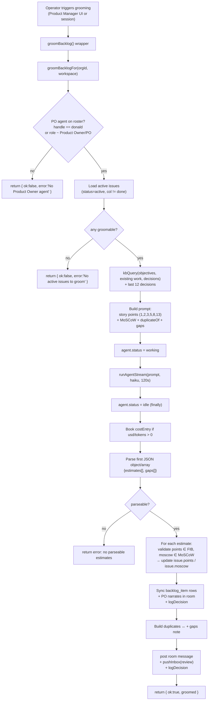
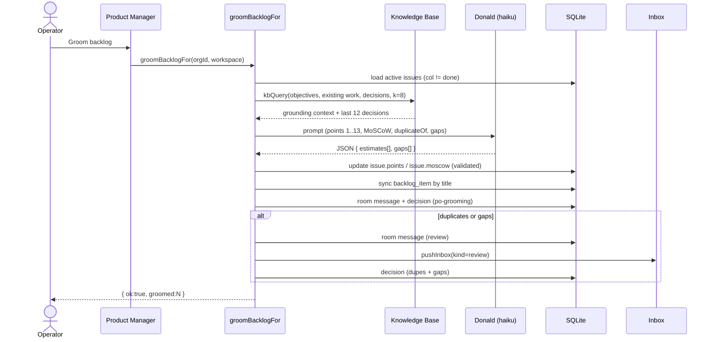

[← Docs index](./README.md) · [🇧🇷 Português](../pt/PO_AGENT.md) · [✦ Constella](../../README.md)

# 🪐 PO Agent (Donald) — the Product Owner star


Donald is Constella's **Product Owner** agent: the customer's voice in the constellation. He grooms the backlog, sizes every issue in **story points** (Fibonacci), sets **MoSCoW** priority, flags likely **duplicates** and **gaps**, and closes sprints with a written retro. He is one of the ten seeded agents and reports to Ada (CEO).

> Grounding: this doc describes only what the code does, in `src/server/planner.ts` (`groomBacklogFor`), `src/server/pm.ts` (`closeSprintFor`), `src/server/commands.ts` (slash commands) and `src/data/scaffold.ts` (the agent definition). Where a behaviour is operator-triggered, it is stated as such.

---

## 2. What Donald is

| Field | Value | Source |
|---|---|---|
| Handle | `donald` | `src/data/scaffold.ts` `AGENT_DEFS` |
| Name | Donald | `AGENT_DEFS` |
| Role | `Product Owner` | `AGENT_DEFS` |
| Reports to | `ada` (CEO) | `AGENT_DEFS` |
| Model | `haiku` | `AGENT_DEFS` |
| Provider / adapter | `cli_claude_code` | `AGENT_DEFS` |
| Temperature | `0.4` | `AGENT_DEFS` |
| Daily cost cap | `20` USD | `AGENT_DEFS` (`dailyCapUsd`) |
| Tier | `heavy` | `AGENT_DEFS` |
| Identity | "Customer voice. Ruthless about priority and clarity." | `AGENT_DEFS` |
| Ritual | "Groom the backlog with MoSCoW, plan the sprint, track delivery, close with a retro." | `AGENT_DEFS` |

Donald is also one of the three **planners** (alongside `ada` and `donald`'s siblings `linus`) in the work pipeline — see [WORKFLOW](./WORKFLOW.md) and [GOALS_SPECS_ISSUES](./GOALS_SPECS_ISSUES.md). His persona file lives on disk at `.claude/agents/donald/Agent.md`.

---

## 3. When to use 🛰️

- After Ada drafts specs → issues, when you want **human-like estimates** (real effort, not just priority defaults) on the board.
- Before starting a sprint, to surface **duplicate / overlapping issues** and **missing work (gaps)** the objectives need.
- At the end of a sprint, to **archive what shipped** and write a sprint **retro**.
- Any time the board has drifted and you want priorities re-sized honestly.

You do **not** need Donald for the deterministic priority-derived defaults that `generatePlan` already seeds. Grooming is an **optional, operator-triggered** pass on top of those.

---

## 4. How it works 🌌

There are two distinct PO operations in the code:

1. **Backlog grooming** — `groomBacklogFor(orgId, workspace)` in `src/server/planner.ts`. One real PO agent run (it books cost). Donald reads every active issue + project knowledge, returns JSON estimates, and Constella writes `points` + `moscow` back to the `issue` table. Duplicates and gaps go to the **Inbox** as a review item — never auto-deleted.
2. **Sprint close** — `closeSprintFor(orgId, wsId)` in `src/server/pm.ts`. Deterministic (no agent run): writes a retro doc, archives shipped issues off the active board.

Both have a session wrapper for the UI (`groomBacklog`, `closeSprint`) and a session-less core (`*For`) reused by the [Public API](./PUBLIC_API.md) and chat commands.

### Grooming is KB-aware

Before sizing, `groomBacklogFor` calls `kbQuery(orgId, …, { agentHandle: po.handle, k: 8 })` to ground Donald in real **objectives, existing work and prior decisions** (the *memory nebula* — see [KB_RAG](./KB_RAG.md)). Recent rows from the `decision` table (last 12) are also injected. This is what lets him spot duplicates and gaps from signal, not in a vacuum.

### The model is resolved from the agent row

```ts
const binary = pickBinary(po.adapter, po.model);
const model = binary === "claude"
  ? (po.model.includes("opus") ? "opus" : po.model.includes("haiku") ? "haiku" : "sonnet")
  : undefined;
```

So Donald's seeded `haiku` model is used for the grooming run, via `runAgentStream(prompt, { orgId, binary, model, timeoutMs: 120_000 }, …)`.

---

## 5. Main flow 🌠



---

## 6. Key concepts 🕳️

### Story points (Fibonacci — effort, not priority)

The prompt is explicit: *"Story points = relative EFFORT / complexity / uncertainty on the Fibonacci scale (1, 2, 3, 5, 8, 13) — NOT the same as priority. A small tweak is 1-2; a whole subsystem is 8-13."* Constella validates the returned number against an exact set:

```ts
const FIB = new Set([1, 2, 3, 5, 8, 13]);
// ...
const pts = typeof e.points === "number" ? Math.round(e.points) : NaN;
const points = FIB.has(pts) ? pts : undefined;   // anything off-scale is dropped
```

| Points | Meaning |
|---|---|
| `1` | Trivial tweak |
| `2` | Small change |
| `3` | Moderate change |
| `5` | Substantial change |
| `8` | Large feature |
| `13` | Whole subsystem / high uncertainty |

A value not in this set (e.g. `4`, `6`, `21`) is **ignored** for that issue.

### MoSCoW prioritisation

The prompt: *"MoSCoW = Must | Should | Could | Won't. Be honest: only the truly essential are Must; nice-to-haves are Could; use Won't sparingly (defer)."* Validation:

```ts
const MOSCOW = new Set(["Must", "Should", "Could", "Won't"]);
```

| MoSCoW | Intent |
|---|---|
| `Must` | Truly essential — the work fails without it |
| `Should` | Important, default fallback for `backlog_item` |
| `Could` | Nice-to-have |
| `Won't` | Deferred (use sparingly) |

If both `points` and `moscow` are invalid/absent for an estimate, that estimate is **skipped** (no DB write).

### Duplicate detection → Inbox, never auto-delete

Each estimate may carry `duplicateOf` (the key of the issue it overlaps). Constella validates that both keys exist and are different, then formats `"<key> ↔ <duplicateOf>"`. Duplicates are **surfaced**, never removed:

```ts
const dupes = parsed
  .filter((e) => e.duplicateOf != null && byKey[String(e.duplicateOf)]
    && byKey[String(e.key)] && String(e.duplicateOf) !== String(e.key))
  .map((e) => `${e.key} ↔ ${e.duplicateOf}`);
```

### Gap detection

The JSON may include `gaps`: *"work the objectives need but no issue covers"*. Up to **8** gaps are kept (`j.gaps.map(String).slice(0, 8)`). Like duplicates, gaps are filed for the operator — Constella does not auto-create issues for them.

### Output contract

Donald must return **only** a JSON object (no prose, no fences):

```json
{"estimates":[{"key":"1","points":5,"moscow":"Must","duplicateOf":"3"}],"gaps":["a missing issue the objectives need"]}
```

Constella extracts the first JSON object/array with `res.text.match(/\{[\s\S]*\}|\[[\s\S]*\]/)` and tolerates either a bare array (`estimates`) or the full `{estimates, gaps}` shape. If nothing parses, it returns `{ ok: false, error: "The PO returned no parseable estimates — try again." }` — nothing is fabricated.

---

## 7. Tables 🛰️

### `issue` (the fields Donald writes)

| Column | Type / enum | Set by grooming? | Notes |
|---|---|---|---|
| `key` | text | no | issue key, matched against `estimate.key` |
| `title` | text | no | read into the prompt |
| `prio` | `low \| med \| high` | no | passed as a *hint* only |
| `col` | `todo \| doing \| blocked \| review \| done` | no | `done` issues are excluded from grooming |
| `moscow` | `Must \| Should \| Could \| Won't` | **yes** | validated against `MOSCOW` |
| `points` | integer (default `0`) | **yes** | validated against `FIB` |
| `status` | `active \| cancelled \| archived` | indirectly | only `active` issues are groomed; `closeSprint` sets shipped → `archived` |
| `assigneeId` | text | no (set by `/assign`) | — |

### `backlog_item`

| Column | Type / enum | Notes |
|---|---|---|
| `title` | text | matched by title to sync `points`/`moscow` from issues post-grooming |
| `moscow` | `Must \| Should \| Could \| Won't` (default `Should`) | — |
| `points` | integer (default `0`) | — |

### Other tables touched by Donald

| Table | When | What |
|---|---|---|
| `costEntry` | grooming run | one row if `usd > 0` or tokens > 0 |
| `message` (channel `room`) | grooming + sprint close + dupes/gaps | PO narration |
| `decision` | grooming + dupes/gaps + sprint close | `source: "po-grooming"` |
| `inboxItem` | dupes/gaps found | `kind: "review"` (deduped per ref) |
| `agent` | grooming run | `status` → `working` then `idle` |

---

## 8. Step-by-step ⭐

### Groom the backlog

1. Open the **Product Manager** module (or call `groomBacklog()`), which delegates to `groomBacklogFor(org.id, workspace)`.
2. Constella finds the PO: `handle === "donald"`, else any agent whose `role` matches `/product owner|\bpo\b|product manager/i`. No PO → error.
3. It loads active issues, drops `done`, builds the KB-grounded prompt, and runs Donald (`haiku`, 120 s timeout).
4. Estimates are validated and written back to `issue.points` / `issue.moscow`; `backlog_item` rows are synced by title.
5. Donald narrates in the **room** ("Backlog groomed — estimated story points + MoSCoW for N issues…").
6. If duplicates or gaps were found, a second room message + an **Inbox** review item + a decision are filed.

### Close the sprint (`closeSprintFor`)

1. Trigger `/close-sprint` in chat, the Product Manager action, or the Public API.
2. Constella selects active issues; if **none** are in `done`, returns `{ ok: false }` ("Nothing to close — no issues are in Done yet.").
3. It writes a retro to `PO/sprint-retro-<YYYY-MM-DD>.md` listing **Shipped** (with points) and **Carried over** (with their column).
4. Every shipped issue is set to `status: "archived"` (off the active board, preserved on disk + retro).
5. A `decision` is logged: `by: "donald"`, `source: "po-grooming"`.

---

## 9. Examples 🚀

### Triggering grooming via chat

There is no dedicated grooming slash command; grooming runs from the **Product Manager** UI (the `groomBacklog` server action). The related PO-facing chat commands are:

```text
/close-sprint
```

→ Donald replies in chat (verbatim from `src/server/commands.ts`):

```text
🏁 Sprint closed — 4 shipped, 2 carried over. Retro written to `PO/sprint-retro-2026-06-22.md`.
```

If nothing is in Done:

```text
Nothing to close — no issues are in Done yet.
```

### A grooming room message (success)

```text
@donald: Backlog groomed — estimated story points + MoSCoW for 7 issues. Open the Product Manager to review.
```

### A grooming review (duplicates + gaps)

```text
@donald: Backlog review — Possible duplicate / overlapping issues: 4 ↔ 2.

Gaps the objectives need:
- A rate-limit on the public login endpoint
- An audit log for admin actions
```

The same note is filed in the **Inbox** as `PO backlog review — 1 duplicate, 2 gap`.

### Sample model output (the JSON Donald returns)

```json
{
  "estimates": [
    { "key": "1", "points": 3,  "moscow": "Must" },
    { "key": "2", "points": 8,  "moscow": "Should", "duplicateOf": "4" },
    { "key": "3", "points": 13, "moscow": "Could" }
  ],
  "gaps": ["Password reset flow has no spec or issue"]
}
```

---

## 10. Possible states 🕳️

### Grooming return values (`groomBacklogFor`)

| Return | Meaning |
|---|---|
| `{ ok: false, error: "No Product Owner agent in this workspace." }` | No `donald` and no PO-role agent |
| `{ ok: false, error: "No active issues to groom." }` | Board empty of groomable issues |
| `{ ok: false, error: "The PO returned no parseable estimates — try again." }` | Model output had no parseable JSON |
| `{ ok: true, groomed: N }` | N issues received points and/or MoSCoW |

### Sprint-close return values (`closeSprintFor`)

| Return | Meaning |
|---|---|
| `{ ok: false, shipped: 0, carried: N }` | Nothing in `done` to close |
| `{ ok: true, shipped, carried, path }` | Retro written; shipped issues archived |

### Donald's agent `status` during grooming

| Status | When |
|---|---|
| `working` | set immediately before the run |
| `idle` | restored in the `finally` block (best-effort) |

---

## 11. Diagram — grooming decision points 🌌



---

## 12. Related integrations 🛰️

- **Work pipeline** — grooming sits between issue creation and execution. See [WORKFLOW](./WORKFLOW.md) and [GOALS_SPECS_ISSUES](./GOALS_SPECS_ISSUES.md).
- **CEO planning** — Ada (`generatePlan`) seeds the deterministic priority defaults Donald refines. See [AGENTS](./AGENTS.md).
- **Knowledge Base / RAG** — grooming is KB-aware via `kbQuery`. See [KB_RAG](./KB_RAG.md) and [KB_AGENT](./KB_AGENT.md).
- **Inbox** — duplicates/gaps surface as review items. See [INBOX](./INBOX.md).
- **Chat commands** — `/close-sprint` (and the wider set). See [CHAT_COMMANDS](./CHAT_COMMANDS.md).
- **Public API** — `closeSprintFor` and grooming cores are session-less for remote control. See [PUBLIC_API](./PUBLIC_API.md) and [TELEGRAM](./TELEGRAM.md).

---

## 13. Security 🔒

- **No auto-delete.** Donald never deletes or merges issues. Duplicates and gaps are *surfaced* (room + Inbox + decision) for the operator to act on.
- **Off-scale values rejected.** Story points outside `{1,2,3,5,8,13}` and MoSCoW outside `{Must,Should,Could,Won't}` are dropped, so a hallucinated value cannot corrupt the board.
- **Cost-bounded.** The grooming run is a single agent invocation (120 s timeout) and is booked to `costEntry`; Donald's `dailyCapUsd` is `20`.
- **FS jail.** The retro is written via `writeDoc(orgId, "PO/sprint-retro-<date>.md", …)` inside the org workspace — the same path-safety jail every agent obeys. See [SECURITY](./SECURITY.md).
- **Inbox dedupe.** `pushInbox` refreshes an existing unresolved item for the same ref instead of piling on duplicates.

---

## 14. Troubleshooting 🛠️

| Symptom | Likely cause | Fix |
|---|---|---|
| "No Product Owner agent in this workspace." | Roster has no `donald` and no PO-role agent | Re-seed the roster / restore Donald in Agent Studio |
| "No active issues to groom." | All issues are `done` or none exist | Add issues, or run after Ada drafts the plan |
| "The PO returned no parseable estimates — try again." | Model returned prose / malformed JSON | Re-run grooming; lower-noise prompts help (re-trigger) |
| Points didn't change for some issues | Returned value off the Fibonacci scale, or estimate had neither valid points nor MoSCoW | Re-groom; only `{1,2,3,5,8,13}` are accepted |
| Grooming runs but no room message | `groomed === 0` (nothing validated) — narration only fires when `groomed > 0` | Check the model output; re-run |
| `/close-sprint` says "Nothing to close" | No issue in column `done` | Move shipped issues to `done` first |

---

## 15. Related links 🌠

- [AGENTS](./AGENTS.md) — the full ten-agent constellation
- [WORKFLOW](./WORKFLOW.md) — Goal → Spec → Issue → Plan → Execution
- [GOALS_SPECS_ISSUES](./GOALS_SPECS_ISSUES.md) — the work objects Donald sizes
- [INBOX](./INBOX.md) — where duplicates/gaps land
- [KB_RAG](./KB_RAG.md) · [KB_AGENT](./KB_AGENT.md) — the memory nebula grooming reads from
- [CHAT_COMMANDS](./CHAT_COMMANDS.md) — `/close-sprint` and the command set
- [PO_AGENT](./PO_AGENT.md) · [PUBLIC_API](./PUBLIC_API.md) · [TELEGRAM](./TELEGRAM.md)
