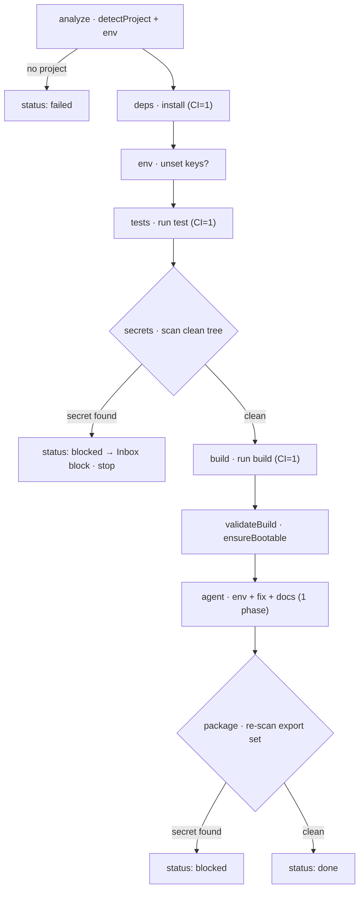
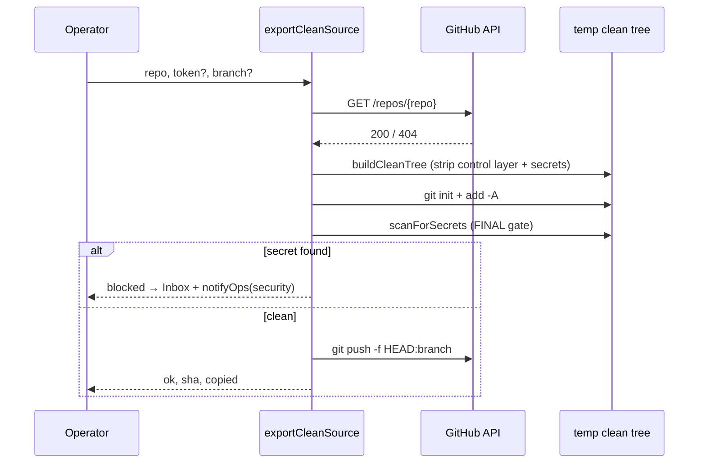

[← Docs index](./README.md) · [🇧🇷 Português](../pt/PREPARE_DEPLOY.md) · [✦ Constella](../../README.md)

# Prepare Deploy 🚀


The pre-launch sequence. Before any product leaves the central ship, **Prepare Deploy** runs a hybrid pipeline — deterministic engineering checks (real commands) plus one bundled agent phase — then strips Constella's entire internal control layer and ships only the clean product source to a separate repository. Every launch passes through a secret-scan airlock.

> Source of truth: [`src/server/prepare-deploy.ts`](../../src/server/prepare-deploy.ts), [`src/server/deploy-store.ts`](../../src/server/deploy-store.ts), [`src/server/git-scan.ts`](../../src/server/git-scan.ts), [`src/server/devserver.ts`](../../src/server/devserver.ts).

---

## 1. When to use 🌠

- A constellation finished building and you want to take the project to production.
- You need a **deterministic readiness check**: dependencies install, tests pass, a clean production build runs, and the app actually boots.
- You want to **document the environment** (`.env.example`, `README.md`, `DEPLOY.md`) before handing the project to a host.
- You want to publish **only the product** — without `.claude/`, planning docs, internal reports, or any control file — to a separate GitHub repository.
- You need certainty that **no secrets** are about to leave the ship.

---

## 2. How it works 🌌

Prepare Deploy is a **hybrid production-prep pipeline**. The system runs the deterministic engineering steps itself (real `install`, `test`, `build` commands; a boot gate; a secret scan), then hands a **single bundled agent phase** the remaining creative work (write `.env.example`, fix a broken build, write `README.md` / `DEPLOY.md`). The clean-export filter is the single source of truth shared by both the **preview** and the **export** — what you see in the preview is exactly what would be pushed.

Three deterministic, agent-free panels feed the UI:

| Panel | Server action | What it returns |
|-------|---------------|-----------------|
| **Environment snapshot** | `getDeployEnv()` → `detectDeployEnv(org.id)` | runtime, framework, package manager, required/undocumented env vars, DB type, ports, Dockerfile/compose, build & start scripts, mode |
| **Clean export preview** | `previewCleanExport()` → `buildPreview(org.id)` | the file tree that survives the filter, total bytes, included/ignored counts, docs found, and a **pre-export secret scan** |
| **Auto checklist** | `deployChecklist()` → `computeChecklist(...)` | a deterministic readiness checklist derived from the env snapshot + the last run's step statuses |

The current run state itself is read with `getDeployRun()` → `loadDeployRow(workspace.id)`.

### Persistence

One `deploy_run` row **per workspace** holds the latest run. The table is created idempotently at boot by `ensureDeployTables()` (`CREATE TABLE IF NOT EXISTS deploy_run … CREATE UNIQUE INDEX … ON deploy_run (workspace_id)`) — no `drizzle-kit push` needed. The row stores `status`, `runId`, the `steps[]`, the `checklist[]`, the last `buildLog`, the `summary`, the `lastExport` snapshot, and `startedAt` / `updatedAt`.

---

## 3. Environment snapshot — `getDeployEnv` 🪐

`detectDeployEnv(orgId)` is fully deterministic (no agent, no model call). It builds a `DeployEnv` object:

| Field | How it is detected |
|-------|--------------------|
| `detected` | `true` if `detectProject(orgId)` found a runnable project |
| `runtime` | `proj.kind` — one of `node` / `python` / `go` / `rust` / `static`, else `unknown` |
| `packageManager` | for Node, the resolved `runCmd` (`npm` / `pnpm` / `yarn`) |
| `framework` | `detectFramework(deps, runtime)` — maps deps to a label (Next.js / Nuxt / Remix / Angular / Svelte / Vue / React / Nest / Node server / Python·Go·Rust·Static service) |
| `projectName` / `runLabel` | `proj.name` / `proj.label` (e.g. `npm run dev`, `uvicorn`, `go run`) |
| `requiredEnv` | parsed from `.env.example` / `.env.sample` / `.env.template` via `parseEnvKeys` — each key gets a `hasValue` flag (placeholders like `your_`, `<…>`, `changeme`, `xxx`, `example` count as **no** value) |
| `referencedEnvCount` | total env keys referenced in source (`scanEnvRefs`) |
| `unsetEnvKeys` | env keys **used in code but not documented** in `.env.example` (minus `ENV_NOISE`: `NODE_ENV`, `PORT`, `HOST`, `PWD`, `HOME`, `PATH`, `CI`, `TZ`, `VERCEL`, `VERCEL_ENV`), sorted, capped at 40 |
| `database` | `detectDatabase(deps)` → `relational` / `document` / `key-value` / `none` |
| `ports` | parsed from `Dockerfile` `EXPOSE` lines and `docker-compose*` / `compose*` port mappings (capped at 12) |
| `hasDockerfile` / `hasCompose` | presence of a `Dockerfile` / a compose file |
| `buildScript` / `startScript` | `package.json` `scripts.build` / `scripts.start` |
| `mode` | `prod` if build output exists (`hasBuildOutput`), `dev` otherwise, `unknown` if no project |

`scanEnvRefs` walks source files (`.ts .tsx .js .jsx .mjs .cjs .py .go .rs .vue .svelte`, ≤1500 files, ≤512 KB each) and matches `process.env.X`, `process.env["X"]`, `import.meta.env.X`, `os.environ[...]`, `os.getenv(...)`, and Go's `os.Getenv(...)`.

---

## 4. Clean-export filter — `buildCleanTree` 🕳️

`buildCleanTree(tmp, orgId)` copies **only the clean product** into a temp directory. It is the shared engine behind both the preview and the export, so the preview is a faithful dry run. A workspace-relative path survives only if `isCleanProductPath(rel)` returns `true`.

A path is **stripped** when:

1. Its top-level segment is in `DENY_TOP` — Constella's control/planning layer **or** build/dep noise.
2. It starts with `.constella`.
3. It matches the `SENSITIVE` pattern (secrets / dumps / logs / local stores) **and** is not an allowed env template.

### What is removed

| Category | Entries |
|----------|---------|
| **Control / planning layer** (`DENY_TOP`) | `.claude`, `DOCS`, `PO`, `Reports`, `specs`, `issues`, `mock`, `uploads`, `archives`, `.testdev` |
| **Build / dependency noise** (`DENY_TOP`) | `node_modules`, `.git`, `.next`, `dist`, `build`, `out`, `coverage`, `.cache`, `.turbo`, `vendor` |
| **Sensitive files** (`SENSITIVE` regex) | `.env`, `.env.*`, `id_rsa*` / `id_dsa*`, `*.pem` `*.key` `*.p12` `*.pfx` `*.keystore` `*.jks` `*.ppk` `*.asc`, `credentials.json`, `service-account*.json`, `*.sql` `*.dump` `*.bak` `*.sqlite*` `*.db`, `*.log`, `*.local` |
| **Anything under** `.constella` | the runtime root marker |

### What is kept

Everything else — the real product source — **plus** allowed env templates that match `ALLOW_ENV` (`.env.example`, `.env.sample`, `.env.template`, `.env.dist`). After copying, `buildCleanTree` writes a fresh `.gitignore` (`EXPORT_GITIGNORE`) into the temp tree so the exported repo ignores `node_modules/`, build dirs, logs, and `.env*` (but keeps `!.env.example`). It returns `{ copied, docs, files }`, where `docs` collects root README / LICENSE / CHANGELOG / DEPLOY / CONTRIBUTING files.

> The control layer (`.claude/`, planning dirs) is what makes Constella a control plane. Export deliberately leaves it on the ship — only the product launches.

---

## 5. The pipeline — `runDeployPipeline` ✦

`runDeployPipeline()` runs nine steps in order. Each step persists to the `deploy_run` row **and** emits a `deploy` event so both the visual pipeline (polled) and the live narration box (`AgentRunLive`) show real state. A **re-entry guard** returns the current row early if a run is already `running` and started less than 15 minutes ago.

| # | Step `key` | Label | What it does |
|---|------------|-------|--------------|
| 1 | `analyze` | Analyze the project | `detectProject` + `detectDeployEnv`. **No project → `failed`** |
| 2 | `deps` | Validate dependencies | runs `proj.install` (`CI=1`, 300 s timeout); `done` / `error` / "already installed" |
| 3 | `env` | Validate environment variables | `needs-action` if `unsetEnvKeys` exist, else `done` |
| 4 | `tests` | Run tests | Node + `scripts.test` → `runCmd test` (`CI=1`, 300 s); else `needs-action` "no automated test script" |
| 5 | `secrets` | Security scan | `buildPreview` over the clean tree → **`blocked` stops the pipeline** if any secret is found |
| 6 | `build` | Production build | Node + `buildScript` → `run build` (`CI=1`, 600 s); failure → `error` (the agent will try to fix it) |
| 7 | `validateBuild` | Validate build | `ensureBootable` boot gate — does the app actually start? |
| 8 | `agent` | Configure env, fix & document | **one** bundled agent phase (see below) |
| 9 | `package` | Prepare clean package | `buildPreview` **again** (after the agent's edits); re-checks secrets, reports file count + size |

### The early secret gate

Step 5 is an **early gate**: it runs the full clean-tree secret scan *before* the build and the agent. If `buildPreview().blocked` is true, the step becomes `blocked`, a `block` item is pushed to the **Inbox**, and the run finalizes with status `blocked` — the build and agent never run. Fix the secrets and re-run.

### The agent phase

`pickDeployAgent` chooses the **DevOps** agent (role matches `/devops/i`), falling back to `ada`, then the first agent. `runFocusedAgent` makes one streamed call on the `deploy` channel (600 s timeout) and **books real cost** to the `costEntry` table. The instruction (`deployAgentInstruction`) tells it the deterministic steps already ran and to focus on the gaps, in order:

1. Create/refresh `.env.example` documenting **every** required env var (placeholders only, **never** real secrets) — the undocumented keys are injected into the prompt.
2. If the production build failed, **fix** the errors until it builds clean.
3. Write/refresh a root `README.md` and a root `DEPLOY.md` with concrete build/run/deploy steps for this host.
4. Finish with a short operator summary + exact next steps.

It is told to keep the existing product/UX and **never** add internal/control files or a second app.

### Finalization

`finalize(status, summary)` recomputes the checklist, persists `status` + `summary` + `buildLog`, emits a terminal `done` / `error` event, calls `notifyOps` (a `deploy` notification), and revalidates `/prepare-deploy`. Final status is `done`, `blocked` (secrets found in the export set after the agent), or `failed`.

---

## 6. Pipeline diagram 🛰️



---

## 7. Auto checklist — `computeChecklist` 🌠

Deterministic, derived from the env snapshot and the last run's step statuses. Each item has a `status` of `ok` / `warn` / `fail` / `todo`.

| `key` | Label | `ok` when |
|-------|-------|-----------|
| `pkg` | package.json valid / manifest present | Node: `package.json` parses; else: project detected |
| `deps` | Dependencies installed | `node_modules` exists or the `deps` step finished |
| `envExample` | `.env.example` present | a template exists or `requiredEnv` non-empty |
| `envComplete` | All used env vars documented | `unsetEnvKeys.length === 0` (else `warn`) |
| `secrets` | No secrets in the product | the `secrets` step is `done` (`blocked` → `fail`) |
| `build` | Production build runs | `buildScript` exists and the `build` step finished (no script → `warn`) |
| `tests` | Tests pass | `scripts.test` exists and the `tests` step finished (no script → `warn`) |
| `readme` | README present | `README.md` / `readme.md` exists |
| `deployDoc` | Deploy docs present | `DEPLOY.md` exists |
| `internalExcluded` | Internal files excluded from export | always `ok` (the filter guarantees it) |
| `exportRepo` | Export repository configured | a `github_pat` is vaulted |

---

## 8. Quick actions ⭐

Beyond the full pipeline, individual actions are available (each emits `deploy` events via `withDeployEvents`):

| Action | Function | Effect |
|--------|----------|--------|
| Build only | `runBuildOnly()` | Node `run build` (`CI=1`, 600 s); persists the `buildLog` |
| Tests only | `runTestsOnly()` | Node `run test` (`CI=1`, 300 s) |
| Generate README | `generateReadme()` → `genDocs("readme")` | one DevOps-agent call to write/refresh `README.md` |
| Generate deploy docs | `generateDeployDocs()` → `genDocs("deploy")` | one DevOps-agent call to write/refresh `DEPLOY.md` |

---

## 9. Clean source export — `exportCleanSource` 🚀

Pushes **only** the clean product to a **separate** GitHub repo — never the org workspace's bound `origin`. Input: `{ repo, token?, branch?, message? }`.

**Step by step:**

1. Normalize `repo` to `owner/repo` (strips a `https://github.com/` prefix and a `.git` suffix); reject anything that is not `owner/repo`.
2. Resolve the token: the provided `token`, else the vaulted `github_pat`. No token → error. The token is **redacted** from every returned string.
3. Verify the repo via `GET https://api.github.com/repos/{repo}` (12 s timeout). `404` → "Repo not found, or this token can't access it."
4. `buildCleanTree(tmp, org.id)` into a temp dir. **Nothing copied → error** ("no clean product source files were found").
5. `git init -b <branch>` (default `main`) → `git add -A`.
6. **FINAL secret gate** — `scanForSecrets(tmp)`. **Any** finding blocks the push regardless of the allowlist: a `block` lands in the **Inbox**, `notifyOps` fires a `security` alert, and the result is `{ ok:false, blocked:true, secrets }`.
7. Commit as `Constella Agents <agents@constella.dev>` (message defaults to `chore: export clean source`), grab the short SHA.
8. `git push -f https://x-access-token:<token>@github.com/<repo>.git HEAD:<branch>` (120 s timeout). Push failure → redacted error tail.
9. On success, persist `lastExport` (`{ ok, sha, copied, repo, branch, at }`) to the `deploy_run` row.



---

## 10. Examples 🪐

**Run the full pipeline** (from the Prepare Deploy page) — the system calls `runDeployPipeline()`; you watch nine steps and the live agent narration.

**Build only:**
```ts
const { ok, log } = await runBuildOnly();
```

**Export the clean product to a separate repo:**
```ts
const res = await exportCleanSource({
  repo: "my-org/my-product",   // or https://github.com/my-org/my-product(.git)
  branch: "main",
  message: "chore: export clean source",
});
// res = { ok, pushed, sha, copied }  |  { ok:false, blocked:true, secrets:[…] }  |  { ok:false, error }
```

---

## 11. Possible states 🕳️

**Run status** (`RunStatus`, the `deploy_run.status` column):

| State | Meaning |
|-------|---------|
| `idle` | no run yet (default row) |
| `running` | pipeline in progress (re-entry guarded for 15 min) |
| `done` | finished, clean |
| `blocked` | secrets found — early gate (step 5) or final package re-scan (step 9) |
| `failed` | no runnable project, or an unexpected error |

**Step status** (`StepStatus`): `waiting`, `running`, `done`, `error`, `blocked`, `needs-action`.

**Checklist status** (`ChecklistStatus`): `ok`, `warn`, `fail`, `todo`.

**Boot reconcile:** at startup `reconcileDeployRuns()` treats any `running` row as an orphan (its process died) — it flips the row to `failed` and any still-`running` step to `error` ("interrupted by restart").

---

## 12. Related integrations 🌌

- **GitHub** — `exportCleanSource` reuses the vaulted `github_pat`; the other path (commit the whole workspace to its bound `origin`) lives in [`GITHUB.md`](./GITHUB.md).
- **Test Dev** — the `validateBuild` step calls `ensureBootable` from the same dev-server engine documented in [`TEST_DEV.md`](./TEST_DEV.md).
- **Inbox** — secret gates push `block` items via `pushInbox` ([`INBOX.md`](./INBOX.md)).
- **Agents** — the agent phase runs the **DevOps** agent (Werner) ([`AGENTS.md`](./AGENTS.md)).
- **Deploy** — the actual launch from clean source to a host ([`DEPLOY.md`](./DEPLOY.md)).
- **Vault / Security** — secrets are vaulted and scrubbed; see [`SECURITY.md`](./SECURITY.md).

---

## 13. Security 🛡️

- **Two secret gates.** The pipeline's early gate (step 5) and the package re-scan (step 9) both run `scanForSecrets` over the clean tree; `exportCleanSource` runs a **third, final** scan at push time. Any finding blocks.
- **`scanForSecrets`** scans the files git *would* commit (working-tree changes, untracked included) — high-confidence patterns (AWS / GitHub / OpenAI·Anthropic / Google / Slack / private keys / JWT / DB URLs with credentials / Telegram tokens / hardcoded secrets) plus must-never-commit file types. Placeholders are ignored; binaries, files >2 MB, and build dirs are skipped. Previews are redacted (`abcd•••yz`).
- **Token redaction.** The export redacts the GitHub token from every returned string, so it never leaks into the UI, the Inbox, or a notification.
- **Separate target.** Export pushes to a **separate** repo, never the workspace's bound `origin` — the control layer cannot escape by accident.
- **Allowlist vs final net.** The clean filter keeps env templates (`.env.example`, etc.) but the final `scanForSecrets` blocks **any** inlined secret regardless of the allowlist.

---

## 14. Troubleshooting 🛰️

| Symptom | Likely cause / fix |
|---------|--------------------|
| Run finalizes `failed` immediately | "No runnable project detected" — `detectProject` found no manifest. Check the workspace root. |
| Stuck on `running` after a restart | `reconcileDeployRuns()` flips orphaned runs to `failed` at boot; reload the page. |
| `secrets` step `blocked` | A real secret is in the product. Open the Inbox block, remove it (use `.env` + a vaulted secret), re-run. |
| `build` step `error` | The agent phase will try to fix it; the build tail is in `buildLog`. Use **Build only** to iterate. |
| `tests` shows `needs-action` | No `scripts.test` (or non-Node runtime) — Constella has nothing to run. |
| Export "Nothing to export yet" | `buildCleanTree` copied 0 files — everything matched `DENY_TOP` / `SENSITIVE`, or the workspace has no product source. |
| Export "Repo not found" | The repo doesn't exist or the token lacks access — check the PAT scope. |
| Export `blocked` | The final secret scan found something; see the Inbox + security notification. |
| `validateBuild` says "toolchain unavailable" | The boot gate is **skipped** (not failed) when the runtime (python/go/rust) isn't installed — it cannot validate, so it does not block. |

---

## 15. Related links 🌠

- [`DEPLOY.md`](./DEPLOY.md) — launch the clean source to a host
- [`GITHUB.md`](./GITHUB.md) — connect a remote, commit the workspace, export clean source
- [`TEST_DEV.md`](./TEST_DEV.md) — the dev-server + headless test harness (boot gate)
- [`INBOX.md`](./INBOX.md) — where blocks surface
- [`AGENTS.md`](./AGENTS.md) — the DevOps agent that runs the agent phase
- [`SECURITY.md`](./SECURITY.md) — Vault, scrubbing, the FS jail
- [`WORKFLOW.md`](./WORKFLOW.md) — the full Goal → … → Done lifecycle
