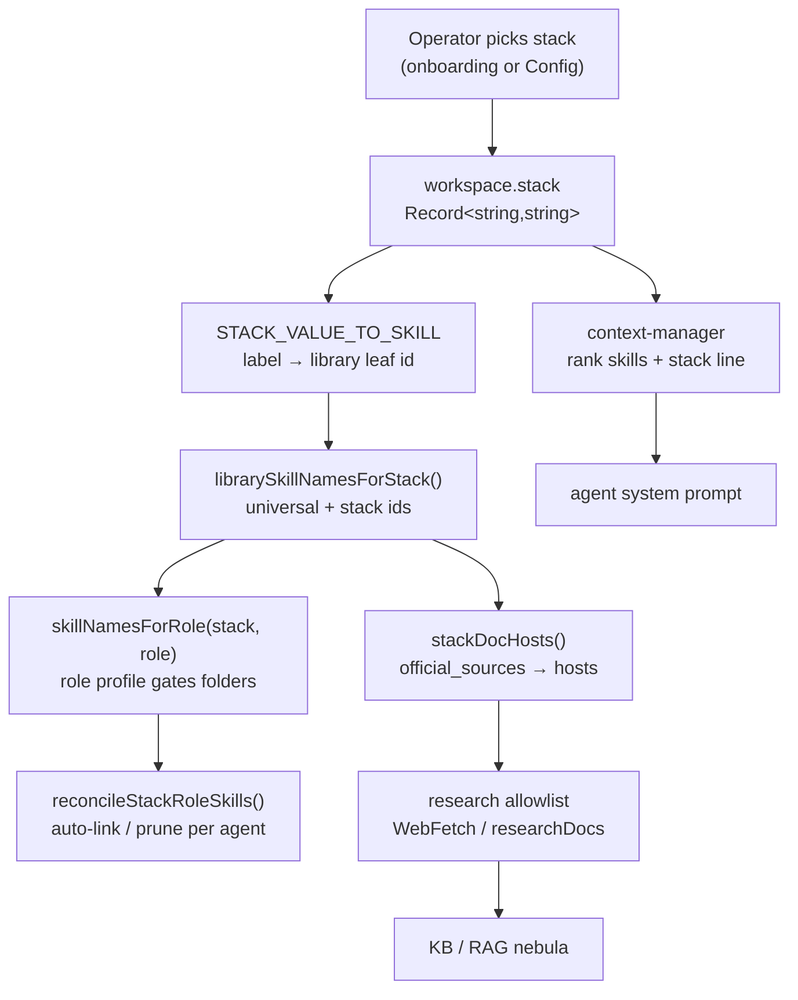
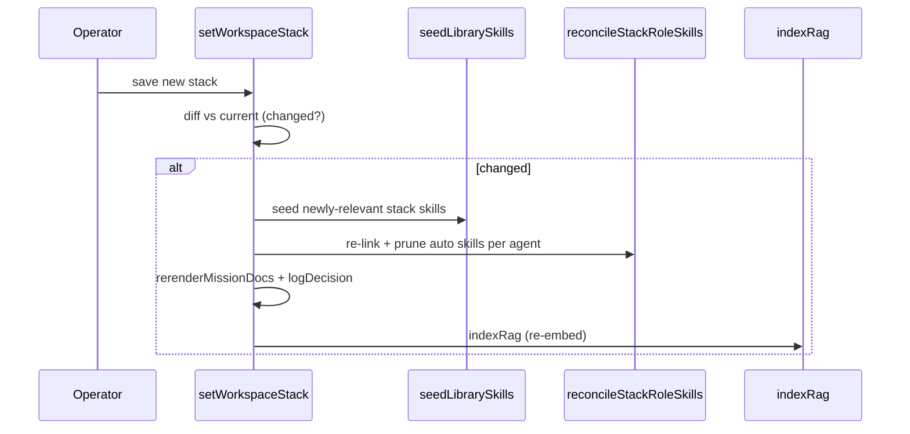

[← Docs index](./README.md) · [🇧🇷 Português](../pt/PROJECT_STACKS.md) · [✦ Constella](../../README.md)

# Project Stacks 🪐


The **project stack** is the technological star-chart of a workspace: a small map of which language, runtime, framework, database, ORM, styling, tests and infra the product is built on. From that chart Constella decides which native **skills** orbit each agent, which official-docs hosts its **web research** may reach, and what background colours the **RAG** memory nebula and every system prompt. Pick the stack once; the whole constellation re-aligns.

## When to use

- During **onboarding** — you choose the stack (or it is inferred from an imported project) before the first plan.
- Whenever the product's foundations change — adopt a new framework, swap a database, add a queue — open **Config → Project Stacks** and re-save. Every agent is re-linked, the stack-bearing docs are re-rendered, and RAG re-indexes.
- When an agent keeps reaching for the *wrong* framework's idioms: the stack is what tells a Vue project's Frontend to load `vue`, not `react`.

## How it works

A stack is a plain JSON map stored on the workspace row:

```ts
// src/db/schema.ts → workspace
stack: text("stack", { mode: "json" }).$type<Record<string, string>>().notNull().default({}),
```

Keys are **category keys** (`language`, `runtime`, `frontend`, …); values are the **catalog option labels** the operator picked (`"TypeScript"`, `"Next.js"`, `"PostgreSQL"`, `"None"`). The catalog of categories and their options lives in `src/data/stack-catalog.ts` (`STACK_CATS` — 16 categories, each option carrying a one-line description via `descFor`).

That map drives three downstream systems:

1. **Skills** — `STACK_VALUE_TO_SKILL` (in `src/data/stack-skill-map.ts`) maps each catalog label to a `skills/` library leaf id (`"Next.js" → "nextjs"`). `librarySkillNamesForStack(stack)` and `skillNamesForRole(stack, role)` (in `src/server/skills-library.ts`) turn the stack into the exact set of skills each agent should carry.
2. **Web research** — `stackDocHosts(stack)` reads the `official_sources` of the stack's skills and yields the documentation hostnames the central allowlist (`src/server/research.ts`) will permit.
3. **Context + RAG** — `src/server/context-manager.ts` ranks an agent's enabled skills by stack relevance and writes a one-line `stack: …` summary into the system prompt; `setWorkspaceStack` re-indexes RAG on a real change.

## Main flow 🌌



## Key concepts

| Concept | What it is | Source |
| --- | --- | --- |
| **Stack** | `Record<string,string>` of category → chosen label, on `workspace.stack` | `src/db/schema.ts` |
| **Catalog** | `STACK_CATS` — the 16 categories + options shown in the UI | `src/data/stack-catalog.ts` |
| **`STACK_VALUE_TO_SKILL`** | label → `skills/` leaf id; `"None"`/missing = no skill | `src/data/stack-skill-map.ts` |
| **Library skill** | a `SKILL.md` under root `skills/`, keyed by its **leaf folder name** | `src/server/skills-library.ts` |
| **Role profile** | which library folders a role auto-links (`stackPrefixes` vs `allPrefixes` + `core`) | `src/data/role-skill-profile.ts` |
| **`auto` link** | `agent_skill.auto = true` → system-managed (reconcile may touch it); `false` → operator hand-toggle (never touched) | `src/db/schema.ts` |
| **Reconciliation** | `reconcileStackRoleSkills(wsId)` — re-links/prunes auto skills to match stack+role | `src/server/seed-library-skills.ts` |
| **Compatibility** | `incompat()` / `stackNote()` — disable incoherent picks, warn on redundancy | `src/lib/stack-compat.ts` |

### From stack value to a library skill

`STACK_VALUE_TO_SKILL` is a flat dictionary. A **missing entry** or the literal `"None"` resolves to no skill (skipped). The skills-library loader additionally filters every mapped id to the ones that **actually exist on disk** — so an aspirational mapping with no `SKILL.md` degrades silently to a no-op.

```ts
// src/data/stack-skill-map.ts (excerpt)
"Next.js": "nextjs", React: "react", Vue: "vue", Django: "django",
PostgreSQL: "postgresql", Drizzle: "drizzle", "Tailwind CSS": "tailwind",
Playwright: "playwright", Docker: "docker", "Auth.js": "authjs",
```

### Universal vs stack vs role

- **Universal skills** (`UNIVERSAL_SKILL_NAMES`, ~23) ship to *every* workspace regardless of stack — clean-code, git-workflow, OWASP, testing pyramid, UI/UX principles, the process rituals, `research-official-docs`, etc.
- **Stack skills** are the ids `STACK_VALUE_TO_SKILL` produces from the chosen options.
- **Role gating** decides *which* agent gets *which* stack skill. `skillNamesForRole(stack, role)` consults `roleProfile(role)`: a role's `allPrefixes` folders are linked in full (design/engineering/process best practice), while `stackPrefixes` folders are linked **only for the picks the stack actually selected** — so a Vue project's Frontend gets `vue`, never `react` + `svelte`.

```ts
// src/server/skills-library.ts → skillNamesForRole
for (const [name, sk] of index) {
  if (prof.allPrefixes.some((p) => sk.relPath.startsWith(p))) out.add(name);
  else if (prof.stackPrefixes.some((p) => sk.relPath.startsWith(p)) && stackSet.has(name)) out.add(name);
}
```

## Tables

### Stack categories (`STACK_CATS`)

| Key | Label | Example options |
| --- | --- | --- |
| `language` | Language | TypeScript, Python, Go, Rust, Java, … |
| `runtime` | Runtime | Node.js, Bun, Deno, Python 3, JVM, .NET |
| `frontend` | Frontend | React, Vue, Svelte, Angular, SolidJS, … |
| `meta` | Meta-framework / SSG | Next.js, Nuxt, Remix, SvelteKit, Astro, … |
| `backend` | Backend framework | NestJS, Express, Django, FastAPI, Rails, … |
| `mobile` | Mobile | React Native, Flutter, Android, Ionic |
| `database` | Database | PostgreSQL, MySQL, SQLite, MongoDB, Redis |
| `orm` | ORM / Data layer | Prisma, Drizzle, TypeORM, SQLAlchemy, GORM |
| `styling` | Styling / UI | Tailwind CSS, CSS Modules, styled-components |
| `testing` | Testing | Jest, Vitest, Cypress, Playwright, Selenium |
| `aiml` | AI / ML | TensorFlow, PyTorch, scikit-learn, Pandas |
| `dataviz` | Data viz | D3, Chart.js, Grafana, Plotly |
| `container` | Container | Docker, Podman, containerd |
| `infra` | Infra / DevOps | Tailscale, Vercel, AWS, Kubernetes, Terraform |
| `baas` | Backend-as-a-service | Firebase, Appwrite, Amplify, Heroku, Supabase |
| `queue` | Queue / Cache | Redis, BullMQ, RabbitMQ, Kafka, Celery |
| `auth` | Auth | Auth.js, Clerk, Lucia, Keycloak, Auth0 |

> Each category also offers `"None"` (skip this category — no skill). Not every option in the catalog has a `STACK_VALUE_TO_SKILL` entry; unmapped picks simply contribute no stack skill (but still appear in the stack line and docs).

### Role → stack-folder gating (`role-skill-profile.ts`)

| Role match | `stackPrefixes` (gated by stack) | Pinned `core` (signature) |
| --- | --- | --- |
| CEO | *(none)* | app-planning, requirements-to-specs, specs-to-issues, architecture-before-code |
| Product Owner | *(none)* | product-discovery, requirements-to-specs, specs-to-issues, prioritization-moscow-rice |
| CTO | `stacks/` (all) | system-design-fundamentals, software-architecture-patterns, … |
| Frontend | `stacks/frontend/` `stacks/styling/` `stacks/meta/` `stacks/mobile/` `stacks/testing/` | design-systems, ui-ux-principles, responsive-layout, … |
| Backend | `stacks/backend/` `stacks/database/` `stacks/orm/` `stacks/queue/` `stacks/runtime/` `stacks/baas/` `stacks/auth/` | backend-fundamentals, api-design-rest-graphql, data-modeling, auth-and-authorization |
| Security | `stacks/auth/` | owasp-top-10, owasp-asvs, secrets-management, secure-auth-sessions |
| QA | `stacks/testing/` | testing-strategy-pyramid, tdd-and-coverage, unit-integration-e2e |
| DevOps | `stacks/infra/` `stacks/container/` `stacks/runtime/` | scalability-reliability, secrets-management |
| Docs | `stacks/` (all) | readme-generation |
| *(default)* | `stacks/` | *(none)* |

### `agent_skill` link columns

| Column | Meaning |
| --- | --- |
| `agentId`, `skillId` | composite primary key (the link) |
| `auto` | `true` = system-managed (stack/role auto-link, reconciled on boot & stack change); `false` = operator hand-toggled in the UI → **reconcile never touches it** |

## Reconciliation 🛰️

`reconcileStackRoleSkills(wsId)` (in `src/server/seed-library-skills.ts`) is the idempotent, LLM-free function that re-aligns every agent's auto-managed skills with the current stack + role. It runs:

- on **boot** (via `reconcileOnBoot` → `seedLibrarySkillsForExistingWorkspaces`),
- during **onboarding** (after seeding the whole library), and
- on every **stack change** (`setWorkspaceStack`).

For each agent it computes `desired = skillNamesForRole(stack, role)`, then:

- **Prunes** any `auto` link to a *library* skill that falls outside the role's profile for the current stack (manual hand-toggles and the non-library procedural skills like `open-pr`/`run-suite` are left untouched).
- **Adds** the role's desired skills that aren't linked yet, inserting them with `auto: true` (`onConflictDoNothing`).

```ts
// src/server/seed-library-skills.ts → reconcileStackRoleSkills (excerpt)
const desired = new Set(skillNamesForRole(stack, a.role).filter((n) => idByName.has(n)));
// prune AUTO links to LIBRARY skills outside this role's profile
if (l.auto && nm && libNames.has(nm) && !desired.has(nm)) { /* delete */ }
// add the role's skills not yet linked
if (sid && !present.has(sid)) { /* insert auto:true */ }
```

The whole native library (180+ skills) is **seeded** into every workspace so it shows in `/skills`, but only the stack+role subset is **auto-linked** to each agent. The rest stay available for the operator to enable by hand.



## Step-by-step

### Set or change a stack

1. Go to **Config → Project Stacks** (the `StackEditor`, `src/components/modules/stack-editor.tsx`).
2. Pick one option per category. Incoherent picks are disabled with a reason (e.g. choosing a Python backend under a JS language shows *"Requires a Python language"*); a redundancy note may appear (e.g. *"Django already ships its own ORM"*).
3. Click **Save stack & reload skills** → calls `setWorkspaceStack(sel)`.
4. On a real change the server seeds new stack skills, runs `reconcileStackRoleSkills`, re-renders the stack-bearing docs, logs a decision, and re-indexes RAG.
5. The UI confirms: *"Saved — agents re-linked to the new stack."*

### Inferred stack on import

When onboarding **imports** an existing repo, local dir or visual mock, the first plan analyses the project file-by-file (`src/server/analyze.ts`) and writes a "Tech stack & dependencies" section into `specs/SUPER-SPEC.md`. For a pure visual mock, the analyzer is instructed to **infer** the intended tech stack from the markup/styles/scripts and state it explicitly so the plan adopts it.

## Examples

A Next.js + Postgres + Drizzle + Tailwind + Playwright TypeScript app:

```json
{
  "language": "TypeScript",
  "runtime": "Node.js",
  "frontend": "React",
  "meta": "Next.js",
  "database": "PostgreSQL",
  "orm": "Drizzle",
  "styling": "Tailwind CSS",
  "testing": "Playwright",
  "container": "Docker",
  "auth": "Auth.js"
}
```

Resolved skill ids (`STACK_VALUE_TO_SKILL`): `typescript, node, react, nextjs, postgresql, drizzle, tailwind, playwright, docker, authjs` — plus the ~23 universals. The **Frontend** agent auto-links `react`, `nextjs`, `tailwind`, `playwright` + all of `design/`; the **Backend** agent auto-links `postgresql`, `drizzle`, `node`, `authjs`; the **CyberSec** agent auto-links `authjs` + all of `engineering/security/`.

`stackDocHosts(stack)` would then expand the research allowlist with the `official_sources` hosts of those skills (e.g. `nextjs.org`, `tailwindcss.com`, `orm.drizzle.team`), on top of `BASE_DOC_HOSTS`.

## Possible states

| State | What it means |
| --- | --- |
| `stack = {}` | Empty (default). Only universal skills link; research allowlist is the base set only. |
| Category = `"None"` | That category contributes no skill and no docs host. |
| Mapped + on disk | Skill id resolves and the `SKILL.md` exists → seeded + role-gated. |
| Mapped but no `SKILL.md` | Filtered out by `index.has(n)` → silent no-op. |
| Unmapped catalog option | No stack skill, but still shown in the prompt's stack line + docs. |
| Incompatible pick | `incompat()` returns a reason → the option card is disabled in the editor. |

## Related integrations

- **[Skills](./SKILLS.md)** — the native library, seeding, the `auto` link, provisional skills, toggles.
- **[Agents](./AGENTS.md)** — the 10-role roster whose roles drive `roleProfile`.
- **[KB & RAG](./KB_RAG.md)** · **[Memory RAG](./MEMORY_RAG.md)** — the memory nebula that re-indexes on stack change.
- **[AI Architecture](./AI_ARCHITECTURE.md)** — how the context-manager ranks stack skills into the prompt.
- **[Onboarding](./ONBOARDING.md)** — where the stack is first chosen or inferred.
- **[Plugins](./PLUGINS.md)** · **[Models](./MODELS.md)** — adjacent capability surfaces.

## Security 🕳️

- The stack is **operator-controlled data**, never agent-writable: it lives in the DB and is only edited via the `setWorkspaceStack` server action (behind `requireWorkspace`).
- `stackDocHosts` widens the research allowlist *only* to hosts declared in trusted `official_sources` frontmatter — agents cannot fetch arbitrary URLs through `researchDocs` (`hostAllowed` gate, `src/server/research.ts`).
- Reconciliation never deletes operator hand-toggles (`auto: false`) or the procedural (non-library) skills — a stack change cannot silently strip a capability you turned on by hand.

## Troubleshooting

| Symptom | Likely cause | Fix |
| --- | --- | --- |
| An agent ignores the chosen framework | Stack skill not linked / not on disk | Confirm the `STACK_VALUE_TO_SKILL` id has a `SKILL.md`; re-save the stack to re-run reconcile. |
| Wrong framework's skill keeps appearing | Stale auto link, or it's a hand-toggle | Re-save the stack (prunes stale autos); if hand-toggled (`auto:false`), toggle it off in `/skills`. |
| Research blocked on a docs host | Host not in `BASE_DOC_HOSTS` nor any skill's `official_sources` | Add the host to the relevant `SKILL.md` `official_sources`. |
| Editor disables an option | `incompat()` family mismatch | Align the language/runtime/backend/orm picks (see `stack-compat.ts`). |
| Skills didn't change after save | Stack value identical (no diff) | `setWorkspaceStack` only reconciles on a real change; pick a different value. |

## Related links

- [Skills](./SKILLS.md)
- [Agents](./AGENTS.md)
- [AI Architecture](./AI_ARCHITECTURE.md)
- [KB & RAG](./KB_RAG.md)
- [Memory RAG](./MEMORY_RAG.md)
- [Onboarding](./ONBOARDING.md)
- [Configuration](./CONFIGURATION.md)
- [Models](./MODELS.md)
- [Plugins](./PLUGINS.md)
