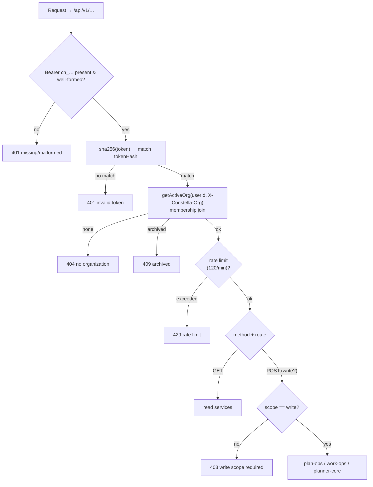

[← Docs index](./README.md) · [🇧🇷 Português](../pt/PUBLIC_API.md) · [✦ Constella](../../README.md)

# 🛰️ Public API — driving the ship from orbit


A small, honest REST surface (`/api/v1`) that lets external systems — scripts, CI jobs, a phone, or an MCP server — read project state and steer the constellation without a browser session. One bearer credential (a **Personal Access Token**), one dispatcher, one error envelope.

---

## When to use ✦

Use the Public API when you want to drive Constella from **outside** the web UI:

- A **CI pipeline** that approves a plan or flips 24/7 execution after a green build.
- A **mobile / shell script** that polls the morning review and counts.
- An **MCP host** (Claude Desktop, Cursor, …) — the bundled MCP server (see [MCP.md](./MCP.md)) is a thin outbound wrapper over exactly these v1 routes.
- A **status board** that lists goals, issues, tasks or specs.
- Asking the **Knowledge Base** a question programmatically.

If you instead want an external AI host to *consume* Constella as tools, you do not call these routes by hand — you point the MCP server at them. The two are the same surface seen from two distances.

---

## How it works 🌌

The whole API is **one dynamic catch-all route**: `src/app/api/v1/[[...path]]/route.ts`. It exports just `GET` and `POST`; both funnel into a single `dispatch()` function so that **authentication, scope, rate-limit and the response envelope live in exactly one place**.

Mutations do **not** reinvent logic. They reuse the same session-less cores the Telegram remote control uses:

- `approvePlanFor`, `setAuto247For`, `requestPlanChangesFor`, `reviewSummaryFor` → `src/server/plan-ops.ts`
- `cancelGoalFor`, `archiveGoalFor` → `src/server/work-ops.ts`
- `startNewWorkFor` → `src/server/planner-core.ts`
- `kbAnswer` → `src/server/kb.ts`
- Structured reads (`apiStatus`, `apiGoals`, `apiIssues`, `apiTasks`, `apiSpecs`) → `src/server/api/service.ts`

There is **no session, no cookie** on the v1 routes. The only credential is the PAT. The route also sets `runtime = "nodejs"` and `dynamic = "force-dynamic"` (it touches the database on every request).

### Response envelope

Every response is JSON with a uniform shape:

| Field   | Type      | Meaning                                  |
| ------- | --------- | ---------------------------------------- |
| `ok`    | `boolean` | `true` on success, `false` on error      |
| `data`  | any       | present when `ok: true`                  |
| `error` | `string`  | present when `ok: false`                 |

```jsonc
// success
{ "ok": true, "data": { /* … */ } }
// error
{ "ok": false, "error": "this token has read scope; a write-scope token is required" }
```

---

## Authentication 🔑 — Personal Access Tokens (`cn_…`)

A PAT is minted in the web UI (`createPAT` in `src/server/actions/profile-actions.ts`) and stored **hashed**, never in plaintext.

```ts
// profile-actions.ts (minting)
const raw = "cn_" + randomBytes(24).toString("base64url");
const tokenHash = createHash("sha256").update(raw).digest("hex");
// stored: { tokenHash, prefix: raw.slice(0,7), scope, name, userId }
```

Key properties:

- **Format** — `cn_` followed by a URL-safe base64 string (24 random bytes). The route accepts `cn_[A-Za-z0-9_-]{8,}`.
- **Shown once** — the raw `cn_…` value is returned by `createPAT` and displayed a single time. Only its **SHA-256 hash** (`tokenHash`) and a 7-char display `prefix` (e.g. `cn_a1b2`) are persisted in the `personalAccessToken` table. Lose it and you mint a new one.
- **Never logged** — `authenticatePAT` only ever hashes the incoming token and matches the hash; the plaintext token never reaches a log line.
- **Scope** — `read` (default) or `write`. Reads are open to any valid token; mutations require `write`.
- **Usage stamp** — every authenticated call best-effort updates `lastUsedAt` (a write hiccup never blocks auth).

### The handshake (`authenticatePAT`)

`src/server/api/pat-auth.ts` runs on every request:

1. Parse `Authorization: Bearer cn_…`. Malformed → **401** `missing or malformed bearer token`.
2. SHA-256 the token, look it up by `tokenHash`. No match → **401** `invalid token`.
3. Resolve the token owner's org via `getActiveOrg(userId, X-Constella-Org)`. This is a **membership join** — an `X-Constella-Org` value the user does not belong to is *ignored* (falls back to their first org), so a token can never be pointed at a foreign tenant. No org → **404**.
4. Archived org → **409** `organization is archived`.
5. Resolve the org's workspace via `getWorkspace`. None → **404**.

On success the request carries `{ userId, tokenId, scope, org, workspace }`.

### `X-Constella-Org`

Optional header. If a user belongs to multiple organizations, set `X-Constella-Org: <orgId>` to choose which one the token acts on. Omitted (or invalid) → the user's **first** org. The choice is always validated through the membership join.

---

## Rate limiting 🪐

A best-effort **sliding 60-second window**, keyed by `tokenId`, lives in memory in the single Next server process:

```ts
const RL_MAX = 120; // requests per token per 60s
```

Exceeding it returns **429** `rate limit exceeded (120 req/min)`. Because the counter is in-memory, a server restart resets it — acceptable for the single-operator design. There is no per-IP limit and no `Retry-After` header.

---

## Authorization flow 🌠



---

## Endpoints 📡

Base URL is your Constella host, e.g. `http://localhost:3000/api/v1`. All routes require the `Authorization` header; write routes additionally require a `write`-scope token.

### GET (read scope is enough)

| Method | Path                | Returns                                                            |
| ------ | ------------------- | ----------------------------------------------------------------- |
| GET    | `/api/v1` or `/me`  | `{ user, org{id,name}, workspace{id,name,slug}, scope }`          |
| GET    | `/api/v1/status`    | counts: goals, issues (`byCol`), tasks (`byCol`), plan summary    |
| GET    | `/api/v1/review`    | `{ text }` — the mobile-style review summary (`reviewSummaryFor`) |
| GET    | `/api/v1/goals`     | `[{ id, title, status, progress }]`                               |
| GET    | `/api/v1/issues`    | `[{ id, key, title, col, prio, points, moscow, approved }]`       |
| GET    | `/api/v1/tasks`     | `[{ id, key, title, col, prio }]`                                 |
| GET    | `/api/v1/specs`     | `[{ id, key, title, status, approved }]`                          |
| GET    | `/api/v1/kb?q=…`    | `{ text, sources }` — Knowledge Base answer (`kbAnswer`)          |

### POST (write scope, except `kb`)

| Method | Path                          | Body                       | Effect                                              |
| ------ | ----------------------------- | -------------------------- | --------------------------------------------------- |
| POST   | `/api/v1/plan/approve`        | —                          | Approve the plan, queue tasks (`approvePlanFor`)    |
| POST   | `/api/v1/plan/reject`         | `{ reason? }`              | Send the plan back with notes (`requestPlanChangesFor`) |
| POST   | `/api/v1/execution`           | `{ on?: boolean }`         | 24/7 autonomous execution on/off (`setAuto247For`) — defaults `on:true` |
| POST   | `/api/v1/work`                | `{ brief, title? }`        | Start a new unit of work (`startNewWorkFor`)        |
| POST   | `/api/v1/goals/{id}/cancel`   | —                          | Cancel a goal (`cancelGoalFor`)                     |
| POST   | `/api/v1/goals/{id}/archive`  | —                          | Archive a goal (`archiveGoalFor`)                   |
| POST   | `/api/v1/kb`                  | `{ q }`                    | Knowledge Base answer — **read-ish, no write scope needed** |

> `POST /api/v1/kb` is the deliberate exception: it mutates nothing, so it does not demand a `write` token. Every other POST does.

---

## Examples 🌠

Export your token once:

```bash
export CN_TOKEN="cn_xxxxxxxxxxxxxxxxxxxxxxxx"
export CN_BASE="http://localhost:3000/api/v1"
```

### Who am I

```bash
curl -s "$CN_BASE/me" -H "Authorization: Bearer $CN_TOKEN"
# { "ok": true, "data": { "user": "…", "org": { "id": "…", "name": "Acme" },
#   "workspace": { "id": "…", "name": "web", "slug": "web" }, "scope": "write" } }
```

### Project status & morning review

```bash
curl -s "$CN_BASE/status" -H "Authorization: Bearer $CN_TOKEN"
curl -s "$CN_BASE/review" -H "Authorization: Bearer $CN_TOKEN"
```

### List boards

```bash
curl -s "$CN_BASE/goals"  -H "Authorization: Bearer $CN_TOKEN"
curl -s "$CN_BASE/issues" -H "Authorization: Bearer $CN_TOKEN"
curl -s "$CN_BASE/tasks"  -H "Authorization: Bearer $CN_TOKEN"
curl -s "$CN_BASE/specs"  -H "Authorization: Bearer $CN_TOKEN"
```

### Ask the Knowledge Base

```bash
# GET form (query string)
curl -s "$CN_BASE/kb?q=how%20do%20we%20handle%20auth" -H "Authorization: Bearer $CN_TOKEN"

# POST form (JSON body) — also no write scope required
curl -s -X POST "$CN_BASE/kb" \
  -H "Authorization: Bearer $CN_TOKEN" -H "Content-Type: application/json" \
  -d '{"q":"how do we handle auth"}'
```

### Approve / reject a plan (write scope)

```bash
curl -s -X POST "$CN_BASE/plan/approve" -H "Authorization: Bearer $CN_TOKEN"

curl -s -X POST "$CN_BASE/plan/reject" \
  -H "Authorization: Bearer $CN_TOKEN" -H "Content-Type: application/json" \
  -d '{"reason":"split the auth issue in two"}'
```

### Toggle 24/7 execution (write scope)

```bash
curl -s -X POST "$CN_BASE/execution" \
  -H "Authorization: Bearer $CN_TOKEN" -H "Content-Type: application/json" \
  -d '{"on":true}'
# { "ok": true, "data": { "auto247": true } }
```

### Launch new work (write scope) 🚀

```bash
curl -s -X POST "$CN_BASE/work" \
  -H "Authorization: Bearer $CN_TOKEN" -H "Content-Type: application/json" \
  -d '{"title":"Password reset","brief":"Add a forgot-password flow with email tokens"}'
```

### Cancel / archive a goal (write scope) 🕳️

```bash
curl -s -X POST "$CN_BASE/goals/$GOAL_ID/cancel"  -H "Authorization: Bearer $CN_TOKEN"
curl -s -X POST "$CN_BASE/goals/$GOAL_ID/archive" -H "Authorization: Bearer $CN_TOKEN"
```

### Pointing a token at a specific org

```bash
curl -s "$CN_BASE/status" \
  -H "Authorization: Bearer $CN_TOKEN" \
  -H "X-Constella-Org: $ORG_ID"
```

---

## Possible states 🛰️

| HTTP | `error`                                                   | Cause                                                       |
| ---- | -------------------------------------------------------- | ---------------------------------------------------------- |
| 200  | —                                                        | success (`ok: true`)                                       |
| 400  | `missing ?q=` / `missing body.q`                         | KB query with no question                                  |
| 400  | `could not start work` (or core message)                | `POST /work` with empty `brief`                            |
| 401  | `missing or malformed bearer token`                      | no `Authorization`, or not `Bearer cn_…`                   |
| 401  | `invalid token`                                          | token hash not in `personalAccessToken`                    |
| 403  | `this token has read scope; a write-scope token is required` | mutating route with a `read` token                     |
| 404  | `no organization for this token's user`                  | token owner has no org                                     |
| 404  | `no workspace for the organization`                      | org has no workspace                                       |
| 404  | `unknown GET /…` / `unknown POST /…` / `goal not found`  | bad route or missing goal                                  |
| 409  | `organization is archived`                               | the org behind the token is archived                       |
| 429  | `rate limit exceeded (120 req/min)`                      | more than 120 requests/token in 60s                        |
| 500  | (error message)                                          | unexpected exception (caught at the `GET`/`POST` boundary) |

---

## Related integrations 🌌

- **[MCP.md](./MCP.md)** — the outbound MCP server (`scripts/mcp-server.mjs`) is a stdio wrapper over these exact routes; an external AI host drives Constella through it using the same `cn_…` PAT.
- **[TELEGRAM.md](./TELEGRAM.md)** — the Telegram remote control shares the very same session-less cores (`plan-ops.ts`, `work-ops.ts`, `planner-core.ts`).
- **[CHAT_COMMANDS.md](./CHAT_COMMANDS.md)** — the slash commands map to the same actions you reach over HTTP here.
- **[WORKFLOW.md](./WORKFLOW.md)** / **[GOALS_SPECS_ISSUES.md](./GOALS_SPECS_ISSUES.md)** — the Goal → Spec → Issue → Plan lifecycle that `status`, `plan/approve` and `work` operate on.

---

## Security 🕳️

- **Hashed at rest** — only the SHA-256 `tokenHash` and a 7-char display `prefix` are stored; the raw `cn_…` is shown once and never persisted or logged.
- **Tenant isolation** — `getActiveOrg` joins through `member`, so a token can only act on orgs its owner belongs to; a forged `X-Constella-Org` is silently ignored.
- **Scope gate** — every mutation calls `needWrite()` and returns **403** for `read` tokens. The only POST that skips it is `/kb` (a pure read).
- **Revocation** — `revokePAT` (profile UI) deletes the row; the next request with that token gets **401 invalid token**.
- **No session bleed** — the v1 routes never read cookies or sessions; a stolen browser session cannot be replayed here, and a stolen PAT cannot reach the authenticated web UI.
- **Transport** — there is no built-in TLS. Behind `start`/`auth` mode the server binds loopback (`127.0.0.1`); for `vps`/`portable` (bind `0.0.0.0`) put it behind a TLS reverse proxy / tailnet and treat the PAT as a password. See [SECURITY.md](./SECURITY.md), [VPS_MODE.md](./VPS_MODE.md).

---

## Troubleshooting 🛠️

| Symptom                                   | Likely cause / fix                                                                 |
| ----------------------------------------- | ---------------------------------------------------------------------------------- |
| `401 missing or malformed bearer token`   | Header must be exactly `Authorization: Bearer cn_…`; check for a stray space/quote. |
| `401 invalid token`                       | Token revoked or mistyped. Mint a fresh one in **Profile → Personal Access Tokens**; it is shown once. |
| `403 … write-scope token is required`     | You used a `read` token on a mutation. Create a `write`-scope token.               |
| `404 no organization` / `no workspace`    | The token's user has no org/workspace yet — finish [ONBOARDING.md](./ONBOARDING.md). |
| `409 organization is archived`            | Un-archive the org, or use a token whose org is active.                            |
| `429 rate limit exceeded`                 | You crossed 120 req/min for that token; back off (the window is a sliding 60s).    |
| Wrong org's data returned                 | Pass `X-Constella-Org: <orgId>`; an invalid value falls back to the first org.     |
| `400 missing ?q=` / `missing body.q`      | KB needs a non-empty question — `?q=…` for GET, `{"q":"…"}` for POST.              |
| Connection refused from another machine   | In `start`/`auth` mode the server is loopback-only; use `vps`/`portable` or a proxy. |

---

## Related links

- [MCP.md](./MCP.md) — outbound MCP server over these routes
- [TELEGRAM.md](./TELEGRAM.md) — Telegram remote control (shared cores)
- [CHAT_COMMANDS.md](./CHAT_COMMANDS.md) — slash commands
- [WORKFLOW.md](./WORKFLOW.md) — the work lifecycle
- [GOALS_SPECS_ISSUES.md](./GOALS_SPECS_ISSUES.md) — goals, specs, issues
- [SECURITY.md](./SECURITY.md) — vault, secrets, auth
- [VPS_MODE.md](./VPS_MODE.md) · [PORTABLE_MODE.md](./PORTABLE_MODE.md) — remote / portable binds
- [CONFIGURATION.md](./CONFIGURATION.md) — env vars and ports
