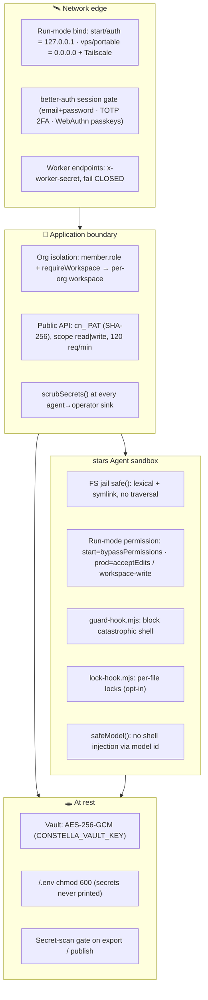

[← Docs index](./README.md) · [🇧🇷 Português](../pt/SECURITY.md) · [✦ Constella](../../README.md)

# Security 🕳️

> The shields around the central ship. Autonomous agents run *real* CLIs in a *real* workspace, so every layer here is load-bearing — a filesystem jail keeps each constellation in its own orbit, a vault encrypts secrets at rest, scrubbers strip credentials before they ever leave gravity, and hardened auth guards the front door.

Constella runs autonomous agents that drive `claude` / `codex` (and other) CLIs as subprocesses, with edit and (in `start` mode) full shell access to a real project directory. Nothing is sandboxed by pretending — security is achieved with concrete, layered controls. This page documents what the code actually enforces, file by file.

---

## ✦ When to use this page

- You are deploying Constella where more than one human (or the open internet) can reach it — read **Auth**, **Worker secret**, **SSRF guard**.
- You want to understand the **agent blast radius**: what an agent can and cannot do to the host (FS jail, command guard, run-mode sandbox).
- You are auditing how **secrets** are stored, encrypted, and prevented from leaking (Vault, scrub, secret-scan gates).
- You are reviewing the threat model before shipping (`vps` / `portable` modes).

---

## 🌌 How it works — defense in depth

Constella layers independent controls so no single failure is catastrophic. The model an agent runs through is already told (prompt-injection clause) never to reveal secrets or run destructive commands; every control below is *belt-and-suspenders* applied at the boundary, never trusting the model alone.

---

## 🪐 Main flow

1. **Boot** — the launcher (`bin/constella.mjs`) generates and persists three real secrets to `<HOME>/.env` (mode `0600`): `BETTER_AUTH_SECRET`, `CONSTELLA_VAULT_KEY`, `CONSTELLA_WORKER_SECRET`. They are never printed.
2. **Auth gate** — `start` mode auto-signs-in a local operator (loopback only); `auth` / `vps` / `portable` require a real credential (`assertAuthSecret()` fails closed without a signing secret).
3. **Request → workspace** — `requireWorkspace()` resolves the active org via a `member` join; all filesystem access goes through `safe()`, which keys by the stable `organization.id` and refuses traversal.
4. **Agent run** — the runner spawns the CLI inside the org workspace `cwd`. Run-mode picks the permission level; PreToolUse hooks (`guard-hook.mjs`, optional `lock-hook.mjs`) sit in front of every Bash/Write/Edit.
5. **Reply → operator** — any text an agent could echo is passed through `scrubSecrets()` before it reaches Telegram, the Team Room, DMs, notifications, or the public API.
6. **Export / publish** — a clean tree is built and a secret-scan gate blocks the operation on *any* finding.

---

## 🌠 Key concepts

| Concept | Where | One-line guarantee |
| --- | --- | --- |
| **FS jail** | `src/lib/fs-workspace.ts` `safe()` | No path escapes the org workspace — lexically *and* through symlinks. |
| **Vault** | `src/lib/vault.ts` | API keys / PATs are AES-256-GCM encrypted at rest; never reach the client. |
| **Secret scrub** | `src/lib/scrub.ts` `scrubSecrets()` | Strips known env secrets + credential shapes from every agent→operator sink. |
| **Command guard** | `bin/guard-hook.mjs` | Blocks catastrophic shell (`rm -rf /`, force-push, `mkfs`, fork-bomb…). |
| **File locks** | `src/server/file-locks.ts` + `bin/lock-hook.mjs` | Parallel agents can't clobber the same file. |
| **Run-mode sandbox** | `src/server/adapters/cli.ts` | `start` = full shell; prod = edits-only (`acceptEdits` / `workspace-write`). |
| **Auth** | `src/lib/auth.ts` | better-auth email+password, TOTP 2FA, WebAuthn passkeys, 30-day sessions. |
| **Org roles** | `src/db/schema.ts` `member` | `owner` \| `admin` \| `member`. |
| **Worker secret** | `bin/worker.mjs` + endpoints | Privileged cron/sync/poll endpoints require `x-worker-secret`. |
| **SSRF guard** | `bin/worker.mjs` | The worker secret only ever travels to a loopback host. |

---

## 🛰️ The filesystem jail

Every organization owns one isolated directory: `<constellaHome>/organizations/<orgId>/workspace/`. Access is funneled through `safe(root, rel)` in `src/lib/fs-workspace.ts`, which enforces **two** independent checks:

1. **Lexical** — `join(root, rel)` is normalized; if the result is not `root` and does not start with `root + sep`, it throws `Path escapes workspace`. Because `join` re-roots absolute, drive-letter and UNC inputs under `root`, those collapse harmlessly.
2. **Symlink** — even a lexically-clean path is re-checked against the *real* path of its nearest existing ancestor (`realAncestor` + `realpathSync.native`). A prompt-injected agent that plants a symlink inside the workspace cannot tunnel out to another org's root or the wider disk.

The org id itself is validated by `assertOrgId()` (`/^[A-Za-z0-9_-]{6,64}$/`) before it ever reaches a path — `.`, `/`, `\`, `..` are rejected at the door. The workspace key is the **stable** `organization.id`, never the renameable slug, so renames never re-home or leak data.

> 🌌 *Each constellation orbits inside its own gravity well; `safe()` is the event horizon nothing crosses.*

---

## 🔒 Vault — secrets at rest (AES-256-GCM)

`src/lib/vault.ts` encrypts every stored secret (provider API keys, the GitHub PAT, the Telegram bot token, allowlists) with **AES-256-GCM**:

- The key comes from `CONSTELLA_VAULT_KEY` — a 32-byte value, base64-decoded; `key()` throws if it is missing or not exactly 32 bytes.
- `putSecret()` generates a fresh 12-byte random IV per write, appends the GCM auth tag to the ciphertext, and stores base64 in the `vault` table (`ciphertext`, `iv`). It is **single-valued per `(workspaceId, ref)`**: the old row is deleted before insert, so `getSecret()`'s first-row read can never serve a stale token.
- `getSecret()` splits off the 16-byte tag, sets it, and decrypts — a tampered ciphertext fails the GCM tag check.
- `delSecret()` backs the revoke-token path. `maskSecret()` is the only thing the UI ever sees (`abc••••••wxyz`); **plaintext never reaches the client and never lands on a `provider` row.**

| Column | Meaning |
| --- | --- |
| `workspaceId` | Owning workspace (cascade-deleted with the org). |
| `providerId` | Optional link to a `provider` row. |
| `ref` | Logical name, e.g. `openai_api_key`, `github_pat`, `telegram_bot_token`. |
| `ciphertext` | Base64 of `enc‖tag`. |
| `iv` | Base64 of the 12-byte GCM nonce. |

---

## 🧹 Secret scrubbing

`src/lib/scrub.ts` is the last line before any agent text reaches a human-facing sink (Telegram, Team Room, DMs, notifications, public API, logs). `scrubSecrets(text, extra)`:

- Redacts the three env secrets `CONSTELLA_VAULT_KEY`, `BETTER_AUTH_SECRET`, `CONSTELLA_WORKER_SECRET` (plus any caller-supplied `extra` values ≥ 8 chars) by literal replacement → `[redacted]`.
- Redacts high-confidence inline **credential shapes** via one combined regex: OpenAI/Anthropic `sk-…`, GitHub `gh[posru]_…` and `github_pat_…`, AWS `AKIA…`, Google `AIza…`, Slack `xox[baprs]-…`, JWTs, PEM private keys, the Constella PAT `cn_…`, and Telegram bot tokens.
- **Never throws.** `redactForLog()` is the same scrub for log lines that interpolate tool output.

The same shapes drive the git/export/publish secret-scan gates, so a credential pattern is treated identically whether it would be *echoed* or *committed*.

---

## 🛡️ Command guard

`bin/guard-hook.mjs` is a Claude Code **PreToolUse** hook injected (when `cmdGuard` is on — **opt-in, default off**) by `src/server/adapters/cli.ts`. Before any `Bash` run it matches the command against a narrow deny-list and, on a hit, writes a reason to stderr and exits `2` (Claude Code feeds stderr back to the model as a block):

| Blocked pattern | Reason |
| --- | --- |
| `rm -rf /` · `~` · `$HOME` · `/*` · `..` | recursive force-delete of a root / home / cwd path |
| `git push … --force` / `-f` / `--force-with-lease` | force-push to a git remote |
| `git reset --hard … origin/` | hard reset onto a remote ref |
| `:(){ :|:& };:` | fork bomb |
| `mkfs[.fs]` | filesystem format |
| `dd … of=/dev/…` | raw write to a device |
| `> /dev/sd…|nvme…|disk…|mapper…` | redirect over a raw disk device |
| `chmod -R 000` | recursive chmod 000 |
| `shutdown` / `reboot` / `halt` / `poweroff` | power / shutdown command |
| `curl\|wget … \| sh/bash/zsh` | pipe a downloaded script straight into a shell |

It is **intentionally narrow** (only unambiguous, low-false-positive shapes) and **fails open** on everything else, so a legit run is never hard-stalled. Denials are appended to `.claude/guard-denials.jsonl` (a `.jsonl`, so RAG — which indexes only `.md` — never retrieves it). Toggle via per-workspace `settings.agents.cmdGuard` or env `CONSTELLA_AGENT_CMD_GUARD` (**default off — opt-in**, `=1` enables). It is opt-in because it shares the lock hook's clean-config-dir isolation, which relocates `CLAUDE_CONFIG_DIR` and can drop the agent's CLI login; when enabled, `agentClaudeDir()` mirrors the operator's credentials **and** account state so the agent stays logged in.

---

## 🔐 File locks (parallel-agent safety)

`bin/lock-hook.mjs` (PreToolUse on `Write|Edit|MultiEdit|NotebookEdit`) is injected only when `CONSTELLA_AGENT_LOCK_HOOK=1` (or per-workspace `settings.agents.fileLocks`). Before an edit it POSTs to `/api/locks/acquire` (loopback, `x-worker-secret`). The server side (`src/server/file-locks.ts`):

- `acquireLock()` is one row per `(workspaceId, path)`. The **same** task or agent re-acquires (heartbeat); anyone else gets a `423` with `heldBy`, and the hook tells the model to edit a different file.
- `normalizeLockPath()` skips base/config dirs (`.git/`, `.claude/`, `archives/`) and rejects anything outside the workspace.
- `releaseLocksForTask()` frees locks on task completion; `reclaimStaleLocks(ttlMs = 5min)` reclaims locks from a crashed run by heartbeat TTL (crash safety).

Both hooks **fail open** on any unexpected condition (no context, network glitch, non-edit tool) — a hook problem must never hard-stall a run.

> 🪐 *Two agents in the same orbit can't collide on the same file — the lock is the right-of-way.*

---

## stars Agent sandbox by run-mode

`src/server/adapters/cli.ts` decides how much power an agent's CLI gets, **driven by `CONSTELLA_RUN_MODE`** (overridable with `CONSTELLA_AGENT_FULL_ACCESS=1|0`):

| Run mode | Bind | `AGENT_FULL_ACCESS` | claude `--permission-mode` | codex `-s` sandbox | Network/exec |
| --- | --- | --- | --- | --- | --- |
| `start` (local) | `127.0.0.1` | **on** (default) | `bypassPermissions` | `danger-full-access` | full: install deps + run tests |
| `auth` | `127.0.0.1` | off | `acceptEdits` | `workspace-write` | edits-only, no network |
| `vps` | `0.0.0.0` | off | `acceptEdits` | `workspace-write` | edits-only — *plus* the Tailscale-private host is the hard boundary |
| `portable` | `0.0.0.0` | off | `acceptEdits` | `workspace-write` | edits-only |

Defense-in-depth: prod modes already run on a private host behind Tailscale (the tailnet-only host is the real boundary); the CLI stays restricted on top. Two more agent-spawn protections:

- **Vanilla agents** — agents run independent of the operator's personal `~/.claude` hooks/plugins via a `--settings {disableAllHooks:true}` overlay (or a clean `CLAUDE_CONFIG_DIR` carrying only Constella's lock/guard hooks). Auth stays intact (the operator's credentials are copied in).
- **No shell injection via model id** — `safeModel()` / `safeModelSlash()` validate the model string (which originates from agent-writable `Agent.md` frontmatter) against a strict charset before it reaches argv on a `shell: true` spawn, so `sonnet"; rm -rf ~` can't be re-parsed by the shell. Git/`gh` calls use `shell: false` so branch/message/path args are passed literally.

---

## 🚀 Auth, 2FA, passkeys & roles

`src/lib/auth.ts` configures **better-auth** over the drizzle adapter:

- **Email + password** — always enabled (`autoSignIn: true`, no email verification). Required for `auth` / `vps` / `portable`.
- **`start` mode** auto-signs-in the local operator (a per-install random password kept in `~/.constella/.env` as `CONSTELLA_OPERATOR_PW`, never shown — no predictable default), so the login screen is skipped — local, loopback-only. `auth` keeps the **same** operator and asks you to set a password on it the first time.
- **TOTP 2FA** — the `twoFactor()` plugin powers real TOTP; secrets live in the `two_factor` table (TOTP secret + backup codes).
- **WebAuthn passkeys** — custom `/api/passkey/*` routes on `@simplewebauthn`; credentials in the `passkey` table (base64url COSE public key, counter, transports). `src/lib/passkey.ts` keeps the relying-party id = bare hostname (`rpID()`), expected origin = full base URL, and stashes challenges in short-lived (`maxAge: 300`) httpOnly cookies between options/verify round-trips.
- **Sessions** — `expiresIn` 30 days. Cookies are marked `Secure` whenever the app is served over HTTPS (`useSecureCookies` keyed off the base URL) — so an `auth`/`portable` install behind an HTTPS proxy or Tailscale is protected, while local `start` http stays relaxed.
- **Fail-closed signing** — `assertAuthSecret()` (called once at boot) **throws** if `BETTER_AUTH_SECRET` is missing; it is required in every install (the launcher persists one per runtime root), since without it sessions would be forgeable.
- **Org roles** — the `member` table carries `role: owner | admin | member` (default `owner`). After login, `requireWorkspace()` resolves the active org via a `member` join, so a session never points at another tenant's org.

Social providers (`github`, `google`) are only registered when their `*_CLIENT_ID` / `*_CLIENT_SECRET` env vars are present; the GitHub OAuth `repo` scope lets a login double as a commit/push token (stored on the `account` row).

---

## 🛰️ Worker secret & SSRF guard

The worker (`bin/worker.mjs`) holds the privileged `CONSTELLA_WORKER_SECRET` and attaches it as the `x-worker-secret` header to its calls. Two safety properties:

1. **Privileged endpoints fail CLOSED.** `/api/cron/tick`, `/api/sync/file`, `/api/locks/acquire`, `/api/telegram/poll` all reject (`401`) unless `x-worker-secret` matches the configured secret. Without a configured secret, `/api/cron/tick` refuses to run at all — otherwise anyone could trigger real, token-spending agent execution across every workspace.
2. **SSRF / secret-exfil guard.** Whoever controls the env (systemd unit, Docker env, shell) could point `CONSTELLA_BASE_URL` at an attacker host and harvest the secret. So the worker computes `baseHost` and refuses to send the secret to any non-loopback host (`localhost`, `127.0.0.1`, `::1`) unless `CONSTELLA_ALLOW_REMOTE_WORKER_BASE_URL=1` is set explicitly. A remote `http://` base (with the override on) prints a cleartext warning. The launcher always sets the worker's base to `http://127.0.0.1:<port>` — loopback even in `vps` / `portable` — so the default is safe.

---

## 🔭 The boot secrets

`bin/constella.mjs` persists three secrets under the runtime root, generating each once and reusing it across restarts (so sessions and the encrypted vault survive a restart):

| Secret | Generator | Used for |
| --- | --- | --- |
| `BETTER_AUTH_SECRET` | `randomBytes(32).base64url` | Signs better-auth sessions (forgeable without it). |
| `CONSTELLA_VAULT_KEY` | `randomBytes(32).base64` | AES-256-GCM key for the vault. |
| `CONSTELLA_WORKER_SECRET` | `randomBytes(24).base64url` | Authorizes the privileged worker endpoints. |

They are written to `<HOME>/.env` with `mode: 0600` (then `chmodSync(0o600)` best-effort on Windows) and **never printed** — boot logs only `Secrets ready (stored in <ENV_FILE>, never printed).`

---

## ✦ Public API surface

The Public API (`/api/v1/*`) authenticates with a **Personal Access Token** `cn_<token>` — only its **SHA-256 hash** is stored in `personal_access_token` (plaintext shown once at creation). Tokens carry a `scope` (`read` | `write`), are rate-limited to **120 req/min/token**, and an optional `X-Constella-Org` header selects the org. See [PUBLIC_API.md](./PUBLIC_API.md) and [MCP.md](./MCP.md).

---

## 🪐 Possible states

| State | Trigger | Effect |
| --- | --- | --- |
| **Boot refused** | network mode, no `BETTER_AUTH_SECRET` | `assertAuthSecret()` throws — server won't start. |
| **Worker refused** | non-loopback base, no override | Worker exits 1 (SSRF guard). |
| **401 unauthorized** | missing/wrong `x-worker-secret` | Cron/sync/lock/telegram endpoint rejects. |
| **Path escape blocked** | traversal or symlink escape | `safe()` throws `Path escapes workspace`. |
| **Command blocked** | catastrophic shell | guard-hook exits 2, model reads the reason. |
| **423 file locked** | another agent holds the file | lock-hook tells the model to edit elsewhere. |
| **Export/publish blocked** | secret-scan finding | export/publish aborts before pushing. |
| **Vault key invalid** | missing / wrong-length key | `key()` throws; secrets can't be read/written. |

---

## 🛰️ Related integrations

- [VPS_MODE.md](./VPS_MODE.md) · [PORTABLE_MODE.md](./PORTABLE_MODE.md) — the network-exposed install methods and their gating.
- [ARCHITECTURE.md](./ARCHITECTURE.md) — the org isolation, sync engine and worker process.
- [AGENTS.md](./AGENTS.md) · [AI_ARCHITECTURE.md](./AI_ARCHITECTURE.md) — how agents execute (the sandbox lives here).
- [PUBLIC_API.md](./PUBLIC_API.md) · [MCP.md](./MCP.md) — PATs, scopes and rate limits.
- [PREPARE_DEPLOY.md](./PREPARE_DEPLOY.md) · [DEPLOY.md](./DEPLOY.md) · [PUBLISHING.md](./PUBLISHING.md) — clean-tree builds and the secret-scan gates.

---

## 🕳️ Troubleshooting

| Symptom | Likely cause | Fix |
| --- | --- | --- |
| Server won't boot (auth secret) | `BETTER_AUTH_SECRET` not set | Let the launcher generate it, or set it in `<HOME>/.env`. |
| Worker exits with "Refusing to send the worker secret…" | `CONSTELLA_BASE_URL` is non-loopback | Use `127.0.0.1`, or set `CONSTELLA_ALLOW_REMOTE_WORKER_BASE_URL=1` (and prefer `https://`). |
| Agent can't run `npm install` / tests | prod mode (`acceptEdits` jail) | Expected; set `CONSTELLA_AGENT_FULL_ACCESS=1` only if you accept the risk. |
| A legit command is blocked | guard-hook deny match | Run it yourself, or disable via `settings.agents.cmdGuard` / `CONSTELLA_AGENT_CMD_GUARD=0`. |
| Agents talk in the operator's voice | operator `~/.claude` hooks leaked in | Ensure the vanilla `disableAllHooks` overlay applies (default); check creds copy. |
| "Path escapes workspace" error | symlink or traversal in a workspace path | Intentional — the FS jail blocked it. |
| Cron endpoint returns 401 | missing/stale `x-worker-secret` | Confirm the worker inherits `CONSTELLA_WORKER_SECRET` from the same process env. |
| Passkey button fails | mismatched `BETTER_AUTH_URL` (RP id) | Set `BETTER_AUTH_URL` to the exact origin you browse to. |

---

## ✦ Related links

- [START_MODE.md](./START_MODE.md)
- [VPS_MODE.md](./VPS_MODE.md)
- [PORTABLE_MODE.md](./PORTABLE_MODE.md)
- [ARCHITECTURE.md](./ARCHITECTURE.md)
- [AI_ARCHITECTURE.md](./AI_ARCHITECTURE.md)
- [AGENTS.md](./AGENTS.md)
- [PUBLIC_API.md](./PUBLIC_API.md)
- [MCP.md](./MCP.md)
- [PREPARE_DEPLOY.md](./PREPARE_DEPLOY.md)
- [PUBLISHING.md](./PUBLISHING.md)
- [CONFIGURATION.md](./CONFIGURATION.md)
- [TROUBLESHOOTING.md](./TROUBLESHOOTING.md)
