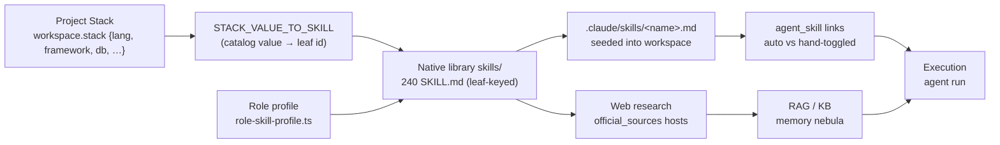

[← Docs index](./README.md) · [🇧🇷 Português](../pt/SKILLS.md) · [✦ Constella](../../README.md)

# Skills ✦ — the constellation's playbooks 🌌


A research-backed library of `SKILL.md` playbooks that ships with Constella and is seeded into every workspace. Skills are the procedural starlight each agent steers by — the right ones auto-link to the right agents based on the project **stack** and the agent's **role**, and the team can grow new ones from what it has learned.

---

## 1. When to use 🛰️

- You want to know **what an agent already knows** before it builds (engineering practice, the chosen framework, the security posture).
- You're tuning **which skills reach which agent** — enable/disable per agent, or pin signature skills so they survive the prompt budget.
- You changed the **Project Stack** and want each agent re-linked to the skills its new stack actually needs.
- Vannevar (Knowledge) has **distilled new skills** from the team's learnings and you need to review and approve them.
- You're authoring a **custom skill** for this workspace, or generating one from a prompt.

See [AGENTS.md](./AGENTS.md) for the roster, [KB_RAG.md](./KB_RAG.md) for how knowledge is indexed, and [PROJECT_STACKS.md](./PROJECT_STACKS.md) for where the stack picks come from.

---

## 2. How it works 🌠

There are **two layers** of skills, and it's important not to conflate them:

| Layer | Where it lives | Source of truth | Indexed into DB? |
|---|---|---|---|
| **Native library** | `skills/` at the **package root** (ships inside the npm package, outside the org workspace jail) | the `SKILL.md` files | No — it is a read-only catalogue the seeder reads from |
| **Workspace skills** | `.claude/skills/<name>.md` inside each org's workspace | the `.md` file on disk (write-through) | Yes — `src/server/sync.ts` mirrors the file into the `skill` table |

The native library is the **catalogue**; the workspace skills are the **executable copies** an agent actually carries. At onboarding the whole library is seeded into the workspace, then each agent is auto-linked to the subset its stack + role need.

### Where the library is found

`skillsLibraryRoot()` (in `src/server/skills-library.ts`) probes, in order:

1. `process.env.CONSTELLA_PKG_ROOT/skills` (set by the CLI launcher in an installed/compiled run)
2. `launchDir()/skills` (the repo root in a dev tree)
3. `process.cwd()/skills`

The first directory that actually exists wins. If none exist, the loader degrades to an **empty index** — every helper becomes a safe no-op rather than crashing.

### Leaf-folder keying (and the stale `INDEX.json`) 🕳️

`loadLibraryIndex()` fs-walks `skills/` (depth ≤ 8) for every file literally named `SKILL.md`. Each skill is keyed by its **leaf folder name** — `skills/stacks/frontend/react/SKILL.md` → `react` — **not** by the frontmatter `name` (some skills carry a namespaced frontmatter name like `testing/testing-strategy-pyramid` that wouldn't match the stable ids used by the stack map and the universal list). The folder name is the stable id.

The hand-maintained `skills/INDEX.json` **is known to lag behind the files and is ignored at runtime** — the loader walks the real files instead. First occurrence wins on duplicate leaf names (e.g. `redis` exists under both `stacks/database` and `stacks/queue`).

Frontmatter parsed per skill (minimal single-line YAML reader): `name`, `description`, `domain`, `category`, and the multi-line list `official_sources`. The `official_sources` URLs become the **web-research allowlist hosts** (`stackDocHosts()`).

---

## 3. Main flow: Stack → Skills → Research → RAG → Execution 🚀



1. **Project Stack** (`workspace.stack`, a `Record<string,string>`) lists the chosen language, runtime, framework, database, ORM, styling, testing, etc.
2. Each stack value maps through `STACK_VALUE_TO_SKILL` to a library leaf id (`Vue → vue`, `Django → django`, `Tailwind CSS → tailwind`). Missing or `None` → skipped.
3. The whole library is **seeded** as `.claude/skills/<name>.md` files; only the stack + role subset is **auto-linked** per agent.
4. The matched skills' `official_sources` define which official-docs hosts the **web research** step may fetch.
5. Researched docs and patterns flow into **RAG / the KB** (the memory nebula — see [KB_RAG.md](./KB_RAG.md), [MEMORY_RAG.md](./MEMORY_RAG.md)).
6. At **execution**, the agent's pinned core skills + the long tail + RAG hits are assembled into its prompt.

---

## 4. Key concepts 🪐

### Universal vs stack vs role skills

| Kind | Defined by | Reaches |
|---|---|---|
| **Universal** | `UNIVERSAL_SKILL_NAMES` (a fixed list in `skills-library.ts`) | Every agent, regardless of stack — clean-code, git-workflow, owasp-top-10, testing-strategy-pyramid, ui-ux-principles, accessibility-wcag, the process rituals, `research-official-docs`, `readme-generation`, … |
| **Stack** | `STACK_VALUE_TO_SKILL[stackValue]`, gated by the role's `stackPrefixes` | The agents whose role owns that stack folder (a Vue project's Frontend gets `vue`, not `react`+`svelte`) |
| **Role** | `roleProfile(role).allPrefixes` | Every skill under the role's folders (Frontend → all of `design/`; Backend → `engineering/backend/`; Security → `engineering/security/`) |

The auto-link set for an agent is computed by `skillNamesForRole(stack, role)`:
- start with the universals that exist on disk;
- add every skill whose `relPath` starts with one of the role's `allPrefixes`;
- add stack-gated skills whose `relPath` starts with a `stackPrefixes` entry **and** were actually selected by the stack.

This replaced the old "link all ~180 to everyone" so the **right skills reach the right agent**.

### Core (pinned) skills

`coreSkillNamesForRole(stack, role)` returns the role's signature skills (`roleProfile().core`) plus the chosen stack picks under the role's stack folders. The context assembler (`agentSkills()` in `src/server/context-manager.ts`) ranks the agent's enabled skills — `core = 0`, stack = `1`, rest = `2` — pins up to **10 core** into a high-priority prompt section (never trimmed under budget) and caps the long tail at **30**.

### Native vs provisional

The `skill` table (`src/db/schema.ts`):

| Column | Meaning |
|---|---|
| `native` | `true` = seeded from the library (only non-native can be deleted) |
| `provisional` | `true` = AI-drafted / Vannevar-proposed, **not linked** to any agent until approved |
| `indexed` | `pending` \| `indexed` — sync/index state |
| `proposedRole` | for a Vannevar proposal: the team role it targets (approval links it there) |

### `agentSkill.auto` — auto vs hand-toggled

The `agent_skill` join carries one boolean, `auto`:

- `auto = true` → **system-managed**: created by the stack/role auto-link and **reconciled** on boot / stack change. The reconciler may add or remove it.
- `auto = false` → **operator hand-toggled** in the UI. The reconciler **never touches it** — neither prunes nor re-adds.

This is what lets you pin a non-default skill onto an agent (e.g. give the Backend agent `react`) and trust it won't be wiped when the stack reconciles.

### Reconciliation

`reconcileStackRoleSkills(wsId)` (in `src/server/seed-library-skills.ts`) runs at boot and on stack change. For each agent it computes the desired set from `skillNamesForRole`, then:
- **prunes** `auto` links to **library** skills that fall outside the role's profile (manual links and the procedural skills are left alone);
- **adds** the role's missing skills with `auto = true`.

It is idempotent and uses **no LLM**.

---

## 5. Seeding & file shapes

At onboarding (`completeOnboarding` in `src/server/onboarding.ts`):

1. Six **procedural** skills are seeded first and win on name conflict: `open-pr`, `run-suite`, `secret-scan`, `telegram-notify` (provisional), `moscow-prioritise`, `gguf-validate` (provisional). Non-provisional ones are enabled for every agent.
2. The **whole native library** is seeded with `seedLibrarySkills({ names: allLibrarySkillNames(), linkNames: [] })` — every library skill becomes a `skill` row + a `.claude/skills/<name>.md` file, but **none** is linked here.
3. `reconcileStackRoleSkills(wsId)` then links each agent to its stack + role subset.

`seedLibrarySkills()` writes each `.md` in the exact shape `indexSkillFile` derives, so the watcher's later re-index is a no-op:

```markdown
# Skill — react

**Trigger:** When working with react in this project.

<description from frontmatter>

## Procedure
<SKILL.md body with frontmatter stripped>
```

Each agent's enablement is mirrored to `.claude/agents/<handle>/skills.md` by `rebuildAgentSkillsMd()` — a generated index listing each enabled skill and its file, plus the agent's ritual. The sync engine reads backtick-wrapped names from this file to drive enablement (disk = truth).

---

## 6. Vannevar's skill proposals (P3 — learning → skills) 🌌

`proposeSkillsFromLearnings(orgId)` (in `src/server/kb.ts`), triggered from the Skills page via `suggestSkillsFromLearnings()`:

1. Finds the Vannevar agent (handle `vannevar`, or a role matching `/knowledge/i`); aborts if over its daily USD cap.
2. Reads up to **50** active KB entries of **reusable** types (`doc`, `research`, `ui-pattern`, `stack`, `integration`, `fix`, `decision`, `architecture`, `business-rule`), keeps those with confidence ≥ 60, and requires **at least 4** strong entries.
3. Prompts the agent (local RAG model preferred, else the agent's CLI) to propose **0–3** genuinely reusable skills as a JSON array, deduped against existing skill names.
4. Each accepted proposal lands as a **provisional** skill (`native = false`, `provisional = true`) with a `proposedRole`, written to `.claude/skills/<name>.md`, **not linked** to any agent.
5. Operators are notified to review and approve in `/skills`.

`approveProvisional(id)` flips `provisional → false`, sets `indexed = indexed`, and links it to the agents of its `proposedRole` (or to **all** agents if no role) with `auto = false` — so it is actually used, not approved-but-orphan.

Other authoring paths:
- `createSkill()` — operator-authored skill, written to disk and enabled for one agent (`auto = false`).
- `generateSkill(prompt)` — drafts a **provisional** skill from a prompt (no agent enabled until approved).
- `saveSkillInstructions()` — edits a skill's Procedure (rewrites the `.md`).
- `toggleAgentSkill()` / `setAllAgentSkills()` — per-agent enablement (always `auto = false`).
- `deleteSkill()` — only **non-native** skills; removes the `.md` (deindex drops the row).

---

## 7. Tables 🛰️

### `skill`
| Column | Type | Notes |
|---|---|---|
| `id` | text PK | |
| `workspaceId` | text | FK → workspace |
| `name` | text | leaf id / kebab-case |
| `summary` | text | one-line description |
| `instructions` | text | the Procedure body |
| `trigger` | text | when to use it |
| `native` | bool | library-seeded (undeletable) |
| `provisional` | bool | AI-drafted, pending approval |
| `indexed` | `pending`\|`indexed` | sync state |
| `proposedRole` | text? | Vannevar proposal target role |

### `agent_skill` (join, PK `agentId+skillId`)
| Column | Type | Notes |
|---|---|---|
| `agentId` | text | FK → agent |
| `skillId` | text | FK → skill |
| `auto` | bool | `true` = system-managed (reconciled); `false` = hand-toggled (never touched) |

### Library taxonomy (native `skills/`)
| Group | Approx. count | What's inside |
|---|---|---|
| `process/` | 15 | Discovery, framing, architecture-first, requirements→specs, specs→issues, MoSCoW/RICE, security-by-design, testing-before-done, ADRs, review |
| `engineering/` | 32 | `security/` `architecture/` `performance/` `testing/` `frontend/` `backend/` `practices/` |
| `design/` | 9 | UI/UX, design systems, CSS, motion, color & typography, responsive layout |
| `languages/` | 15 | Per-language techniques (TypeScript … Dart) |
| `stacks/` | ~98 | One per catalog option across runtime/frontend/meta/backend/database/orm/styling/container/infra/queue/auth |
| `references/` | 10 | Distilled external UI/AI references |
| `meta/` | 3 | How to author agent skills |

> Counts are approximate and live in `skills/README.md`; the loader walks **240** `SKILL.md` files at the time of writing (the catalogue grows). Only leaf-named, on-disk skills are usable.

---

## 8. Helper reference

| Function (`src/server/skills-library.ts`) | Returns |
|---|---|
| `loadLibraryIndex()` | cached `Map<name, LibrarySkill>` from the fs-walk |
| `librarySkillByName(name)` / `readLibrarySkillMd(name)` | one entry / its raw `SKILL.md` |
| `stripFrontmatter(md)` | the body with the leading `---` block removed |
| `librarySkillNamesForStack(stack)` | universals + stack-matched ids, on disk |
| `allLibrarySkillNames()` | every leaf name (seeded so the whole library shows) |
| `skillNamesForRole(stack, role)` | the auto-link set for an agent |
| `coreSkillNamesForRole(stack, role)` | the pinned signature set |
| `stackDocHosts(stack)` | official-docs hostnames for the web-research allowlist |

---

## 9. Step-by-step

### Re-link agents after a stack change
1. Change the Project Stack (see [PROJECT_STACKS.md](./PROJECT_STACKS.md)).
2. `reconcileStackRoleSkills(wsId)` runs (boot / stack change) — auto links update, hand-toggles untouched.
3. Verify in Agent Studio → Skills.

### Approve a Vannevar-proposed skill
1. Open `/skills` after the "proposed N new skills" notification.
2. Review the provisional skill's Procedure.
3. Approve → `approveProvisional` links it to its `proposedRole` (or all) with `auto = false`.

### Add a custom skill to one agent
1. Author it (`createSkill`) or generate a draft (`generateSkill`).
2. If generated, approve it first (it's provisional).
3. Toggle it on for the agent (`toggleAgentSkill`) — it is `auto = false`, so reconcile leaves it alone.

---

## 10. Examples

Inspect the library from chat (`src/server/commands.ts`):

```text
/skills
→ 📚 Skills library — 240 skill(s). Sample: clean-code, git-workflow, … . Enable/disable per agent in Agent Studio → Skills.
```

A seeded workspace skill file (`.claude/skills/tailwind.md`):

```markdown
# Skill — tailwind

**Trigger:** When working with tailwind in this project.

Utility-first CSS framework; consult for design tokens, responsive variants, and component styling.

## Procedure
…SKILL.md body…
```

A frontmatter header in the native library (`skills/stacks/frontend/react/SKILL.md`):

```yaml
---
name: react
description: Component-based JavaScript library for building web and native UIs; …
domain: stack
category: frontend
tags: [react, components, hooks, jsx, ui, spa]
official_sources:
  - https://react.dev/
  - https://github.com/facebook/react
verified: 2026-06-16
---
```

---

## 11. Possible states 🌠

| Object | States |
|---|---|
| `skill.indexed` | `pending` → `indexed` |
| `skill.native` | `true` (library) / `false` (custom or proposed) |
| `skill.provisional` | `true` (awaiting approval) / `false` (active) |
| `agent_skill.auto` | `true` (managed) / `false` (manual) |
| Library index | populated / empty (dir missing → no-op) |

---

## 12. Related integrations 🪐

- **Web research** — matched skills' `official_sources` → `stackDocHosts()` → the WebSearch/WebFetch allowlist (see [AI_ARCHITECTURE.md](./AI_ARCHITECTURE.md), [MODELS.md](./MODELS.md)).
- **RAG / KB** — `.claude/skills/*.md` are re-indexed by the sync engine and embedded into RAG (see [KB_RAG.md](./KB_RAG.md), [MEMORY_RAG.md](./MEMORY_RAG.md)).
- **Vannevar / KB agent** — proposes skills from learnings (see [KB_AGENT.md](./KB_AGENT.md)).
- **Onboarding** — seeds + reconciles the library (see [ONBOARDING.md](./ONBOARDING.md)).
- **Plugins** — skills are knowledge, not capabilities; plugins are integrations (see [PLUGINS.md](./PLUGINS.md)).

---

## 13. Security 🕳️

- The native library lives **outside** the org workspace jail (at the package root) and is **read-only** — agents never write to it.
- Workspace skill files live under `.claude/skills/` **inside** the FS jail (`safe()` path checks; see [SECURITY.md](./SECURITY.md)).
- Skill mutations are workspace-scoped with IDOR guards (`agentInWorkspace`, `skillInWorkspace`) so one org cannot flip skills on another org's agents.
- Vannevar proposals are budget-gated (daily USD cap) and land **provisional** — nothing reaches an agent's prompt until an operator approves.
- Only **non-native** skills can be deleted; the library catalogue cannot be mutated through the app.

---

## 14. Troubleshooting

| Symptom | Likely cause | Fix |
|---|---|---|
| `/skills` reports 0 skills | library dir not found at runtime | ensure `CONSTELLA_PKG_ROOT/skills` (installed) or repo-root `skills/` (dev) exists |
| A stack skill didn't auto-link | catalog value missing from `STACK_VALUE_TO_SKILL`, or no `SKILL.md` for that leaf id | the map filters to on-disk skills — add the `SKILL.md` or the mapping |
| A pinned skill keeps disappearing | it was an `auto` (managed) link outside the role profile | hand-toggle it (`auto = false`) so reconcile leaves it alone |
| Edited a `.claude/skills/*.md` and the UI didn't update | watcher debounce / sync not run | the sync engine re-indexes on file change; disk is truth |
| Vannevar proposed nothing | < 4 strong reusable KB entries, or over daily cap | accumulate more validated learnings; check the agent's cost cap |
| Frontmatter `name` ≠ folder | by design — leaf folder name is the id, not frontmatter | rename the **folder** to change the id |

---

## 15. Related links

- [AGENTS.md](./AGENTS.md) — the roster and roles that drive role profiles
- [PROJECT_STACKS.md](./PROJECT_STACKS.md) — where `workspace.stack` comes from
- [KB_AGENT.md](./KB_AGENT.md) — Vannevar and learning → skills
- [KB_RAG.md](./KB_RAG.md) · [MEMORY_RAG.md](./MEMORY_RAG.md) — the memory nebula
- [AI_ARCHITECTURE.md](./AI_ARCHITECTURE.md) — prompt assembly, web research
- [ONBOARDING.md](./ONBOARDING.md) — seeding the library
- [PLUGINS.md](./PLUGINS.md) — integrations (distinct from skills)
- [CHAT_COMMANDS.md](./CHAT_COMMANDS.md) — `/skills` and friends
- [SECURITY.md](./SECURITY.md) — the FS jail
