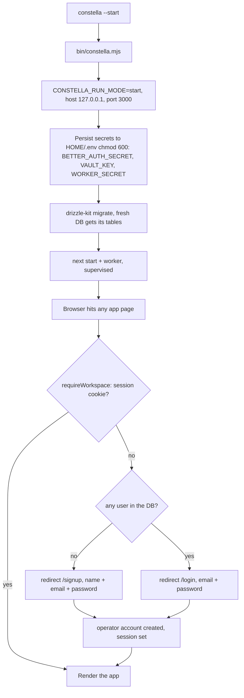
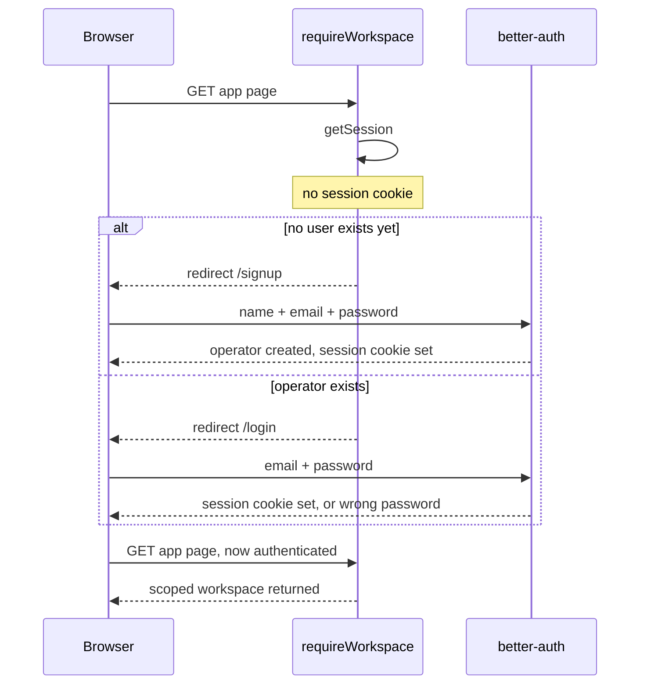

[← Docs index](./README.md) · [🇧🇷 Português](../pt/START_MODE.md) · [✦ Constella](../../README.md)

# Start — running Constella locally ✦

> The default ignition for a single-pilot ship on your own machine: `constella --start` boots Constella on `127.0.0.1`, and the agent constellation runs with full local permissions. Authentication is always on — first run shows a signup screen, later runs show login.

`constella --start` is the **local install** of Constella: the server binds the loopback interface and is reachable only from the machine it runs on. It is the right launch flag for a single operator on their own laptop / workstation — zero network exposure, full agent autonomy. It is **not** an auth mode: just like every other launch flag, it requires you to sign in (email + password).

---

## 🛰️ When to use

| Use `--start` when… | Prefer another install method when… |
| --- | --- |
| You run Constella **on your own laptop / workstation** | You expose it on a network → [VPS](./VPS_MODE.md) |
| You want a **loopback-only** control plane | You need remote access over a private tailnet → [VPS](./VPS_MODE.md) |
| You want agents that can **install deps + run tests** (full shell) | You boot from a USB drive across machines → [PORTABLE](./PORTABLE_MODE.md) |
| You're developing, demoing, or running a personal agent-company | — |

`--start` is **local-only by design**. It binds the loopback interface, so the surface is never on the network. Authentication is the same as in every other launch flag — there is no auto-login and no passwordless shortcut.

---

## 🌌 How it works

`start` is one of the launch flags resolved by `bin/constella.mjs`. A launch flag is **required** — a bare `constella` no longer starts. The launcher selects the flag, then exports it as `CONSTELLA_RUN_MODE`, which the server reads back through `getRunMode()`:

```ts
// src/lib/run-mode.ts
export type RunMode = "start" | "vps" | "portable";

export function getRunMode(): RunMode {
  const m = process.env.CONSTELLA_RUN_MODE as RunMode | undefined;
  return m && m in RUN_MODES ? m : "start";
}
```

Two behaviours flow from `--start`:

1. **Loopback bind.** The web server binds `127.0.0.1`, so nothing is reachable off-box. Only `vps` / `portable` bind `0.0.0.0`.
2. **Full-access agents.** The CLI adapter runs agents with `--permission-mode bypassPermissions` (install deps, run tests, full shell) because `start` means you're on your own machine.

Authentication is **identical to every launch flag**: the first time the database has no user, you get a real **signup** screen (name + email + password) that creates the single operator account; afterwards you get a **login** screen. There is no auto-login, no `/api/dev-login`, no predictable default credential.

The chosen flag is also **persisted on the organization** at onboarding time (`organization.runMode`), so the org record remembers how it was first launched.

---

## 🚀 Main flow



### Authentication flow (signup-then-login) 🌠



---

## 🪐 Key concepts

### The single operator

There is **one** operator account, shared across every launch flag — it is never duplicated. The first run with an empty database shows a **signup** screen (name + email + password) that creates it; every later run shows **login**. A wrong password returns "incorrect email or password". There is **no** predictable default credential, **no** `ensureLocalOperator`, and **no** `/api/dev-login` auto sign-in.

The operator is resolved the same way under `start`, `vps` and `portable`: it is the single `user` row. Switching between launch flags keeps the **same** account.

### Full-access agents (`bypassPermissions`)

`src/server/adapters/cli.ts` decides how much shell power agents get:

```ts
const RUN_MODE = process.env.CONSTELLA_RUN_MODE ?? "start";
const AGENT_FULL_ACCESS = process.env.CONSTELLA_AGENT_FULL_ACCESS != null
  ? process.env.CONSTELLA_AGENT_FULL_ACCESS !== "0"
  : RUN_MODE === "start";

function claudePermArgs(): string[] {
  return AGENT_FULL_ACCESS
    ? ["--permission-mode", "bypassPermissions"]   // start → full: install + test
    : ["--permission-mode", "acceptEdits"];        // network installs → jailed: edits only
}
```

So under `--start` the `claude` / `codex` CLIs run with `bypassPermissions` — they can install dependencies and run tests in the workspace — because you're on your own machine. The network installs (`vps` / `portable`) default to `acceptEdits` (edits-only, jailed). Override either way with `CONSTELLA_AGENT_FULL_ACCESS=1|0`. Agents still always run **vanilla** (a temp settings overlay sets `disableAllHooks: true`) so the operator's personal `~/.claude` hooks/plugins never bleed into agent runs. This full-access default is a **run-context** detail of being local — it is independent of authentication, which is always required. See [AGENTS](./AGENTS.md) and [AI_ARCHITECTURE](./AI_ARCHITECTURE.md).

### The auth secret

`next start` runs under `NODE_ENV=production`, where better-auth **throws on its default secret**. So Constella always needs a real `BETTER_AUTH_SECRET` — the launcher generates and persists one to `<HOME>/.env` (`chmod 600`) on every launch flag, `start` included. Session cookies stay non-`Secure` under `--start` because the local transport is plain `http`.

---

## Tables 📊

### `--start` vs the other launch flags

| Property | **start** | vps | portable |
| --- | --- | --- | --- |
| Authentication | email + password | email + password | email + password |
| First run (no user) | signup screen | signup screen | signup screen |
| Later runs | login screen | login screen | login screen |
| Bind host | `127.0.0.1` | `0.0.0.0` | `0.0.0.0` |
| Operator | the single shared account | the single shared account | the single shared account |
| Agent permission | `bypassPermissions` | `acceptEdits` | `acceptEdits` |
| `BETTER_AUTH_SECRET` | persisted (always required) | persisted (always required) | persisted (always required) |
| Secure cookies | no (local http) | yes | if behind https |
| Typical use | own machine / dev | server over Tailscale | USB across machines |

### Launch commands → local install

| Command | Result |
| --- | --- |
| `constella --start` | Local install (loopback bind) |
| `constella --bind local` | Local install (legacy `--bind` back-compat) |
| `CONSTELLA_RUN_MODE=start` | Forces local behaviour for the server process |

> A bare `constella` (no flag) **no longer starts** — a launch flag is required.

### Env vars that shape a local install

| Variable | Default under `--start` | Effect |
| --- | --- | --- |
| `CONSTELLA_RUN_MODE` | `start` | The run flag the server reads |
| `CONSTELLA_HOME` | `~/.constella` | Runtime root (DB, secrets, orgs) |
| `--host` / host | `127.0.0.1` | Loopback bind |
| `--port` / `PORT` | `3000` | Web port |
| `CONSTELLA_AGENT_FULL_ACCESS` | `1` (implied by start) | `0` re-jails agents to edits-only |
| `CONSTELLA_WEB_RESEARCH` | on | `0` disables agent WebSearch/WebFetch |
| `BETTER_AUTH_SECRET` | generated → `<HOME>/.env` | Session signing key (always required) |

### Key files

| File | Role |
| --- | --- |
| `src/lib/run-mode.ts` | `RunMode` type, `RUN_MODES`, `getRunMode()`, `requiresLogin()` |
| `bin/constella.mjs` | Launcher: picks flag, sets host/port, persists secrets, boots web + worker |
| `src/lib/workspace.ts` | `requireWorkspace()` — redirects to `/signup` or `/login` |
| `src/lib/auth.ts` | better-auth config; `assertAuthSecret()` boot gate |
| `src/server/adapters/cli.ts` | `claudePermArgs()` → `bypassPermissions` under `--start` |
| `src/lib/run-context.ts` | `detectRunContext()` for the Update path |

---

## Step-by-step 🧭

### Start a fresh ship locally

1. **Launch** with `--start`:
   ```bash
   npm install -g constellai
   constella --start
   # or, once: npx constellai --start
   ```
2. The launcher prints the runtime root and `Mode : start · 127.0.0.1:3000`, persists secrets to `<HOME>/.env`, applies migrations, and boots `next start` + the worker.
3. **Open** `http://127.0.0.1:3000`.
4. `requireWorkspace()` finds no session. If the database has no user yet, you land on the **signup** screen; create the single operator with name + email + password.
5. On later runs the same path lands on the **login** screen — sign in with that email + password.
6. If no org exists yet, you continue into [ONBOARDING](./ONBOARDING.md); otherwise you're in the app.

### Re-jail agents (extra caution)

```bash
CONSTELLA_AGENT_FULL_ACCESS=0 constella --start
```
Agents now run `acceptEdits` (edits-only, no arbitrary shell), while you keep the loopback-local convenience.

---

## Examples 🌟

**Default local launch:**
```bash
$ constella --start
Constella runtime root : /home/you/.constella
Mode                   : start  ·  127.0.0.1:3000
• Secrets ready (stored in /home/you/.constella/.env, never printed).
• Starting: next start -H 127.0.0.1 -p 3000  (…)  +  worker
```

**Custom port, still local:**
```bash
$ constella --start --port 4000
# → http://127.0.0.1:4000, signup on first run then login, full-access agents
```

**Pin a different runtime root:**
```bash
$ CONSTELLA_HOME=/data/constella constella --start
# DB at /data/constella/constella.db; secrets at /data/constella/.env
```

---

## Possible states 🛰️

| Situation | Behaviour |
| --- | --- |
| No session cookie, no user in DB | Redirect `/signup` → create the operator → app |
| No session cookie, operator exists | Redirect `/login` |
| Sign-in succeeds | Cookie set, land on `/` (or `/onboarding` if no org) |
| Wrong password | "incorrect email or password" |
| `CONSTELLA_FORCE_ONBOARDING=1` | After session, redirect `/onboarding` (one-shot, cleared by `completeOnboarding`) |
| Org missing / workspace missing | Redirect `/onboarding` |
| Agent run, `--start` | `claude --permission-mode bypassPermissions` (full shell) |
| Agent run, `CONSTELLA_AGENT_FULL_ACCESS=0` | `claude --permission-mode acceptEdits` (jailed) |

---

## Related integrations 🪐

- **Onboarding** persists the active flag onto `organization.runMode` (`src/server/onboarding.ts`). See [ONBOARDING](./ONBOARDING.md).
- **Worker** (`bin/worker.mjs`) connects back over `127.0.0.1` regardless of bind host; under `--start` that's also the web bind. See [ARCHITECTURE](./ARCHITECTURE.md).
- **Vault** still needs `CONSTELLA_VAULT_KEY` even locally (provider keys are encrypted). See [SECURITY](./SECURITY.md).
- **Update** path is context-aware via `detectRunContext()`. See [UPDATE](./UPDATE.md).

---

## Security 🕳️

A local install trades network hardening for local convenience — safe precisely because it is local:

- **Loopback only.** Host binds `127.0.0.1`; nothing is reachable off-box.
- **Authentication always on.** A real signup-then-login gate guards every session — there is no auto-login and no predictable credential. The single operator is whoever completes the first-run signup.
- **Real auth secret persisted.** A real `BETTER_AUTH_SECRET` is generated to `<HOME>/.env` (`chmod 600`) so sessions aren't forgeable; cookies are non-`Secure` only because the local transport is plain `http`.
- **Full-access agents are local-only.** `bypassPermissions` lets agents run shell, but the workspace is still an FS jail (`safe()` lexical + symlink checks), and the guard/lock hooks still apply. Set `CONSTELLA_AGENT_FULL_ACCESS=0` to re-jail.
- **Do not port-forward a local install.** If you need remote access, use [VPS](./VPS_MODE.md) (Tailscale, native) — never expose the loopback install to a network.

---

## Troubleshooting 🧰

| Symptom | Likely cause | Fix |
| --- | --- | --- |
| Signup screen never appears | A user already exists in the DB | Expected — you get `/login` once the operator exists; sign in instead |
| "incorrect email or password" | Wrong password for the operator | Re-enter the operator's password set at signup |
| Agents can't install deps / run tests | `CONSTELLA_AGENT_FULL_ACCESS=0` set | Unset the override, or relaunch with `--start` |
| Reachable from another machine | You overrode `--host` to `0.0.0.0` | Drop `--host`; `--start` binds `127.0.0.1` |
| better-auth secret error at boot | Forced an install without a secret | The launcher persists `BETTER_AUTH_SECRET` — let it run, or set it |
| A bare `constella` does nothing | A launch flag is now required | Relaunch with `--start` (or `--vps` / `--portable`) |

---

## Related links 🌌

- [INSTALLATION](./INSTALLATION.md) · [ONBOARDING](./ONBOARDING.md) · [CONFIGURATION](./CONFIGURATION.md)
- [VPS](./VPS_MODE.md) · [PORTABLE](./PORTABLE_MODE.md)
- [ARCHITECTURE](./ARCHITECTURE.md) · [AI_ARCHITECTURE](./AI_ARCHITECTURE.md) · [AGENTS](./AGENTS.md)
- [SECURITY](./SECURITY.md) · [UPDATE](./UPDATE.md) · [TROUBLESHOOTING](./TROUBLESHOOTING.md) · [FAQ](./FAQ.md)
</content>
</invoke>
