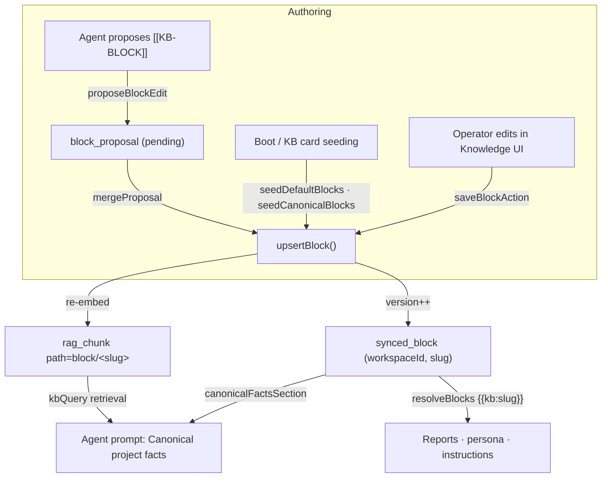
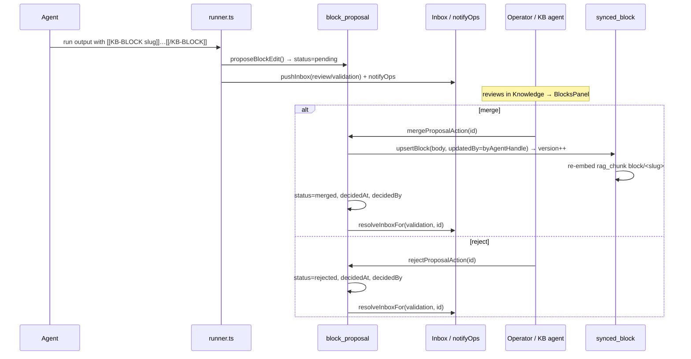

[← Docs index](./README.md) · [🇧🇷 Português](../pt/SYNCED_BLOCKS.md) · [✦ Constella](../../README.md)

# 🌌 Synced Blocks — the canonical memory nebula


Synced blocks are the **single source of truth** for durable project knowledge: one named unit (`slug` + Markdown `body`) edited in exactly one place and surfaced by reference everywhere — agent prompts, the welcome home, and transcluded into reports. Edit a block once and every surface reflects the latest, with no copy-paste drift. They are distinct from auto-captured `kb_entry` knowledge: a synced block is **curated, canonical, and versioned**; agents can only *propose* edits to it.

Source of truth in code: `src/server/blocks.ts`, schema `src/db/schema.ts` (`synced_block`, `block_proposal`).

---

## 1. When to use 🪐

Use synced blocks for facts that:

- are **durable** and **reused** across many runs and surfaces (the official stack, business rules, security patterns, the architecture every agent must treat as canonical);
- must stay **consistent** everywhere they appear (no drift between the persona file, a report, and a chat answer);
- benefit from **operator/KB-agent review** before changing the shared truth.

Do **not** use them for transient, run-specific learnings. Those flow into the auto-captured KB via the `[[REMEMBER type=<t>: <fact>]]` token (no approval) — see [KB_RAG.md](./KB_RAG.md) and [MEMORY_RAG.md](./MEMORY_RAG.md).

| Knowledge kind | Mechanism | Approval | Versioned | Doc |
|---|---|---|---|---|
| Canonical, curated fact | Synced block (`synced_block`) | Operator / KB agent merges proposals | Yes (`version`) | this doc |
| Auto-captured learning | `kb_entry` via `[[REMEMBER …]]` | None (ingested directly) | No (status lifecycle) | [KB_RAG.md](./KB_RAG.md) |

---

## 2. How it works 🛰️

A synced block lives in the `synced_block` table, keyed by `(workspaceId, slug)`. Its `body` is canonical Markdown. Two things happen whenever a block is written via `upsertBlock`:

1. The row is **upserted** — on create `version = 1`; on update `version` is incremented (`cur.version + 1`), `updatedBy` and `updatedAt` are refreshed.
2. The body is **re-embedded** into `rag_chunk` at path `block/<slug>` (`embedBlock`), so agents also *retrieve* the current block through RAG, not just receive it injected. The old chunks at that path are deleted first, so embeddings never go stale.

The block then reaches agents through **three** distinct surfaces:

- **Injected** — `canonicalFactsSection(wsId)` builds a compact "Canonical project facts" section (up to 20 most-recently-updated blocks, each title + kind + first 800 chars, capped at 5000 chars total) that the context manager injects near the top of every agent prompt.
- **Transcluded** — `resolveBlocks(orgId, text)` replaces `{{kb:slug}}` markers anywhere in text (persona files, instructions, report bodies) with the block's current `body`. A missing slug renders a LOUD visible marker `[[missing block: <slug>]]` rather than silently vanishing.
- **Retrieved** — the RAG chunks at `block/<slug>` are returned by ordinary `kbQuery` retrieval, so a block can surface even when it isn't in the always-injected window.

### Slug rules

Slugs are normalized (`normSlug`): lowercased, trimmed, non-`[a-z0-9-]` collapsed to `-`, leading/trailing dashes stripped, truncated to 60 chars, and validated against `/^[a-z0-9][a-z0-9-]{0,60}$/`. An invalid slug fails the upsert (`{ ok: false }`).

### Field bounds (enforced in `upsertBlock`)

| Field | Bound |
|---|---|
| `title` | sliced to 200 chars |
| `body` | sliced to 20000 chars |
| `kind` | sliced to 40 chars (default `note`) |
| `updatedBy` | sliced to 60 chars (default `operator`) |

---

## 3. Main flow 🌠



---

## 4. Key concepts ✦

| Concept | What it is |
|---|---|
| **Block** | `typeof syncedBlock.$inferSelect` — one canonical knowledge unit `(slug, kind, title, body, version, updatedBy)`. |
| **Proposal** | `typeof blockProposal.$inferSelect` — an agent's *suggested* edit awaiting merge/reject. |
| **`{{kb:slug}}` marker** | A transclusion token resolved at read time to the block's current body. |
| **`[[KB-BLOCK slug]]…[[/KB-BLOCK]]`** | The token an agent emits in its run output to *propose* a block edit. |
| **Canonical facts section** | The bounded block digest injected into every agent prompt as the authoritative source of truth. |
| **Re-embedding** | Each save refreshes `rag_chunk` at `block/<slug>` so RAG retrieval stays current. |
| **Versioning** | `version` starts at 1, increments on every update; the UI shows `v<n>` and `updatedBy`. |

---

## 5. Tables 🗄️

### `synced_block` (PK `(workspaceId, slug)`)

| Column | Type | Notes |
|---|---|---|
| `workspace_id` | text | FK → `workspace.id`, `onDelete: cascade` |
| `slug` | text | stable handle, e.g. `official-stack` |
| `kind` | text | default `note`; see kinds below |
| `title` | text | default `""` |
| `body` | text | canonical Markdown — the single source of truth |
| `version` | integer | default `1`, bumped on every update |
| `updated_by` | text | agent handle or `operator` (or `system` for seeded) |
| `created_at` | timestamp | `unixepoch()` |
| `updated_at` | timestamp | `unixepoch()`; blocks are listed/digested in `desc(updatedAt)` |

**`kind` values** (from the schema comment): `mission`, `objective`, `stack`, `architecture`, `business-rule`, `ui-pattern`, `security`, `commands`, `deploy-checklist`, `review-checklist`, `glossary`, `policy`, `note`. `kind` is free text (sliced to 40 chars), so these are conventions, not a DB enum.

### `block_proposal` (PK `id`, index `block_prop_ws_idx` on `(workspaceId, status)`)

| Column | Type | Notes |
|---|---|---|
| `id` | text | `randomUUID()` |
| `workspace_id` | text | FK → `workspace.id`, `onDelete: cascade` |
| `slug` | text | target block slug (normalized) |
| `kind` | text | default `note` |
| `title` | text | default `""` |
| `body` | text | proposed Markdown body |
| `by_agent_handle` | text | who proposed it |
| `status` | text enum | `pending` \| `merged` \| `rejected` (default `pending`) |
| `created_at` | timestamp | `unixepoch()` |
| `decided_at` | timestamp | set on merge/reject |
| `decided_by` | text | default `""`; `operator` from the action |

---

## 6. The canonical block set 🚀

`seedCanonicalBlocks(orgId)` (wired to the KB card and the Welcome Home "Create central blocks" button via `seedDefaultBlocksAction`) ensures the full curated set exists. `mission`, `objective`, and `official-stack` are filled from the workspace's own fields; the rest are created as **editable starter placeholders** so they show up to be filled in. It is **idempotent** — it never overwrites an existing block, and returns how many were newly created.

| slug | kind | source of body |
|---|---|---|
| `mission` | `mission` | `workspace.mission` |
| `objective` | `objective` | `workspace.objective` |
| `official-stack` | `stack` | rendered from `workspace.stack` (`- **key:** value`, skips `None`) |
| `current-architecture` | `architecture` | starter placeholder |
| `business-rules` | `business-rule` | starter placeholder |
| `ui-patterns` | `ui-pattern` | starter placeholder |
| `security-patterns` | `security` | starter placeholder |
| `deploy-checklist` | `deploy-checklist` | starter placeholder |
| `code-review-checklist` | `review-checklist` | starter placeholder |
| `glossary` | `glossary` | starter placeholder |
| `technical-decisions` | `note` | starter placeholder |

A lighter `seedDefaultBlocks(orgId)` seeds only `mission` / `objective` / `official-stack` and only if absent **and** non-empty. It runs at boot for every workspace via `seedDefaultBlocksForExistingWorkspaces()` (called from `src/server/boot.ts`).

---

## 7. Agent proposals: propose → review → merge ✦

Agents never write blocks directly. The runner instruction tells them:

> If you discover a DURABLE canonical fact that belongs in the shared knowledge … you MAY propose a synced-block edit by emitting on their own lines: `[[KB-BLOCK <kebab-slug>]]` then the new Markdown body then `[[/KB-BLOCK]]` — the operator / Knowledge agent reviews and merges it. Use sparingly, only for reusable facts (e.g. `official-stack`, `security-patterns`).

After a successful run, `src/server/runner.ts` scans the output for `[[KB-BLOCK slug]]…[[/KB-BLOCK]]` blocks, calls `proposeBlockEdit` for each (queuing a `block_proposal` with `status = pending`), records the touched slugs (→ room chips), and **strips the tokens** from the visible text. Each proposal also:

- pushes an **Inbox** item (`kind: review`, `refType: validation`, `refId = proposalId`) titled `Block edit proposed — <slug>`;
- fires an operator notification via `notifyOps`.

The operator (or the Knowledge agent, Vannevar) then **merges** or **rejects** from the Knowledge module's `BlocksPanel`.



On **merge**, `mergeProposal(wsId, id, by)` only proceeds if the proposal is still `pending`; it then runs `upsertBlock` with `updatedBy` set to the proposing agent's handle (so authorship is preserved), marks the proposal `merged`, and resolves the Inbox item. On **reject**, `rejectProposal` marks it `rejected` and resolves the Inbox item without touching the block.

---

## 8. Step-by-step 🛠️

**Seed the canonical set**

1. Open the **Knowledge** module (or the Welcome Home / dashboard KB card).
2. Click **Create central blocks** → `seedDefaultBlocksAction` → `seedCanonicalBlocks`.
3. `mission` / `objective` / `official-stack` come pre-filled from the workspace; the rest appear as starter placeholders to edit.

**Edit a block as operator**

1. In `BlocksPanel`, click **Edit** on a block (or **New**).
2. Set `slug`, `title`, `kind`, `body` (Markdown).
3. Save → `saveBlockAction` → `upsertBlock(…, updatedBy: "operator")` → `version++` + re-embed.

**Transclude a block into a report or persona**

1. Write `{{kb:official-stack}}` anywhere in the text.
2. At read time, `resolveBlocks` swaps it for the block's current body (reports resolve in `src/app/(app)/reports/[id]/page.tsx`; prompts resolve at the end of context assembly).

**Let an agent propose a change**

1. The agent emits `[[KB-BLOCK security-patterns]] …new body… [[/KB-BLOCK]]` in its run output.
2. The proposal lands in the Knowledge module's pending list + the Inbox.
3. You **Merge** (applies + bumps version) or **Reject**.

---

## 9. Examples 📡

**Transclusion marker** (in a report or `.claude/agents/<handle>/Agent.md`):

```markdown
## Stack you must use
{{kb:official-stack}}

## Rules you must never break
{{kb:business-rules}}
```

A missing slug stays loudly visible:

```markdown
{{kb:does-not-exist}}   →   [[missing block: does-not-exist]]
```

**Agent proposal token** (emitted by the agent, stripped from chat after capture):

```text
[[KB-BLOCK official-stack]]
- **language:** TypeScript
- **framework:** Next.js 16
- **db:** SQLite via drizzle-orm
[[/KB-BLOCK]]
```

**Injected digest** (what `canonicalFactsSection` produces, abbreviated):

```text
### Official stack (stack)
- **framework:** Next.js 16
- **db:** SQLite

### Business rules (business-rule)
...first 800 chars...
```

---

## 10. Possible states 🕳️

**Block** — has no status column; its lifecycle is the `version` counter. A block exists, is edited (version bumps), or is deleted (`deleteBlock` removes the row **and** its `rag_chunk` entries at `block/<slug>`).

**Proposal** (`block_proposal.status`):

| State | Meaning | Set by |
|---|---|---|
| `pending` | awaiting operator/KB-agent decision; appears in `listProposals` + Inbox | `proposeBlockEdit` (default) |
| `merged` | applied to the block (version bumped), Inbox resolved | `mergeProposal` |
| `rejected` | discarded, block untouched, Inbox resolved | `rejectProposal` |

`listProposals(wsId)` returns only `pending` proposals, newest first.

---

## 11. Related integrations 🔗

- **RAG** ([KB_RAG.md](./KB_RAG.md), [MEMORY_RAG.md](./MEMORY_RAG.md)) — every save re-embeds the block into `rag_chunk` (`embed` + `chunksOf`) at path `block/<slug>`, so blocks participate in ordinary retrieval. A keyword fallback applies if the embed server is down.
- **Context manager** ([AI_ARCHITECTURE.md](./AI_ARCHITECTURE.md)) — `canonicalFactsSection` is injected as the top-priority "Canonical project facts" section; `resolveBlocks` runs last over the assembled prompt.
- **Inbox** ([INBOX.md](./INBOX.md)) — proposals raise and resolve `validation` review items.
- **Agents / Knowledge agent** ([AGENTS.md](./AGENTS.md), [KB_AGENT.md](./KB_AGENT.md)) — agents propose; Vannevar / the operator merge.
- **Reports & specs** ([GOALS_SPECS_ISSUES.md](./GOALS_SPECS_ISSUES.md)) — report bodies transclude `{{kb:slug}}` at read time.
- **Knowledge tokens** ([CHAT_COMMANDS.md](./CHAT_COMMANDS.md)) — `[[KB-BLOCK …]]` sits alongside `[[REMEMBER …]]` / `[[CONSULT …]]` in the agent token vocabulary.

---

## 12. Security 🛡️

- **No direct agent writes.** Agents can only *propose*; the canonical body changes only through `mergeProposal` / `saveBlockAction` (operator or KB agent). This keeps the shared source of truth under human/curator control.
- **Workspace isolation.** Every query is scoped by `workspaceId`; the PK is `(workspaceId, slug)` and FKs cascade on workspace delete.
- **Bounded input.** `title`/`body`/`kind`/`updatedBy` are length-capped; slugs are normalized and regex-validated before any write.
- **Secret hygiene.** Blocks are curated knowledge, but treat bodies like any shared surface — do not paste secrets; the platform scrubs secrets on KB ingest, Telegram and logs (`scrubSecrets`, see [SECURITY.md](./SECURITY.md)).
- **Resilience.** All block functions wrap their DB work in `try/catch` and degrade gracefully (`listBlocks` → `[]`, `resolveBlocks` → original text), so a transient failure never breaks prompt assembly.

---

## 13. Troubleshooting 🔧

| Symptom | Likely cause | Fix |
|---|---|---|
| `[[missing block: <slug>]]` in a report/prompt | the referenced block does not exist (or slug typo) | create the block, or fix the `{{kb:slug}}` marker; slugs are lowercase kebab |
| Block save silently fails (`{ ok: false }`) | invalid slug (fails `SLUG_RE`) or empty after normalization | use `[a-z0-9-]`, start with alphanumeric, ≤ 60 chars |
| Agent's proposal never appears | the agent didn't wrap it correctly, or the body was empty | tokens must be exactly `[[KB-BLOCK <slug>]]` … `[[/KB-BLOCK]]` with a non-empty body |
| Merge button does nothing | the proposal is no longer `pending` (already decided) | refresh; `mergeProposal` ignores non-pending proposals |
| Edited block doesn't show in agent answers | RAG retrieval cold / embed server down | the block is still injected via `canonicalFactsSection`; check the embed server (see [MODELS.md](./MODELS.md)) |
| No blocks at all after onboarding | workspace `mission`/`objective`/`stack` were empty (nothing to seed) | click **Create central blocks** to seed the full set with starters |

---

## 14. Related links ✦

- [KB_RAG.md](./KB_RAG.md) — the knowledge base, ingestion, and `kbQuery`
- [MEMORY_RAG.md](./MEMORY_RAG.md) — embeddings, the memory nebula
- [KB_AGENT.md](./KB_AGENT.md) — Vannevar, the Knowledge agent
- [AI_ARCHITECTURE.md](./AI_ARCHITECTURE.md) — how context is assembled for agents
- [AGENTS.md](./AGENTS.md) — the agent roster and how they run
- [INBOX.md](./INBOX.md) — review items and resolution
- [GOALS_SPECS_ISSUES.md](./GOALS_SPECS_ISSUES.md) — specs, reports, transclusion targets
- [CHAT_COMMANDS.md](./CHAT_COMMANDS.md) — agent token vocabulary
- [SECURITY.md](./SECURITY.md) — isolation, scrubbing, vault
