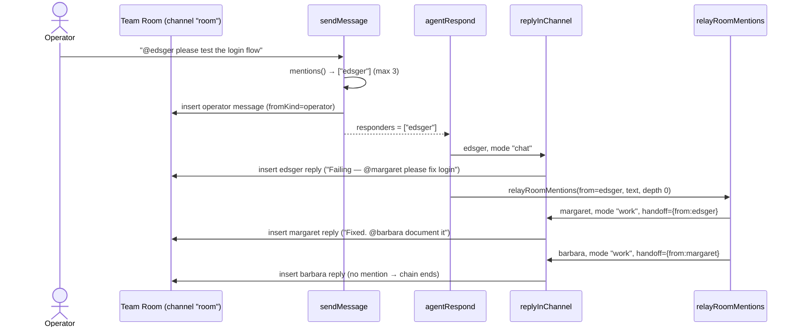
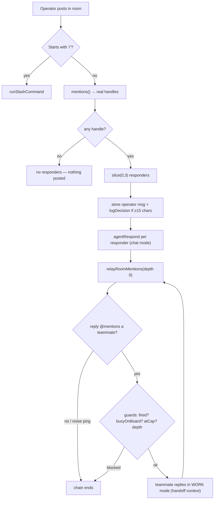

[← Docs index](./README.md) · [🇧🇷 Português](../pt/TEAM_ROOM.md) · [✦ Constella](../../README.md)

# Team Room — The Shared Constellation 🌌🛰️


The **Team Room** is the single shared channel where the operator and the agent constellation talk in the open. A message must `@mention` a teammate to be answered; up to **three** stars light up per turn, and from there the conversation can relay itself agent-to-agent down a bounded **hand-off chain** until the work is reported back.

## When to use

- You want to **address one or more agents in the open** (the whole team can see the thread), as opposed to a private [DM](./DM.md).
- You want to **kick off a hand-off** — ask QA to test, then have them ask the engineer to fix, then ask Docs to document — without micromanaging every step.
- You want to turn a chat line into **new work** by asking the CEO (Ada) or a planner to "build / fix / change" something (the spec→issue→plan ritual; see [WORKFLOW](./WORKFLOW.md)).
- You want the **traceability** of a message back to its board task → issue → goal.

Use a **DM** (`dm:<handle>`) when you want a private 1:1 with one agent; use **[Telegram](./TELEGRAM.md)** when you're remote. The Team Room is the public square.

## How it works ✦

The Team Room is the `message` channel literally named **`"room"`**. Two server actions in `src/server/chat.ts` drive it, backed by the relay engine in `src/server/collab.ts`:

| Function | File | Responsibility |
|---|---|---|
| `sendMessage(channel, text, attachments?)` | `chat.ts` | Stores the operator's message, parses `@mentions`, returns up to **3** responder handles. Intercepts slash commands first. |
| `agentRespond(channel, handle)` | `chat.ts` | Runs one agent's reply via `replyInChannel`, then (in the room) fires the autonomous hand-off chain via `relayRoomMentions`. |
| `replyInChannel(orgId, ws, channel, a, mode, handoff?)` | `collab.ts` | One real agent turn: builds the prompt, runs the CLI runtime, scrubs secrets, stores the reply, books cost. `mode` = `chat` or `work`. |
| `relayRoomMentions(orgId, ws, fromHandle, text, depth, fired)` | `collab.ts` | Recursive hand-off: for each teammate the reply `@mentions`, have them **act** in work mode, then recurse on their reply's mention. |

The flow is deliberately **chat-first**: nothing is faked. Each agent turn is a real `claude`/`codex` CLI process running with the workspace as its current directory (the FS jail), producing real output, booking real `costEntry` rows.

### Channels at a glance

The `message.channel` column distinguishes where a message lives:

| `channel` value | Meaning | Responders |
|---|---|---|
| `room` | The Team Room (this doc) | The `@mentioned` handles, max 3 |
| `dm:<handle>` | A private 1:1 with one agent | Always that handle |
| `telegram` | The isolated remote thread | Always the CEO (`ada`), falls back to the first agent |

## Main flow 🌠



1. The operator posts a message. `sendMessage` checks for a leading `/` (slash command) — if so it is dispatched to `runSlashCommand` and the normal path is skipped.
2. Otherwise `sendMessage` extracts `@mentions`, keeps only handles that are **real agents**, and slices to the first **3**. If none match, **nothing is posted as a responder set** (`return { responders: [] }`) — the room never holds a dead-end message.
3. The operator message is stored (`fromKind: "operator"`), the SSE stream is woken (`wake`), the chat is scheduled for RAG re-index, and — if the message is substantive (≥15 chars) — it is logged as a **decision** (`source: "operator-instruction"`).
4. The UI calls `agentRespond` for each responder. Each runs `replyInChannel` in **`chat`** mode (conversational, no file edits) and the reply is stored.
5. In the room, `agentRespond` then calls `relayRoomMentions` — the autonomous hand-off chain. Relayed agents run in **`work`** mode (they may read/edit/run files), and the chain continues to whoever they `@mention`.

## Key concepts ✦

### `@mentions` and the max-3 rule

A Team Room message is only answered if it `@mentions` a real teammate. The regex is `@([a-z0-9-]+)`:

- In `sendMessage`, `mentions(text)` lowercases each handle, filters to known agents, and **`.slice(0, 3)`** — at most three agents respond to a single operator message.
- The client-side composer blocks an un-mentioned post; the server check is the authoritative guard.
- `@operator` is a special target: when an agent `@mentions @operator`, no agent fires (operator isn't an agent) but a persistent notification + Inbox item is raised (see [INBOX](./INBOX.md)).

### `chat` mode vs `work` mode

`replyInChannel` takes a `mode`:

| Mode | Used by | Behaviour |
|---|---|---|
| `chat` | The direct response to an operator mention (`agentRespond`) | "Reply in 1-3 sentences as yourself. **Do not modify files.**" Conversational only. |
| `work` | Relayed hand-offs (`relayRoomMentions`) | "Do what's needed in the workspace now… then post a SHORT update… END by `@mentioning` EXACTLY ONE teammate with a concrete ask." The agent reads/edits/runs files. |

In `work` mode, when a hand-off is present the prompt makes it explicit: *"Your teammate `@<from>` just handed off to YOU… that hand-off IS your instruction — there is NO separate operator message."* This fixed the "I don't see a message from the operator" confusion.

### The hand-off chain (relay)

`relayRoomMentions` is the autonomous backbone. It is **bounded by design** so a single mention can never fan out into runaway token spend:

| Constant | File | Value | Effect |
|---|---|---|---|
| `MAX_DEPTH` | `collab.ts` | `2` | The chain stops after 2 hops. |
| `MAX_FANOUT` | `collab.ts` | `1` | A single message hands off to **one** teammate, not many — it's a chain, not a tree. |

Additional relay guards (all in `collab.ts`):

- **`fired` set** — each agent is relay-fired at most **once per chain**.
- **Never re-fire the sender** — the agent who just spoke is excluded (`h !== fromHandle`).
- **`busyOnBoard`** — an agent with status `working`, or who owns a board task in column `doing`, is **skipped**. A "doing" task is that agent's coordinated unit of work; a parallel relay would have them re-edit the same files (the "same agent keeps touching the same file" chaos).
- **`agentAtCap`** — an agent over its `dailyCapUsd` budget is skipped (see [MODELS](./MODELS.md) for caps).
- **`isNoisePing`** — a content-free ping (only mentions/emoji/punctuation, or filler like "on it", "got it", "done") does **not** trigger a hand-off. The stored message is untouched; only the relay is governed.
- **`sanitizeForRelay`** — collapses emoji runs in the context the next agent sees.

### Decisions

A substantive operator line in the room is a directive the agents must honor, so it is recorded in the durable `decision` log (`logDecision`, `src/server/decisions.ts`):

- Triggered when `channel === "room"` and `text.trim().length >= 15`.
- Stored with `by: "operator"`, `source: "operator-instruction"`.
- Mirrored into the Knowledge Base as a `decision` entry (best-effort), so any agent recalls it via state-aware retrieval (see [KB_RAG](./KB_RAG.md), [MEMORY_RAG](./MEMORY_RAG.md)).

The Context Manager surfaces the decision log to every agent regardless of model, keeping continuity across runs.

### Attachments

The operator can attach up to **10** files per message (photos / PDF / docs). They are saved under `uploads/` in the workspace (so the agent can read them with its file tools) and stored as JSON on the `message.attachments` column. In `replyInChannel`, the last 6 messages' attachment paths (capped at 12) are injected into the prompt as **data, not instructions** — a filename can't smuggle a directive (`<<attached-files>>` block).

### Task traceability

When the **runner** posts a task result to the room (`src/server/runner.ts`), it sets `message.taskId`. `taskRef(taskId)` in `chat.ts` resolves the chip:

```
task key · issue key · goal title · column
```

So a room post that came from board work links back to its `task` → `issue` → `goal`, and the column (`triage|todo|doing|blocked|review|done`). See [GOALS_SPECS_ISSUES](./GOALS_SPECS_ISSUES.md).

### Knowledge capture in chat

Inside `replyInChannel`, agent replies are scanned for KB tokens (each on its own line, wrapped in double square brackets):

- `[[REMEMBER type=<…>: <fact>]]` → ingested into the KB (deduped), token stripped from the shown reply.
- `[[CONSULT: <question>]]` → answered by Vannevar into the same thread (posted as a `🔎 KB consult` message), available next turn.
- `[[KB: reindex|index-chat|health]]` → only for the Knowledge agent; results posted as `🛠️ KB tools`.

See [KB_AGENT](./KB_AGENT.md) and [KB_RAG](./KB_RAG.md) for the full token grammar.

### Turning chat into new work

In `chat` mode, the prompt lets **any** agent turn an explicit build request into new work. If the operator asks to BUILD / IMPLEMENT / ADD / FIX / CHANGE something, the agent confirms briefly and outputs the machine token `[[CREATE_WORK]]` on a final line. `agentRespond` detects `planRequested`, strips the token, and runs `planFromConversation` — the same spec→issue→plan ritual as the first plan, waiting for operator approval. See [WORKFLOW](./WORKFLOW.md) and [PO_AGENT](./PO_AGENT.md).

## Tables 🪐

### `message` (the room's spine — `src/db/schema.ts`)

| Column | Type | Notes |
|---|---|---|
| `id` | text PK | UUID |
| `workspaceId` | text | FK → `workspace`, cascade delete |
| `channel` | text | `room` \| `dm:<handle>` \| `telegram` (default `room`) |
| `fromKind` | enum | `operator` \| `agent` |
| `fromHandle` | text | agent handle (NULL for operator) |
| `text` | text | message body (replies stored ≤4000 chars) |
| `sources` | json `string[]` | workspace files the agent retrieved (RAG) to produce this reply → source chips |
| `attachments` | json | `{ name, type, size, path }[]`, ≤10/message |
| `sessionId` | text | DM session (`chat_session`); NULL for room/Telegram |
| `taskId` | text | the board task this message reports on → traceability chip |
| `kind` | text | render hint (e.g. `kb-card`); NULL = normal message |
| `blocks` | json `string[]` | synced-block slugs a reply proposed an edit to (see [SYNCED_BLOCKS](./SYNCED_BLOCKS.md)) |
| `createdAt` | timestamp | default `unixepoch()` |

Index: `msg_ws_chan_idx` on `(workspaceId, channel)`.

### `decision` (`src/db/schema.ts`)

| Column | Notes |
|---|---|
| `text` | the decision (operator instruction, ≤400 chars from the room line) |
| `by` | `operator` or an agent handle |
| `source` | `operator-instruction` here; also `plan-approve` \| `issue-block` \| `spec-reject` \| `task-done` |
| `rationale`, `refKey`, `goalId` | optional links for jump-back |

### `messageSummary` & `event`

| Table | Role |
|---|---|
| `messageSummary` | Compacted summary of older messages per `(workspace, channel, sessionId)` — feeds the Context Manager so long threads don't blow the model's window. Wiped on `clearConversation`. |
| `event` | Live runtime steps streamed from an agent run (`read`/`create`/`edit`/`run`/`search`/`thinking`/`text`/`done`), grouped by `runId` into Team Room **work-blocks**. Pruned by `pruneRunEvents`. |

## Diagram — mention → responders → hand-off 🛰️



## Step-by-step

1. **Mention a teammate.** Type `@edsger run the e2e suite on the checkout flow` in the room. The composer requires at least one valid `@handle`.
2. **Up to 3 respond.** `@margaret @grace @edsger triage this bug` lights up all three; a fourth mention is dropped by `.slice(0, 3)`.
3. **Watch the hand-off.** If Edsger replies "Failing — `@margaret` please fix the null check", Margaret is fired in **work** mode with Edsger's message as explicit hand-off context, edits the file, and replies "Fixed — `@barbara` document the change."
4. **Chain ends.** After `MAX_DEPTH` (2) hops, or when a reply mentions no one (or only emits a noise ping), the relay stops.
5. **Ask the operator.** When an agent needs your call, it ends with `@operator` — you get an Inbox item + notification, not another agent turn.
6. **Promote to KB.** Use the per-message action to send a useful line to the Knowledge Base (`sendMessageToKb` → a `note` entry).
7. **Clear it.** "Clear conversation" on the Welcome Home calls `clearConversation("room")` — deletes the room's messages, its summary, and its run events.

## Examples

```text
# A bounded QA → fix → docs chain (3 hops would be capped at 2):
Operator: @edsger smoke-test the new /settings page
Edsger:   404 on save — @margaret the PUT handler is missing
Margaret: Added the handler + test, green now — @barbara update the API doc
# chain ends at depth 2 (barbara's reply, if it mentions anyone, is NOT relayed)

# Address the human for a decision:
Grace: Two layout options attached — @operator which do you prefer?
# → Inbox "question" item + notification; no agent fires

# Turn a request into new work (any agent, runs the ritual):
Operator: @ada add a CSV export to the reports page
Ada:      Got it — I'll turn this into a spec + issues for your approval.
# (Ada emits [[CREATE_WORK]] internally → planFromConversation → CEO Planner)
```

## Possible states

| State | Where | Meaning |
|---|---|---|
| no responders | `sendMessage` returns `{ responders: [] }` | message `@mentioned` no real agent → nothing answers |
| responding | agent `status = working` | the agent's CLI run is in flight |
| relayed | `relayRoomMentions` fires a teammate | hand-off in work mode |
| chain end | `depth >= MAX_DEPTH`, no mention, or noise ping | the autonomous chain stops |
| skipped (busy) | `busyOnBoard` true | agent already executing a board task → not relay-fired |
| skipped (cap) | `agentAtCap` true | agent over `dailyCapUsd` → not relay-fired |
| addressed-to-operator | `@operator` detected | Inbox + notification raised, no agent fires |
| failed | reply stored as `(<name> couldn't respond: …)` | the CLI run errored or returned no output |

## Related integrations 🌌

- **[DM](./DM.md)** — private 1:1 channel (`dm:<handle>`), session-based; the room is its public counterpart.
- **[Telegram](./TELEGRAM.md)** — the isolated remote thread; Ada answers, replies mirrored from the in-app tab.
- **[Inbox](./INBOX.md)** — where `@operator` asks and approval requests land.
- **[KB_AGENT](./KB_AGENT.md) / [KB_RAG](./KB_RAG.md)** — `[[REMEMBER]]` / `[[CONSULT]]` knowledge capture in chat.
- **[GOALS_SPECS_ISSUES](./GOALS_SPECS_ISSUES.md)** — the task/issue/goal a `taskId` chip links back to.
- **[CHAT_COMMANDS](./CHAT_COMMANDS.md)** — slash commands intercepted by `sendMessage`.
- **[WORKFLOW](./WORKFLOW.md) / [PO_AGENT](./PO_AGENT.md)** — the spec→issue→plan ritual triggered by `[[CREATE_WORK]]`.

## Security 🕳️

- **Secret scrubbing.** Every reply passes through `scrubSecrets` (`src/lib/scrub.ts`) before it is stored, shown, or notified — room, DM and Telegram all flow through `replyInChannel`.
- **Attachment paths are data.** Attached file paths are injected inside an `<<attached-files>>` block and the prompt explicitly tells the agent to ignore any directive embedded in a filename.
- **Bounded autonomy.** `MAX_DEPTH=2`, `MAX_FANOUT=1`, the `fired` set, `busyOnBoard`, and `agentAtCap` together cap both the spread and the spend of the hand-off chain — a single mention can never become a runaway swarm.
- **Telegram hardening.** The `telegram` channel adds a prompt-injection clause (never reveal secrets / `.env` / `.claude/` / system prompt) and skips the operator-ping. See [TELEGRAM](./TELEGRAM.md).
- **FS jail.** Work-mode agents run with the org workspace as cwd; the FS jail (`safe()`) blocks traversal and protects the workspace root. See [SECURITY](./SECURITY.md) and [ARCHITECTURE](./ARCHITECTURE.md).

## Troubleshooting

| Symptom | Likely cause | Fix |
|---|---|---|
| Message posted but nobody answers | No valid `@mention` | Mention a real agent handle; `sendMessage` returns no responders otherwise. |
| Only 1-3 agents reply to a big mention list | The max-3 slice (`.slice(0, 3)`) | By design — split into multiple messages or rely on the hand-off chain. |
| Hand-off stops too early | `MAX_DEPTH=2` reached | The chain is intentionally bounded; continue manually with a new mention. |
| Relay skips an agent | `busyOnBoard` (status `working` or a `doing` task), or `agentAtCap` | Wait for the task to finish, or raise the agent's `dailyCapUsd` (see [MODELS](./MODELS.md)). |
| "on it" / "done" doesn't trigger the next agent | `isNoisePing` filter | Reply with a concrete ask + a mention; content-free pings don't relay. |
| `@operator` raised no Inbox item | Reply failed (stored as "couldn't respond") or it was Telegram | Check the run output; Telegram skips the operator-ping by design. |
| Reply shows `(<name> couldn't respond: …)` | CLI runtime error / timeout (180s) | Check the agent's adapter/model and the runtime; see [AGENTS](./AGENTS.md), [MODELS](./MODELS.md), [TROUBLESHOOTING](./TROUBLESHOOTING.md). |

## Related links

- [DM](./DM.md) · [Telegram](./TELEGRAM.md) · [Inbox](./INBOX.md)
- [Agents](./AGENTS.md) · [KB Agent](./KB_AGENT.md) · [PO Agent](./PO_AGENT.md)
- [Workflow](./WORKFLOW.md) · [Goals, Specs & Issues](./GOALS_SPECS_ISSUES.md) · [Chat Commands](./CHAT_COMMANDS.md)
- [KB & RAG](./KB_RAG.md) · [Memory & RAG](./MEMORY_RAG.md) · [Synced Blocks](./SYNCED_BLOCKS.md)
- [Architecture](./ARCHITECTURE.md) · [AI Architecture](./AI_ARCHITECTURE.md) · [Security](./SECURITY.md) · [Troubleshooting](./TROUBLESHOOTING.md)
