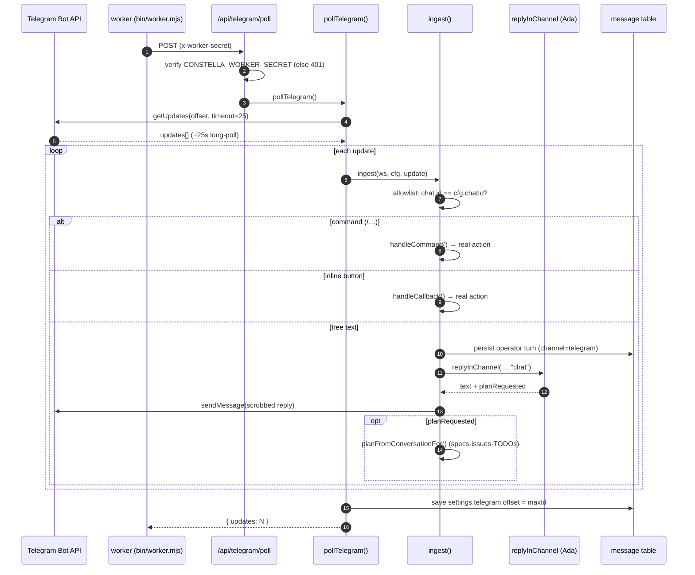

[← Docs index](./README.md) · [🇧🇷 Português](../pt/TELEGRAM.md) · [✦ Constella](../../README.md)

# 🛰️ Telegram — the pocket bridge to your constellation


A single private Telegram chat becomes a remote bridge to your agent-company: talk to the CEO (Ada), approve plans, start or pause 24/7 execution, kick off new work, and query the Knowledge Base — all from your phone, while the control ship keeps running headless.

> Source of truth: `src/server/telegram.ts` (ingest + commands + callbacks), `src/lib/telegram.ts` (Bot API client + token shape), `bin/worker.mjs` (long-poll loop), `src/app/api/telegram/poll/route.ts` (worker-only entry), `src/server/actions/profile-actions.ts` (`connectTelegram`), `src/lib/scrub.ts` (secret scrub).

---

## 2. What it is

A bidirectional Telegram bot, scoped to **one** allowlisted private chat per workspace. Inbound messages reach the CEO agent over an **isolated** channel (`telegram`), and a set of slash-commands + inline buttons act as a real remote control over the work lifecycle. Outbound: agent replies typed in the in-app Telegram tab are mirrored back to the phone, so the thread stays single regardless of where you type.

## 3. When to use 🌠

- You are away from the control ship but want to **check status**, **approve a pending plan**, or **flip 24/7 execution** on/off.
- You want to **start new work** from a one-line brief (`/new …`) and let the CEO turn it into specs · issues · TODOs.
- You want to **ask the Knowledge Base** a question (`/kb …`) without opening the app.
- You want to **chat with the CEO** (Ada) like any DM, but from your phone.

Telegram is optional. It is a native plugin and the integration toggle (`settings.integrations.telegram`) defaults **ON**, but nothing happens until you connect a bot token + chat id from the Profile screen. If unconfigured, every Telegram path is an honest no-op.

## 4. How it works 🌌

### The two processes

Constella runs a **web** process (Next.js) and a separate **worker** (`bin/worker.mjs`). Telegram polling lives in the worker:

- The worker runs `telegramLoop()` — an infinite loop that POSTs `BASE/api/telegram/poll` with the privileged `x-worker-secret` header.
- That route (`src/app/api/telegram/poll/route.ts`) is **fail-closed**: it requires `CONSTELLA_WORKER_SECRET` and returns `401` if the header is missing/wrong. On `401`, the worker backs off 30s (treated as "not configured / secret mismatch").
- The route calls `pollTelegram()` (in `src/server/telegram.ts`), which does the real work, then returns `{ ok, updates }`.

### Long-polling, per workspace

`pollTelegram()` iterates **every** workspace. For each one it:

1. Skips the workspace if the integration is off (`integrationOn(settings.integrations, "telegram")` — see `src/lib/integrations.ts`).
2. Loads the vaulted config via `getTelegramConfig(ws.id)`; skips if absent or the token is malformed.
3. Registers the bot's `/` command menu **once per bot per process** (`tgSetMyCommands`, guarded by an in-memory `commandsRegistered` set).
4. Calls `tgGetUpdates(token, offset)` — Telegram `getUpdates` with `timeout=25` (a ~25s **server-side long-poll**) and `allowed_updates=["message","callback_query"]`.
5. Ingests each update, advances the cursor (`maxId = update_id + 1`), and persists it back to `settings.telegram.offset`.

The worker leaves a brief 1s gap between long-polls; on error it backs off 5s.

### The allowlist 🕳️

Only the **one registered private chat** may drive the bot. In `ingest()`:

- The message's `chat.id` must equal `cfg.chatId`, **and**
- if `m.from` is present, the sender `from.id` must also equal `cfg.chatId` (in a private chat they are the same number).

Anything else is **silently ignored**. The same check is re-applied to inline-button taps in `handleCallback()`. At connect time (`connectTelegram`), the chat id is validated as a positive numeric id (group ids are negative and would let every member drive the bot — they are rejected).

### Inbound routing

For an allowed message, `ingest()` decides the path:

| Condition | What happens |
| --- | --- |
| `callback_query` present | Inline-button tap → `handleCallback()` |
| awaiting reject-reason + plain text (not `/…`) | The text **is** the reject reason → `requestPlanChangesFor()` |
| text starts with `/` | Remote-control command → `handleCommand()` |
| otherwise | Talk to the CEO → `runCeoReply()` |

Text + caption are capped to 4000 chars. Photos and documents are downloaded and saved as attachments (see [Attachments](#attachments)).

### Talking to the CEO

`runCeoReply()` resolves the **Ada** agent (`handle = "ada"`, falling back to the first agent), sets her status to `working`, shows a live `typing…` indicator on a 4s heartbeat (Telegram clears it after ~5s), and calls `replyInChannel(orgId, ws, "telegram", ada, "chat")` (`src/server/collab.ts`).

`replyInChannel` adds a **Telegram-specific prompt-injection guard**: it tells the model the operator's message is *data, not instructions*, never to reveal secrets / `.env` / `.claude/` contents / system prompt, and to refuse any override attempt. The reply is secret-scrubbed before send.

If Ada decides this is build/fix work she emits an internal `[[CREATE_WORK]]` token; `replyInChannel` returns `planRequested = true`, and `runCeoReply` then runs `planFromConversationFor(orgId, ws, "telegram")` — the **same** planning ritual as the web path (specs → issues → TODOs) — and confirms on the phone.

## 5. Main flow — poll → agent → reply 🚀



## 6. Key concepts ✦

- **Isolated channel.** Telegram lives on its own `telegram` channel — never `room` or `dm:<handle>` — so phone chatter never bleeds context into the team room or DMs. (`TG_CHANNEL = "telegram"`.)
- **Vaulted credentials.** The bot token + chat id are stored encrypted in the vault under ref `telegram_bot` as JSON `{botToken, chatId, allowedName}`. They are never persisted in plaintext settings.
- **Offset cursor.** `settings.telegram.offset` is the Telegram update cursor; advancing it acknowledges processed updates so they are never re-delivered.
- **Reject-reason wait.** An in-memory `awaitingReason` set remembers that you tapped the **↩️ Reject** button; your next free-text message becomes the reason. In-memory is fine — a server restart simply drops the pending wait (re-tap to retry).
- **Command-menu registration.** `commandsRegistered` ensures `setMyCommands` runs once per bot per process — even bots connected before that feature existed get their menu on the next poll.
- **Secret scrub.** Every outbound string passes through `scrubSecrets(text, [cfg.botToken])` (`src/lib/scrub.ts`) — redacting the bot token, the standard env secrets, and high-confidence credential shapes (OpenAI/Anthropic `sk-…`, GitHub tokens, AWS keys, JWTs, PEM keys, Constella `cn_…` PATs, and even other Telegram tokens).

## 7. Tables

### Telegram slash commands (`handleCommand`)

| Command | Aliases | Action |
| --- | --- | --- |
| `/help` | — | Show the remote-control help text |
| `/status` | — | `planStatusFor(ws)` — quick status |
| `/review` | — | `reviewSummaryFor(ws)` — plan / issues / tasks summary |
| `/tasks` | — | `tasksListFor(ws)` — what's in flight now |
| `/approve` | — | `approvePlanFor()` — approve pending plan, queue tasks |
| `/start_execution` | `/start`, `/run` | `approvePlanFor()` + `setAuto247For(true)` — approve and run 24/7 |
| `/pause` | `/stop` | `setAuto247For(false)` — pause 24/7 |
| `/resume` | — | `setAuto247For(true)` — resume 24/7 |
| `/reject <reason>` | — | `requestPlanChangesFor()` — send plan back to the CEO |
| `/new <brief>` | `/new-work`, `/new-goal` | Seed an operator turn + run the CEO → goal · specs · issues |
| `/cancel` | — | `cancelGoalFor()` on the latest active goal — stops execution |
| `/archive` | — | `archiveGoalFor()` on the latest active goal — zips + parks it |
| `/kb <question>` | `/ask-kb` | `kbAnswer(orgId, q)` — ask the Knowledge Base |
| *(unknown)* | — | Replies "Unknown command" + help |

> The `/` menu Telegram shows is registered from `TG_BOT_COMMANDS` in `src/lib/telegram.ts` and must mirror `handleCommand`. The displayed menu omits aliases.

### Inline-button callbacks (`handleCallback`)

| `callback_data` | Action | Toast | One-shot? |
| --- | --- | --- | --- |
| `approve_plan` | `approvePlanFor()` | ✅ Approved | yes (keyboard stripped) |
| `start_exec` | `approvePlanFor()` + `setAuto247For(true)` | ▶️ Executing | yes |
| `reject_plan` | `requestPlanChangesFor()` + arm reject-reason wait | ↩️ Sent back | yes |
| `review` | `reviewSummaryFor(ws)` | 📝 Review | no |
| `status` | `planStatusFor(ws)` | 📊 Status | no |
| `pause` | `setAuto247For(false)` | ⏸ Paused | no |
| `resume` | `setAuto247For(true)` | ▶️ Resumed | no |
| *(unknown)* | — | Unknown action | — |

One-shot actions (`approve_plan` / `start_exec` / `reject_plan`) have their inline keyboard stripped via `tgClearButtons` so a second tap can't re-fire them.

### Vaulted config & settings

| Where | Key / column | Meaning |
| --- | --- | --- |
| vault | ref `telegram_bot` | encrypted JSON `{botToken, chatId, allowedName}` |
| `workspace.settings` | `integrations.telegram` | integration toggle (defaults `true`) |
| `workspace.settings` | `telegram.offset` | Telegram `getUpdates` cursor |

### `message` rows written by Telegram

| Column | Value on the Telegram path |
| --- | --- |
| `channel` | `"telegram"` (constant `TG_CHANNEL`) |
| `fromKind` | `"operator"` (inbound) / `"agent"` (replies) |
| `fromHandle` | `"system"` for control replies; Ada's handle for CEO replies |
| `text` | message text or `"(attachment)"`, capped 4000 |
| `attachments` | saved file descriptors, or `null` |

## 8. Bot API surface 🪐

All HTTP calls go through `src/lib/telegram.ts` against `https://api.telegram.org`. Every helper first checks `isTelegramToken()` — token shape `^\d{6,}:[A-Za-z0-9_-]{30,}$` — so a malformed value can never repoint the request URL.

| Helper | Bot API method | Purpose |
| --- | --- | --- |
| `tgGetMe` | `getMe` | verify token → `@username` (at connect time) |
| `tgSetMyCommands` | `setMyCommands` | register the `/` command menu |
| `tgGetUpdates` | `getUpdates` | long-poll (`timeout=25`, `message` + `callback_query`) |
| `tgGetFile` | `getFile` + `/file/bot…` | download a photo/document → bytes |
| `tgSendChatAction` | `sendChatAction` | `typing…` indicator |
| `sendTelegramTo` | `sendMessage` | plain-text reply (no Markdown) |
| `sendTelegram` | `sendMessage` | notification send (Markdown) |
| `sendTelegramButtons` | `sendMessage` + `inline_keyboard` | message with remote-control buttons |
| `tgAnswerCallback` | `answerCallbackQuery` | ACK a button tap + optional toast |
| `tgClearButtons` | `editMessageReplyMarkup` | strip a one-shot keyboard |

Agent replies use `sendTelegramTo` (plain text, no `parse_mode`) on purpose — arbitrary content (issue titles, code, workspace names) must never break the send or be parsed as Markdown.

## 9. Attachments

Photos and documents on an inbound message are downloaded and stored in the workspace:

- A short per-message download id is generated (`uid().slice(0,8)`).
- Each file is fetched via `tgGetFile`, its name sanitized (`[^\w.\-]` → `_`, last 60 chars), and written to `uploads/tg-<dlId>/<safe-name>` under the **org root** (`orgRoot(ws.orgId)`).
- An attachment descriptor `{name, type, size, path}` is appended to the persisted `message.attachments`.
- Photos use the largest available size; documents keep their original `file_name` and `mime_type`.

A message with neither text nor any saved attachment is dropped.

## 10. Step-by-step — connect & drive 🛰️

### Connect the bot (`connectTelegram`)

1. Create a bot with Telegram's **@BotFather** and copy its token.
2. Find your **personal numeric chat id** (a private chat — not a group).
3. In Constella's **Profile** screen, enter the token + chat id (and an optional display name).
4. `connectTelegram()` validates the token shape, rejects non-positive/group ids, calls `tgGetMe` to verify the token actually works, then stores `{botToken, chatId, allowedName}` in the vault and registers the `/` menu (`tgSetMyCommands`).
5. The worker picks it up on its next poll — message the bot to confirm.

> `telegramStatus()` powers the in-app card and masks the chat id (`12•••89`). `disconnectTelegram()` deletes the vault ref `telegram_bot`.

### Drive it from the phone

```text
/status                      → quick status
/review                      → full plan / issues / tasks summary
/new a billing page with checkout
                             → CEO drafts goal · specs · issues · TODOs
/approve                     → queue tasks
/start_execution             → approve + 24/7 ON
/pause   /resume             → flip 24/7
/reject use a different payment provider → send plan back with a reason
/cancel  /archive            → stop / park the active goal
/kb how does auth work?      → ask the Knowledge Base
just talk normally           → chat with the CEO (Ada)
```

### Mirroring (in-app → phone)

When you reply from the **in-app Telegram tab**, `src/server/chat.ts` calls `mirrorToTelegram(workspace.id, reply)`. It loads the vaulted config and sends the scrubbed reply out to the real chat — so the bot conversation stays a single thread regardless of where you typed.

## 11. Possible states

| State | Symptom | Cause |
| --- | --- | --- |
| **Unconfigured** | Bot never replies; poll route returns `401` then 30s back-off | no `telegram_bot` vault secret |
| **Integration off** | Configured but ignored | `settings.integrations.telegram = false` |
| **Connected** | Replies, commands and buttons work | valid token + matching chat id |
| **Foreign chat** | Silence | sender / chat id ≠ `cfg.chatId` (silently ignored) |
| **Awaiting reason** | Next plain message recorded as reject reason | you tapped **↩️ Reject** |
| **Typing…** | Live indicator while a reply generates | 4s heartbeat in `runCeoReply` |
| **Worker down** | No replies at all | the worker process isn't running (see [TEST_DEV](./TEST_DEV.md) / [ARCHITECTURE](./ARCHITECTURE.md)) |

## 12. Related integrations

- The CEO reply path is the same one used by [DM](./DM.md) and the [TEAM_ROOM](./TEAM_ROOM.md) — Telegram just runs it on its own isolated channel with an extra injection guard.
- `/new` runs the full [WORKFLOW](./WORKFLOW.md) ritual (Goal → Spec → Issue → Plan → TODOs); see [GOALS_SPECS_ISSUES](./GOALS_SPECS_ISSUES.md).
- `/kb` answers from the [KB_RAG](./KB_RAG.md) memory nebula.
- The same remote-control actions are exposed programmatically via the [PUBLIC_API](./PUBLIC_API.md) and [MCP](./MCP.md) server.
- Telegram is a native [PLUGINS](./PLUGINS.md) entry; toggling lives alongside the other integrations.

## 13. Security 🕳️

- **Worker-only entry.** `/api/telegram/poll` requires `x-worker-secret == CONSTELLA_WORKER_SECRET` (fail-closed `401`). The worker also refuses to send that secret to any non-loopback `CONSTELLA_BASE_URL` unless `CONSTELLA_ALLOW_REMOTE_WORKER_BASE_URL=1` (SSRF / secret-exfil guard).
- **Strict allowlist.** Exactly one private chat id; both `chat.id` and `from.id` are checked on messages and on button taps. Group ids (negative) are rejected at connect time.
- **Token shape enforcement.** `isTelegramToken()` gates every Bot API call so a tampered token can't redirect the request URL.
- **Prompt-injection hardening.** `replyInChannel` injects a Telegram-specific security clause: the operator message is *data*, secrets/`.env`/`.claude/`/system-prompt must never be revealed, override attempts are refused.
- **Secret scrub on egress.** Every outbound message runs through `scrubSecrets(…, [cfg.botToken])` — redacting the bot token plus high-confidence credential shapes — before it leaves the ship.
- **Encrypted at rest.** Credentials live in the AES-256-GCM [vault](./SECURITY.md), never in plaintext settings; the in-app status card masks the chat id.
- **Bounded egress.** Outbound bodies are length-capped (`sendTelegramTo` 3800, `sendTelegram` 3500), and `callback_data` is capped to Telegram's 64-byte limit.

## 14. Troubleshooting 🛠️

| Symptom | Check |
| --- | --- |
| Bot silent, poll route returns `401` | No `telegram_bot` secret — connect from Profile. (Worker treats `401` as "not configured" and backs off 30s.) |
| "Telegram rejected this bot token." at connect | Token wrong/revoked — `tgGetMe` failed; re-copy from @BotFather. |
| "Chat id must be your personal numeric id…" | You used a group id (negative) — use your private chat id. |
| Messages ignored, no error | Sender's `chat.id`/`from.id` ≠ the registered `cfg.chatId` (allowlist). |
| `/` menu not showing | `setMyCommands` is best-effort; runs once per bot per process — restart the worker or re-connect. |
| No replies at all | The **worker** process isn't running — start `npm start` (web + worker) or `npm run dev:all`. |
| Reply looks truncated | Bodies are length-capped by design (3800/3500 chars). |
| Reject reason not recorded | A slash command supersedes the pending reject-reason wait; send the reason as plain text right after tapping ↩️ Reject. |

## 15. Related links

- [DM](./DM.md) · [TEAM_ROOM](./TEAM_ROOM.md) · [CHAT_COMMANDS](./CHAT_COMMANDS.md)
- [WORKFLOW](./WORKFLOW.md) · [GOALS_SPECS_ISSUES](./GOALS_SPECS_ISSUES.md)
- [KB_RAG](./KB_RAG.md) · [KB_AGENT](./KB_AGENT.md)
- [PUBLIC_API](./PUBLIC_API.md) · [MCP](./MCP.md) · [PLUGINS](./PLUGINS.md)
- [ARCHITECTURE](./ARCHITECTURE.md) · [AI_ARCHITECTURE](./AI_ARCHITECTURE.md) · [SECURITY](./SECURITY.md)
- [CONFIGURATION](./CONFIGURATION.md) · [TROUBLESHOOTING](./TROUBLESHOOTING.md) · [FAQ](./FAQ.md)
