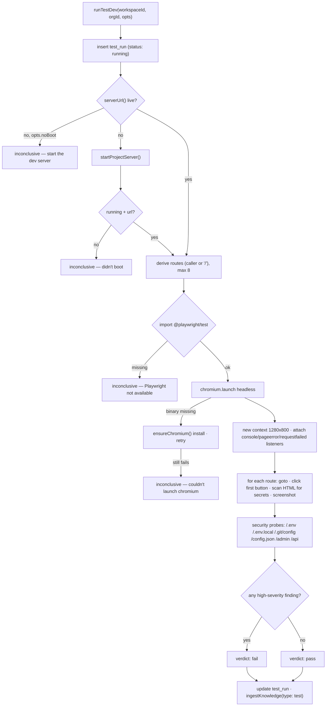
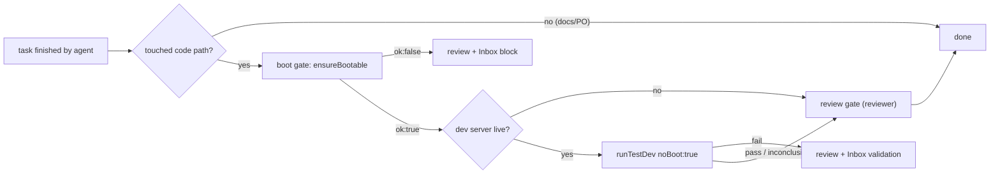

[← Docs index](./README.md) · [🇧🇷 Português](../pt/TEST_DEV.md) · [✦ Constella](../../README.md)

# Test Dev 🛰️ — flying the product before it ships


Test Dev boots the **product the agents are building** (not the Constella ship itself), drives it with a headless browser, and reports back what it saw: console errors, page crashes, failed requests, leaked secrets and a handful of security probes. It is both an **operator console** (the `/test-dev` screen) and an **autonomous gate** that the work loop crosses before a task is marked `done`.

> Star map: the product is a small probe in orbit. Test Dev is the telemetry pass — we fly it, watch the instruments, and only clear it for the next leg if nothing critical lights up. A boot that never reaches orbit is `inconclusive`, never a false `fail`.

---

## When to use 🌌

- **Operator, on demand** — open the **Test Dev** module (`/test-dev` route) or type `/test-dev` in the Team Room / a DM to run the validation pass against the running app.
- **Autonomously, as a gate** — when an agent finishes a *code* task, the work loop boots the project (boot gate) and, if a server is up, runs Test Dev as a second gate before the task can land on `done`.
- **As part of deploy prep** — `runDeployPipeline` calls `ensureBootable` in its `validateBuild` step, reusing the same dev-server machinery (see [PREPARE_DEPLOY.md](./PREPARE_DEPLOY.md)).

Use it whenever you want a *real* signal that the app still starts and renders — not a unit test, an actual browser hitting actual routes.

---

## How it works 🪐

Two server modules cooperate:

| Module | File | Responsibility |
| --- | --- | --- |
| **Dev server manager** | `src/server/devserver.ts` | Detect a runnable project, install deps once, pick a free port, spawn + supervise the project's own dev server, watch its console. |
| **Test harness** | `src/server/test-harness.ts` | Drive the running server with headless Chromium (Playwright), collect findings, run security probes, screenshot, compute the verdict, persist the run, capture it to the KB. |

The project dev server is a **long-lived child process**, one per workspace, tracked in-memory in a `SERVERS` map (`Map<workspaceId, DevServer>`). It is *not* the Constella web/worker process — it is the app under construction. On Constella boot reconcile, `stopAllProjectServers()` kills every tracked server so a restart leaves none orphaned.

---

## Main flow 🌠



### Step list (what `runTestDev` actually does)

1. **Open the run** — insert a `test_run` row with `status: "running"`, `by` = `operator` (default) or `agent`.
2. **Ensure a dev server** —
   - If a server URL is already live, use it.
   - If not and `opts.noBoot` is set (the autonomous gate path), return `inconclusive` immediately — the gate never auto-installs/boots a project mid-task.
   - Otherwise call `startProjectServer()`; if it doesn't come up, return `inconclusive`.
   - If the server is started but `serverStatus().status !== "running"` yet, return `inconclusive` ("still starting — try again shortly").
3. **Derive routes** — caller-provided `opts.routes`, else `["/"]`, capped at **8** routes.
4. **Launch the browser** — dynamic `import("@playwright/test")`. If the import fails → `inconclusive`. If `chromium.launch()` throws because the browser binary isn't installed → `ensureChromium()` runs `npx playwright install chromium` (once per process, 300s bound) and retries; still failing → `inconclusive`.
5. **Drive each route** — open a context at **1280×800**, attach listeners, then for each route: `page.goto(...)` (`domcontentloaded`, 20s timeout), record a `high` finding on HTTP ≥ 500, wait 800ms, click the first visible enabled `button` to exercise a flow, scan the served HTML for secrets, screenshot to `.testdev/`.
6. **Security probes** — `fetch` each sensitive path (`redirect: "manual"`, 4s timeout); a `200` with content (any path except `/api`) or a secret match is a `high` security finding.
7. **Verdict** — any `high`-severity finding ⇒ `fail`; otherwise `pass`. Warnings / low findings never fail a run.
8. **Persist + capture** — update the `test_run` row (`status`, `summary`, `findings`, `finishedAt`) and `ingestKnowledge(type: "test")` so the verdict becomes durable KB.

---

## Key concepts ✦

### Stack detection (`detectProject`)

`detectProject(orgId)` scans the workspace root **and** common subdirs (`packages`, `apps`, `app`, `web`, `client`, `frontend`, `backend`, `server`, `api`). It runs two passes:

- **Pass 1 — Node always wins.** `detectNode(dir)` looks for `package.json` with a `dev`, `start`, or `serve` script (in that priority). Package manager is inferred from the lockfile: `pnpm-lock.yaml` → `pnpm`, `yarn.lock` → `yarn`, else `npm`. Install is flagged only when `node_modules` is missing.
- **Pass 2 — other ecosystems**, in order: Django (`manage.py`), FastAPI (`main.py` containing `FastAPI(`) → `uvicorn`, plain `main.py` → `python main.py`, Go (`go.mod`) → `go run .`, Rust (`Cargo.toml`) → `cargo run`, static (`server.js`) → `node server.js`.

| `ProjectKind` | Trigger | Label | Install step |
| --- | --- | --- | --- |
| `node` | `package.json` + dev/start/serve | `npm/pnpm/yarn <script>` | `<pm> install` if `node_modules` missing |
| `python` (django) | `manage.py` | `django runserver` | `pip install -r requirements.txt` (once, marker) |
| `python` (fastapi) | `main.py` with `FastAPI(` | `uvicorn` | same |
| `python` (script) | `main.py` | `python main.py` | same |
| `go` | `go.mod` | `go run` | — |
| `rust` | `Cargo.toml` | `cargo run` | — |
| `static` | `server.js` | `node server.js` | — |

### Port range 🛰️

`freePort(start = 4173, end = 4999)` walks the range and returns the first port that binds on `127.0.0.1`. The range deliberately **avoids Constella's own `:3000`**. The chosen port is exported to the child as `PORT`, and any literal `$PORT` sentinel in `runArgs` is substituted before spawn. Env passed to the child: `PORT`, `BROWSER=none`, `NODE_ENV=development`.

### Toolchain pre-flight

For non-Node, non-static kinds (`python`/`go`/`rust`), `toolAvailable(cmd)` runs `<cmd> --version` (cached 60s) before booting. A missing toolchain fails **fast and clearly** instead of a 30s dead wait. In the boot gate this is treated as "can't validate, don't punish" — see Possible states.

### Ready detection + boot deadlines

`push()` watches the child's stdout/stderr; the first line matching `/(ready|listening|localhost:|started server|compiled)/i` flips `status: "starting" → "running"`. In parallel, `waitReachable(url, deadline)` polls the port. Deadlines scale by kind:

| Kind | Boot deadline |
| --- | --- |
| `go`, `rust` (compile) | 120 000 ms |
| `python` | 60 000 ms |
| `node` / `static` | 30 000 ms |

### Findings — kinds & severities 🕳️

A `Finding` is `{ severity, kind, route, message }`.

| `kind` | Source | Typical `severity` |
| --- | --- | --- |
| `console` | `page.on("console")` — `error` → high, `warning` → low | high / low |
| `pageerror` | `page.on("pageerror")` — uncaught JS exception | high |
| `request` | `page.on("requestfailed")` (non-`ERR_ABORTED`), HTTP ≥ 500 on `goto`, or a failed navigation | med / high |
| `security` | secret regex match in served HTML, or a sensitive probe path returning `200` with content | high |
| `boot` | dev server / chromium couldn't start | low |
| `fidelity` | **visual diff vs the approved design** — the running route is pixel-diffed (in-browser, 1280×800) against a baseline rendered from the promoted design screen. Small drift → `med`; structurally wrong (>50% different) → `high` | med / high |

**Visual fidelity (when a static design was promoted).** If the project has a [promoted design](DESIGN.md) served from `public/`, the harness captures a one-time **baseline** of each approved screen and pixel-diffs the running app against it. It enforces "the running app matches the design": real-data drift is a note, a screen that doesn't match (>50%) **fails the gate**. The check is fully best-effort — it never blocks a project without a promoted design and never crashes a run.

The secret detector `SECRET_RE` matches `sk-…` keys, AWS `AKIA…` IDs, PEM private-key headers, and `password: "…"` / `password='…'` literals. It is applied to both served HTML and probe response bodies.

### Security probes

`SECURITY_PATHS = ["/.env", "/.env.local", "/.git/config", "/config.json", "/admin", "/api"]`. Each is fetched against the **local project dev server only** — never an external host. A `200` that returns content (every path except `/api`, which is allowed to be a routable 200) is flagged as a high-severity `security` finding, as is any response body matching `SECRET_RE`.

### Verdict logic

```text
high = findings where severity === "high"
status = high.length ? "fail" : "pass"
```

Only **hard (high-severity)** findings block. Warnings and low-severity notes are recorded but do not fail the run. If the app can't boot, Playwright is missing, or chromium won't launch, the verdict is **`inconclusive`** — a deliberate design choice so the harness never produces a false `fail` and never wrongly blocks a task.

---

## The `test_run` table 🗄️

Defined in `src/db/schema.ts` (`sqliteTable("test_run", …)`):

| Column | Type | Notes |
| --- | --- | --- |
| `id` | text PK | run UUID |
| `workspaceId` | text → `workspace.id` | cascade delete; indexed (`test_run_ws_idx`) |
| `goalId` | text, nullable | optional link to the goal under test |
| `issueId` | text, nullable | optional link to the issue under test |
| `status` | enum `running` \| `pass` \| `fail` \| `inconclusive` | default `running` |
| `summary` | text | default `""`; persisted slice of ≤ 600 chars |
| `findings` | text (JSON) | `Finding[]` serialized; persisted slice of ≤ 20 000 chars |
| `by` | enum `operator` \| `agent` | who triggered the run |
| `startedAt` | integer timestamp | defaults to now |
| `finishedAt` | integer timestamp, nullable | set on `finish()` |

The `/test-dev` page (`src/app/(app)/test-dev/page.tsx`) lists the **20 most recent** runs for the workspace plus the live `serverStatus(workspace.id)`.

---

## Possible states 🌌

### Dev server status (`DevServerStatus.status`)

| State | Meaning |
| --- | --- |
| `none` | no server tracked for this workspace |
| `starting` | spawned, not yet reachable / no ready line seen |
| `running` | reachable / printed a ready line |
| `stopped` | exited cleanly or stopped by operator |
| `error` | spawn failed, exit ≠ 0, missing toolchain, or no free port |

### Test verdict (`TestVerdict`)

| Verdict | When |
| --- | --- |
| `pass` | no high-severity findings |
| `fail` | ≥ 1 high-severity finding |
| `inconclusive` | couldn't boot / no runnable project / Playwright or chromium unavailable / server not reachable yet / `noBoot` and nothing running |

---

## Step-by-step 🚀

### Run it as the operator

1. Open the **Test Dev** module, or type `/test-dev` in the Team Room or a DM.
2. If no dev server is up, start it from the module (this calls `startDevServerAction` → `startProjectServer`, installing deps the first time).
3. Run the validation pass. Edsger posts the result back into the thread:
   `Test Dev — **pass** … Navigated N route(s).`
4. Inspect findings + screenshots (saved under `<org-root>/.testdev/<runId>-<route>.png`).

### Run it for a specific issue

`runTestDevAction({ issueId })` resolves routes with `routesForIssue(workspaceId, issueId)`, which mines the issue title/key for `/path`-looking substrings (up to 4) and always includes `/`.

---

## Examples 🛰️

**Operator slash command (`/test-dev`)** — handled in `src/server/commands.ts`:

```text
operator: /test-dev
edsger:   🧪 Running the Test Dev validation gate…
edsger:   Test Dev — pass. Passed — 2 note(s), no blocking issues. Navigated 1 route(s).
```

**Autonomous gate (runner)** — after a code task, in `src/server/runner.ts`:

```ts
// boot gate — the project MUST still boot
const boot = await ensureBootable(ws.id, ws.orgId);
if (!boot.ok) {
  next = "review";
  await pushInbox(ws.id, { kind: "block", refType: "task", refId: t.id, /* … */
    title: `${t.key} broke the dev server`, detail: `${t.title}\n\n${boot.detail}` });
}

// Test Dev gate — only if a server is already up (noBoot: true)
if (next === "done" && serverUrl(ws.id)) {
  const gate = await runTestDev(ws.id, ws.orgId, { goalId: t.goalId, issueId: t.issueId ?? undefined,
    by: "agent", noBoot: true, routes: /* routesForIssue */ });
  if (gate.status === "fail") {
    next = "review";
    await pushInbox(ws.id, { kind: "validation", refType: "validation", refId: gate.id, /* … */
      title: `${t.key} failed Test Dev`, detail: gate.summary });
  }
}
```

---

## Edsger gating + the two-gate model 🪐

The autonomous work loop applies **two** gates before a code task can be marked `done`:

1. **Boot gate (`ensureBootable`)** — applies when `next === "done"` and the task touched at least one *code* path (`isCodePath`: anything not under `.claude/`, `DOCS/`, `PO/`, `Reports/`, `specs/`, `issues/`, `mock/`, and not a top-level `*.md`). If the project no longer boots, the task is sent back to `review`, an Inbox `block` is filed (`"<key> broke the dev server"`), and the operator is notified. A *missing toolchain* returns `ok: true` (skip, "cannot validate"), never a false block.
2. **Test Dev gate (`runTestDev`, `noBoot: true`)** — applies when `next === "done"` **and a dev server is already live** (`serverUrl(ws.id)`). Because of `noBoot`, this gate never installs/boots a project mid-task — it only validates what's already up. A `fail` verdict sends the task back to `review` with an Inbox `validation` item (`"<key> failed Test Dev"`).

**Edsger** is the QA/test agent (handle `edsger`, reports to `linus`). When Test Dev runs as the autonomous gate (`by: "agent"`), the KB capture is attributed to `edsger`; when run from `/test-dev`, Edsger is the persona that posts the verdict into the conversation. Both gates are designed to **degrade to `inconclusive`/skip** rather than wrongly hold a task.



---

## Screenshots & artifacts 🌠

- Screenshots are written to `<org-root>/.testdev/<runId>-<route>.png` (route slugged to `[a-z0-9_]`, `root` for `/`). The directory is created best-effort with `mkdirSync(..., { recursive: true })`.
- The KB capture (`ingestKnowledge`) writes a `test`-type entry titled `Test Dev — <status>` with the summary, linked to the goal/issue, attributed to `edsger` (agent runs) or `operator`.
- The `.testdev/` directory is a Constella control artifact — it is stripped from the clean source tree by deploy prep (`buildCleanTree`) and is not part of the shipped product.

---

## Related integrations 🛰️

- **Work loop / runner** — `src/server/runner.ts` wires both gates (see [WORKFLOW.md](./WORKFLOW.md), [AGENTS.md](./AGENTS.md)).
- **Inbox** — failed gates file `block` / `validation` items (see [INBOX.md](./INBOX.md)).
- **KB / RAG** — every verdict is ingested as durable `test` knowledge (see [KB_RAG.md](./KB_RAG.md), [KB_AGENT.md](./KB_AGENT.md)).
- **Prepare Deploy** — reuses `ensureBootable` + `detectProject` in its `validateBuild` step (see [PREPARE_DEPLOY.md](./PREPARE_DEPLOY.md)).
- **Chat commands** — `/test-dev` and `/review` (see [CHAT_COMMANDS.md](./CHAT_COMMANDS.md)).
- **Project stacks** — stack detection mirrors the runnable-starter ecosystems (see [PROJECT_STACKS.md](./PROJECT_STACKS.md)).

---

## Security 🕳️

- **Probes are local-only.** Security probes and the iframe-frameability check (`previewFrameableAction`) only ever target `127.0.0.1` / `localhost`. The harness never points a browser or `fetch` at an external host.
- **Secret scanning** runs on served HTML and on probe response bodies via `SECRET_RE`; a hit is a high-severity `security` finding (and, if surfaced in the product output, something the agents must fix before deploy).
- **Sensitive-path probing** confirms `/.env`, `/.git/config`, `/admin`, etc. are not served unauthenticated by the app under test.
- **No false fail.** Inability to boot or to install Chromium yields `inconclusive`, never `fail` — the gate cannot be turned into a denial-of-progress by a flaky toolchain.
- The project dev server runs with `NODE_ENV=development`, `BROWSER=none`, inside the org workspace; on Constella restart, `stopAllProjectServers()` reaps it.

See [SECURITY.md](./SECURITY.md) for the overall trust model.

---

## Troubleshooting 🌌

| Symptom | Cause | Fix |
| --- | --- | --- |
| `inconclusive — No runnable project` | no `package.json` dev/start/serve script and no Python/Go/Rust/`server.js` entry | add a `dev`/`start` script or a recognized entry point under the workspace |
| `inconclusive — Playwright not available` | `@playwright/test` not installed | install Playwright in the install dir |
| `Couldn't install/launch chromium` | browser binary missing, install timed out (300s) | run `npx playwright install chromium` in the install dir, then retry |
| `inconclusive — Dev server is still starting` | port not reachable yet within the deadline | wait and re-run; for go/rust first compile this can take up to 120s |
| `error — Toolchain not found: '<cmd>'` | python/go/cargo not on `PATH` | install the toolchain, or pick a Node stack (the boot gate skips it as "cannot validate") |
| `error — No free port available` | nothing free in `4173–4999` | free a port in the range or stop stale dev servers |
| Boot gate held the task (`"<key> broke the dev server"`) | the change left the project unbootable | fix the build/import error; the task is parked at `review` with the boot log in the Inbox |
| Preview iframe shows a browser error | app sends `X-Frame-Options` / restrictive CSP `frame-ancestors` | expected — `previewFrameableAction` detects it; open the app in a new tab |

---

## Related links ✦

- [WORKFLOW.md](./WORKFLOW.md) — the full work lifecycle and where the gates sit
- [AGENTS.md](./AGENTS.md) — Edsger (QA) and the roster
- [PREPARE_DEPLOY.md](./PREPARE_DEPLOY.md) — reuse of `ensureBootable` in deploy prep
- [DEPLOY.md](./DEPLOY.md) — launching the product
- [INBOX.md](./INBOX.md) — where failed gates land
- [KB_RAG.md](./KB_RAG.md) · [KB_AGENT.md](./KB_AGENT.md) — durable test knowledge
- [CHAT_COMMANDS.md](./CHAT_COMMANDS.md) — `/test-dev`, `/review`
- [PROJECT_STACKS.md](./PROJECT_STACKS.md) — stacks the dev server can boot
- [SECURITY.md](./SECURITY.md) · [TROUBLESHOOTING.md](./TROUBLESHOOTING.md)
