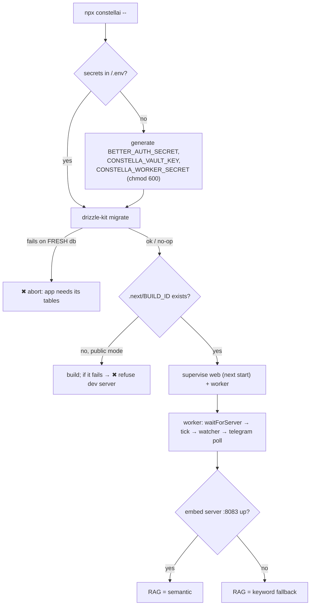
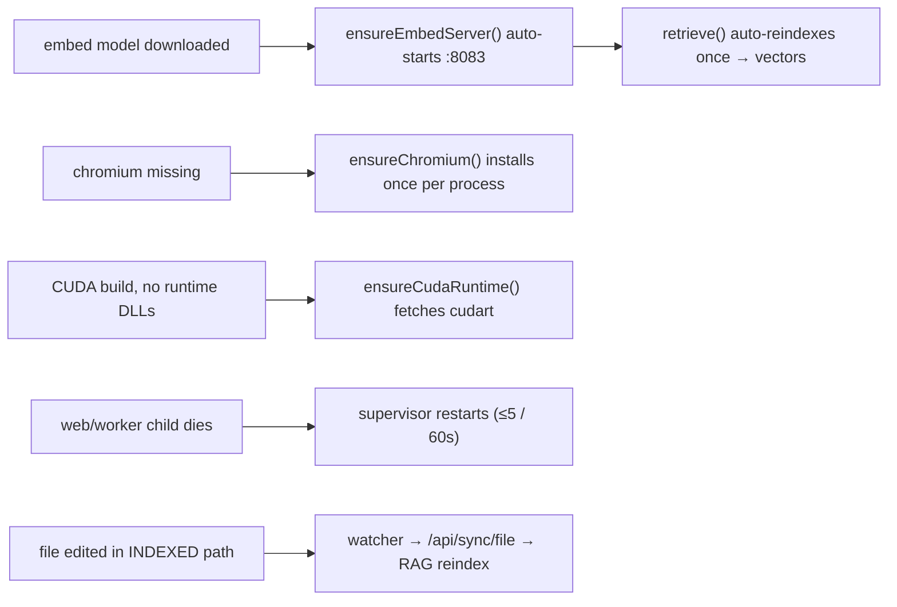

[← Docs index](./README.md) · [🇧🇷 Português](../pt/TROUBLESHOOTING.md) · [✦ Constella](../../README.md)

# Troubleshooting 🛰️ — when the constellation drifts off course

Real, code-grounded fixes for the things that actually break: a busy port, a sleeping embed server, a missing browser, an unauthenticated CLI, a stalled worker. Every symptom below is traced to a concrete line of behaviour in the codebase — no folklore.

> The central ship runs two engines (web + worker) and a fleet of satellite services (embed server, llama.cpp, Telegram poll, the project dev server). When one drops out of orbit, Constella is designed to **degrade, not crash**. This page tells you which star went dark and how to relight it.

---

## 1. When to use 🌌

Reach for this page when:

- An install target won't boot (`npx constellai --start`, `--vps`, `--portable`).
- Something *works but quietly degrades* — RAG goes keyword-only, Test Dev returns `INCONCLUSIVE`, agents fall back to a default model.
- The 24/7 loop seems frozen: no agent moves, no Telegram reply, no cron tick.
- An install/first-run problem: build fails, `claude`/`codex` not found, drive too small.

For deeper background on any subsystem, follow the [Related links](#15-related-links--sibling-docs) at the bottom — this page is the triage desk, not the full manual.

---

## 2. How it works — the fail-soft design 🪐

Constella's diagnostics rest on three principles baked into the source:

| Principle | Where it lives | What it means for you |
|---|---|---|
| **Fail closed on secrets/auth** | `src/app/api/cron/tick/route.ts`, `bin/worker.mjs` | Missing `CONSTELLA_WORKER_SECRET` → the tick endpoint returns **401**, the worker won't even talk to a non-loopback host. A security gap never silently opens. |
| **Fail soft on capability** | `src/server/rag.ts`, `src/server/test-harness.ts`, `src/server/adapters/cli.ts` | No embed server → keyword retrieval. No Playwright → `inconclusive`. Bad model id → CLI default. A missing *capability* degrades; it doesn't error the whole flow. |
| **Honest status** | `src/server/local-models.ts`, `src/server/devserver.ts` | Server "up?" probes return the real reason (`"llama-server not installed"`, `"no embedding model installed"`). The UI shows what the code actually found — never a fabricated "ready". |

So most troubleshooting is **reading the honest reason** the code already surfaced, then fixing the named cause.

---

## 3. Main flow — boot order and where it can break 🌠

Each diamond is a place a real symptom appears. The table in [§7](#7-symptom--cause--fix--the-master-table-) maps every one of them to a fix.

---

## 4. Key concepts 🕳️

- **Runtime root** — everything lives under `<HOME>` (default `~/.constella`, override with `CONSTELLA_HOME` or `--path`). The DB is `<HOME>/constella.db`; secrets are `<HOME>/.env`. When something can't find data, this is the first path to confirm.
- **Dual process** — the web server (`next start`) and the worker (`bin/worker.mjs`) are separate. A frozen UI and a stalled 24/7 loop are *different* problems with *different* logs.
- **Loopback-only worker** — the worker attaches the privileged `x-worker-secret` to every call and **refuses** any non-loopback `CONSTELLA_BASE_URL` unless you set `CONSTELLA_ALLOW_REMOTE_WORKER_BASE_URL=1`.
- **Capability probes** — `embedServerUp()`, `llamaServerStatus()`, `cliVersion()`, `detectCliAuth()`, `toolAvailable()` are all real, bounded probes. They never throw; they return a status you can act on.

---

## 5. Diagnostic command kit 🚀

| Goal | Command | Reads |
|---|---|---|
| Version + update availability | `npx constellai update --check` | npm registry (`registry.npmjs.org/constellai/latest`) |
| Is the Claude CLI authed? | `claude --version` then sign in to Claude Code | `cliVersion("claude")` / `detectCliAuth` |
| Is the Codex CLI authed? | `codex --version`, then `codex login` | same |
| Embed server alive? | `curl http://127.0.0.1:8083/health` | `embedServerUp()` |
| Chat llama server alive? | `curl http://127.0.0.1:8082/v1/models` | `llamaServerStatus()` |
| Worker reachable target | check `CONSTELLA_BASE_URL` (must be loopback) | `bin/worker.mjs` SSRF guard |
| Manually re-run the schema | `npm run db:migrate` | `drizzle-kit migrate` |
| Free space on the runtime drive | launcher prints it in portable mode | `freeBytes()` / `checkUsbFreeSpace()` |

> The launcher never prints secrets — it logs `• Secrets ready (stored in <HOME>/.env, never printed).` Don't go looking for them in the console.

---

## 6. Step-by-step triage 🌌

1. **Read the launch banner.** `bin/constella.mjs` prints the runtime root, the mode + bind, and the next-start line. A wrong `<HOME>` here explains most "my data vanished" reports.
2. **Separate web from worker.** Is the *UI* broken, or is the *loop* not advancing? They have independent supervisors (max 5 restarts / 60 s each) and independent stdout.
3. **Check the honest probe.** Open the relevant page (Models, Test Dev) — the code already surfaced the real reason. Match it to the table below.
4. **Fix the named cause**, then let the self-heal kick in (the embed server auto-starts, RAG auto-reindexes once embeddings appear, chromium auto-installs once).
5. **If a child crash-loops**, the supervisor gives up after 5 restarts in 60 s and prints a hint (e.g. "Likely OS-level OOM … raise `CONSTELLA_WEB_HEAP_MB`").

---

## 7. Symptom · Cause · Fix — the master table 🛰️

### 7.1 Boot & install

| Symptom | Cause | Fix |
|---|---|---|
| `npx constellai …` → `'constella' is not recognized` (Windows) | An old release whose bin (`constella`) didn't match the package name (`constellai`), so npx couldn't resolve the command | Upgrade — current releases ship a matching **`constellai`** bin. Or install globally and use the short command: `npm i -g constellai && constella --start`. |
| `EADDRINUSE` / "port 3000 in use" on launch | Another process holds the chosen port (web on 3000, or a stale Constella) | Pass `--port <n>` (or `PORT=<n>`), or stop the other process. The launcher reads `--port` → `PORT` → `3000`. |
| `✖ drizzle-kit not found in the install` | Incomplete install (dep tree trimmed) | Reinstall the package. `drizzle-kit migrate` is mandatory — the launcher aborts without it. |
| `✖ Database schema migration failed on a fresh database — aborting` | Migrations couldn't apply to a brand-new `<HOME>/constella.db` | Inspect the drizzle error above it. A fresh DB with no tables would 500 on every request, so boot fails closed by design. On an *existing* DB a failed re-run is tolerated (logged `• schema migrate skipped/failed … continuing`). |
| `✖ No production build and the build failed … Refusing to start a dev server in a public/network mode` | Running a source tree with no `.next/BUILD_ID`, build failed, public mode (`CONSTELLA_PUBLIC=1`) | Install a prebuilt package, or run `npm run build`. A CLI launch never silently downgrades to the unhardened `next dev`. Devs may opt in with `CONSTELLA_DEV=1` (source tree only). |
| Build-on-first-run is slow then succeeds | Source tree without a build → one-time `next build` | Expected once. The published npm package ships a prebuilt `.next`, so end users never hit this. |
| `✖ next not found in the install` | Trimmed/broken `node_modules` | Reinstall the package. |

### 7.2 Agent execution (claude / codex CLIs)

| Symptom | Cause | Fix |
|---|---|---|
| Agent runs error instantly, result text is a spawn error | `claude` (or `codex`) **not installed / not on PATH** | Install the CLI; verify with `claude --version`. `runProc` spawns the bare binary in the workspace cwd. |
| **Detected providers** miss Claude Code / Codex on a **VPS (systemd) install** — or agent runs can't spawn the CLI | `constella.service` ran with systemd's **minimal PATH** (`/usr/bin:/bin`), which excludes the per-user dirs (`~/.local/bin`, `~/.npm-global/bin`, the Claude native install) where the CLIs live — even though they work in your shell | Reinstall / upgrade with the current `vps-install.sh` — it bakes a full `Environment=PATH` into the service (covers **all** CLIs: claude, codex, aider, cursor-agent, …). Already running? Quick fix: `sudo ln -sf "$(command -v claude)" /usr/local/bin/claude` then `sudo systemctl restart constella` and reload the page. Robust (covers every CLI): drop a `[Service] Environment=PATH=…` file in `/etc/systemd/system/constella.service.d/` — see [VPS_MODE](./VPS_MODE.md). |
| Agent runs but result is empty / "needs login" | CLI installed but **not authenticated** | Sign in to Claude Code; for Codex run `codex login`. `detectCliAuth` checks `~/.claude/.credentials.json`, `~/.codex/auth.json`. `LOGIN_HINTS` shows the per-CLI action in the UI. |
| Run ends with `error: "timed out"` | The CLI exceeded the **180 s** default timeout | Heavy tasks: increase the timeout for that adapter, or split the work. The runner SIGKILLs at the cap and records `timed out` honestly. |
| Agent ignores its configured model | Model id failed `safeModel` validation (injection guard) | Use a plausible CLI model id (`opus`/`sonnet`/`haiku`, `gpt-5-codex`, or `provider/model`). An invalid value is dropped and the CLI uses its own default. |
| Agents "talk weird" (clipped, article-dropped) | Operator's personal `~/.claude` hooks/plugins leaked into the headless run | Already mitigated: agents run with a `--settings {disableAllHooks:true}` overlay. If you enabled the lock/guard hooks, isolation uses a clean config dir instead. |
| Agent can't install deps / run tests | Install target is **jailed** (`--vps`/`--portable` → `acceptEdits`, codex `workspace-write`) | Expected hardening. Override with `CONSTELLA_AGENT_FULL_ACCESS=1` (or `=0` to re-jail a local `--start`). |
| Web research not happening | `CONSTELLA_WEB_RESEARCH=0` or per-workspace `settings.agents.webResearch=false` | Web tools are ON by default (`--allowedTools WebSearch WebFetch`). Re-enable it. |

### 7.3 RAG / KB memory nebula 🌌

| Symptom | Cause | Fix |
|---|---|---|
| Retrieval feels shallow / keyword-only | **Embed server :8083 down** → semantic search unavailable | `embed()` tries Ollama (`OLLAMA_URL`), then llama.cpp (`CONSTELLA_EMBED_URL` :8083). With neither, `retrieve()` falls back to a keyword heuristic (`mode: "heuristic"`). Download `nomic-embed-text`; the embed server auto-starts on boot and after the model lands. |
| Chunks exist but have no vectors | Index was built while the embed server was down | No action needed — once embeddings become available, `retrieve()` auto-reindexes **once per process** (`autoReindexed` guard) so chunks get vectors. Force it from Models → Reindex. |
| `retrieve` returns `mode: "none"` | No chunks at all (empty index) | First call lazily runs `indexRag`. If still empty, there's nothing in the indexed dirs (`.claude`, `DOCS`, `PO`, `Reports`, `specs`, `issues`, `mock`). |
| Internal prompts/skills leak into answers | — | Can't happen: `.claude/kb/` and `.claude/skills/` are excluded from RAG by `inRagDirs`. |
| Ollama path errors | Ollama not running | Start it (`ollama serve`) and pull `nomic-embed-text`, or just rely on the dedicated llama.cpp embed server. |

### 7.4 Test Dev (the project's dev server + Playwright) 🚀

| Symptom | Cause | Fix |
|---|---|---|
| Verdict is `INCONCLUSIVE`, message "Playwright not available" | `@playwright/test` not importable | `npx playwright install chromium` in the install dir, then retry. |
| `INCONCLUSIVE`, "Couldn't install/launch chromium" | The browser binary is missing (npm installs the lib, not the browser) | Test Dev auto-runs `npx playwright install chromium` once per process; if that fails, run it manually. |
| `INCONCLUSIVE`, "No runnable project / dev server didn't boot" | No `package.json` dev/start script, or no Python/Go/Rust project under the workspace | Add a runnable entry (`detectProject` scans root + `apps`/`web`/`server`/… subdirs). |
| `INCONCLUSIVE`, "Toolchain not found: 'python'/'go'/'cargo'" | The non-Node starter's toolchain isn't installed | Install the toolchain, or pick a Node stack. `toolAvailable()` pre-flights it to fail fast instead of a 30 s dead wait. |
| `INCONCLUSIVE`, "Dev server is still starting" | Server booted but the port isn't reachable yet | Retry shortly. Go/Rust first boots get 120 s, Python 60 s, Node 30 s. |
| `INCONCLUSIVE` not `FAIL` when the app is broken | By design — Test Dev never returns a **false fail** | Only high-severity findings flip the verdict to `FAIL`. A boot/tooling problem is `inconclusive`. |

### 7.5 Worker / 24/7 loop 🛰️

| Symptom | Cause | Fix |
|---|---|---|
| Nothing advances autonomously; no tick logs | Worker can't reach the web server | The worker probes `CONSTELLA_BASE_URL` for ~90 s before the first tick. Confirm the web server is up and the base URL is the loopback `http://127.0.0.1:<port>`. |
| Worker prints `✖ Refusing to send the worker secret to a non-loopback host` and exits | `CONSTELLA_BASE_URL` points at a non-loopback host | The SSRF guard is intentional. For a genuine remote worker, set `CONSTELLA_ALLOW_REMOTE_WORKER_BASE_URL=1` (prefer `https://`). |
| Cron tick returns **401 unauthorized** | `CONSTELLA_WORKER_SECRET` missing or mismatched | The endpoint fails closed. The launcher persists the secret in `<HOME>/.env`; make sure both web and worker inherit the same env. |
| Tick runs but no agent moves | The autonomous loop only runs workspaces with **Run 24/7 ON** | `tickAll({ execute: true, auto: true })` skips workspaces where the operator hasn't enabled the 24/7 loop. Turn it on (or approve the plan first). |
| Watcher never indexes file edits | The file isn't in an INDEXED path | The worker only syncs `.claude/skills/*.md`, `.claude/agents/<h>/{Agent,skills}.md`, `DOCS/*.md`, `PO/*.md`, `Reports/*.md`. Other files are ignored by design. |
| Worker keeps restarting | A child crashed; supervisor auto-restarts (max 5 / 60 s) | After 5 crashes in 60 s it gives up and prints a hint. Check the child's stderr; for OOM, raise `CONSTELLA_WEB_HEAP_MB` or cap concurrent agents. |

### 7.6 Telegram 🌠

| Symptom | Cause | Fix |
|---|---|---|
| Bot doesn't respond | Integration off, or no vaulted token | The poll skips workspaces where the `telegram` integration is off or `getTelegramConfig` returns nothing. Enable the integration and set the bot token. |
| Telegram poll returns **401** | `CONSTELLA_WORKER_SECRET` missing/mismatched | Same fail-closed gate as cron tick; the worker backs off 30 s and retries. Fix the shared secret. |
| Bot ignores your messages | You're not on the allowlist | Only the registered private chat may talk: both `chat.id` and `from.id` must equal the configured `chatId`. Anything else is silently dropped. |
| `/` command menu missing | `setMyCommands` not yet run for that bot | It auto-registers once per process on the next poll (`commandsRegistered` guard). Wait one cycle. |
| Slow / one-message-per-poll feel | Long-poll: `getUpdates` waits ~25 s server-side | Expected. The worker adds a 1 s gap between long-polls. |

### 7.7 Auth & secrets 🕳️

| Symptom | Cause | Fix |
|---|---|---|
| Fresh install shows the **Sign in** screen and login fails with `User not found` | A **stale `~/.constella`** from a previous install. The runtime root persists across installs by design; its `<HOME>/.env` still has `CONSTELLA_OPERATOR_PW_SET=1` (forces the login screen) while its DB has a different / no operator. `operator@constella.dev` is only the **dev** seed — a real fresh install has no account. | Use the **Sign up** screen to create the first operator. If it's stuck on Sign in, you're reading old data: remove or rename `~/.constella` (back up first — it holds the DB, secrets, workspaces), or set `CONSTELLA_HOME` to a fresh dir, then relaunch → signup. |
| better-auth throws on a default secret | No real `BETTER_AUTH_SECRET` | The launcher generates + persists one in `<HOME>/.env` (`chmod 600`) for **every** install target (auth is universal). If you cleared `.env`, just relaunch — it regenerates. |
| Vault can't decrypt provider keys / Telegram token | `CONSTELLA_VAULT_KEY` changed or missing | The vault is AES-256-GCM keyed by `CONSTELLA_VAULT_KEY`. **Changing it orphans existing ciphertext.** Restore the original key from `<HOME>/.env`, or re-enter the secrets. |
| VPS unreachable over the tailnet | Bound `0.0.0.0` but Tailscale not wired | VPS mode binds `0.0.0.0` for the tailnet and runs natively on the host. Verify the systemd service + Tailscale; the worker talks to the server on loopback. |

### 7.8 Portable & disk space 🪐

| Symptom | Cause | Fix |
|---|---|---|
| `✖ Portable mode: no removable USB drive detected` | No USB drive mounted | Insert a pen-drive, or pass `--path <drive>` explicitly. |
| `✖ Portable needs at least 32 GB free` and exits | Drive below the hard minimum (`PORTABLE_MIN_GB = 32`) | Use a bigger drive. This is a fatal gate. |
| `• <n> GB free on the drive — good` | At or above the 32 GB minimum (`PORTABLE_RECOMMENDED_GB = 32`) | Boots normally — more headroom only helps if you carry local models. |
| GGUF download refused: "not enough free space" | Drive can't hold `sizeBytes * 1.1` | Free space or pick a smaller quant. The check runs before the download starts. |
| Downloaded model fails to load | Truncated/corrupt download | `verifyDownloadedFileSize` (2% tolerance) and the optional SHA-256 catch this; the file is deleted. Re-download. |

### 7.9 Database & migrations 🌌

| Symptom | Cause | Fix |
|---|---|---|
| App 500s on every request after a manual schema change | Tables missing/inconsistent | Re-apply with `npm run db:migrate` (idempotent). The launcher does this automatically on boot. |
| Lost the operator password after a "reset" | You ran `db:reset` / `db:nuke` (wipes `.constella` + `organizations`) | Avoid the nuke scripts on a real install — they destroy data. Prefer surgical scripts (`db:reset-state`, `db:repair-fs`). For a demo only, `db:reset-demo`. |
| `db:push` rewrote things unexpectedly | `drizzle-kit push` is the unsafe dev path | Use `db:migrate` (generated, versioned SQL), not `db:push`, on anything you care about. |

---

## 8. Self-heal map — what fixes itself 🌠

If a symptom is on the left, **wait one cycle** before intervening — the system likely recovers on its own.

---

## 9. Possible states 🛰️

| Subsystem | Healthy | Degraded | Down |
|---|---|---|---|
| RAG | `mode: "semantic"` | `mode: "heuristic"` (keyword) | `mode: "none"` (no chunks) |
| Test Dev | `PASS` | `INCONCLUSIVE` | `FAIL` (only high-severity findings) |
| Embed server | `embedServerUp() → true` | — | reason: "not installed" / "didn't come up" |
| llama chat server | `llamaServerStatus().up` | — | reason: "no chat GGUF" / "not installed" |
| Worker | ticks logged every ~60 s | retrying (server warming) | exited after 5 crash-loops |
| CLI auth | `detectCliAuth → "ready"` | `"unknown"` | `"needs_login"` / `"needs_key"` |
| Agent run | `ok: true` | partial (provider-routed CLI, 0 cost reported) | `error` set (timeout / no JSON / exit code) |

---

## 10. Examples 🚀

**A. RAG quietly went keyword-only.** You notice answers are less precise. Check `curl http://127.0.0.1:8083/health` → no response. Open **Models**, confirm `nomic-embed-text` is installed, click **Start embeddings** (or just reboot — `ensureEmbedServer` runs on boot). Next query returns `mode: "semantic"`.

**B. Test Dev keeps saying INCONCLUSIVE.** The first run reports "Couldn't install/launch chromium." Run `npx playwright install chromium` in the install dir, retry. Now navigation + console capture run and you get `PASS`/`FAIL`.

**C. Agents do nothing overnight.** Tick logs are present but no work card moves. The goal's plan exists but **Run 24/7 is off** — `tickAll(auto:true)` skips it. Approve the plan and enable Run 24/7.

**D. Worker exits immediately on a VPS.** Log: `✖ Refusing to send the worker secret to a non-loopback host`. Your `CONSTELLA_BASE_URL` points at a public hostname. Set it to the in-container loopback, or `CONSTELLA_ALLOW_REMOTE_WORKER_BASE_URL=1` over `https://` if remote is truly intended.

---

## 11. Related integrations 🪐

- **Models / local engine** — embed (:8083) and chat (:8082) llama.cpp servers, Ollama fallback. See [MODELS](./MODELS.md).
- **Test Dev** — project dev server boot + Playwright. See [TEST_DEV](./TEST_DEV.md).
- **Telegram** — remote control + poll. See [TELEGRAM](./TELEGRAM.md).
- **GitHub** — token/auth, commit/push, secret-scan gate. See [GITHUB](./GITHUB.md).
- **Public API / MCP** — PAT auth, rate limits. See [PUBLIC_API](./PUBLIC_API.md) and [MCP](./MCP.md).

---

## 12. Security notes 🕳️

- Several "errors" are **security gates, not bugs**: the 401 on the cron/Telegram endpoints, the worker's loopback-only refusal, the build-mode refusal to drop to `next dev`, and the portable space gate. Don't bypass them blindly.
- Secrets never appear in logs — the launcher prints `• Secrets ready` and nothing else; `scrubSecrets` strips them before KB ingest, Telegram and logs. If you see a secret in output, treat it as an incident.
- `<HOME>/.env` is written `chmod 600`. If permissions widened, re-tighten them.
- The destructive-command guard (`bin/guard-hook.mjs`, default on) and file-lock hook are defense-in-depth around agent shell. See [SECURITY](./SECURITY.md).

---

## 13. When to escalate 🌠

If a fix above doesn't apply, gather:

1. The **launch banner** (runtime root, mode, bind, port).
2. The **honest probe reason** from the relevant page (Models / Test Dev).
3. Whether it's a **web** or **worker** problem (separate stdout).
4. `npx constellai update --check` output (version + latest).

Then check [FAQ](./FAQ.md) and the [TROUBLESHOOTING] entries here, and consult [INSTALLATION](./INSTALLATION.md) / [CONFIGURATION](./CONFIGURATION.md) for environment specifics.

---

## 14. Quick reference — env knobs 🛰️

| Var | Effect | Default |
|---|---|---|
| `CONSTELLA_HOME` / `--path` | Runtime root | `~/.constella` |
| `PORT` / `--port` | Web port | `3000` |
| `--host` | Bind address | `127.0.0.1` (`--start`), `0.0.0.0` (`--vps`/`--portable`) |
| `CONSTELLA_WORKER_SECRET` | Cron/Telegram auth | generated in `<HOME>/.env` |
| `CONSTELLA_BASE_URL` | Worker → server target (loopback) | `http://127.0.0.1:<port>` |
| `CONSTELLA_ALLOW_REMOTE_WORKER_BASE_URL` | Allow non-loopback worker target | unset (off) |
| `CONSTELLA_EMBED_URL` | Embed server | `http://127.0.0.1:8083` |
| `OLLAMA_URL` | Ollama embed fallback | `http://127.0.0.1:11434` |
| `LLAMACPP_URL` | Chat server | `http://127.0.0.1:8082` |
| `CONSTELLA_AGENT_FULL_ACCESS` | Agent shell access | `1` with `--start`, else `0` |
| `CONSTELLA_WEB_RESEARCH` | Agent WebSearch/WebFetch | on |
| `CONSTELLA_WEB_HEAP_MB` | Web Node heap cap | Node default |
| `CONSTELLA_DEV` | Allow `next dev` fallback (source) | unset |

---

## 15. Related links — sibling docs 🌌

- [INSTALLATION](./INSTALLATION.md) · [CONFIGURATION](./CONFIGURATION.md) · [FAQ](./FAQ.md)
- [START_MODE](./START_MODE.md) · [VPS_MODE](./VPS_MODE.md) · [PORTABLE_MODE](./PORTABLE_MODE.md)
- [ARCHITECTURE](./ARCHITECTURE.md) · [AI_ARCHITECTURE](./AI_ARCHITECTURE.md) · [AGENTS](./AGENTS.md)
- [MODELS](./MODELS.md) · [KB_RAG](./KB_RAG.md) · [MEMORY_RAG](./MEMORY_RAG.md)
- [TEST_DEV](./TEST_DEV.md) · [TELEGRAM](./TELEGRAM.md) · [GITHUB](./GITHUB.md)
- [UPDATE](./UPDATE.md) · [SECURITY](./SECURITY.md) · [DEPLOY](./DEPLOY.md) · [PREPARE_DEPLOY](./PREPARE_DEPLOY.md)
