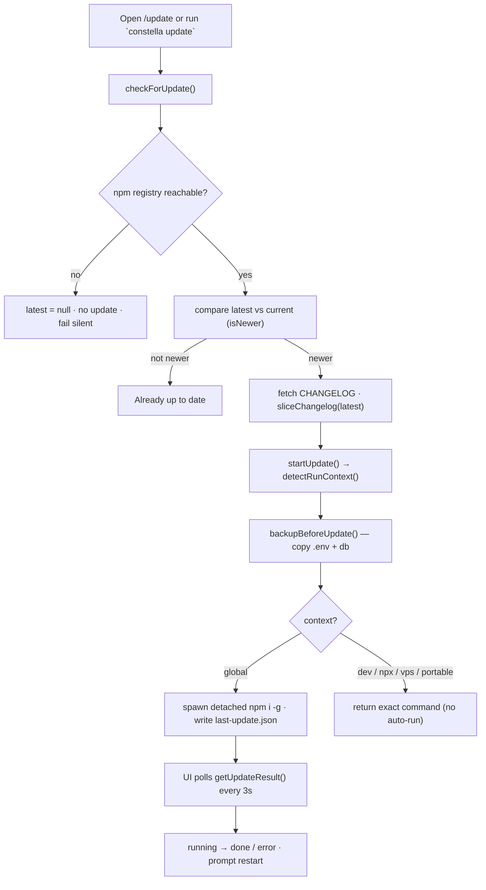
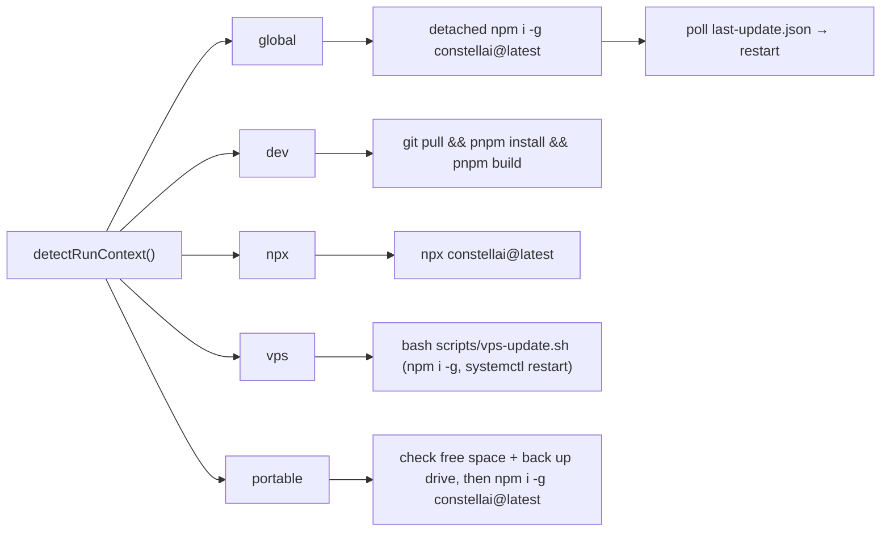

[← Docs index](./README.md) · [🇧🇷 Português](../pt/UPDATE.md) · [✦ Constella](../../README.md)

# 🚀 Update — relaunching the central ship


Constella checks npm for a newer release, shows you the changelog, and applies the update **the way that fits how this process is running** — global install, npx, dev source, native VPS, or a portable USB drive. It always backs up your `.env` and database first, and it never fabricates a "success" it didn't earn.

---

## ✦ When to use

- A new Constella version is published and you want to pull it down.
- You want to read the changelog before upgrading (the "What's new" panel).
- You want to confirm you are already on the latest version (`constella update --check`).
- You need the **exact command** for your environment (dev / npx / VPS / portable), because some contexts can't be updated from inside the running web server.

---

## 🌌 How it works

Two halves cooperate:

| Half | File | Responsibility |
| --- | --- | --- |
| **Check** | `src/server/update-check.ts` | Ask the npm registry for `latest`, compare versions, fetch the changelog. Cached, fails silent. |
| **Apply** | `src/server/update-run.ts` | Detect the run context, back up local config, then either auto-run (global) or hand back the exact command. |
| **Context** | `src/lib/run-context.ts` | `detectRunContext()` → `dev \| global \| npx \| vps \| portable`. |
| **UI** | `src/components/modules/update-screen.tsx` | Versions, context hint, "Update now", changelog, live poll of the background updater. |
| **Actions** | `src/server/actions/update-actions.ts` | Server actions the UI calls: `getUpdateStatus`, `getUpdateContext`, `runUpdate`, `pollUpdateResult`. |
| **CLI** | `bin/constella.mjs` (`update` subcommand) | Standalone check/apply that runs **outside** the web server. |

The central rule (from the code comment in `update-run.ts`): *only the `global` npm install auto-runs* — every other context returns the precise command for you to run, because executing those from the web server is environment-specific.

---

## 🛰️ Main flow



---

## 🪐 Key concepts

### Version check (`checkForUpdate`)

- Reads the **installed** version via `currentVersion()` (`src/lib/version.ts`): `CONSTELLA_VERSION` env (set by the CLI) → launch-dir `package.json` → `"0.0.0"`.
- Fetches `https://registry.npmjs.org/constellai/latest` for the published `version`.
- `isNewer(latest, current)` does a numeric 3-part semver compare (pre-release suffixes stripped). `bumpType` classifies the jump as `major | minor | patch`.
- Returns an `UpdateInfo`: `{ current, latest, updateAvailable, type, command, changelog }`. The default `command` is `npm install -g constellai@latest`.
- **6-hour in-memory cache** (`TTL = 6 * 60 * 60 * 1000`) so client polling never hammers the registry. `checkForUpdate(true)` forces a refresh.
- **Fails closed/silent**: any offline / unpublished / timeout (3 s `AbortController`) path yields `latest: null`, `updateAvailable: false`. It never throws and never fabricates "updated".

### Changelog fetch

- Only fetched when `updateAvailable` is true.
- Pulls `https://raw.githubusercontent.com/gabriel7silva/constella/main/CHANGELOG.md`.
- `sliceChangelog(md, version)` extracts the `## [x.y.z] …` section up to the next `##` heading; if the exact version heading isn't found, it falls back to the first section in the file.
- Rendered in the UI's "What's new in v{version}" card via `react-markdown` + `remark-gfm`.

### Run-context detection (`detectRunContext`)

Order matters — the first match wins:

| Order | Test | Context |
| --- | --- | --- |
| 1 | `isDevMode()` (running from source) | `dev` |
| 2 | `getRunMode() === "vps"` | `vps` |
| 3 | `getRunMode() === "portable"` | `portable` |
| 4 | `launchDir()` path contains `/_npx/` (npm's npx cache) | `npx` |
| 5 | (fallback) | `global` |

`isDevMode()` (`src/lib/build-mode.ts`): `CONSTELLA_PUBLIC=1` → `false`; else `CONSTELLA_DEV=1` → `true`; else `NODE_ENV !== "production"`. A CLI launch sets `CONSTELLA_PUBLIC=1`, so installed runs are never mistaken for dev.

### Backup before update (`backupBeforeUpdate`)

- Best-effort, runs before any update in `startUpdate()`.
- Creates `<HOME>/backups/<timestamp>/` (timestamp = ISO with `:`/`.` replaced by `-`).
- Copies, if present: `.env`, `constella.db`, `constella.db-wal`, `constella.db-shm`.
- Returns the backup directory path (surfaced in the UI as "Backup saved: …"). Any copy failure is skipped silently — backup never blocks the update.
- `<HOME>` resolves via `constellaHome()`: `CONSTELLA_HOME` (resolved against the launch dir) or `~/.constella`.

### Context-aware apply (`startUpdate`)

| Context | `ok` | Auto-runs? | Command returned | `needsRestart` |
| --- | --- | --- | --- | --- |
| `global` | `true` | ✅ detached `npm install -g constellai@latest` | `npm install -g constellai@latest` | ✅ |
| `dev` | `false` | ❌ | `git pull && pnpm install && pnpm build` | — |
| `npx` | `false` | ❌ | `npx constellai@latest` | — |
| `vps` | `false` | ❌ | `bash scripts/vps-update.sh` (npm install + `systemctl restart constella`; `~/.constella` preserved) | ✅ |
| `portable` | `false` | ❌ | `npm install -g constellai@latest` (after free-space/backup check) | ✅ |

> If `updateAvailable` is false, `startUpdate()` short-circuits with `ok: true, message: "Already up to date."` — no backup, no command.

### The detached global updater + result polling

Because a global npm update can't reliably finish before the web server is replaced, `startUpdate()` for `global`:

1. Writes `<HOME>/backups/last-update.json` with `{ status: "running", to, at }`.
2. Spawns a **detached** `node -e` one-liner (no separate script file — works even from a global install) that runs `npm install -g constellai@latest` and rewrites the result file with `status: "done" | "error"`, the npm exit `code`, and `at`.
3. `child.unref()`s so the updater outlives the request.
4. Returns `{ ok: true, started: true, needsRestart: true, … }`.

The UI (`update-screen.tsx`) then polls `pollUpdateResult()` → `getUpdateResult()` every **3 seconds**, reading `last-update.json`. Statuses: `idle` (no file), `running`, `done`, `error`. On `done`/`error` it stops polling and prompts a restart (or shows the rollback hint).

---

## 🌠 Tables

### `UpdateInfo` (returned by `checkForUpdate`)

| Field | Type | Meaning |
| --- | --- | --- |
| `current` | `string` | Installed version. |
| `latest` | `string \| null` | npm `latest`, or `null` when the registry is unreachable. |
| `updateAvailable` | `boolean` | `latest` exists and is newer. |
| `type` | `"major" \| "minor" \| "patch" \| null` | Size of the version jump. |
| `command` | `string` | Default upgrade command. |
| `changelog` | `string \| null` | Sliced changelog section for `latest`. |

### `UpdateResult` (returned by `startUpdate` / `runUpdate`)

| Field | Type | Meaning |
| --- | --- | --- |
| `ok` | `boolean` | Operation succeeded (global started, or already current). |
| `started` | `boolean?` | The detached global updater was launched → UI should poll. |
| `context` | `string` | Detected run context. |
| `command` | `string` | The command for this context. |
| `message` | `string` | Human-readable status / instruction. |
| `backupDir` | `string?` | Where `.env`/db were copied. |
| `needsRestart` | `boolean?` | Restart Constella to load the new version. |

### `last-update.json` (background updater state)

| Field | Type | Meaning |
| --- | --- | --- |
| `status` | `"idle" \| "running" \| "done" \| "error"` | Updater state (`idle` = file absent). |
| `to` | `string` | Target version. |
| `code` | `number` | npm exit code (on completion). |
| `at` | `string` | ISO timestamp. |

---

## 🕳️ Update flow per context



---

## ✦ Step-by-step

### In the app

1. Open the **Update** module (`/update`). The page calls `getUpdateStatus()` and `getUpdateContext()`.
2. Read the **Installed → Latest** versions and the bump pill (`major`/`minor`/`patch`).
3. The context line tells you how this process runs (e.g. "Global npm install — can update in place.").
4. If an update is available, review **"What's new in v…"**.
5. Click **Update now** → `runUpdate()` (auth-gated via `requireWorkspace()`).
   - **global** → background updater starts; watch the live poll (`running → installed`), then restart Constella.
   - **dev / npx / vps / portable** → copy the exact command shown and run it in your terminal.
6. The **Backup saved** line shows where your `.env`/db were copied.

### From the CLI

```bash
# Just check (no apply) — prints "Constella x.y.z · latest a.b.c"
constella update --check

# Check + apply (global install path)
constella update
```

The CLI `update` subcommand (`bin/constella.mjs`):
- Reads the local version from the package's own `package.json`, fetches npm `latest` (4 s timeout).
- `--check` → print and exit.
- If the registry is unreachable, or `latest === current`, it says so and exits 0.
- If it detects **source** (`.git` + `src/` in CWD), it tells you to `git pull && pnpm install && pnpm build` and exits.
- Otherwise it runs `npm install -g constellai@latest` (uses `npm.cmd` on Windows, no shell) with inherited stdio, then asks you to restart.

---

## 🛰️ Examples

**Already current (offline-safe):**
```text
Constella 0.1.0 · (npm registry unavailable)
Couldn't reach the npm registry — try again later.
```

**Global update from the UI** — `runUpdate()` returns:
```json
{
  "ok": true,
  "started": true,
  "needsRestart": true,
  "context": "global",
  "command": "npm install -g constellai@latest",
  "backupDir": "/home/you/.constella/backups/2026-06-22T10-15-03-000Z",
  "message": "Updating to 0.2.0 in the background — restart Constella when it completes."
}
```
…and the poll reads `<HOME>/backups/last-update.json`:
```json
{ "status": "done", "to": "0.2.0", "code": 0, "at": "2026-06-22T10:15:41.220Z" }
```

**VPS** — no auto-run; you get:
```json
{ "ok": false, "context": "vps", "command": "bash scripts/vps-update.sh", "needsRestart": true,
  "message": "On a VPS, update from the HOST: run `bash scripts/vps-update.sh [version]` (npm install -g constellai@<version|latest> + `systemctl restart constella`). Data in ~/.constella is preserved; drizzle migrations run on the next boot. Equivalent manual path: `npm install -g constellai@latest && sudo systemctl restart constella`." }
```

Run one of these on the VPS host:

```bash
# Native install (no repo checkout needed) — pull the updater straight from GitHub:
curl -fsSL https://raw.githubusercontent.com/gabriel7silva/constella/main/scripts/vps-update.sh | bash
# pin a specific version:
curl -fsSL https://raw.githubusercontent.com/gabriel7silva/constella/main/scripts/vps-update.sh | bash -s -- 0.2.30

# From a repo checkout instead:
bash scripts/vps-update.sh                 # → latest on npm
bash scripts/vps-update.sh 0.2.30          # → a specific version

# Fully manual (no script at all):
sudo npm install -g constellai@latest && sudo systemctl restart constella
```

> **Updating while it's running is fine — no manual stop needed.** `npm install -g` swaps the package on disk without touching the live process; `systemctl restart constella` then cycles in the new version in a ~2–3s blip. Your `~/.constella` (DB, secrets, login, workspaces) is preserved, and the idempotent drizzle migrations run automatically on the next boot. Roll back any time by pinning the old version (e.g. `bash scripts/vps-update.sh 0.2.27`).

---

## 🌌 Possible states

| State | How it shows | Source |
| --- | --- | --- |
| Up to date | "You're on the latest version." | `updateAvailable === false` |
| Update available | Version pill + "Update now" | `updateAvailable === true` |
| Registry unreachable | `latest = —`, no button | `latest === null` |
| Updating (global) | "Updating…" + spinner | `started === true`, `busy` |
| Poll: running | "Updater: running…" | `last-update.json.status === "running"` |
| Poll: done | "✓ installed — restart Constella to load it." | `status === "done"` |
| Poll: error | "✖ failed — see rollback below." + rollback hint | `status === "error"` |
| Manual command | Command shown in a `<pre>`; no auto-run | `dev / npx / vps / portable` |

---

## 🪐 Related integrations

- **[VPS_MODE](./VPS_MODE.md)** / **[OPERATIONS](./OPERATIONS.md)** — the native VPS update via `bash scripts/vps-update.sh` (npm + `systemctl restart constella`; rollback by pinning an older version).
- **[PORTABLE_MODE](./PORTABLE_MODE.md)** — USB drive, free-space checks before updating.
- **[INSTALLATION](./INSTALLATION.md)** / **[PUBLISHING](./PUBLISHING.md)** — how versions land on npm.
- **[START_MODE](./START_MODE.md)** / **[VPS_MODE](./VPS_MODE.md)** / **[PORTABLE_MODE](./PORTABLE_MODE.md)** — install methods that feed `detectRunContext()`.
- **[CONFIGURATION](./CONFIGURATION.md)** — env vars (`CONSTELLA_HOME`, `CONSTELLA_VERSION`, `CONSTELLA_PUBLIC`).

---

## 🕳️ Security

- **Auth-gated apply.** `runUpdate()` calls `requireWorkspace()` before doing anything.
- **Backup first, always.** `.env` + the SQLite DB (and WAL/SHM) are copied to `<HOME>/backups/<timestamp>/` before any update path.
- **No shell injection in the CLI.** The global install spawns `npm`/`npm.cmd` directly with an argv array — no shell string interpolation.
- **Fail-closed checks.** The registry/changelog fetches use a 3–4 s `AbortController` timeout and swallow errors, so a hostile or dead network can't hang or crash the update screen — it just reports "no update".
- **Honest results.** The detached updater writes a real npm exit code into `last-update.json`; the UI reflects `done`/`error` truthfully and never claims success on failure.

---

## 🌠 Troubleshooting

| Symptom | Likely cause | Fix |
| --- | --- | --- |
| "registry unavailable" | Offline / npm down / firewall | Retry later; check connectivity to `registry.npmjs.org`. |
| Latest shown but stale | 6 h cache | Force a fresh check: `checkForUpdate(true)` (UI re-fetch) or `constella update --check`. |
| Wrong context detected | Env mismatch | Verify `CONSTELLA_PUBLIC`/`CONSTELLA_DEV` and `CONSTELLA_RUN_MODE` (set to `vps` by the systemd service). |
| Global poll stuck on "running" | Detached `npm` still installing or blocked | Wait; if it never resolves, run `npm install -g constellai@latest` manually. |
| Poll: error | npm exited non-zero (permissions?) | Re-run with elevated permissions; rollback: `npm i -g constellai@<current>`, then restore the backup. |
| Version still old after restart | Old process still running | Fully stop and relaunch Constella so `CONSTELLA_VERSION` re-reads. |
| Dev install won't auto-update | Intentional | Run `git pull && pnpm install && pnpm build` (or `next build`). |
| Need to roll back a bad release | A new version misbehaves | Global: `npm i -g constellai@<old>`; VPS: `curl -fsSL .../scripts/vps-update.sh \| bash -s -- <old>` — data preserved. |

---

## ✦ Related links

- [INSTALLATION](./INSTALLATION.md)
- [CONFIGURATION](./CONFIGURATION.md)
- [VPS_MODE](./VPS_MODE.md)
- [PORTABLE_MODE](./PORTABLE_MODE.md)
- [START_MODE](./START_MODE.md)
- [PUBLISHING](./PUBLISHING.md)
- [ARCHITECTURE](./ARCHITECTURE.md)
- [TROUBLESHOOTING](./TROUBLESHOOTING.md)
