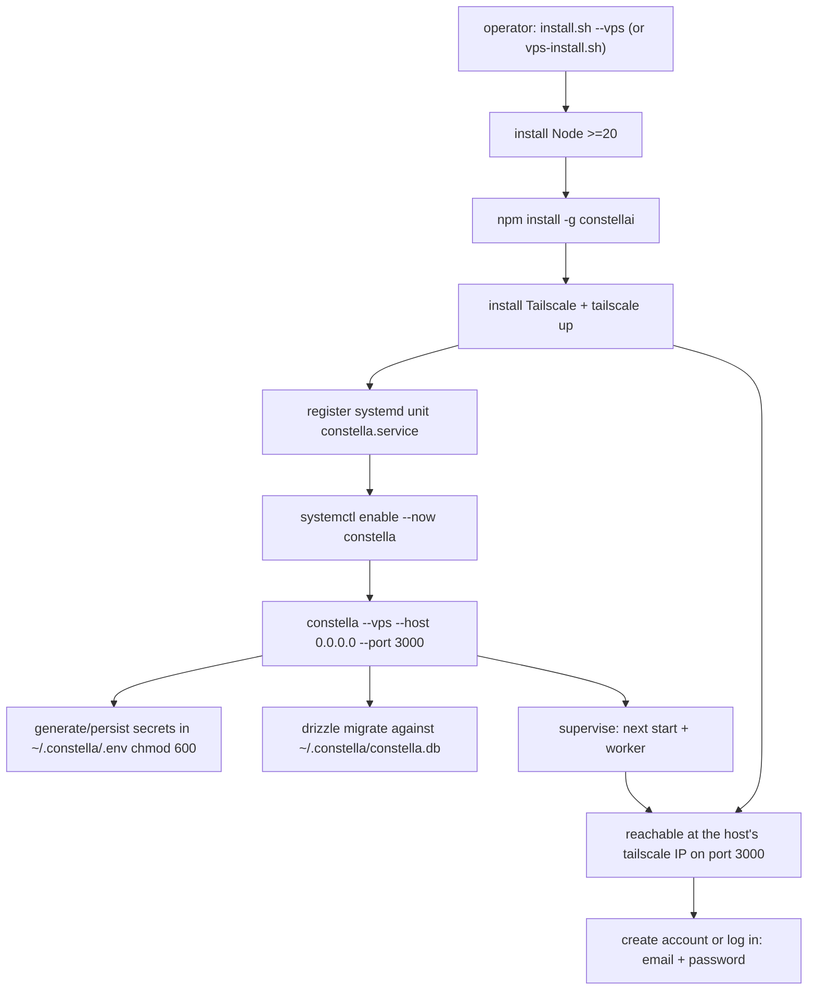
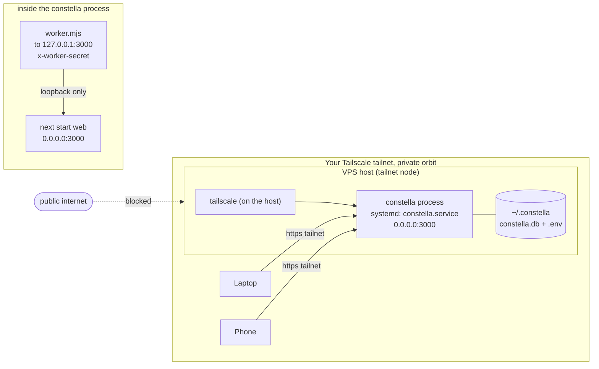

[← Docs index](./README.md) · [🇧🇷 Português](../pt/VPS_MODE.md) · [✦ Constella](../../README.md)

# VPS installation 🛰️


Run the central ship on a remote server. The **VPS install** (`constella --vps`) installs the published `constellai` npm package **natively on the host**, binds the web server to `0.0.0.0`, and exposes it **only** over your Tailscale tailnet — a private orbit reachable from any device you've authorized, and from nowhere else. No Docker: the host itself is the tailnet node, and a `systemd` service keeps the process alive across reboots. Authentication is the same as in every install: email + password.

> 🧪 **Status: functional, under testing.** The VPS install works end-to-end (install → tailnet → 24/7 worker) but is still being validated — treat it as a beta. Verify your setup (auth, backups, the `systemd` unit) before relying on it for production, and keep the [Operations](OPERATIONS.md) runbook handy.

---

## When to use 🌌

Pick the VPS install when you want a **24/7 control plane** that keeps planning, building, reviewing and shipping while your laptop is closed — without putting the dashboard on the open internet.

| You want… | The VPS install gives you |
| --- | --- |
| The agent constellation always running | A long-lived server process (web + worker), supervised + auto-restarted by `systemd` |
| Private remote access | Bound to `0.0.0.0` but reachable **only on your Tailscale tailnet** |
| Authentication | Email + password every session — the same gate as every install |
| A reproducible install | A one-shot `vps-install.sh` bootstrap: Node + `constellai` + Tailscale + a `systemd` unit |
| Hardened-by-default execution | Host-level systemd service + agent CLI in `acceptEdits` (edits-only) mode |

If you just want a local always-on instance on your own machine, use the [local install](./START_MODE.md). For a drive-you-carry instance, see the [portable install](./PORTABLE_MODE.md).

---

## How it works 🪐

VPS is a **deployment target** selected by the `--vps` launch flag — a way to install and run Constella, not an authentication mode (auth is always email + password). The launch flag is declared in `src/lib/run-mode.ts`:

```ts
export type RunMode = "start" | "vps" | "portable";

export const RUN_MODES = {
  // …
  vps: { label: "VPS", requiresLogin: true,
         note: "Access over your Tailscale tailnet; runs natively on the host." },
};
```

The flag is chosen **at launch**, never in the UI (a CLI launch sets `CONSTELLA_PUBLIC=1`, which hides the in-app picker). It is resolved in `bin/constella.mjs` from the `--vps` flag (with legacy `--bind tailnet` mapping to the same target), then exported as `CONSTELLA_RUN_MODE=vps` and persisted onto the organization row (`organization.run_mode`) at onboarding via `getRunMode()`.

Three things make the VPS install distinct:

1. **Bind address `0.0.0.0`.** In `bin/constella.mjs`, `host = --host || (vps|portable ? "0.0.0.0" : "127.0.0.1")`. The server listens on all interfaces so the Tailscale layer can reach it.
2. **Login is enforced.** `requiresLogin()` returns `true`, and `src/proxy.ts` redirects every unauthenticated request to the auth screen (only the local install binds loopback). On first run with no user that screen is signup; afterwards it is login.
3. **Run context = `vps`.** `detectRunContext()` in `src/lib/run-context.ts` returns `"vps"` when `getRunMode() === "vps"` — so the in-app Update flow knows to use `npm install -g constellai@latest` rather than `git`. See [UPDATE](./UPDATE.md).

> 🛰️ **Tailscale is assumed externally configured.** Constella does not manage your tailnet, ACLs or auth keys. The bootstrap script *joins* the host to a tailnet for you (`tailscale up`), but the tailnet itself (devices, MagicDNS, ACLs) is yours to own at <https://login.tailscale.com>. Constella only binds `0.0.0.0`; the tailnet is what keeps that bind private.

---

## Main flow 🌠



---

## Key concepts ✦

### Native on the host

There is **no container**. The published `constellai` npm package (the compiled, prebuilt `.next`) is installed globally with `npm i -g` — there is **no source build**, because the npm package ships the prebuilt `.next`. The `constella --vps` process runs directly under the host user. Tailscale runs on the **host**, so the host itself is the tailnet node; the web server's `0.0.0.0` bind is reachable **only at the host's Tailscale IP** as long as port 3000 has no public route (tailnet + firewall). Pin a version any time with `npm install -g constellai@<version>`.

### Runtime root in the home directory

`CONSTELLA_HOME` defaults to `~/.constella` (override with the env var). All runtime state lives there and is preserved across updates, restarts and reboots:

- `~/.constella/constella.db` — the SQLite database (`DATABASE_URL=file:~/.constella/constella.db`).
- `~/.constella/.env` — generated secrets (`chmod 600`), survive restarts because they sit in the host filesystem.
- `~/.constella/organizations/<orgId>/workspace/` — the agent workspace tree (the FS jail). See [ARCHITECTURE](./ARCHITECTURE.md).

### systemd keeps it alive

The managed install registers `constella.service`, which runs `constella --vps --host 0.0.0.0 --port 3000` with `Restart=always` and is **enabled** so it starts on every boot. Manage it with `systemctl` and read logs with `journalctl -u constella -f`. No process supervisor of your own is needed — systemd owns the lifecycle.

### Worker over loopback (even on `0.0.0.0`)

The dual-process model (web + worker) is preserved. The launcher spawns `bin/worker.mjs` with `CONSTELLA_BASE_URL=http://127.0.0.1:<port>` — **loopback**, even though the web server binds `0.0.0.0`. This is a deliberate **SSRF / secret-exfil guard**: the worker attaches the privileged `x-worker-secret` header to every call, so it refuses any non-loopback base URL:

```js
const isLoopback = ["localhost", "127.0.0.1", "::1", "[::1]"].includes(baseHost);
if (!isLoopback && !ALLOW_REMOTE) {
  console.error(`✖ Refusing to send the worker secret to a non-loopback host (${baseHost}). …`);
  process.exit(1);
}
```

A genuinely remote worker must explicitly opt in with `CONSTELLA_ALLOW_REMOTE_WORKER_BASE_URL=1` (and is warned if the URL is plain `http://`). See [ARCHITECTURE](./ARCHITECTURE.md).

### Secrets are mandatory

`bin/constella.mjs` generates and persists **three** secrets into `~/.constella/.env` on first boot (and reuses them after):

- `BETTER_AUTH_SECRET` — `next start` runs under `NODE_ENV=production`, where better-auth **throws** on its default key; every install must have a real one.
- `CONSTELLA_VAULT_KEY` — AES-256-GCM key for the provider/credential vault. See [SECURITY](./SECURITY.md).
- `CONSTELLA_WORKER_SECRET` — the worker fails **closed** without it (`x-worker-secret`).

The launcher prints only `• Secrets ready (stored in <HOME>/.env, never printed).` — values are never logged.

---

## Tables 🗃️

### Install-method comparison

| Property | `start` (local) | `vps` | `portable` |
| --- | --- | --- | --- |
| Authentication | email + password | email + password | email + password |
| Default bind host | `127.0.0.1` | **`0.0.0.0`** | `0.0.0.0` |
| Network exposure | localhost | **Tailscale tailnet** | LAN (USB host) |
| Typical runtime | local | **native host + systemd** | USB drive |
| Agent CLI permission | `bypassPermissions` (full) | **`acceptEdits` (jailed)** | `acceptEdits` (jailed) |
| `detectRunContext()` | `dev`/`global`/`npx` | **`vps`** | `portable` |

### VPS environment variables

| Variable | Set by | Value | Purpose |
| --- | --- | --- | --- |
| `CONSTELLA_RUN_MODE` | launcher / systemd unit | `vps` | Selects VPS behavior, login enforcement |
| `CONSTELLA_PUBLIC` | launcher / systemd unit | `1` | Marks a public runtime; hides the UI mode picker |
| `CONSTELLA_HOME` | launcher (default) | `~/.constella` | Runtime root in the host home dir |
| `DATABASE_URL` | launcher | `file:~/.constella/constella.db` | SQLite path under the runtime root |
| `BETTER_AUTH_SECRET` | launcher (generated) | random base64url | Session signing key |
| `CONSTELLA_VAULT_KEY` | launcher (generated) | random base64 | Vault encryption key |
| `CONSTELLA_WORKER_SECRET` | launcher (generated) | random base64url | Worker `x-worker-secret` |
| `CONSTELLA_BASE_URL` | launcher (worker child) | `http://127.0.0.1:3000` | Loopback only |
| `NODE_ENV` | launcher | `production` | Production boot |
| `CONSTELLA_AGENT_FULL_ACCESS` | operator (optional) | `1` / `0` | Override jailed/full agent exec |
| `CONSTELLA_ALLOW_REMOTE_WORKER_BASE_URL` | operator (optional) | `1` | Allow a non-loopback worker |
| `CONSTELLA_WEB_HEAP_MB` | operator (optional) | integer | Raise the web V8 heap cap |

### systemd service

| Property | Value |
| --- | --- |
| Unit | `constella.service` |
| Command | `constella --vps --host 0.0.0.0 --port 3000` |
| Restart policy | `Restart=always` |
| Boot behavior | `enabled` — starts on every boot |
| Logs | `journalctl -u constella -f` |
| Runtime root | `~/.constella` (host home dir) |

---

## Topology diagram 🌌



---

## Step-by-step 🚀

### 0. Quick try — `npx constellai --vps` (unmanaged, foreground)

On a Linux host, this is a **true single command** — no clone, no script, no systemd. Run the published package directly and it auto-installs/joins Tailscale for you, then serves on your tailnet in the foreground:

```bash
npx constellai --vps                              # or: npm install -g constellai && constella --vps
```

It binds `0.0.0.0`, so privacy relies on Tailscale (or your own firewall) rather than any container boundary. Reach it at the **host's** tailnet IP: `tailscale ip -4` → `http://<that-ip>:3000`. This is the fastest way to stand up a VPS to try it; for 24/7 use, take the managed (systemd) path below.

### 1. Managed install — one command, native + systemd (recommended)

On a fresh **Ubuntu** server, this single command installs Node (>=20) + the `constellai` CLI, joins the host to Tailscale, and registers a `systemd` service that starts on boot and restarts on failure:

```bash
curl -fsSL https://raw.githubusercontent.com/gabriel7silva/constella/main/scripts/install.sh | bash -s -- --vps
```

It runs `tailscale up` to join the host (using your tailnet account / auth flow at <https://login.tailscale.com>), installs `constellai@latest`, and enables `constella.service`. Reach it at the host's tailnet IP: `tailscale ip -4` → `http://<that-ip>:3000`. The equivalent direct script is `bash scripts/vps-install.sh`; the manual steps below are the same thing, broken out.

### 2. Provision a VPS

A fresh **Ubuntu Server** (24.04 / 26.04 LTS) is the assumed target. You don't need to clone the repo for the managed path — the installer pulls `constellai` from npm. If you prefer to run the bootstrap from a checkout, get the repo (it carries `scripts/vps-install.sh`):

```bash
apt-get update && apt-get install -y git      # if git is missing
git clone https://github.com/gabriel7silva/constella.git
cd constella
```

### 3. Run the bootstrap

```bash
bash scripts/vps-install.sh
```

`scripts/vps-install.sh` does, in order (it uses `sudo` only when you're not already `root`):

1. **Install Node >=20** if it is not on `PATH`.
2. **Install the CLI** globally: `npm install -g constellai`.
3. **Install Tailscale** on the host if absent (`curl -fsSL https://tailscale.com/install.sh | sh`) and run `tailscale up` (a **no-op if the host is already joined**).
4. **Register the systemd unit** `constella.service` running `constella --vps --host 0.0.0.0 --port 3000`, then `systemctl enable --now constella` so it starts now and on every boot.
5. **Print the reach URL** read from the host: `http://<host-tailnet-ip>:3000`.

### 4. Reach the dashboard

From **any device on the same tailnet**, open:

```
http://<this-host's-tailscale-ip>:3000
```

Find the IP from the **host** itself:

```bash
tailscale ip -4
```

First load lands on the auth screen. On the very first run with no account yet you get a **signup** screen (name + email + password) that creates the single operator; afterwards you **log in** with that email + password. Then complete [ONBOARDING](./ONBOARDING.md) if it's the first run.

### 5. Manage the service (systemd)

The managed install runs under systemd, so use the standard tools:

```bash
systemctl status constella        # is it running?
systemctl restart constella       # restart (e.g. after an update)
systemctl stop constella          # stop the server
systemctl start constella         # start it again
journalctl -u constella -f        # follow the logs live
```

Because the unit is **enabled**, the server comes back automatically after a reboot.

### 6. Update to a new version

Update the global package and restart the service:

```bash
# Native install (no repo checkout needed) — pull the updater straight from GitHub:
curl -fsSL https://raw.githubusercontent.com/gabriel7silva/constella/main/scripts/vps-update.sh | bash
# pin a specific version:
curl -fsSL https://raw.githubusercontent.com/gabriel7silva/constella/main/scripts/vps-update.sh | bash -s -- 0.2.30

# From a repo checkout instead:
bash scripts/vps-update.sh                 # → latest on npm
bash scripts/vps-update.sh 0.2.30          # → a specific version

# Fully manual (no script at all):
sudo npm install -g constellai@latest && sudo systemctl restart constella
```

> **Updating while it's running is fine — no manual stop needed.** `npm install -g` swaps the package on disk without touching the live process; `systemctl restart constella` then cycles in the new version in a ~2–3s blip. Your `~/.constella` (DB, secrets, login, workspaces) is preserved, and the idempotent drizzle migrations run automatically on the next boot. Roll back any time by pinning the old version (e.g. `bash scripts/vps-update.sh 0.2.27`).

`scripts/vps-update.sh [version]` simply does `npm install -g constellai@<version|latest>` then `systemctl restart constella`. Running the unmanaged path? `npx constellai@latest --vps` always fetches the newest.

### 7. Clean reinstall (wipe everything, keep Tailscale)

To simulate a fresh install — remove the `systemd` service, the global `constellai` CLI, the Constella runtime (`~/.constella`) and the npx cache while **keeping Tailscale** (the host install + your tailnet session) — run the clean script, then reinstall:

```bash
curl -fsSL https://raw.githubusercontent.com/gabriel7silva/constella/main/scripts/vps-clean.sh | bash
# non-interactive (skip the prompt): append  -s -- --yes
npx constellai --vps                  # fresh: the first run shows the signup screen
```

> ⚠️ This **destroys** the VPS's operator account, orgs and workspaces (everything under `~/.constella`). It does **not** touch Tailscale, so an SSH-over-tailnet session stays connected.

---

## Examples 🪐

**Launch the VPS install directly, binding all interfaces:**

```bash
constella --vps --host 0.0.0.0 --port 3000
# or, from a source checkout: node bin/constella.mjs --vps --host 0.0.0.0 --port 3000
```

**The exact command the systemd unit runs:**

```ini
ExecStart=constella --vps --host 0.0.0.0 --port 3000
```

**Confirm the run context the app sees:**

```bash
# CONSTELLA_RUN_MODE=vps, so detectRunContext() → "vps"
constella --vps --port 3000   # logs: Mode : vps · 0.0.0.0:3000
```

**Allow agents full shell exec on the VPS (override the jail — use with care):**

```bash
# add to the systemd unit's Environment= (or export before launch)
CONSTELLA_AGENT_FULL_ACCESS=1
```

---

## Possible states ✦

| State | What you see | Meaning |
| --- | --- | --- |
| Booting | `Mode : vps · 0.0.0.0:3000` in logs | Launcher resolved VPS, binding all interfaces |
| Secrets ready | `• Secrets ready (stored in ~/.constella/.env, never printed).` | Three secrets generated/reused |
| Migrating | drizzle migrate output | Schema applied to `~/.constella/constella.db` |
| Web up | `next start` listening on `0.0.0.0:3000` | Dashboard reachable on tailnet |
| Worker up | `Constella worker → tick … every 60000ms` | 24/7 tick + watcher + Telegram poll running |
| Worker refused | `✖ Refusing to send the worker secret to a non-loopback host` | `CONSTELLA_BASE_URL` is not loopback and no override |
| Child crash | `• [web] exited (…) — auto-restarting in 2s` | Supervisor restarting (max 5 / 60s) |
| Crash-loop | `✖ [web] … crashed 5x … giving up.` | Repeated failure; systemd will retry per `Restart=always` |
| Auth wall | redirected to signup or login | `requiresLogin` enforced by `src/proxy.ts` |

---

## Related integrations 🛰️

- **Worker / cron** — the worker still drives the 60s tick (`POST /api/cron/tick`), the chokidar watcher (`/api/sync/file`), and the Telegram long-poll, all over loopback. See [ARCHITECTURE](./ARCHITECTURE.md).
- **Telegram** — remote-control the company from your phone while the VPS runs headless. See [TELEGRAM](./TELEGRAM.md).
- **Public API / MCP** — a remote AI host can drive the VPS over the tailnet via the v1 REST API or the MCP server. See [PUBLIC_API](./PUBLIC_API.md) and [MCP](./MCP.md).
- **Update** — on `vps` context, update from the host with `bash scripts/vps-update.sh` (`npm install -g constellai@latest`, then `systemctl restart constella`, preserving `~/.constella`). See [UPDATE](./UPDATE.md).
- **Agent execution** — jailed `acceptEdits` mode + FS jail on the host. See [AGENTS](./AGENTS.md) and [AI_ARCHITECTURE](./AI_ARCHITECTURE.md).

---

## Security 🕳️

| Layer | Mechanism |
| --- | --- |
| Network privacy | App binds `0.0.0.0` but only the host's Tailscale interface reaches it — keep port 3000 off any public route (tailnet + firewall), never the public internet |
| Authentication | Login enforced every session (`requiresLogin: true`, `src/proxy.ts`); better-auth email+password, optional 2FA/passkeys |
| Service hardening | Runs under `systemd` as a normal (non-root) host user, so an app-level RCE can't act as root over `~/.constella` |
| Secret signing | Real `BETTER_AUTH_SECRET` generated (no default key in production) |
| Vault | Provider/credential secrets encrypted with `CONSTELLA_VAULT_KEY` (AES-256-GCM) |
| Worker isolation | Worker talks **loopback only**; refuses non-loopback unless `CONSTELLA_ALLOW_REMOTE_WORKER_BASE_URL=1` |
| File `.env` perms | `~/.constella/.env` written `chmod 600` |
| Agent jail | CLI runs `acceptEdits` (edits-only, no arbitrary exec) + FS jail |

> 🕳️ **The bind alone is not the boundary.** Binding `0.0.0.0` is safe *only because* the host is a Tailscale node and does not publish port 3000 to the public internet. If you open 3000 on a public interface, you lose the private orbit — keep it behind the tailnet (and your firewall / security group), or front it with a VPN/reverse proxy with auth.

> ⚠️ **Agent CLIs are not bundled.** The `claude` / `codex` CLIs are **not** installed by the bootstrap. For agents on a VPS, either install a CLI on the host (`npm i -g …` and authenticate via env keys or the CLI's own login, persisted in the host user's home), or configure cloud API providers in the [MODELS](./MODELS.md) module.

---

## Troubleshooting 🌠

| Symptom | Likely cause | Fix |
| --- | --- | --- |
| Can't reach `http://<ip>:3000` | Not on the tailnet, or wrong IP | Confirm `tailscale status`; get the IP with `tailscale ip -4` on the VPS |
| Tailscale won't join | `tailscale up` not completed / expired session | Run `tailscale up` again and authenticate at <https://login.tailscale.com> |
| Service not running | systemd unit stopped or failed | `systemctl status constella`; start with `systemctl start constella`, inspect `journalctl -u constella -f` |
| Stuck at the auth screen | First run, no account yet | Sign up (name + email + password), then complete [ONBOARDING](./ONBOARDING.md); auth is mandatory |
| `✖ Refusing to send the worker secret to a non-loopback host` | `CONSTELLA_BASE_URL` not loopback | Leave it unset (defaults to loopback) or set `CONSTELLA_ALLOW_REMOTE_WORKER_BASE_URL=1` deliberately |
| `better-auth` throws on boot | Missing `BETTER_AUTH_SECRET` | Ensure `~/.constella` is writable so the launcher can persist `.env` |
| Agents do nothing | No CLI on the host / no provider | Install a CLI (`npm i -g …`) or configure a cloud provider ([MODELS](./MODELS.md)) |
| Web keeps restarting | OS-level OOM (agent RAM) or native crash | Cap concurrent agents, or raise `CONSTELLA_WEB_HEAP_MB` for a JS-heap OOM |
| `✖ … crashed 5x … giving up` | Genuine crash-loop | Inspect `journalctl -u constella -f`; fix root cause, then `systemctl restart constella` |
| Schema migrate fails on fresh DB | Home dir permission / corrupt | Ensure `~/.constella` is owned by the run user and writable; the launcher aborts on a fresh-DB migrate failure |

---

## Related links ✦

- [INSTALLATION](./INSTALLATION.md) — getting the package + prerequisites
- [START_MODE](./START_MODE.md) · [PORTABLE_MODE](./PORTABLE_MODE.md) — the other install methods
- [CONFIGURATION](./CONFIGURATION.md) — environment variables and tuning
- [ARCHITECTURE](./ARCHITECTURE.md) — web + worker, FS jail, sync engine
- [UPDATE](./UPDATE.md) — context-aware updates (`npm` + `systemctl` on `vps`)
- [TELEGRAM](./TELEGRAM.md) — remote control of the headless company
- [PUBLIC_API](./PUBLIC_API.md) · [MCP](./MCP.md) — drive Constella remotely
- [SECURITY](./SECURITY.md) — vault, FS jail, secret scrubbing
- [TROUBLESHOOTING](./TROUBLESHOOTING.md) · [FAQ](./FAQ.md)
