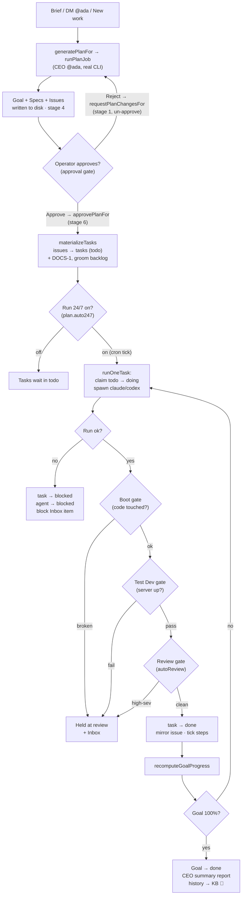

[← Docs index](./README.md) · [🇧🇷 Português](../pt/WORKFLOW.md) · [✦ Constella](../../README.md)

# Workflow — Goal to Done 🌠


The full orbit a unit of work travels in Constella: from a brief that the CEO turns into a plan, through the operator's approval gate, into a real `claude`/`codex` execution loop, past review and test gates, all the way to a delivered Goal. Nothing is faked — every run spends real tokens, books real cost, and edits real files.

---

## 1. When to use 🪐

Read this doc when you want to understand:

- How a typed brief becomes specs, issues and tasks.
- What the **approval gate** is and why agents never touch code before it.
- How **Run 24/7** (`plan.auto247`) drives the autonomous loop.
- What the **review / test / boot gates** do to a finished task.
- How progress rolls up from checklist items → issue → Goal, and how a Goal auto-completes.
- How to cancel, archive, reopen or restore a Goal mid-flight.

For the surrounding pieces see [GOALS_SPECS_ISSUES](./GOALS_SPECS_ISSUES.md), [AGENTS](./AGENTS.md), [PO_AGENT](./PO_AGENT.md) and [TEST_DEV](./TEST_DEV.md).

---

## 2. How it works 🛰️

The lifecycle has **eight stages**:

```
Goal → Spec → Issue → Plan → Execution → Review → Test → Done
```

Two hard gates split it in half:

1. **The approval gate.** Planning produces drafts only. No code runs until the operator approves the plan (`plan.approved = true`). The runner refuses to dispatch any task otherwise — see `runOneTaskBody` in `src/server/runner.ts`:

   > ```ts
   > const pl = await db.query.plan.findFirst({ where: eq(plan.workspaceId, ws.id) });
   > if (!pl || !pl.approved) return false; // no plan or unapproved → never auto-run code
   > ```

2. **The 24/7 gate.** Even after approval, the *autonomous* loop (cron `auto: true`) runs only while **Run 24/7** is on (`plan.auto247 = true`). A manual one-shot run (`auto: false`) only needs approval.

The whole pipeline is driven by four source modules:

| Module | Role |
| --- | --- |
| `src/server/planner-core.ts` | Session-less CEO planning core (`generatePlanFor`, `runPlanJob`, `planFromConversationFor`, `startNewWorkFor`). |
| `src/server/plan-ops.ts` | Approve / un-approve / 24/7 toggle (`approvePlanFor`, `requestPlanChangesFor`, `setAuto247For`). |
| `src/server/runner.ts` | The real autonomous loop (`tickWorkspace`, `runOneTask`, gates, progress). |
| `src/server/work-ops.ts` | Goal lifecycle (`cancelGoalFor`, `archiveGoalFor`, park/unpark tasks). |

---

## 3. Main flow 🚀

### Stage 1–4 · Plan (Goal → Spec → Issue → Plan)

A planning run is kicked off through `generatePlanFor(orgId, workspace, opts)`:

1. It picks the CEO agent (`@ada`, by handle, falling back to a CEO/chief-exec role).
2. It guards against a second concurrent run by inspecting the live **`planner`** event stream (not Ada's flag, which can stick on `working`).
3. It sets Ada to `status = "working"`, emits a `thinking` event, and detaches the heavy work into `runPlanJob` so it survives the HTTP response.

Inside `runPlanJob`:

- **First-plan analysis.** If an existing project is present (imported repo, copied local dir, or attached `mock/`) and it has not been analyzed yet (`settings.source.analyzed` is unset), `analyzeExistingProject` reads it file-by-file into `specs/SUPER-SPEC.md` first. Runs once per project.
- **Stack playbook.** The seeded native skills relevant to the chosen stack across Frontend/Backend/CyberSec/CTO are passed to Ada so she plans grounded in the real technologies (see [SKILLS](./SKILLS.md)).
- Ada runs a real `claude`/`codex` session (timeout `300_000` ms), writes `ARCHITECTURE.md` and `RITUALS.md` (first plan only), and returns **one JSON object**: `{"specs":[…],"issues":[…]}`.
- Constella persists the result: a **Goal** (born from the first/main spec), each **Spec** (`SPEC-NN`, numbered continuing from existing specs), each **Issue** (sequential keys, `col = "todo"`), and writes the artifacts to disk under `specs/` and `issues/` (the directory is the source of truth).
- Deterministic PO seeding maps priority → story points + MoSCoW (`high → Must / 8`, `med → Should / 5`, `low → Could / 3`).
- The first plan sets `plan.stage = 4, approved = false` (the approval gate). **New work** does NOT un-approve the running plan.
- The plan is surfaced: a room message, an Inbox **approval** item, an operator notification, and (if Telegram is configured) inline **Approve / Start execution / Review / Reject** buttons.

> New work is born from a DM to `@ada` ("build X"), the Planner's **New work** button (`startNewWorkFor`), or a chat conversation (`planFromConversationFor`). See [DM](./DM.md) and [CHAT_COMMANDS](./CHAT_COMMANDS.md).

### Stage 4 → 5 · Approve (the gate)

`approvePlanFor(orgId, ws)` flips the gate and materializes work:

1. `plan.approved = true, stage = 6`; every `issue.approved = true`; every active `spec.approved = true`.
2. `materializeTasks` converts each issue into an executable **task** row (`col = "todo"`). Idempotent — issues that already have a task are skipped, so a re-approve after a re-plan only materializes the new ones. A **`DOCS-1`** task (`@barbara`) is always ensured last so the build is always documented.
3. The PO backlog doc `PO/backlog.md` is groomed from the approved issues, and a real PO grooming pass (`groomBacklogFor`, Donald) is fired best-effort to size story points + MoSCoW and flag duplicates/gaps.
4. Ada narrates in the room; the decision is logged; the Inbox approval item is resolved.

### Stage 5 · Execution (the real loop)

The worker (`bin/worker.mjs`) POSTs `POST /api/cron/tick` (guarded by `x-worker-secret`) roughly every 60s. That calls `tickAll({ execute: true, auto: true })` → `tickWorkspace` → `runOneTask` → `runOneTaskBody` for each active workspace.

`runOneTaskBody` runs **exactly one** pending task per tick:

1. **Gates:** plan approved? (else return) · `auto && !auto247`? (else return) · goal still active?
2. **Reclaim orphans:** any `doing` task not genuinely in-flight (from a crash/restart) is re-queued to `todo`.
3. **Pick a task:** an in-progress `doing` task (unless its assignee is already executing elsewhere), else **atomically claim** the next `todo` (compare-and-set on `col`) so two ticks can never grab the same one.
4. **Budget gate:** if the assignee hit its `dailyCapUsd`, push a budget Inbox item and skip.
5. **Spawn:** flip the linked issue to `doing`, assemble the context bundle (`assembleAgentPrompt`), and run the real CLI (`runAgentStream`, timeout `240_000` ms). The task's checklist is ticked **live** as the agent streams its reply.
6. **Book real cost** into `costEntry` (only if the run produced usage).

A concurrency cap (`runningWorkspaces`, default **1** per workspace, override `CONSTELLA_MAX_CONCURRENT_AGENTS` or `settings.agents.maxConcurrent`) prevents the browser tick and the worker tick from launching two CLIs at once.

### Stage 6 · Review · Stage 7 · Test (the completion gates)

On a successful run, before a task is allowed to reach `done`, it passes through gates (in order). Any hard failure holds the task at **`review`** with an Inbox item — it does not silently pass:

| Gate | Source | Condition | On failure |
| --- | --- | --- | --- |
| **Boot gate** | `ensureBootable` | task touched a code path | held at `review` + `block` Inbox item ("broke the dev server") |
| **Test Dev gate** | `runTestDev` | the project dev server is up (`serverUrl`) | held at `review` + `validation` Inbox item |
| **Review gate** | `reviewTaskChange` | `settings.agents.autoReview` on (default) & code touched | held at `review` + `review` Inbox item (high-sev findings) |

The review gate uses an **independent reviewer** — never the task's own author. It prefers `@whitfield` (CyberSec), then any QA/security role. KB-block proposals (`[[KB-BLOCK …]]`), learnings (`[[REMEMBER …]]`) and research requests (`[[RESEARCH: …]]`) the agent emitted are extracted and processed here too.

### Stage 8 · Done

If all gates pass, `COLUMN_NEXT` advances the task `todo → doing → done`, mirrors it onto the issue, ticks every `taskStep` done, and recomputes goal progress. When a Goal reaches 100%, `recomputeGoalProgress`/`goalRollups` flips it to `status = "done"`, and `fileCeoSummaryIfComplete` files a single **`ceo-summary`** report, notifies the operator, logs the decision, and captures the delivery as `history` in the KB.

On **failure**, the task goes to `blocked` (out of the runnable set, so the loop never retries forever), the agent goes `blocked`, an error report is written, and a `block` Inbox item is pushed.

---

## 4. Key concepts ✦

- **The directory is the source of truth.** Specs (`specs/SPEC-NN.md`), issues (`issues/<key>.md`), the backlog (`PO/backlog.md`) and reports (`Reports/*.md`) all live on disk; the DB indexes them. See [ARCHITECTURE](./ARCHITECTURE.md).
- **Issue vs Task.** An *issue* is the planned unit on the board; a *task* is its executable mirror that the runner actually runs. `materializeTasks` bridges them (`task.issueId`); the runner mirrors task column moves back onto the issue.
- **Checklist-driven progress.** Each task carries `taskStep` rows (its TODOs). Issue % = done/total steps (or column fallback); Goal % = the **average** of its issues' %. Computed on read in `goalRollups` — no drift.
- **Auto-handoff.** When an agent ends its reply by `@mention`ing exactly one teammate, `relayRoomMentions` makes that teammate reply and work (a bounded chain). `@operator` pings you instead. See [TEAM_ROOM](./TEAM_ROOM.md).
- **Crash recovery.** `reclaimOrphans` re-queues `doing` tasks left stuck by a dead process; `reclaimStaleLocks` drops abandoned per-file locks.

---

## 5. Tables 🗄️

### `plan` (one row per workspace — the gate)

| Column | Type | Meaning |
| --- | --- | --- |
| `workspaceId` | text (PK) | the workspace this plan belongs to |
| `approved` | bool | the approval gate — code runs only when `true` |
| `auto247` | bool | Run 24/7 — the autonomous cron loop runs only when `true` |
| `stage` | int (default 4) | pipeline marker: `1` = sent back for revision, `4` = drafted/awaiting approval, `6` = approved |

### `goal`

| Column | Meaning |
| --- | --- |
| `status` | `active` \| `cancelled` \| `archived` \| `done` |
| `progress` | cached rollup % (recomputed by the runner while active; sticky once settled) |
| `specId` | the main spec the goal was born from |
| `ownerId` | the CEO agent |
| `archivePath` | ZIP path when archived |
| `doneAt` / `cancelledAt` / `archivedAt` / `reopenedAt` | lifecycle timestamps |

### `spec` / `issue` / `task`

| Table | Workflow column | Lifecycle `status` |
| --- | --- | --- |
| `spec` | — (`approved` bool) | `active` \| `cancelled` \| `archived` |
| `issue` | `col`: `todo` \| `doing` \| `blocked` \| `review` \| `done` | `active` \| `cancelled` \| `archived` |
| `task` | `col`: `triage` \| `todo` \| `doing` \| `blocked` \| `review` \| `done` | — |

`issue` also has `prio` (`low`/`med`/`high`), `moscow` (`Must`/`Should`/`Could`/`Won't`) and `points`. `task` adds `assigneeId`, `goalId`, `issueId`, `createdBy`.

### Column → progress map (`src/server/progress.ts`)

| Column | % |
| --- | --- |
| `triage` / `todo` | 0 |
| `blocked` | 25 |
| `doing` | 50 |
| `review` | 80 |
| `done` | 100 |

---

## 6. Lifecycle diagram 🌌



---

## 7. Step-by-step 🛰️

1. **Describe the work.** DM `@ada` "build X", click **New work** in the Planner, or run `/new-work <brief>`.
2. **Watch the plan stream.** The Planner's **planner** channel shows Ada analyzing, drafting and writing files.
3. **Review the drafts.** Open the CEO Planner; read the specs/issues. Reject a single spec/issue to DM its author for a revision, or reject the whole plan (`requestPlanChanges`, rewinds to stage 1).
4. **Approve.** Click **Approve** (or send `/approve`). Tasks materialize; the board fills with `todo`.
5. **Turn on Run 24/7.** Flip **Run 24/7** (`/run-247`). The worker now dispatches one task per tick.
6. **Monitor.** The team room shows each agent's run; the Inbox surfaces blocks/reviews/budgets; progress climbs live.
7. **Resolve holds.** Anything held at `review` or `blocked` appears in the [INBOX](./INBOX.md) — fix and re-queue.
8. **Delivery.** When the Goal hits 100% it auto-completes and a CEO summary report is filed.

---

## 8. Examples 🌠

**Start new work from chat (DM):**

```
You → @ada: build a CSV export button on the reports page, with a unit test
@ada: Plan ready for review: 2 specs and 4 issues drafted from the brief.
      Open the CEO Planner and approve to start execution.
```

**Approve + run via slash commands** (see [CHAT_COMMANDS](./CHAT_COMMANDS.md)):

```
/approve        # approvePlan — gate opens, tasks materialize
/run-247        # setAuto247(true) — autonomous loop starts
/status         # one-line: active goals · open issues · in-flight · 24/7 · plan state
```

**Pause / send back / stop a goal:**

```
/pause          # setAuto247(false) — autonomous loop stops (tasks stay)
/reject         # requestPlanChanges — un-approve, rewind to stage 1
/cancel         # cancelGoal — kill in-flight runs + park tasks, preserve everything
/archive        # archiveGoal — ZIP the goal's files + manifest, park execution
```

---

## 9. Possible states 🪐

### Plan state

| State | Condition |
| --- | --- |
| `none` | no plan row |
| `draft (stage N)` | `approved = false` |
| `approved` | `approved = true` |

### Run state (Planner, derived)

| State | Meaning |
| --- | --- |
| `waiting-approval` | plan not approved yet |
| `off` | approved, Run 24/7 off |
| `running` | approved + 24/7 on + runnable issues |
| `blocked` | approved but no runnable assigned issue |
| `all-done` | every issue `done` |

### Task / issue column

`triage → todo → doing → review → done`, plus `blocked` (out of the runnable set). A successful autonomous run lands on `done`; `review` is reached only by a failed gate or operator hand-routing.

### Goal status

`active → done` (auto, at 100%); `active → cancelled` / `archived` (operator); `cancelled`/`archived → active` (reopen/restore).

---

## 10. Related integrations 🛰️

- **Telegram** — the plan-ready push carries **Approve / Start execution / Review / Reject** buttons; remote `approvePlanFor` / `setAuto247For` / `cancelGoalFor` via the allowlisted chat. See [TELEGRAM](./TELEGRAM.md).
- **Public API / MCP** — `POST /v1/plan/approve`, `/plan/reject`, `/execution`, `/work`, `/goals/:id/cancel`, `/goals/:id/archive` reach the same session-less cores. See [PUBLIC_API](./PUBLIC_API.md) and [MCP](./MCP.md).
- **Inbox** — every gate failure / block / budget cap / approval surfaces here. See [INBOX](./INBOX.md).
- **KB** — completed tasks, learnings and deliveries are ingested as reusable knowledge. See [KB_RAG](./KB_RAG.md) and [MEMORY_RAG](./MEMORY_RAG.md).

---

## 11. Security 🕳️

- **The approval gate is fail-closed:** no plan or `approved = false` → the runner never spawns a code run.
- **The cron endpoint is fail-closed:** `POST /api/cron/tick` rejects (401) without a matching `x-worker-secret`.
- **Budget caps** (`agent.dailyCapUsd`) stop an agent at its daily spend and surface a budget Inbox item instead of overspending.
- **Command guard** (`guard-hook.mjs`, default on) blocks destructive shell commands; blocked attempts are surfaced once per task in the Inbox.
- **Secret scrubbing** (`scrubSecrets`) cleans agent output before it lands in the room, the KB or Telegram. See [SECURITY](./SECURITY.md).

---

## 12. Troubleshooting 🔭

| Symptom | Likely cause | Fix |
| --- | --- | --- |
| Tasks never run | plan not approved | `/approve` (open the gate) |
| Approved but idle | Run 24/7 is off, or no worker | `/run-247`; ensure the worker process is up (see [START_MODE](./START_MODE.md)) |
| Task stuck at `review` | a gate held it (boot/test/review) | check the [INBOX](./INBOX.md) item, fix, re-queue |
| Task `blocked` | the run errored | read `Reports/error-report.md` + the Inbox detail |
| Agent paused | hit `dailyCapUsd` | raise the cap in Agent Studio or wait for the daily reset |
| Planning returns nothing | model produced no parseable JSON | retry; a notification + planner `error` event explain it |
| Goal stuck below 100% | an issue is `blocked`/`review` | resolve the held task; the average rolls up on the next tick |
| Ada stuck `working` | a prior plan job died before its `finally` | self-recovers — a fresh `generatePlanFor` detects no live run and restarts |

---

## 13. Related links 🌌

- [GOALS_SPECS_ISSUES](./GOALS_SPECS_ISSUES.md) — the data model behind each stage
- [PO_AGENT](./PO_AGENT.md) — backlog grooming, story points, MoSCoW
- [AGENTS](./AGENTS.md) — the roster that executes the work
- [AI_ARCHITECTURE](./AI_ARCHITECTURE.md) — how a run is assembled and spawned
- [TEST_DEV](./TEST_DEV.md) — the Test Dev / boot gate
- [INBOX](./INBOX.md) — where holds, blocks and approvals land
- [TEAM_ROOM](./TEAM_ROOM.md) · [DM](./DM.md) · [CHAT_COMMANDS](./CHAT_COMMANDS.md) — the human-in-the-loop surfaces
- [TELEGRAM](./TELEGRAM.md) · [PUBLIC_API](./PUBLIC_API.md) · [MCP](./MCP.md) — remote control
- [ARCHITECTURE](./ARCHITECTURE.md) — the control plane and directory-as-truth model
