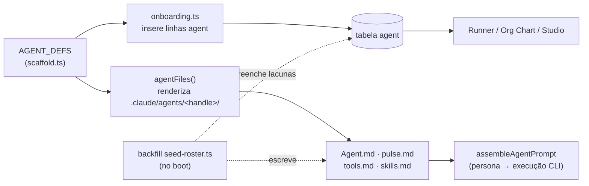
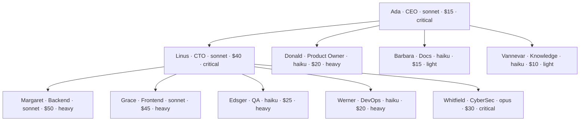

[← Índice](./README.md) · [🇬🇧 English](../en/AGENTS.md) · [✦ Constella](../../README.pt-BR.md)

# Agentes — O Elenco ✦🛰️


As dez estrelas operantes de toda organização Constella. Cada agente é um processo CLI real (`claude`/`codex`) com um papel, um gestor, um modelo, uma temperatura, um teto de orçamento diário e uma persona em disco. Juntos formam a constelação que planeja, constrói, revisa e lança o seu produto.

## Quando usar

- Você quer saber **quem faz o quê** e **quem se reporta a quem** numa organização recém-criada.
- Você precisa do **handle**, **papel**, **modelo**, **teto diário** e **tier** exatos de um agente.
- Você está montando o **Org Chart**, reatribuindo um gestor, ou mudando o modelo/orçamento de um agente.
- Você quer entender os **arquivos de persona** (`.claude/agents/<handle>/…`), **status** e **saúde (health)**.

## Como funciona 🌌

O elenco **nasce do código**, não é digitado por uma pessoa. Três fontes o definem e o materializam:

| Arquivo de origem | Papel |
|---|---|
| `src/data/scaffold.ts` (`AGENT_DEFS`) | Definição canônica do elenco + templates de persona/arquivos (`agentMd`, `pulseMd`, `toolsMd`, `skillsMd`). Renderiza os arquivos em disco `.claude/agents/<handle>/…`. |
| `src/server/onboarding.ts` (`AGENTS`) | Insere as 10 linhas `agent` no banco durante o onboarding (com `tierFloor`, `dailyCapUsd`, `reportsTo`). |
| `src/server/seed-roster.ts` (`seedRosterForExistingWorkspaces`) | **Backfill** — adiciona qualquer membro de `AGENT_DEFS` ausente num workspace já onboarded (ex.: Vannevar, incluído após os 9 originais). Idempotente; roda uma vez por boot via `reconcileOnBoot`. |

O **diretório é a fonte da verdade**: a identidade de cada agente vive em Markdown sob `.claude/agents/<handle>/`. A linha do agente no banco (`src/db/schema.ts`) o indexa para a UI e o runner. Editar a persona na UI escreve de volta no disco (`saveAgentPersona`, `saveAgentModel` em `src/server/agents.ts`).

> Nota: o seed de demonstração legado `src/db/seed.ts` lista apenas os **9** agentes originais (sem Vannevar). O backfill de boot (`seedRosterForExistingWorkspaces`) fecha essa lacuna, então todo workspace ativo termina com os **10**.

## Fluxo principal — da definição a um agente vivo



## Os 10 agentes 🪐

Fonte da verdade: `AGENT_DEFS` em `src/data/scaffold.ts` (espelhado por `AGENTS` em `src/server/onboarding.ts`).

| Nome | Handle | Papel | Reporta a | Modelo | Temp | Teto diário (USD) | Tier | Cor |
|---|---|---|---|---|---|---|---|---|
| Ada | `ada` | CEO | — (raiz) | `sonnet` | 0.4 | $15 | critical | `#e0a44e` |
| Linus | `linus` | CTO | `ada` | `sonnet` | 0.3 | $40 | critical | `#9a5cff` |
| Donald | `donald` | Product Owner | `ada` | `haiku` | 0.4 | $20 | heavy | `#4fc9b0` |
| Margaret | `margaret` | Backend | `linus` | `sonnet` | 0.3 | $50 | heavy | `#3fb98f` |
| Grace | `grace` | Frontend | `linus` | `sonnet` | 0.5 | $45 | heavy | `#5b8def` |
| Edsger | `edsger` | QA | `linus` | `haiku` | 0.2 | $25 | heavy | `#e8688f` |
| Werner | `werner` | DevOps | `linus` | `haiku` | 0.3 | $20 | heavy | `#f0a35e` |
| Barbara | `barbara` | Docs | `ada` | `haiku` | 0.4 | $15 | light | `#b3d97a` |
| Whitfield | `whitfield` | CyberSec | `linus` | `opus` | 0.2 | $30 | critical | `#c4a0ff` |
| Vannevar | `vannevar` | Knowledge | `ada` | `haiku` | 0.2 | $10 | light | `#7ac5e0` |

Todos os dez vêm com `provider: cli_claude_code` por padrão. `model` é um alias real da CLI do Claude Code — só `opus`, `sonnet`, `haiku` existem para esse adapter (`CLI_MODELS.cli_claude_code` em `src/server/adapters/cli.ts`).

### Identidades e rituais

Cada agente carrega uma `identity` (quem é) e um `ritual` (o que faz a cada ciclo de trabalho), direto de `AGENT_DEFS`:

| Agente | Identidade | Ritual |
|---|---|---|
| Ada | Líder decidida e orientada a resultado. Fala em objetivos, não em tarefas. Protege escopo e orçamento. | Ler os objetivos da empresa, decompor em épicos, delegar aos líderes, revisar o que foi entregue. |
| Linus | Pensador de sistemas. Equilibra velocidade de entrega contra dívida técnica. | Transformar épicos em tickets, rotear trabalho aos especialistas, desbloquear, revisar PRs. |
| Donald | Voz do cliente. Implacável quanto a prioridade e clareza. | Refinar o backlog com MoSCoW, planejar a sprint, acompanhar entrega, fechar com retro. |
| Margaret | Engenheira de servidor pragmática. Valoriza correção, diffs pequenos e testes verdes. | Pegar um ticket, ler o contexto, implementar numa branch, nunca dar push sem suíte passando. |
| Grace | Engenheira de UI focada em ofício. Cuida de acessibilidade e APIs de componente limpas. | Ler os design tokens, construir o menor componente que funciona, typecheck antes do PR. |
| Edsger | Portão de qualidade cético. Assume que nada funciona até um teste provar. | Reproduzir, cobrir com teste, rodar a suíte, então liberar o sign-off. |
| Werner | Operador focado em confiabilidade. Automatiza o tedioso, guarda os leases. | Buildar, fazer deploy de preview, reportar a URL, nunca deixar um ambiente alocado tempo demais. |
| Barbara | Explicadora paciente. Transforma mudanças em documentação compreensível. | Observar merges, escrever docs com o contexto fresco, verificar cada link. |
| Whitfield | Revisor adversarial. Pensa como atacante, escreve como auditor. | Auditar cada mudança quanto a manuseio de segredos e injeção, registrar achados com correção concreta. |
| Vannevar | Guardião da memória semântica da empresa. Indexa todo documento E conversa em embeddings. | Manter o servidor de embeddings saudável; re-indexar docs do workspace e o chat no índice RAG para a recuperação ficar atual. |

## Árvore de reporte — o org chart 🌠

Duas raízes de órbita: **Ada (CEO)** no centro; **Linus (CTO)** carrega a constelação de engenharia. `reportsTo` armazena o **handle do gestor** (handle-space de ponta a ponta — ver `setReportsToByHandle`).



- **Subordinados diretos de Ada:** `linus`, `donald`, `barbara`, `vannevar`.
- **Subordinados diretos de Linus:** `margaret`, `grace`, `edsger`, `werner`, `whitfield`.
- Tarefas bloqueadas escalam para o `reportsTo` do agente (conforme `.claude/routing.md`).

## Conceitos-chave ✦

### Arquivos de persona (o diretório é o cérebro)

Para cada agente, `agentFiles(def, ctx)` escreve **quatro** arquivos Markdown sob `.claude/agents/<handle>/`:

| Arquivo | Gerador | Conteúdo |
|---|---|---|
| `Agent.md` | `agentMd` | Front-matter YAML (`handle`, `name`, `role`, `reportsTo`, `provider`, `model`, `temperature`, `dailyCapUsd`, `tierFloor`) + Identity, Ritual, Responsibilities, Behavior (da temperatura), regras de Decision/Execution, limites de workspace e o **System prompt**. |
| `pulse.md` | `pulseMd` | Config de liveness — `intervalSec: 30`, `maxMissed: 2`, `wakeOn` (`queued_task`, `mention`), e a legenda de status/health. |
| `tools.md` | `toolsMd` | Tabela de ferramentas por papel (ex.: CyberSec → `secret-scan`, `review.signoff`, `fs.read`; Knowledge → `rag.reindex`, `rag.index-chat`, `embed.health`). |
| `skills.md` | `skillsMd` | Os procedimentos vinculados ao agente (de `SKILL_DEFS`) + seu ritual. |

`Agent.md` é **write-through**: edições na UI (Agent Studio) corrigem o front-matter e as seções no lugar (`setFrontMatter`, `setInlineField`, `setSection`) e a linha do banco é atualizada para casar. O diretório vence em caso de conflito.

### Modelo e tier

- **Não é só Claude.** Os valores semente `opus`/`sonnet`/`haiku` são apenas os padrões do adaptador semente `cli_claude_code`. Troque o `adapter` por agente em **Agent Studio → Model** e o **menu de modelos muda junto** — o `ModelPicker` é indexado pelo `adapter` (`cliModelOptions(adapter)`, `src/components/ui/model-picker.tsx`): `cli_codex` → `gpt-5-codex` / `o4-mini`; `cli_openclaw` / `cli_hermes` / `cli_aider` / `cli_opencode` / `cli_copilot` / `cli_cursor` / `cli_cline` / `cli_kilo` → seus ids roteados por provedor; `local_*` → o GGUF carregado; provedores HTTP/router → o catálogo de modelos em cache. A tabela completa de adaptadores está em [MODELS.md](./MODELS.md).
- `model` é o alias configurado. Para `cli_claude_code` é um de `opus` / `sonnet` / `haiku`.
- `tierFloor` (`light` | `heavy` | `critical`) é o piso de qualidade do agente — padronizado em `AGENT_DEFS`, persistido na linha `agent` (`tier_floor`, padrão `heavy`). **Os tiers são agnósticos ao provedor:** um modelo de raciocínio de ponta em qualquer provedor (ex.: um Codex/GPT no modo de raciocínio alto, ou um Gemini de topo) mapeia para o tier `critical` / classe-Opus em potência e custo, enquanto modelos menores/mais rápidos (`o4-mini`, um "flash", `haiku`) mapeiam para a ponta `light`.
- Para etapas críticas de qualidade (revisão de código, segurança, validação final) o runner pode buscar o modelo **mais forte** do provider do agente via `strongestModelFor()` — para `claude` isso resolve em `opus`, e o flagship equivalente para qualquer outro provedor.
- O menu de modelos troca **automaticamente** ao escolher um provedor; o **teto diário não** — é um orçamento em USD independente que você ajusta (próxima seção) para casar com o tier de custo do modelo.
- `temperature` **não** seta uma flag de sampling da CLI (a CLI do Claude Code não expõe nenhuma). Em vez disso, `temperatureBehavior(t)` transforma o slider numa **instrução de prompt** concreta injetada em toda execução (`src/data/temperature.ts`).

### Teto diário (limite de orçamento) 🕳️

`dailyCapUsd` é um teto rígido de gasto por agente por dia. O runner chama `agentAtCap(agentId, dailyCapUsd)` (`src/server/runner.ts`); ao atingir, **pausa** o agente e empurra um item de inbox `budget` ("@`<handle>` atingiu o teto diário de orçamento"). Aumente o teto no Agent Studio ou espere o reset diário. Um teto de `0` significa "sem teto".

### Status e saúde (health)

Dois eixos ortogonais na linha `agent`:

| Eixo | Coluna | Valores | Significado |
|---|---|---|---|
| **Status** | `status` | `idle` · `working` · `review` · `blocked` | O que o agente está fazendo agora. |
| **Health** | `health` | `alive` · `stale` · `down` | Se o executor está alcançável. |

A varredura do cron tick (`runner.ts`) define a saúde a partir da disponibilidade do runtime: se o binário CLI do agente está alcançável (`runtimeOk`), a saúde é `alive`; caso contrário `stale`. Agentes ociosos recebem um toque de heartbeat leve (`lastPulse` atualizado, sem spam de linha de pulse); agentes em working/review registram uma linha real de `pulse` via `recordPulse`. O `pulse.md` documenta o contrato de liveness: alive dentro de `intervalSec * maxMissed`, senão stale; falha repetida → `down` (registrado em `Reports/error-report.md`).

## Tabelas 🛰️

### `agent` (`src/db/schema.ts`)

| Coluna | Tipo | Padrão | Notas |
|---|---|---|---|
| `id` | text PK | — | Id estável. |
| `workspaceId` | text | — | FK → `workspace` (cascade). |
| `handle` | text | — | Nome curto único (`ada`, `linus`, …). |
| `name` | text | — | Nome de exibição. |
| `role` | text | — | CEO / CTO / Backend / … |
| `color` | text | `#e0a44e` | Tom do avatar (usado no fallback de iniciais). |
| `image` | text | null | Caminho/data-URL opcional do avatar. |
| `adapter` | text | `cli_claude_code` | Runtime de execução (CLI/HTTP/local). |
| `model` | text | `sonnet` | Alias de modelo. |
| `temperature` | real | `0.4` | Conduz a banda de prompt de Behavior. |
| `dailyCapUsd` | real | `25` | Teto diário de gasto. |
| `tierFloor` | text enum | `heavy` | `light` / `heavy` / `critical`. |
| `reportsTo` | text | null | **Handle** do gestor. |
| `status` | text enum | `idle` | `idle` / `working` / `review` / `blocked`. |
| `health` | text enum | `alive` | `alive` / `stale` / `down`. |
| `lastPulse` | timestamp | null | Último heartbeat. |
| `persona` | json | null | `{ identity, ritual, tone, systemPrompt }`. |
| `rag` | json | null | Toggles de fonte RAG por agente. |
| `orgX` / `orgY` | real | null | Coordenadas do card no org-chart. |

### `pulse` (log de heartbeat)

| Coluna | Tipo | Notas |
|---|---|---|
| `id` | text PK | — |
| `agentId` | text | FK → `agent`. |
| `at` | timestamp | Padrão `unixepoch()`. |
| `ok` | boolean | Resultado do health-ping. |
| `latencyMs` | integer | Latência do ping. |
| `note` | text | ex.: `tick:working`. |

### `agentSkill` (join de habilitação)

| Coluna | Notas |
|---|---|
| `agentId` + `skillId` | PK composta. |
| `auto` | `true` = vínculo gerenciado pelo sistema (reconciliado no boot/mudança de stack); `false` = ativado à mão pelo operador (nunca tocado pelo reconcile). |

## Passo a passo — operar o elenco

1. **Ver o elenco.** Abra o módulo Agents (cada card mostra status, health, modelo). O Org Chart visualiza `reportsTo`.
2. **Reatribuir um gestor.** Arraste um card no canvas do Org Chart → `setReportsToByHandle(agentHandle, managerHandle)`. Auto-loops e ciclos são rejeitados; passe `null` para destacar (vira raiz/CEO).
3. **Mudar modelo / orçamento / tier.** No Agent Studio → `saveAgentModel({ adapter, model, temperature, dailyCapUsd, tierFloor })`. A linha do banco e o front-matter do `Agent.md` são atualizados juntos.
4. **Editar persona.** `saveAgentPersona({ identity, ritual, tone, systemPrompt })` corrige o `Agent.md` (Identity, Ritual, System prompt) em disco.
5. **Definir um avatar.** `saveAgentImage(agentId, imagePath | null)` (avatares em data-URL; avatares legados `uploads/<id>/` são limpos ao substituir).
6. **Adicionar um agente ausente.** No boot, `seedRosterForExistingWorkspaces()` faz backfill de qualquer membro de `AGENT_DEFS` ausente no workspace — linha do banco, quatro arquivos de persona e as skills nativas não-provisórias.

## Exemplos

Inspecionar a persona de um agente em disco:

```bash
cat ~/.constella/organizations/<orgId>/workspace/.claude/agents/linus/Agent.md
```

Front-matter que você verá (renderizado por `agentMd`):

```yaml
---
handle: linus
name: Linus
role: CTO
reportsTo: ada
provider: cli_claude_code
model: sonnet
temperature: 0.3
dailyCapUsd: 40
tierFloor: critical
---
```

Listar agentes e sua linha de reporte pelo chat:

```
/agents
/agent linus
```

(`/agents` lista o elenco; `/agent <handle>` mostra o detalhe de um agente — ver [CHAT_COMMANDS.md](./CHAT_COMMANDS.md).)

## Estados possíveis

| Aspecto | Valores | Definido por |
|---|---|---|
| Status | `idle` · `working` · `review` · `blocked` | Runner / planner conforme o trabalho flui. |
| Health | `alive` · `stale` · `down` | Varredura do cron tick (alcance do binário) + pulse sweep. |
| Orçamento | abaixo do teto → roda · no/acima do teto → pausado (item de inbox `budget`) | `agentAtCap()`. |
| Tier floor | `light` · `heavy` · `critical` | Padrão de `AGENT_DEFS`; editável no Studio. |

## Integrações relacionadas 🚀

- **Skills** — os procedimentos habilitados de cada agente (`agentSkill`, `skills.md`). Ver [SKILLS.md](./SKILLS.md).
- **Models** — adapters e catálogo de modelos por trás de `adapter`/`model`. Ver [MODELS.md](./MODELS.md).
- **Workflow** — como os agentes pegam Goals → Specs → Issues → Tasks. Ver [WORKFLOW.md](./WORKFLOW.md).
- **Team Room / DM** — onde os agentes colaboram e fazem handoff. Ver [TEAM_ROOM.md](./TEAM_ROOM.md), [DM.md](./DM.md).
- **PO Agent / KB Agent** — o refinamento de Donald e a memória de Vannevar. Ver [PO_AGENT.md](./PO_AGENT.md), [KB_AGENT.md](./KB_AGENT.md).

## Segurança 🕳️

- **Jaula de workspace.** Cada agente roda com `cwd` no workspace da sua organização e é verificado lexicamente + por symlink contra fuga; nada fora do workspace é alcançável. Os limites são declarados em `Agent.md`, `permissions.md` e impostos pelo runner.
- **Sem segredos inline.** Personas e ferramentas proíbem chaves em texto puro; segredos vêm do vault. A saída é higienizada antes de logs/KB/Telegram.
- **Tetos de orçamento.** Um agente descontrolado para no seu `dailyCapUsd`; o runner não excede o teto.
- **Guardas de ciclo/self.** A reatribuição de gestor (`setReportsTo`, `setReportsToByHandle`) rejeita auto-referências e ciclos, então o org chart nunca forma um loop.

## Troubleshooting

| Sintoma | Causa provável | Correção |
|---|---|---|
| Um agente aparece **stale/down** | Seu binário CLI não está instalado/alcançável (`runtimeOk` falso). | Instale/repare a CLI `claude`/`codex`; a saúde se recupera no próximo tick. |
| Agente **pausado no meio do trabalho** | Atingiu seu `dailyCapUsd`. | Aumente o teto no Agent Studio ou espere o reset diário (ver o item de inbox `budget`). |
| Vannevar ausente numa org antiga | Org onboarded antes do agente Knowledge existir. | O backfill de boot (`seedRosterForExistingWorkspaces`) o adiciona automaticamente na próxima inicialização. |
| Mudança de gestor não faz nada | Self/ciclo (rejeitado) ou gestor fora deste workspace. | Escolha outro gestor; a mudança é silenciosamente ignorada para alvos inválidos. |
| `Agent.md` editado mas UI ainda antiga | Atraso de write-through/watcher. | O sync engine re-indexa ao salvar; recarregue após um instante. |

## Links relacionados

- [AI_ARCHITECTURE.md](./AI_ARCHITECTURE.md) — como as execuções de agente são montadas e executadas.
- [WORKFLOW.md](./WORKFLOW.md) — o ciclo Goal → Spec → Issue → Done.
- [SKILLS.md](./SKILLS.md) — a biblioteca de skills de que cada agente se vale.
- [MODELS.md](./MODELS.md) — adapters, aliases de modelo e tiers.
- [PO_AGENT.md](./PO_AGENT.md) · [KB_AGENT.md](./KB_AGENT.md) — Donald e Vannevar em profundidade.
- [TEAM_ROOM.md](./TEAM_ROOM.md) · [DM.md](./DM.md) — colaboração entre agentes.
- [CHAT_COMMANDS.md](./CHAT_COMMANDS.md) — `/agents`, `/agent`, `/status`.
