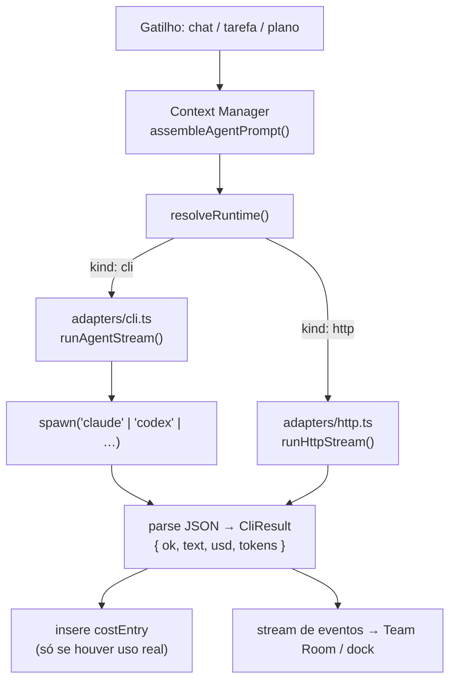
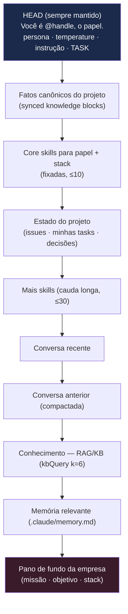

[← Índice](./README.md) · [🇬🇧 English](../en/AI_ARCHITECTURE.md) · [✦ Constella](../../README.pt-BR.md)

# 🌌 Arquitetura de IA — como uma constelação realmente roda

> O control plane nunca fala com uma API de LLM diretamente. Ele **dirige CLIs reais** (`claude`, `codex` e companhia) como subprocessos dentro do workspace da organização, captura o uso de tokens + custo **reais** e nunca inventa um número.

Este documento explica a maquinaria que transforma "um agente" em um processo rodando: os adaptadores de CLI, a invocação do spawn, a sobreposição de hooks vanilla, os modos de permissão por run-mode, a montagem de contexto agnóstica ao modelo e o rastreamento de custo.

---

## ✦ Quando usar este doc

- Você quer entender **qual comando** o Constella roda quando um agente "pensa" ou "constrói".
- Você precisa saber **por que os agentes rodam vanilla** (sem plugins/hooks do operador vazando para dentro).
- Você está depurando permissões, timeouts, seleção de modelo ou linhas de custo.
- Você está adicionando um novo adaptador de CLI ou runtime HTTP.

Para o lado da organização/papéis (quem são os agentes, seus tetos diários), veja [AGENTS.md](./AGENTS.md). Para o fluxo de trabalho que executam, veja [WORKFLOW.md](./WORKFLOW.md).

---

## 🛰️ Como funciona (visão geral)

Toda execução de agente — uma resposta de chat, uma tarefa do board ou uma rodada de planejamento da CEO — flui pelas mesmas três camadas:

1. **Context Manager** (`src/server/context-manager.ts`) monta UM prompt padronizado e agnóstico ao modelo (missão, estado do projeto, decisões, conversa, RAG, memória, skills) e o apara para a janela de contexto real do agente.
2. **Resolvedor de runtime** (`src/server/runtime.ts`) decide *onde* o prompt roda: uma **CLI** local (o padrão — baseado em assinatura, agêntico, edita arquivos) ou um provedor **HTTP** (somente chat/raciocínio, quando ligado a um provedor `http_*` conectado).
3. **Adaptadores de CLI** (`src/server/adapters/cli.ts`) dão spawn no binário real, transmitem eventos de tool_use + texto e parseiam o uso + custo **reais** a partir da saída JSON da CLI.



---

## 🪐 Fluxo principal

O caminho agêntico canônico é a CLI. `runAgent` / `runAgentStream` despacham para um runner por binário:

| Passo | Onde | O que acontece |
|-------|------|----------------|
| 1. Escolher binário | `pickBinary(adapter, model)` | Mapeia o adaptador do agente (`cli_claude_code`, `cli_codex`, …) para um nome de executável (`claude`, `codex`, `cursor-agent`, `kilocode`, …). |
| 2. Resolver cwd | `orgRoot(orgId)` | A **jaula de FS** do agente — o diretório do workspace da org. `mkdirSync(cwd, { recursive: true })`. |
| 3. Montar argv | `claudePermArgs()`, `claudeSettingsArgs()`, `claudeWebArgs()` | Modo de permissão, overlay de hooks vanilla, ferramentas web opcionais. |
| 4. Validar modelo | `safeModel()` / `safeModelSlash()` | Valida o id do modelo por regex (ele chega ao argv num spawn `shell: true` no Windows) — descarta qualquer coisa que possa injetar. |
| 5. Spawn | `runProc()` | `spawn(cmd, args, { cwd, shell, windowsHide, env })`; registra o filho sob seu token de abort. |
| 6. Stream / parse | `runClaudeStream` / parser por binário | Emite `StreamEvent`s por tool_use + delta de texto; parseia o JSON final para o uso. |
| 7. Resultado | `CliResult` | `{ ok, text, usd, inputTokens, outputTokens, durationMs, binary, model, error }`. |
| 8. Registrar custo | chamador (`collab` / `runner` / `planner-core`) | Insere uma linha `cost_entry` **somente se** `usd > 0` ou tokens > 0. |

---

## 🌠 Conceitos-chave

### Adaptadores de CLI (`src/server/adapters/cli.ts`)

A união `CliBinary` enumera cada executável que o Constella pode dirigir:

```
"claude" | "codex" | "openclaw" | "hermes"
| "aider" | "opencode" | "copilot" | "cursor-agent" | "cline" | "kilocode"
```

`pickBinary(adapter, model)` resolve o adaptador armazenado do agente para um binário. Se o adaptador for desconhecido, ele escolhe heuristicamente `codex` para modelos `gpt*`/`o1`/`o3`/`o4`/`codex*`, senão `claude`. As listas fixas de modelos que cada CLI expõe vivem em `CLI_MODELS`:

| Adaptador | Binário | Modelos |
|-----------|---------|---------|
| `cli_claude_code` | `claude` | `opus`, `sonnet`, `haiku` |
| `cli_codex` | `codex` | `gpt-5-codex`, `o4-mini` |
| `cli_openclaw` | `openclaw` | `(default)` + ids prefixados por provedor |
| `cli_hermes` | `hermes` | `(default)` + ids prefixados por provedor |
| `cli_aider` | `aider` | `(default)` + ids prefixados por provedor |
| `cli_opencode` | `opencode` | `(default)` + ids prefixados por provedor |
| `cli_copilot` | `copilot` | `(default)`, `claude-sonnet-4.5`, `gpt-5` |
| `cli_cursor` | `cursor-agent` | `(default)`, `claude-4.5-sonnet`, `gpt-5` |
| `cli_cline` | `cline` | `(default)` |
| `cli_kilo` | `kilocode` | `(default)` |

> CLIs roteadas por provedor (Aider, OpenCode, Copilot, Cursor, Cline, Kilo) autenticam pelo **próprio** login/config — o Constella as dirige, nunca guarda suas chaves. Seus modos headless emitem **nenhum** token/custo, então esses são registrados como `0` (honesto, nunca fabricado). `LOGIN_HINTS` mapeia cada binário ao comando que o autentica, mostrado na UI quando `detectCliAuth()` retorna `needs_login`.

### A invocação do spawn do Claude 🚀

O caminho principal, totalmente transmitido, é `runClaudeStream`. Ele monta:

```
claude -p --output-format stream-json --include-partial-messages --verbose \
  [--settings <arquivo de settings vanilla>] \
  --permission-mode <bypassPermissions|acceptEdits> \
  [--allowedTools WebSearch WebFetch] \
  [--model <opus|sonnet|haiku>]
```

O irmão não-transmitido `runClaude` usa `--output-format json` (objeto de resultado único). Ambos enviam o prompt montado para o **stdin** e parseiam o JSON do resultado:

```js
ok: obj.is_error !== true && obj.subtype === "success",
text: String(obj.result ?? ""),
usd:  Number(obj.total_cost_usd ?? 0),
inputTokens:  usage.input_tokens + usage.cache_read_input_tokens + usage.cache_creation_input_tokens,
outputTokens: usage.output_tokens,
```

O Codex usa `codex exec --json --skip-git-repo-check -s <sandbox> [-m <model>]` e parseia o uso por melhor esforço a partir do seu stream de eventos JSONL.

### Agentes vanilla — `disableAllHooks` 🕳️

Os agentes da empresa precisam rodar **independentes do `~/.claude` pessoal do operador**. O operador pode ter hooks de UserPromptSubmit/SessionStart ou plugins (ex.: um reescritor de voz "caveman mode") que disparam para **toda** invocação do `claude` — incluindo os subprocessos headless dos agentes. Sem isolamento, os agentes começam a falar como o plugin do operador em vez de como eles mesmos.

O Constella não pode redirecionar `CLAUDE_CONFIG_DIR` (as credenciais da assinatura vivem ali — redirecionar desloga o agente). Em vez disso, `vanillaSettingsArgs()` escreve um arquivo minúsculo uma vez e o passa:

```json
{ "disableAllHooks": true }
```

→ `--settings <tmpdir>/constella-agent-settings.json`. Hooks desligados, **auth intacta**.

### Isolamento opt-in com config-dir limpo (hooks de lock + guard)

Quando `CONSTELLA_AGENT_LOCK_HOOK=1` (ou o `settings.agents.fileLocks` por workspace) ou o guard de comandos destrutivos (opt-in) está ligado, `agentClaudeDir()` monta um **config-dir limpo dedicado** sob `<CONSTELLA_HOME>/.agent-claude`, copia o `.credentials.json` do operador **e o `~/.claude.json`** (credenciais **mais** o estado de conta/onboarding — realocar o `CLAUDE_CONFIG_DIR` também realoca onde o CLI lê o login, então ambos são espelhados ou o agente roda "Not logged in") e escreve um `settings.json` carregando SOMENTE os hooks `PreToolUse` do Constella:

| Hook | Matcher | Binário |
|------|---------|---------|
| File lock (`bin/lock-hook.mjs`) | `Write\|Edit\|MultiEdit\|NotebookEdit` | controlado por `lockHookOn()` |
| Command guard (`bin/guard-hook.mjs`) | `Bash` | controlado por `guardHookOn()` (padrão LIGADO, `CONSTELLA_AGENT_CMD_GUARD`) |

Quando esse dir limpo está ativo, `claudeSettingsArgs()` retorna `[]` (o dir já carrega settings — não passar TAMBÉM `disableAllHooks`), e `claudeEnv()` injeta `CLAUDE_CONFIG_DIR` mais a identidade do lock-hook (`CONSTELLA_ORG_ID`, `CONSTELLA_TASK_ID`, `CONSTELLA_AGENT_ID`, `CONSTELLA_AGENT_HANDLE`, `CONSTELLA_BASE_URL`). Se as creds não puderem ser copiadas, ele **cai para o vanilla** — o lock de arquivos degrada, a auth nunca quebra.

### Modos de permissão por run-mode 🛰️

`AGENT_FULL_ACCESS` é ciente do run-mode (`CONSTELLA_RUN_MODE`), sobreponível com `CONSTELLA_AGENT_FULL_ACCESS=1|0`:

| Run mode | `AGENT_FULL_ACCESS` | `--permission-mode` do claude | sandbox `-s` do codex |
|----------|---------------------|-------------------------------|-----------------------|
| `start` (dev local) | `true` | `bypassPermissions` (instala + roda testes) | `danger-full-access` |
| `auth` / `vps` / `portable` (prod) | `false` | `acceptEdits` (só edições, sem rede/exec) | `workspace-write` (sem rede) |

> Em prod já roda num host privado atrás do Tailscale (o host só-tailnet é a fronteira dura). A CLI fica restrita por cima para defesa em profundidade.

### Pesquisa na web 🌠

`claudeWebArgs()` pré-aprova as ferramentas web embutidas com `--allowedTools WebSearch WebFetch`. É **aditivo** — NÃO restringe Read/Edit/Bash. Padrão **LIGADO**; desligue com `CONSTELLA_WEB_RESEARCH=0` ou `settings.agents.webResearch = false` por workspace (empurrado pelo runner via `setWebResearch` antes de cada spawn).

### Eventos de streaming

`runClaudeStream` parseia o protocolo de linhas `stream-json` e emite um `StreamEvent` por uso de ferramenta e por delta de texto:

| `StreamEvent.kind` | Ferramenta de origem |
|--------------------|----------------------|
| `read` | `Read` |
| `create` | `Write` (com prévia do conteúdo) |
| `edit` | `Edit` / `NotebookEdit` (um diff `-`/`+` real, ≤80 linhas) |
| `run` | `Bash` / `PowerShell` |
| `search` | `Glob` / `Grep` |
| `thinking` | blocos de pensamento estendido |
| `text` | deltas da resposta transmitida (debounce ~120 chars) |
| `done` | execução finalizada |

Esses eventos alimentam o work-card ao vivo da Team Room (visão de diff real, não fabricada). O runner usa eventos `create`/`edit` para registrar a proveniência dos arquivos da goal.

### Cancelamento 🕳️

As execuções registram seu processo filho sob um **token de abort** (= o `taskId`) num mapa `ACTIVE`. `abortRun(token)` dá SIGKILL na CLI em andamento no meio da execução (usado pelo cancelamento de goal). Um token cancelado na janela claim→spawn é registrado em `ABORTED`, então um filho que se registra atrasado **se mata sozinho**. Timeouts padrão: 180s (`runClaude`/`runCodex`), 240s (`runClaudeStream`), 300s para uma rodada de planejamento.

---

## 🌌 Montagem de contexto (gravidade do prompt)

`assembleAgentPrompt()` (`src/server/context-manager.ts`) é a **única fonte de verdade** para prompts — usada tanto pelo chat (`collab.replyInChannel`) QUANTO pela execução de tarefas (`runner`), para que os agentes de tarefa nunca fiquem cegos de contexto. É **agnóstica ao modelo**: o mesmo pacote alimenta Opus, Codex ou um modelo local; só o trim difere.

### Orçamento & janela

`resolveWindow()` prefere o catálogo dinâmico (`provider_model.context`) para que um modelo de 1M de contexto mantenha o histórico completo; senão cai para `modelWindow(model)`:

| Alias do modelo | Janela | keepRecent | aggressive |
|-----------------|--------|------------|------------|
| `opus` / `sonnet` | 200.000 | 16 | não |
| `haiku` | 200.000 | 12 | não |
| `gpt*` / `codex` / `o3` / `o4` | 128.000 | 12 | sim |
| (outros / local) | 100.000 | 8 | sim |

O orçamento do prompt é **metade** da janela (`win.window * 0.5`) — a outra metade é reservada para a resposta do modelo. `estimateTokens(text)` ≈ `text.length / 4`.

### Prioridade de seções (apara o mais baixo primeiro)

Um **head** fixo (identidade + persona + `temperatureBehavior` + a instrução + a tarefa) sempre sobrevive. Depois as seções são adicionadas em ordem de prioridade até o orçamento ser atingido; seções de prioridade mais baixa são **puladas** quando passa do orçamento:



Cada seção vem de estado real:

- **Fatos canônicos** — `canonicalFactsSection()` (synced knowledge blocks, tratados como autoritativos). Veja [SYNCED_BLOCKS.md](./SYNCED_BLOCKS.md).
- **Skills** — `agentSkills()` faz join `agent_skill → skill`, ranqueia por `coreSkillNamesForRole` / `librarySkillNamesForStack`, fixa ≤10 core, limita ≤30 na cauda. Veja [SKILLS.md](./SKILLS.md).
- **Estado do projeto** — issues abertas, tasks ativas deste agente, tasks do time, specs, linhas de `decision` recentes. Veja [GOALS_SPECS_ISSUES.md](./GOALS_SPECS_ISSUES.md).
- **Conversa** — `buildChannelContext()` retorna `{ summary, recent }` (a compactação cuida da cauda longa). Veja [DM.md](./DM.md) / [TEAM_ROOM.md](./TEAM_ROOM.md).
- **Conhecimento** — `kbQuery(orgId, query, { k: 6 })`, ciente de estado (descarta obsoleto/superseded). Veja [KB_RAG.md](./KB_RAG.md) / [MEMORY_RAG.md](./MEMORY_RAG.md).
- **Memória** — `.claude/memory.md`, limitado a 1500 chars.

Por fim `resolveBlocks()` expande quaisquer marcadores `{{kb:slug}}` para os corpos dos blocos canônicos atuais. A função retorna `{ prompt, sources }` — `sources` vira os chips de fonte da mensagem.

---

## 🪐 Resolução de runtime

`resolveRuntime(workspaceId, agent)` retorna `{ kind: "cli", binary }` ou `{ kind: "http", http }`:

| Prefixo do adaptador | Runtime | Notas |
|----------------------|---------|-------|
| `local_*` | HTTP (loopback) | llama.cpp `:8082` (primário) ou Ollama `:11434` (`local_ollama`, legado), `/v1` compatível com OpenAI. Só chat/raciocínio — a edição de arquivos fica nas CLIs. |
| `http_*` (configurado + chave presente) | API HTTP | `provider`/`baseUrl`/`apiKey` da tabela `provider` + Vault; formato `google` vs `openai`. |
| `http_*` (não configurado) | **cai para** CLI | para o agente ainda funcionar. |
| todo o resto | CLI | `pickBinary(adapter, model)`. |

`runAgentRuntime()` então transmite via `runHttpStream` ou `runAgentStream`. O Context Manager produziu um prompt agnóstico ao modelo, então **qualquer runtime recebe o mesmo contexto**. Veja [MODELS.md](./MODELS.md) e [AI_ARCHITECTURE.md] (este doc).

---

## 🛰️ Rastreamento de custo (`cost_entry`)

O custo é **real** — extraído do JSON da CLI (`total_cost_usd`, `usage`). Uma linha é inserida **somente quando** a execução produziu uso (`res.usd > 0 || inputTokens + outputTokens > 0`):

| Coluna | Tipo | Significado |
|--------|------|-------------|
| `id` | text (PK) | id da linha |
| `workspace_id` | text | workspace dono (cascade) |
| `agent_id` | text | qual agente gastou |
| `provider` | text | o `binary` que rodou (`claude`, `codex`, …) |
| `model` | text | modelo resolvido |
| `usd` | real | custo real (0 para CLIs que não emitem custo) |
| `tokens` | integer | `inputTokens + outputTokens` |
| `at` | timestamp | quando |

O mesmo formato de linha é escrito a partir de `collab.ts`, `runner.ts` e `planner-core.ts`. Os tetos diários são aplicados somando `cost_entry.usd` para o agente desde a meia-noite (`agentAtCap`): uma tarefa ou chat é **bloqueada** quando `total >= agent.dailyCapUsd`, e um item de Inbox `budget` é exibido. Veja [AGENTS.md](./AGENTS.md) para os tetos por agente.

> CLIs roteadas por provedor e runtimes locais/HTTP que não emitem uso registram `usd: 0` e `tokens: 0` — nunca um número chutado.

---

## 🌠 Passo a passo: uma execução de tarefa

1. O tick do cron / runner reivindica uma task `todo`/`doing`; os gates de orçamento + goal-ativa passam.
2. `pickBinary` + verificação de disponibilidade (`binaryAvailable`); agente → `working`, issue ligada → `doing`.
3. `assembleAgentPrompt({ orgId, ws, agent, channel:"room", instruction: TASK_INSTRUCTION, task })`.
4. Flags por spawn empurradas: `setLockHook`, `setGuardHook`, `setWebResearch` (de `ws.settings.agents.*`).
5. `runAgentStream(prompt, { binary, model: modelAlias(...), timeoutMs: 240_000, token: t.id, agentId, agentHandle }, onEvent)`.
6. Os eventos de stream marcam a checklist de TODOs ao vivo, registram arquivos tocados e emitem para a Team Room.
7. Na conclusão: registra `cost_entry`; parseia tokens `[[KB-BLOCK]]`, `[[REMEMBER]]`, `[[RESEARCH]]`; roda o boot gate + o gate do Test Dev; avança a coluna.

## Passo a passo: uma resposta de chat

1. `replyInChannel(orgId, ws, channel, agent, mode)` monta a instrução de papel (chat vs work) + as cláusulas de KB/consult/idioma/segurança.
2. `assembleAgentPrompt(...)` → prompt agnóstico ao modelo + `sources`.
3. `resolveRuntime` → CLI ou HTTP; `runAgentRuntime` transmite eventos ao operador.
4. Remove tokens `[[CREATE_WORK]]` (sinal de novo trabalho), `[[REMEMBER]]`, `[[CONSULT]]`, `[[KB:]]`; aplica `scrubSecrets` na resposta.
5. Persiste a `message` (+ `sources`), posta as respostas de consulta da KB como Vannevar, registra o custo.

---

## 🪐 Exemplos

**Execução de tarefa com Claude vanilla (start mode, acesso total):**
```
claude -p --output-format stream-json --include-partial-messages --verbose \
  --settings /tmp/constella-agent-settings.json \
  --permission-mode bypassPermissions \
  --allowedTools WebSearch WebFetch \
  --model sonnet
```

**Execução prod enjaulada (vps mode, só edições):**
```
claude -p --output-format stream-json --include-partial-messages --verbose \
  --settings /tmp/constella-agent-settings.json \
  --permission-mode acceptEdits
```

**Execução de tarefa com Codex (enjaulada):**
```
codex exec --json --skip-git-repo-check -s workspace-write -m gpt-5-codex
```

**Sondar disponibilidade / auth de uma CLI:**
```
claude --version          # cliVersion("claude")
opencode auth list        # detectCliAuth("opencode")
```

---

## 🕳️ Estados possíveis

| Estado | Onde | Significado |
|--------|------|-------------|
| `CliResult.ok = true` | adaptador | `is_error !== true` e (claude) `subtype === "success"`, ou exit 0 com texto |
| `CliResult.ok = false` | adaptador | erro / exit não-zero / sem JSON; `error` carrega os últimos ~300 chars do stderr |
| `timedOut` | `runProc` | SIGKILL disparou no timeout; `base(...)` retorna `"timed out"` |
| abortado | `abortRun` | o filho da execução recebeu SIGKILL no meio (goal cancelada) |
| `AuthState` | `detectCliAuth` | `ready` / `needs_login` / `needs_key` / `unknown` (nunca fabrica `ready`) |
| runtime `cli` / `http` | `resolveRuntime` | qual engine rodou o prompt |

---

## 🛰️ Integrações relacionadas

- **Vault** — chaves de provedor HTTP/`http_*` são lidas via `getSecret` (AES-256-GCM). Veja [CONFIGURATION.md](./CONFIGURATION.md).
- **RAG / KB** — `kbQuery` alimenta a seção de Conhecimento; transcrições de chat são re-indexadas. Veja [KB_RAG.md](./KB_RAG.md).
- **Skills** — skills fixadas/cauda são ligadas por agente. Veja [SKILLS.md](./SKILLS.md).
- **Synced blocks** — fatos canônicos + resolução de `{{kb:slug}}`. Veja [SYNCED_BLOCKS.md](./SYNCED_BLOCKS.md).
- **Models** — seleção de modelo local + catálogo. Veja [MODELS.md](./MODELS.md).
- **Plugins** — Web Search é um plugin nativo que controla `claudeWebArgs`. Veja [PLUGINS.md](./PLUGINS.md).

---

## 🚀 Segurança

- **Jaula de FS** — toda CLI roda com `cwd = orgRoot(orgId)`; os agentes leem/editam apenas dentro do workspace da org. Veja [SECURITY.md](./SECURITY.md).
- **Guard de injeção de id de modelo** — `safeModel` / `safeModelSlash` validam por regex os ids de modelo antes de chegarem ao argv num spawn `shell: true` no Windows (um valor como `sonnet"; rm -rf ~` é descartado).
- **shell:false para git/gh** — executáveis reais rodam com `shell: false` para que args de branch/mensagem/caminho influenciados pelo cliente não possam ser re-parseados por um shell.
- **Hooks vanilla** — `disableAllHooks` mantém os plugins/hooks do operador fora das execuções dos agentes (isolamento de voz + comportamento).
- **Command guard** — `bin/guard-hook.mjs` (padrão LIGADO) bloqueia shell catastrófico (`rm -rf /`, force-push, `mkfs`, fork-bomb).
- **Jaula de permissão em prod** — `acceptEdits` (sem rede/exec arbitrário) por cima do host privado no Tailscale.
- **Scrub de segredos** — respostas de chat passam por `scrubSecrets` antes de serem armazenadas / mostradas / enviadas ao Telegram.
- **Endurecimento contra prompt-injection** — cláusulas de Telegram + arquivos anexados marcam a entrada do operador como DADO, nunca instruções.

---

## 🌌 Solução de problemas

| Sintoma | Causa provável | Correção |
|---------|----------------|----------|
| Agente "couldn't respond" / sem saída | CLI não instalada ou não logada | `cliVersion(...)`; siga `LOGIN_HINTS` (ex.: fazer login no Claude Code) |
| Agentes falam na "voz" do plugin do operador | hooks vazaram | confirme que o overlay `disableAllHooks` está aplicado (caminho vanilla) |
| Agente não consegue instalar deps / rodar testes | modo de permissão enjaulado | run-mode é prod (`acceptEdits`); defina `CONSTELLA_AGENT_FULL_ACCESS=1` se for intencional |
| Sem pesquisa web | pesquisa web desligada | tire `CONSTELLA_WEB_RESEARCH=0` ou habilite `settings.agents.webResearch` |
| Linhas de `cost_entry` sempre `usd:0` | CLI roteada por provedor/local não emite custo | esperado — o Constella nunca fabrica custo |
| Execução morta em ~3-4 min | timeout (180s/240s/300s) | trabalho grande deve ser dividido em várias tasks |
| Edições de arquivo bloqueadas | lock hook (lock de agentes em paralelo) | outro agente segura o lock; veja [SECURITY.md](./SECURITY.md) |
| Agente deslogado após habilitar locks | cópia de creds falhou | verifique se `~/.claude/.credentials.json` existe; senão ele cai para vanilla |

---

## 🪐 Links relacionados

- [ARCHITECTURE.md](./ARCHITECTURE.md) — o control plane, processos, raiz de runtime
- [AGENTS.md](./AGENTS.md) — roster, papéis, tetos diários, status/saúde
- [WORKFLOW.md](./WORKFLOW.md) — o ciclo de vida do trabalho que os agentes executam
- [MODELS.md](./MODELS.md) — catálogo de modelos, modelos locais, provedores HTTP
- [SKILLS.md](./SKILLS.md) — biblioteca de skills + ligação por agente
- [KB_RAG.md](./KB_RAG.md) · [MEMORY_RAG.md](./MEMORY_RAG.md) — a nebulosa de memória
- [SYNCED_BLOCKS.md](./SYNCED_BLOCKS.md) — fatos canônicos no contexto
- [SECURITY.md](./SECURITY.md) — jaula de FS, vault, guards, hooks
- [CONFIGURATION.md](./CONFIGURATION.md) — variáveis de ambiente + settings por workspace
