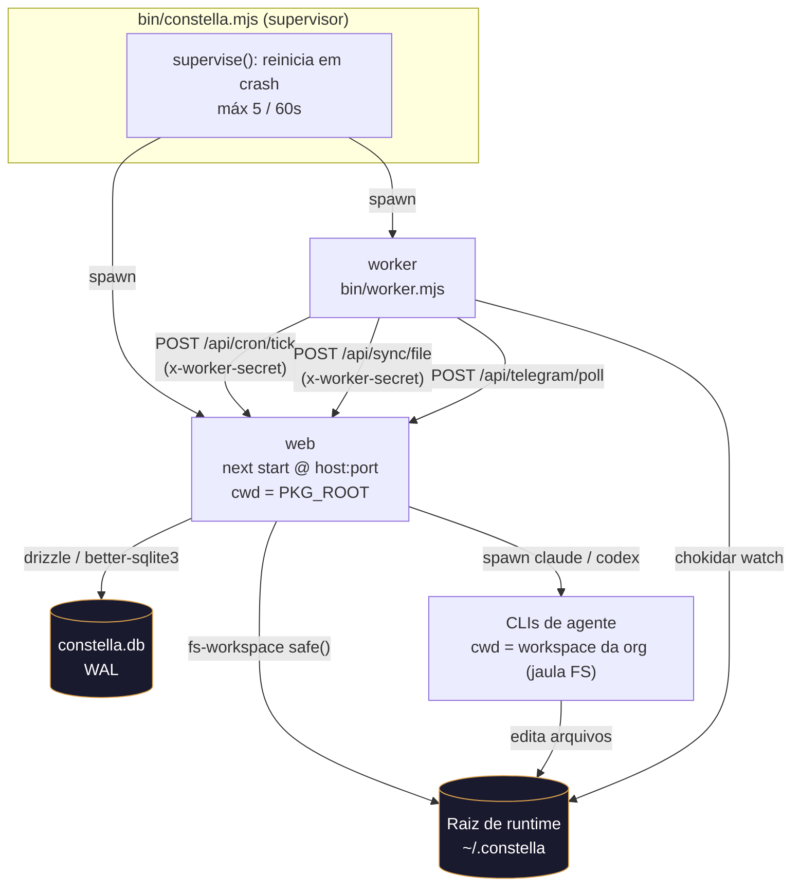
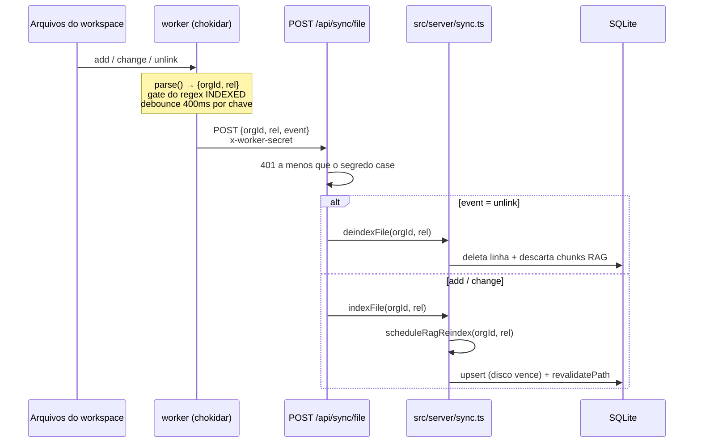

[← Índice](./README.md) · [🇬🇧 English](../en/ARCHITECTURE.md) · [✦ Constella](../../README.pt-BR.md)

# 🌌 Arquitetura — a nave central

A Constella é um plano de controle local-first: um único processo Node supervisiona um **servidor web** e um **worker 24/7**, ambos orbitando uma raiz de runtime em disco onde cada organização mantém um workspace isolado. O diretório é a fonte da verdade; o SQLite é o índice que mantém a UI e a busca em acordo.

> ✦ Este documento mapeia a camada *estrutural*: topologia de processos, raiz de runtime + isolamento de organização, a jaula de filesystem, o armazenamento SQLite/Drizzle, o motor de sincronização + watcher de arquivos, e o cron tick que conduz o trabalho autônomo. Para a camada *cognitiva* (como os agentes pensam, RAG, KB) veja [AI_ARCHITECTURE](./AI_ARCHITECTURE.md).

---

## 🛰️ Quando usar este doc

- Você precisa entender **como a Constella inicializa** e qual processo faz o quê.
- Está depurando **por que uma edição de arquivo não apareceu** na UI (motor de sincronização).
- Está raciocinando sobre **isolamento multi-tenant** (uma raiz de runtime, várias organizações).
- Está reforçando ou auditando a fronteira de confiança **worker ↔ web**.
- Quer o **mapa em nível de tabela** do banco de dados (`src/db/schema.ts`).

---

## 🚀 Como funciona (visão geral)

Um único launcher — `bin/constella.mjs` — resolve o modo de execução, prepara a raiz de runtime e os segredos, aplica as migrações do banco e então **supervisiona dois filhos de longa duração**:

| Filho | Entrada | Papel |
| --- | --- | --- |
| **web** | `next start -H <host> -p <port>` (a partir de `PKG_ROOT`) | A app Next.js 16: UI, server actions, todas as rotas `/api`, orquestração de agentes. |
| **worker** | `bin/worker.mjs` | Condutor headless 24/7: cron tick, o watcher de arquivos chokidar, o long-poll do Telegram. Fala com a web por HTTP em loopback. |

O worker nunca toca no banco diretamente. Ele apenas faz chamadas HTTP autenticadas de volta para o servidor web (`x-worker-secret`), de modo que todas as escritas passam por um único processo e um único conjunto de server actions. Isso mantém a fronteira de confiança pequena e o banco com um único escritor.



---

## 🌠 Fluxo principal — do boot ao regime estável

A sequência de boot do launcher (`bin/constella.mjs`), em ordem:

1. **Resolver o destino de instalação** — uma flag de execução explícita (`--start|--vps|--portable`) vence, depois o legado `--bind`. Um `constella` sem flag imprime o uso e sai. A autenticação (e-mail + senha) é exigida em todo destino. Veja [START_MODE](./START_MODE.md), [VPS_MODE](./VPS_MODE.md), [PORTABLE_MODE](./PORTABLE_MODE.md).
2. **Resolver a raiz de runtime** — `CONSTELLA_HOME` / `--path` vence; caso contrário `~/.constella`. O modo portátil sem path enumera drives USB removíveis e pergunta. `mkdir -p <HOME>/organizations`.
3. **Fixar caminhos** — `DATABASE_URL=file:<HOME>/constella.db`, `CONSTELLA_PKG_ROOT=<dir de instalação>`. `PKG_ROOT` é onde vivem o `.next` pré-compilado, as migrações `drizzle/` e os configs (não o diretório de lançamento).
4. **Persistir segredos** — ler/gerar `BETTER_AUTH_SECRET`, `CONSTELLA_VAULT_KEY`, `CONSTELLA_WORKER_SECRET` e gravá-los em `<HOME>/.env` com modo `0o600`. Gerados uma vez; reutilizados entre reinícios para que as sessões + o vault criptografado sobrevivam.
5. **Verificação de disco no portátil** — recusa `< 32 GB` livres (fatal); `≥ 32 GB` está ok.
6. **Aplicar migrações** — `drizzle-kit migrate --config drizzle.config.mjs` a partir de `PKG_ROOT`. Idempotente. Um banco *novo* que falha ao migrar aborta o boot (sem tabelas → toda requisição dá 500).
7. **Build no primeiro run (apenas fallback)** — o pacote publicado já traz um `.next` pré-compilado, então isso é pulado. A partir de uma árvore de código-fonte sem build, ele roda `next build`; recusa cair silenciosamente para `next dev` em um run público a menos que `CONSTELLA_DEV=1`.
8. **Supervisionar web + worker** — sobe o servidor web e, ~1,5 s depois, o worker (para o Next ganhar vantagem). Cada filho é envolto em `supervise()`; em uma saída inesperada ele auto-reinicia (limitado: `MAX_RESTARTS = 5` dentro de `WINDOW_MS = 60_000`), senão o supervisor desiste e sai.

Já em regime, o **worker** espera o servidor responder (`waitForServer`, até ~90 s) e então:

- Dispara o **cron tick** imediatamente e a cada `INTERVAL` (`CONSTELLA_WORKER_INTERVAL_MS`, padrão `60_000` ms).
- Inicia o **watcher chokidar** sobre `<HOME>/organizations`.
- Roda o loop de **long-poll do Telegram** (`getUpdates` aguarda ~25 s no lado do servidor; intervalo de ~1 s entre polls).

---

## 🪐 Conceitos-chave

### Raiz de runtime + isolamento por organização

```
~/.constella/                         ← raiz de runtime (CONSTELLA_HOME ou --path)
├─ .env                               ← segredos persistidos (modo 0600)
├─ constella.db                       ← SQLite (WAL) — o índice
├─ cache/                             ← cache do models.dev, etc.
├─ backups/                           ← backups de .env + db no update
└─ organizations/
   └─ <orgId>/
      └─ workspace/                   ← a árvore isolada e sandboxed da org
         ├─ .claude/                  ← agents/, skills/, BRIEF.md (config DENTRO do workspace)
         ├─ DOCS/  PO/  Reports/
         ├─ specs/ issues/ mock/
         ├─ uploads/                  ← anexos do operador, mídia do Telegram
         └─ <o produto que os agentes constroem>
```

O diretório de workspace é indexado pelo **`organization.id` estável** (nunca pelo slug renomeável). Uma migração única de boot renomeia um diretório legado `constella/` para `workspace/` para que as organizações existentes mantenham seus dados (caindo para uma cópia em uma movimentação entre dispositivos, nunca apagando o diretório legado).

### A jaula de filesystem — `safe()`

Toda leitura/escrita de workspace passa por `safe(root, rel)` em `src/lib/fs-workspace.ts`. É o único ponto de estrangulamento que mantém um agente sob prompt-injection (ou um caminho com bug) dentro da sua própria org:

1. **Verificação léxica** — `normalize(join(root, rel))` deve ser igual a `root` ou começar com `root + sep`. Como `join` re-enraiza caminhos absolutos, com letra de drive e UNC sob `root`, isso bloqueia `../`, escapes absolutos e truques de drive do Windows.
2. **Verificação de symlink** — resolve o caminho real do ancestral existente mais próximo (`realAncestor`) e re-verifica que ele ainda está sob o `root` real. Isso derrota um symlink *plantado dentro* do workspace que de outra forma tunelaria para outra org ou para o filesystem mais amplo.

`orgRoot()` adicionalmente valida o id da org (`/^[A-Za-z0-9_-]{6,64}$/`) antes mesmo de tocar em um caminho, então um id malformado não consegue atravessar. Diretórios pesados de build/dependência (`node_modules`, `.git`, `.next`, `dist`, `.testdev`, …) são pulados por `listFiles()` via `HEAVY_DIRS`.

### O diretório é a verdade, o banco é o índice

O filesystem é canônico; o banco **espelha** ele. Os indexadores em `src/server/sync.ts` são upserts idempotentes e **o disco sempre vence no conflito**. O mesmo arquivo escrito por um agente e depois re-indexado pelo watcher atualiza *uma* linha (indexada pelo título H1 ou pelo caminho relativo), nunca duplica.

### SQLite + Drizzle

`src/db/index.ts` abre o `better-sqlite3` contra o `DATABASE_URL` resolvido, define `journal_mode = WAL` e `foreign_keys = ON`, e o envolve com `drizzle-orm`. Também exporta o handle bruto `sqlite` para **DDL de boot sem migração** (`CREATE TABLE IF NOT EXISTS` + `ALTER ADD COLUMN` protegido) — usado para adicionar tabelas/colunas a bancos existentes *sem* `drizzle-kit push`, que faria o histórico de migrações deste projeto derivar. Veja [SECURITY](./SECURITY.md) e [TROUBLESHOOTING](./TROUBLESHOOTING.md) para a ressalva do `db:push`.

### Fronteira de confiança worker ↔ web

O worker detém o privilegiado `CONSTELLA_WORKER_SECRET` e o anexa como `x-worker-secret` em toda chamada. Duas proteções importam:

- **Fail closed no servidor**: `/api/cron/tick` e `/api/sync/file` retornam `401` a menos que o header seja igual ao segredo configurado. Um segredo não definido **não** os deixa abertos — eles rejeitam todo mundo.
- **Guarda SSRF / exfiltração no worker**: o worker se recusa a enviar o segredo para um host não-loopback. O launcher sempre define `CONSTELLA_BASE_URL=http://127.0.0.1:<port>` (loopback mesmo quando a web faz bind em `0.0.0.0` para vps/portable). Um worker remoto genuíno precisa optar explicitamente com `CONSTELLA_ALLOW_REMOTE_WORKER_BASE_URL=1`, e sobre `http://` puro ele avisa que o segredo viaja em texto-claro.

---

## 🗃️ Tabelas

### Ambiente de processo / runtime

| Variável de ambiente | Definida por | Significado |
| --- | --- | --- |
| `CONSTELLA_HOME` | launcher (`--path` / padrão `~/.constella`) | Raiz de runtime. Valores relativos são ancorados ao diretório de lançamento (`INIT_CWD`). |
| `DATABASE_URL` | launcher | `file:<HOME>/constella.db` (absoluto, para que app + `drizzle-kit migrate` abram o mesmo banco). |
| `CONSTELLA_PKG_ROOT` | launcher | Raiz do pacote instalado (`.next` pré-compilado, `drizzle/`, `skills/` empacotado). |
| `CONSTELLA_RUN_MODE` | launcher | `start \| vps \| portable`. A autenticação (e-mail + senha) é exigida em todos eles. |
| `CONSTELLA_PUBLIC` | launcher (`=1`) | Um lançamento por CLI é o runtime público → o seletor de destino da UI fica oculto. |
| `CONSTELLA_VERSION` | launcher | Versão instalada, para a verificação de Update na app. |
| `BETTER_AUTH_SECRET` | `<HOME>/.env` | Chave de assinatura de sessão (real, nunca o padrão público). |
| `CONSTELLA_VAULT_KEY` | `<HOME>/.env` | Chave AES-256-GCM para a tabela `vault`. |
| `CONSTELLA_WORKER_SECRET` | `<HOME>/.env` | Segredo compartilhado para a auth worker → web (`x-worker-secret`). |
| `CONSTELLA_BASE_URL` | launcher → worker | `http://127.0.0.1:<port>` — alvo loopback para chamadas do worker. |
| `CONSTELLA_WORKER_INTERVAL_MS` | opcional | Intervalo do cron tick (padrão `60_000`). |
| `CONSTELLA_ALLOW_REMOTE_WORKER_BASE_URL` | opcional (`=1`) | Permite o worker chamar um host não-loopback. |
| `CONSTELLA_WEB_HEAP_MB` | opcional | `--max-old-space-size` para o filho web. |
| `CONSTELLA_DEV` | opcional (`=1`) | Permite um fallback `next dev` a partir de uma árvore de fonte sem build. |

### Tabelas de tenancy + estruturais centrais (`src/db/schema.ts`)

| Tabela | Colunas-chave | Propósito |
| --- | --- | --- |
| `organization` | `id`, `ownerId`, `runMode` (`start\|vps\|portable`), `archived` | Tenant. `runMode` é o destino de instalação persistido. |
| `member` | `orgId`, `userId`, `role` (`owner\|admin\|member`) | Pertencimento à org + papéis. |
| `workspace` | `id`, `orgId`, `slug` (único), `stack` (JSON), `runMode`, `bootstrap`, `settings` (JSON) | Um workspace por org; `settings` guarda config de Telegram/GitHub/source/agents. |
| `agent` | `handle`, `role`, `adapter`, `model`, `status`, `health`, `reportsTo`, `dailyCapUsd` | A constelação de 10 agentes. |
| `skill` / `agentSkill` | `name`, `native`, `indexed`; junção `auto` | Procedimentos em Markdown + habilitação por agente. |
| `goal` / `spec` / `issue` / `task` / `plan` | ciclo de vida `status`/`col`, `approved`, `auto247` | O pipeline de trabalho ([GOALS_SPECS_ISSUES](./GOALS_SPECS_ISSUES.md)). |
| `message` / `chatSession` / `event` / `decision` | `channel`, `runId`, `seq` | Sala do Time, sessões de DM, eventos de run ao vivo, log de decisões. |
| `ragChunk` / `kbEntry` / `syncedBlock` / `docIndex` | embeddings + camada KB | Nebulosa de memória ([KB_RAG](./KB_RAG.md), [MEMORY_RAG](./MEMORY_RAG.md)). |
| `file` | `path`, `gitStatus` (`""\|M\|A\|U\|D`) | Espelho do editor + status porcelain do git. |
| `vault` | `ref`, `ciphertext`, `iv` | Segredos AES-GCM indexados por provider. |
| `fileLock` | `workspaceId+path` (PK), `taskId`, `heartbeatAt` | Lock por arquivo para que agentes em paralelo nunca editem o mesmo arquivo ([SECURITY](./SECURITY.md)). |

> O schema define ~60 tabelas. A lista acima cobre as que são estruturais para *arquitetura*; as tabelas de trabalho, KB e modelos são documentadas em suas próprias páginas.

### Motor de sincronização — prefixos indexados

`bin/worker.mjs` só encaminha arquivos que casam com o regex `INDEXED`; `src/server/sync.ts` então roteia cada caminho para um indexador por tipo:

| Padrão de caminho | Indexador | Alvo no banco |
| --- | --- | --- |
| `.claude/skills/<name>.md` | `indexSkillFile` | `skill` |
| `.claude/agents/<handle>/(Agent\|skills).md` | `indexAgentFile` | `agent` (+ `agentSkill`) |
| `Reports/**.md` | `indexReportFile` | `report` |
| `DOCS/**.md` | `indexDocFile` (kind `docs`) | `docIndex` |
| `PO/**.md` | `indexDocFile` (kind `po`) | `docIndex` |

Qualquer mudança em um arquivo RAG também agenda um re-embed incremental com debounce via `scheduleRagReindex`; uma deleção descarta seus chunks via `deindexRagFile`.

---

## 🌌 Mermaid — o motor de sincronização (disco → banco)



---

## 🛰️ Mermaid — o fluxo de prompt (tick → agente → disco → índice)

Este é o loop completo que transforma um tick autônomo em trabalho real no disco e de volta para a UI.

```mermaid
flowchart LR
  T["tick do worker<br/>a cada 60s"] -->|"POST /api/cron/tick"| API["/api/cron/tick<br/>(401 sem x-worker-secret)"]
  API --> RUN["tickAll({ execute:true, auto:true })"]
  RUN -->|"por workspace ativo"| TW["tickWorkspace()"]
  TW --> SPAWN["spawn claude / codex<br/>--output-format json<br/>cwd = workspace da org"]
  SPAWN -->|"jaula FS safe()"| EDIT["agente edita arquivos"]
  EDIT --> DISK[("workspace/ no disco")]
  DISK -->|"chokidar"| WATCH["watcher do worker"]
  WATCH -->|"POST /api/sync/file"| SYNC["indexFile()"]
  SYNC --> DB[("índice SQLite")]
  DB -->|"revalidatePath"| UI["UI Next.js atualiza"]
  EDIT -.->|"linhas de event (runId, seq)"| DB

  classDef store fill:#1a1a2e,stroke:#e0a44e,color:#fff
  class DISK,DB store
```



O run do agente em si (modelo, modo de permissão, pesquisa web, timeouts) é detalhado em [AGENTS](./AGENTS.md) e [AI_ARCHITECTURE](./AI_ARCHITECTURE.md). Arquiteturalmente, o ponto-chave é o **loop fechado**: tick → spawn (CLI enjaulada) → disco → watcher → sync → banco → UI.

---

## 🚀 Passo a passo — rastreando uma única edição de ponta a ponta

1. O cron tick (ou um DM) avança um workspace; o runner faz spawn de um agente CLI com `cwd` = o workspace da org (a jaula FS).
2. O agente escreve um arquivo (ex.: `Reports/sprint-3.md`). Todas as escritas do código de servidor passam por `writeWorkspaceFile` → `safe()`; a própria CLI é confinada pelo `cwd` + os hooks de guarda/lock.
3. O chokidar (`awaitWriteFinish`, estabilidade de 300 ms) dispara `add`/`change`.
4. `parse(abs)` deriva `{orgId, rel}` de `<orgId>/workspace/<rel>` e testa o regex `INDEXED`. Arquivos não indexados são ignorados.
5. Um debounce de 400 ms por chave coalesce salvamentos rápidos, então `POST /api/sync/file` com `x-worker-secret`.
6. A rota autentica e chama `indexFile(orgId, rel)` → `indexReportFile` → upsert em `report`, mais `scheduleRagReindex`.
7. `revalidatePath("/reports")` (e `/code`) atualizam a UI na próxima navegação.

---

## 🌠 Exemplos

**Boot via npm (modo start):**
```bash
npx constellai                 # padrão = modo start, 127.0.0.1:3000
# Constella runtime root : C:\Users\voce\.constella
# Mode                   : start  ·  127.0.0.1:3000
# • Starting: next start -H 127.0.0.1 -p 3000  +  worker
# watching C:\Users\voce\.constella\organizations
```

**Apontar a raiz de runtime para uma pasta de projeto (dev):**
```bash
CONSTELLA_HOME=./.constella npx constellai --start --port 4000
```

**Rodar web + worker juntos em desenvolvimento (sem instalação global):**
```bash
pnpm dev:all       # scripts/dev-all.mjs → next dev + worker (poll do Telegram funciona em dev)
pnpm start         # scripts/start-all.mjs → next start + worker (build de produção)
```

**Inspecionar o índice diretamente:**
```bash
sqlite3 ~/.constella/constella.db ".tables"
sqlite3 ~/.constella/constella.db "SELECT handle,status,health FROM agent;"
```

---

## 🕳️ Estados possíveis

| Superfície | Estados |
| --- | --- |
| Filho supervisionado | rodando · auto-reiniciando (`n/5 em 60s`) · desistiu (supervisor sai) |
| `organization.runMode` | `start` · `vps` · `portable` |
| `workspace.runMode` | `off` · `start` · `vps` · `portable` (`off` é excluído de `tickAll`) |
| `workspace.bootstrap` | `pending` · `template-only` · `enriching` · `done` |
| `agent.status` | `idle` · `working` · `review` · `blocked` |
| `agent.health` | `alive` · `stale` · `down` |
| `file.gitStatus` | `""` · `M` · `A` · `U` · `D` |
| Guarda de base URL do worker | loopback (permitido) · não-loopback + `ALLOW_REMOTE` · recusado (exit 1) |

---

## 🛰️ Integrações relacionadas

- **Endpoints do worker**: `/api/cron/tick`, `/api/sync/file`, `/api/telegram/poll` — todos atrás de `x-worker-secret`.
- **Telegram** long-poll roda dentro do worker → [TELEGRAM](./TELEGRAM.md).
- **GitHub** status do git flui para `file.gitStatus` → [GITHUB](./GITHUB.md).
- **RAG/KB** re-embedding é disparado pelo motor de sincronização → [KB_RAG](./KB_RAG.md), [MEMORY_RAG](./MEMORY_RAG.md).
- **Public API / MCP** são superfícies de entrada separadas (não usam o worker-secret) → [PUBLIC_API](./PUBLIC_API.md), [MCP](./MCP.md).

---

## 🕳️ Segurança

- **Jaula FS** `safe()` — verificações léxica + de symlink; a raiz do workspace nunca é deletável através dela. O id da org é validado antes de qualquer caminho ser montado.
- **O segredo do worker falha fechado** — `/api/cron/tick` e `/api/sync/file` rejeitam toda requisição quando nenhum segredo está configurado (um segredo não definido *não* é uma porta aberta).
- **Guarda SSRF** — o worker só envia seu segredo para loopback a menos que sobrescrito explicitamente; uso remoto em texto-claro é avisado.
- **Vault** — os segredos vivem só na tabela `vault` (AES-256-GCM via `CONSTELLA_VAULT_KEY`), nunca nas linhas de provider; o `.env` é gravado `0o600`.
- **Escritor único** — o worker não tem handle de banco; todas as escritas passam pelo processo web, então há uma única autoridade para consistência.
- Detalhe completo em [SECURITY](./SECURITY.md).

---

## 🌌 Solução de problemas

| Sintoma | Causa provável | Onde olhar |
| --- | --- | --- |
| Arquivo editado mas UI desatualizada | watcher não rodando, ou caminho fora de `INDEXED` | logs do worker (`watching …`); regex `INDEXED` em `bin/worker.mjs` |
| `401 unauthorized` no tick/sync | `CONSTELLA_WORKER_SECRET` divergente entre web + worker | `<HOME>/.env`; ambos os filhos o herdam do launcher |
| Worker sai no início | `CONSTELLA_BASE_URL` é não-loopback sem override | defina loopback ou `CONSTELLA_ALLOW_REMOTE_WORKER_BASE_URL=1` |
| Dois bancos separados aparecem | servidor standalone faz chdir sem `INIT_CWD` | use `pnpm start` / a CLI (eles definem `INIT_CWD`); veja o aviso em `src/lib/runtime-root.ts` |
| Banco novo sem tabelas | `drizzle-kit migrate` falhou no primeiro boot | reinstale o pacote; verifique se `drizzle/` é empacotado; o boot aborta numa falha de migrate em banco novo por design |
| Crash-loop "giving up" | um filho caiu 5× em 60s | veja a dica de OOM; suba `CONSTELLA_WEB_HEAP_MB` se for um OOM de heap JS |

Mais em [TROUBLESHOOTING](./TROUBLESHOOTING.md) e [FAQ](./FAQ.md).

---

## ✦ Links relacionados

- [AI_ARCHITECTURE](./AI_ARCHITECTURE.md) — a camada cognitiva (agentes, RAG, contexto).
- [AGENTS](./AGENTS.md) — a constelação de 10 agentes e como os runs são iniciados.
- [CONFIGURATION](./CONFIGURATION.md) — variáveis de ambiente e configurações em profundidade.
- [INSTALLATION](./INSTALLATION.md) · [START_MODE](./START_MODE.md) · [VPS_MODE](./VPS_MODE.md) · [PORTABLE_MODE](./PORTABLE_MODE.md)
- [KB_RAG](./KB_RAG.md) · [MEMORY_RAG](./MEMORY_RAG.md) · [SYNCED_BLOCKS](./SYNCED_BLOCKS.md)
- [SECURITY](./SECURITY.md) · [TROUBLESHOOTING](./TROUBLESHOOTING.md) · [FAQ](./FAQ.md)
- [TELEGRAM](./TELEGRAM.md) · [GITHUB](./GITHUB.md) · [PUBLIC_API](./PUBLIC_API.md) · [MCP](./MCP.md)
