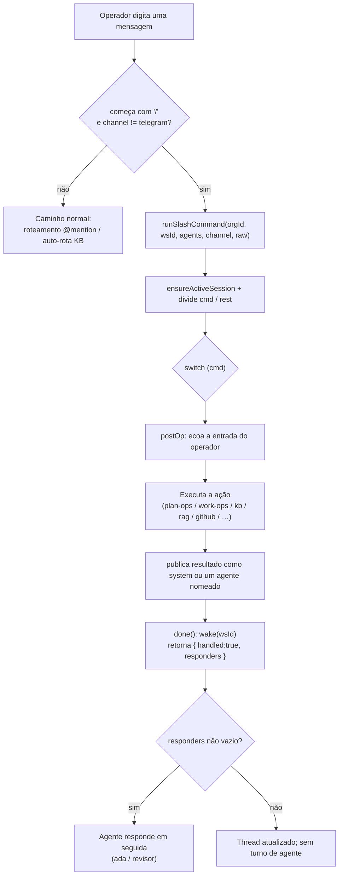

[← Índice](./README.md) · [🇬🇧 English](../en/CHAT_COMMANDS.md) · [✦ Constella](../../README.pt-BR.md)

# 🛰️ Comandos de Chat


> Os comandos de barra (slash) são o painel de controle da nave central. Digite um `/comando` na Team Room ou em qualquer DM e o servidor executa uma ação real do lado do servidor, depois publica o resultado de volta no mesmo thread — sem precisar de uma ida e volta com um agente.

---

## 2. Descrição curta

Os comandos de chat são reconhecidos a partir de uma `/` no início da mensagem no caminho de envio. Eles são interceptados **antes** do caminho conversacional normal (o token `[[CREATE_WORK]]` e o roteamento por `@mention`) e executados por `runSlashCommand` em `src/server/commands.ts`. Cada comando publica seu resultado diretamente no canal ativo; alguns também passam a vez para um agente que responde em seguida.

---

## 3. Quando usar

Use comandos de barra quando você quiser uma **ação determinística e imediata** em vez de uma conversa:

- Conduzir o ciclo de trabalho sem prosa: `/approve`, `/run-247`, `/pause`, `/reject`, `/cancel`, `/archive`.
- Consultar o estado da constelação rapidamente: `/status`, `/agents`, `/agent`, `/locks`, `/models`, `/skills`, `/telegram`.
- Acessar a nebulosa de memória: `/kb`, `/search`, `/graph`, `/reindex`, `/curate`.
- Disparar gates e pipelines: `/test-dev`, `/review`, `/github`, `/prepare-deploy`, `/export-source`.
- Semear novo trabalho ou itens do board: `/new-goal`, `/new-issue`, `/new-spec`, `/generate-plan`, `/assign`, `/close-sprint`.

Para pedidos livres ("construa uma página de cobrança"), basta falar com **@ada** na Team Room ou usar `/new-goal` — veja [DM.md](./DM.md) e [WORKFLOW.md](./WORKFLOW.md).

---

## 4. Como funciona 🌌

O caminho de envio vive em `src/server/chat.ts`. Depois de resolver a organização, o workspace e o roster de agentes, ele inspeciona o texto da mensagem (já com trim):

```ts
// src/server/chat.ts — slash commands (room + DM, not Telegram)
const trimmed = (text ?? "").trim();
if (trimmed.startsWith("/") && channel !== "telegram") {
  const { runSlashCommand } = await import("@/server/commands");
  const r = await runSlashCommand(org.id, workspace.id, agents, channel, trimmed);
  if (r.handled) { revalidatePath("/", "layout"); return { responders: r.responders }; }
}
```

Fatos-chave fundamentados no código:

- **Canais**: os comandos de barra são reconhecidos na **Team Room** (`room`) e em **DMs** (`dm:<handle>`). Eles **não** são reconhecidos no canal `telegram` — o Telegram tem seu próprio handler de comando de controle remoto (`handleCommand` em `src/server/telegram.ts`). Veja [TELEGRAM.md](./TELEGRAM.md).
- **Parsing**: `runSlashCommand` divide no primeiro espaço. O token antes do espaço vira `cmd` em minúsculas; tudo depois vira `rest` (o argumento), com trim.
- **Eco + resposta**: a maioria dos comandos primeiro ecoa sua entrada bruta com `postOp(...)` (como operador), depois publica um resultado com `post(...)`. O autor do resultado normalmente é `system`, mas vários comandos publicam **como um agente específico** (ex.: Vannevar, Edsger, Werner, Donald, Ada).
- **Responders**: `runSlashCommand` retorna `{ handled, responders }`. Um array `responders` não vazio significa que o(s) agente(s) nomeado(s) deve(m) responder em seguida — usado por `/new-goal`, `/review`.
- **Wake**: todo comando tratado chama `wake(wsId)` (via o helper interno `done()`) para acordar o worker/bus.
- **Sessões**: `ensureActiveSession(wsId, channel)` anexa o resultado à `chatSession` ativa do canal.

### Auto-roteamento da Room

Na Team Room, um texto puro que **não** é um `/comando` e **não** é uma `@mention` recebe automaticamente o prefixo `/kb` antes de ser enviado (veja `welcome-chat.tsx` e `home-command-bar.tsx`). Então digitar `como funciona o auth?` na room equivale a `/kb como funciona o auth?`. Em uma DM, o texto é enviado como está para aquele agente.

### Barra de comando da Home

A barra de comando da Welcome Home (`src/components/modules/home-command-bar.tsx`) reaproveita o mesmo dispatch e mostra um menu de autocomplete para um subconjunto selecionado: `/kb`, `/status`, `/new-goal`, `/agents`, `/reindex`, `/curate`, `/help`. O conjunto completo de comandos abaixo funciona em qualquer input de room/DM, independentemente do menu.

---

## 5. Fluxo principal



---

## 6. Conceitos-chave 🪐

| Conceito | Significado |
| --- | --- |
| `cmd` | O token em minúsculas antes do primeiro espaço (ex.: `/approve`). |
| `rest` | Texto com trim após o primeiro espaço — o argumento do comando. |
| `responders` | Handles de agentes que devem responder após o comando (handoff). |
| `postOp` | Insere sua entrada bruta como mensagem `fromKind: operator`. |
| `post` | Insere o resultado como `fromKind: agent` com um `fromHandle` (em geral `system`). |
| `kind` | Dica opcional de renderização: `kb-card`, `agent-card`, `cleared`. |
| `sources` | Referências de citação anexadas às respostas da KB. |
| `done()` | Helper interno: chama `wake(wsId)` e retorna `{ handled:true, responders }`. |

---

## 7. O catálogo de comandos (uma grande tabela) ✦

Todo comando reconhecido por `runSlashCommand`, agrupado por categoria. "Responde como" é o `fromHandle` da mensagem de resultado; "Passa a vez" é o agente no array `responders` retornado (responde em seguida).

### Ajuda & informação

| Comando (aliases) | Args | O que faz | Responde como | Passa a vez |
| --- | --- | --- | --- | --- |
| `/help` | — | Publica a lista completa de comandos. | `system` | — |
| `/status` | — | Conta goals ativos, issues abertas (col ≠ `done`) e tasks em andamento (col = `doing`). | `system` | — |
| `/agents` | — | Lista o roster: `@handle — nome (role, status)`. | `system` | — |
| `/agent <handle>` | `<handle>` (com ou sem `@`) | Inspeciona um agente: nome, role, status, health, runtime (adapter / model) + link para o Agent Studio. | o próprio handle do agente (card) | — |

### Conhecimento & nebulosa de memória 🌠

| Comando (aliases) | Args | O que faz | Responde como | Passa a vez |
| --- | --- | --- | --- | --- |
| `/kb` (`/ask-kb`) | `<pergunta>` | Pergunta à Knowledge Base via `kbAnswer`; responde com referências (`sources`). Respostas de visão geral renderizam como `kb-card`. Agenda um reindex do chat. | `vannevar` | — |
| `/search <q>` | `<consulta>` | Mesmo motor de `/kb` (`kbAnswer`) — um alias com sabor de busca e seu próprio aviso de argumento vazio. | `vannevar` | — |
| `/graph <key>` | chave de spec, chave de issue, ou substring do título do goal | Resolve a semente (spec → issue → goal) e mostra o conhecimento conectado via `relatedKnowledge`, agrupado por tipo. | `vannevar` | — |
| `/reindex` | — | Reconstrói o índice RAG/KB agora (`indexRag`); reporta a contagem de chunks e se foi semântico ou fallback de palavra-chave. | `vannevar` | — |
| `/curate` | — | Executa o passe de curadoria da KB do Vannevar (`runKbCuration`): dedup / aposentar / re-sumarizar / achar lacunas. Limitado por orçamento. Detalhes em `Reports/kb-health.md`. | `vannevar` | — |

### Ciclo de trabalho 🚀

| Comando (aliases) | Args | O que faz | Responde como | Passa a vez |
| --- | --- | --- | --- | --- |
| `/new-goal` (`/new-work`) | `<brief>` | Entrega o brief ao CEO via o pipeline normal de novo trabalho (reenvia como `@ada <brief>`). Agenda um reindex do chat. | (eco do operador) | `ada` |
| `/generate-plan` | `<brief>` (opcional) | Chama `generatePlanFor` — rascunha specs → issues → TODOs no CEO Planner para aprovação. | `ada` | — |
| `/approve` | — | Aprova o plano pendente (`approvePlanFor`) e enfileira tasks; reporta a contagem. | `system` | — |
| `/reject` | `<motivo>` (opcional) | Devolve o plano ao CEO (`requestPlanChangesFor`); registra o motivo se informado. | `system` | — |
| `/run-247` (`/resume`) | — | Liga a execução autônoma 24/7 (`setAuto247For(..., true)`). | `system` | — |
| `/pause` | — | Desliga a execução autônoma 24/7 (`setAuto247For(..., false)`). | `system` | — |
| `/cancel` | — | Cancela o goal **ativo** mais recente (`cancelGoalFor`); a execução para. | `system` | — |
| `/archive` | — | Arquiva o goal **ativo** mais recente (`archiveGoalFor`); reporta o caminho do arquivo. | `system` | — |
| `/close-sprint` | — | Fecha a sprint (`closeSprintFor`): conta entregue vs carregado, escreve um arquivo de retro. | `donald` | — |

### Itens do board

| Comando (aliases) | Args | O que faz | Responde como | Passa a vez |
| --- | --- | --- | --- | --- |
| `/new-issue <title>` | `<título>` | Cria uma única issue (`col: todo`, `prio: med`) com uma chave numérica auto-incrementada. | `system` | — |
| `/new-spec <title>` | `<título>` | Cria uma única spec com a chave `SPEC-NN` (com zero à esquerda). | `system` | — |
| `/assign <issue> <@agent>` | `<chave-da-issue> <@agente>` | Define `issue.assigneeId` para o agente nomeado. | `system` | — |

### Gates, pipelines & integrações 🛰️

| Comando (aliases) | Args | O que faz | Responde como | Passa a vez |
| --- | --- | --- | --- | --- |
| `/test-dev` | — | Executa o gate de validação Test Dev (`runTestDevAction`); reporta `PASS`/`FAIL`/`INCONCLUSIVE` + resumo. | `edsger` | — |
| `/review` | `<nota>` (opcional) | Escolhe um revisor (role CyberSec/QA, senão `whitfield`) e pede que ele revise as mudanças recentes do board. | (eco do operador) | o revisor (ex.: `whitfield`) |
| `/github` | — | Atualiza o status do repositório (`refreshGitStatus`); reporta a contagem de arquivos alterados. | `werner` | — |
| `/prepare-deploy` | — | Executa o pipeline Prepare-Deploy (`runDeployPipeline`); reporta status + resumo. | `werner` | — |
| `/export-source <repo>` | `<repo-do-github>` | Exporta a fonte limpa do produto para um repo separado (`exportCleanSource`); bloqueia se houver achados de segredos. | `werner` | — |
| `/telegram` | — | Reporta o status da integração com o Telegram (`getTelegramConfig`). | `system` | — |
| `/models` | — | Reporta o status dos modelos locais: llama.cpp (`llamaServerStatus`) + Ollama (`ollamaInfo`). | `system` | — |
| `/skills` | — | Reporta o tamanho da biblioteca de skills + uma amostra de nomes (`allLibrarySkillNames`). | `system` | — |
| `/locks` | — | Lista os file locks atualmente em uso (`activeLocks`): `path — @agente`. | `system` | — |

### Manutenção

| Comando (aliases) | Args | O que faz | Responde como | Passa a vez |
| --- | --- | --- | --- | --- |
| `/clear` | `confirm` \| `yes` \| `sim` | Apaga permanentemente TODA mensagem, o resumo compactado e os eventos de execução **deste canal**. Requer um token de confirmação; caso contrário publica um aviso. Board/goals/specs/KB NÃO são afetados. | `system` (kind `cleared`) | — |
| _desconhecido_ | — | Qualquer outro `/token` ecoa e responde `Unknown command — Try /help`. | `system` | — |

---

## 8. Aliases em um relance

| Canônico | Aliases |
| --- | --- |
| `/kb` | `/ask-kb` |
| `/new-goal` | `/new-work` |
| `/run-247` | `/resume` |

> Nota: `/cancel` e `/archive` compartilham um mesmo bloco `case`, mas são comandos **distintos** (efeitos diferentes), não aliases um do outro.

---

## 9. Passo a passo

### Aprovar um plano e iniciar o time

1. Na Team Room, digite `/approve`.
2. O servidor executa `approvePlanFor` e publica `✅ Plan approved — N task(s) queued.` como `system`.
3. Digite `/run-247` para ligar a execução autônoma 24/7.
4. Acompanhe o progresso com `/status` e `/locks`.

### Perguntar à nebulosa de memória

1. Digite `/kb como funciona o motor de cálculo?` (ou apenas a pergunta pura na room).
2. O Vannevar responde com `sources`; uma resposta de visão geral renderiza como `kb-card`.
3. Se o conhecimento parecer desatualizado, rode `/reindex`, depois `/curate`.

### Inspecionar uma constelação em trabalho

1. `/agents` para ver o roster.
2. `/agent margaret` para detalhes de runtime + um link para o Agent Studio.
3. `/locks` para ver quais arquivos os agentes estão segurando.

---

## 10. Exemplos

```text
/help
/status
/agents
/agent ada
/kb how does auth work?
/ask-kb where are sessions stored?
/search rate limiting
/graph SPEC-01
/reindex
/curate
/new-goal a billing page with payment-provider checkout
/new-work add 2FA to the login screen
/generate-plan migrate the database to Postgres
/approve
/reject the spec is missing the refund flow
/run-247
/resume
/pause
/cancel
/archive
/new-issue add a logout button
/new-spec billing architecture
/assign 3 @margaret
/test-dev
/review focus on the new payment endpoint
/github
/prepare-deploy
/export-source myorg/constella-public
/telegram
/models
/skills
/locks
/close-sprint
/clear
/clear confirm
```

> Os nomes de comandos, flags e argumentos de exemplo são mantidos em inglês porque são identificadores reais do código.

---

## 11. Estados possíveis 🕳️

| Situação | O que você vê |
| --- | --- |
| Argumento vazio em um comando que exige um | Uma dica de uso (ex.: `Ask a question, e.g. /kb …`). |
| `/agent <handle>` fora do roster | `No agent @handle on the roster. Use /agents …`. |
| `/cancel` / `/archive` sem goal ativo | `No active goal to cancel/archive.`. |
| `/assign` malformado | `Usage: /assign <issue-key> <@agent> …`. |
| `/assign` issue / agente desconhecido | `No issue #key …` / `No agent @handle …`. |
| `/graph` sem correspondência | `No goal / spec / issue matches …`. |
| `/graph` com correspondência mas sem conexões ainda | `No connected knowledge for … yet`. |
| `/reindex` com embed server fora | `… (keyword fallback — embed server down).`. |
| `/curate` nada a fazer / sem orçamento | `Nothing to curate right now …`. |
| `/export-source` bloqueado por segredos | `🛑 Export blocked — N secret finding(s).`. |
| `/clear` sem confirmar | Um aviso `⚠️`; nada apagado. |
| Comando desconhecido | `Unknown command — Try /help`. |

---

## 12. Integrações relacionadas

- **Plan / work ops** — `/approve`, `/reject`, `/run-247`, `/pause` chamam os cores compartilhados em `src/server/plan-ops.ts` e `src/server/work-ops.ts`, os mesmos usados pela [API Pública](./PUBLIC_API.md) e pelo [Telegram](./TELEGRAM.md).
- **Knowledge Base / RAG** — `/kb`, `/search`, `/graph`, `/reindex`, `/curate` direcionam para [KB_AGENT.md](./KB_AGENT.md), [KB_RAG.md](./KB_RAG.md) e [MEMORY_RAG.md](./MEMORY_RAG.md).
- **Pipelines** — `/test-dev` → [TEST_DEV.md](./TEST_DEV.md); `/prepare-deploy` + `/export-source` → [PREPARE_DEPLOY.md](./PREPARE_DEPLOY.md) e [DEPLOY.md](./DEPLOY.md); `/github` → [GITHUB.md](./GITHUB.md).
- **Modelos & skills** — `/models` → [MODELS.md](./MODELS.md); `/skills` → [SKILLS.md](./SKILLS.md).

---

## 13. Segurança 🔒

- Os comandos de barra rodam **do lado do servidor** sob a sessão do operador — o caminho de envio resolve org/workspace antes do dispatch.
- `/clear` é o único comando destrutivo sobre os dados da conversa e é **duplamente protegido** (requer `confirm`/`yes`/`sim`). Nunca toca no trabalho do board, goals, specs ou na KB.
- `/export-source` é **protegido por secret-scan** — recusa o push se houver achados (veja [SECURITY.md](./SECURITY.md)).
- O Telegram **não** compartilha este parser; seus comandos remotos passam por um handler separado com allowlist — veja [TELEGRAM.md](./TELEGRAM.md).
- O texto do resultado é truncado em 4000 caracteres na inserção (`text.slice(0, 4000)`).

---

## 14. Solução de problemas

| Sintoma | Causa provável / correção |
| --- | --- |
| `/comando` foi tratado como texto puro | Você digitou no canal **Telegram** (usa outro handler) ou com um espaço inicial. A barra precisa ser o primeiro caractere. |
| Texto puro na room "virou" uma consulta `/kb` | Esperado: a room auto-roteia texto que não é comando nem menção para `/kb`. Prefixe com `@handle` para falar com um agente. |
| `/reindex` diz "keyword fallback" | O embed server está fora — inicie-o (veja [MEMORY_RAG.md](./MEMORY_RAG.md)). A KB ainda funciona por busca de palavra-chave. |
| `/approve` / `/cancel` diz "No workspace/active goal" | Ainda não há plano pendente ou goal ativo — crie trabalho com `/new-goal` primeiro. |
| `/curate` não faz nada | Precisa de algumas entradas na KB **e** orçamento disponível. |
| Comando desconhecido | Confira a grafia e os aliases acima, ou rode `/help`. |

---

## 15. Links relacionados

- [DM.md](./DM.md) — mensagens diretas com um único agente
- [TEAM_ROOM.md](./TEAM_ROOM.md) — a room compartilhada e o roteamento por @mention
- [WORKFLOW.md](./WORKFLOW.md) — o ciclo Goal → Spec → Issue → Plan → Execution
- [GOALS_SPECS_ISSUES.md](./GOALS_SPECS_ISSUES.md) — itens do board criados por `/new-issue` / `/new-spec`
- [AGENTS.md](./AGENTS.md) — o roster por trás de `/agents` e `/agent`
- [KB_AGENT.md](./KB_AGENT.md) · [KB_RAG.md](./KB_RAG.md) · [MEMORY_RAG.md](./MEMORY_RAG.md) — a nebulosa de memória por trás de `/kb`, `/search`, `/graph`, `/reindex`, `/curate`
- [TEST_DEV.md](./TEST_DEV.md) · [PREPARE_DEPLOY.md](./PREPARE_DEPLOY.md) · [GITHUB.md](./GITHUB.md) — os gates por trás de `/test-dev`, `/prepare-deploy`, `/github`
- [TELEGRAM.md](./TELEGRAM.md) — o conjunto separado de comandos de controle remoto
- [PUBLIC_API.md](./PUBLIC_API.md) — as mesmas operações de plan/work via HTTP
