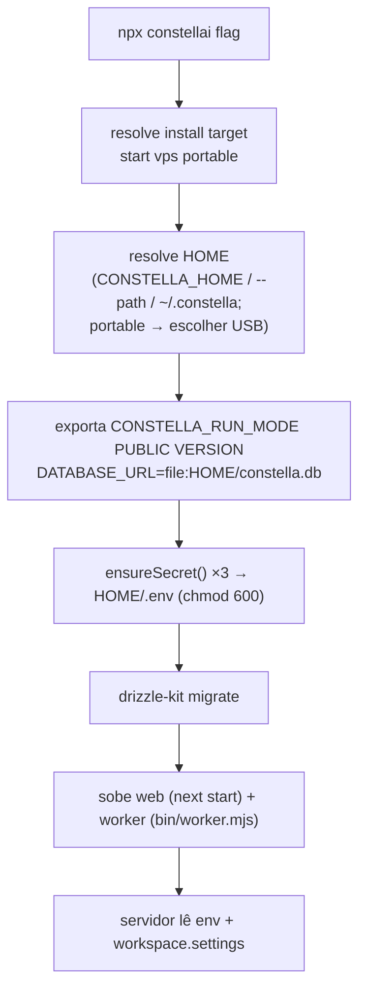
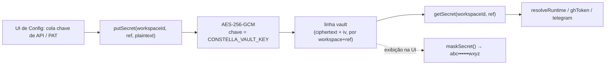

[← Índice](./README.md) · [🇬🇧 English](../en/CONFIGURATION.md) · [✦ Constella](../../README.pt-BR.md)

# Configuração ✦ 🪐


> Todos os controles que pilotam a nave central: variáveis de ambiente, o arquivo de segredos `<HOME>/.env`, o cofre criptografado para chaves de provedores, as portas dos modelos locais e o JSON `settings` que viaja na linha do workspace.

A Constella é configurada em três altitudes, cada uma com seu próprio poço gravitacional:

1. **Flags de inicialização** — escolhidas uma vez por `bin/constella.mjs` (destino de instalação, host, porta, raiz de runtime).
2. **Variáveis de ambiente** — lidas no boot pelo servidor e pelo worker; os segredos são persistidos em `<HOME>/.env`.
3. **Settings do workspace** — chaves de runtime guardadas como JSON na coluna `workspace.settings`, editáveis pela UI de Config sem reiniciar.

Nada aqui é fake: cada variável abaixo é lida por código real nos caminhos citados.

---

## 1. Quando usar 🛰️

| Você quer… | Use |
| --- | --- |
| Trocar o destino de instalação (local/vps/usb) | Uma flag de inicialização (`--start`, `--vps`, `--portable`) → `CONSTELLA_RUN_MODE` (um `constella` sem flag imprime o uso) |
| Mover a raiz de runtime para fora de `~/.constella` | `CONSTELLA_HOME` ou `--path <dir>` |
| Vincular a outro host/porta | `--host` / `--port` (ou `PORT`) |
| Guardar uma chave de API / PAT do GitHub | O **cofre** criptografado (UI), nunca uma variável de ambiente |
| Apontar para um servidor de modelo local | `LLAMACPP_URL`, `OLLAMA_URL`, `CONSTELLA_EMBED_URL` |
| Afrouxar/apertar permissões dos agentes | `CONSTELLA_AGENT_FULL_ACCESS`, ou `settings.agents.*` |
| Limitar execuções simultâneas de agentes | `CONSTELLA_MAX_CONCURRENT_AGENTS` ou `settings.agents.maxConcurrent` |

---

## 2. Como funciona 🌌

O launcher resolve a raiz de runtime e então garante que três segredos de assinatura existam antes do servidor subir:



**Fato chave (`bin/constella.mjs`):** todo modo persiste um `BETTER_AUTH_SECRET`, `CONSTELLA_VAULT_KEY` e `CONSTELLA_WORKER_SECRET` reais. O `next start` roda sob `NODE_ENV=production`, onde o better-auth lança erro com seu segredo padrão, o cofre se recusa a criptografar sem sua chave e o worker falha fechado sem seu segredo — então até o modo local `start` precisa dos três. Eles são persistidos (não efêmeros) para que sessões de login e o cofre criptografado sobrevivam a um restart.

---

## 3. Fluxo principal: persistência de segredos 🌠

De `bin/constella.mjs` (`ensureSecret`):

1. **env vence** — se a variável já está em `process.env`, usa e não escreve.
2. **reusa persistido** — senão, se houver um valor não-placeholder em `<HOME>/.env`, hidrata `process.env` a partir dele.
3. **gera uma vez** — senão, gera um valor novo, grava em `<HOME>/.env` e exporta.

```
BETTER_AUTH_SECRET      = randomBytes(32).toString("base64url")
CONSTELLA_VAULT_KEY     = randomBytes(32).toString("base64")    # deve decodificar para 32 bytes
CONSTELLA_WORKER_SECRET = randomBytes(24).toString("base64url")
```

O arquivo é escrito com modo `0o600` (e um `chmodSync` best-effort no Windows). O launcher imprime `• Secrets ready (stored in <HOME>/.env, never printed).` — os valores em si nunca são logados.

---

## 4. Conceitos centrais 🪐

- **Raiz de runtime (`<HOME>`)** — padrão `~/.constella`; sobrescrevível com `CONSTELLA_HOME` ou `--path`. Guarda `constella.db`, `.env`, `cache/`, `backups/` e `organizations/<orgId>/workspace/`. No modo portable sem caminho explícito, o launcher detecta drives USB removíveis e usa `<drive>/.constella`.
- **Raiz do pacote (`CONSTELLA_PKG_ROOT`)** — o diretório do próprio pacote instalado (o `.next` compilado, as migrações `drizzle/`, a biblioteca `skills/` embarcada). Exportada para o servidor achar os assets quando instalado globalmente em vez de a partir do CWD de inicialização.
- **Cofre (vault)** — chaves de API de provedores e PATs do GitHub são criptografadas em repouso com AES-256-GCM na tabela `vault`, usando `CONSTELLA_VAULT_KEY`. O texto plano **nunca** toca linhas `provider` e **nunca** chega ao cliente (`src/lib/vault.ts`).
- **Settings do workspace** — um blob JSON em `workspace.settings`; overrides de runtime para permissões de agentes, editor, integrações e metadados de importação.

---

## 5. A grande tabela de variáveis de ambiente 🌌

### 5.1 Núcleo de boot / definido pelo launcher

| Variável | Padrão | Definida por / Lida por | Significado |
| --- | --- | --- | --- |
| `CONSTELLA_HOME` | `~/.constella` | launcher / `src/lib/fs-workspace.ts`, `runtime-root.ts`, worker | Raiz de runtime com DB, `.env`, orgs. Valores relativos ancoram em `INIT_CWD`. |
| `CONSTELLA_RUN_MODE` | `start` | launcher / `src/lib/run-mode.ts`, `cli.ts`, `proxy.ts` | `start \| vps \| portable`. Dirige host de bind + jaula do agente. A autenticação (e-mail + senha) é exigida em todos eles. |
| `CONSTELLA_PUBLIC` | `1` (launch CLI) | launcher / `src/lib/build-mode.ts` | Um launch CLI é o runtime público → o seletor de destino na UI fica oculto. |
| `CONSTELLA_VERSION` | versão do `package.json` local | launcher / `src/lib/version.ts` | Versão instalada confiável para a checagem de Update no app. |
| `CONSTELLA_PKG_ROOT` | diretório do pacote | launcher / `skills-library.ts`, `cli.ts` | Onde vivem os assets embarcados (`skills/`, `.next`, `drizzle/`). |
| `DATABASE_URL` | `file:<HOME>/constella.db` | launcher / `src/db/index.ts`, `drizzle.config.mjs` | Arquivo SQLite (absoluto sob a raiz de runtime). |
| `PORT` | `3000` | env / launcher | Porta web se `--port` não for passado. |
| `CONSTELLA_FORCE_ONBOARDING` | não definido | `--onboarding` / `src/lib/workspace.ts`, `onboarding.ts` | Força o assistente de primeira execução. |
| `CONSTELLA_DEV` | não definido | árvore de dev / `build-mode.ts`, launcher | `1` permite fallback para dev-server quando não há build de produção (senão o launcher falha fechado). |
| `CONSTELLA_WEB_HEAP_MB` | `0` (padrão do Node) | env / launcher | `--max-old-space-size` opcional para o filho web (alívio de OOM de heap JS). |

### 5.2 Segredos (persistidos em `<HOME>/.env`, chmod 600)

| Variável | Gerada como | Lida por | Significado |
| --- | --- | --- | --- |
| `BETTER_AUTH_SECRET` | `randomBytes(32).base64url` | `src/lib/auth.ts`, `boot.ts` | Chave de assinatura de sessão. O better-auth lança erro com seu padrão em produção. |
| `CONSTELLA_VAULT_KEY` | `randomBytes(32).base64` | `src/lib/vault.ts` | Chave AES-256-GCM do cofre de segredos. Deve decodificar para exatamente 32 bytes. |
| `CONSTELLA_WORKER_SECRET` | `randomBytes(24).base64url` | worker + `/api/cron/tick`, `/api/sync/file`, `/api/telegram/poll`, `/api/locks/acquire` | Segredo compartilhado dos endpoints privilegiados do worker; eles rejeitam toda requisição quando ele não está setado. |

> Os segredos do cofre, auth e worker também estão listados em `src/lib/scrub.ts` para serem removidos da ingestão de KB, mensagens do Telegram e logs.

### 5.3 Worker

| Variável | Padrão | Lida por | Significado |
| --- | --- | --- | --- |
| `CONSTELLA_BASE_URL` | `http://localhost:3000` (launcher seta `http://127.0.0.1:<port>`) | `bin/worker.mjs`, `bin/lock-hook.mjs`, `cli.ts` | A URL do servidor local que o worker chama de volta. |
| `CONSTELLA_WORKER_INTERVAL_MS` | `60000` | `bin/worker.mjs` | Intervalo do tick de cron (POST `/api/cron/tick`). |
| `CONSTELLA_ALLOW_REMOTE_WORKER_BASE_URL` | não definido | `bin/worker.mjs` | Override do guard de SSRF: o worker recusa enviar seu segredo a um host não-loopback a menos que isto seja `1`. |

### 5.4 Execução de agentes (`src/server/adapters/cli.ts`, `runner.ts`)

| Variável | Padrão | Significado |
| --- | --- | --- |
| `CONSTELLA_AGENT_FULL_ACCESS` | derivado (`start`→full, senão jaulado) | `1`/`0` sobrescreve o modo de permissão. Full → `bypassPermissions` (claude) / `danger-full-access` (codex); jaulado → `acceptEdits` / `workspace-write`. |
| `CONSTELLA_WEB_RESEARCH` | ligado | `0` desliga o `--allowedTools WebSearch WebFetch` aditivo nas execuções de agente. Também `settings.agents.webResearch`. |
| `CONSTELLA_AGENT_CMD_GUARD` | desligado | Guard de shell destrutivo (`bin/guard-hook.mjs`) — **opt-in**: roda pelo isolamento de config-limpo que pode derrubar o login do CLI do agente, então vem desligado por padrão. `1` liga. Também `settings.agents.cmdGuard`. |
| `CONSTELLA_AGENT_LOCK_HOOK` | desligado | `1` habilita lock por arquivo via `bin/lock-hook.mjs` + um config dir de agente limpo. Também `settings.agents.fileLocks`. |
| `CONSTELLA_MAX_CONCURRENT_AGENTS` | `1` | Execuções simultâneas de agentes **por workspace** (`runner.ts`). Também `settings.agents.maxConcurrent`. |
| `CONSTELLA_AUTO_REVIEW` | ligado | `0` desliga o portão de review independente. Também `settings.agents.autoReview`. |

O filho do lock-hook recebe a env de identidade: `CONSTELLA_ORG_ID`, `CONSTELLA_TASK_ID`, `CONSTELLA_AGENT_ID`, `CONSTELLA_AGENT_HANDLE`, mais `CLAUDE_CONFIG_DIR` apontando para o config dir de agente limpo. As execuções de CLI de agentes têm timeout de **180000 ms** por padrão.

### 5.5 Modelos, RAG & KB

| Variável | Padrão | Lida por | Significado |
| --- | --- | --- | --- |
| `LLAMACPP_URL` | `http://127.0.0.1:8082` | `local-models.ts`, `runtime.ts`, `kb.ts` | Servidor llama.cpp local de **chat** (compatível com OpenAI `/v1`). |
| `CONSTELLA_EMBED_URL` | `http://127.0.0.1:8083` | `local-models.ts`, `rag.ts` | Servidor llama.cpp dedicado de **embeddings** para RAG (auto-iniciado no boot). |
| `OLLAMA_URL` | `http://127.0.0.1:11434` | `local-models.ts`, `runtime.ts`, `rag.ts` | Provedor de fallback de embeddings/chat (Ollama). |
| `CONSTELLA_EMBED_MODEL` | `nomic-embed-text` | `rag.ts`, `model-catalog.ts` | Nome do modelo de embedding; `nomic*` dispara os prefixos assimétricos `search_document:`/`search_query:`. |
| `CONSTELLA_KB_CURATION` | ligado | `kb.ts` | `0` opta por sair do passe de curadoria de KB do Vannevar (gatilho por orçamento). |

### 5.6 URLs do better-auth (dev `.env.example`)

| Variável | Exemplo | Significado |
| --- | --- | --- |
| `BETTER_AUTH_URL` | `http://localhost:3000` | URL base de auth no servidor. |
| `NEXT_PUBLIC_BETTER_AUTH_URL` | `http://localhost:3000` | URL base de auth no cliente. |

### 5.7 Clientes fora do processo (baseados em PAT)

| Variável | Padrão | Lida por | Significado |
| --- | --- | --- | --- |
| `CONSTELLA_PAT` | não definido | `scripts/mcp-server.mjs` | Personal Access Token `cn_…` para a ponte MCP / API Pública. |
| `CONSTELLA_ORG` | não definido | `scripts/mcp-server.mjs` | Id de org opcional (mapeia para o header `X-Constella-Org`). |

> `CONSTELLA_BASE_URL` também é lida pelo servidor MCP (padrão `http://localhost:3000`).

---

## 6. Portas 🛰️

| Porta | Processo | Configurável via |
| --- | --- | --- |
| `3000` | Servidor web (`next start`) + alvo de callback do worker | `--port` / `PORT`; `CONSTELLA_BASE_URL` para o worker |
| `8082` | Servidor llama.cpp local de **chat** (`LLAMACPP`) | `LLAMACPP_URL` |
| `8083` | Servidor llama.cpp local de **embeddings** (RAG) | `CONSTELLA_EMBED_URL` |
| `11434` | Ollama (embeddings/chat de fallback) | `OLLAMA_URL` |

O harness de Test Dev sobe servidores de dev do projeto em uma porta livre na faixa **4173–4999** (evitando 3000) — veja [TEST_DEV](./TEST_DEV.md).

---

## 7. O arquivo `<HOME>/.env` 🌠

Escrito e relido pelo launcher. Um arquivo gerado mínimo:

```dotenv
BETTER_AUTH_SECRET=…base64url…
CONSTELLA_VAULT_KEY=…base64 (32 bytes)…
CONSTELLA_WORKER_SECRET=…base64url…
```

O template da árvore de dev `.env.example` mostra a superfície completa usada ao rodar a partir do código-fonte:

```dotenv
DATABASE_URL=file:./.constella/constella.db
BETTER_AUTH_SECRET=replace-with-a-long-random-string
BETTER_AUTH_URL=http://localhost:3000
NEXT_PUBLIC_BETTER_AUTH_URL=http://localhost:3000
CONSTELLA_RUN_MODE=start
CONSTELLA_HOME=./.constella
CONSTELLA_VAULT_KEY=replace-with-32-byte-base64-key
CONSTELLA_WORKER_SECRET=replace-with-a-random-string
```

**Precedência:** `process.env` (shell / Docker / systemd) sempre vence sobre `<HOME>/.env`. O arquivo só fornece valores que ainda não estão no ambiente, e só gera os três segredos de assinatura se nenhuma das fontes os tiver.

---

## 8. O cofre: chaves de provedores & PATs 🕳️

Chaves de API de provedores e PATs do GitHub **nunca** são variáveis de ambiente e **nunca** são colunas em `provider`. Elas vivem criptografadas na tabela `vault`.



Detalhes do cofre (`src/lib/vault.ts`):

- `putSecret` é **valor único por `(workspaceId, ref)`**: deleta a linha antiga antes de inserir, então um token re-registrado nunca serve um valor obsoleto.
- Exemplos de `ref`: `openai_api_key`, `github_pat`, `telegram_bot_token`.
- `getSecret` retorna texto plano só no servidor; a UI vê apenas `maskSecret(s)` (`abc••••••wxyz`).
- `delSecret` sustenta o caminho de revogar token.
- A tabela `vault` guarda `ciphertext`, `iv`, `ref`, `providerId` opcional, com escopo por `workspaceId` (deletada em cascata com o workspace).

---

## 9. Settings do workspace (JSON em `workspace.settings`) 🪐

A coluna `settings` (`src/db/schema.ts`) é um blob JSON tipado. Editável pela UI de Config sem reiniciar; o runner empurra as flags de agente para o adapter de CLI antes de cada spawn.

| Caminho | Tipo | Efeito |
| --- | --- | --- |
| `editor.tabSize` / `formatOnSave` / `wordWrap` / `minimap` | number / bool | Preferências do editor de código no app. |
| `integrations` | `Record<string, boolean>` | Mapa de habilitação por integração. |
| `lastSecurityRun` | number | Timestamp da última varredura de segurança. |
| `telegram.offset` | number | Cursor do `getUpdates` do Telegram. |
| `github.repo` / `login` / `defaultBranch` | string | Metadados do repositório GitHub conectado. |
| `source.type` | `new \| github \| local \| mock` | Como o workspace foi importado. |
| `source.repo` / `branch` / `localPath` / `importedAt` / `fileCount` / `analyzed` | misto | Proveniência da importação. |
| `agents.maxConcurrent` | number | Concorrência de agentes por workspace (sobrescreve `CONSTELLA_MAX_CONCURRENT_AGENTS`). |
| `agents.fileLocks` | bool | Lock por arquivo (sobrescreve `CONSTELLA_AGENT_LOCK_HOOK`). |
| `agents.webResearch` | bool | Pesquisa web (sobrescreve `CONSTELLA_WEB_RESEARCH`). |
| `agents.autoReview` | bool | Portão de review independente (sobrescreve `CONSTELLA_AUTO_REVIEW`). |
| `agents.cmdGuard` | bool | Guard de shell destrutivo (sobrescreve `CONSTELLA_AGENT_CMD_GUARD`). |

**Precedência de override para as chaves de agente:** o valor por workspace `settings.agents.*` (quando setado) é empurrado em runtime e vence; se não setado, vale o padrão da env `CONSTELLA_*` correspondente. Outros padrões de modelo/runtime vivem na `workspace.stack` (JSON `Record<string,string>`) e nas linhas `agent`, `provider` e `organization.runMode`.

---

## 10. Passo a passo

1. **Primeiro boot** — rode `npx constellai` (ou uma flag de execução). O launcher cria `<HOME>/organizations`, gera `<HOME>/.env`, migra o DB e sobe web + worker.
2. **Escolha um destino de instalação** — passe `--start` / `--vps` / `--portable` (um `constella` sem flag imprime o uso). A flag seta `CONSTELLA_RUN_MODE`, que dirige o host de bind e a jaula do agente; a autenticação (e-mail + senha) é exigida em todos eles. Veja [START_MODE](./START_MODE.md), [VPS_MODE](./VPS_MODE.md), [PORTABLE_MODE](./PORTABLE_MODE.md).
3. **Mova a raiz de runtime** — `CONSTELLA_HOME=/data/constella npx constellai` ou `--path /mnt/usb`.
4. **Adicione uma chave de provedor** — na UI de Config, cole-a; ela é guardada no cofre, não escrita no `.env`.
5. **Ajuste os agentes** — alterne `settings.agents.*` na UI, ou defina os padrões da env `CONSTELLA_*`.
6. **Aponte para modelos locais** — suba seus servidores llama.cpp/Ollama e defina `LLAMACPP_URL` / `CONSTELLA_EMBED_URL` / `OLLAMA_URL` se não estiverem nos padrões.

---

## 11. Exemplos

**Porta customizada + folga de heap:**

```bash
npx constellai --start --port 4000
CONSTELLA_WEB_HEAP_MB=4096 npx constellai --vps
```

**Realocar a raiz de runtime e o DB:**

```bash
CONSTELLA_HOME=/srv/constella npx constellai --vps
# DATABASE_URL resolve para file:/srv/constella/constella.db
```

**Permitir mais agentes simultâneos e desligar o portão de review (env):**

```bash
CONSTELLA_MAX_CONCURRENT_AGENTS=2 CONSTELLA_AUTO_REVIEW=0 npx constellai
```

**Pilotar a Constella pela API Pública / MCP a partir de outro host:**

```bash
export CONSTELLA_PAT=cn_xxx
export CONSTELLA_BASE_URL=http://localhost:3000
export CONSTELLA_ORG=<orgId>
node scripts/mcp-server.mjs
```

---

## 12. Estados possíveis

| Condição | Comportamento resultante |
| --- | --- |
| `CONSTELLA_VAULT_KEY` ausente | `vault.key()` lança `CONSTELLA_VAULT_KEY is not set`; segredos não podem ser lidos/escritos. |
| `CONSTELLA_VAULT_KEY` não tem 32 bytes | Lança `CONSTELLA_VAULT_KEY must decode to 32 bytes`. |
| `CONSTELLA_WORKER_SECRET` não setado | Endpoints do worker rejeitam toda requisição (falha fechado). |
| `BETTER_AUTH_SECRET` padrão em produção | better-auth lança no boot — daí o launcher sempre gerar um. |
| Sem build de produção, `CONSTELLA_DEV` ≠ `1` | Launcher recusa subir dev server em modo público/de rede e sai. |
| Portable, `< 32 GB` livres | Fatal: launcher aborta abaixo de 32 GB; ≥ 32 GB dá boot. |
| Worker com `CONSTELLA_BASE_URL` não-loopback, sem override | Worker sai em vez de vazar seu segredo. |

---

## 13. Integrações relacionadas

- Chaves/modelos de provedores — [MODELS](./MODELS.md), [AI_ARCHITECTURE](./AI_ARCHITECTURE.md)
- PAT/OAuth do GitHub — [GITHUB](./GITHUB.md)
- Token do bot do Telegram — [TELEGRAM](./TELEGRAM.md)
- Clientes PAT/MCP — [PUBLIC_API](./PUBLIC_API.md), [MCP](./MCP.md)
- Embeddings de RAG — [KB_RAG](./KB_RAG.md), [MEMORY_RAG](./MEMORY_RAG.md)

---

## 14. Segurança 🕳️

- O arquivo de segredos `<HOME>/.env` é escrito com `chmod 600`; valores nunca são impressos.
- O cofre usa **AES-256-GCM** com `CONSTELLA_VAULT_KEY`; só ciphertext + IV, nunca texto plano ao cliente.
- `src/lib/scrub.ts` remove `CONSTELLA_VAULT_KEY`, `BETTER_AUTH_SECRET` e `CONSTELLA_WORKER_SECRET` antes da ingestão de KB, do Telegram e dos logs.
- O worker aplica um **guard de SSRF apenas-loopback** em `CONSTELLA_BASE_URL`.
- `process.env` sempre sobrescreve o arquivo `.env` — operadores controlam a configuração via shell/Docker/systemd, não via um arquivo gravável por atacante.
- As permissões dos agentes degradam com segurança: acesso total só com `--start` (sua própria máquina); `--vps`/`--portable` ficam jaulados (o host só-tailnet como fronteira dura). A autenticação (e-mail + senha) é exigida em todo destino. Veja [SECURITY](./SECURITY.md).

---

## 15. Solução de problemas

| Sintoma | Causa provável | Correção |
| --- | --- | --- |
| `CONSTELLA_VAULT_KEY is not set` | `.env` deletado ou chave apagada | Restaure `<HOME>/.env` ou deixe o launcher regerar (atenção: uma chave nova não decripta linhas antigas do cofre). |
| Worker loga `401` repetidamente | Telegram não configurado / segredo divergente | Configure o bot, confirme que `CONSTELLA_WORKER_SECRET` é compartilhado. |
| Worker recusa subir (não-loopback) | `CONSTELLA_BASE_URL` é remoto | Use loopback, ou defina `CONSTELLA_ALLOW_REMOTE_WORKER_BASE_URL=1` (prefira `https://`). |
| RAG cai para busca por palavra-chave | Servidor de embed fora do ar na `:8083` | Suba-o / defina `CONSTELLA_EMBED_URL`, ou dependa do Ollama em `:11434`. |
| App lê um DB diferente do que o worker observa | `CONSTELLA_HOME` relativo divergente | Use um `CONSTELLA_HOME` absoluto; caminhos relativos ancoram em `INIT_CWD`. |
| Agentes falam na voz do plugin do operador | Hooks do `~/.claude` do operador vazando | Já mitigado pela overlay de settings `disableAllHooks`; verifique o config dir de lock/guard. |

---

## Links relacionados

- [INSTALLATION](./INSTALLATION.md) · [ONBOARDING](./ONBOARDING.md) · [START_MODE](./START_MODE.md) · [VPS_MODE](./VPS_MODE.md) · [PORTABLE_MODE](./PORTABLE_MODE.md)
- [ARCHITECTURE](./ARCHITECTURE.md) · [AI_ARCHITECTURE](./AI_ARCHITECTURE.md) · [AGENTS](./AGENTS.md)
- [MODELS](./MODELS.md) · [KB_RAG](./KB_RAG.md) · [MEMORY_RAG](./MEMORY_RAG.md)
- [GITHUB](./GITHUB.md) · [TELEGRAM](./TELEGRAM.md) · [PUBLIC_API](./PUBLIC_API.md) · [MCP](./MCP.md)
- [TEST_DEV](./TEST_DEV.md) · [SECURITY](./SECURITY.md) · [TROUBLESHOOTING](./TROUBLESHOOTING.md) · [FAQ](./FAQ.md)
