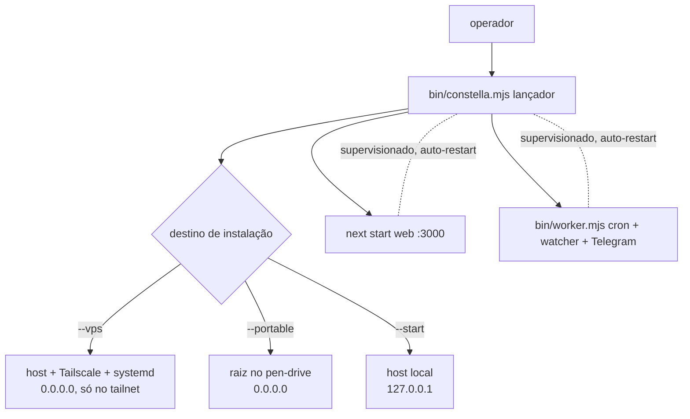
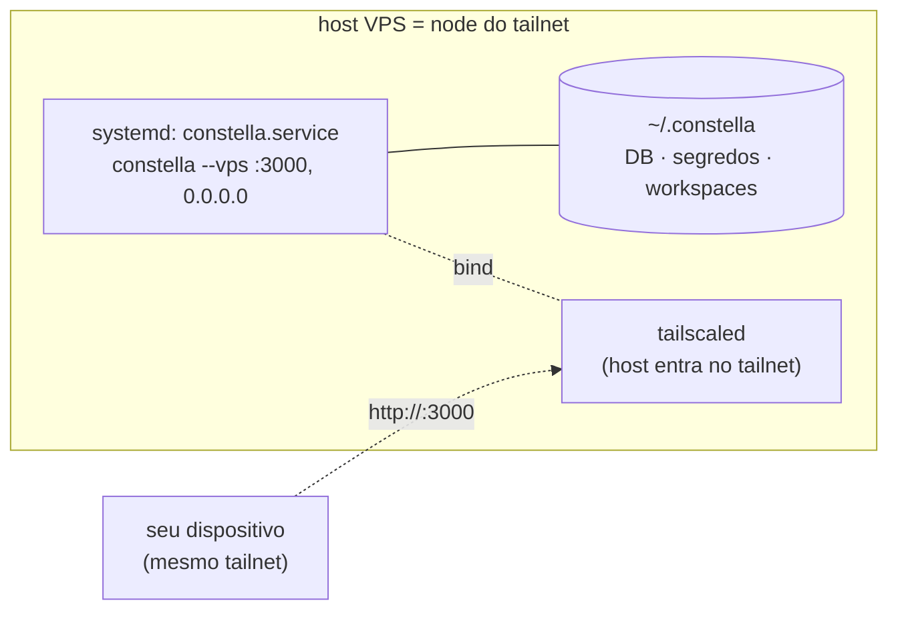

[← Índice](./README.md) · [🇬🇧 English](../en/DEPLOY.md) · [✦ Constella](../../README.pt-BR.md)

# Deploy (Produção) 🚀


Como **lançar a própria nave central** — colocar o plano de controle Constella em uma órbita durável, de produção. Esta página trata do deploy do *Constella enquanto plataforma*: uma instalação VPS nativa (npm + Tailscale + systemd), o bootstrap `vps-install.sh`, boot supervisionado de dois processos e instalações portátil/global. **Sem Docker em lugar nenhum** — o próprio host é o node do tailnet.

> **Não confundir com [PREPARE_DEPLOY](./PREPARE_DEPLOY.md) / [DEPLOY do seu projeto].** Aqueles fazem o deploy do **projeto do usuário** que os agentes constroem (exportação de árvore limpa para um repositório separado). *Esta* página faz o deploy do **próprio Constella** — a nave, não a carga.

---

## Quando usar 🌌

| Você quer… | Use |
| --- | --- |
| Rodar o Constella 24/7 em um servidor remoto, privado para o seu tailnet | **VPS (nativa)** — pacote npm + Tailscale + systemd no host |
| Provisionar uma VPS Linux nova em um comando | **instalação gerenciada** (`install.sh --vps` / `scripts/vps-install.sh`) |
| Um teste rápido e não-gerenciado na VPS | **`npx constellai --vps`** |
| Carregar todo o plano de controle em um pen-drive | **Portátil** (`constella --portable`) |
| Instalar uma vez na sua máquina sempre ligada | **npm global** (`npm i -g constellai`) |
| Uma execução efêmera rápida | **`npx constellai`** |

Se você só quer uma instância local no seu notebook, veja [START_MODE](./START_MODE.md). Para os detalhes do tailnet, veja [VPS_MODE](./VPS_MODE.md); para o pen-drive, [PORTABLE_MODE](./PORTABLE_MODE.md). A autenticação (e-mail + senha) é idêntica em todos os destinos.

---

## Como funciona 🪐

Toda inicialização do Constella — local, VPS, portátil — passa pelo mesmo lançador, **`bin/constella.mjs`**. O lançador:

1. Resolve o **destino de instalação** (`start | vps | portable`) a partir da flag de lançamento (um `constella` sem flag imprime o uso).
2. Resolve a **raiz de runtime** `HOME` (`CONSTELLA_HOME` / `--path`, padrão `~/.constella`).
3. Gera + persiste segredos em `<HOME>/.env` (`chmod 600`): `BETTER_AUTH_SECRET`, `CONSTELLA_VAULT_KEY`, `CONSTELLA_WORKER_SECRET`.
4. Fixa `DATABASE_URL=file:<HOME>/constella.db` e aplica as migrações Drizzle empacotadas (`drizzle-kit migrate`).
5. Inicia **dois processos supervisionados**: o servidor **web** (`next start`) e o **worker** (`bin/worker.mjs`).

Um deploy é "o mesmo lançador, em um lugar mais durável" — no host sob systemd, em um pen-drive ou sob uma instalação global. O destino define o host de bind; o destino do deploy define a durabilidade. **A autenticação é a mesma em todos — e-mail + senha.**



---

## Fluxo principal — VPS nativa (npm + Tailscale + systemd) 🛰️

O deploy recomendado para produção. O pacote npm publicado e o Tailscale são instalados **direto no host**; um serviço systemd mantém o Constella rodando. O **próprio host é o node do tailnet** — sem Docker, sem Dockerfile, sem compose, sem sidecar, sem rebuild de imagem, sem volume `/data`. O Constella faz bind em `0.0.0.0`; o Tailscale o mantém privado, alcançável **apenas** pelo seu tailnet — nunca pela internet aberta.

### Instalação gerenciada (recomendada)

Um comando instala o Node ≥ 20 + a CLI `constellai`, entra no Tailscale e registra um serviço systemd persistente ao boot:

```bash
curl -fsSL https://raw.githubusercontent.com/gabriel7silva/constella/main/scripts/install.sh | bash -s -- --vps
```

Ele:

1. Instala o **Node ≥ 20** e a CLI `constellai` (`npm i -g constellai`).
2. Instala o Tailscale e roda `tailscale up` — entra no seu tailnet (imprime uma URL de auth no navegador se necessário).
3. Registra um serviço systemd **`constella.service`** que roda `constella --vps --host 0.0.0.0 --port 3000`, com `Restart=always`, habilitado para **iniciar a cada boot**.

Script direto equivalente (a partir de um clone): `bash scripts/vps-install.sh`.

> **As CLIs dos agentes não vêm empacotadas.** Instale uma CLI no host com `npm i -g` (`claude` / `codex` / …) e deixe-a autenticar via chaves de env ou seu próprio login — persistido na home do usuário do host (sem volume necessário). Ou use **provedores de API na nuvem** configurados no módulo [MODELS](./MODELS.md). Veja [Segurança](#segurança-).

### Teste rápido e não-gerenciado

```bash
npx constellai --vps        # em um host Linux
```

Isso auto-instala + entra no Tailscale e serve em foreground — **sem systemd**. Bom para um teste rápido; use o caminho gerenciado para 24/7.

### Acesso

Privado no seu tailnet em `http://<ip-do-tailnet>:3000`, onde o IP vem de `tailscale ip -4`. Primeiro acesso → `/login` (o login é **obrigatório** no modo VPS). O servidor faz bind em `0.0.0.0`; o Tailscale o mantém privado.



### Gerenciar (systemd)

```bash
systemctl status constella       # está no ar?
systemctl restart constella      # reiniciar
systemctl stop constella         # parar
journalctl -u constella -f       # acompanhar os logs
```

Habilitado → inicia a cada boot.

---

## Passo a passo

### A) Deploy VPS (gerenciado)

```bash
# em um host Linux novo
curl -fsSL https://raw.githubusercontent.com/gabriel7silva/constella/main/scripts/install.sh | bash -s -- --vps
# → instala Node + constellai, entra no Tailscale, registra o constella.service (Restart=always, no boot)

# ou, a partir de um clone:
bash scripts/vps-install.sh

# depois alcance o Constella no IP de tailnet do host:
tailscale ip -4   # descubra o IP → http://<ip-do-tailnet>:3000
```

Para um teste rápido e não-gerenciado (foreground, sem systemd): `npx constellai --vps`.

No primeiro boot o lançador gera e persiste o `BETTER_AUTH_SECRET` (e os segredos de vault + worker) em `~/.constella/.env` (`chmod 600`). Como `~/.constella` fica na home do usuário do host, esses segredos — e as sessões de login e o vault criptografado — **sobrevivem a reinícios e atualizações**.

### B) Deploy portátil (USB)

```bash
npx constellai --portable                 # detecta e escolhe um pen-drive
npx constellai --portable --path /Volumes/MYUSB   # ou nomeie o drive
```

O lançador valida o drive **antes** de iniciar: ele **recusa < 32 GB livres** (fatal); `≥ 32 GB` dá boot. Faz bind em `0.0.0.0`. Toda a raiz de runtime fica em `<drive>/.constella`. Veja [PORTABLE_MODE](./PORTABLE_MODE.md).

### C) Instalação global (máquina própria sempre ligada)

```bash
npm i -g constellai
constella --start       # local, faz bind em 127.0.0.1; primeira execução → cadastro, depois login
# ou --vps em um servidor que você administra. A autenticação (e-mail + senha) é a mesma em todo destino.
```

### D) Efêmera

```bash
npx constellai           # modo padrão = start
```

---

## Boot supervisionado de dois processos 🌠

Um plano de controle 24/7 precisa sobreviver a uma falha transitória. O `bin/constella.mjs` inicia **dois filhos** e supervisiona cada um:

| Processo | Comando | Hospeda |
| --- | --- | --- |
| **web** | `next start -H <host> -p <port>` (a partir de `PKG_ROOT`) | o dashboard + todas as rotas de API |
| **worker** | `node bin/worker.mjs` | cron tick (~60s → `POST /api/cron/tick`), file-watcher chokidar (debounce 400ms → `/api/sync/file`), long-poll do Telegram |

Regras de supervisão (de `supervise()`):

- Em uma saída inesperada de um filho, **auto-restart após 2s** — não um shutdown completo.
- **Guarda anti-crash-loop:** no máximo **5 reinícios em 60s** por filho; além disso, desiste e desliga (para que uma falha real e repetida não seja mascarada para sempre).
- Web e worker são **independentes**: uma falha do web reinicia só o web; o worker re-tenta seu tick sozinho até o servidor responder.
- Aumento de heap opcional: `CONSTELLA_WEB_HEAP_MB` adiciona `--max-old-space-size` ao filho web (útil quando uma execução de agente causa OOM de heap JS).

> **Duas camadas de durabilidade se combinam.** O próprio supervisor do lançador reinicia um filho que falhou no próprio processo; o **serviço systemd** (`constella.service`, `Restart=always`, registrado pela instalação gerenciada) reinicia o lançador inteiro em um kill no nível do SO e o sobe no boot. O processo é um comando de longa duração em foreground normal e trata `SIGINT`/`SIGTERM` de forma limpa (mata ambos os filhos, depois sai), então o systemd o para/reinicia de forma limpa. O caminho não-gerenciado `npx constellai --vps` não tem systemd — apenas o supervisor no processo.

O worker carrega o header privilegiado `x-worker-secret`, então tem uma **guarda SSRF**: ele se recusa a falar com qualquer `CONSTELLA_BASE_URL` que não seja loopback, a menos que `CONSTELLA_ALLOW_REMOTE_WORKER_BASE_URL=1`. O lançador sempre o aponta para `http://127.0.0.1:<port>` (loopback mesmo em vps/portable), então isso é invisível em deploys normais.

---

## Destinos de instalação vs destinos de deploy

A **flag de lançamento** (de `src/lib/run-mode.ts`) define o host de bind e onde o plano de controle roda fisicamente; **a autenticação é obrigatória em todos** — e-mail + senha (primeira execução → cadastro, depois → login). Eles se combinam:

| Destino de instalação | Login | Host de bind | Destino de deploy típico | Permissão da CLI do agente |
| --- | --- | --- | --- | --- |
| `--start` (local) | e-mail + senha | `127.0.0.1` | máquina local / npx / instalação global | `bypassPermissions` (total) |
| `--vps` | e-mail + senha | `0.0.0.0` | **host + Tailscale + systemd** | `acceptEdits` (no jail) |
| `--portable` | e-mail + senha | `0.0.0.0` | **pen-drive USB** | `acceptEdits` (no jail) |

O destino é persistido em `organization.runMode`. Em um build publicado `CONSTELLA_PUBLIC=1`, então a **UI nunca escolhe o destino** — a flag de lançamento escolhe. Um `constella` sem flag imprime o uso.

---

## Conceitos-chave

- **`CONSTELLA_HOME` / raiz de runtime** — o diretório durável único. Numa VPS é `~/.constella` na home do usuário do host (sobrescreva com `CONSTELLA_HOME`); no USB é `<drive>/.constella`; caso contrário `~/.constella`. Guarda `constella.db`, `.env`, `organizations/<orgId>/workspace/`, `backups/`, `cache/`.
- **`PKG_ROOT`** — a raiz do *pacote instalado* (`.next` compilado, migrações `drizzle/`, configs). O lançador roda `next` e `drizzle-kit` a partir daqui, não do CWD de lançamento.
- **Persistência de segredos** — todo modo persiste segredos reais em `<HOME>/.env` (`mode 0600`). O `next start` roda sob `NODE_ENV=production`, onde o better-auth **lança erro com um segredo padrão**, então um `BETTER_AUTH_SECRET` real é obrigatório mesmo localmente.
- **Schema no primeiro boot** — `drizzle-kit migrate` é idempotente. Um **DB novo que falha na migração aborta** (sem tabelas = a app dá 500); um DB existente tolera uma reexecução no-op.
- **Build no primeiro boot (só fallback)** — o pacote publicado já traz um `.next` pré-construído, então o build é pulado. A partir de uma árvore de código sem build ele constrói uma vez; se o build falhar ele **se recusa a cair para `next dev`** em um modo público/de rede, a menos que `CONSTELLA_DEV=1`.

---

## Ambiente do lançador

O lançador exporta isto para ambos os filhos:

| Variável | Valor |
| --- | --- |
| `CONSTELLA_RUN_MODE` | `start \| vps \| portable` |
| `CONSTELLA_PUBLIC` | `1` (lançamento por CLI é o runtime público) |
| `CONSTELLA_VERSION` | a versão do pacote instalado |
| `CONSTELLA_HOME` | raiz de runtime resolvida |
| `DATABASE_URL` | `file:<HOME>/constella.db` |
| `CONSTELLA_PKG_ROOT` | a raiz do pacote instalado |
| `PORT` / `--port` | `3000` (padrão) |
| `--host` | `0.0.0.0` para vps/portable, senão `127.0.0.1` |

Persistidos em `<HOME>/.env` (`chmod 600`): `BETTER_AUTH_SECRET`, `CONSTELLA_VAULT_KEY`, `CONSTELLA_WORKER_SECRET`. O Tailscale roda no próprio host — entrou uma vez com `tailscale up` — então não há chave de entrada do lado da app para gerenciar.

Ajustes opt-in:

| Variável | Efeito |
| --- | --- |
| `CONSTELLA_WEB_HEAP_MB` | `--max-old-space-size` para o filho web (padrão: padrão do Node) |
| `CONSTELLA_DEV=1` | permite o fallback `next dev` quando não há build de produção |
| `CONSTELLA_ALLOW_REMOTE_WORKER_BASE_URL=1` | deixa o worker falar com uma base URL não-loopback (desligado por padrão) |
| `CONSTELLA_WORKER_INTERVAL_MS` | intervalo do cron tick (padrão `60000`) |

---

## Atualizando um deploy 🛰️

`detectRunContext()` (`src/lib/run-context.ts`) classifica o processo em execução para que o **método de atualização combine com o deploy**:

| Contexto | Detectado quando | Método de atualização |
| --- | --- | --- |
| `dev` | rodando do código (`isDevMode()`) | `git pull && pnpm install && pnpm build` |
| `vps` | `getRunMode() === "vps"` | `curl -fsSL .../scripts/vps-update.sh \| bash` |
| `portable` | `getRunMode() === "portable"` | garantir espaço livre, fazer backup do drive, então `npm install -g constellai@latest` |
| `npx` | o diretório de lançamento é o cache `_npx` do npm | reexecutar `npx constellai@latest` |
| `global` | nenhum dos acima | `npm install -g constellai@latest` (auto-executa, destacado) |

`startUpdate()` (`src/server/update-run.ts`) **sempre faz backup primeiro** — copia `.env`, `constella.db`, `constella.db-wal`, `constella.db-shm` para `<HOME>/backups/<timestamp>/`. Apenas o caminho `global` auto-executa (um processo destacado escreve `<HOME>/backups/last-update.json` que a UI consulta); `vps` / `portable` / `dev` / `npx` retornam o **comando exato** a rodar, porque executá-los de dentro do servidor web é específico do ambiente. Veja [UPDATE](./UPDATE.md).

```bash
# Instalação nativa (sem precisar de checkout do repo) — baixa o atualizador direto do GitHub:
curl -fsSL https://raw.githubusercontent.com/gabriel7silva/constella/main/scripts/vps-update.sh | bash
# fixar uma versão específica:
curl -fsSL https://raw.githubusercontent.com/gabriel7silva/constella/main/scripts/vps-update.sh | bash -s -- 0.2.30

# A partir de um checkout do repo:
bash scripts/vps-update.sh                 # → última versão no npm
bash scripts/vps-update.sh 0.2.30          # → uma versão específica

# Totalmente manual (sem script algum):
sudo npm install -g constellai@latest && sudo systemctl restart constella
```

> **Atualizar com ele rodando é tranquilo — sem parada manual.** O `npm install -g` troca o pacote em disco sem mexer no processo ativo; o `systemctl restart constella` então sobe a nova versão num piscar de ~2–3s. Seu `~/.constella` (DB, segredos, login, workspaces) é preservado, e as migrações idempotentes do drizzle rodam automaticamente no próximo boot. Faça rollback a qualquer momento fixando a versão antiga (ex.: `bash scripts/vps-update.sh 0.2.27`).

### Limpar / remover

```bash
curl -fsSL https://raw.githubusercontent.com/gabriel7silva/constella/main/scripts/vps-clean.sh | bash
# não-interativo: | bash -s -- --yes
```

Remove o serviço systemd + a CLI `constellai` + `~/.constella` + o cache do npx, mas **mantém o Tailscale** (para o SSH-sobre-tailnet sobreviver). Reinstale com `npx constellai --vps`.

---

## Estados possíveis

| Sinal | Significado |
| --- | --- |
| `• Secrets ready (stored in <HOME>/.env, never printed).` | geração/reuso de segredos no primeiro boot OK |
| `✖ Portable needs at least 32 GB free …` | drive portátil pequeno demais (fatal) |
| `• N GB free on the drive — good …` | drive portátil com espaço suficiente, dá boot |
| `✖ Database schema migration failed on a fresh database — aborting` | DB novo não conseguiu suas tabelas |
| `• schema migrate skipped/failed on an existing DB — continuing` | reexecução benigna em um DB já construído |
| `✖ No production build … Refusing to start a dev server in a public/network mode.` | sem `.next` e sem `CONSTELLA_DEV=1` |
| `• [web] exited (…) — auto-restarting in 2s (n/5 …)` | reinício supervisionado dentro da janela |
| `✖ [web] exited … crashed 5x within 60s — giving up.` | limite de crash-loop atingido; desligando |
| `✓ Constella is starting. Reach it on your tailnet at: http://<ip>:3000` | `vps-install.sh` terminou |

---

## Integrações relacionadas 🪐

- **Tailscale** — o plano de rede privada para o modo VPS, instalado **no host** (o host é o node do tailnet, alcançável no seu IP de tailnet). Veja [VPS_MODE](./VPS_MODE.md).
- **systemd** — o `constella.service` (`Restart=always`, habilitado no boot) é a política de restart no nível do SO + de boot numa VPS.
- **better-auth** — e-mail+senha (+ 2FA/passkeys) em todo destino de instalação; respaldado por `BETTER_AUTH_SECRET`. Veja [START_MODE](./START_MODE.md).
- **Vault** — chaves de provedores criptografadas com `CONSTELLA_VAULT_KEY`. Veja [SECURITY](./SECURITY.md).
- **Worker** — cron + watcher + Telegram, supervisionado junto ao web. Veja [TELEGRAM](./TELEGRAM.md), [ARCHITECTURE](./ARCHITECTURE.md).
- **Update** — auto-atualização ciente do contexto. Veja [UPDATE](./UPDATE.md).

---

## Segurança 🕳️

- **Exposição só no tailnet.** O Tailscale roda no host, então o dashboard é alcançável **apenas no IP de tailnet do host na :3000**, nunca na internet aberta — mesmo que o Constella faça bind em `0.0.0.0`. Bloqueie qualquer entrada pública com o próprio firewall do host.
- **Rode como usuário dedicado.** Rode o `constella.service` sob um usuário não-privilegiado do host (seu `~/.constella` guarda o DB, os segredos e os workspaces) para que um RCE no nível da app não possa agir como root.
- **Login obrigatório em todos.** `start`, `vps` e `portable` exigem login (better-auth e-mail+senha, 2FA TOTP / passkeys WebAuthn opcionais, sessão de 30 dias). A primeira execução sem conta é uma tela de cadastro real; não há caminho sem senha / com login automático.
- **Agentes em jail fora do local.** Em `--vps`/`--portable` a CLI do agente roda em `acceptEdits` (edições confinadas ao FS jail do workspace), não no `bypassPermissions` de uma instalação local `--start`.
- **CLIs dos agentes não empacotadas.** Para rodar agentes em uma VPS, instale uma CLI no host (`npm i -g claude` / `codex`) ou use provedores de API na nuvem em [MODELS](./MODELS.md). Sem nenhum dos dois, planejamento/Team-Room funcionam, mas a execução de agentes não tem runtime.
- **Segredos nunca impressos.** `<HOME>/.env` é `chmod 600`; o lançador só registra sua localização. O `scrubSecrets` remove segredos antes do ingest na KB / Telegram / logs.
- **Guarda SSRF do worker.** O worker se recusa a enviar seu segredo privilegiado para qualquer base URL não-loopback, a menos que explicitamente habilitado.

---

## Solução de problemas 🛰️

| Sintoma | Causa / correção |
| --- | --- |
| Não alcança `http://<ip>:3000` de outro dispositivo | o dispositivo não está no mesmo tailnet; rode `tailscale up` nele, confirme com `tailscale status`; verifique o host com `tailscale ip -4` |
| O host não entra no tailnet | rode `sudo tailscale up` no host e complete a auth no navegador; confirme com `tailscale status` |
| Serviço não inicia / reinicia em loop | `systemctl status constella` + `journalctl -u constella -f`; verifique a RAM do host — uma execução de agente causando OOM no nível do SO mata o filho web; aumente `CONSTELLA_WEB_HEAP_MB` para OOM de heap JS, ou limite os agentes concorrentes |
| `✖ drizzle-kit not found …` | a instalação está incompleta; reinstale o pacote (`npm install -g constellai@latest`) |
| DB novo aborta na migração | migrações `drizzle/` empacotadas ausentes ou `~/.constella` sem permissão de escrita; confirme que a raiz de runtime é do dono do usuário do serviço |
| Agentes não executam na VPS | sem CLI de agente no host e sem provedor na nuvem configurado — `npm i -g claude`/`codex` ou configure [MODELS](./MODELS.md) |
| Sessões/vault perdidos após atualização | `~/.constella` foi apagado ou seu usuário mudou; mantenha a raiz de runtime (e seu `.env`) nas atualizações |
| Portátil se recusa a dar boot | drive com menos de 32 GB livres — use um drive maior (`--path`) |
| Update não fez nada em uma VPS | por design: rode `bash scripts/vps-update.sh [versão]` você mesmo (a UI retorna o comando) |

---

## Links relacionados

- [VPS_MODE](./VPS_MODE.md) — o modo de execução por tailnet em detalhe
- [PORTABLE_MODE](./PORTABLE_MODE.md) — deploy por pen-drive USB
- [START_MODE](./START_MODE.md) — o destino de instalação local
- [INSTALLATION](./INSTALLATION.md) — primeira instalação
- [CONFIGURATION](./CONFIGURATION.md) — variáveis de ambiente + raiz de runtime
- [UPDATE](./UPDATE.md) — auto-atualização ciente do contexto
- [PREPARE_DEPLOY](./PREPARE_DEPLOY.md) — deploy do **projeto do usuário** (exportação de árvore limpa), não do Constella
- [ARCHITECTURE](./ARCHITECTURE.md) — web + worker, motor de sync
- [SECURITY](./SECURITY.md) — FS jail, vault, scrubbing
- [MODELS](./MODELS.md) — provedores na nuvem/locais para agentes em um servidor
- [TROUBLESHOOTING](./TROUBLESHOOTING.md) · [FAQ](./FAQ.md)
