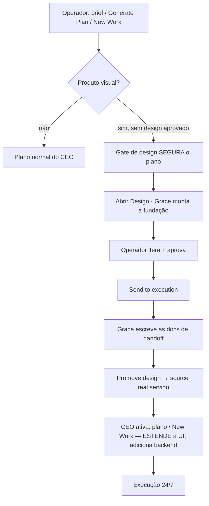

[← Índice](./README.md) · [🇬🇧 English](../en/DESIGN.md) · [✦ Constella](../../README.pt-BR.md)


# 🎨 Módulo Design — o espaço de prototipagem visual da Grace

> O módulo Design é a **porta visual do pipeline de build**. A Grace (a agente de Frontend) prototipa a UI do produto
> num canvas ao vivo; o operador itera, aprova e clica em **Send to execution**; o design aprovado então **vira o
> frontend real do projeto** e o CEO Planner constrói o backend em cima dele. Nada que o operador vê é um mock
> descartável — **o que está no Design É o projeto.**

---

## Propósito 🌌

Um produto frontend deve ser **prototipado e aprovado antes de qualquer plano** — menos retrabalho, zero drift. O módulo
Design torna isso o padrão:

- A **Grace** desenha telas reais, específicas da stack (nunca um visual genérico de "IA"), fundamentada no brief, na
  missão, nos mocks anexados e numa biblioteca de design-skills com 200+ playbooks.
- O operador **edita o canvas diretamente** (mover, redimensionar, restilizar, adicionar elementos) e **aprova** um
  design final.
- Ao aprovar, o design é **promovido para o source real servido** e entregue à **Ada** (o CEO Planner), que planeja o
  backend, dados e integrações **em cima da UI aprovada**.

`A Ada orquestra · a Grace prototipa, valida e documenta o design · a Ada vira execução real.`

---

## O canvas 🛰️

A Grace escreve telas HTML self-contained em `design-mock/screens/*.html`. Elas renderizam **ao vivo num iframe sandbox**
(`sandbox="allow-scripts"`, origem opaca isolada — sem acesso ao app, cookies ou filesystem). Um script de
instrumentação injetado no iframe conversa com o host via `postMessage` (o contrato canvas ↔ host) para o operador
inspecionar e editar sem a página tocar em nada real.

| Modo | O que faz |
|------|-----------|
| **Selecionar** | Clique para selecionar um elemento |
| **Editar** | Clique para selecionar · **duplo-clique para editar texto** (só texto) |
| **Markup** | Arraste uma região para marcá-la para revisão |
| **Comentários** | Solte comentários no canvas |
| **Inspect** | Leia o tipo, estilos e hierarquia de um elemento |
| **Preview** | Protótipo interativo — sem overlays de edição |

> **O design é uma REFERÊNCIA que deve permanecer fiel ao mock aprovado**, então o canvas **não tem add / mover /
> redimensionar / manipulação estrutural** — o modo Editar é **só texto** (corrige copy sem mudar layout ou
> identidade). O design system ainda é ajustável ao vivo pela aba **Styles** (paleta, tipografia, tokens, tema). Pra
> mudar qualquer coisa estrutural, peça pra Grace no chat — ela edita o source pra continuar um design único e fiel.

**Destaques do editor:** **zoom estilo navegador** do protótipo inteiro; **Salvar / Resetar / Histórico** por tela
(desfazer/refazer); toggle de **tema** ao vivo; e **breakpoints** — Desktop / Tablet (768) / Mobile / largura custom,
que **re-organizam** a tela (reflow real, as regras `@media` valem), não só escalam.

### Live app (qualquer stack)

Um toggle **Design / Live** na toolbar troca o canvas da HTML da Grace pelo **dev-server real** do projeto — então um
app React / Vue / Svelte / Next / static renderiza **de verdade** (é o app real). Ele sobe o dev-server sob demanda e
reusa a mesma sonda de frameable do [Test Dev](TEST_DEV.md). No modo Live, editar é via **"Ask Grace"**: você descreve a
mudança, ela edita o source real, e o dev-server dá **hot-reload** no frame.

**Inspect (clicar-pra-mirar, qualquer stack)** 🧪 — um toggle **Inspect** roteia o iframe Live por um **proxy de
injeção** leve que carimba um script de captura-de-clique no HTML do app real (agnóstico de framework, com
WebSocket/HMR repassados). Clique em qualquer elemento → o contexto dele (tag, texto, um seletor CSS, a rota)
pré-preenche **"Ask Grace to change THIS element"**, então ela edita aquele elemento exato no source real e o HMR
repinta. Com Inspect desligado o frame aponta pro dev-server cru e o app se comporta como ele mesmo. É o write-back
robusto e any-stack (**Abordagem B**); o carimbo preciso de *file:line* em build-time (**Abordagem A**, por-framework)
é o próximo passo. (Experimental — HMR atrás do proxy pode ser sensível por framework; o clicar-pra-mirar funciona
de qualquer forma, recarregue se não repintar sozinho.)

---

## Design system & CSS multi-arquivo 🌠

Cada tela é **token-driven** — o painel **Styles** edita design tokens ao vivo (paleta, cores secundária/surface/
semânticas, fontes de corpo e título, peso/altura-de-linha/espaçamento, raio/borda/sombra, espaçamento, motion) e o
canvas re-estiliza na hora.

A Grace escreve **CSS modular**, não um bloco gigante:

```
design-mock/styles/global.css            # tokens (:root), reset, tema ([data-theme])
design-mock/styles/components/<nome>.css # componentes reutilizáveis
design-mock/styles/animations.css        # keyframes / motion
```

As telas dão `<link>` no que precisam. Como o canvas sandbox só renderiza CSS **inline**, o host **bundla** (inlina) os
arquivos linkados na renderização, e o build de produção (`design-mock/dist/`) bundla + minifica + ofusca. Você mantém
fonte limpa, legível e modular; o canvas e a exportação funcionam.

### Aba Docs

O painel **Docs** renderiza a documentação que a Grace escreve em markdown: `design-system.md`, `components.md`,
`handoff.md`, `decisions.md` e `APPROVED.md`.

---

## RAG & seleção de skills 🌌

A Grace não lê uma lista chapada de skills. Ela **extrai palavras-chave** do brief, missão, objetivo, mock anexado e da
sua mensagem, **expande** por um léxico de domínio + estilo (hotel → reserva / hospitalidade / quartos; "native mobile" →
glassmorphism / microinterações / tipografia premium) e **rankeia as skills seedadas** por nome / tags / descrição — e
lê as mais relevantes primeiro. Ciente de domínio e estilo, não genérica.

---

## O fluxo: Design → Grace → Ada → Execução ✦

Todo pedido visual passa pela Grace antes de virar trabalho real.



### O gate de design

Quando um plano é pedido para um **produto visual** (stack de frontend explícito, stack de styling, OU um brief/missão
que lê visual — web/app/página/UI/tela…) e ainda **não há design aprovado**, o CEO Planner **segura** o plano, mostra a
recomendação forte **"Design pendente"** com **Abrir Design** e notifica (in-app + Telegram). O gate também dispara para
**New Work / novas features visuais** mesmo já existindo design. Um **"Gerar plano mesmo assim"** one-shot ignora.

### Cenários de onboarding

| Cenário | O que a Grace faz |
|---------|-------------------|
| **1 · Greenfield** (só brief) | Monta a fundação inicial (tokens/`global.css` + telas-esqueleto + `design-system.md`) do brief |
| **2 · Mock anexado** | **Importa + reconstrói** o `mock/` anexado 1:1 em telas editáveis (o mock é a fonte da verdade) |
| **3 · Projeto existente** | Depois da análise da Ada, **extrai o frontend real** do projeto pro canvas |

### Send to execution → promoção

No **Send to execution**, a Grace escreve a **documentação completa de handoff**, depois o design é **promovido** pro
source servido do projeto — e o **CEO é ativado automaticamente**:

- **Stack nativa / static** → as telas são copiadas **1:1** para `public/` e o servidor estático é ligado pra servi-las.
  **O app rodando É o design aprovado (100% fiel).** Os engenheiros então **estendem** (ligam backend/dados/estados por
  cima), nunca reconstroem a UI.
- **Stack de framework** (React/Vue/Next…) → o design é staged e o planner adiciona uma issue de **"port"** (portar as
  telas em componentes 1:1, depois estender).

Re-aprovar um design atualizado vira uma issue de **"aplicar atualização do design"** — nunca sobrescreve o código de
backend que os engenheiros fiaram nas telas promovidas.

**A fidelidade é enforçada, não só pedida.** O gate do [Test Dev](TEST_DEV.md) captura um **baseline** de cada tela
aprovada e faz **pixel-diff** do app rodando contra ele (no navegador, 1280×800). Drift pequeno (dado real mexendo no
layout) vira uma nota; uma tela estruturalmente errada (>50% diferente) **falha o gate** e fica segura em review.

---

## Controle pelo Telegram 🤖

O loop inteiro funciona pelo celular. A Constella envia eventos de design (mock importado · protótipo/aprovação pendente
· docs prontas · handoff recebido), e o bot do [Telegram](TELEGRAM.md) traduz o canvas em **texto** (telas, seções,
campos de formulário, botões, responsivo) para você revisar sem ver. Os botões: **Aprovar / Recusar / Pedir mudanças** —
onde **Aprovar dispara o Send-to-execution sozinho** (a Grace escreve as docs → promove → ativa o CEO).

---

## Resiliência 🪐

O loop sobrevive a limites de provedor, quedas de rede e reinícios:

- **Runs de agente re-tentam falhas transientes** (429 / quota / overloaded / 5xx / rede) com backoff de
  **1 → 5 → 15 minutos**, mostrado ao vivo no stream. Cancelamentos e timeouts de processo **não** são re-tentados.
- **O handoff é idempotente + retomável** — uma queda no meio é **re-disparada no boot** e mostra um pulse
  **"Retomar handoff"** no módulo.
- **Falha-duro** — o CEO só é ativado quando a Grace de fato escreveu as docs (nunca um plano meio-feito).

---

## Segurança 🔒

O iframe do canvas é **`sandbox="allow-scripts"` sem `allow-same-origin`** — uma origem opaca que não lê o app, seus
cookies ou o workspace. A única ponte é `postMessage`. Imagens enviadas são inlinadas como **data URLs** (sem fetch
cross-origin). A promoção escreve só dentro do jail do workspace. Veja [Segurança](SECURITY.md).

---

## Estados

| Estado | Significado |
|--------|-------------|
| **Building** | A Grace está prototipando; o operador edita + aprova |
| **Design pendente** | O CEO Planner está segurando um plano até o design ser aprovado |
| **Aprovado** | `design-mock/APPROVED.md` escrito — a referência visual oficial |
| **Handoff** | A Grace está escrevendo as docs + promovendo; o CEO vai ativar |
| **Retomar handoff** | Um handoff foi interrompido — toque para tentar de novo |

---

## Troubleshooting

| Sintoma | Causa / correção |
|---------|------------------|
| O gate não segurou no Generate Plan | Não foi detectado como produto visual (brief puramente backend), ou um Skip one-shot foi consumido — abra o Design manual, ou inclua uma palavra visual no brief |
| Canvas em branco num projeto de framework | O canvas do Design renderiza **HTML** só; um app React/Vue precisa de port (o planner adiciona a issue). Troque pro modo **Live** pra ver o app real rodando em qualquer stack |
| Upload de imagem não faz nada | Selecione um elemento primeiro; o picker fica sempre montado, independente do estado do chat |
| O handoff parece travado | Ele falha-duro sem docs e é retomável — use **Retomar handoff**, ou ele re-dispara no próximo boot |

---

## Relacionados

[Agentes](AGENTS.md) · [Workflow](WORKFLOW.md) · [Onboarding](ONBOARDING.md) · [Telegram](TELEGRAM.md) ·
[Test Dev](TEST_DEV.md) · [Skills](SKILLS.md) · [Segurança](SECURITY.md) · [Changelog](../../CHANGELOG.pt-BR.md)
