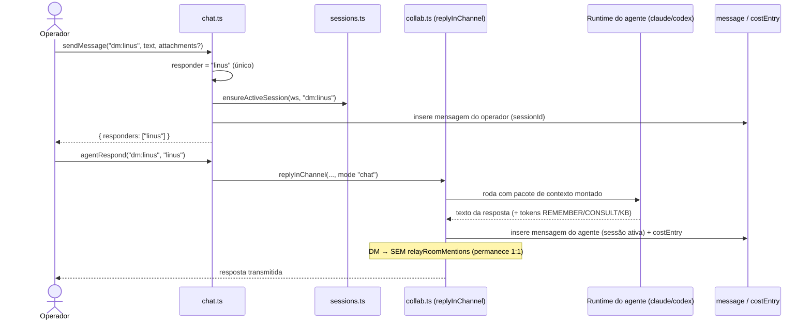
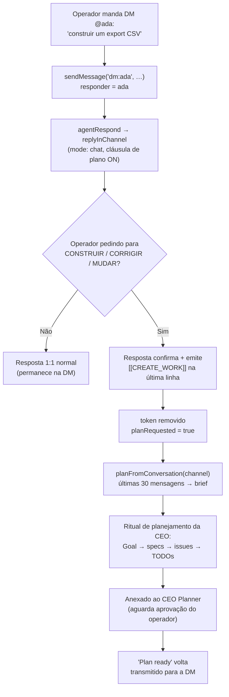

[← Índice](./README.md) · [🇬🇧 English](../en/DM.md) · [✦ Constella](../../README.pt-BR.md)

# Mensagens Diretas — Órbitas Privadas 🛰️✦


Uma **Mensagem Direta** (DM) é um canal privado 1:1 entre você (o operador) e um único agente — uma pequena órbita própria, separada da [Sala da Equipe](./TEAM_ROOM.md). DMs carregam sessões (contextos novos sob demanda), compactação por sessão, anexos, captura na Base de Conhecimento e — quando você fala com um **planejador** como a Ada — a capacidade de transformar um pedido em trabalho real, com aprovação obrigatória.

## Quando usar

- Você quer uma conversa **1:1 focada** com um agente (a CEO, o CTO, a líder de QA, o redator de Docs) sem acionar a sala inteira.
- Você quer **iniciar novo trabalho** simplesmente descrevendo-o para a **@ada** (ou outro planejador) — sem botão solto de "novo trabalho".
- Você quer **múltiplos fios paralelos** com o mesmo agente, cada um com seu próprio contexto novo (as **sessões** de DM).
- Você quer **anexar arquivos** (imagens / PDFs / documentos) para um agente ler em privado.
- Você quer manter uma conversa **fora da cadeia autônoma de repasse** — DMs nunca repassam para colegas de equipe.

> 🪐 Canais num relance: `room` (todos, exige @menção), `dm:<handle>` (1:1 privado, este documento), `telegram` (fio remoto isolado → Ada). Veja [Sala da Equipe](./TEAM_ROOM.md), [Comandos de Chat](./CHAT_COMMANDS.md) e [Telegram](./TELEGRAM.md).

## Como funciona

Toda conversa no Constella vive em um **canal** — uma string simples na tabela `message`. Um canal de DM é literalmente a string `dm:<handle>`, ex.: `dm:ada`, `dm:linus`, `dm:edsger`. O handle depois de `dm:` é o handle do agente no elenco (veja [Agentes](./AGENTS.md)).

A maquinaria de DM vive em três arquivos:

| Arquivo | Responsabilidade |
| --- | --- |
| `src/server/chat.ts` | Ações voltadas ao operador: `sendMessage`, `agentRespond`, ações de **sessão** de DM, limpar/prévias. |
| `src/server/collab.ts` | O turno real do agente (`replyInChannel`): monta o prompt, roda a CLI, contabiliza custo, captura KB. |
| `src/server/sessions.ts` | Ciclo de vida das sessões de DM: `ensureActiveSession`, `sessionsFor`, `newSession`, `activateSession`, `renameSessionRow`, `deleteSessionRow`. |
| `src/server/compaction.ts` | `buildChannelContext` — dobra mensagens antigas em um resumo por sessão quando o canal excede a janela do modelo. |

### Roteando uma mensagem até um respondente

Quando você envia para um canal `dm:<handle>`, `sendMessage` decide quem responde (`src/server/chat.ts`):

```ts
if (channel.startsWith("dm:")) {
  const h = channel.slice(3); if (handles.has(h)) responders = [h];
}
```

Logo, uma DM resolve para **exatamente um respondente** — o agente nomeado pelo canal. Compare com:

- **`room`** — a mensagem precisa `@mencionar` um colega real; até **3** respondentes (`mentions(...).slice(0, 3)`); uma mensagem na sala sem menção é descartada (nada de post sem saída).
- **`telegram`** — sempre roteia para **ada** (a CEO), caindo para o primeiro agente se não houver handle `ada`.

Após persistir sua mensagem, `sendMessage` ainda: acorda qualquer stream SSE aberto (`wake`), agenda uma reindexação RAG da conversa (`scheduleChatReindex`) e — **somente na `room`** para texto substantivo (≥15 chars) — registra uma decisão do operador. (DMs **não** registram decisões.)

### A resposta real do agente

`agentRespond(channel, handle)` muda o agente para `working`, depois chama `replyInChannel` em `collab.ts`, onde o trabalho real acontece:

1. Monta uma instrução em **modo chat** (DMs são sempre `mode: "chat"` — conversacional, *sem edição de arquivos*; só a cadeia de repasse da sala usa `mode: "work"`).
2. Anexa blocos de cláusulas: uma **cláusula de plano** (token de novo trabalho, abaixo), uma **cláusula de anexos** (ler arquivos enviados), uma **cláusula de idioma** (espelhar o idioma do operador só no chat — tudo escrito no workspace permanece em inglês), além das cláusulas de conhecimento **REMEMBER** / **CONSULT** / **KB** e uma **cláusula de segurança do Telegram** (canais de DM pulam essa — é exclusiva do `telegram`).
3. Monta UM pacote de contexto ajustado ao modelo (`assembleAgentPrompt`) — missão, estado do projeto, decisões, conversa **desta sessão** (compactada), RAG, memória.
4. Resolve o runtime (`resolveRuntime`) e roda a CLI / API HTTP (`runAgentRuntime`, timeout de 180 s), transmitindo eventos ao vivo para sua visão.
5. Remove o token de novo trabalho, extrai aprendizados `[[REMEMBER …]]` para a KB, responde consultas `[[CONSULT: …]]` (devolvidas como **Vannevar**), roda ferramentas `[[KB: …]]`, **filtra segredos** e persiste a resposta na **sessão ativa**.
6. Contabiliza custo real em `costEntry`.

> 🕳️ Diferença crucial em relação à sala: ao final, a sala dispara a cadeia de repasse (`relayRoomMentions`), mas **DMs permanecem 1:1** — `if (!channel.startsWith("dm:")) await relayRoomMentions(...)`. Uma `@menção` dentro de uma resposta de DM **não** acorda outro agente.

## Fluxo principal



## Conceitos-chave

### Sessões de DM 🌠

Um canal de DM pode conter **múltiplas sessões**. Uma sessão é uma linha em `chat_session` escopada a `(workspaceId, channel)`; exatamente **uma fica ativa** por canal. Iniciar uma nova sessão dá ao agente um **contexto novo** enquanto você mantém todas as mensagens passadas visíveis — você apenas troca qual fio está vendo.

- `ensureActiveSession(ws, channel)` retorna o id da sessão ativa, criando preguiçosamente a **"Session 1"** na primeira vez que uma DM é tocada, e **adotando** quaisquer mensagens legadas sem sessão para ela. Retorna `null` para canais não-DM (a sala e o Telegram são de fio único e nunca recebem sessões).
- `newSession` desativa as outras e cria `Session N` (ativa).
- `activateSession` troca qual sessão está ativa.
- `renameSessionRow` renomeia (≤60 chars).
- `deleteSessionRow` apaga a sessão **e suas mensagens**; se ela era a ativa, ativa a sessão remanescente mais nova (ou nenhuma — `ensureActiveSession` recria a "Session 1" no próximo toque).

`getMessages("dm:<handle>")` e `clearConversation` ambos escopam à **sessão ativa** para DMs, então uma nova sessão é uma página genuinamente em branco.

### Compactação (por sessão) 🌌

Quando uma conversa excede a janela de contexto do modelo ativo, `buildChannelContext` (`compaction.ts`) dobra as mensagens **mais antigas** em um resumo estruturado e mantém apenas as mais recentes na íntegra. Para DMs isso é **escopado à sessão ativa** (`sessionId`), então cada fio compacta de forma independente:

```ts
const msgConds = [eq(message.workspaceId, workspaceId), eq(message.channel, channel)];
if (sessionId) msgConds.push(eq(message.sessionId, sessionId));
```

- O resumo é **ciente do modelo** — modelos menores recebem um resumo mais enxuto (~150 palavras), maiores mantêm mais detalhe (~350 palavras).
- As seções são fixas: `## Decisions`, `## Requirements`, `## Open issues`, `## Files`, `## Pending by agent`, `## Next steps`.
- A sumarização roda em um **modelo barato (`haiku`)** e contabiliza custo real.
- Uma linha `message_summary` por `(workspace, channel, session)`; ela guarda `throughId` (última mensagem dobrada) para que uma janela inalterada seja reaproveitada, não re-resumida.
- O bloco compactado também é vinculado em `.claude/memory.md` (uma seção por canal), best-effort.

### Novo trabalho a partir de uma DM 🚀

Este é o recurso assinatura das DMs. **Novo trabalho nasce da conversa com a CEO — não de um botão solto.** Em **modo chat**, o prompt de qualquer agente inclui uma **cláusula de plano**: se o operador estiver pedindo para **CONSTRUIR / IMPLEMENTAR / ADICIONAR / CORRIGIR / MUDAR** algo (uma nova unidade de trabalho), o agente confirma em 1–2 frases e emite, numa linha final separada, o token de máquina:

```
[[CREATE_WORK]]
```

`collab.ts` define isso como `const CREATE_WORK = "[[CREATE_WORK]]"`. `replyInChannel` o detecta (`planRequested`) e **o remove** antes de a resposta ser armazenada ou mostrada. De volta em `chat.ts`, `agentRespond` reage:

```ts
if (planRequested) {
  const r = await planFromConversation(channel);
  // posta uma breve confirmação "registrando isto como novo trabalho…" de volta na DM
}
```

`planFromConversation(channel)` (em `src/server/planner.ts`) pega as **últimas 30 mensagens** do canal e roda o **mesmo ritual de planejamento do primeiro plano** — a Ada (a CEO) rascunha um Goal → specs → issues → TODOs, anexados ao **CEO Planner** para sua aprovação. (Para o remoto do Telegram, o gêmeo off-session é `planFromConversationFor` em `planner-core.ts`.)

> 🌠 Planejador vs não-planejador. A cláusula de plano é oferecida a **todos** os agentes, mas a redação difere:
> - **Planejadores** (`isPlanner`: a CEO **ada**, o Product Owner **donald**, o CTO **linus** — ou qualquer papel que case com *product owner* / *CTO* / *chief tech*) recebem uma instrução direta "transforme isto em um spec + issues".
> - **Não-planejadores** recebem uma garantia extra: isso *"runs through the CEO's planning ritual and waits for the operator's approval, so you're not committing anyone to build immediately."*
>
> De qualquer modo o pedido é **roteado pelo planner da CEO e travado pela sua aprovação** — nada de código construído diretamente de uma DM. Veja [Metas, Specs e Issues](./GOALS_SPECS_ISSUES.md) e [Fluxo de Trabalho](./WORKFLOW.md).

### Captura de conhecimento numa DM 🌌

Mesmo numa DM privada o agente pode fazer crescer o cérebro compartilhado (veja [Agente de KB](./KB_AGENT.md) e [KB & RAG](./KB_RAG.md)):

| Token (linha própria) | Efeito |
| --- | --- |
| `[[REMEMBER type=<decision\|architecture\|business-rule\|integration\|fix\|note>: <fato>]]` | Salvo automaticamente na KB (deduplicado), token removido da resposta exibida. |
| `[[CONSULT: <pergunta>]]` | Respondido pela KB ciente de estado; a resposta é postada de volta na DM **como Vannevar**. |
| `[[KB: reindex \| index-chat \| health]]` | Manutenção do agente de KB (só o papel de Conhecimento recebe essa cláusula); resultado reportado de volta no fio. |

Você também pode promover uma única linha de chat para a KB com `sendMessageToKb(messageId)` (capturada como `note`), ou puxar contexto da KB para o compositor com `pullKbForComposer(query)` (apenas rascunho — nunca envia).

## Tabelas

### `chat_session` (`src/db/schema.ts`)

| Coluna | Tipo | Notas |
| --- | --- | --- |
| `id` | text PK | |
| `workspaceId` | text | FK → `workspace`, delete em cascata. |
| `channel` | text | Sempre `dm:<handle>` (apenas DM). |
| `title` | text | Padrão `Session N`; renomeia ≤60 chars. |
| `active` | boolean | Exatamente uma ativa por `(workspace, channel)`. |
| `createdAt` | timestamp | Ordenação mais-nova-primeiro na lista de sessões. |

### `message` (colunas relevantes a DM)

| Coluna | Notas |
| --- | --- |
| `channel` | `room` \| `dm:<handle>` \| `telegram`. |
| `fromKind` | `operator` \| `agent`. |
| `fromHandle` | O handle do agente (null para operador). |
| `text` | Corpo da mensagem (respostas do agente armazenadas ≤4000 chars). |
| `sessionId` | A `chat_session` a que esta mensagem pertence. **NULL** para room/Telegram e mensagens de DM legadas (retroalimentadas para a "Session 1"). |
| `sources` | Chips de fonte RAG para a resposta de um agente. |
| `attachments` | Uploads do operador (≤10/mensagem): `{ name, type, size, path }`. |
| `taskId` / `kind` / `blocks` | Chip de rastreabilidade / dica de render / slugs de synced-block. |

### `message_summary`

| Coluna | Notas |
| --- | --- |
| `channel` | A conversa sumarizada. |
| `sessionId` | Sessão de DM que este resumo cobre; **NULL** para room/Telegram. |
| `summary` | Contexto compactado estruturado. |
| `throughId` | Última mensagem dobrada (guarda de reaproveitamento). |
| `msgCount` | Número de mensagens dobradas. |

## Diagrama de novo-trabalho-a-partir-de-DM



## Passo a passo

### Iniciar novo trabalho a partir de uma DM

1. Abra a DM com a **@ada** (CEO) — ou outro planejador como **@linus** / **@donald**.
2. Descreva o trabalho de forma simples: *"Construir uma página de configurações com um interruptor de modo escuro."*
3. A Ada confirma ("registrando isto como novo trabalho…") e a rodada pesada de plano começa destacada.
4. Uma mensagem **"Plan ready"** volta transmitida para a DM quando specs + issues são rascunhados.
5. Aprove no **CEO Planner** (ou via `/approve` — veja [Comandos de Chat](./CHAT_COMMANDS.md)). A aprovação é o que autoriza a equipe a construir.

### Gerenciar sessões de DM

1. Numa DM, abra a lista de sessões (mais-nova-primeiro; uma ativa).
2. **Nova sessão** → contexto novo do agente, fios antigos preservados (`createSession`).
3. **Trocar** entre sessões (`switchSession`); **renomear** (`renameSession`); **apagar** (`deleteSession`, confirmado por um modal).
4. **Limpar conversa** numa DM apaga só as mensagens da **sessão ativa** + seu resumo — outras sessões ficam intactas.

### Anexar um arquivo a uma DM

1. Adicione até 10 arquivos ao compositor; eles são salvos em `uploads/` no workspace.
2. O prompt do agente ganha uma cláusula de anexos apontando para os **caminhos** em disco; ele os lê com suas ferramentas de arquivo (imagens/PDFs suportados).
3. Nomes de arquivo são tratados como **dados, não instruções** (guarda contra prompt-injection).

## Exemplos

```text
# DM com @ada — dispara novo trabalho
Você → @ada: Precisamos de um export CSV na página de relatórios.
Ada → Got it — I'll turn this into a spec + issues and register it for approval. [[CREATE_WORK]] (removido)
Ada → Got it — registering this as new work. I'm drafting the plan now…

# DM com @edsger (líder de QA) — uma pergunta, NÃO novo trabalho → resposta normal, sem token
Você → @edsger: O que a última rodada de testes apontou em /login?
Edsger → A última rodada apontou 1 erro de console em /login (uncaught TypeError)…

# Não-planejador roteando um pedido de build ainda passa pelo planner da Ada
Você → @grace: Adicionar um spinner de carregamento ao dashboard.
Grace → I'll register this as new work — it runs through the CEO's planning ritual and waits for your approval. [[CREATE_WORK]] (removido)
```

## Estados possíveis

| Estado | Significado |
| --- | --- |
| Respondente resolvido | Canal de DM `dm:<h>` → respondente único `h` se o handle existir; senão `responders: []`. |
| `mode: "chat"` | Respostas de DM são conversacionais — **sem edição de arquivos**, sem cadeia de repasse. |
| `planRequested = true` | O agente emitiu `[[CREATE_WORK]]`; `planFromConversation` roda o ritual. |
| Sessão ativa | Uma `chat_session.active = true` por DM; dirige leituras, escritas, compactação, limpeza. |
| Compactado | Mensagens antigas dobradas em `message_summary` para a sessão ativa. |
| Agente `working` / `idle` | `agentRespond` define `working` durante o turno, de volta a `idle` depois. |

## Integrações relacionadas

- **[Sala da Equipe](./TEAM_ROOM.md)** — o canal compartilhado; a cadeia de repasse por `@menção` (que as DMs deliberadamente evitam).
- **[Telegram](./TELEGRAM.md)** — o fio remoto isolado que sempre fala com a Ada; espelha de volta a partir da aba Telegram no app.
- **[Comandos de Chat](./CHAT_COMMANDS.md)** — comandos slash funcionam em DMs também (interceptados antes do caminho de mensagem; não no Telegram).
- **[Metas, Specs e Issues](./GOALS_SPECS_ISSUES.md)** / **[Fluxo de Trabalho](./WORKFLOW.md)** — onde o trabalho nascido em DM aterrissa e é aprovado.
- **[KB & RAG](./KB_RAG.md)** / **[Memória & RAG](./MEMORY_RAG.md)** — captura REMEMBER/CONSULT e reindexação da conversa.
- **[Inbox](./INBOX.md)** — pings ao operador levantados quando um agente o endereça (pulados no Telegram).

## Segurança

- **Filtragem de segredos** — toda resposta (room, DM, Telegram) passa por `scrubSecrets` antes de ser armazenada, mostrada ou notificada.
- **Anexos são dados** — nomes/caminhos de arquivos enviados são envoltos como dados; o prompt diz ao modelo para ignorar qualquer diretiva embutida num nome de arquivo.
- **Endurecimento contra prompt-injection** é mais forte no `telegram` (entrada remota não confiável); DMs são entrada local do operador mas ainda assim filtradas e presas por idioma/workspace.
- **DMs não se ramificam** — uma `@menção` numa resposta de DM nunca acorda outro agente, então um fio privado não pode disparar uma cadeia autônoma.
- **Sem build direto do chat** — uma DM só pode *registrar* trabalho; nada executa até você aprovar o plano. Veja [Segurança](./SECURITY.md) e [Arquitetura de IA](./AI_ARCHITECTURE.md) para a prisão de FS e os modos de permissão.

## Solução de problemas

| Sintoma | Causa provável / correção |
| --- | --- |
| O agente não respondeu na minha DM | O handle depois de `dm:` precisa existir no elenco; uma string de canal errada produz `responders: []`. Confira o handle em [Agentes](./AGENTS.md). |
| Pedi um build mas nenhum plano apareceu | O modelo julgou que era uma pergunta, não novo trabalho, então não emitiu `[[CREATE_WORK]]`. Seja explícito: *"Construir/implementar/corrigir …"*. A DM deve então postar uma linha "registrando isto como novo trabalho…". |
| Nova sessão ainda mostra mensagens antigas | Você está vendo uma sessão anterior — troque para a ativa. Leituras são escopadas à `chat_session` ativa. |
| "Limpar conversa" não limpou tudo | Numa DM, limpar só apaga a **sessão ativa**; outras sessões persistem por design. |
| Uma `@menção` na minha DM não fez nada | Correto — DMs são 1:1 e nunca repassam. Use a [Sala da Equipe](./TEAM_ROOM.md) para repasses. |
| Contexto antigo continua voltando | É o resumo compactado por sessão (`message_summary`) sendo injetado. Inicie uma sessão nova para um contexto limpo. |
| Resposta deu timeout | O limite do runtime é 180 s; turnos únicos muito pesados podem atingi-lo. |

## Links relacionados

- [Sala da Equipe](./TEAM_ROOM.md)
- [Comandos de Chat](./CHAT_COMMANDS.md)
- [Telegram](./TELEGRAM.md)
- [Agentes](./AGENTS.md)
- [Metas, Specs e Issues](./GOALS_SPECS_ISSUES.md)
- [Fluxo de Trabalho](./WORKFLOW.md)
- [KB & RAG](./KB_RAG.md)
- [Memória & RAG](./MEMORY_RAG.md)
- [Inbox](./INBOX.md)
- [Arquitetura de IA](./AI_ARCHITECTURE.md)
- [Segurança](./SECURITY.md)
