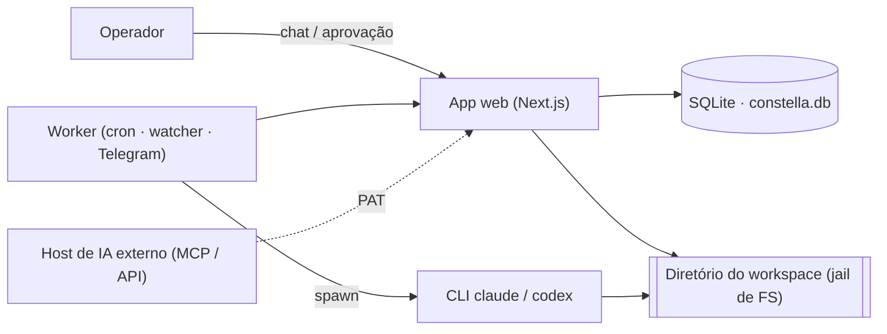
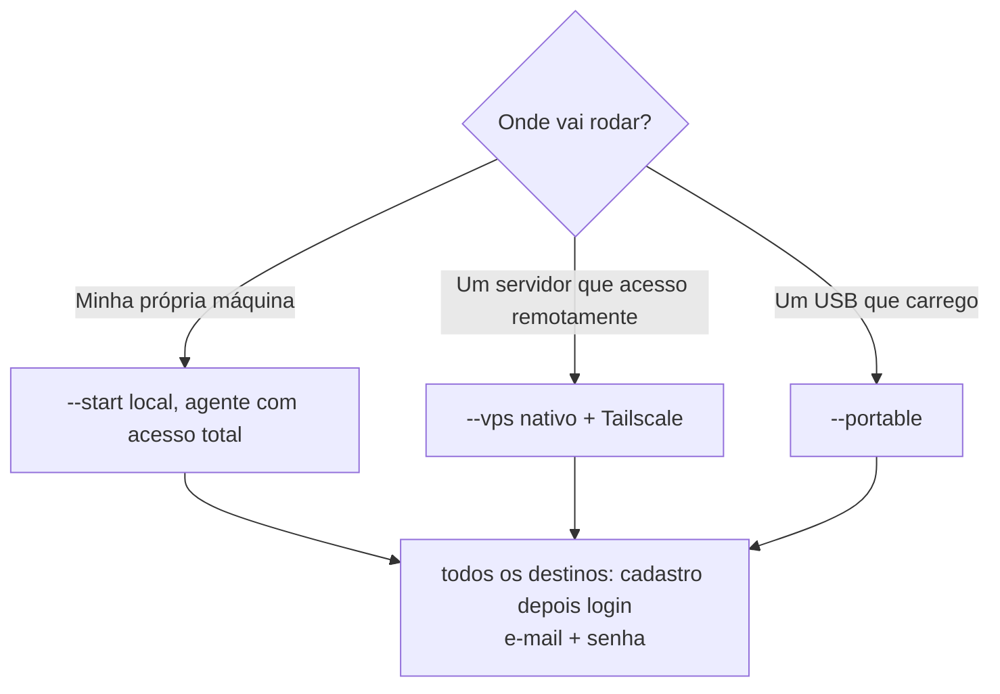

[← Índice](./README.md) · [🇬🇧 English](../en/FAQ.md) · [✦ Constella](../../README.pt-BR.md)

# FAQ — Sinais da Nave de Controle ✦🌌


Respostas honestas para as perguntas que as pessoas realmente fazem antes (e depois) de lançar sua primeira empresa de agentes. Tudo aqui é fundamentado no código real — sem marketing, sem promessas vazias.

---

## Quando usar esta página

- Você está avaliando o Constella e quer saber o que é **real** vs. aspiracional.
- Você bateu numa decisão (onde instalar/executar? modelos locais ou na nuvem? como limito gastos?) e quer a resposta curta e fundamentada.
- Você quer um índice rápido para a documentação mais profunda — cada resposta aponta para a página canônica.

---

## Como funciona (o modelo em 30 segundos) 🛰️

O Constella é uma **plataforma de controle local-first**. Ela roda uma pequena nave de serviços na sua máquina — um app web Next.js mais um worker em segundo plano — e a partir daí faz spawn de **agentes CLI reais** (`claude`, `codex` e outros) como subprocessos que leem, escrevem e entregam código dentro de um diretório de workspace isolado. O diretório em disco é a fonte da verdade; o banco SQLite é um índice sobre ele.



---

## 1. Isso é real? 🌠

**Sim.** Os agentes não são mocks roteirizados. `src/server/adapters/cli.ts` faz spawn das CLIs `claude` (Claude Code) e `codex` instaladas localmente como subprocessos reais com `spawn(...)`, alimenta o prompt via stdin e extrai uso de tokens e custo **reais** da saída JSON delas:

- `runClaude()` roda `claude -p --output-format json …` e lê `is_error`, `result`, `usage` e `total_cost_usd` direto da CLI.
- Quando uma CLI não emite uso (ex.: modos headless de Hermes, Aider, Cursor) o custo é registrado como `0` — **zero honesto**, nunca um número inventado (`base()` e os comentários de cada runner deixam isso explícito).
- O diretório de trabalho (`cwd`) do agente é o workspace real da organização, então as edições caem em arquivos reais; a Team Room renderiza **diffs reais** extraídos das chamadas de ferramenta `Edit`/`Write` da CLI (`mapTool` no mesmo arquivo).

Não há chaves de API mantidas pelo Constella no caminho Claude/Codex — ele dirige seu **login/assinatura de CLI existente**.

→ [AI_ARCHITECTURE](./AI_ARCHITECTURE.md) · [AGENTS](./AGENTS.md) · [ARCHITECTURE](./ARCHITECTURE.md)

---

## 2. Modelos locais ou na nuvem? 🪐

Ambos, dependendo da tarefa:

| Camada | Backend | Onde definido |
| --- | --- | --- |
| **Agentes de raciocínio / código** | CLIs na nuvem por padrão (`claude`, `codex`, mais Aider/OpenCode/Copilot/Cursor/Cline/Kilo) roteados pelos próprios logins | `src/server/adapters/cli.ts`, `CLI_MODELS` |
| **Modelos de chat locais** | Servidor de chat `llama.cpp` em `LLAMACPP_URL` (padrão `http://127.0.0.1:8082`), GGUF do catálogo `lmstudio-community` | `src/server/local-models.ts`, `src/data/model-catalog.ts` |
| **Embeddings de RAG** | Servidor de embeddings `llama.cpp` dedicado `CONSTELLA_EMBED_URL` (padrão `http://127.0.0.1:8083`), iniciado automaticamente no boot; com fallback para Ollama (`OLLAMA_URL`, `nomic-embed-text`) | `src/server/rag.ts` |

O catálogo de modelos é puxado de `models.dev` (`https://models.dev/api.json`, cacheado por 24h em `~/.constella/cache/models-dev.json`) com uma tabela offline `FALLBACK_MODELS` embutida. Antes de baixar um GGUF local, `detectHardware()` sonda CPU/RAM/GPU/VRAM e recomenda uma quantização (`Q5_K_M`/`Q4_K_M`/`Q4_0`) e uma contagem máxima de parâmetros que realmente caiba.

Então: **nuvem para o raciocínio pesado, local para embeddings/RAG (e chat local opcional).** Se nenhum backend de embedding estiver de pé, o RAG degrada para uma heurística por palavra-chave em vez de falhar.

→ [MODELS](./MODELS.md) · [KB_RAG](./KB_RAG.md) · [MEMORY_RAG](./MEMORY_RAG.md)

---

## 3. Como controlo o custo? 🕳️

Dois tetos rígidos, ambos **aplicados no servidor no momento do dispatch** em `src/server/budget.ts`:

- **Teto diário por agente** — `agent.dailyCapUsd` (USD). Cada um dos 10 agentes semeados vem com um padrão sensato (ex.: Ada `15`, Linus `40`, Margaret `50`, Vannevar `10`). Altere com `setAgentDailyCap(agentId, usd)` na UI de Custos.
- **Teto mensal do workspace** — `budget.monthlyCapUsd` (USD), definido com `setMonthlyCap(usd)`.

O portão é `canDispatch(...)`:

```ts
return spentTodayUsd < a.dailyCapUsd && monthlySpentUsd < b.monthlyCapUsd;
```

Um agente só pode gastar se estiver **abaixo de ambos**: seu teto diário e o teto mensal do workspace. O teto também aparece no arquivo de persona de cada agente (`Stop at the daily budget cap ($<cap>).`), então o agente é avisado do seu próprio limite.

Outras alavancas de custo:

- Cada agente roda num tier que você escolhe (`opus`/`sonnet`/`haiku` para o Claude; modelos mais baratos reduzem o gasto).
- A pesquisa web (`WebSearch`/`WebFetch`) vem ligada por padrão, mas pode ser desligada (`CONSTELLA_WEB_RESEARCH=0`).
- As execuções têm timeout rígido (padrão `180s`) para que uma run travada não sangre o orçamento indefinidamente.

→ [CONFIGURATION](./CONFIGURATION.md) · [AGENTS](./AGENTS.md)

---

## 4. Onde ficam meus dados? 🌌

Tudo permanece sob uma única raiz de runtime na sua máquina — não existe nuvem do Constella:

| Coisa | Localização |
| --- | --- |
| Raiz de runtime | `~/.constella` (sobrescreva com `CONSTELLA_HOME` ou `--path`) |
| Banco de dados | `<HOME>/constella.db` (`DATABASE_URL=file:<HOME>/constella.db`) |
| Workspace por organização | `~/.constella/organizations/<orgId>/workspace/` |
| Segredos | `<HOME>/.env`, gravado com modo `0o600` (chmod 600): `BETTER_AUTH_SECRET`, `CONSTELLA_VAULT_KEY`, `CONSTELLA_WORKER_SECRET` |
| Cache de modelos | `~/.constella/cache/models-dev.json` |
| Backups de update | `<HOME>/backups/<timestamp>/` |

O diretório do workspace é a **fonte da verdade** (`src/lib/fs-workspace.ts`); o SQLite o indexa. Cada organização é chaveada pelo seu `organization.id` estável, e todo acesso é isolado por `safe()` — sem traversal de caminho, sem vazamento entre organizações. Chaves de provedores e tokens são criptografados em repouso (AES-256-GCM) na tabela `vault`.

→ [ARCHITECTURE](./ARCHITECTURE.md) · [SECURITY](./SECURITY.md) · [CONFIGURATION](./CONFIGURATION.md)

---

## 5. Posso rodar em várias máquinas? 🚀

Sim — dois padrões suportados, mais uma ressalva:

- **Portable** (`--portable`): a raiz de runtime fica num **pendrive USB** montado como raiz, carregado entre máquinas. Requer `>=32GB` livres (fatal abaixo disso); `>=32GB` está ok. Bind em `0.0.0.0`. Login (e-mail + senha) é obrigatório — como em todos.
- **VPS** (`--vps`): o Constella roda nativamente num servidor (npm + systemd, sem Docker) e você o acessa pela sua **tailnet Tailscale**. Bind em `0.0.0.0`. Login (e-mail + senha) obrigatório, igual a todo destino.

Ressalva: as credenciais de assinatura da CLI (`~/.claude/.credentials.json`) ficam no host que roda os agentes. O Constella copia as credenciais Claude do operador para um diretório de config limpo por agente para que os agentes permaneçam logados (veja Q8), mas a **máquina host** ainda precisa de um login de CLI válido. O modo portable carrega os dados do Constella, não necessariamente a autenticação de cada CLI.

**Não há sincronização multi-máquina embutida de um mesmo workspace** — escolha um único host (VPS) ou carregue o pendrive (portable).

→ [PORTABLE_MODE](./PORTABLE_MODE.md) · [VPS_MODE](./VPS_MODE.md)

---

## 6. Onde devo instalar/executar? 🛰️

A flag de execução é um **destino de instalação** (`src/lib/run-mode.ts`), não um modo de autenticação. São três — e **a autenticação é idêntica em todos: e-mail + senha** (primeira execução sem conta → cadastro, depois → login). Uma flag de execução é obrigatória; um `constella` sem flag imprime o uso.

| Destino de instalação | Flag | Bind | Melhor para |
| --- | --- | --- | --- |
| Local (padrão) | `--start` | `127.0.0.1` | Uso local solo na sua própria máquina; agentes têm **acesso total** (instalar deps, rodar testes) |
| VPS | `--vps` | `0.0.0.0` | Um servidor compartilhado via Tailscale (nativo, sem Docker); agentes **enjaulados** apenas a edições |
| USB | `--portable` | `0.0.0.0` | Um USB que você carrega entre máquinas; agentes **enjaulados** |



O destino é armazenado em `organization.runMode`. Com `--start` os agentes rodam com `--permission-mode bypassPermissions` (total); com `--vps`/`--portable` eles rodam `--permission-mode acceptEdits` (enjaulados). Sobrescreva com `CONSTELLA_AGENT_FULL_ACCESS=1|0`. A autenticação não muda com o destino.

→ [START_MODE](./START_MODE.md) · [VPS_MODE](./VPS_MODE.md) · [PORTABLE_MODE](./PORTABLE_MODE.md)

---

## 7. IAs externas podem dirigir o Constella? (MCP / API) 🌠

**Sim — saída (outbound), com um Personal Access Token.**

- **API REST pública v1** (`src/app/api/v1/[[...path]]/route.ts`): autentique com `Authorization: Bearer cn_<token>` (um PAT, hasheado com SHA-256 na tabela `personalAccessToken`, com `scope` `read|write`). O cabeçalho opcional `X-Constella-Org` seleciona a organização. O rate limit é **120 req/min/token**. Leituras: `/me`, `/status`, `/review`, `/goals`, `/issues`, `/tasks`, `/specs`, `/kb?q=`. Escritas (escopo write): `/plan/approve`, `/plan/reject`, `/execution`, `/goals/:id/cancel`, `/goals/:id/archive`, `/work`, `/kb`.
- **Servidor MCP** (`scripts/mcp-server.mjs`): um servidor JSON-RPC sobre stdio autocontido (sem dependências) que mapeia essas rotas REST para ferramentas MCP (`constella_status`, `constella_review`, `constella_approve_plan`, `constella_new_work`, …). Aponte o Claude Desktop / Cursor / qualquer host MCP para ele com `CONSTELLA_PAT`, `CONSTELLA_BASE_URL` (padrão `http://localhost:3000`) e o opcional `CONSTELLA_ORG`.

Duas direções, não as confunda:

| Direção | O que significa | Mecanismo |
| --- | --- | --- |
| **Outbound (IA → Constella)** | Um host externo dirige sua empresa | API v1 / `scripts/mcp-server.mjs` + PAT |
| **Inbound (agente Constella → MCP externo)** | Os próprios agentes do Constella consomem um servidor MCP externo | A config `~/.claude` da própria CLI `claude` — **não** a tabela de plugins do app |

→ [PUBLIC_API](./PUBLIC_API.md) · [MCP](./MCP.md) · [TELEGRAM](./TELEGRAM.md)

---

## 8. Como os agentes permanecem logados? 🛰️

Os agentes herdam o **login de CLI do seu operador**, não um conjunto separado de chaves. No caminho Claude:

- O Constella **não** redireciona `CLAUDE_CONFIG_DIR` (as credenciais de assinatura vivem ali — redirecioná-lo deslogaria o agente). Em vez disso, por padrão ele passa uma sobreposição de settings (`{ "disableAllHooks": true }`, gravada num arquivo temporário) para que o agente rode **vanilla** — independente dos seus hooks/plugins pessoais em `~/.claude` — mantendo a autenticação intacta (`vanillaSettingsArgs()`).
- Quando o file-locking ou o guard de comandos estão ligados, o Constella monta um diretório de config limpo por agente (`<HOME>/.agent-claude`) e **copia seu `~/.claude/.credentials.json`** para dentro dele, mantendo o agente logado e carregando apenas os hooks do próprio Constella (`agentClaudeDir()`). Se o arquivo de credenciais estiver ausente, ele **cai de volta para o vanilla** — o file-locking degrada, a autenticação nunca quebra.

CLIs roteadas por provedor (Aider, OpenCode, Copilot, Cursor, Cline, Kilo) autenticam pelo **próprio** login/config — o Constella as dirige, mas nunca guarda suas chaves. A UI mostra uma string de `LOGIN_HINTS` (ex.: `opencode auth login`) quando a autenticação não é detectada.

→ [AGENTS](./AGENTS.md) · [MODELS](./MODELS.md) · [SECURITY](./SECURITY.md)

---

## 9. A UI do produto é multilíngue? 🌌

**A UI do produto é apenas em inglês, por regra.** `src/lib/i18n.ts` mantém o dicionário inglês `en` como as strings **fonte**; o dicionário português `pt` é um espelho reservado para o futuro e validado por paridade de chaves (`scripts/i18n-parity.mjs`). O encanamento de tradução existe (`useT()`, `getServerLang()`, cookie `cn-lang`, `user.lang`), mas o inglês é o idioma da UI entregue. Todo o código, strings de UI e até diálogos de confirmação são em inglês.

(Esta documentação é bilíngue — EN + PT-BR — mas isso é documentação, não o produto em execução.)

→ [CONFIGURATION](./CONFIGURATION.md)

---

## 10. Passo a passo: da instalação à primeira mudança entregue

1. **Instalar e iniciar** — `npx constellai --start` (uma flag de execução é obrigatória). Primeira execução sem conta → cadastro (nome + e-mail + senha); depois → login. → [INSTALLATION](./INSTALLATION.md)
2. **Onboarding** — criar org + workspace, importar uma fonte (`new`/`github`/`local`/`mock`), montar `.claude/`, semear 10 agentes + skills + plugins. → [ONBOARDING](./ONBOARDING.md)
3. **Definir orçamentos** — escolha um teto mensal de workspace e tetos diários por agente. → [CONFIGURATION](./CONFIGURATION.md)
4. **Iniciar trabalho** — mande DM `@ada` "build X", ou `/new-work`. → [DM](./DM.md) · [WORKFLOW](./WORKFLOW.md)
5. **Aprovar o plano** — revise o plano da CEO e `/approve`. → [GOALS_SPECS_ISSUES](./GOALS_SPECS_ISSUES.md)
6. **Ver entregar** — os agentes executam, revisam, testam e (opcionalmente) dão push. → [TEAM_ROOM](./TEAM_ROOM.md)

---

## Estados possíveis (referência rápida)

| Objeto | Estados |
| --- | --- |
| Status do agente | `idle` · `working` · `review` · `blocked` |
| Saúde do agente | `alive` · `stale` · `down` |
| Goal | `active` · `cancelled` · `archived` · `done` |
| Coluna do issue | `todo` · `doing` · `blocked` · `review` · `done` |
| Escopo do PAT | `read` · `write` |
| Destino de instalação | `start` · `vps` · `portable` |
| Backend de embedding | Ollama → servidor embed llama.cpp → fallback por palavra-chave |

---

## Integrações relacionadas

- **Telegram** — controle remoto pelo celular via token de bot no vault; a Ada responde. → [TELEGRAM](./TELEGRAM.md)
- **GitHub** — PAT no vault (ou OAuth), commit/push e export de fonte limpa. → [GITHUB](./GITHUB.md)
- **MCP / API** — controle outbound a partir de hosts de IA externos. → [MCP](./MCP.md) · [PUBLIC_API](./PUBLIC_API.md)
- **Modelos locais** — servidores de chat + embed llama.cpp, catálogo GGUF. → [MODELS](./MODELS.md)

---

## Segurança em um parágrafo 🕳️

O workspace é um jail de FS (`safe()` — checagens léxicas + de symlink, sem traversal, raiz nunca deletada). Segredos são criptografados (AES-256-GCM, tabela `vault`) e higienizados (`scrubSecrets`) antes de qualquer ingestão na KB, envio ao Telegram ou log. Um guard de comandos destrutivos (`bin/guard-hook.mjs`, ligado por padrão) bloqueia shell catastrófico; um hook de file-lock opcional impede que agentes paralelos atropelem uns aos outros. A autenticação é better-auth com e-mail+senha, com 2FA TOTP e passkeys WebAuthn opcionais.

→ [SECURITY](./SECURITY.md)

---

## Solução de problemas (FAQ-do-FAQ)

| Sintoma | Causa provável | Correção |
| --- | --- | --- |
| Run do agente falha com "no JSON output" | CLI `claude` não instalada/deslogada | Faça login no Claude Code; verifique com `claude --version` |
| Custos do agente aparecem como `0` | Aquela CLI não emite uso (headless Hermes/Aider/Cursor) | Esperado — é um zero honesto, não um bug |
| Respostas de RAG fracas/só por palavra-chave | Nenhum backend de embedding rodando | Garanta que o servidor embed llama.cpp (`:8083`) ou o Ollama (`:11434`) esteja de pé |
| API retorna `429` | Acima de `120 req/min` num token | Reduza a frequência; o limite reinicia a cada minuto |
| API retorna `403` numa escrita | Token tem escopo `read` | Crie um PAT com escopo `write` |
| Agente "fala como meu plugin" | Hooks `~/.claude` do operador vazaram | O `disableAllHooks` padrão deve evitar isso; confirme que não há override |
| Boot portable aborta | Menos de `32GB` livres no drive | Use um drive com ≥ 32 GB livres |

→ [TROUBLESHOOTING](./TROUBLESHOOTING.md)

---

## Links relacionados

- [ARCHITECTURE](./ARCHITECTURE.md) · [AI_ARCHITECTURE](./AI_ARCHITECTURE.md) · [AGENTS](./AGENTS.md)
- [START_MODE](./START_MODE.md) · [VPS_MODE](./VPS_MODE.md) · [PORTABLE_MODE](./PORTABLE_MODE.md)
- [CONFIGURATION](./CONFIGURATION.md) · [MODELS](./MODELS.md) · [KB_RAG](./KB_RAG.md) · [MEMORY_RAG](./MEMORY_RAG.md)
- [PUBLIC_API](./PUBLIC_API.md) · [MCP](./MCP.md) · [TELEGRAM](./TELEGRAM.md) · [GITHUB](./GITHUB.md)
- [SECURITY](./SECURITY.md) · [TROUBLESHOOTING](./TROUBLESHOOTING.md) · [INSTALLATION](./INSTALLATION.md)
