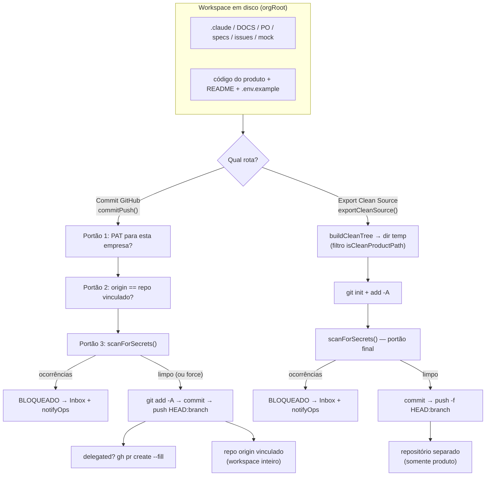
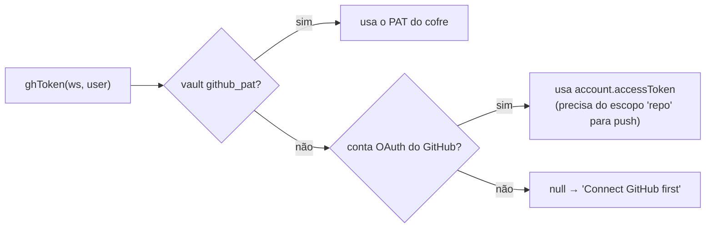

[← Índice](./README.md) · [🇬🇧 English](../en/GITHUB.md) · [✦ Constella](../../README.pt-BR.md)

# GitHub 🛰️


A baía de lançamento que conecta o workspace de uma constelação a um remoto Git real. Daqui partem duas rotas de voo distintas: **Commit GitHub** (o workspace completo do plano de controle → o `origin` vinculado) e **Export Clean Source** (apenas o produto, sem a camada interna da Constella → um repositório separado). Ambas passam pela mesma comporta de varredura de segredos.

> Fonte da verdade: [`src/server/github.ts`](../../src/server/github.ts), [`src/server/prepare-deploy.ts`](../../src/server/prepare-deploy.ts), [`src/server/git-scan.ts`](../../src/server/git-scan.ts).

---

## 1. Quando usar 🌠

- Você conectou uma conta GitHub durante o onboarding (ou quer conectar/substituir uma agora).
- Um agente (ou você) terminou um trabalho e quer **histórico git local real** mais um **push para o remoto**.
- Você quer publicar **apenas o produto** — sem `.claude/`, docs de planejamento ou qualquer arquivo interno de controle — em um repositório público/separado.
- Você precisa garantir que nenhum segredo vazou antes que algo deixe a nave.

---

## 2. Como funciona 🌌

Todo workspace vive na raiz da organização em disco (`orgRoot(org.id)`). O módulo GitHub opera sobre esse diretório como um **repositório git normal**:

- `ensureRepo(cwd)` executa `git init -b main` no primeiro uso e cria um `.gitignore` padrão para que `git add -A` nunca prepare `node_modules/`, `.next/`, `dist/`, saída de build, `.env*`, `uploads/` ou `.testdev/`.
- A autenticação usa um **token do GitHub** resolvido por `ghToken(workspaceId, userId)`:
  1. **PAT no cofre** (`getSecret(workspaceId, "github_pat")`) — preferido.
  2. **Token de acesso OAuth** — o `account.accessToken` do GitHub do usuário (via better-auth), utilizável para git **somente** se o app OAuth recebeu o escopo `repo`.
- O token é **redatado de toda string capturada** (`redact()` divide pela string do token e a substitui por `***`), de modo que nunca pode vazar para uma notificação, o Inbox ou a UI.
- Todas as chamadas à API do GitHub passam por `ghApi(token, path)` contra `https://api.github.com` com timeout de 12s e `User-Agent: constella`.

### As duas rotas de voo

| Rota | Função | Diretório de origem | Alvo | Remove a camada interna? | Estilo de push |
|------|--------|---------------------|------|--------------------------|----------------|
| **Commit GitHub** | `commitPush()` em `github.ts` | o workspace ao vivo (`orgRoot`) | o repositório `origin` **vinculado** | Não — faz commit de todo o workspace (menos o `.gitignore`) | `git push HEAD:<branch>` |
| **Export Clean Source** | `exportCleanSource()` em `prepare-deploy.ts` | uma árvore limpa em **temp** | um repositório **separado** (`owner/repo`) | Sim — só sobrevive o que passa por `isCleanProductPath` | `git push -f HEAD:<branch>` |

---

## 3. Fluxo principal 🚀

### Conectar

```
connectGitHub(pat)
  → trim + checagem de tamanho
  → GET https://api.github.com/user  (verifica que o token de fato funciona; 401 → erro)
  → apaga qualquer linha github_pat existente → putSecret(ws, "github_pat", token)
  → vincula { login, repo: undefined, defaultBranch: undefined } em workspace.settings.github
```

O vínculo de repositório é **limpo ao (re)conectar**, para que uma conta diferente não consiga dar push no repositório da conta anterior.

### Vincular um repositório

```
setRepo("owner/repo")
  → normaliza (remove https://github.com/ e .git)
  → ghToken() precisa alcançar GET /repos/owner/repo  (404 → "o token não consegue acessá-lo")
  → ensureRepo(cwd) → git remote add|set-url origin https://github.com/owner/repo.git
  → persiste settings.github = { repo, defaultBranch }
```

`createRepo({ name, private })` é um atalho: faz `POST` em `/user/repos` e então chama `setRepo` no novo nome completo.

### Commit + push

`commitPush({ repo, branch, message, delegated?, force? })` executa três portões de segurança **antes** de tocar no git, então faz o commit e (opcionalmente) push / abre um PR. Veja [§4](#4-conceitos-chave-) e o diagrama em [§8](#8-diagramas-mermaid-).

### Exportar código limpo

`exportCleanSource({ repo, token?, branch?, message? })` copia apenas o produto limpo para um diretório temporário, varre-o e faz force-push para um repositório **diferente**. Ele nunca toca no `origin` do próprio workspace.

---

## 4. Conceitos-chave 🪐

### PAT vs token OAuth

| | PAT no cofre (`github_pat`) | OAuth `account.accessToken` |
|---|---|---|
| Armazenado onde | tabela `vault`, AES-256-GCM (`CONSTELLA_VAULT_KEY`) | linha `account` do better-auth |
| Definido por | `connectGitHub()` / onboarding | login OAuth do GitHub |
| Usado para git push? | Sim | Somente se receber o escopo `repo` |
| Precedência | **Primeiro** (preferido) | Fallback quando não há PAT |
| Por empresa | Sim — no cofre por `workspaceId` | Por conta de usuário |

`ghToken()` sempre retorna o PAT se presente, caso contrário o token OAuth, caso contrário `null` ("Connect GitHub first").

### Vínculo do `setRepo` — o guarda por empresa

O repositório escolhido é registrado em `workspace.settings.github.repo` (e `defaultBranch`). Esse vínculo é verificado depois, na hora do commit, para que um agente jamais consiga dar push em um repositório que o token desta empresa não deveria alcançar. O vínculo **falha** se o token vinculado não conseguir `GET /repos/owner/repo`.

### `refreshGitStatus` — reconciliando a árvore de trabalho

`file.gitStatus` nunca é preenchido pelo watcher; `refreshGitStatus()` executa o **real** `git status --porcelain -z --untracked-files=all` e reconcilia a tabela `file` para que os módulos GitHub + Code mostrem as mudanças reais.

- `-z` → caminhos **crus** separados por NUL (renames/copies consomem um campo extra de caminho antigo; nomes não-ASCII permanecem intactos).
- Cada entrada mapeia para um código de uma letra: `U` (não rastreado `?`), `D` (deletado), `A` (adicionado), senão `M` (modificado).
- Caminhos `.git/` e `node_modules/` são ignorados.
- Arquivos que não estão mais alterados têm seu `gitStatus` limpo de volta para `""`.
- Um lock em memória por workspace (Set `refreshing`) evita que duas renderizações concorrentes disputem a reconciliação e insiram linhas duplicadas.

### Commit GitHub vs Export Clean Source

- **Commit GitHub** = histórico git local honesto do *workspace inteiro*, com push para o `origin` *vinculado*. A camada do plano de controle (`.claude/`, diretórios de planejamento) também entra no commit (faz parte do seu repositório privado).
- **Export Clean Source** = uma *árvore limpa* — apenas arquivos que passam por `isCleanProductPath()` — com force-push para um repositório *separado*. Este é o caminho para publicar o produto entregável sem expor as entranhas da Constella.

`isCleanProductPath(rel)` rejeita qualquer caminho cujo diretório de topo esteja em `DENY_TOP` (`.claude`, `DOCS`, `PO`, `Reports`, `specs`, `issues`, `mock`, `uploads`, `archives`, `.testdev`, `node_modules`, `.git`, `.next`, `dist`, `build`, `out`, `coverage`, `.cache`, `.turbo`, `vendor`), qualquer coisa sob `.constella`, e qualquer arquivo `SENSITIVE` (`.env*`, chaves privadas, `*.pem/.key/.p12/...`, JSON de credenciais, dumps/db/logs) — **exceto** templates de env inofensivos que casam com `ALLOW_ENV` (`.env.example|.sample|.template|.dist`).

### Varredura de segredos — a comporta compartilhada

Ambas as rotas chamam `scanForSecrets(cwd)` de `git-scan.ts`. Ela varre os arquivos que *seriam* commitados (o conjunto de mudanças da árvore de trabalho; arquivos no gitignore já estão excluídos pelo `git status`).

- **Arquivos que nunca podem ser commitados** por nome: `.env*`, `id_rsa*`, `*.pem/.key/.p12/.pfx/.keystore/.jks/.ppk/.asc`, `credentials.json`, `service-account*.json`, `*.sql/.dump/.bak/.sqlite/.db`, `*.local`, `npm-debug.log` — exceto templates `ALLOW_FILE`.
- **Padrões de conteúdo de alta confiança**: chave de acesso AWS, token do GitHub, chave OpenAI/Anthropic, chave de API Google, token Slack, bloco de chave privada, JWT, URL de DB com credenciais, token de bot do Telegram, e um padrão genérico de segredo hardcoded.
- O padrão genérico é suprimido para **placeholders** óbvios (`your_`, `xxx`, `<...>`, `change_me`, `example`, `placeholder`, `***`, `dummy`, `todo`, `redacted`, `...`).
- As ocorrências são **redatadas** no preview (`primeiros4•••últimos2`).
- Arquivos acima de 2 MB e arquivos binários (contendo `\0`) são ignorados; a varredura limita-se a 3000 arquivos / 300 ocorrências.

---

## 5. Tabelas 🌌

### `vault` (ref relevante)

| Coluna | Valor para o GitHub |
|--------|---------------------|
| `ref` | `github_pat` |
| `ciphertext` | texto cifrado AES-GCM do PAT |
| `iv` | IV por segredo |

### `workspace.settings.github` (JSON)

| Campo | Significado |
|-------|-------------|
| `login` | nome de usuário GitHub da conta conectada |
| `repo` | `owner/repo` vinculado (o vínculo por empresa) |
| `defaultBranch` | branch padrão do repositório (vinda da API) |

### `file.gitStatus`

| Código | Significado |
|--------|-------------|
| `""` | sem mudança |
| `M` | modificado |
| `A` | adicionado / novo preparado |
| `U` | não rastreado |
| `D` | deletado |

### `deploy_run.lastExport` (definido por `exportCleanSource`)

| Campo | Significado |
|-------|-------------|
| `ok` | exportação bem-sucedida |
| `sha` | SHA curto do commit da árvore limpa |
| `copied` | número de arquivos limpos enviados |
| `repo` / `branch` | alvo da exportação |
| `at` | timestamp |

### `PushResult` (retorno de `commitPush`)

| Campo | Significado |
|-------|-------------|
| `ok` | um commit real aconteceu |
| `committed` | commit local criado |
| `sha` | sha curto do HEAD |
| `pushed` | alcançou o remoto |
| `prUrl` | URL do PR (somente na rota delegada) |
| `nothing` | árvore de trabalho não tinha nada para commitar |
| `blocked` | um portão de segurança parou o commit |
| `secrets` | ocorrências da varredura de segredos quando bloqueado |

---

## 6. Passo a passo 🛰️

### Commit do workspace para o repositório vinculado

1. **Conecte** um PAT (`connectGitHub`) ou faça login com OAuth do GitHub (escopo `repo`).
2. **Vincule** um repositório com `setRepo("owner/repo")` (ou `createRepo`).
3. (Opcional) **Atualize** o status — `refreshGitStatus()` preenche a lista de mudanças; `draftCommitMessage()` propõe um assunto Conventional-Commit a partir das contagens de `A`/`M`/`D`.
4. **Varra** sob demanda com `scanWorkspace()` (sem commit) para pré-visualizar ocorrências.
5. **Commit + push** com `commitPush({ repo, branch, message })`. Passe `delegated: true` para também abrir um PR via `gh pr create --fill`. Passe `force: true` para contornar o portão de varredura de segredos *após revisão*.

### Exportar apenas o produto

1. Execute **Prepare Deploy** (ou `previewCleanExport()`) para ver a árvore limpa + uma varredura pré-exportação.
2. Chame `exportCleanSource({ repo: "myorg/my-app-public" })` — ou `/export-source myorg/my-app-public` no chat.
3. A árvore limpa é construída em um diretório temporário, varrida em busca de segredos, commitada e enviada com **force-push** para o repositório separado. `deploy_run.lastExport` registra o resultado.

---

## 7. Exemplos 🌠

### Comandos de barra

```
/github                      # atualiza o status do git, reporta a contagem de arquivos alterados (Werner)
/export-source myorg/app-pub # exporta o produto limpo para um repositório separado
/prepare-deploy              # executa o pipeline completo de preparo para produção
```

`/github` (tratado em `src/server/commands.ts`) chama `refreshGitStatus()` e posta a contagem de arquivos alterados pelo Werner (DevOps).

### Mensagens do portão de commit (strings reais)

```
Blocked: 2 potential secret(s)/sensitive file(s) in the change set. Resolve them or review before committing.
Origin (acme/app) doesn't match this company's configured repo (acme/app-2). Re-select the repo before committing.
committed locally — connect a GitHub PAT to push
```

### URL de push autenticada

`commitPush` reescreve o origin HTTPS para injetar o PAT apenas no momento do push:

```
https://github.com/owner/repo.git
→ https://x-access-token:<PAT>@github.com/owner/repo.git   (usada no `git push`, redatada em todo o resto)
```

---

## 8. Diagramas Mermaid 🪐

### Commit GitHub vs Export Clean Source



### Resolução de token



---

## 9. Estados possíveis 🕳️

### Portões de commit (em ordem)

| Portão | Gatilho | Resultado |
|--------|---------|-----------|
| **1. PAT configurado** | sem `github_pat` para este workspace | `blocked` — "GitHub isn't configured for this company" |
| **2. Repo vinculado + origin casa** | sem `settings.github.repo` / sem origin, ou divergência | `blocked` — re-selecione o repositório |
| **3. Varredura de segredos** | qualquer ocorrência (e `force` não definido) | `blocked`, `secrets[]`, card no Inbox + notificação aos operadores |

Após os portões passarem: `committed` → opcional `pushed` → opcional `prUrl`. Uma árvore de trabalho sem nada a commitar retorna `nothing: true`.

### Rejeição de push

Um push rejeitado / non-fast-forward (`rejected | non-fast-forward | fetch first | merge conflict | failed to push`) **não** é descartado silenciosamente — ele gera um card `block` no Inbox ("Push rejected — \<repo\>") para que o operador faça pull + resolva.

### Estados da exportação

| Estado | Causa |
|--------|-------|
| `ok: false, error: "Use the form owner/repo."` | alvo malformado |
| `ok: false, error: "...token can't access it."` | `GET /repos/...` retornou 404 |
| `blocked: true, secrets[]` | a varredura final encontrou um segredo |
| `ok: true, pushed: true, sha, copied` | force-push limpo concluído |
| `error: "Nothing to export yet..."` | `buildCleanTree` copiou 0 arquivos |

---

## 10. Integrações relacionadas 🌌

- **Vault** — armazena `github_pat` criptografado; veja [SECURITY](./SECURITY.md).
- **Inbox** — recebe cards `block` para ocorrências de segredos + rejeições de push; veja [INBOX](./INBOX.md).
- **Prepare Deploy** — o pipeline que faz build, valida e gate da exportação limpa; veja [PREPARE_DEPLOY](./PREPARE_DEPLOY.md) e [DEPLOY](./DEPLOY.md).
- **Agentes** — Werner (DevOps) é o agente padrão de deploy/commit; veja [AGENTS](./AGENTS.md).
- **Comandos de chat** — `/github`, `/export-source`, `/prepare-deploy`; veja [CHAT_COMMANDS](./CHAT_COMMANDS.md).
- **Onboarding** — import/conexão inicial do GitHub; veja [ONBOARDING](./ONBOARDING.md).

---

## 11. Segurança 🕳️

- **Token nunca registrado.** `redact()` remove o PAT de cada stdout/stderr capturado antes que chegue à UI, ao Inbox ou às notificações. A URL de push autenticada (`x-access-token:<PAT>@...`) só é construída em memória para a chamada do `git push`.
- **Isolamento por empresa.** O PAT fica no cofre por `workspaceId`; o vínculo é verificado contra o token; o Portão 2 do commit garante que `origin` seja igual ao repositório vinculado — você não consegue dar push no repositório de outra organização.
- **Varredura de segredos obrigatória.** O Portão 3 do commit e o portão final da exportação ambos executam `scanForSecrets`. A flag `force` só contorna a varredura do *commit* e destina-se a uso *pós-revisão*.
- **A exportação limpa remove as entranhas.** `isCleanProductPath` remove toda a camada de controle da Constella e todos os arquivos sensíveis antes que algo seja enviado a um repositório separado.
- **`.gitignore` seguro.** `ensureRepo` garante que deps/build/segredos nunca sejam preparados por `git add -A`.

Veja [SECURITY](./SECURITY.md) para o modelo completo de cofre + scrub.

---

## 12. Solução de problemas 🛰️

| Sintoma | Causa provável | Correção |
|---------|----------------|----------|
| "Connect GitHub first." | sem PAT e sem token OAuth | execute `connectGitHub` com um PAT de escopo `repo` |
| "Invalid token (401). ...needs the 'repo' scope." | PAT sem escopo `repo` ou errado | regenere com escopo `repo` |
| "Repo not found, or this company's token can't access it." | `GET /repos/owner/repo` 404 | confira o nome do repositório + se a conta do token tem acesso |
| "Origin (X) doesn't match this company's configured repo (Y)." | origin e vínculo divergiram | chame `setRepo` para re-vincular |
| Commit `blocked` com `secrets[]` | a varredura achou um segredo/arquivo sensível | remova-o (ou mova para `.env`), ou use `force` após revisão |
| "Push rejected — \<repo\>" no Inbox | o remoto avançou / conflito | faça pull + resolva, então push novamente |
| O módulo GitHub mostra "No changes" mas os arquivos mudaram | `file.gitStatus` não reconciliado | dispare `refreshGitStatus()` (botão Refresh / `/github`) |
| "committed locally — connect a GitHub PAT to push" | commit feito, sem credenciais para push | conecte um PAT |
| "Nothing to export yet..." | nenhum arquivo de produto limpo encontrado | adicione código do produto fora dos diretórios internos |

---

## 13. Links relacionados 🌠

- [PREPARE_DEPLOY](./PREPARE_DEPLOY.md) · [DEPLOY](./DEPLOY.md) · [PUBLISHING](./PUBLISHING.md)
- [SECURITY](./SECURITY.md) · [INBOX](./INBOX.md) · [CHAT_COMMANDS](./CHAT_COMMANDS.md)
- [AGENTS](./AGENTS.md) · [ONBOARDING](./ONBOARDING.md) · [CONFIGURATION](./CONFIGURATION.md)
- [✦ Voltar ao Índice da documentação](./README.md)
