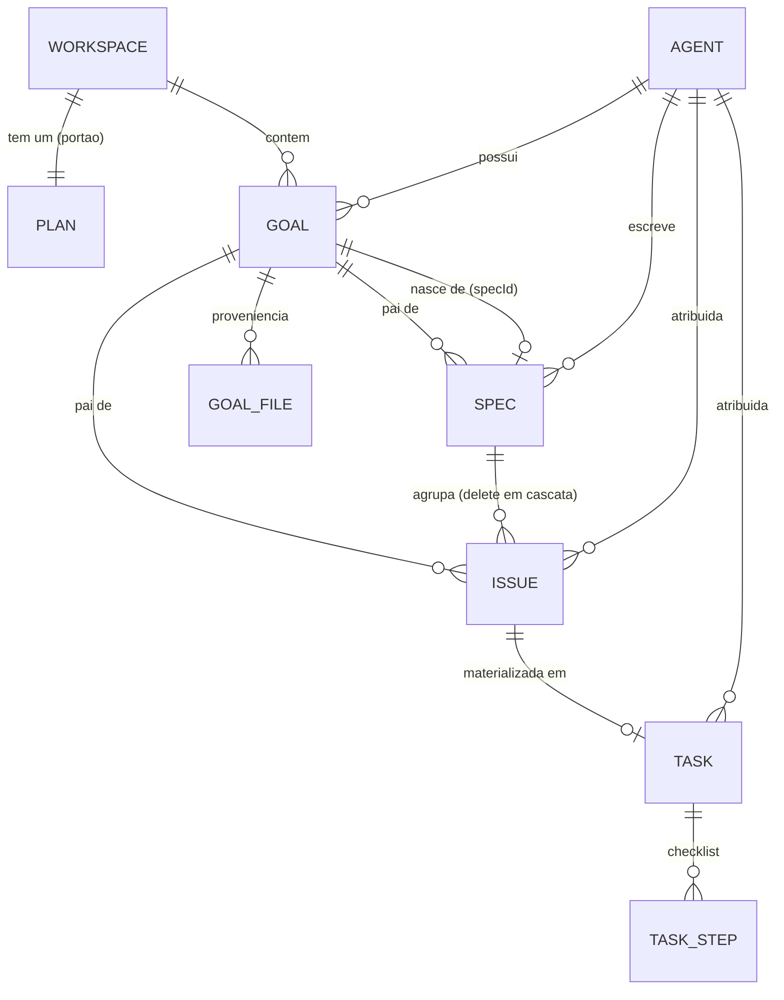
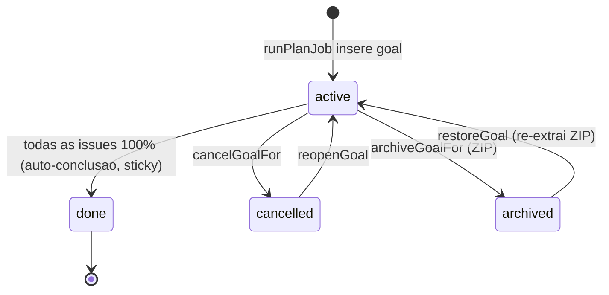
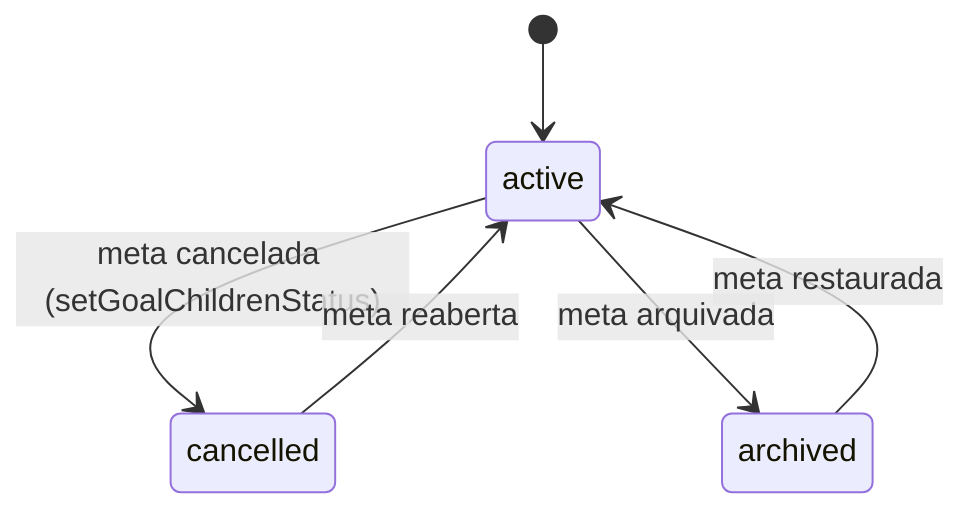
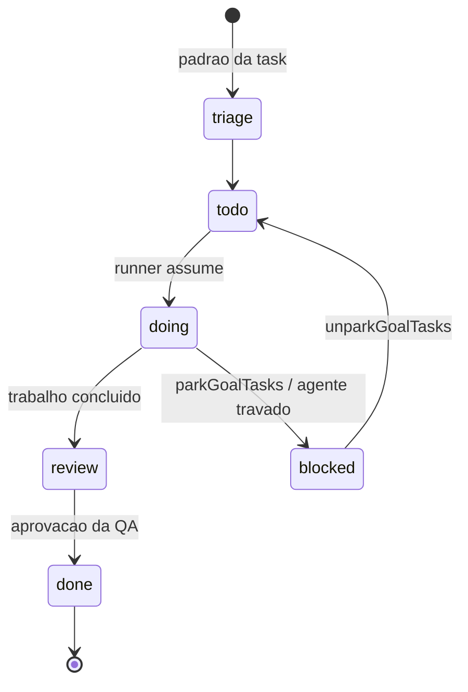
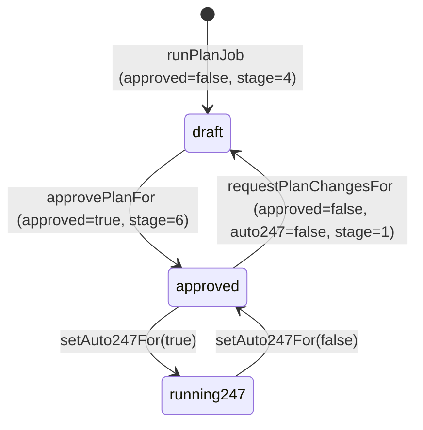

[← Índice](./README.md) · [🇬🇧 English](../en/GOALS_SPECS_ISSUES.md) · [✦ Constella](../../README.pt-BR.md)

# Metas, Specs, Issues, Planos — A Constelação do Trabalho 🌌🪐


O modelo de dados e as máquinas de estado por trás de cada unidade de trabalho. Uma **Meta (Goal)** é uma órbita; as **Specs** são suas cartas estelares; as **Issues** são as manobras; as **Tasks** são as queimas que o motor realmente dispara; o **Plano (Plan)** é o portão de lançamento que o operador abre. Esta página documenta as tabelas reais, colunas, enums de status e as transições entre eles.

## Descrição curta

A Constella transforma um briefing em um pipeline de entrega estruturado e consciente de estado: `Goal → Spec → Issue → Plan → Execution → Review → Test → Done`. O agente CEO (Ada) rascunha specs e issues; o operador aprova o plano; as issues aprovadas são *materializadas* em tasks executáveis que o runner pega. Cancelar ou arquivar uma meta cascateia para seus filhos, de modo que nada já encerrado continue aparecendo como pendente.

## Quando usar

- Você quer entender **o que é cada entidade**, quais colunas ela tem e como as linhas se relacionam.
- Você precisa dos **enums de status** exatos e das **colunas do kanban** de `goal`, `spec`, `issue`, `task` e `plan`.
- Você está depurando por que uma meta cancelada ainda mostra trabalho pendente, ou por que um plano reaprovado criou apenas *algumas* tasks.
- Você quer saber o que é o **SUPER-SPEC** e quando ele é escrito.

## Como funciona 🛰️

Cada entidade é uma linha no banco de dados SQLite (`src/db/schema.ts`), com escopo por `workspaceId` (um workspace por organização). O diretório em disco é a fonte da verdade para os artefatos legíveis (`specs/*.md`, `issues/*.md`, `specs/SUPER-SPEC.md`); as tabelas os indexam e carregam o estado de ciclo de vida.

O pipeline é conduzido por três módulos:

| Módulo | Arquivo | Responsabilidade |
| --- | --- | --- |
| Planner | `src/server/planner-core.ts` | `generatePlanFor` / `runPlanJob` / `planFromConversationFor` — o CEO rascunha a Goal + specs + issues |
| Plan ops | `src/server/plan-ops.ts` | `approvePlanFor` / `requestPlanChangesFor` / `setAuto247For` — o portão de aprovação |
| Work ops | `src/server/work-ops.ts` | `cancelGoalFor` / `archiveGoalFor` + helpers de cascata — ciclo de vida da meta |
| Materialize | `src/server/materialize.ts` | `materializeTasks` — converte issues aprovadas em linhas `task` executáveis |

Os quatro são cores `server-only` chaveados por um `(orgId, workspaceId)` explícito, então podem ser chamados a partir de uma server action de sessão **ou** dos canais sem sessão (o controle remoto via Telegram, a API pública).

## Fluxo principal 🌠

```
briefing / DM "@ada construa X"
   └─ generatePlanFor → runPlanJob (Ada, destacado, canal "planner")
        ├─ (primeiro plano, projeto existente) analyzeExistingProject → specs/SUPER-SPEC.md
        ├─ insere goal (a partir da spec PRINCIPAL/primeira)
        ├─ insere linhas spec  + escreve specs/SPEC-NN.md
        ├─ insere linhas issue + escreve issues/<key>.md   (col=todo, approved=false)
        └─ envia item ao Inbox "Aprovar plano"
   └─ operador aprova → approvePlanFor
        ├─ plan.approved=true, stage=6
        ├─ issue.approved=true, spec.approved=true (specs ativas)
        ├─ materializeTasks → uma task por issue (idempotente)
        └─ organiza o backlog do PO
   └─ Run 24/7 (plan.auto247=true) → runner pega tasks → Review → Test → Done
```

## Conceitos-chave 🕳️

- **A Goal nasce da spec PRINCIPAL.** O `runPlanJob` trata a primeira spec da saída do modelo como a spec principal; `goal.specId` aponta para ela, e toda spec/issue rascunhada recebe o id da meta (`goalId`).
- **O ciclo de vida é independente da coluna de fluxo.** `spec.status` / `issue.status` (`active | cancelled | archived`) são *separados* de `issue.col` (a raia do kanban). Cancelar uma meta vira o `status` dos filhos, nunca a `col`, então o histórico do board sobrevive.
- **`approved` é um booleano, não um status.** Uma spec ou issue pode estar `approved=true` ainda que `active`. O portão de aprovação fica na linha singleton `plan`.
- **Tasks são a única coisa que o runner executa.** Issues são planos; tasks são trabalho. `materializeTasks` faz a ponte e é idempotente via `task.issueId`.
- **O disco é a fonte da verdade.** As keys de spec/issue são renumeradas para *continuar* a partir das existentes, de modo que um segundo plano de "New work" nunca sobrescreva `specs/SPEC-01.md` em disco.

## Tabelas 🪐

### `goal` — uma unidade de trabalho (uma órbita)

| Coluna | Tipo | Notas |
| --- | --- | --- |
| `id` | text PK | |
| `workspaceId` | text FK → workspace | indexado `goal_ws_idx` |
| `title` / `description` | text | |
| `ownerId` | text FK → agent | normalmente Ada (a CEO) |
| `progress` | int | rollup em cache 0–100, recomputado pelo runner |
| `parentId` | text | meta pai opcional |
| `status` | enum | `active \| cancelled \| archived \| done` (padrão `active`) |
| `specId` | text | a spec **principal** da qual esta meta nasceu |
| `archivePath` | text | caminho do ZIP quando arquivada |
| `createdAt` / `updatedAt` / `doneAt` / `cancelledAt` / `archivedAt` / `reopenedAt` | timestamp | marcadores de ciclo de vida (nuláveis) |

A proveniência é rastreada em `goal_file` (PK `goalId + path`, `op = created | edit`), para que um ZIP de arquivamento inclua *apenas* os arquivos que esta meta produziu.

### `spec` — uma carta estelar

| Coluna | Tipo | Notas |
| --- | --- | --- |
| `id` | text PK | |
| `workspaceId` | text FK | |
| `key` | text | ex.: `SPEC-01` (renumerada para continuar a partir das existentes) |
| `title` / `summary` / `body` | text | |
| `authorId` | text FK → agent | o papel que o CEO designou como autor |
| `approved` | bool | padrão `false` |
| `goalId` | text | meta pai |
| `status` | enum | `active \| cancelled \| archived` (padrão `active`) |
| `createdAt` / `updatedAt` | timestamp | |

### `issue` — uma manobra

| Coluna | Tipo | Notas |
| --- | --- | --- |
| `id` | text PK | |
| `workspaceId` | text FK | |
| `specId` | text FK → spec | `onDelete: cascade` |
| `goalId` | text | meta pai |
| `key` | text | sequencial, continuando a partir das issues existentes |
| `title` | text | |
| `prio` | enum | `low \| med \| high` (padrão `med`) |
| `col` | enum | `todo \| doing \| blocked \| review \| done` (raia do kanban, padrão `todo`) |
| `moscow` | enum | `Must \| Should \| Could \| Won't` (derivado de `prio`) |
| `points` | int | story points (derivado: high→8, med→5, low→3) |
| `assigneeId` | text FK → agent | o papel que o CEO designou |
| `approved` | bool | padrão `false` |
| `status` | enum | `active \| cancelled \| archived` (padrão `active`) |
| `createdAt` / `updatedAt` | timestamp | |

### `task` — uma queima de motor (a unidade executável)

| Coluna | Tipo | Notas |
| --- | --- | --- |
| `id` | text PK | |
| `workspaceId` | text FK | |
| `key` / `title` / `description` | text | |
| `col` | enum | `triage \| todo \| doing \| blocked \| review \| done` (padrão `triage`) |
| `prio` | enum | `low \| med \| high` |
| `assigneeId` | text FK → agent | |
| `goalId` | text FK → goal | |
| `issueId` | text FK → issue | a issue da qual foi materializada (chave de idempotência) |
| `createdBy` | enum | `operator \| agent` |
| `createdAt` / `updatedAt` | timestamp | |

Os sub-passos vivem em `task_step` (`text`, `done`, `active`, `ord`) — semeados a partir do `## Checklist` da issue e base do progresso ao vivo.

### `plan` — o portão de lançamento (uma linha por workspace)

| Coluna | Tipo | Notas |
| --- | --- | --- |
| `workspaceId` | text **PK** | um plano por workspace |
| `approved` | bool | padrão `false` |
| `auto247` | bool | chave da execução autônoma 24/7 |
| `stage` | int | marcador de estágio do pipeline (padrão `4`) |
| `createdAt` / `updatedAt` | timestamp | |

Note a diferença de cardinalidade: existe exatamente **uma** linha `plan` por workspace (a PK é `workspaceId`), mas **muitas** goals/specs/issues/tasks.

## Diagrama de relacionamento de entidades



## Transições de status 🌠

### Máquina de estado da Goal



`progress` e `status` mudam **apenas enquanto active**. Assim que uma meta encerra (`done`/`cancelled`/`archived`), seu `%` fica fixo (sticky) — uma issue posterior bloqueada ou adicionada não pode fazer uma meta "Done" mostrar 62%. A auto-conclusão é compare-and-set: só o primeiro escritor que ainda vê a meta `active` carimba `done` + `doneAt` (`src/server/progress.ts`).

### Ciclo de vida de Spec / Issue (status) — cascateia da meta pai



### Coluna kanban de Issue / Task (fluxo, independente do status)



> As Issues usam as colunas `todo · doing · blocked · review · done`. As Tasks adicionam uma raia inicial `triage`.

### Portão do Plano



## Passo a passo 🚀

1. **Chega um briefing** — o briefing permanente do workspace (`.claude/BRIEF.md`), uma DM para `@ada`, ou `/new-work` / `/new-goal`.
2. **`generatePlanFor`** marca Ada como `working` e dispara o `runPlanJob` destacado no servidor node persistente (faz streaming no canal `planner`).
3. **Análise do primeiro plano** (apenas quando há um projeto existente ainda não analisado): `analyzeExistingProject` lê o projeto arquivo a arquivo e escreve `specs/SUPER-SPEC.md`, então sinaliza `settings.source.analyzed = true`.
4. **Ada rascunha** um único objeto JSON de `specs[]` + `issues[]`. A primeira spec é a spec **principal**.
5. **Persiste** — insere a `goal` (título de `opts.goalTitle` / spec principal / objetivo), depois as specs (keys renumeradas para continuar), depois as issues (`col=todo`, `points`/`moscow` derivados de `prio`). Escreve `specs/SPEC-NN.md` e `issues/<key>.md` em disco.
6. **Inbox + Telegram** — um item de inbox `approval` (`refType=plan`) é enviado; se o Telegram estiver configurado, o plano é enviado ao celular com botões Aprovar / Iniciar execução / Revisar / Rejeitar.
7. **O operador aprova** (`approvePlanFor`): `plan.approved=true, stage=6`, issues + specs ativas viram `approved=true`, `materializeTasks` cria uma task por issue não materializada, e o backlog do PO (`PO/backlog.md`) é organizado.
8. **Run 24/7** (`setAuto247For(true)`) — o runner pega tasks `todo`, avança-as por `doing → review → done`, espelhando o progresso de volta nas issues e metas.
9. **Cancelar / arquivar** quando necessário — `cancelGoalFor` / `archiveGoalFor` param tudo e cascateiam o status dos filhos.

## Exemplos

**Novo trabalho a partir de uma DM** (tratado por `planFromConversationFor` → `generatePlanFor`):

```
@ada construa um painel de cobrança com um provedor de pagamento e exportação CSV
```

**Aprovar via slash command** ([CHAT_COMMANDS](./CHAT_COMMANDS.md)):

```
/approve          # approvePlanFor: aprova plano/specs/issues + materializa tasks
/run-247          # setAuto247For(true)
/reject <motivo>  # requestPlanChangesFor — volta para Ada, estágio recua para 1
/cancel           # cancelGoalFor — para + estaciona, reabre depois
/archive          # archiveGoalFor — compacta o source da meta + manifesto
```

**Materialização Issue → task** (`materializeTasks`, idempotente): reaprovar após um replanejamento cria tasks **apenas** para issues sem `task.issueId`, então o trabalho existente nunca é duplicado.

## Estados possíveis

| Entidade | Campo | Valores |
| --- | --- | --- |
| goal | `status` | `active`, `cancelled`, `archived`, `done` |
| spec | `status` | `active`, `cancelled`, `archived` |
| spec | `approved` | `true`, `false` |
| issue | `status` | `active`, `cancelled`, `archived` |
| issue | `col` | `todo`, `doing`, `blocked`, `review`, `done` |
| issue | `approved` | `true`, `false` |
| issue | `moscow` | `Must`, `Should`, `Could`, `Won't` |
| task | `col` | `triage`, `todo`, `doing`, `blocked`, `review`, `done` |
| plan | `approved` / `auto247` | `true`, `false` |

## O SUPER-SPEC 🌌

Quando o onboarding importa um projeto existente (um repositório GitHub, um diretório local copiado, ou um `mock/` anexado), a **primeira** execução de plano não rascunha às cegas. `analyzeExistingProject` (`src/server/analyze.ts`) roda uma passagem real de agente com o workspace como `cwd`, lê docs → manifestos → código arquivo a arquivo, e escreve `specs/SUPER-SPEC.md` com seções como *Visão geral & propósito, Arquitetura & camadas, Stack & dependências, Mapa de diretórios / módulos, Frontend, Backend, Modelo de dados & banco, Auth & segurança, Integrações, Regras de negócio & fluxos-chave, O que é mock/stub vs real, Lacunas para tornar production-real*.

O plano então lê o SUPER-SPEC por inteiro e **estende** o sistema existente — nunca cria um segundo protótipo separado. A análise roda uma vez por projeto (`settings.source.analyzed`).

## Integrações relacionadas

- **Grooming do PO** — ao aprovar, cada issue é copiada para `backlog_item` (MoSCoW + points) e `PO/backlog.md` é reescrito. Veja [PO_AGENT](./PO_AGENT.md).
- **Inbox** — a decisão de aprovar o plano aparece como item acionável (`refType=plan`). Veja [INBOX](./INBOX.md).
- **Log de decisões** — aprovar/cancelar/arquivar acrescentam cada um uma linha `decision`. Veja [TEAM_ROOM](./TEAM_ROOM.md).
- **Remoto via Telegram** — os mesmos cores sem sessão alimentam `/approve`, `/cancel`, etc. pelo celular. Veja [TELEGRAM](./TELEGRAM.md).
- **Runner / execução** — as tasks fluem por review e teste. Veja [WORKFLOW](./WORKFLOW.md), [TEST_DEV](./TEST_DEV.md).

## Segurança 🔒

- Todos os cores de ciclo de vida são `server-only` e chaveados por um `(orgId, workspaceId)` explícito — **nunca** expostos como endpoints RPC não autenticados. Todo chamador (server action de sessão, allowlist do Telegram, PAT da API pública) já deve estar autorizado para o workspace.
- `ownGoal(wsId, goalId)` verifica que a meta pertence ao workspace antes de qualquer mutação.
- A extração de ZIP em arquivar/restaurar normaliza caminhos e recusa escrever fora da raiz do workspace (`abs !== root && !abs.startsWith(root + sep)`), parte da FS jail. Veja [SECURITY](./SECURITY.md).

## Solução de problemas 🕳️

| Sintoma | Causa | Solução |
| --- | --- | --- |
| Meta cancelada ainda mostra issues pendentes | `status` do filho não cascateado | `cancelGoalFor` chama `setGoalChildrenStatus`; reabra + cancele de novo se uma linha foi editada direto |
| Reaprovação não criou novas tasks | todas as issues já têm `task.issueId` | esperado — `materializeTasks` é idempotente; só novas issues materializam |
| Meta "Done" travada abaixo de 100% | progresso em cache fixo (sticky) | por design, uma vez encerrada; reabra para recomputar enquanto `active` |
| Plano não aprova | sem linha `plan` / specs não `active` | `approvePlanFor` só aprova `spec.status = active`; garanta que existe um plano |
| Ada travada em "working", sem plano | um job anterior morreu antes do `finally` | `generatePlanFor` se auto-recupera checando o stream de eventos `planner` ao vivo |
| Segundo "New work" sobrescreveu SPEC-01 | não deveria ocorrer | as keys são renumeradas para continuar a partir das specs/issues existentes em disco |

## Links relacionados

- [WORKFLOW](./WORKFLOW.md) — o ritual de execução ponta a ponta
- [PO_AGENT](./PO_AGENT.md) — grooming de backlog, story points, MoSCoW
- [AGENTS](./AGENTS.md) — a tripulação (Ada é a CEO/planner)
- [INBOX](./INBOX.md) — aprovações e decisões do operador
- [CHAT_COMMANDS](./CHAT_COMMANDS.md) — `/approve`, `/cancel`, `/archive`, `/new-work`
- [DM](./DM.md) — iniciar novo trabalho a partir de uma mensagem direta
- [TEAM_ROOM](./TEAM_ROOM.md) — onde a CEO narra o plano
- [ARCHITECTURE](./ARCHITECTURE.md) — a camada de dados e o motor de sync
- [TELEGRAM](./TELEGRAM.md) — controle remoto dos mesmos cores
