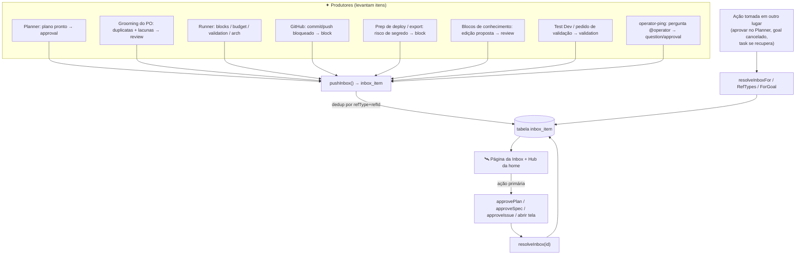
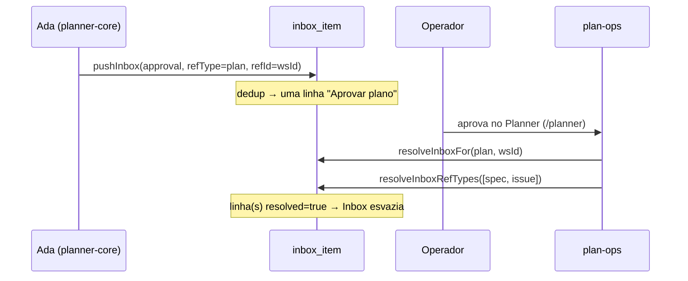

[← Índice](./README.md) · [🇬🇧 English](../en/INBOX.md) · [✦ Constella](../../README.pt-BR.md)

# 🛰️ Inbox — o console de decisões do operador


A Inbox é o único lugar onde toda decisão que precisa de *você* — o humano no plano de controle — vai parar. Quando uma constelação em trabalho sai de rota (um plano aguardando aprovação, um teto de orçamento atingido, um arquivo bloqueado, uma lacuna de conhecimento, um agente fazendo uma pergunta direta), ela registra um item acionável aqui. Nada que os agentes façam e que exija julgamento humano fica em silêncio: cai na Inbox, deduplicado e com limpeza automática.

---

## Quando usar

- Você quer **uma lista** de tudo que precisa de ação agora (aprovações, bloqueios, orçamento, validações, perguntas).
- Um agente postou "@operator, você confirma…?" e você quer agir sem rolar o chat.
- Um plano / spec / issue foi rascunhado e aguarda **aprovação** antes que qualquer código rode.
- Uma execução **bloqueou** (lock de arquivo, dev server quebrado, Test Dev falhou, push rejeitado, comando destrutivo bloqueado) e você precisa intervir.
- Um agente **atingiu o teto diário de orçamento** e pausou.
- O Product Owner sinalizou prováveis **duplicatas** ou **lacunas** durante o grooming do backlog.
- Uma nova **versão** do Constella está disponível.

Se você quer apenas *ler* o status, use `/status` no chat. A Inbox é para coisas que precisam de **decisão ou ação**.

---

## Como funciona 🌌

A Inbox é sustentada por uma tabela real, `inbox_item` (`src/db/schema.ts`). Não é uma view sobre o chat — os itens são linhas persistidas com um `kind`, um título/detalhe legível, uma referência opcional à decisão subjacente (`refType` + `refId`) e uma flag `resolved`.

Três módulos pequenos formam toda a superfície:

| Módulo | Arquivo | Papel |
| --- | --- | --- |
| API produtora | `src/server/inbox.ts` | `pushInbox`, `resolveInboxFor`, `resolveInboxRefTypes`, `resolveInboxForGoal` |
| Página de lista | `src/app/(app)/inbox/page.tsx` + `src/components/modules/inbox-row.tsx` | a visão completa da Inbox + overlay de detalhe |
| Hub da home | `src/server/home.ts` (`homeDecisions`) + `src/components/modules/home-inbox.tsx` | card "Precisa da sua decisão" no dashboard |

Os itens são criados por **produtores** espalhados pelo código (o planner, o runner, GitHub, prep de deploy, blocks, Test Dev, o operator-ping). São **consumidos** pela UI da Inbox, onde o botão primário executa a ação *real* (aprovar o plano, aprovar uma spec/issue, abrir o canal/tela) e então marca o item como resolvido.

O mesmo item é alcançável a partir de dois lugares: a página dedicada da **Inbox** (todos os kinds, resolvidos + não resolvidos) e o card **Precisa da sua decisão** do dashboard (`homeDecisions`, não resolvidos, apenas `approval | review | block | budget`, os 6 mais recentes).

### Dedup e refresh

`pushInbox` é ciente de duplicatas. Se já existe um item **não resolvido** para o mesmo `(refType, refId)`, ele é **atualizado no lugar** (último título/detalhe/goal/timestamp) em vez de empilhar uma duplicata. Assim, um plano re-rascunhado com novas contagens de spec/issue atualiza a única linha "Aprovar plano" em vez de gerar uma segunda.

### Limpeza automática

Quando a decisão subjacente é tomada **em outro lugar** (você aprova o plano no Planner, uma task bloqueada se recupera, um goal é cancelado), o item correspondente da Inbox é auto-resolvido para que a lista nunca mostre uma linha pendente obsoleta. Quatro helpers fazem isso — veja [Limpando itens](#limpando-itens--decaimento-orbital-).

---

## Fluxo principal



---

## Conceitos-chave 🪐

### Tipos de item (kinds)

O enum `kind` (`inbox_item.kind`) é a categoria do item. Ele determina o ícone e o rótulo localizado.

| `kind` | Significado | Produtor típico | Ícone |
| --- | --- | --- | --- |
| `approval` | Um plano ou um pedido de agente precisa do seu aval antes de o trabalho prosseguir | planner-core (plano pronto), operator-ping (frase de aprovação) | `check` |
| `review` | Algo para revisar: rejeição de spec/issue, decisão de arquitetura, review retido, edição de bloco da KB, relatório de duplicata/lacuna, atualização disponível | planner (rejeitar spec/issue), runner (decisão arch, review retido), blocks (proposta), planner (grooming do PO) | `doc` |
| `block` | Uma execução está bloqueada e precisa que você desbloqueie | runner (dev server quebrado, goal bloqueado, comando barrado pelo guard), GitHub (commit/push rejeitado), prep de deploy (risco de segredo), file locks | `close` |
| `budget` | Um agente pausou no teto diário de gasto | runner | `coins` |
| `validation` | Uma feature precisa que você a valide (Test Dev / manual) | test-dev-actions (`requestValidation`), runner (Test Dev falhou) | `pulse` |
| `question` | Uma pergunta `@operator` simples que precisa de resposta | operator-ping | `chat` |

### Referência (`refType` + `refId`)

`refType` diz *que tipo de coisa* a decisão envolve; `refId` é o id concreto (ou uma chave sintética). Juntos eles permitem que a Inbox **execute a ação real** e **auto-resolva** quando tratada em outro lugar.

| `refType` | exemplo de `refId` | Ação primária na UI |
| --- | --- | --- |
| `plan` | o **id do workspace** (o plano é singleton por workspace) | **Aprovar plano** → `approvePlan()` |
| `spec` | id da linha de spec | **Aprovar spec** → `approveSpec(refId)` |
| `issue` | id da linha de issue | **Aprovar issue** → `approveIssue(refId)` |
| `task` | id da task, ou chave sintética como `lock:<path>`, `commit-<origin>`, `budget:<id>`, `arch:<taskId>` | **Abrir tarefas** (`/tasks`) |
| `validation` | chave da issue, id de proposta de bloco, id do gate do Test Dev | **Abrir Test Dev** (`/test-dev`) |
| `question` | o `messageId` do chat | **Abrir chat** (pula para a DM ou alterna o painel de chat) |
| `goal` | id do goal | (usado por `resolveInboxForGoal`) |

> Nota: `InboxRefType` em `src/server/inbox.ts` enumera `plan | spec | issue | task | validation | question | goal`. A coluna em si é um `text("ref_type")` de texto livre, então chaves sintéticas (ex.: `arch:<taskId>`) viajam sobre `refType: "task"`.

### Outras colunas

| Coluna | Propósito |
| --- | --- |
| `fromAgentId` | qual agente levantou o item (define o avatar + "de {name}") |
| `goalId` | o goal a que pertence — permite que um cancelar/arquivar limpe todos os itens relacionados |
| `channel` | alvo de salto para itens ligados ao chat (ex.: `dm:<handle>`) |
| `messageId` | a mensagem de chat de origem (para itens `question`) |
| `resolved` | `false` = ainda exige ação; `true` = tratado/dispensado |
| `createdAt` | timestamp; atualizado no dedup |

---

## Produtores — o que aparece na Inbox 🌠

Cada chamada `pushInbox` no código, agrupada por origem:

| Arquivo de origem | Quando | `kind` | `refType` |
| --- | --- | --- | --- |
| `server/planner-core.ts` | Ada terminou de rascunhar um plano; precisa de aprovação antes de o código rodar | `approval` | `plan` |
| `server/planner.ts` | Uma spec foi **rejeitada** — o autor deve revisar | `review` | `spec` |
| `server/planner.ts` | Uma issue foi **rejeitada** — o responsável deve revisar | `review` | `issue` |
| `server/planner.ts` (`groomBacklogFor`) | O grooming do PO sinalizou **duplicatas / lacunas** | `review` | _(nenhum)_ |
| `server/runner.ts` | Agente **atingiu o teto diário de orçamento** e pausou | `budget` | `task` (`budget:<agentId>`) |
| `server/runner.ts` | Capturou uma decisão de **arquitetura / regra de negócio** | `review` | `task` (`arch:<taskId>`) |
| `server/runner.ts` | Uma task **quebrou o dev server** (gate de boot) | `block` | `task` |
| `server/runner.ts` | Uma task **falhou no Test Dev** | `validation` | `validation` |
| `server/runner.ts` | Uma task ficou **retida em review** com findings de alta severidade | `review` | `task` |
| `server/runner.ts` | Uma execução **bloqueou — precisa de você** (run falhou) | `block` | `task` |
| `server/runner.ts` | O guard de segurança **bloqueou comandos destrutivos** | `block` | `task` (`guard:<taskId>`) |
| `server/runner.ts` | Uma nova **versão do Constella** está disponível | `review` | `task` (`update:<latest>`) |
| `server/github.ts` | **Commit bloqueado** — risco de segredo no change set | `block` | `task` (`commit-<origin>`) |
| `server/github.ts` | **Push rejeitado** — conflito remoto / non-fast-forward | `block` | `task` (`push:<repo>:<branch>`) |
| `server/prepare-deploy.ts` | **Prep bloqueado** — risco de segredo | `block` | `task` (`deploy-prep`) |
| `server/prepare-deploy.ts` | **Export bloqueado** — risco de segredo | `block` | `task` (`export-<repo>`) |
| `server/blocks.ts` | Uma **edição de bloco de conhecimento** foi proposta | `review` | `validation` |
| `server/actions/test-dev-actions.ts` (`requestValidation`) | Um agente/operador pede que você **valide uma feature** | `validation` | `validation` |
| `server/dashboard.ts` | Um **lock de arquivo** está retido por uma execução viva | `block` | `task` (`lock-<path>`) |
| `app/api/locks/acquire/route.ts` | **Contenção de arquivo** — um agente está bloqueado editando um arquivo travado | `block` | `task` (`lock:<path>`) |
| `server/operator-ping.ts` | Uma mensagem de agente **se dirige a você** (`@operator`) | `approval` (se for frase de aprovação) ou `question` | `question` |

A maioria dos produtores também chama `notifyOps` (um toast/notificação transitório) junto do `pushInbox` (a decisão persistente). A Inbox é o registro durável; as notificações são o cutucão.

---

## Consumindo a Inbox — a UI

### A página completa da Inbox

`/inbox` (`src/app/(app)/inbox/page.tsx`) carrega **todos** os itens do workspace, ordena **não resolvidos primeiro, depois mais recentes primeiro**, e renderiza `InboxList`. O subtítulo do cabeçalho mostra a contagem de pendentes (`inbox.sub`). Cada linha mostra o ícone do kind, o título, uma sublinha (`kind · de {name} · <quando>`) e o avatar do agente que levantou, com um ponto de saúde.

Clicar numa linha abre um **overlay de detalhe** com o texto completo do detalhe e os botões:

- **Ação primária** — para um `refType` acionável, a decisão real é executada (`primaryFor` em `inbox-row.tsx`):
  - `plan` → **Aprovar plano**
  - `spec` → **Aprovar spec**
  - `issue` → **Aprovar issue**
  - `task` → **Abrir tarefas**
  - `validation` → **Abrir Test Dev**
  - `question` → **Abrir chat** (abre a DM se `channel` começa com `dm:`, senão alterna o painel de chat)
- **Dispensar** — resolve sem executar nada.
- **Reabrir** — para um item já resolvido, devolve `resolved` para `false`.

Depois que a ação primária roda, o item é sempre resolvido (`finally { resolveInbox(id, true) }`).

### O hub do dashboard

`homeDecisions` (`src/server/home.ts`) alimenta o card "Precisa da sua decisão" (`HomeInbox`). É uma fatia mais estreita: apenas itens **não resolvidos** de kind `approval | review | block | budget`, os 6 mais recentes. Aqui os botões são **Aprovar / Rejeitar** para `plan | spec | issue` (rejeitar usa `rejectSpec` / `rejectIssue`, que por sua vez registram um item de follow-up "Revisar…" do tipo review e abrem uma DM pré-preenchida para o autor). Qualquer outra coisa recai em abrir `/inbox`.

---

## Limpando itens — decaimento orbital 🕳️

Há dois sabores de limpeza.

### Manual — pelo operador

`resolveInbox(id, resolved = true)` em `src/server/actions/inbox-actions.ts` alterna `resolved` (escopado ao workspace) e revalida `/inbox`. É o que os botões **Dispensar / Reabrir** e toda ação primária chamam.

> ⚠️ **Existem dois `resolveInbox`.** `src/server/actions/inbox-actions.ts` **atualiza** `resolved` (reversível — você pode Reabrir). `src/server/modules.ts` tem um `resolveInbox(id)` diferente que **deleta** a linha de vez. A UI da Inbox (`inbox-row.tsx`, `home-inbox.tsx`) usa a versão de *actions*; `module-toggles.tsx` usa a de *modules* (delete). Trate a variante de modules como um delete definitivo.

### Automática — quando a decisão é tomada em outro lugar

Quatro helpers em `src/server/inbox.ts` resolvem itens para que a lista nunca mostre uma linha obsoleta:

| Helper | Resolve | Chamado por |
| --- | --- | --- |
| `resolveInboxFor(wsId, refType, refId)` | todo item não resolvido de um `(refType, refId)` | `plan-ops.ts` (aprovar/rejeitar plano), `planner.ts` (aprovar spec/issue), `blocks.ts` (merge/rejeitar proposta), `file-locks.ts` (lock liberado), `runner.ts` (task recuperada) |
| `resolveInboxRefTypes(wsId, refTypes[])` | todo item não resolvido dos ref types dados | `plan-ops.ts` — aprovar o plano limpa todos os itens de review por `spec`/`issue` de uma vez |
| `resolveInboxForGoal(wsId, goalId)` | todo item não resolvido ligado a um goal | `work-ops.ts` — cancelar / arquivar um goal limpa tudo relacionado |
| `resolveInbox(id)` (modules) | uma única linha, por **delete** | `module-toggles.tsx` |

Os quatro são **best-effort** e nunca lançam exceção — uma escrita/limpeza de inbox jamais pode quebrar o post do chat ou o passo do runner que a disparou.



---

## Passo a passo

### Aprovar um plano pela Inbox

1. Ada rascunha um plano → aparece um item `kind: "approval"`, `refType: "plan"` intitulado **"Approve plan — &lt;workspace&gt;"**.
2. Abra `/inbox`, clique na linha.
3. Aperte **Aprovar plano**. Isso roda `approvePlan()` (enfileira tasks, marca issues aprovadas, faz o grooming do backlog), e então resolve o item.
4. O item `plan` *e* todos os itens de review por `spec`/`issue` pendentes são limpos automaticamente (`resolveInboxRefTypes`).

### Tratar uma execução bloqueada

1. Uma execução bloqueia → aparece um item `kind: "block"`, `refType: "task"` (ex.: **"&lt;KEY&gt; broke the dev server"** ou **"Commit blocked — N secret risk(s)"**).
2. Abra a linha, leia o `detail` (ele carrega o erro de boot / a lista de segredos / o stderr).
3. Corrija a causa (ex.: resolva os segredos e re-rode com force no GitHub), ou **Abra tarefas** para inspecionar.
4. Quando a task se recupera, `runner.ts` chama `resolveInboxFor(ws.id, "task", t.id)` e o item limpa.

### Responder à pergunta de um agente

1. Um agente posta `@operator você confirma os tiers de preço?` → `operator-ping` registra um `kind: "question"` (ou `approval` se soa como pedido de aprovação), `refType: "question"`, com o `channel` + `messageId`.
2. Abra a linha, aperte **Abrir chat** — pula direto para aquela DM/canal.
3. Responda no chat. Dispense o item (perguntas não auto-resolvem por uma resposta).

---

## Exemplos

Um item de teto de orçamento levantado pelo runner:

```ts
await pushInbox(ws.id, {
  kind: "budget", refType: "task", refId: `budget:${a.id}`,
  goalId: t.goalId ?? null, fromAgentId: a.id,
  title: `@${a.handle} hit the daily budget cap`,
  detail: `${a.name} reached the $${a.dailyCapUsd}/day spend cap and paused. ` +
          `Raise the cap in Agent Studio or wait for the daily reset.`,
});
```

Um item de review do grooming do PO (duplicatas + lacunas — `groomBacklogFor`):

```ts
await pushInbox(workspace.id, {
  kind: "review", fromAgentId: po.id,
  title: `PO backlog review — ${dupes.length} duplicate, ${gaps.length} gap`,
  detail: note.slice(0, 500),
});
```

O item de aprovação de plano pronto (`planner-core.ts`):

```ts
await pushInbox(workspace.id, {
  kind: "approval", refType: "plan", refId: workspace.id, goalId,
  fromAgentId: ada.id, channel: "room",
  title: `Approve plan — ${workspace.name}`,
  detail: `${specCount} spec(s) · ${issues} issue(s) drafted from the brief. Approve to start execution.`,
});
```

---

## Estados possíveis

| Estado | Significado |
| --- | --- |
| **Não resolvido** (`resolved = false`) | Exige sua ação. Mostrado primeiro na lista, opacidade total, contado em `inbox.sub`. |
| **Resolvido** (`resolved = true`) | Tratado ou dispensado. Mostrado acinzentado + tachado, vai para o fim, oferece **Reabrir**. |
| **Atualizado** | Um acerto de dedup — título/detalhe/timestamp de um item não resolvido existente foram atualizados no lugar. |
| **Deletado** | Removido por completo via o `resolveInbox` de `modules.ts` (sem Reabrir). |
| **Vazio** | Nenhum item — a lista mostra "Tudo em dia 🎉" (`inbox.empty`). |

---

## Integrações relacionadas 🛰️

- **Planner / Plan-ops** — o maior produtor (aprovação de plano) e o maior auto-resolvedor (`/approve` limpa itens de plan + spec + issue). Veja [WORKFLOW](./WORKFLOW.md) e [GOALS_SPECS_ISSUES](./GOALS_SPECS_ISSUES.md).
- **Runner** — registra itens block/budget/validation/review à medida que as tasks executam. Veja [AGENTS](./AGENTS.md).
- **Telegram** — a mesma decisão de plano pronto é espelhada no seu celular com botões inline **Approve / Start execution / Review / Reject**; tocá-los roda o mesmo core compartilhado. Veja [TELEGRAM](./TELEGRAM.md).
- **GitHub** — bloqueios de commit/push caem aqui. Veja [GITHUB](./GITHUB.md).
- **Prepare Deploy / Export** — bloqueios de varredura de segredos caem aqui. Veja [PREPARE_DEPLOY](./PREPARE_DEPLOY.md) e [DEPLOY](./DEPLOY.md).
- **Test Dev** — gates falhos + pedidos de validação caem aqui. Veja [TEST_DEV](./TEST_DEV.md).
- **Knowledge** — propostas de edição de bloco caem aqui como itens `review`. Veja [SYNCED_BLOCKS](./SYNCED_BLOCKS.md) e [KB_RAG](./KB_RAG.md).
- **Update** — uma release disponível registra um item `review`. Veja [UPDATE](./UPDATE.md).

A Inbox também é exposta indiretamente pela API pública e pela superfície de chat: `/status` resume as contagens, enquanto `/approve`, `/reject`, `/pause`, `/run-247` agem sobre as mesmas decisões subjacentes. Veja [CHAT_COMMANDS](./CHAT_COMMANDS.md) e [PUBLIC_API](./PUBLIC_API.md).

---

## Segurança

- **Isolamento por workspace** — toda leitura/escrita é escopada por `workspaceId`; `resolveInbox` filtra por `id` *e* `workspaceId`, então uma org nunca resolve o item de outra.
- **Sem segredos nos itens** — produtores que expõem findings de segredos (GitHub, prep de deploy) incluem apenas um **preview redatado** (`kind` + caminho truncado), nunca o valor do segredo. O texto de detalhe também tem o comprimento limitado (≈400–500 caracteres).
- **Server-only** — `inbox.ts` é `import "server-only"`; os itens são escritos por server actions confiáveis e pelo runner, nunca diretamente por um processo de agente dentro da jaula de FS.
- **Best-effort, não bloqueante** — uma escrita de inbox que falha registra log e retorna; não pode travar um post de chat nem uma execução.

Veja [SECURITY](./SECURITY.md) para detalhes de vault, scrub e jaula.

---

## Solução de problemas

| Sintoma | Causa provável | Correção |
| --- | --- | --- |
| Uma "decisão" nunca aparece na Inbox | O `notifyOps`/`pushInbox` do produtor rodou best-effort e engoliu um erro | Confira o console do worker/server por `[inbox] pushInbox failed` |
| Linhas que parecem duplicadas | Elas diferem em `(refType, refId)` — o dedup só colapsa uma combinação exata | Esperado; resolva cada uma |
| Um item resolvido não some do hub da Home | `homeDecisions` só mostra `approval/review/block/budget` e só não resolvidos — cache obsoleto | Atualize; a página revalida `/inbox` ao resolver |
| "Aprovar plano" não faz nada | Sem workspace/plano ativo, ou o plano já foi aprovado em outro lugar | O botão ainda resolve o item; reveja o Planner |
| Reabrir está ausente | O item foi removido pelo caminho de delete de `modules.ts`, não pelo de update de actions | Deletes são permanentes — o produtor precisa levantá-lo de novo |
| Itens antigos de task bloqueada persistem após a correção | A task se recuperou sem passar pelo caminho `resolveInboxFor` de `runner.ts` | Dispense manualmente, ou cancele/arquive o goal para limpar tudo relacionado |

---

## Links relacionados

- [WORKFLOW](./WORKFLOW.md) — o ciclo Goal → Spec → Issue → Plan → Execution que a Inbox controla.
- [GOALS_SPECS_ISSUES](./GOALS_SPECS_ISSUES.md) — o que é aprovado/rejeitado pela Inbox.
- [AGENTS](./AGENTS.md) — as constelações que levantam itens.
- [PO_AGENT](./PO_AGENT.md) — o grooming do Donald que sinaliza duplicatas e lacunas.
- [CHAT_COMMANDS](./CHAT_COMMANDS.md) — `/status`, `/approve`, `/reject` sobre as mesmas decisões.
- [DM](./DM.md) · [TEAM_ROOM](./TEAM_ROOM.md) — para onde os itens `question` pulam.
- [TELEGRAM](./TELEGRAM.md) — a Inbox no seu celular.
- [GITHUB](./GITHUB.md) · [PREPARE_DEPLOY](./PREPARE_DEPLOY.md) · [TEST_DEV](./TEST_DEV.md) — produtores de block/validation.
- [SECURITY](./SECURITY.md) · [TROUBLESHOOTING](./TROUBLESHOOTING.md) · [FAQ](./FAQ.md)
